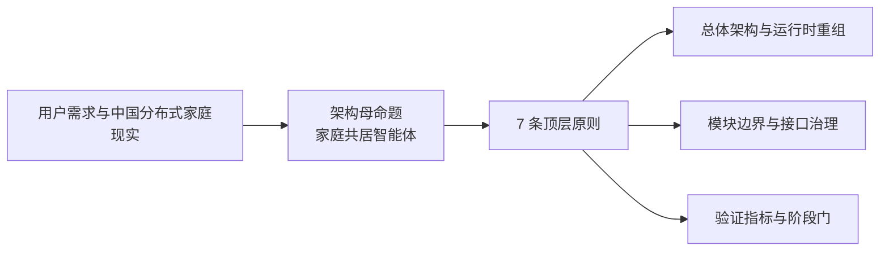

# 系统架构原则

---

文档版本：v2.1
创建日期：2026-03-08
作者：用户

文档变更记录：
- v2.1 | 2026-04-07 | Codex-架构师 | 按 `Phase 4.5` 补入附录 B，新增“第 8 条原则候选：具身智能体的主动生成义务”，但不改动当前 `7` 条正式原则。
- v2.0 | 2026-04-06 | Codex-架构师 | 按“家庭共居智能体”革新路线 `Phase 1` 完全重写正文主体，将本文从通用系统工程原则集升级为 Kinbot 专属原则层，并把可继承的通用原则下沉为附录。
- v1.1 | 2026-03-22 | 用户 | 修订文档作者归属，并将本文档纳入当前主线版本维护。
- v1.0 | 2026-03-08 | Codex-架构师 | 文档创建。

---

## 1. 文档定位

本文档用于定义 Kinbot 当前主线在“家庭共居智能体”方向上的**系统架构原则层**。

它回答的不是：

- 某个模块具体怎么实现
- 某个状态机怎样切图
- 某个实体最终长什么样

它回答的是：

- Kinbot 当前系统架构到底在为什么目标服务
- 哪些原则已经足够上升为系统级硬约束
- 后续总体架构、运行时层、模块方案和验证指标应如何受这些原则约束

本文档是当前主线的正式原则层输入，优先级低于用户需求输入与决策记录，高于下游模块设计与实现性拆解。

## 2. 适用边界

本文档当前适用于：

1. `P1 / PDCP` 系统架构主线
2. `KBT-32` 总体方案与模块方案下发基线
3. 后续“新总框架 -> 运行时重组 -> 数据模型决策 -> 验证口径”收敛过程

本文档当前**不直接冻结**以下事项：

1. `World State 9 -> 7` 是否作为主线正式重组
2. `CareRelationship / CareEvent` 是否进入主线实体层
3. 新总框架的最终命名是否永久固定
4. `V1` 收缩版的最终模块裁剪方案

这些内容仍需在后续专题文档和评审节点中单独收敛。

## 3. Kinbot 架构母命题

> Kinbot 不是以单次任务成功率为中心的家庭服务机器人，而是面向中国分布式家庭，通过具身在场维持家庭生活连续性、承接照护责任、保护成员主体性，并在长期共居中形成可信关系的家庭共居智能体。

这一定义意味着：

1. 顶层目标不再是“单任务最优”，而是“家庭生活连续性”；
2. 机器人不是单纯的功能执行器，而是长期在场的家庭参与者；
3. “健康、陪伴、安全、服务”都应被重写为共同服务于家庭生活连续性的能力面；
4. 一代仍必须服务量产预备目标，但不能再把旧 `OODA` 当作不可触动的唯一总框架。

## 4. 顶层原则图

## 5. 七条顶层架构原则

### 5.1 生活连续性优先于局部任务最优

Kinbot 的系统首要目标，是保证家庭日常不失控、异常可恢复、照护不断线，而不是把导航、提醒、问答、递送等单点能力分别做到局部最优。

直接约束：

1. 任何模块设计都必须回答“局部失败后如何恢复到家庭可接受状态”。
2. 运行时设计必须显式支持异常吸收、状态恢复、接力链和断点续接。
3. 验收指标不能只看任务成功率，还必须看连续性、恢复性和服务不中断能力。

### 5.2 具身在场是核心价值

Kinbot 的价值不只来自“懂”，还来自“在场”。移动、等待、观察、靠近、让行、静默出现、低存在感巡护，都是产品核心能力，不是交互外壳。

直接约束：

1. 本体实体架构不能把头部主动观察、空间站位、靠近礼仪和让行动作降为体验细节。
2. 运行时层必须支持不同强度的在场策略，而不是只有“执行任务 / 不执行任务”两态。
3. 任何裁剪都必须复核是否伤害“聪明、温暖、精致”的高端产品感。

### 5.3 关系是长期结果，不是预设功能

信任、亲近、依赖与分寸感，不应由一个孤立的“陪伴模块”生成，而应由长期可靠、克制、可解释、可恢复的行为积累而来。

直接约束：

1. 关系质量应进入验收与长期评估，但不应被冻结为新的超级中心引擎。
2. 记忆、节奏、主动性和互动风格要围绕长期结果设计，而不是围绕短期情绪刺激设计。
3. 关系形成必须服从主体性保护、权限边界和低打扰共居约束。

### 5.4 主体性与尊严不可让渡

机器人可以辅助、提醒、协调、接力，但不能以效率之名默默接管人的生活。

直接约束：

1. 授权、拒绝、纠错、删除、解释和回退能力必须进入系统底层约束。
2. 高风险主动行为必须带有明确授权链、审计链和回滚路径。
3. 记忆与照护能力必须帮助人维持生活，而不是替人决定生活。

### 5.5 家庭必须被建模为多角色责任网络

Kinbot 面对的不是单用户系统，而是老人本人、子女、保姆、访客、平台、社区和人工服务共同参与的责任网络。

直接约束：

1. 权限模型不能再停留在“用户 / 管理员”二元模型。
2. 系统必须显式建模责任主体、升级链、冲突确认和跨角色信息边界。
3. 远程在场、异步参与和责任接力应被视为中国分布式家庭的基本事实。

### 5.6 低打扰共居能力必须作为顶层能力建模

会不会打扰、懂不懂分寸、是否尊重空间礼仪、生活节奏和情绪状态，不是体验微调，而是家庭机器人能否长期留在家中的生死线。

直接约束：

1. “低打扰”必须进入状态、调度、策略和验收体系。
2. 主动靠近、主动打断、夜间行为、静默观察、空间进入都必须有明确礼仪边界。
3. 任何主动性增强都必须先通过“是否更像家人而不是更像侵入者”的复核。

### 5.7 系统采用分层约束与局部融合的运行时原则

`OODA` 不再承担总架构角色，而退到具身运行时层。运行时层允许跨环融合，允许 `Orient + Decide` 融合，允许局部端到端化，但不得绕开系统级边界。

直接约束：

1. 不再要求 `Observe / Orient / Decide / Act` 一一映射为稳定模块边界。
2. 允许多执行范式共存，包括离散决策、连续流式、事件驱动和长周期演化。
3. 安全、授权、恢复、审计和责任边界必须始终保持系统级约束地位。

## 6. 原则到架构决策的映射规则

| 原则 | 在架构中的必备表达 | 评审时必须回答的问题 |
| --- | --- | --- |
| 生活连续性 | 恢复链、降级链、接力链、不中断能力 | 这个设计在局部失败时如何保证家庭生活不断线？ |
| 具身在场 | 本体实体架构、在场策略、空间与时机控制 | 这个设计是否仍然把机器人当作真实在场主体？ |
| 关系是长期结果 | 长期行为积累、记忆治理、关系质量评价 | 这个设计是在堆陪伴功能，还是在积累可信关系？ |
| 主体性与尊严 | 授权、解释、纠错、删除、回退与审计 | 这个设计会不会让机器人默默替人做决定？ |
| 多角色责任网络 | 权限模型、责任模型、升级链与冲突确认 | 这个设计是否能处理老人、子女、保姆与平台之间的责任关系？ |
| 低打扰共居 | 礼仪边界、静默策略、主动性上限、时机判断 | 这个设计会不会让机器人更容易打扰家庭？ |
| 分层约束 + 局部融合 | 运行时分层、跨环融合、系统级硬边界 | 这个设计是否在前瞻融合时仍保住了安全和治理边界？ |

## 7. 对当前主线的正式影响边界

当前原则层重写已经正式确认以下影响：

1. `OODA` 不再作为 Kinbot 的唯一总架构中心；
2. `OODA` 仍保留为运行时层的重要分析框架和离散决策范式；
3. 现有 `PDCP` 双视角基线继续保留，但后续需与新原则层重映射；
4. `KBT-32 / KBT-33` 后续评审必须显式对齐新的原则层。

当前原则层重写**尚未**正式确认以下影响：

1. `World State` 一定改为 `9 -> 7`；
2. `CareRelationship / CareEvent` 必定替代现有实体；
3. 所有下游文档都必须立即重写；
4. 当前主线已经完成从 `V1` 到下一代的完整反推。

## 8. 架构评审与下发使用方式

从本版开始，任何进入主线冻结的系统级文档，至少要完成以下检查：

1. 是否能映射回本文件的 `7` 条顶层原则；
2. 是否明确了“哪些结论是 confirmed，哪些仍是 provisional”；
3. 是否解释了与当前 `PDCP` 双视角基线的关系；
4. 是否说明了运行时层中哪些部分允许融合、哪些边界绝不能穿透；
5. 是否说明了对量产预备目标、资源约束和高端产品感的影响。

## 9. 附录：继承保留的通用系统工程原则

以下通用原则仍然保留，但不再作为正文主体，而是作为 Kinbot 专属原则层的补充方法论：

| 原通用原则 | 当前保留方式 | 在 Kinbot 中的使用边界 |
| --- | --- | --- |
| 系统问题陈述原则 | 保留 | 用于持续校正“我们到底在解决什么问题” |
| 聚焦原则 | 保留 | 用于防止架构层面失焦和问题膨胀 |
| 分解原则 | 保留 | 用于顶层结构、模块和责任边界拆解 |
| 表面复杂度原则 | 保留 | 用于控制顶层实体和模块数量在可协作范围内 |
| 必备复杂度原则 | 保留 | 用于判断哪些复杂度是必要的，哪些只是遗留噪声 |
| 架构决策原则 | 保留 | 用于识别应提前冻结的高代价决策 |
| 产品进化原则 | 保留 | 用于处理 `V1 -> V2` 演进与接口预留 |
| 架构健壮程度原则 | 保留 | 用于韧性、降级和适应性设计 |
| 遗留元素复用原则 | 保留 | 用于吸收旧 `OODA` 主线、`PDCP` 双视角和现有桥接素材 |

这些原则仍然有效，但其优先级已经低于本文正文中的 Kinbot 专属原则层。

## 10. 附录 B：第 8 条原则候选

以下内容当前只作为 `Phase 4.5` 的候选补强方向，不进入已冻结的 `7` 条正式原则。

### 10.1 候选原则

**具身智能体必须具备结构化的主动生成能力。**

含义是：

1. 机器人不仅应安全、克制、可信；
2. 机器人还应在合规和授权边界内主动生成新的照护建议、关系记忆和惊奇时刻；
3. 这种主动生成能力应成为长期价值的一部分，而不是偶发附属体验。

### 10.2 为什么当前只放入候选区

因为当前主线已经冻结了 `7` 条原则，且 `Phase 1-4` 已按这 `7` 条原则展开。

因此本轮只允许：

1. 把该原则作为候选补强记录；
2. 在后续验证中观察其是否值得上升为正式原则；
3. 不得把它伪装成已经冻结的正式硬约束。
