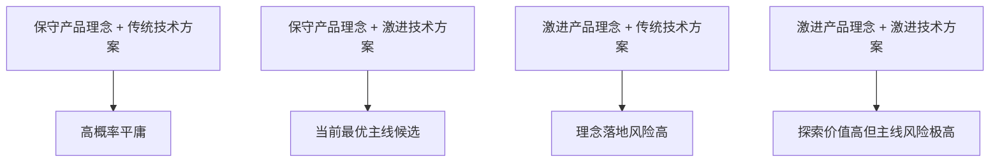

# Kinbot产品、体系、技术与商业理念四轴评估提案

---

文档版本：v1.1
创建日期：2026-03-15
作者：Codex-架构师

文档变更记录：
- v1.1 | 2026-04-02 | Codex-架构师 | 规范四轴定义与商业成功概率两张表的排版格式，并补齐文档头部版本维护信息。

---

## 1. 文档目的

本文档用于回答一个上位问题：

当前 Kinbot 从产品理念、体系理念和技术理念上分别属于保守、创新还是激进；这样的组合是否有较高概率获得商业成功；后续产品应该如何通过调整理念组合，提升商业成功概率。

本文档在三轴判断的基础上，正式补入第四轴：

`商业理念`

原因很直接：一款机器人产品的商业成败，不能只由产品、体系和技术三个维度解释，还必须回答“谁付钱、谁交付、谁服务、如何复购、是否可复制”。

因此，本文档正式提出：

Kinbot 后续应采用 `产品理念 / 体系理念 / 技术理念 / 商业理念` 的四轴评估框架。

## 2. 评估框架

### 2.1 四轴定义

| 维度   | 关注问题            | 保守             | 创新               | 激进                    |
| ---- | --------------- | -------------- | ---------------- | --------------------- |
| 产品理念 | 对用户承诺了什么        | 价值清晰、场景收敛、边界克制 | 需求组合发生明显重构       | 重新定义用户行为和产品类别         |
| 体系理念 | 用什么系统形态兑现价值     | 单机或轻伴生系统       | 本体 + 伴生系统 + 服务协同 | 平台化、多主体深耦合、强运营依赖      |
| 技术理念 | 用多先进的技术去实现      | 成熟路线、低不确定性     | 行业领先但可控          | 前沿路线、多项关键技术同时赌注       |
| 商业理念 | 如何卖、谁付费、如何交付和复购 | 路径清晰但模式传统      | 渠道、支付方或服务模式有创新   | 依赖新支付结构、新监管范式或高强度运营教育 |

### 2.2 理念组合风险图

这张图只讨论 `产品理念 x 技术理念` 的主关系。真正的商业结果，还会被 `体系理念` 和 `商业理念` 二次放大或二次削弱。

## 3. 当前 Kinbot 的四轴判断

### 3.1 当前结论

| 维度 | 当前判断 | 结论 |
| --- | --- | --- |
| 产品理念 | 偏保守 | 场景、边界、主价值链已较清晰，但价值链条仍偏多 |
| 体系理念 | 创新偏激进 | 不是单机，而是完整机器人产品与服务系统 |
| 技术理念 | 激进 | 核心竞争力依赖前沿感知、语义理解、多尺度 OODA 与头部高集成设计 |
| 商业理念 | 偏保守但尚未收敛 | 当前默认心智更接近“高端机器人整机售卖”，但服务成本、渠道、支付方和复购逻辑仍不够清楚 |

### 3.2 为什么产品理念是偏保守

当前一代产品定义的保守性主要体现在：

1. 场景收敛到中国大陆居家养老，而不是泛家庭机器人。
2. 主价值排序已冻结为 `健康管理 > 陪伴交互 > 老人看护 > 家庭安全巡护`。
3. 系统边界明确为轮式移动交互机器人，不做机械臂与复杂物理操作。
4. 高风险动作遵守“安全 > 合规 > 用户指令”的优先级，并要求先授权再自主。

这些判断都说明：当前 Kinbot 并没有试图重新定义“机器人是什么”，而是在一个相对克制的产品边界里做深。

对应依据见：

- [用户需求输入](../../input/00_requirements/00_user_requirements_input.md)
- [总体架构](../02_p1_architecture/01_overall_architecture.md)

### 3.3 为什么体系理念是创新偏激进

当前 Kinbot 不是“本体加若干 App 支持”，而是显式采用了完整产品系统视角：

1. 机器人本体
2. 穿戴与健康外设
3. 家属 App
4. 云服务
5. 后台人工服务
6. 智能家居
7. 外部医疗、药店、配送、社区和公共应急接口

这意味着你要交付的不是一个硬件，而是一整套服务系统。

这在产品体验上是正确方向，但在组织、责任、交付和成本上都显著更重，所以评价应是：

`创新偏激进`

### 3.4 为什么技术理念是激进

当前技术路线的激进性并不主要来自单一模型，而来自多项前沿路线叠加：

1. 多尺度、并发、可中断、可动态调度的 `OODA`
2. `World State` 统一状态平面
3. 头部作为高带宽感知、交互与差异化亮点
4. `VLM / VLN / 多模型混合 / 规则混合` 的协同判断
5. 端侧多模态推理与服务协同
6. 健康闭环、陪伴闭环、安全闭环、服务闭环并行

这不是传统家电技术路线，也不是纯软件助手路线，而是明显偏激进的具身智能系统路线。

### 3.5 为什么商业理念仍偏保守且尚未收敛

当前商业侧的默认心智更接近：

1. 做出一款高端机器人整机
2. 定价支撑约 `20000 到 30000 元`
3. 通过整机能力和服务能力一起拉高用户感知价值

问题在于，当前商业链条里还有几件事没有完全冻结：

1. 主要支付方是谁，是老人家庭、子女、机构、社区、保险，还是复合支付。
2. 首发主渠道是什么，是纯 `B2C`、`B2B2C`，还是 `G2B2C / 医养合作`。
3. 后台人工服务、外部履约和长期售后由谁承担成本。
4. 复购与续费来自哪里，是设备升级、服务订阅、增值服务，还是渠道复采。

因此，当前商业理念不能评价为“创新成熟”，更像是：

`偏保守但尚未收敛`

## 4. 当前 Kinbot 的商业成功概率判断

### 4.1 先定义“商业成功”

本文档中的“商业成功”不等于：

1. 做出样机
2. 完成演示
3. 获得少量试点订单

本文档中的“商业成功”指：

1. 形成可复制销售
2. 形成稳定交付
3. 服务成本可控
4. 有续费、复购或渠道复制能力
5. 在 `2 到 3` 年窗口内建立持续经营能力

### 4.2 概率判断

以下判断是基于当前架构、组织和市场信号做出的工程推断，不是统计学预测：

| 目标             | 当前概率判断      | 说明                          |
| -------------- | ----------- | --------------------------- |
| 做出有说服力的一代产品与试点 | `60% 到 75%` | 你们已有样机、组织基础和明确架构主线          |
| 做出小规模付费样板      | `40% 到 55%` | 取决于试点体验、渠道选择和服务链条收敛         |
| 做成可持续商业成功产品    | `25% 到 40%` | 核心风险在商业链路、交付复杂度和服务成本，而不只是技术 |

如果一代直接以纯 `B2C` 高端整机逻辑切入，并同时把健康、陪伴、安全和服务能力全部做重，则第三项成功概率更接近区间下沿。

### 4.3 为什么不是更低

当前有四个明显正因素：

1. 中国老龄人口规模足够大。国家统计局解读显示，`2025` 年末中国 `60` 岁及以上人口为 `32338` 万人，占比 `23.0%`。
2. 国家层面正在推动银发经济和养老服务体系建设。
3. `2025 到 2027` 年正处于智能养老服务机器人试点和应用验证窗口。
4. 养老辅助机器人相关国际标准已经开始形成。

这些都说明：需求面和政策面是真实存在的。

### 4.4 为什么也不是更高

当前也有四个明显负因素：

1. 市场仍在验证期，不在放量成熟期。
2. 你的体系过重，本体之外还叠了穿戴、云、App、人工服务和外部履约。
3. 当前国际标准明确这类 AAL 机器人不适用于医疗用途，这意味着产品对外承诺必须很克制。
4. 全球服务机器人在增长，但增长更明确的仍是专业服务机器人，不是居家养老机器人已经完成主流消费验证。

结论：

当前 Kinbot 的短板主要不是“技术不够激进”，而是“商业理念和体系收敛速度还不够快”。

## 5. 后续产品如何通过理念设计提升成功概率

### 5.1 正式建议：后续不再只看三轴，而是按四轴设计产品

后续每代产品都应在立项时回答：

1. 产品理念是保守、创新还是激进
2. 体系理念是单机、系统还是平台生态
3. 技术理念是成熟、领先还是激进
4. 商业理念是传统、创新还是高不确定性

只有四轴一起看，才能避免出现以下错配：

1. 保守产品 + 传统技术 + 模糊商业
2. 激进产品 + 激进技术 + 激进商业
3. 产品承诺很克制，但系统过重、服务过重、交付过重

### 5.2 一代主销线的建议组合

建议一代主销线采用：

`保守产品理念 + 创新但收敛的体系理念 + 激进但内化的技术理念 + 极度清晰的商业理念`

具体含义：

1. 产品上继续坚持“陪伴式健康守护”，不扩成全能家庭机器人。
2. 体系上保留完整闭环，但外部服务尽量模块化、可插拔。
3. 技术上继续激进，但激进性主要体现在内部体验质量，而不是外部承诺。
4. 商业上必须优先冻结支付方、渠道、安装交付和服务成本模型。

### 5.3 一代半放量线的建议组合

建议一代半放量线采用：

`保守偏创新的产品理念 + 中度创新的体系理念 + 领先但受控的技术理念 + 创新的商业理念`

目标不是更炫，而是：

1. 更轻
2. 更稳
3. 更便宜
4. 更容易交付
5. 更容易解释价值

### 5.4 二代探索线的建议组合

只有在一代主销线商业逻辑跑通后，才建议把二代探索线拉向：

`创新甚至偏激进的产品理念 + 更强的平台体系理念 + 激进技术理念 + 独立试验型商业理念`

这条线适合探索：

1. 更强的主动关系能力
2. 更高频的长期陪伴
3. 更激进的自主行为边界
4. 更大胆的人机关系设计

但不建议把这条线与主销量产线共用同一套收入预期。

## 6. 对当前 Kinbot 的直接建议

### 6.1 当前最优调整方向

当前不是要把产品理念做得更激进，而是要把商业理念做得更清楚。

对当前 Kinbot，我的建议是：

1. 保持产品理念保守
2. 让体系理念从“创新偏激进”向“创新但更收敛”移动
3. 保持技术理念激进，但把激进性更多藏在内部能力
4. 让商业理念从“偏保守但模糊”收敛到“清晰、可复制、可交付”

### 6.2 当前最该补的不是技术，而是商业定义

当前最值得优先冻结的不是再多一个模型方向，而是以下四件事：

1. 首发主渠道
2. 首发主支付方
3. 服务履约成本与边界
4. 设备收入、服务收入和增值收入的组合方式

如果这四件事不清楚，再先进的系统架构也会在商业化阶段被拖垮。

## 7. 参考依据

以下是本文判断时参考的外部信号：

1. 国家统计局对 `2025` 年人口数据的解读：`60` 岁及以上人口 `32338` 万人，占比 `23.0%`。  
   来源：<https://www.stats.gov.cn/xxgk/jd/sjjd2020/202601/t20260119_1962338.html>
2. 国务院办公厅《关于发展银发经济增进老年人福祉的意见》。  
   来源：<https://www.gov.cn/yaowen/liebiao/202401/content_6926137.htm>
3. 工业和信息化部、民政部关于开展智能养老服务机器人结对攻关与场景应用试点，试点期为 `2025 到 2027` 年。  
   来源：<https://www.gov.cn/lianbo/bumen/202506/content_7027051.htm>
4. `IEC 63310:2025`，AAL connected home 环境下养老辅助机器人功能性能标准；标准明确不适用于医疗用途。  
   来源：<https://webstore.iec.ch/en/publication/66358>
5. 国际机器人联合会 `IFR` 关于 `2025` 年专业服务机器人增长的公开信息。  
   来源：<https://ifr.org/ifr-press-releases/P49>

说明：

1. 上述市场与政策信息用于判断赛道成熟度、试点窗口和标准化进程。
2. 本文中关于“成功概率”的区间属于架构层工程推断，不是外部机构发布的数据结论。
