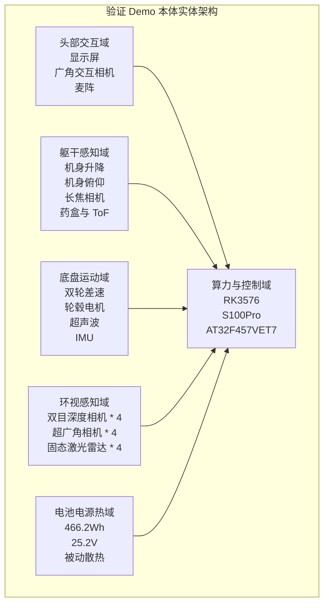
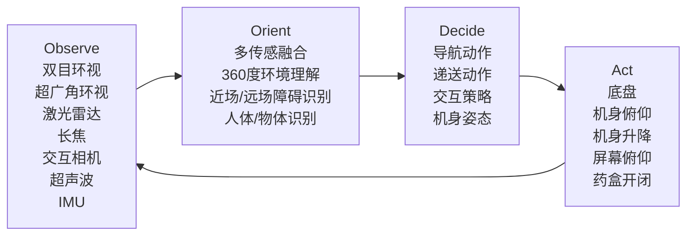

# 验证 Demo 系统架构还原与产品继承评估

---

文档版本：v1.0
创建日期：2026-03-22
作者：Codex-架构师

文档变更记录：
- v1.0 | 2026-03-22 | Codex-架构师 | 基于 `input/00_requirements/03_kinbot_parameters_id_e.csv` 还原验证 Demo 的系统架构，并评估其对 Kinbot 产品架构的可继承项与必须抛弃项。

---

## 1. 文档目的

本文档用于回答 4 个问题：

1. [input/00_requirements/03_kinbot_parameters_id_e.csv](../../input/00_requirements/03_kinbot_parameters_id_e.csv) 所描述的“验证平台-ID 方案 E”到底是一套什么样的系统架构。
2. 这套验证 Demo 的设计意图是什么，它更像产品架构，还是更像技术验证平台。
3. 它相对当前 Kinbot 一代主线架构的主要优势和主要问题分别是什么。
4. 哪些设计适宜继承到 Kinbot 产品系统架构，哪些设计必须明确抛弃。

本文档的分析对照基线主要参考：

- [docs/02_p1_architecture/01_overall_architecture.md](../02_p1_architecture/01_overall_architecture.md)
- [docs/02_p1_architecture/02_pdcp_system_architecture_review_package.md](../02_p1_architecture/02_pdcp_system_architecture_review_package.md)
- [docs/03_p2_feasibility/01_overall_solution_and_module_design_baseline.md](../03_p2_feasibility/01_overall_solution_and_module_design_baseline.md)
- [docs/03_p2_feasibility/04_hardware_software_selection_matrix.md](../03_p2_feasibility/04_hardware_software_selection_matrix.md)
- [docs/03_p2_feasibility/05_cost_structure_and_technology_downpath.md](../03_p2_feasibility/05_cost_structure_and_technology_downpath.md)

## 2. 总体结论

### 2.1 一句话结论

这不是一套适合直接量产的产品架构，而是一套典型的“重传感、重冗余、重执行器”的验证平台架构。它的价值主要在于：

- 快速验证家庭场景中的全向感知、安全冗余和交互姿态；
- 为后续纯视觉路线建立对比基线和真值参考；
- 把“头部 / 躯干 / 底盘 / 储物仓 / 交互 / 安全”这些本体能力先在一台高配平台上跑通。

如果把它当作当前 Kinbot 产品架构直接继承，会在成本、重量、热设计、复杂度和高端产品感上全面失控；但如果把它理解为“验证平台”，它其实非常有价值。

### 2.2 当前判断

我对这套 Demo 的定位判断是：

- 产品理念：中性，不算激进，但对“家庭机器人应该具备哪些能力”做了较完整的探索。
- 体系理念：偏激进，明显是在做一整套机器人本体能力验证，而不是单点技术验证。
- 技术理念：激进，尤其体现在全向视觉、全向主动传感、异构算力、可动本体和多重冗余上。
- 工程实现：更像研发验证平台，不像量产基线。

因此，这套方案最适合被定位为：

`高冗余验证 Demo 平台 = 产品架构输入源 + 纯视觉研发对比基线 + 本体能力验证载体`

而不应被定位为：

`Kinbot 一代量产架构前身`

## 3. 输入还原与当前假设

### 3.1 已可直接还原的系统事实

从参数表中，可以直接还原出以下系统事实：

- 算力与控制：
  - `RK3576`
  - `S100Pro`
  - `AT32F457VET7`
- 执行器：
  - 屏幕俯仰电机 `1`
  - 药盒开闭电机 `1`
  - 机身俯仰推杆电机 `1`
  - 机身升降推杆电机 `1`
  - 底盘轮毂电机 `2`
- 感知硬件：
  - 双目深度环视相机 `4`
  - 超广角短焦环视相机 `4`
  - 长焦相机 `1`
  - 固态激光雷达 `4`
  - 小面阵 `ToF` `1`
  - 超声波 `2`
  - 高精度 `IMU` `2`
- 交互硬件：
  - 广角交互相机 `1`
  - 环形 `6` 麦阵 `1`
  - 环形 `8` 麦阵 `1`
  - `2K` 显示屏 `1`
- 整机约束：
  - 尺寸约 `1139 * 500 * 600 mm`
  - 升起高度约 `1209 mm`
  - 重量 `70kg`
  - 自由度 `5`
  - 电池约 `466.2Wh`
  - 双轮差速底盘
  - 最高速度 `1.4m/s`
  - 被动散热

### 3.2 当前用于架构还原的工作假设

以下 4 条并未在参数表中被完整明写，但基于表格内容可做当前最合理的架构假设：

1. `RK3576` 主要承担交互主控、屏幕、音频链和近实时的人机交互任务。
2. `S100Pro` 主要承担多相机感知融合、环境理解和较重的端侧 AI 计算。
3. `AT32F457VET7` 主要承担电机、执行器、底盘和安全相关的实时控制。
4. `4` 组双目环视相机与 `4` 组超广角环视相机是两套独立模组，而不是同一模组内的不同镜头。

### 3.3 当前待确认项

以下 4 点建议你后续确认，我这次先按上面的假设还原：

1. `RK3576 / S100Pro / AT32F457VET7` 的实际职责分配是否就是“交互主控 / 感知 AI / 实时控制”三分结构。
2. `4` 组双目环视相机与 `4` 组超广角相机是否确实是 `8` 个独立视觉模组。
3. `6` 麦阵和 `8` 麦阵的分工是否分别对应近场交互与更强远场拾音。
4. `466.2Wh + 被动散热` 是真实实装配置，还是阶段性目标参数。

## 4. 验证 Demo 的系统架构还原

### 4.1 它的设计意图

从参数表反推，这套 Demo 的真正设计意图不是“做一台轻量产品原型”，而是：

1. 用一台本体能力很全的机器人，把家庭场景中的核心闭环尽可能都先跑通。
2. 用高冗余感知覆盖家庭场景中最容易出事故和最难做稳的区域：
   - 全向环视
   - 地面近障
   - 远距离找人 / 找物
   - 药盒前方避障
3. 用较完整的可动本体验证“头部、机身姿态、升降、药盒弹出、底盘移动”这些交互和递送动作。
4. 用主动传感建立安全冗余和研发真值参考，而不是一开始就赌纯视觉。

所以这套 Demo 的核心关键词不是“量产”，而是：

`全向感知`
`动作姿态验证`
`安全冗余`
`研发对比基线`

### 4.2 本体实体架构视图

按当前参数表，这套 Demo 最接近下面这种本体实体架构：

这说明它已经天然具备了后来 Kinbot 主线里强调的“空间位置模块化”雏形：

- 头部
- 躯干
- 底盘
- 环视感知圈
- 算力控制中心
- 电池电源热系统

### 4.3 运行时功能架构视图

如果按运行时功能来看，这套 Demo 更像一条“高冗余 Observe 驱动的单机闭环系统”：

它和当前 Kinbot 主线最大的差异在于：

- 当前 Kinbot 主线是“纯视觉 + 服务可收缩 + 成本强约束”的系统架构；
- 这套 Demo 是“主动传感 + 高冗余 + 本体动作全开”的验证平台架构。

### 4.4 这套 Demo 实际验证了什么

从器件组合看，它主要在验证 6 类东西：

1. `360°` 家庭空间观察与近障安全冗余。
2. 前后左右桌面、人、异形障碍和地面死角的覆盖能力。
3. 中远距离找人 / 找物 / 身份识别的可行性。
4. 头部显示、语音、姿态变化带来的陪伴和交互效果。
5. 机身升降、俯仰和药盒弹出带来的递送体验。
6. 高感知冗余下的导航、安全和家庭场景鲁棒性。

这也解释了为什么它会显得“过重”：

- 它不是先在产品约束下做最简系统，
- 而是先做了一个尽量不留盲区的能力验证平台。

## 5. 这套 Demo 的主要优势

### 5.1 优势一：它把家庭场景最难的安全问题用硬件冗余先兜住了

`4` 组双目深度相机、`4` 组超广角相机、`4` 个固态激光雷达、`2` 个超声波，再加 `ToF` 和双 `IMU`，几乎把家庭近场移动中最容易出问题的盲区都覆盖了。

这对验证平台非常有价值，因为它可以快速回答：

- 机器人到底能不能在真实家庭里稳定移动；
- 哪些危险是视觉看不稳的；
- 哪些场景需要额外真值参考。

### 5.2 优势二：它把“近场 / 中场 / 远场 / 交互视角”分层了

这套 Demo 的感知不是平铺的，而是带有明确层次：

- 环视双目：负责空间与障碍主感知
- 超广角：负责地面和近距补盲
- 长焦：负责中远距找人和识别
- 交互广角：负责人脸、手势、桌面与 `OCR`

这个“按任务切感知”的思路是对的，后续应继承的是这种任务分层，而不是这套器件数量。

### 5.3 优势三：它验证了可动本体在交互和递送中的价值

这台 Demo 没有把机器人做成“会移动的音箱”，而是显式验证了：

- 屏幕俯仰
- 机身俯仰
- 机身升降
- 药盒开合

这意味着它在验证的不是单纯导航，而是“移动 + 到人 + 调姿 + 递送 + 交互确认”的复合动作链。

这对 Kinbot 的产品方向很有价值，因为你当前主线并不是扫地机式产品，而是带陪伴和健康闭环的移动交互机器人。

### 5.4 优势四：它天然适合作为纯视觉路线的研发对比真值链

你现在已经决定：

- 一代量产坚持纯视觉；
- 深度相机 / 激光雷达只做研发对比基线与真值参考；
- 如果纯视觉不过线，就延迟节奏，而不回退传感路线。

在这个大前提下，这套 Demo 的价值反而更明确了：

- 它不是产品路线，
- 它是纯视觉路线成功所需要的研发对照平台。

## 6. 这套 Demo 的主要问题

### 6.1 问题一：它是典型的“验证平台成本结构”，不是产品成本结构

它同时堆了：

- `4` 组双目深度相机
- `4` 组超广角相机
- `4` 个固态激光雷达
- `1` 个长焦
- `1` 个交互广角
- `1` 个 `ToF`
- 双麦阵
- 多执行器

这和当前一代 `BOM 5000 到 6000` 的主线完全不兼容。它的设计逻辑是“先把能力做出来”，不是“先把产品做成”。

### 6.2 问题二：整机过重，明显破坏产品感

`70kg` 的整机重量，对家庭养老机器人来说过重。

它会直接带来：

- 空间压迫感
- 安装 / 搬运 / 售后难度上升
- 电池与底盘成本上升
- 高端产品感下降

这和你现在反复强调的“聪明、温暖、精致”有明显冲突。

### 6.3 问题三：主动传感冗余太强，不适合当前纯视觉主线

当前产品架构已经冻结：

- 量产主线是纯视觉
- 深度相机 / 激光雷达不进入产品 fallback

而这套 Demo 本质上是把主动传感器作为主感知骨架的一部分。它可以保留为研发真值参考链，但不能再被当成产品架构的默认出发点。

### 6.4 问题四：执行机构过多，不利于一代产品收敛

它把以下 5 条动作链都做成了电动化：

- 屏幕俯仰
- 药盒开闭
- 机身俯仰
- 机身升降
- 底盘移动

这对验证平台有价值，但对一代产品来说，复杂度过高。量产时必须重新判断：

- 哪些动作链真的带来高频价值
- 哪些动作链只是“看起来厉害”

### 6.5 问题五：被动散热与当前器件堆叠的组合可信度不高

在三芯片、多相机、多激光雷达、较大电池的组合下，参数表仍写“被动散热”，这更像早期目标口径，而不是已经充分验证的工程结论。

对于验证平台这不一定是致命问题，但对于产品架构，这显然不能直接继承。

### 6.6 问题六：速度指标偏验证思路，不偏养老产品思路

底盘速度 `1.4m/s` 对家庭养老陪伴机器人明显偏高。

如果这是内部技术包线，可以理解；
如果它是产品默认速度目标，就不合理。

这再次说明，这份参数表更像研发能力上限，而不是一代产品默认体验参数。

## 7. 适宜沿用到 Kinbot 产品架构的设计

### 7.1 适宜沿用一：空间实体分解思路

这套 Demo 隐含的“头部 / 躯干 / 底盘”空间实体分解，适宜继续沿用。

尤其是：

- 头部负责交互与部分视觉
- 躯干负责储物仓、姿态与部分感知
- 底盘负责安全移动

这和你现在对 Kinbot 头部优先、仿生优先的思路是相容的。

### 7.2 适宜沿用二：异构算力 + 实时控制分层

把系统分成：

- 交互 / 应用主控
- 感知 / AI 主控
- 实时控制 MCU

这套分层思路适宜沿用。

不一定沿用同样三颗芯片，但“高层智能与底层安全控制分层”是正确的。

### 7.3 适宜沿用三：按任务而不是按器件去组织感知

适宜沿用的是下面这条方法：

- 近场障碍
- 地面补盲
- 中远距找人 / 找物
- 交互专用视角

后续可以用更少的相机来实现这组任务分层，但不应丢掉这套分工思路。

### 7.4 适宜沿用四：储物仓 / 递送闭环作为产品特征能力

药盒弹出与前方 `ToF` 的具体实现不必继承，但“储物仓是产品一等公民能力”这一点适宜沿用。

它已经证明：

- 健康管理不是只靠语音提醒；
- 递送 / 取药 / 开仓确认是有本体价值的。

### 7.5 适宜沿用五：主动传感只作为研发真值链

当前最应继承的不是激光雷达本身，而是这套研发方法：

- 用主动传感器做对照基线
- 用它们建立家庭复杂场景下的真值参考
- 让纯视觉在真实场景里有客观对比对象

这和你现在的产品策略完全一致。

## 8. 必须抛弃的设计

### 8.1 必须抛弃一：把高冗余主动传感当作一代产品主线

必须放弃：

- `4` 个固态激光雷达进入产品主线
- `4` 组双目深度相机进入量产依赖
- 用主动传感器给纯视觉做产品级兜底

这些只能留在研发阶段。

### 8.2 必须抛弃二：`70kg` 量级的整机质量

这不是可以优化的问题，而是方向上必须放弃。

如果产品仍然落在这个重量级，当前的高端、温暖、精致、家庭友好定位就会被明显破坏。

### 8.3 必须抛弃三：当前这套全执行器本体结构作为一代默认配置

必须放弃“全部都电动化”的默认思路。

一代量产要重新收敛：

- 哪个姿态自由度真正高频有价值
- 哪个自由度只是验证平台中的体验增强器

### 8.4 必须抛弃四：把验证平台速度包线直接当成产品体验参数

`1.4m/s` 这类速度上限不应直接继承为产品默认目标。

一代产品应以家庭安全、亲和感、夜间稳定性为优先，而不是展示型速度。

### 8.5 必须抛弃五：双麦阵长期并存的默认假设

对验证平台来说，双麦阵可以接受；对一代产品来说，默认保留 `6` 麦阵和 `8` 麦阵并存会显著增加：

- 声学结构复杂度
- 体积压力
- 成本压力
- 调试复杂度

后续应收敛为一套真正能支撑远场交互和产品外形的主阵列方案。

### 8.6 必须抛弃六：把 Demo 器件堆叠等同于系统架构

这条最重要。

当前 Demo 的真正价值在于验证“能力”和“约束”，不是把器件数量原样带进产品。

如果后续仍按 Demo 器件数量去理解产品架构，就会偏离你当前已经冻结的纯视觉、低 `BOM`、轻服务、强核心闭环主线。

## 9. 从 Demo 到 Kinbot 产品架构的正确转译方式

### 9.1 正确转译原则

我建议用下面这 4 条原则做 Demo 到产品的转译：

1. 保留能力，不保留器件堆叠。
2. 保留任务分层，不保留验证冗余。
3. 保留研发真值链，不保留产品 fallback。
4. 保留头部 / 躯干 / 底盘的空间架构，不保留全部执行自由度。

### 9.2 当前建议的转译关系

| Demo 设计 | 对 Kinbot 产品的处理建议 |
| --- | --- |
| 三芯片异构结构 | 保留“主控 + AI + 实时控制”分层思想，但不冻结为相同器件组合 |
| 双目深度环视 * 4 | 不继承器件数量；转译成量产主线的双目 + 单目 `RGB` 方案 |
| 固态激光雷达 * 4 | 仅保留为研发对照与真值链，不进入产品主线 |
| 长焦相机 * 1 | 不直接继承为默认量产件；其价值应转译为“中远距识别能力需求”重新论证 |
| 超广角相机 * 4 | 不直接继承数量；转译为地面补盲和近场感知需求 |
| 药盒与 ToF | 保留储物仓产品能力；是否保留专用 `ToF` 需重评 |
| 机身升降 + 机身俯仰 + 屏幕俯仰 | 保留“姿态表达”价值，但需重新收敛自由度 |
| 70kg 本体 | 方向上放弃 |
| 1.4m/s 底盘速度 | 方向上放弃为产品默认体验参数 |

## 10. 结论与建议

### 10.1 结论

这套验证 Demo 是一套很强的验证平台，但不是一套可直接演进成一代产品的系统架构。

它最值得保留的是：

- 空间实体分解
- 异构算力分层
- 任务分层感知
- 储物仓 / 递送能力
- 主动传感作为研发对照与真值链

它最必须抛弃的是：

- 高冗余主动传感作为产品主线
- 过重整机
- 全执行器本体
- 过高速度包线
- 器件堆叠式系统设计

### 10.2 对后续架构工作的直接建议

建议后续在主线文档中继续显式坚持以下口径：

1. Demo 是 `研发验证平台`，不是 `产品主架构前身`。
2. 纯视觉主线不动摇，激光雷达 / 深度相机只做研发对比真值链。
3. 头部 / 躯干 / 底盘的空间实体架构要继续强化，因为 Demo 已证明这条分解有价值。
4. 一代产品应保留“到人、递送、交互、确认”的闭环，但要用远比 Demo 简洁的器件与机构实现。
5. 如果后续要正式把 Demo 的经验纳入主线，下一步最值得单独产出的不是“再细化 Demo 器件”，而是：
   - `Demo 到一代产品的能力转译矩阵`
   - `纯视觉主线需要从 Demo 保留哪些真值链`
   - `头部 / 躯干 / 底盘的自由度收敛方案`

