# 总体架构

---

文档版本：v1.8
创建日期：2026-03-10
作者：Codex-架构师

文档变更记录：
- v1.8 | 2026-03-23 | Codex-架构师 | 吸收 Step41，将 AI 生产力工具进入 Kinbot 架构的意见收敛为“一代 Agent 增强平面”，明确长期记忆、技能化、连接器与受控任务编排进入一代主线，但不新增一级模块，也不将“自主创造新技能”写成一代正式承诺。
- v1.7 | 2026-03-23 | Codex-架构师 | 吸收最新架构收敛决策，刷新一代算力与控制域、纯视觉传感器组合、头部自由度、声学布局与底盘基线，并补充基于系统架构原则的正反面影响分析。
- v1.6 | 2026-03-22 | Codex-架构师 | 补入 Kinbot 在 `PDCP` 基线下的 `ConOps / OpsCon` 表达，用家庭元场景、关键任务线程、运行节点和运行模式图补强系统级架构说明。
- v1.5 | 2026-03-22 | Codex-架构师 | 吸收 Step38，补入验证 Demo 对纯视觉主线、空间架构和头部声学一体化的反向约束。
- v1.4 | 2026-03-20 | Codex-架构师 | 吸收硬件专家线程的最新内存价格反馈，明确一代量产默认内存线、前瞻验证线与 `L1 / L2 / L3` 的资源边界。
- v1.3 | 2026-03-17 | Codex-架构师 | 吸收 Step36，调整一代价值排序、BOM 目标、纯视觉对比基线、受控回流预留与三级能力模式。
- v1.2 | 2026-03-17 | Codex-架构师 | 补入一代纯视觉传感器架构提案并更新关键路径关注项。
- v1.1 | 2026-03-10 | Codex-架构师 | 吸收三线吸收法、需求侧硬约束与关系质量评价框架。
- v1.0 | 2026-03-10 | Codex-架构师 | 文档创建。

---

## 1. 文档定位

本文档是当前项目的总体架构总览文档。

它服务于两个目标：

1. 作为早期设计文档的回归基线，统一项目当前已经冻结的系统架构事实
2. 作为后续 `PDCP` 评审、总体方案下发和模块并行设计的总入口

这份文档不再承担所有细节展开职责。更细的结构、接口、状态机、功能域和工程化约束，分别下沉到对应专题文档。

## 2. 当前冻结边界

当前阶段已经明确：

1. 项目处于“产品需求基本完成后的系统架构设计与技术研判阶段”
2. 当前主线是 `P1 / PDCP`，而不是量产导入或发布准备
3. 当前首要目标是形成完整系统架构基线，并把它转成总体方案与模块下发基线

一代产品边界继续冻结为：

1. 中国大陆居家养老机器人
2. 主价值排序：健康管理 > 陪伴交互 > 家庭安全巡护 > 老人看护
3. 机器人不做机械臂和复杂物理操作
4. 机器人本体与伴生系统共同构成完整产品系统
5. 一代整体收敛策略为“核心闭环强、服务闭环轻、技术突破集中”

## 3. 产品系统边界

Kinbot 一代不是单一机器人本体，而是一个完整产品系统：

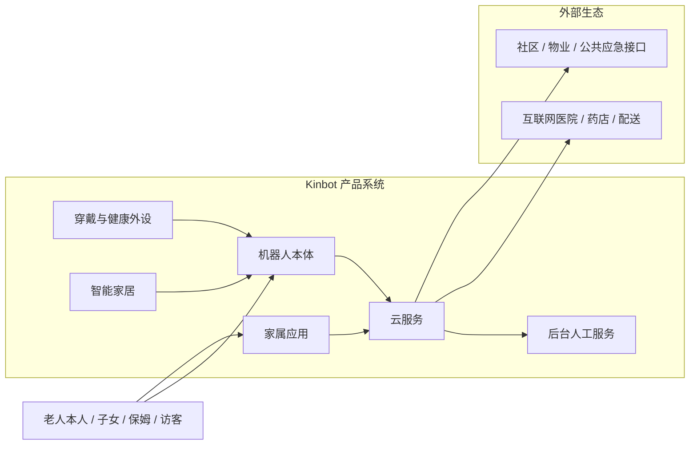

边界结论：

1. 机器人本体是目标系统核心
2. 穿戴、智能家居、家属应用、云服务、后台人工服务是伴生系统
3. 外部医疗、药店、配送、社区和公共应急接口属于外部生态，不进入一代自建边界

### 3.1 家庭元场景下的 `ConOps`

参考系统工程中 `ConOps` 的常见表达方式，Kinbot 当前更适合用“参与方 - 任务线程 - 场景循环”来描述其运行概念。

Kinbot 面对的不是单一功能场景，而是家庭元场景：

1. 同一家庭空间里并存陪伴、健康、安全、服务四类任务。
2. 同一用户在白天、夜间、异常和服务升级时，对机器人有完全不同的期望。
3. 用户购买的不是单一功能，而是“长期稳定地在家里提供价值”的系统。

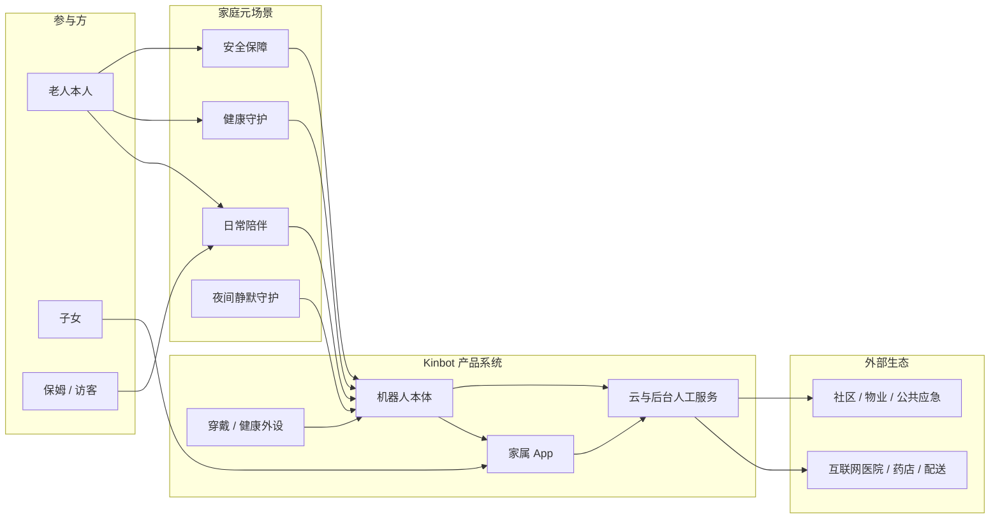

对一代而言，`ConOps` 的关键不是“能力越多越好”，而是明确 5 条主任务线程：

1. 日常陪伴线程：主动或被动陪伴交互，让机器人持续“在场”。
2. 健康守护线程：穿戴、问询、补采、提醒与健康事件判断。
3. 家庭安全线程：风险发现、运动安全、本地处置与必要升级。
4. 夜间静默线程：在不打扰用户的前提下持续守护，并在异常时突破静默。
5. 服务升级线程：当本地闭环不够时，引入 App、云、人工服务与外部生态。

### 3.2 一代关键任务线程 `ConOps` 图

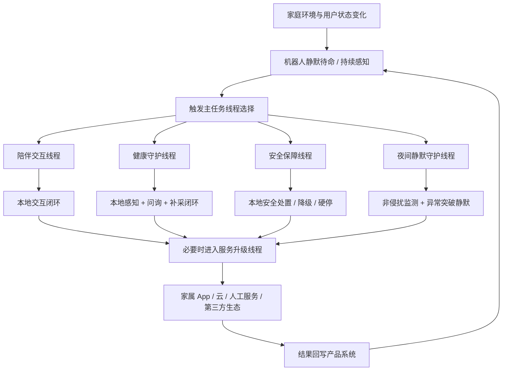

这张图表达的一代 `ConOps` 约束是：

1. 默认优先本地闭环，而不是默认升级到服务侧。
2. 夜间场景不是单独产品，而是所有线程都必须尊重的运行约束。
3. 服务升级是产品系统的一部分，但不是一代主价值的默认承载面。
4. 一代真正卖给用户的是“持续提供价值的任务线程”，而不是模块列表。

### 3.3 `OpsCon`：Kinbot 的运行节点与运行责任

如果说 `ConOps` 描述的是“系统如何在家庭里发挥价值”，那么 `OpsCon` 描述的是“这些价值由哪些运行节点、在哪些边界内被交付出来”。

当前一代 `OpsCon` 建议收敛为 `4` 个运行域：

1. 本体端侧闭环域
2. 伴生系统协同域
3. 人工与第三方服务域
4. 治理与持续演进域

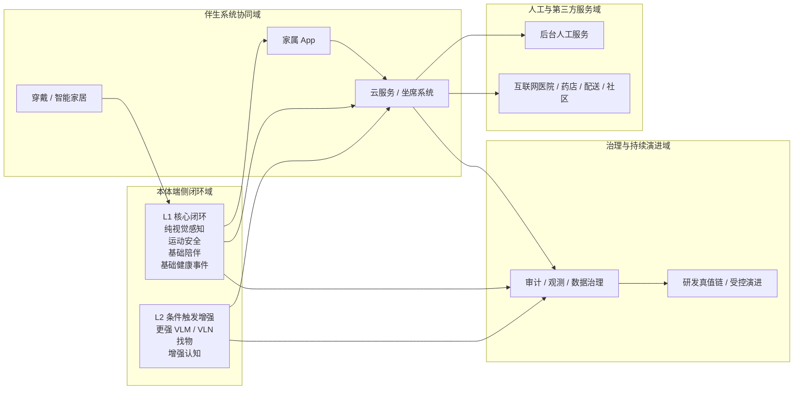

这张 `OpsCon` 图进一步固定了一代运行责任：

1. `L1` 必须在本体端侧闭环完成。
2. `L2` 可以条件触发，但不能反向拖重 `L1`。
3. `L3` 通过伴生系统和服务域协同提供，不应定义为“默认时刻都在线兜底”。
4. 治理与持续演进域不直接面对用户，但决定一代后续是否能持续优化。

### 3.4 `OpsCon` 运行模式图

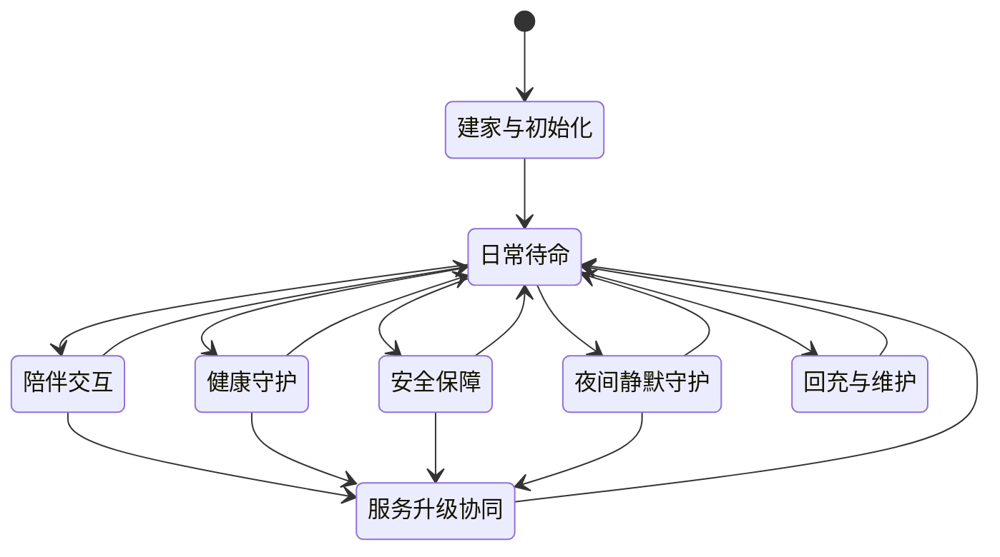

这张图强调的不是“软件状态机细节”，而是系统工程层的运行模式：

1. Kinbot 的默认态不是“持续执行任务”，而是“在家中持续待命并理解上下文”。
2. 陪伴、健康、安全和夜间静默是并列主模式，不是主次无关的功能菜单。
3. 服务升级协同是显式运行模式，必须被系统级建模。
4. 回充与维护不只是后勤动作，而是运行概念的一部分。

## 4. 双视角总体架构基线

当前系统架构已经不再只从软件分层表达，而是采用双视角基线：

1. 产品实体架构视图
2. 运行时功能架构视图

### 4.1 产品实体架构视图

机器人本体在系统架构层当前收敛为 `6` 个本体实体域：

1. 计算与控制核心
2. 移动底盘与运动执行
3. 环境与人体感知组件
4. 交互表达组件
5. 电池电源、热与本体安全
6. 储物仓、结构与外观

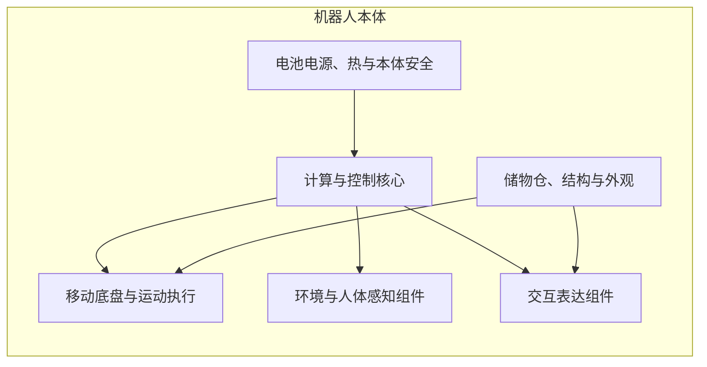

这张图表达的是产品实体，不是器件清单。它的作用是约束后续软件、算法、结构、整机和伴生系统方案必须共同回到同一个本体实体框架。

### 4.2 运行时功能架构视图

运行时功能架构继续冻结为 `9` 个一级模块：

1. `platform_runtime`
2. `mobility_navigation`
3. `human_health_sensing`
4. `multimodal_interaction`
5. `world_state_memory`
6. `decision_orchestration`
7. `safety_compliance_authorization`
8. `companion_service_system`
9. `observability_data_governance`

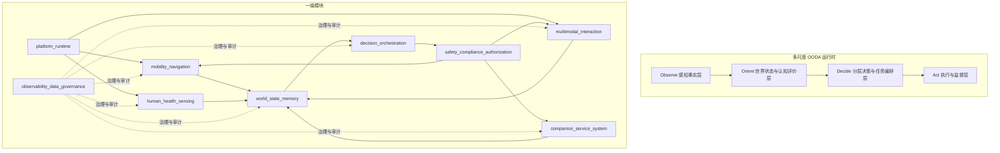

### 4.2.1 一代纯视觉传感器架构提案

基于当前量产主线收敛结果，一代传感器架构正式补入以下纯视觉主线提案：

1. 量产主线采用纯视觉路线，不把深度相机和激光雷达作为一代量产依赖。
2. 视觉传感器组合当前进一步收敛为“`1` 组双目 + `2` 个单目”的 `RGB` 方案；若后续补盲或工程验证确有必要，再在不破坏主线前提下谨慎扩展。
3. 深度能力优先通过自研深度估计、多目几何融合与时序同步补齐，而不是长期依赖昂贵主动传感器。
4. 低光 `ISP`、图像增强、自动标定与在线校正属于体系级能力，不是后续可有可无的实现细节。
5. 深度相机和激光雷达只作为研发阶段的对比基线与真值参考链路存在，不作为产品级 fallback。
6. 如果纯视觉路线在阶段门前无法达标，优先调整产品节奏，而不是回退到主动传感主线。

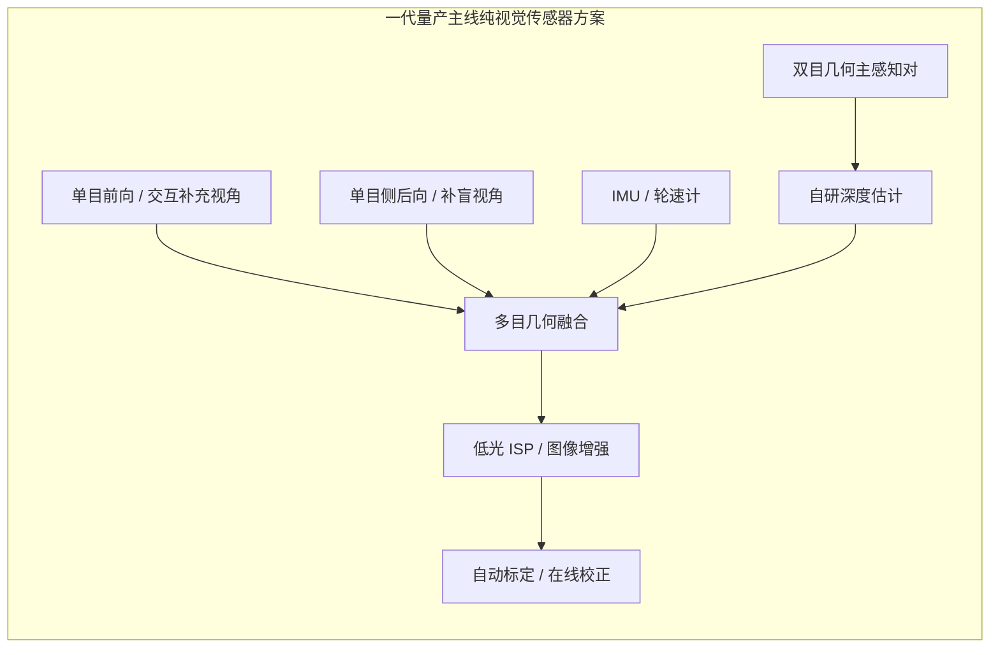

当前提案的体系含义是：

1. 相机布置优先服从“头部优先路线 `A`”，即优先把核心视觉器件集中在头部；若头部重量、热、视场或补盲无法闭合，再允许少量单目下放到躯干或尾部。
2. 纯视觉主线不是“少装传感器”这么简单，而是把感知成本压力从器件 `BOM` 转移到算法、标定、算力、功耗和夜间低照鲁棒性。
3. 该方案能够维持 `C2 相机与基础传感` 的成本区间，但会显著抬高 `C1` 端侧算力、`C5` 功耗与热设计，以及夜间闭环验证的优先级。
4. 基于当前 `LPDDR5 / eMMC` 价格口径，`C1` 的主矛盾已经进一步收敛为 `RAM / Flash` 成本，而不是单纯的芯片单价。
5. 因此，一代不能把“端侧更重多模态模型进入主线评估”和“量产默认配置”视为同义词；量产默认配置应先按 `8GB RAM + 64GB Flash` 约束，`12GB + 64GB` 仅作为边界验证线，`16GB + 64GB` 及以上只作为前瞻验证线或未来 `Pro SKU` 候选。
6. 这一主线要求 `mobility_navigation`、`human_health_sensing`、`platform_runtime` 和 `observability_data_governance` 共同承担验证责任，而不能只由视觉算法单线承担。

### 4.2.2 从验证 Demo 收敛到一代产品的当前硬件架构基线

基于最新收敛决策，一代产品当前建议采用如下硬件架构基线：

1. **算力与控制域**  
   功能上仍保留“交互 / 感知 / 实时控制”的分层思想，但硬件上收敛为“单主控 `SoC` + 实时控制 `MCU`”两芯片架构，不再维持 `RK3576 + S100Pro + MCU` 的三芯片表面复杂度。
2. **视觉与近场感知域**  
   当前视觉主线进一步具体化为 `1` 组双目 + `2` 个单目；`4` 固态激光雷达、`4` 超广角、底部超声波与药箱 `ToF` 不进入一代默认主线。
3. **头部与交互域**  
   相机优先布置在头部，头部自由度进一步增加，用主动观察能力去换取更少的固定视角数量，并提升拟人表达能力。
4. **声学域**  
   麦克风阵列收敛为 `1` 个，优先放置在头部；扬声器优先放在头部或接近头部的躯干位置。
5. **运动执行域**  
   不追求躯干复杂自由度；底盘可评估全向方案，但产品基线仍保留“两轮差速 + 全向轮”的稳健路线。

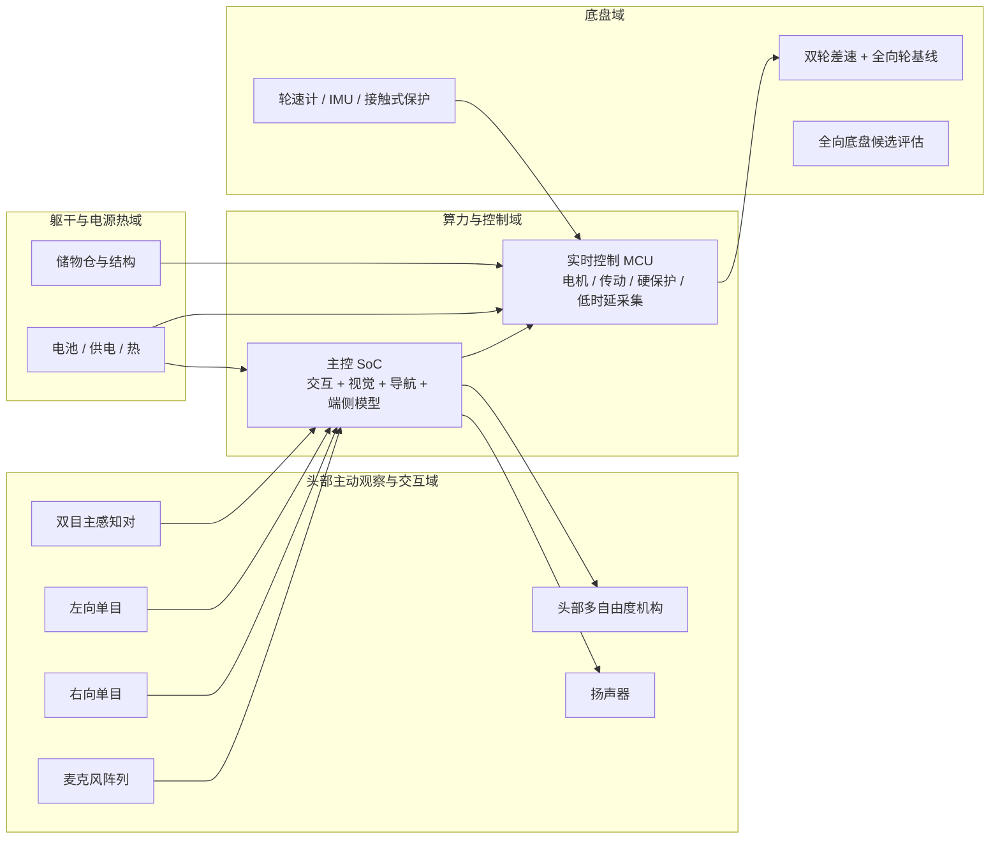

这一基线的本质是：

1. 用头部主动观察替代多固定视角堆叠；
2. 用更低表面复杂度的两芯片架构替代三芯片验证平台；
3. 用更克制的本体自由度换取成本、热、重量、噪声与可维护性空间。

#### 验证 Demo 对当前主线的反向约束

结合 `Step38` 中对验证 Demo 的澄清，当前主线进一步明确吸收 4 条架构判断：

1. 验证 Demo 已证明“高位主观测视觉 + 异构算力 + 实时控制分层”是有价值的，因此一代产品仍应优先保留头部或上半身的主观测视角，而不是把核心观测全部下压到地面近场。
2. 验证 Demo 也证明了“低位 `4` 超广角 + 长焦”虽然在器件层被配置出来，但在系统层没有真正用上；因此一代主线必须坚持“按真实闭环价值保留观测视角”，而不是延续验证平台的器件堆叠。
3. 验证 Demo 中双麦阵并存的原因，是圆形大屏与头顶麦阵之间存在遮挡和反射冲突。这说明一代必须把“视觉 / 屏幕 / 声学 / 结构”当作头部一体化问题前置收敛，而不能用继续叠加器件的方式修补。
4. 深度相机与激光雷达作为研发对比真值链的定位被进一步坐实：它们的价值主要在于帮助纯视觉路线做对照验证，而不是成为产品 fallback。

### 4.2.3 基于系统架构原则的正反面影响分析

基于 [系统架构原则](../00_governance/05_system_architecture_principles.md)，上述收敛决策的主要影响如下：

| 决策 | 正面影响 | 负面影响 | 原则关联 |
| --- | --- | --- | --- |
| 三芯片硬件收敛为两芯片 | 显著降低表面复杂度，有利于成本、线束、功耗、维护与团队理解一致性 | 主控 `SoC` 压力上升，软硬协同难度提高，主控失效影响面更大 | 表面复杂度原则、必备复杂度原则、平衡原则 |
| 传感器大幅删减 | 有利于 `BOM`、热、重量和量产一致性，迫使算法与架构真正承担闭环责任 | 纯视觉、标定、低照、近场安全压力显著上升 | 价值与架构原则、第二定律原则、创新原则 |
| 头部增加自由度并集中相机 | 更符合“少相机、多自由度观察”，提升拟人感、主动观察能力与产品差异化 | 头部重量、热、线束、噪声和可靠性风险上升 | 涌现原则、优雅原则、创新原则 |
| 麦阵收敛为单阵列 | 避免双麦阵修补式架构，减少器件冗余和头部结构冲突 | 对头部布局、声学算法和拾音位置提出更高要求 | 必备复杂度原则、表面复杂度原则、架构决策原则 |
| 躯干自由度收缩、底盘稳健基线保留 | 把资源集中到真正有价值的头部与感知闭环，降低结构复杂度与故障面 | 可能限制一代非语言姿态表达与某些空间机动体验 | 聚焦原则、平衡原则、受益原则 |

当前结论是：

1. 这些决策总体上符合“降低表面复杂度、逼近必备复杂度、保留真正有价值的能力涌现”的方向；
2. 它们的代价是把更多压力集中转移到主控算力、头部一体化设计、纯视觉算法和系统调度；
3. 因此，这不是单纯的“减配”，而是一次把复杂度从器件表面转移到系统能力内部的架构重构。

### 4.2.4 一代三级能力模式

在当前更严格的成本和团队约束下，一代总体架构补充冻结为 3 级能力模式：

1. `L1 核心闭环能力`：必须端侧闭环、断网可用、量产必须稳定，包括纯视觉感知、运动安全、基础陪伴和基础健康事件。
2. `L2 增强认知能力`：条件触发、按需启用，包括更强 `VLM / VLN` 理解、找物、复杂语义任务和增强型长期记忆。
3. `L3 服务扩展能力`：依赖 App、云、人工服务和第三方生态，包括在线问诊、药店、配送和远程协助链路。

这 3 级能力不是重要性排序，而是“实现重度、资源占用和交付依赖”的分层：

1. `L1` 是一代不可退让的产品底座。
2. `L2` 是技术突破主要承载层。
3. `L3` 必须预留，但按“最小可交付 + 可收缩覆盖”设计。
4. 当前 `L1` 与默认量产 SKU 的资源假设，应先按 `8GB RAM + 64GB Flash` 组织。
5. `L2` 允许在量产默认线内通过更强调度、量化和条件触发获取突破，但不应自动要求 `12GB+` 成为一期默认配置。
6. `L3` 不得以“服务能力更多”为理由反向把一代默认端侧配置推到 `16GB+` 内存路线。

### 4.2.5 一代 `Agent` 增强平面

基于 `Step41`，当前主线正式接受把 `OpenClaw / Claude Code / Codex` 这类 `AI` 生产力工具抽象成 Kinbot 的一代 `Agent` 能力增强输入。

但为了避免抽象层级继续膨胀，一代不新增新的一级模块，也不把这些工具直接写成产品模块，而是把它们收敛为一个跨模块的 **`Agent` 增强平面**：

1. **结构化长期记忆**  
   作为 `world_state_memory` 的慢变量扩展，负责把用户许可范围内的重要事实、偏好、照护历史和家庭事件组织成可治理的长期资产。
2. **技能化能力组织**  
   把“找人、递送、提醒、问诊、解释、联动”等能力按技能组织，使系统不再只是固定流程，而是能在边界内做能力组合。
3. **连接器抽象**  
   把手机、App、云端服务、智能家居和第三方生态统一成连接器模型，避免后续演进时继续堆点对点接口。
4. **受控任务编排**  
   由 `decision_orchestration` 承接“技能选择、技能组合、连接器调用、结果回写”的受控编排，但不放开为无限制的自主代理。

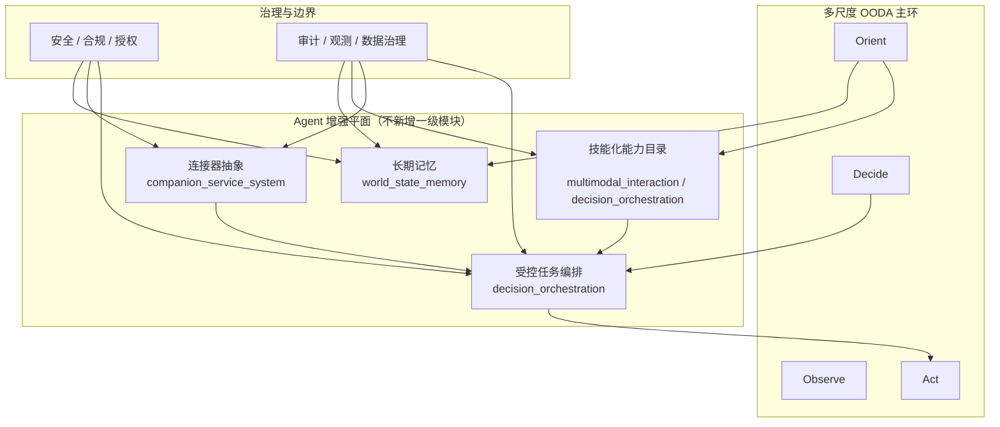

当前一代明确接受以下边界：

1. **正式进入主线**  
   长期记忆、技能化能力组织、连接器抽象、受控任务编排。
2. **不作为一代正式承诺**  
   自主创造新技能并自动上线。
3. **与当前主线的关系**  
   `OODA` 仍然是主环；`Predict / Learn` 仍然是跨环能力；`Agent` 增强平面只增强 `Orient / Decide / 服务升级`，不替代核心闭环。

这条收敛的意义不是“再加一层软件”，而是：

1. 把一代长期记忆、技能扩展和外部服务连接收敛成统一边界；
2. 把未来 `AI-native` 产品能力提前纳入架构，但不打乱当前 `9` 个一级模块；
3. 为二代的“受控技能自进化”和更强关系型服务预留演进方向。

### 4.3 双视角一致性检查机制

为避免“本体实体架构”和“运行时功能架构”在后续模块设计中重新漂移，当前基线同步冻结以下机制：

1. 每个模块方案都必须声明自己依赖和约束了哪些本体实体域
2. 本体实体域变更必须评估对 `9` 个一级模块、四条一级业务闭环和关键接口面的影响
3. 运行时模块变更如果影响算力、传感器、功耗、热、重量、仓门安全或外观，必须回写到本体实体域评审
4. `KBT-32` 和后续模块方案评审，必须把“双视角一致性检查”作为固定审阅项

## 5. 多尺度 OODA 基线

Kinbot 当前正式方法论不是固定单轮 OODA，而是多尺度、并发、可中断、可动态调度的 OODA。

四类子环已经冻结：

1. `R1` 反射环：毫秒到百毫秒级，负责底盘级安全和快速保护
2. `R2` 执行环：秒级，负责局部执行、到人确认、动作监督
3. `R3` 任务环：秒到分钟级，负责任务推进、异常升级和编排
4. `R4` 关系与服务环：小时到天级，负责长期记忆、习惯学习和服务编排

其中：

1. `Orient` 已升级为“情境理解 + 认知评价 + 尺度选择”
2. `OODA Scale Scheduler` 已提升为一级架构能力
3. 所有动作在执行前都必须经过安全、合规、授权三道门

### 5.1 当前主线对外部提案的吸收原则

在保持当前系统级稳定边界不回退的前提下，当前总体架构正式采用“三线吸收法”：

1. 继续以当前主线架构作为 `PDCP` 与模块并行设计的稳定边界
2. 吸收《架构重审与替代提案》中更强的技术结构表达
3. 吸收《关系中心架构提案》中更强的产品关系原则与评价视角

这意味着：

1. 当前不整体替换主线架构
2. 后续总体方案与模块方案必须显式回应被吸收的增强项
3. 被吸收内容进入主线时，必须以“增强当前架构”而不是“破坏既有冻结边界”为原则

### 5.2 当前吸收的四项增强方向

结合外部评审输入，当前主线正式补入以下四项增强方向：

1. **算力调度器一级化**  
   算力调度不再只作为平台实现细节存在，而要作为跨 `platform_runtime / decision_orchestration / observability_data_governance` 的一级运行时能力，被明确用于约束 `TTFT / TPS / 热稳态持续 TPS` 和多任务抢占策略。

2. **世界状态按时间尺度与职责继续分层演进**  
   `World State` 在 `PDCP` 节点仍保持统一状态平面，但后续总体方案应按至少三类状态继续分层：
   - 执行态与安全态
   - 任务上下文态
   - 长期关系与服务态

3. **安全能力按分层免疫体系组织**  
   安全不再只被表达为一个总门，而应按至少四层组织：
   - 本体防护与故障保护
   - 运动安全与环境安全
   - 业务授权与合规安全
   - 服务协同与审计安全

4. **关系质量进入架构评价体系**  
   “关系质量”被吸收为总体方案、模块方案和体验验收的正式评价框架，但不冻结为新的超级核心引擎。当前至少关注：
   - 信任是否被增强或削弱
   - 交互是否舒适、克制且有连续性
   - 行为是否尊重边界与授权
   - 服务是否可靠、可解释、可恢复
   - 长期记忆与长期照护是否真正提升关系质量

## 6. 部署边界

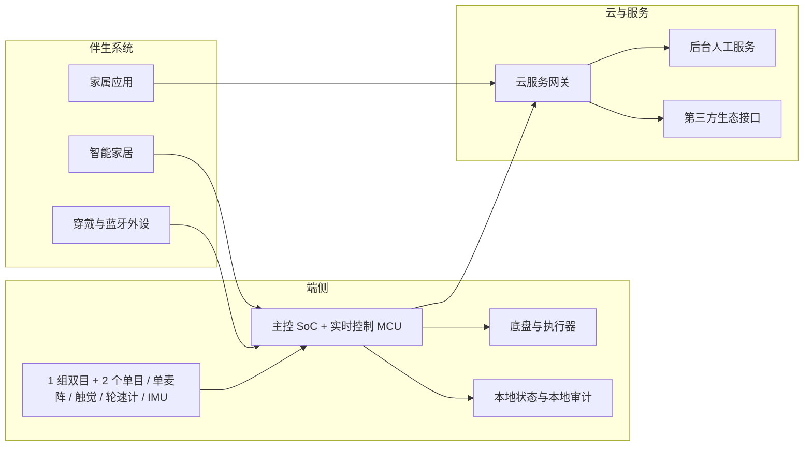

当前部署边界已经冻结为：

1. 原始视觉、语音、运动安全和本地执行保护必须在端侧
2. 家属联动、外部服务接入、问诊转接、运营配置和第三方服务网关由伴生系统与云侧承接
3. 断网时运动安全与本地闭环不能失效
4. 原始敏感数据默认不回流，但架构层允许预留“授权 + 脱敏 + 加密 + 时效受限 + 用途受限”的受控回流接口

## 7. 四条一级业务闭环

### 7.1 健康闭环

`穿戴 / 外设 / 本体感知 -> 候选事件 -> 本地补采 -> 风险分级 -> 动作审批 -> 提醒 / 到人 / 递送 / 家属联动 / 人工服务 -> 归档`

### 7.2 陪伴闭环

`身份与上下文 -> 人设与主动触发判定 -> 交互规划 -> 多模态表达 -> 用户反馈 -> 记忆治理`

### 7.3 安全闭环

`空间与风险识别 -> 安全事件判定 -> 降级 / 硬停 / 回退 -> 家属与服务升级 -> 审计复盘`

### 7.4 服务闭环

`机器人本地服务 -> 家属应用 / 云 -> 后台人工服务 -> 第三方履约 / 专业主体 -> 结果回写`

## 8. 一级接口与治理基线

当前一级接口与治理基线由两部分共同构成。

### 8.1 本体能力接口面

`Body Capability Contract` 当前收敛为 `6` 组接口：

1. `motion_execution_contract`
2. `sensor_capture_contract`
3. `hmi_device_contract`
4. `power_thermal_state_contract`
5. `storage_cabin_contract`
6. `platform_fault_contract`

### 8.2 运行时关键接口面

当前已经冻结的运行时关键接口面包括：

1. `World State` 统一状态平面
2. 分层状态机 + 行为树控制结构
3. `ActionProposal / ApprovalDecision` 动作审批契约
4. 健康事件七段式管线
5. 陪伴交互记忆治理与主动触发边界
6. 储药与室内递送一代边界
7. 伴生系统最小闭环与人工服务协同边界

### 8.3 接口稳定性策略

为支撑模块并行设计，当前一级接口稳定性策略冻结为：

1. 一级接口先冻结抽象职责和责任边界，再允许底层器件、协议和实现细节继续演进
2. 一级接口必须显式声明 `owner`
3. 一级接口必须带版本号
4. 一级接口变更必须经过架构评审，并明确是否保持向后兼容

## 9. 当前一级架构风险输入与需求侧硬约束

### 9.1 需求侧硬约束

当前总体架构不是在抽象空间中设计，而是受以下硬约束共同约束：

1. **产品与业务约束**  
   首发场景固定为中国大陆家庭室内养老场景；首发人群为独居老人或子女不在身边的老两口；主价值排序固定为“健康管理 > 陪伴交互 > 家庭安全巡护 > 老人看护”。

2. **系统边界约束**  
   一代固定为轮式移动交互机器人，不包含机械臂和复杂物理操作；目标系统是机器人本体，但交付对象必须是“机器人 + 伴生系统 + 服务”的完整产品系统。

3. **决策与治理约束**  
   决策优先级固定为“安全 > 合规 > 用户指令 > 任务完成率 > 效率 > 能耗”；已授权行为要求完全自主；动作执行前必须经过安全、合规、授权三道门。

4. **数据与部署约束**  
   原始视觉与语音数据默认必须端侧处理；运动安全与本地执行保护必须在端侧闭环；断网不得影响运动与避障安全能力；若后续需要回流，只能走受控回流预留接口。

5. **工程与商业约束**  
   续航目标大于 4 小时，尺寸建议不超过 `50 x 50 x 120 cm`，整机物料成本 `5000 到 6000 元`；同时整机与服务组合不能破坏“聪明、温暖、精致”的高端产品感。

6. **项目节奏约束**  
   当前阶段是“产品需求基本完成后的系统架构设计与技术研判”；全流程按 `IPD` 阶段门推进；争取在 `2026-03-31` 完成产品定义与架构冻结。

### 9.2 一级阻断输入

以下三项已经被提升为后续总体方案与模块设计的一级阻断输入：

1. `D1` 端侧算力平台未收敛
2. `D6` 整机平台与关键器件基线未冻结
3. `D7` 伴生系统最小闭环缺失

它们不在本文件里直接完成定型，但后续 `KBT-32` 和模块方案必须显式回应。

### 9.3 当前补充关注项

除上述一级阻断项外，当前还需重点关注以下问题：

1. 成本、性能与高端产品感之间是否具备统一决策机制
2. 双视角一致性检查是否真正落到后续模块设计中
3. 一级接口的冻结范围、演进范围与验收标准是否形成了统一清单
4. 夜间低照、自动标定与纯视觉路线是否已取得足够工程实证，能够支撑安全与信任

## 10. 与专题文档的关系

本文件只负责给出总览基线，具体细节分别下沉到以下文档：

1. `docs/02_p1_architecture/03_multi_scale_dynamic_ooda_architecture_baseline.md`：多尺度 OODA 方法论细化
2. `docs/02_p1_architecture/04_module_layers_and_boundaries.md`：一级模块边界
3. `docs/02_p1_architecture/05_world_state_schema.md`：世界状态结构
4. `docs/02_p1_architecture/06_decision_state_machine.md`：分层状态机与行为树边界
5. `docs/02_p1_architecture/07_safety_compliance_authorization_api.md`：统一动作审批契约
6. `docs/02_p1_architecture/02_pdcp_system_architecture_review_package.md`：`PDCP` 正式评审包
7. `docs/03_p2_feasibility/01_overall_solution_and_module_design_baseline.md`：总体方案与模块下发基线

## 11. 当前结论

当前总体架构已经从早期的泛化分层描述，收敛为一套可以支撑 `PDCP` 评审与模块并行设计的正式基线：

1. 产品系统边界已冻结
2. 双视角总体架构基线已冻结
3. 一代纯视觉传感器主线已作为正式架构提案进入总体基线
4. 多尺度 OODA 方法论已冻结
5. 一级业务闭环已冻结
6. 一级接口与治理基线已冻结
7. 后续工作主线已转入总体方案下发与模块方案设计
