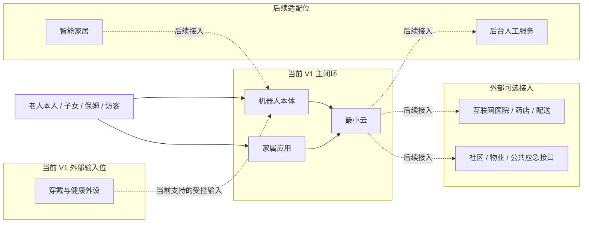
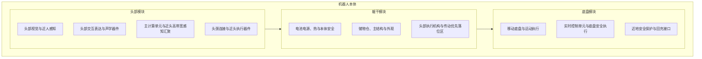
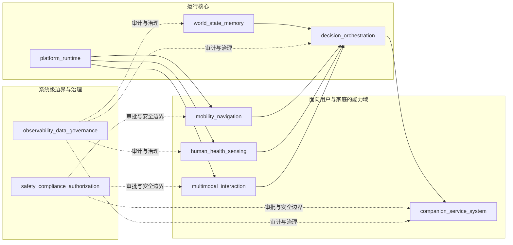
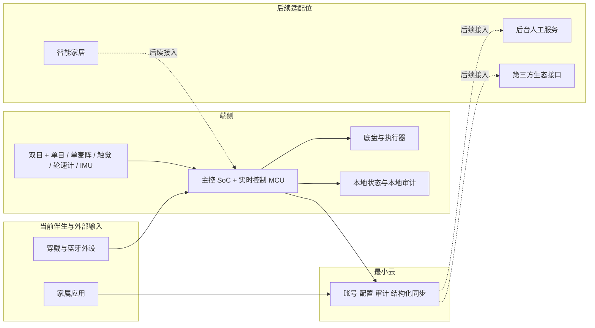

# 总体架构

---

文档版本：v2.8
创建日期：2026-03-10
作者：Codex-架构师

文档变更记录：
- v2.8 | 2026-04-09 | Codex-架构师 | 吸收 `Step 48`：将当前默认量产资源线更新为 `12GB RAM + 32GB Flash`，并保持 `12GB + 64GB` 为边界验证线。
- v2.7 | 2026-04-09 | Codex-架构师 | 继续收紧 `V1` 真实边界：明确“主闭环 = Robot + App + 最小云、穿戴 = 当前受控输入位、人工/第三方 = 后续适配位”，并澄清“完整产品系统”中的服务不等于默认启用重服务链。
- v2.6 | 2026-04-09 | Codex-架构师 | 将当前 V1 真实边界收缩为 `Robot + App + 最小云`，把坐席、智能家居和第三方生态降为后续适配位，并明确当前开发承接只围绕离散决策与事件驱动两条主链组织。
- v2.5 | 2026-04-09 | Codex-架构师 | 收缩正文层级，只保留产品系统边界、双视角总图、部署边界、一级接口与治理边界、一级约束和当前结论；将纯视觉硬件细节、三级能力模式、`Agent` 增强与四条业务闭环降为附录说明。
- v2.4 | 2026-04-08 | Codex-架构师 | 收紧总体架构事实源边界，明确 `14` 退为背景锚点，并同步 `03` 的重命名。
- v2.3 | 2026-04-06 | Codex-架构师 | 清理总图正文中的旧离散调度器与 `R1-R4` 直写残留，统一改写为当前多执行范式口径。
- v2.2 | 2026-04-06 | Codex-架构师 | 吸收 `Step 47` 的最新输入，在头部 / 躯干 / 底盘空间承载子视图中进一步明确“主计算单元优先放头部、实时控制单元优先放底盘”的物理分配。
- v2.1 | 2026-04-06 | Codex-架构师 | 吸收 `Step 47` 的 `Phase 2` 审阅输入，重写产品实体架构视图为“`6` 个本体实体域 + 头部 / 躯干 / 底盘空间承载子视图”，明确头部在总体架构中独立为一级空间实体。
- v2.0 | 2026-04-06 | Codex-架构师 | 按家庭共居智能体革新路线 `Phase 2` 重组总图口径：新增顶层锚点引用，运行时功能架构视图改为三轴框架表达，`OODA` 退到多执行范式中的离散决策范式，并将一级业务闭环改写为闭环与照护面的映射关系。
- v1.9 | 2026-04-03 | Codex-架构师 | 吸收 Step46，将导航智能主线从“`VLN` 能力增强”升级为“`VLN -> NFM` 演进”，明确 `NFM` 主要落在 `O2/O3`，并把 `SLAM` 退到 `local_metric_frame` 与局部执行支撑层。
- v1.8 | 2026-03-23 | Codex-架构师 | 吸收 Step41，将 AI 生产力工具进入 Kinbot 架构的意见统一为“一代 `Agent` 增强平面”，明确长期记忆、技能化、连接器与受控任务编排进入一代主线，但不新增一级模块，也不将“自主创造新技能”写成一代正式承诺。
- v1.7 | 2026-03-23 | Codex-架构师 | 吸收最新架构统一整理决策，刷新一代算力与控制域、纯视觉传感器组合、头部自由度、声学布局与底盘基线，并补充基于系统架构原则的正反面影响分析。
- v1.6 | 2026-03-22 | Codex-架构师 | 补入 Kinbot 在 `PDCP` 基线下的 `ConOps / OpsCon` 表达，用家庭元场景、关键任务线程、运行节点和运行模式图补强系统级架构说明。
- v1.5 | 2026-03-22 | Codex-架构师 | 吸收 Step38，补入验证 Demo 对纯视觉主线、空间架构和头部声学一体化的反向约束。
- v1.4 | 2026-03-20 | Codex-架构师 | 吸收硬件专家线程的最新内存价格反馈，明确一代量产默认内存线、前瞻验证线与 `L1 / L2 / L3` 的资源边界。
- v1.3 | 2026-03-17 | Codex-架构师 | 吸收 Step36，调整一代价值排序、`BOM` 目标、纯视觉对比基线、受控回流预留与三级能力模式。
- v1.2 | 2026-03-17 | Codex-架构师 | 补入一代纯视觉传感器架构提案并更新关键路径关注项。
- v1.1 | 2026-03-10 | Codex-架构师 | 吸收三线吸收法、需求侧硬约束与关系质量评价框架。
- v1.0 | 2026-03-10 | Codex-架构师 | 文档创建。

---

## 1. 文档定位

本文档是当前项目的唯一总图文档。

它只负责给出系统级主干：

1. 产品系统边界
2. 双视角总图
3. 部署边界
4. 一级接口与治理边界
5. 一级约束
6. 当前结论

更细的运行时、状态、模块、健康事件、陪伴策略和伴生系统细节，分别下沉到对应专题文档。本文件不再把说明性视图与总图正文并列展开。

## 2. 当前边界

当前已明确：

1. 项目处于“产品需求基本完成后的系统架构设计与技术研判阶段”
2. 当前主线为 `P1 / PDCP`
3. 当前目标是形成完整系统架构基线，并把它转成总体方案与模块下发基线
4. 总体方向已上抬到“家庭共居智能体”，`OODA` 不再承担总图中心角色，而退到运行时层

一代产品边界继续保持为：

1. 中国大陆居家养老机器人
2. 主价值排序：健康管理 > 陪伴交互 > 家庭安全巡护 > 老人看护
3. 不做机械臂和复杂物理操作
4. 当前 V1 主链按“机器人本体 + 家属 App + 最小云”组织
5. 一代整体策略为“核心闭环强、服务闭环轻、技术突破集中”

## 3. 产品系统边界

Kinbot 一代在总图上继续保留“完整产品系统”视角，但当前 V1 主闭环只承接更小的交付边界：

边界判断保持不变：

1. 机器人本体是目标系统核心
2. 当前 V1 主闭环只保留家属 App 与最小云作为伴生系统主链
3. 穿戴与健康外设属于当前支持的外部输入位，但不单独扩成服务主链
4. 智能家居、后台人工服务属于后续适配位，不进入当前 V1 主闭环
5. 外部医疗、药店、配送、社区和公共应急接口属于外部可选接入，不进入当前 V1 主闭环
6. 默认优先本地闭环，只有当前主闭环不够时才进入后续适配位的服务升级链路

## 4. 双视角总体架构基线

当前总图只保留两条主视角：

1. 产品实体架构视图：回答“系统由哪些稳定实体域和空间承载位组成”
2. 运行时功能架构视图：回答“系统由哪些稳定能力域承接”

三轴框架、四类执行范式、四条业务闭环、三级能力模式和 `Agent` 增强等内容继续保留，但不再和总图正文并列铺开，分别下沉到附录或专题文档。

### 4.1 产品实体架构视图

机器人本体在系统架构层当前继续采用 `6` 个本体实体域：

1. 计算与控制核心
2. 移动底盘与运动执行
3. 环境与人体感知组件
4. 交互表达组件
5. 电池电源、热与本体安全
6. 储物仓、结构与外观

为了让空间承载关系保持清晰，总图继续补充 `头部 / 躯干 / 底盘` 三个空间模块视图：

当前明确的空间承载关系如下：

| 空间模块 | 主要承载的本体实体域 |
| --- | --- |
| 头部 | 环境与人体感知组件、交互表达组件、计算与控制核心中的主计算单元与近头高速感知汇聚 |
| 躯干 | 电池电源、热与本体安全、储物仓、结构与外观、头部传动与整机线束汇聚 |
| 底盘 | 移动底盘与运动执行、计算与控制核心中的实时控制单元、近地安全保护与回充接口 |

当前结论保持不变：

1. `6` 个本体实体域继续回答“系统要具备什么能力”
2. `头部 / 躯干 / 底盘` 继续回答“这些能力原则上长在什么位置”
3. 头部仍是一代产品差异化最强的物理载体，主计算单元优先贴近头部
4. 实时控制单元优先贴近底盘，缩短运动控制与安全执行链路

### 4.2 运行时功能架构视图

当前总图在运行时视角只保留稳定能力域和系统级硬边界。

说明性背景如下：

1. 三轴框架继续作为总图来路，详见 [14_family_co_living_agent_paradigm.md](14_family_co_living_agent_paradigm.md)
2. 四类执行范式继续作为运行时基线，详见 [03_execution_paradigms_runtime_baseline.md](03_execution_paradigms_runtime_baseline.md)
3. 本文件只保留 `9` 个一级模块与它们之间的主干关系

当前继续采用 `9` 个一级模块：

1. `platform_runtime`
2. `mobility_navigation`
3. `human_health_sensing`
4. `multimodal_interaction`
5. `world_state_memory`
6. `decision_orchestration`
7. `safety_compliance_authorization`
8. `companion_service_system`
9. `observability_data_governance`

当前运行时视图只强调 4 点：

1. 总图已经上抬到“家庭共居智能体”方向
2. `OODA` 只保留在离散决策范式内，不再代表总图本身
3. `world_state_memory` 与 `decision_orchestration` 是运行核心，不再和说明性坐标系混写
4. 安全、授权、审计和治理继续保持系统级边界地位
5. `companion_service_system` 在当前 V1 中默认收缩为 `App + 最小云`，后台人工服务与第三方接入只保留接口位

### 4.3 双视角一致性要求

为避免本体实体架构与运行时功能架构在后续设计中再次漂移，当前继续要求：

1. 每个模块方案都必须声明自己依赖和约束了哪些本体实体域
2. 本体实体域变更必须评估对 `9` 个一级模块、关键接口和部署边界的影响
3. 运行时模块变更如果影响算力、传感器、功耗、热、重量、仓门安全或外观，必须回写到本体实体视图
4. 后续模块评审继续把“双视角一致性检查”作为固定项

## 5. 部署边界

当前部署边界保持为：

1. 原始视觉、语音、运动安全和本地执行保护必须在端侧
2. 当前 V1 云侧只承接账号、配置、审计、结构化同步和远程确认结果回传
3. 穿戴与蓝牙外设允许作为当前受控输入位进入本地闭环，但不反向扩成独立服务主链
4. 智能家居、人工服务和第三方服务接入只保留后续适配位，不进入当前主闭环
5. 断网时运动安全与本地闭环不能失效
6. 原始敏感数据默认不回流，但架构层继续允许预留“授权 + 脱敏 + 加密 + 时效受限 + 用途受限”的受控回流接口

## 6. 一级接口与治理边界

### 6.1 本体能力接口面

本体能力接口面当前继续保持为 `6` 组：

1. `motion_execution_contract`
2. `sensor_capture_contract`
3. `hmi_device_contract`
4. `power_thermal_state_contract`
5. `storage_cabin_contract`
6. `platform_fault_contract`

这些名称当前继续沿用，但在总图层只承担接口分组作用，不展开到底层器件与协议细节。

### 6.2 运行时关键接口面

当前继续保留以下运行时关键接口面：

1. `World State` 统一状态平面
2. 分层状态机 + 行为树控制结构
3. `ActionProposal / ApprovalDecision` 动作审批接口
4. 健康事件七段式管线
5. 陪伴交互记忆治理与主动触发边界
6. 储药与室内递送一代边界
7. 伴生系统最小闭环与后续适配边界

### 6.3 变更规则

为支撑模块并行设计，当前继续采用以下规则：

1. 一级接口先明确抽象职责和责任边界，再允许底层器件、协议和实现细节继续演进
2. 一级接口必须显式声明 `owner`
3. 一级接口必须带版本号
4. 一级接口变更必须经过架构评审，并明确是否保持向后兼容

## 7. 一级约束与当前关注点

### 7.1 一级约束

当前总体架构继续受以下约束共同约束：

1. 产品与业务约束：首发场景固定为中国大陆家庭室内养老；首发人群为独居老人或子女不在身边的老两口；主价值排序固定为“健康管理 > 陪伴交互 > 家庭安全巡护 > 老人看护”
2. 系统边界约束：一代固定为轮式移动交互机器人，不包含机械臂和复杂物理操作；交付对象仍是“机器人 + 伴生系统 + 服务”的完整产品系统，但当前 V1 主闭环中的“服务”只指最小云侧同步、远程确认与审计，不等于默认启用人工服务或第三方履约
3. 决策与治理约束：优先级固定为“安全 > 合规 > 用户指令 > 任务完成率 > 效率 > 能耗”；动作执行前必须经过安全、合规、授权三道门
4. 数据与部署约束：原始视觉与语音数据默认端侧处理；运动安全与本地执行保护必须端侧闭环；断网不得影响运动与避障安全能力
5. 工程与商业约束：续航目标大于 `4` 小时，尺寸建议不超过 `50 x 50 x 120 cm`，整机物料成本 `5000 到 6000 元`，同时不能破坏“聪明、温暖、精致”的高端产品感
6. 资源与节奏约束：默认量产资源线更新为 `12GB RAM + 32GB Flash`，`12GB + 64GB` 作为边界验证线，`16GB + 64GB` 及以上只作为前瞻验证线或未来 `Pro SKU` 候选；当前阶段目标仍是形成总体方案与模块下发基线

### 7.2 当前关注点

以下输入继续作为后续总体方案与模块设计的重点项：

1. `D1` 端侧算力平台仍未最终统一
2. `D6` 整机平台与关键器件基线仍需继续落实
3. `D7` 伴生系统最小闭环仍需继续完善，并收缩到 `App + 最小云`
4. 成本、性能与高端产品感之间是否具备统一决策机制
5. 双视角一致性检查是否真正落到后续模块设计中
6. 一级接口的稳定范围、演进范围与验收方式是否形成统一清单
7. 夜间低照、自动标定与纯视觉路线是否已经取得足够工程实证，能够支撑安全与信任

## 8. 与专题文档的关系

本文件只负责给出总图主干，细节分别下沉到以下文档：

1. [14_family_co_living_agent_paradigm.md](14_family_co_living_agent_paradigm.md)：背景 / 决策来路锚点，保留家庭共居智能体总图与三轴框架的来路
2. [03_execution_paradigms_runtime_baseline.md](03_execution_paradigms_runtime_baseline.md)：多执行范式运行时基线细化
3. [04_module_layers_and_boundaries.md](04_module_layers_and_boundaries.md)：一级模块边界
4. [05_world_state_schema.md](05_world_state_schema.md)：世界状态结构
5. [06_decision_state_machine.md](06_decision_state_machine.md)：分层状态机与行为树边界
6. [07_safety_compliance_authorization_api.md](07_safety_compliance_authorization_api.md)：统一动作审批接口
7. [02_pdcp_system_architecture_review_package.md](02_pdcp_system_architecture_review_package.md)：`PDCP` 正式评审包
8. [../03_p2_feasibility/01_overall_solution_and_module_design_baseline.md](../03_p2_feasibility/01_overall_solution_and_module_design_baseline.md)：总体方案与模块下发基线

## 9. 当前结论

当前总体架构的主干结论保持不变：

1. 当前 V1 主链已收缩为“机器人本体 + 家属 App + 最小云”的最小闭环规划
2. 双视角总图继续保留为“产品实体架构视图 + 运行时功能架构视图”
3. 总图中心已从“多尺度 `OODA`”上抬到“家庭共居智能体”方向，`OODA` 退到运行时层的离散决策范式
4. `9` 个一级模块、部署边界、一级接口与治理边界继续作为后续总体方案与模块设计的主干输入
5. 当前开发承接默认只围绕离散决策与事件驱动两条主链组织；连续流式与长周期演化只保留研究线和接口位
6. 本文件不再并列展开纯视觉硬件细节、三级能力模式、`Agent` 增强和四条业务闭环；这些内容继续保留，但降为附录说明或专题文档输入

## 附录 A. 说明性视图与短指针

以下内容继续有效，但不再和总图正文并列展开。

### A.1 纯视觉硬件与验证平台说明

当前一代主线仍为纯视觉路线，主要判断保持不变：

1. 量产主线采用纯视觉，不把深度相机和激光雷达作为一代量产依赖
2. 当前视觉器件组合继续按“`1` 组双目 + `2` 个单目”的 `RGB` 路线组织
3. 深度相机和激光雷达继续只作为研发阶段的对比基线与真值参考链路
4. 如果纯视觉路线在阶段门前无法达标，优先调整产品节奏，而不是回退到主动传感主线

相关细节由后续总体方案、专项验证与专题文档继续展开，不在本文件正文平铺。

### A.2 三级能力模式说明

当前三级能力模式继续保留，但改为说明性分层：

1. `L1`：端侧必须稳定成立的核心闭环能力
2. `L2`：条件触发、按需启用的增强认知能力
3. `L3`：依赖 App、最小云以及后续适配位的服务扩展能力

这套分层继续用于资源、交付依赖和演进节奏判断，但不再作为总图正文中的并列一级视角。

### A.3 `Agent` 增强说明

当前一代继续接受以下增强方向：

1. 结构化长期记忆
2. 技能化能力组织
3. 连接器抽象
4. 受控任务编排

它们继续视为跨模块增强输入，不新增一级模块，也不替代当前核心闭环。

### A.4 四条业务闭环说明

当前四条一级业务闭环继续保留：

1. 健康闭环
2. 陪伴闭环
3. 安全闭环
4. 服务闭环

它们继续用于理解照护关系中的主要能力面，但不再在本文件正文里作为与双视角总图并列的一级展开。
