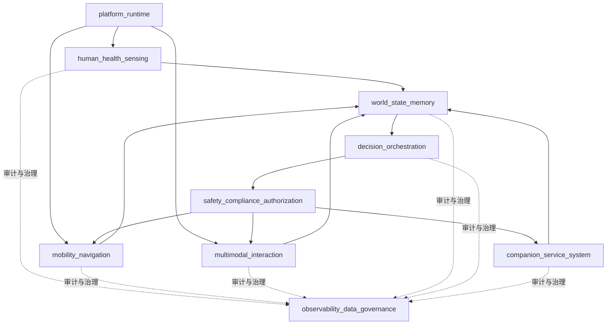

# 模块分层与模块边界

## 1. 文档目的

本文档把当前的总体架构继续细化到“可分工、可实现、可集成”的模块层级。

这一版的目标不是确定具体技术栈，而是先回答四个问题：

1. 哪些是一级模块
2. 每个模块负责什么，不负责什么
3. 模块之间通过什么稳定边界协作
4. 哪些能力必须端侧，哪些能力可以云侧

## 2. 当前设计前提

本版本在以下前提下成立：

- 首发目标用户为独居老人或子女不在身边的老两口
- 首发市场为中国大陆
- 一代产品从泛家庭机器人收敛为居家养老/老人看护机器人
- 健康能力目标已包含生命体征接入、跌倒/异常检测、问诊与医疗联动、用药管理和买药
- 夜间默认静默，但传感器保持开启
- 用户授权后允许自动上报异常
- 团队规模和预算允许平台化分层，且允许部分硬件 ODM
- 一期生命体征接入优先绑定穿戴设备，同时保留血压计等外设的软件接口
- 一期紧急用药动作边界为提醒取药、送药到人、提醒服药并确认、联系子女
- 老人与子女同权时，冲突命令必须二次确认
- 保姆模式先预留提醒、拿药、叫人、记录、汇报、远程确认等协同能力
- 120 联动在架构层需要预留标准接口
- 底盘倾向自研，麦克风阵列倾向自研，穿戴外设不自研，相机优先供应商

说明：

- 首版主价值排序已确认为“健康管理 > 陪伴交互 > 老人看护 > 家庭安全巡护”。

## 3. 一级模块划分

建议将系统分成 9 个一级模块：

1. `platform_runtime`
2. `mobility_navigation`
3. `human_health_sensing`
4. `multimodal_interaction`
5. `world_state_memory`
6. `decision_orchestration`
7. `safety_compliance_authorization`
8. `companion_service_system`
9. `observability_data_governance`

### 3.1 一级模块图

说明：

- 这张图表达的是一级模块之间的稳定协作面，不是完整运行时时序。

说明：

- 为满足“任意一层尽量控制在 `5～9` 个实体”的约束，原来的 `cloud_service_gateway` 与 `app_family_care` 在一级模块层合并为 `companion_service_system`。
- 这不意味着 App、云服务和后台运营坐席在实现或团队分工上必须合并，只表示它们在一级模块图中属于同一伴生系统域。
- `safety_compliance_authorization` 和 `observability_data_governance` 仍是横切模块，但实现上建议独立建模块而不是散落在各系统里。

## 4. 一级模块职责与边界

### 4.1 `platform_runtime`

职责：

- 设备驱动抽象
- 传感器时间同步
- 事件总线和状态总线
- 进程管理、任务调度、配置下发
- 端侧资源管理，包括 CPU、NPU、GPU、内存、存储和功耗

边界：

- 不负责业务决策
- 不直接处理用户语义
- 不直接产出健康、导航或交互结论

输入输出：

- 输入：各类硬件设备数据和配置
- 输出：统一设备接口、统一时钟、统一消息和状态访问能力

### 4.2 `mobility_navigation`

职责：

- 端侧定位、建图和重定位
- 家庭空间拓扑与通行区域维护
- 全局路径规划和局部路径规划
- 底盘控制、避障、限速、门槛通过和自动回充

边界：

- 不直接决定“要不要去某处”，只负责“已批准目标如何安全到达”
- 不负责用户授权
- 不负责医疗判断

输入输出：

- 输入：地图、导航目标、实时障碍、速度约束、安全限制
- 输出：位姿、路径、导航状态、运动执行结果、失败原因

### 4.3 `human_health_sensing`

职责：

- 人体检测、身份识别、姿态估计、跌倒检测
- 语音采集、唤醒、ASR、说话人识别
- 情绪、活动状态、异常行为初筛
- 外接生命体征设备接入，如血压、血氧、心率、血糖等
- 健康事件候选生成，不做最终医疗决策

边界：

- 不直接给出最终医疗结论
- 不直接触发上报，必须经过决策和授权链
- 不上传原始敏感数据到云端

输入输出：

- 输入：相机、麦克风、触觉、生命体征设备、历史授权信息
- 输出：结构化人体事件、健康候选事件、身份置信度、语音文本

### 4.4 `multimodal_interaction`

职责：

- 对话管理
- TTS、屏幕卡片、灯光、提示音、手势反馈
- 社交风格、人设表达和礼仪策略执行
- 打断策略执行和交互恢复

边界：

- 不直接做高风险动作审批
- 不直接发起上报或购药等外部动作
- 不持有最终用户授权判定

输入输出：

- 输入：用户输入、对话上下文、交互策略、风险等级
- 输出：回复内容、交互动作、交互状态、用户反馈

### 4.5 `world_state_memory`

职责：

- 维护统一的 `World State`
- 维护空间、人员、风险、任务、权限和设备状态
- 维护短期记忆、长期记忆、用户画像和家庭偏好
- 维护健康基线和异常事件历史

边界：

- 不直接执行动作
- 不直接连接外设驱动
- 不替代专用安全门控

输入输出：

- 输入：感知事件、导航状态、交互状态、外部服务结果
- 输出：决策快照、上下文状态、长期画像、任务上下文

### 4.6 `decision_orchestration`

职责：

- 行为仲裁
- 任务规划和任务状态机
- 交互规划和导航任务编排
- 正常流程、异常流程和恢复流程切换
- 夜间静默、主动靠近、主动打断等自主行为策略

边界：

- 不绕过安全/合规/授权门
- 不直接控制电机
- 不直接接第三方医疗或购药 API

输入输出：

- 输入：世界状态快照、用户目标、系统目标、风险等级、授权状态
- 输出：待审批动作提议、任务计划、执行优先级、恢复策略

### 4.7 `safety_compliance_authorization`

职责：

- 安全门控
- 合规门控
- 授权门控
- 高风险动作审批
- 自动上报条件校验
- 敏感动作审计

边界：

- 这是强制前置门，其他模块不能旁路
- 不负责交互表现层
- 不负责规划细节

输入输出：

- 输入：动作提议、风险等级、角色身份、授权配置、策略规则
- 输出：批准、拒绝、降级建议、需确认动作、审计记录

### 4.8 `companion_service_system`

职责：

- 家属 App、远程看护和消息通知
- 用户授权配置、异常事件查看和远程确认
- 联网问答、问诊转接、第三方医疗服务连接
- 购药、配送、天气、通知等外部服务代理
- 云侧模型增强、知识增强、配置中心和版本策略
- 后台人工服务会话、转接和审计协同

边界：

- 伴生系统不能直接控制底盘和执行器
- App、云和坐席都不能绕过端侧门控直接下达危险动作
- 伴生系统默认不能持有原始敏感数据
- 医疗、购药、档案和远控能力必须建立显式授权和审计
- 伴生系统对本体的约束应停留在接口、职责和交付面，不应反向锁死本体器件和结构实现

输入输出：

- 输入：机器人状态、告警、授权请求、联网任务、外部服务调用请求
- 输出：用户设置、授权变更、远程确认、计划任务、结构化服务结果、失败原因、云侧配置

### 4.9 `observability_data_governance`

职责：

- 全链路日志、指标、追踪
- 安全事件、误报、漏报和恢复链路记录
- 数据分级、脱敏、留存策略、删除策略
- 模型效果回看和离线评估数据集治理

边界：

- 不直接参与业务决策
- 不直接存放未治理的敏感原始数据

输入输出：

- 输入：系统事件、审计事件、模型结果、用户数据策略
- 输出：指标、报表、审计证据、治理策略执行记录

## 5. 强制边界规则

以下边界建议作为架构硬约束：

1. 任何会导致机器人移动、上报、外部下单、医疗联动的动作，都必须先经过 `safety_compliance_authorization`。
2. `companion_service_system` 不能直接向 `mobility_navigation` 下命令，只能返回结构化建议、服务结果或远程确认结果。
3. `multimodal_interaction` 不能自己决定高风险打断和异常上报，只能执行已批准策略。
4. `human_health_sensing` 只能产生候选健康事件，最终是否上报、是否联动医疗必须由决策和门控链处理。
5. `world_state_memory` 是统一状态源，但不替代实时安全链；实时避障和急停仍归 `mobility_navigation` 和安全链。
6. 原始视觉、语音和生物特征数据默认不得出端侧。

## 6. 建议的端云分配

### 必须端侧

- 驱动和运行时
- 实时避障、定位、运动控制
- 身份识别和授权前置校验
- 基础对话、唤醒、ASR、TTS
- 跌倒/异常等安全相关检测
- 安全门控和本地降级策略

### 端云协同

- 世界状态的长期记忆扩展
- 复杂问答和多轮语义理解
- 健康档案整理和家庭报告生成
- 模型更新和策略配置

### 允许云侧主导，但不能越过端侧边界

- 联网知识
- 在线问诊转接
- 第三方购药和配送服务
- 家属通知和运营消息

## 7. 一级模块之间的主调用关系

建议主链路如下：

1. `platform_runtime` 提供统一设备和消息基础设施。
2. `human_health_sensing` 和 `mobility_navigation` 产生结构化状态。
3. `world_state_memory` 汇总为统一状态快照。
4. `decision_orchestration` 基于状态快照形成动作提议。
5. `safety_compliance_authorization` 对动作提议做审批。
6. 审批通过后，由 `mobility_navigation`、`multimodal_interaction`、`companion_service_system` 分别执行对应动作。
7. `observability_data_governance` 记录全链路事件。

## 8. 建议的团队切分

在 60 人以上团队规模下，建议不要按“算法组/前端组/后端组”这种纯技术职能切分，而要按系统责任切分：

1. 端侧平台与中间件组
2. 导航与运动组
3. 人体感知与健康感知组
4. 多模态交互组
5. 世界状态与决策组
6. 安全、授权与数据治理组
7. 云服务与家属 App 组
8. 系统集成与测试组

其中安全、授权、数据治理建议独立成组，避免被功能组稀释。

## 9. 主价值排序带来的架构影响

基于“健康管理 > 陪伴交互 > 老人看护 > 家庭安全巡护”的排序，首版必须接受以下权衡：

1. 硬件预算优先投向人体感知、生命体征接入、语音交互和家属联动，不优先投向高规格巡逻传感器组合。
2. 交互系统不是附属能力，而是健康管理入口。没有高频、低负担、老人愿意长期使用的交互，健康能力很难形成依从性。
3. 导航系统的第一目标不是全屋炫技式自主巡游，而是稳定到达老人身边、回充点、药仓和关键房间。
4. 家庭安全巡护仍然保留，但在一期更多承担异常补充能力，而不是主销售点。
5. 云侧联动、问诊转接、家属通知、购药和用药管理会比高级巡逻策略更早进入核心路径。
6. 多角色权限模型和审计链必须尽早建设，因为医疗、购药和异常上报已经进入主业务闭环。

对机器人本体的直接影响：

- 需要预留生命体征外设接入能力
- 需要预留药物存储或取用相关结构空间
- 需要优先优化近人交互体验、语音识别和屏幕可读性
- 需要把“找人、到人、提醒、确认、联动”做成稳定任务链
- 不应为首版过度堆叠以家庭巡逻为中心的昂贵硬件

## 10. 下一步文档建议

基于当前模块边界，建议紧接着补三份文档：

1. 世界状态结构：把空间、人、任务、风险、权限、健康基线结构化
2. 安全 / 合规 / 授权接口：把动作审批、拒绝原因、升级路径固定下来
3. 健康事件管线：把信号接入、风险生成、升级链路和人工服务协同固定下来

## 11. 当前仍需你确认的事项

虽然模块边界已经可以往下走，但以下问题仍会直接影响后续设计：

1. 小米、华为体系下的一期具体兼容型号和协议
2. 后台人工服务的角色边界、SLA 和接入链路
3. UWB 雷达在一期的成熟度与价值排序
4. 储物仓的交接、防误取和审计边界
5. 第三方平台问诊、购药、配送和人工服务的责任边界
6. 2026-12-31 量产预备状态的判定标准
