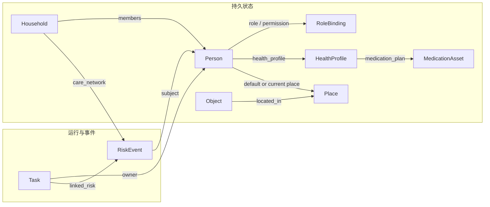

# 世界状态结构

---

文档版本：v1.0
创建日期：2026-03-08
作者：Codex-架构师

---

## 1. 文档目的

本文档定义一代产品的 `World State` 最小闭环结构。

这里的 `World State` 不是单纯地图，也不是记忆库，而是机器人在某一时刻进行感知理解、任务决策、健康联动和权限判断时所依赖的统一状态平面。

术语说明：

- `World State`：当前用于运行时决策和执行的统一结构化状态
- `World Model`：如后续引入，专指用于预测、模拟或想象未来环境与任务动态的模型

## 2. 设计目标

本版 `World State` 主要服务于四个目标：

1. 健康管理优先
2. 陪伴交互高频可用
3. 老人看护流程闭环
4. 家庭安全事件可审计

因此它必须同时表达：

- 人在哪里
- 这个人是谁
- 当前健康风险是什么
- 当前任务做到哪一步
- 当前动作是否被授权
- 当前是否需要家属、云服务或第三方介入

## 3. 统一结构原则

### 3.1 三层状态

建议把 `World State` 分成三层：

1. `snapshot_state`
说明：当前时刻的实时快照，供运行时决策使用。

2. `session_state`
说明：一次任务或一次交互会话中的上下文状态。

3. `persistent_state`
说明：长期状态，包括家庭结构、用户画像、权限、健康基线、药物信息和历史事件。

### 3.2 两类数据

建议严格区分：

1. `fact`
说明：感知或系统确认过的事实，例如“张三在客厅”“血压设备刚上传一次读数”。

2. `assessment`
说明：基于事实推导出的判断，例如“疑似跌倒”“需要提醒服药”“当前不宜主动打断”。

系统在审计时必须能区分“事实错了”还是“判断错了”。

### 3.3 所有关键实体都带上以下字段

- `id`
- `type`
- `version`
- `created_at`
- `updated_at`
- `source`
- `confidence`
- `privacy_level`

其中：

- `source` 用于标记来源于相机、麦克风、App、用户手填、纸质报告识别还是云服务
- `confidence` 用于感知置信度和推断置信度
- `privacy_level` 用于治理和出端策略

## 4. 一级实体

建议一代产品至少建模以下 9 类一级实体：

1. `Person`
2. `RoleBinding`
3. `Household`
4. `Place`
5. `Object`
6. `HealthProfile`
7. `MedicationAsset`
8. `Task`
9. `RiskEvent`

说明：

- 为遵守“任意一层尽量控制在 `5～9` 个实体”的约束，原先单列的 `ServiceLink` 不再作为一级实体独立存在，而是并入 `Household.care_network` 中作为受治理的嵌套结构。
- 这不意味着外部联动对象不重要，只表示在一代 `World State` 的一级实体层不再单独占一个顶层槽位。

### 4.1 一级实体关系图



说明：

- 这张图强调的是一代 `World State` 的一级实体骨架，具体字段和二级结构以下文定义为准。

## 5. 一级实体定义

### 5.1 `Person`

表示家庭中的人和长期交互主体。

关键字段：

| 字段 | 类型 | 说明 |
| --- | --- | --- |
| `person_id` | string | 全局唯一 ID |
| `identity_status` | enum | `identified` / `anonymous` / `uncertain` |
| `display_name` | string | 展示名称 |
| `age_group` | enum | 老人、成人、儿童 |
| `biometric_binding` | object | 人脸、声纹等绑定信息引用 |
| `mobility_level` | enum | 正常、受限、需辅助 |
| `interaction_preferences` | object | 音量、称呼、打断容忍度、语言风格 |
| `health_profile_id` | string | 关联健康画像 |
| `default_location` | string | 常驻位置或常用房间 |
| `care_priority` | enum | 普通、重点关注、紧急关注 |

备注：

- 老人本人和子女都属于 `Person`，权限差异不放在这里，而放在 `RoleBinding`。

### 5.2 `RoleBinding`

表示某个主体在当前家庭中的角色和权限。

关键字段：

| 字段 | 类型 | 说明 |
| --- | --- | --- |
| `binding_id` | string | 唯一 ID |
| `person_id` | string | 关联 `Person` |
| `role` | enum | `elder` / `child` / `caregiver` / `visitor` |
| `auth_scope` | object | 可执行动作范围 |
| `delegated_by` | string | 授权来源 |
| `effective_time_window` | object | 生效时间 |
| `requires_confirmation` | object | 哪些动作需二次确认 |
| `priority_rank` | integer | 权限仲裁顺序 |

备注：

- 保姆模式本质上是 `caregiver` 角色加特定任务权限模板。

### 5.3 `Household`

表示一个具体家庭及其看护网络。

关键字段：

| 字段 | 类型 | 说明 |
| --- | --- | --- |
| `household_id` | string | 家庭唯一 ID |
| `members` | string[] | 人员 ID 列表 |
| `care_network` | object[] | 家属、社区、物业、医生平台等联动对象列表，内含服务类型、触发策略、授权范围、责任边界和备用链路 |
| `home_mode` | enum | 白天、夜间、离家、休息、异常中 |
| `emergency_policy` | object | 高风险事件默认联动链路 |
| `privacy_policy` | object | 数据共享和上报规则 |

### 5.4 `Place`

表示空间、区域和语义位置。

关键字段：

| 字段 | 类型 | 说明 |
| --- | --- | --- |
| `place_id` | string | 位置唯一 ID |
| `category` | enum | 房间、走廊、门槛、充电点、药仓位、风险区 |
| `topology_parent` | string | 所属父区域 |
| `pose` | object | 坐标或拓扑位置 |
| `navigability` | enum | 可达、受限、危险 |
| `care_relevance` | enum | 普通、重点，比如床边、药柜、卫生间 |
| `night_policy` | object | 夜间活动规则 |

备注：

- 对养老场景，`床边`、`卫生间`、`药物存放区`、`充电点`、`门口` 是高优先级语义位置。

### 5.5 `Object`

表示可识别的重要物件。

关键字段：

| 字段 | 类型 | 说明 |
| --- | --- | --- |
| `object_id` | string | 唯一 ID |
| `category` | enum | 家具、障碍物、穿戴设备、生命体征设备、药盒、助行器、危险物 |
| `current_place_id` | string | 当前所在区域 |
| `ownership` | string | 归属人 |
| `state` | object | 开启、关闭、缺失、移动中等 |
| `care_tags` | string[] | 与健康、用药、风险相关标签 |

### 5.6 `HealthProfile`

表示老人或被照护人的长期健康画像。

关键字段：

| 字段 | 类型 | 说明 |
| --- | --- | --- |
| `health_profile_id` | string | 唯一 ID |
| `person_id` | string | 关联对象 |
| `baseline_metrics` | object | 基线生命体征 |
| `chronic_conditions` | string[] | 慢病标签 |
| `allergies` | string[] | 过敏信息 |
| `contraindications` | string[] | 用药禁忌 |
| `doctor_advice_refs` | string[] | 医嘱引用 |
| `emergency_plan` | object | 紧急时默认处理建议 |
| `medication_plan_ids` | string[] | 关联药物计划 |
| `device_binding_refs` | string[] | 绑定的穿戴设备和家用测量设备 |

备注：

- 这一实体不直接保存原始病历文件，可保存引用和结构化摘要。
- 一期优先绑定穿戴设备，同时保留家用测量设备的软件接入接口。

### 5.7 `MedicationAsset`

表示药物、药盒、药仓位和药物计划。

关键字段：

| 字段 | 类型 | 说明 |
| --- | --- | --- |
| `medication_id` | string | 唯一 ID |
| `owner_person_id` | string | 归属老人 |
| `name` | string | 药品名称 |
| `form` | enum | 片剂、胶囊、液体等 |
| `dosage_rule` | object | 剂量和频次 |
| `storage_place_id` | string | 存放位置 |
| `compartment_policy` | object | 仓门电动开关、防夹手、开关记录等策略 |
| `remaining_count` | number | 剩余数量 |
| `expiry_date` | string | 有效期 |
| `prescription_ref` | string | 处方引用 |
| `delivery_status` | enum | 未下单、配送中、已送达 |
| `emergency_use_policy` | object | 紧急用药前提和限制 |

备注：

- 如果机器人本体设有储物仓，储物仓中的药品也应被表示为 `MedicationAsset`。
- 一期储物仓必须具备防夹手、电动开关和开关状态记录能力；储物记录和交接确认能力应优先规划。

### 5.8 `Task`

表示系统正在执行或待执行的任务。

关键字段：

| 字段 | 类型 | 说明 |
| --- | --- | --- |
| `task_id` | string | 唯一 ID |
| `task_type` | enum | 陪伴、提醒、巡查、找人、送药、上报、问诊转接、回充 |
| `goal` | object | 任务目标 |
| `owner_person_id` | string | 服务对象 |
| `trigger_source` | enum | 用户请求、系统检测、计划任务、云侧触发 |
| `priority` | enum | 与决策排序对应 |
| `status` | enum | 待执行、执行中、阻塞、已完成、失败 |
| `preconditions` | object | 前置条件 |
| `approval_status` | enum | 待审、已批准、已拒绝 |
| `execution_trace_ref` | string | 过程记录引用 |

### 5.9 `RiskEvent`

表示运行时风险和异常事件。

关键字段：

| 字段 | 类型 | 说明 |
| --- | --- | --- |
| `risk_event_id` | string | 唯一 ID |
| `risk_type` | enum | 跌倒、昏迷疑似、碰撞、隐私、越权、药物冲突、网络失联 |
| `subject_person_id` | string | 关联人 |
| `severity` | enum | 低、中、高、紧急 |
| `status` | enum | 候选、确认、处理中、已关闭 |
| `recommended_action` | object | 推荐动作 |
| `reporting_policy_snapshot` | object | 生成时对应的上报策略 |
| `linked_task_id` | string | 关联任务 |

## 6. 关键关系

建议至少显式维护以下关系：

1. `Person` -> `RoleBinding`
2. `Person` -> `HealthProfile`
3. `HealthProfile` -> `MedicationAsset`
4. `Household` -> `Person`
5. `Household.care_network` -> 外部联动对象
6. `Person` -> `Place`
7. `Object` -> `Place`
8. `Person` -> `Object`
9. `Task` -> `Person`
10. `Task` -> `RiskEvent`
11. `RiskEvent` -> `Household.care_network`

## 7. 运行时快照

建议运行时维护一个 `DecisionContextSnapshot`，供每次决策直接读取。

建议字段：

| 字段 | 说明 |
| --- | --- |
| `timestamp` | 快照时间 |
| `active_persons` | 当前识别到的人 |
| `primary_elder_state` | 重点老人当前状态 |
| `current_place_state` | 当前位置和邻接风险 |
| `health_alerts` | 当前健康候选事件 |
| `active_tasks` | 当前任务队列 |
| `authorization_state` | 当前授权状态 |
| `network_state` | 在线、弱网、离线 |
| `battery_state` | 电量与回充需求 |
| `medication_urgency` | 是否存在紧急用药或即将到点服药 |
| `vital_signal_sources` | 当前生命体征信号来源，如穿戴设备、血压计、人工输入 |
| `wearable_freshness_state` | 穿戴数据的新鲜度及采集模式，如广播、SDK、问诊式补采 |
| `escalation_targets` | 当前可联动对象 |
| `manual_service_state` | 当前是否已发起后台人工服务、是否接通、是否超时 |

## 8. 推荐的事件类型

建议把进入世界状态的事件统一表达为 `WorldEvent`。

最低需要支持以下事件类型：

- `person_detected`
- `person_identified`
- `person_lost`
- `voice_command_received`
- `fall_suspected`
- `abnormal_vital_received`
- `wearable_signal_received`
- `medication_due`
- `medication_low_stock`
- `task_created`
- `task_state_changed`
- `authorization_changed`
- `caregiver_mode_enabled`
- `service_link_available`
- `service_link_failed`
- `manual_service_requested`
- `manual_service_connected`
- `manual_service_transferred`
- `manual_service_timeout`
- `manual_review_requested`
- `wearable_measurement_requested`
- `compartment_opened`
- `compartment_closed`
- `compartment_blocked`
- `robot_near_elder`
- `robot_delivery_completed`

## 9. 事实与判断的分层示例

示例：

事实层：

- “08:31:12，摄像头检测到老人位于卫生间地面，姿态接近横卧”
- “08:31:16，血氧设备上传一次 86 的读数”

判断层：

- “疑似跌倒，置信度 0.82”
- “存在高风险异常，建议触发家属提醒”

审批层：

- “已满足授权条件，可向家属发起提醒”
- “未满足 120 自动联动条件，保留人工确认”

## 10. 数据治理要求

对 `World State` 中的数据建议分成四级隐私等级：

1. `public_runtime`
说明：不含个人敏感信息的运行状态。

2. `personal_sensitive`
说明：身份、语音文本、位置、行为习惯。

3. `biometric_sensitive`
说明：人脸、声纹、生命体征原始值。

4. `medical_sensitive`
说明：病历摘要、医嘱、处方、购药记录。

规则：

- `biometric_sensitive` 和 `medical_sensitive` 默认不出端
- 云侧联动只拿结构化最小必要信息
- 每次外发都要保留 `consent_ref` 和审计链

## 11. 最小 JSON 结构示意

```json
{
  "snapshot_state": {
    "active_persons": [
      {
        "person_id": "person_elder_001",
        "place_id": "bathroom_01",
        "identity_status": "identified",
        "care_priority": "high"
      }
    ],
    "health_alerts": [
      {
        "risk_event_id": "risk_001",
        "risk_type": "fall",
        "severity": "high",
        "status": "confirmed"
      }
    ],
    "authorization_state": {
      "auto_report_enabled": true,
      "caregiver_mode": false
    }
  },
  "persistent_state": {
    "health_profiles": [
      {
        "health_profile_id": "hp_001",
        "person_id": "person_elder_001",
        "chronic_conditions": ["hypertension"],
        "contraindications": ["drug_x"]
      }
    ],
    "medication_assets": [
      {
        "medication_id": "med_001",
        "name": "nitroglycerin",
        "storage_place_id": "robot_bin_01",
        "remaining_count": 6
      }
    ]
  }
}
```

## 12. 当前仍需确认的设计点

在进入接口契约前，以下问题仍需继续明确：

1. 小米、华为等品牌设备的一期具体兼容范围
2. 后台人工服务的角色分工、SLA 和接入链路
3. UWB 雷达在室内粗定位、活动状态判断和生命体征监测上的成熟度
4. 储物仓交接、防误取和审计状态需要表达多细
5. 第三方平台责任边界如何映射到状态和审计模型

## 13. 下一步建议

基于本文件和已产出的决策状态机，建议下一份文档继续写：

1. 安全 / 合规 / 授权接口
2. 健康事件管线
3. 量产预备验证计划
