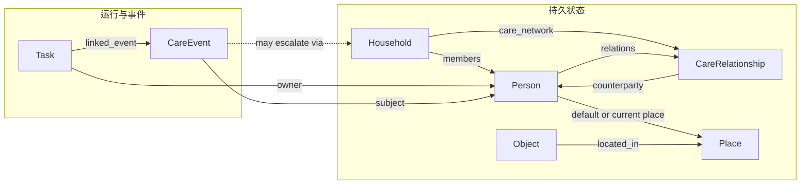

# 世界状态结构

---

文档版本：v2.3
创建日期：2026-03-08
作者：Codex-架构师

文档变更记录：
- v2.3 | 2026-04-09 | Codex-架构师 | 将当前未冻结项收紧为“摘要 + Linear 指针”治理：把字段表、关系质量维度、事件族全集和接口迁移策略分别指向 `KBT-32 / KBT-33 / KBT-56`，避免主线正文继续展开 orphan provisional。
- v2.2 | 2026-04-09 | Codex-架构师 | 继续做最小一致性修正：澄清穿戴是当前受控输入位，人工 / 第三方只保留后续适配位，并修正 `Household.care_network` 与 `CareEvent` 的关系图表达。
- v2.1 | 2026-04-09 | Codex-架构师 | 保留 `7` 实体主框架，但将 `V1` 最小激活子集改写为按实体展开的最小字段集，并把服务合同、复杂关系评分、共享记忆与跨家庭模式明确降为后续。
- v2.0 | 2026-04-06 | Codex-架构师 | 按 `Step 47` 第 `7/8` 条将本文从 `9` 实体比较基线升级为 `7` 实体目标模型主文档，补入 `V1` 最小激活子集与 `CareEvent / Task` 边界规则。
- v1.4 | 2026-04-06 | Codex-架构师 | 吸收 `Step 47` 第 `7/8` 条更新，明确当前 `9` 类骨架仅保留为比较基线，`Phase 3` 正式目标转向七实体模型，并补入 `CareEvent / Task` 边界约束。
- v1.3 | 2026-04-06 | Codex-架构师 | 补入 `Phase 3` 决策承接说明，明确当前 `9` 类骨架继续作为稳定基线，`9 -> 7` 需通过独立评审框架再决定。
- v1.2 | 2026-04-06 | Codex-架构师 | 按家庭共居智能体革新路线对齐本文，明确 `World State` 是多执行范式共享的状态平面，并显式保留 `9 -> 7` 与 `CareRelationship / CareEvent` 为后续 `provisional` 评审项。
- v1.1 | 2026-04-03 | Codex-架构师 | 吸收 Step46，补入 `semantic_global_frame / local_metric_frame` 双帧原则、`topometric memory`、`anchor_alignment` 与 `environment_change_state`，使世界状态可承接 `NFM` 的空间智能与长期记忆主线。
- v1.0 | 2026-03-08 | Codex-架构师 | 文档创建。

---

## 1. 文档目的

本文档定义一代产品的 `World State` 最小闭环结构。

这里的 `World State` 不是单纯地图，也不是记忆库，而是机器人在某一时刻进行感知理解、任务决策、健康联动和权限判断时所依赖的统一状态平面。

在当前 `Phase 3` 口径下，它还需要承担一个更明确的角色：

- 它是 `world_state_memory` 模块内部最核心的共享状态契约；
- 它服务离散决策、事件驱动和长周期演化等多种执行范式；
- 它当前已不再把 `9` 类骨架当作目标模型，而以七实体模型作为正式主方向。

术语说明：

- `World State`：当前用于运行时决策和执行的统一结构化状态
- `World Model`：如后续引入，专指用于预测、模拟或想象未来环境与任务动态的模型
- `semantic_global_frame`：用于房间、门口、家具、人物和热点区域关系的拓扑 / 语义全局帧
- `local_metric_frame`：用于局部几何、可通行性、动态障碍和短时执行的局部度量帧

## 2. 设计目标

本版 `World State` 主要服务于四个目标：

1. 健康管理优先
2. 陪伴交互高频可用
3. 老人看护流程闭环
4. 家庭安全事件可审计

同时，它还需要满足当前 `Phase 3` 的一个额外目标：

5. 为多执行范式提供共享状态平面，同时把目标模型收敛到与原则层一致的七实体表达

因此它必须同时表达：

- 人在哪里
- 这个人是谁
- 当前健康风险是什么
- 当前任务做到哪一步
- 当前动作是否被授权
- 当前是否需要家属、云服务或第三方介入

## 3. 统一结构原则

### 3.1 三层状态

建议把 `World State` 分成三层：

1. `snapshot_state`
说明：当前时刻的实时快照，供运行时决策使用。

2. `session_state`
说明：一次任务或一次交互会话中的上下文状态。

3. `persistent_state`
说明：长期状态，包括家庭结构、用户画像、权限、健康基线、药物信息和历史事件。

### 3.2 两类数据

建议严格区分：

1. `fact`
说明：感知或系统确认过的事实，例如“张三在客厅”“血压设备刚上传一次读数”。

2. `assessment`
说明：基于事实推导出的判断，例如“疑似跌倒”“需要提醒服药”“当前不宜主动打断”。

系统在审计时必须能区分“事实错了”还是“判断错了”。

### 3.3 所有关键实体都带上以下字段

- `id`
- `type`
- `version`
- `created_at`
- `updated_at`
- `source`
- `confidence`
- `privacy_level`

其中：

- `source` 用于标记来源于相机、麦克风、App、用户手填、纸质报告识别还是云服务
- `confidence` 用于感知置信度和推断置信度
- `privacy_level` 用于治理和出端策略

### 3.4 空间双帧原则

为支撑 `Step46` 中“空间智能 + 长期记忆 + 粗粒度全局定位”的要求，`World State` 需要同时维护两类空间表达：

1. `semantic_global_frame`
说明：用于表达房间、门口、家具、人物、目标和热点区域的拓扑 / 语义关系，是长期空间记忆和粗粒度全局定位的主表达。

2. `local_metric_frame`
说明：用于表达局部几何、可通行性、动态障碍和短时执行上下文，是局部规划、避障和短时重定位的主表达。

两者之间至少要显式维护以下对齐状态：

- `map_match_hypothesis`
- `anchor_alignment`
- `environment_change_state`

### 3.5 当前 `Phase 2` 的冻结边界

`Phase 2` 已经结束，相关冻结边界仍作为历史背景保留：

1. 当时继续保留 `9` 类一级实体骨架；
2. 当时未提前冻结 `World State 9 -> 7`；
3. 当时将 `CareRelationship / CareEvent` 保留为后续评审项。

### 3.6 当前 `Phase 3` 的决策承接

当前 `Phase 3` 的正式动作已经从“路线比较”推进到“目标模型收敛”。

因此进一步明确：

1. 本文已升级为 `World State` 的七实体目标模型主文档。
2. 路线 A 的扩展层方案保留在 `docs/08_reviews/archive/20_relationship_and_event_extension_layer_candidate.md`，仅作为对照路线与风险说明。
3. `docs/08_reviews/21_seven_entity_world_state_target_model.md` 继续作为本轮评审包，用于补充一级边界、`V1` 最小激活子集与迁移顺序。
4. `CareEvent` 正式替代 `RiskEvent`；`recommended_action` 只允许保留动作类型枚举，不得写执行细节；执行细节必须落在 `Task` 中。

## 4. 一级实体

当前目标模型收敛为以下 `7` 类一级实体：

1. `Person`
2. `CareRelationship`
3. `Household`
4. `Place`
5. `Object`
6. `Task`
7. `CareEvent`

说明：

1. `HealthProfile` 并入 `Person.health_state`。
2. `MedicationAsset` 并入 `Object` 的药物子类型。
3. `RoleBinding` 升级为 `CareRelationship`。
4. `RiskEvent` 升级为 `CareEvent`。
5. `Household.care_network` 继续保留为 `Household` 内的受治理嵌套结构，不单独占一个顶层槽位。

### 4.1 一级实体关系图



这张图表达的是当前目标模型，不再是旧 `9` 实体骨架的比较视图。

## 5. 一级实体定义

### 5.1 `Person`

表示家庭中的人和长期交互主体。

关键字段：

| 字段 | 类型 | 说明 |
| --- | --- | --- |
| `person_id` | string | 全局唯一 ID |
| `identity_status` | enum | `identified` / `anonymous` / `uncertain` |
| `display_name` | string | 展示名称 |
| `age_group` | enum | 老人、成人、儿童 |
| `biometric_binding` | object | 人脸、声纹等绑定信息引用 |
| `mobility_level` | enum | 正常、受限、需辅助 |
| `interaction_preferences` | object | 音量、称呼、打断容忍度、语言风格 |
| `health_state` | object | 长期健康状态、慢病、过敏、禁忌、设备绑定、医嘱摘要 |
| `default_location` | string | 常驻位置或常用房间 |
| `care_priority` | enum | 普通、重点关注、紧急关注 |

说明：

- `HealthProfile` 已降为 `Person` 的受治理子结构，不再单独作为一级实体存在。

### 5.2 `CareRelationship`

表示人和人、人和平台、人和人工服务之间的照护关系、信任层级和权力传递。

关键字段：

| 字段 | 类型 | 说明 |
| --- | --- | --- |
| `relationship_id` | string | 唯一 ID |
| `subject_person_id` | string | 关系主语，一般是被照护主体 |
| `counterparty_ref` | object | 对侧对象，可指向人、平台、坐席或第三方服务 |
| `relationship_role` | enum | `elder_child` / `elder_caregiver` / `elder_service` / `visitor` 等 |
| `auth_scope` | object | 可执行动作范围 |
| `delegated_by` | string | 授权来源 |
| `effective_time_window` | object | 生效时间 |
| `requires_confirmation` | object | 哪些动作需二次确认 |
| `priority_rank` | integer | 仲裁顺序 |
| `relationship_phase` | enum | `initial` / `stable` / `fragile` 等阶段标签 |
| `trust_level` | enum | 关系信任等级，`V1` 默认使用枚举而非连续分值 |

说明：

- 旧 `RoleBinding` 只保留为迁移阶段或实现层投影视图，不再是目标模型中的一级实体。

### 5.3 `Household`

表示一个具体家庭及其看护网络。

关键字段：

| 字段 | 类型 | 说明 |
| --- | --- | --- |
| `household_id` | string | 家庭唯一 ID |
| `members` | string[] | 人员 ID 列表 |
| `care_network` | object[] | 家属、社区、物业、医生平台等联动对象列表；当前 `V1` 默认只激活家属与 App 远程确认，其他对象保留后续适配位 |
| `home_mode` | enum | 白天、夜间、离家、休息、异常中 |
| `emergency_policy` | object | 高风险事件默认联动链路 |
| `privacy_policy` | object | 数据共享和上报规则 |
| `service_contracts` | object[] | 与人工服务、平台履约和第三方协同相关的治理配置 |

### 5.4 `Place`

表示空间、区域和语义位置。

关键字段：

| 字段 | 类型 | 说明 |
| --- | --- | --- |
| `place_id` | string | 位置唯一 ID |
| `category` | enum | 房间、走廊、门槛、充电点、药仓位、风险区 |
| `topology_parent` | string | 所属父区域 |
| `pose` | object | 在 `semantic_global_frame` 中的锚点坐标或拓扑位置 |
| `semantic_anchor_id` | string | 对应的语义锚点 ID |
| `navigability` | enum | 可达、受限、危险 |
| `care_relevance` | enum | 普通、重点，比如床边、药柜、卫生间 |
| `night_policy` | object | 夜间活动规则 |

### 5.5 `Object`

表示可识别的重要物件。

关键字段：

| 字段 | 类型 | 说明 |
| --- | --- | --- |
| `object_id` | string | 唯一 ID |
| `category` | enum | 家具、障碍物、穿戴设备、生命体征设备、药盒、助行器、危险物 |
| `current_place_id` | string | 当前所在区域 |
| `ownership` | string | 归属人 |
| `state` | object | 开启、关闭、缺失、移动中等 |
| `care_tags` | string[] | 与健康、用药、风险相关标签 |
| `subtype_payload` | object | 物件类型专属字段；药物对象在此承载剂量、有效期、仓位、电动仓门策略等 |

说明：

- `MedicationAsset` 已并入 `Object`，以药物子类型表达。

### 5.6 `Task`

表示系统正在执行或待执行的任务。

关键字段：

| 字段 | 类型 | 说明 |
| --- | --- | --- |
| `task_id` | string | 唯一 ID |
| `task_type` | enum | 陪伴、提醒、巡查、找人、送药、上报、问诊转接、回充 |
| `goal` | object | 任务目标 |
| `owner_person_id` | string | 服务对象 |
| `trigger_source` | enum | 用户请求、系统检测、计划任务、云侧触发 |
| `priority` | enum | 与决策排序对应 |
| `status` | enum | 待执行、执行中、阻塞、已完成、失败 |
| `preconditions` | object | 前置条件 |
| `approval_status` | enum | 待审、已批准、已拒绝 |
| `execution_trace_ref` | string | 过程记录引用 |
| `linked_care_event_id` | string | 关联照护事件 |

### 5.7 `CareEvent`

表示已发生、被感知到或被模型判断发生的照护事件。

关键字段：

| 字段 | 类型 | 说明 |
| --- | --- | --- |
| `care_event_id` | string | 唯一 ID |
| `event_class` | enum | `risk` / `service_handoff` / `medication` / `companion` / `safety` |
| `event_type` | enum | 跌倒疑似、异常心率、到点服药、人工接通、主动问候等具体事件类型 |
| `subject_person_id` | string | 关联人 |
| `severity` | enum | 低、中、高、紧急 |
| `status` | enum | 候选、确认、处理中、已关闭 |
| `recommended_action` | enum[] | 只允许保留动作类型枚举，如 `remind / approach / escalate_family / create_task` |
| `relationship_ref` | string | 关联照护关系 |
| `reporting_policy_snapshot` | object | 生成时对应的上报策略 |
| `linked_task_id` | string | 关联任务 |
| `evidence_refs` | object[] | 生命体征、视觉、语音、人工记录等证据引用 |

约束：

1. `CareEvent` 回答“已发生 / 被判断已发生”。
2. `Task` 回答“待执行 / 正在执行”。
3. `recommended_action` 不得写入执行细节，任何话术、导航目标、超时、重试与流程步骤必须落在 `Task`。

## 6. 关键关系

建议至少显式维护以下关系：

1. `Person` -> `CareRelationship`
2. `Household` -> `Person`
3. `Household.care_network` -> 外部联动对象
4. `Person` -> `Place`
5. `Object` -> `Place`
6. `Person` -> `Object`
7. `Task` -> `Person`
8. `Task` -> `CareEvent`
9. `CareEvent` -> `CareRelationship`
10. `CareEvent` -> `Household.care_network`

## 7. 运行时快照

建议运行时维护一个 `DecisionContextSnapshot`，供每次决策直接读取。

建议字段：

| 字段 | 说明 |
| --- | --- |
| `timestamp` | 快照时间 |
| `semantic_global_anchor` | 当前粗粒度语义锚点 |
| `map_match_hypothesis` | 当前观测与语义地图的匹配假设 |
| `local_execution_context` | 当前 `local_metric_frame`、局部风险和执行状态摘要 |
| `environment_change_state` | 当前是否存在环境变化、地图漂移或锚点失效 |
| `active_persons` | 当前识别到的人 |
| `primary_care_state` | 重点被照护对象当前状态 |
| `current_place_state` | 当前位置和邻接风险 |
| `care_events` | 当前关键照护事件 |
| `active_tasks` | 当前任务队列 |
| `active_relationships` | 当前生效照护关系摘要 |
| `network_state` | 在线、弱网、离线 |
| `battery_state` | 电量与回充需求 |
| `medication_urgency` | 是否存在紧急用药或即将到点服药 |
| `vital_signal_sources` | 当前生命体征信号来源，如穿戴设备、血压计、人工输入；穿戴当前作为受控输入位存在 |
| `wearable_freshness_state` | 穿戴数据的新鲜度及采集模式，如广播、SDK、问诊式补采 |
| `escalation_targets` | 当前可联动对象；当前 `V1` 默认以家属 App / 远程确认为主，其他对象保留预留 |
| `manual_service_state` | 后续适配位，当前 V1 不进入最小快照 |

## 8. 推荐的事件类型

建议把进入世界状态的事件统一表达为 `WorldEvent`。

最低需要支持以下事件类型：

- `person_detected`
- `person_identified`
- `person_lost`
- `relationship_created`
- `relationship_changed`
- `voice_command_received`
- `fall_suspected`
- `abnormal_vital_received`
- `wearable_signal_received`
- `medication_due`
- `medication_low_stock`
- `task_created`
- `task_state_changed`
- `authorization_changed`
- `caregiver_mode_enabled`
- `manual_review_requested`
- `wearable_measurement_requested`
- `companion_initiated`
- `companion_positive_response`
- `compartment_opened`
- `compartment_closed`
- `compartment_blocked`
- `robot_near_elder`
- `robot_delivery_completed`

## 9. 事实与判断的分层示例

示例：

事实层：

- “08:31:12，摄像头检测到老人位于卫生间地面，姿态接近横卧”
- “08:31:16，血氧设备上传一次 86 的读数”

判断层：

- “疑似跌倒，置信度 0.82”
- “存在高风险照护事件，建议触发家属提醒”

审批层：

- “已满足关系授权条件，可向家属发起提醒”
- “未满足 120 自动联动条件，保留人工确认”

## 10. 数据治理要求

对 `World State` 中的数据建议分成四级隐私等级：

1. `public_runtime`
说明：不含个人敏感信息的运行状态。

2. `personal_sensitive`
说明：身份、语音文本、位置、行为习惯。

3. `biometric_sensitive`
说明：人脸、声纹、生命体征原始值。

4. `medical_sensitive`
说明：病历摘要、医嘱、处方、购药记录。

规则：

- `biometric_sensitive` 和 `medical_sensitive` 默认不出端
- 云侧联动只拿结构化最小必要信息
- 每次外发都要保留 `consent_ref` 和审计链

## 11. `V1` 最小激活子集

当前 `V1` 的目标不是把七实体的全部潜力一次性激活，而是：

1. 先按正确的七实体模型组织数据；
2. 只激活一代当前闭环真正需要的子集。

当前建议的一代最小字段集如下：

| 实体 | `V1` 当前必需字段 | 当前不进入 `V1` 的内容 |
| --- | --- | --- |
| `Person` | `person_id / identity_status / display_name / age_group / mobility_level / interaction_preferences / health_state / default_location / care_priority` | 更细的长期关系评分、复杂画像扩展 |
| `CareRelationship` | `relationship_id / subject_person_id / counterparty_ref / relationship_role / auth_scope / requires_confirmation / priority_rank` | `relationship_phase` 的细分扩展、连续型关系质量分值 |
| `Household` | `household_id / members / home_mode / emergency_policy / privacy_policy` | `service_contracts`、复杂 `care_network` 编排、跨家庭联动 |
| `Place` | `place_id / category / topology_parent / pose / navigability / care_relevance / night_policy` | 更丰富的语义锚点扩展和平台共享空间结构 |
| `Object` | `object_id / category / current_place_id / ownership / state / care_tags / subtype_payload`（仅药物、穿戴、生命体征设备、关键危险物激活） | 大范围目标物扩展和跨家庭共享物件模式 |
| `Task` | `task_id / task_type / goal / owner_person_id / trigger_source / priority / status / approval_status / linked_care_event_id` | 更复杂的执行追踪编排、服务转接主链 |
| `CareEvent` | `care_event_id / event_class / event_type / subject_person_id / severity / status / recommended_action / linked_task_id / evidence_refs` | 平台共享记忆、跨家庭模式、复杂服务编排事件 |

当前 `V1` 默认不进入最小字段集的内容：

1. `service_contracts`
2. 连续型关系质量与复杂阶段评分
3. 平台共享记忆
4. 跨家庭模式
5. 依赖后台人工服务或第三方服务的主链字段

## 12. 最小 JSON 结构示意

```json
{
  "snapshot_state": {
    "semantic_global_anchor": {
      "place_id": "living_room_01",
      "confidence": 0.86
    },
    "map_match_hypothesis": {
      "matched_regions": ["living_room_01", "corridor_01"],
      "status": "stable"
    },
    "local_execution_context": {
      "frame": "local_metric_frame",
      "nearby_risk": "low"
    },
    "environment_change_state": {
      "status": "normal",
      "drift_alert": false
    },
    "active_persons": [
      {
        "person_id": "person_elder_001",
        "place_id": "bathroom_01",
        "identity_status": "identified",
        "care_priority": "high"
      }
    ],
    "care_events": [
      {
        "care_event_id": "care_event_001",
        "event_class": "risk",
        "event_type": "fall",
        "severity": "high",
        "status": "confirmed"
      }
    ],
    "active_relationships": [
      {
        "relationship_id": "rel_001",
        "relationship_role": "elder_child",
        "trust_level": "authorized"
      }
    ]
  },
  "persistent_state": {
    "semantic_global_frame": {
      "topology_version": "home_v3",
      "anchors": ["living_room_01", "bathroom_01", "bedside_table_01"]
    },
    "persons": [
      {
        "person_id": "person_elder_001",
        "health_state": {
          "chronic_conditions": ["hypertension"],
          "contraindications": ["drug_x"]
        }
      }
    ],
    "objects": [
      {
        "object_id": "obj_med_001",
        "category": "medication",
        "subtype_payload": {
          "name": "nitroglycerin",
          "storage_place_id": "robot_bin_01",
          "remaining_count": 6
        }
      }
    ]
  }
}
```

## 13. 当前仍未冻结的内容

以下内容继续保留为 `provisional`，但主线正文只保留摘要，详细治理转到对应 Linear issue：

1. 七实体各自的完整字段表：由 `KBT-32` 承接；冻结条件是 `S2 / S4 / S5` 下游对象、接口和验证清单稳定，不再反向扩张主线。
2. `CareRelationship` 是否需要连续型关系质量维度：由 `KBT-32` 承接；冻结条件是关系演化的最小观测口径、消费方和验证方式明确，且不会把 `Phase 5` 的战略验证阈值提前写回当前主线。
3. `CareEvent` 的最终事件族全集：由 `KBT-32` 承接；冻结条件是事件边界、审批依赖和 `S2 / S4 / S5` 的验证职责明确。
4. proto 和下游接口的具体迁移顺序 / `breaking change` 策略：由 `KBT-33` 承接；冻结条件是接口 owner、版本号、变更门和迁移规则明确。

统一治理母单为 `KBT-56`，用于追踪活跃 `provisional` 的 owner、冻结条件和阶段门。

## 14. 下一步建议

基于本文件，下一步应进入：

1. `Phase 4`：把新的状态模型映射回下游方案与评审包
2. 明确 `KBT-32 / KBT-33` 下游接口和治理承接
3. 为 `Kinbot_Code` 仓库准备迁移顺序与 breaking change 管理策略
