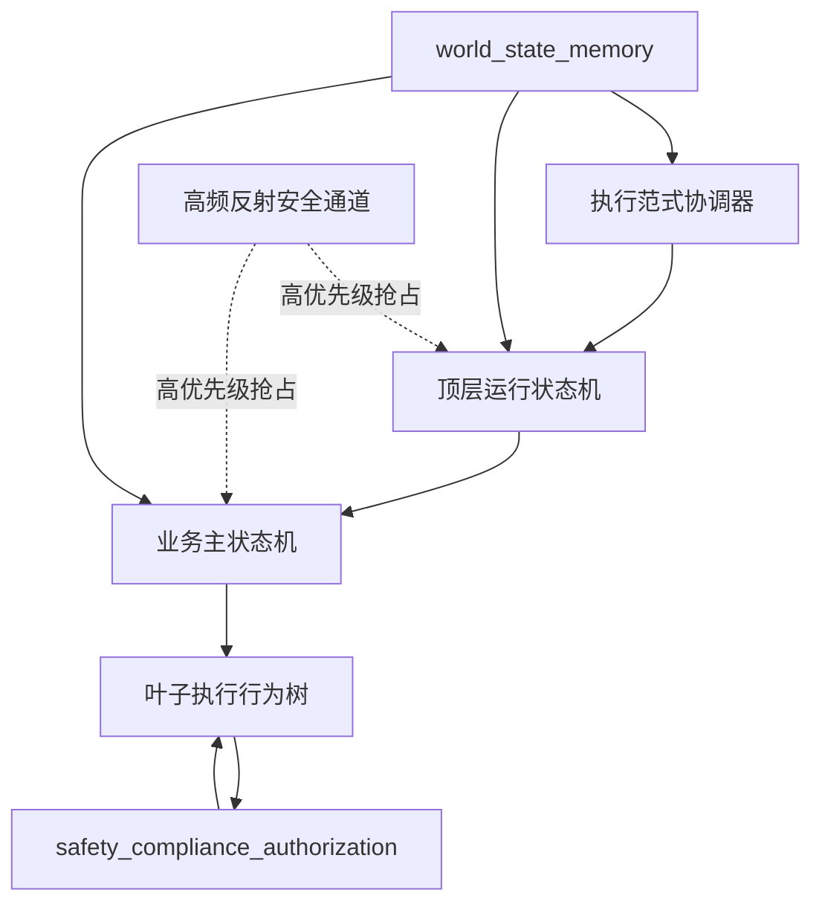
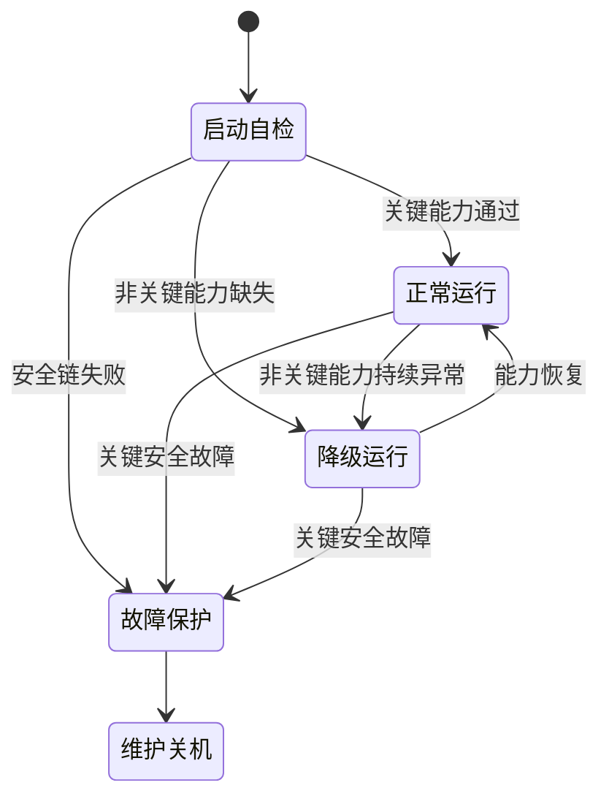
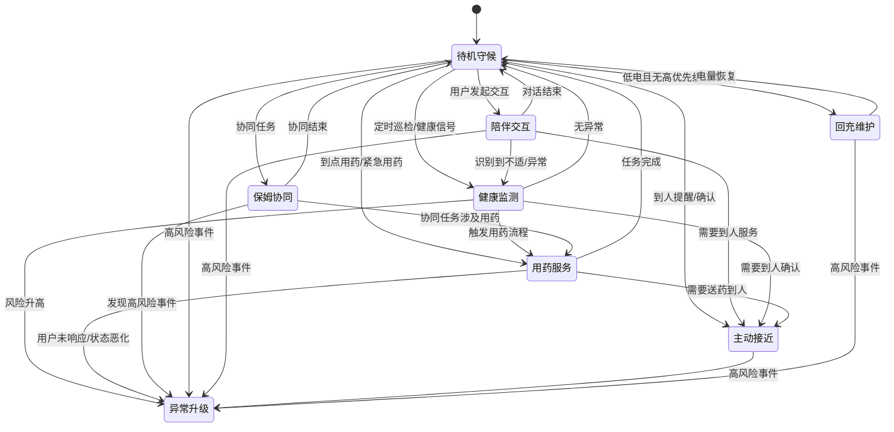

# 决策状态机

---

文档版本：v1.4
创建日期：2026-03-08
作者：Codex-架构师

文档变更记录：
- v1.4 | 2026-04-09 | Codex-架构师 | 重组正文结构，聚焦控制结构、状态定义、转移规则、中断源与必须确认边界；保留既有 `5` 个顶层状态、`8` 个业务主状态、`4` 个约束子状态，并将过长说明、量产预备视角、待评审点和下一步建议下沉到附录。
- v1.3 | 2026-04-06 | Codex-架构师 | 按 `Phase 4` 口径补入 `CareEvent -> Task` 的输入边界，明确状态机消费照护事件而不是继续围绕旧 `RiskEvent` 组织语义。
- v1.2 | 2026-04-06 | Codex-架构师 | 继续清理正文中的旧 `OODA` 术语残留，统一改写为离散决策范式内部机制的表达。
- v1.1 | 2026-04-06 | Codex-架构师 | 按家庭共居智能体革新路线对齐本文，明确状态机只描述多执行范式中的离散决策业务面，不再隐含承担总运行时角色。
- v1.0 | 2026-03-08 | Codex-架构师 | 文档创建。

---

## 1. 文档目的

本文档只说明离散决策业务面的状态机。

正文聚焦 5 件事：

1. 控制结构如何分层
2. 顶层状态、业务主状态、约束子状态分别是什么
3. 什么条件会触发状态切换
4. 哪些事件会从任意状态打断当前流程
5. 哪些动作可以直接执行，哪些动作必须先确认

其他执行范式、长期策略和更详细的方法论说明，不在本文展开。

## 2. 当前适用边界

本文件基于以下当前前提：

- 首发场景为中国大陆居家养老
- 一代价值排序为“健康管理 > 陪伴交互 > 老人看护 > 家庭安全巡护”
- 状态机只描述多执行范式中的离散决策业务面
- 高频反射安全通道可高优先级抢占，不等待业务状态机批准
- 当前 `World State` 已升级为七实体目标模型，状态机通过 `CareEvent` 消费已发生或被判断已发生的事件，再触发相应 `Task`

## 3. 控制结构

### 3.1 设计原则

1. 采用分层状态机表达顶层运行模式和业务主状态。
2. 行为树只用于叶子执行流程，不承担顶层状态表达。
3. 任何业务状态都不能绕过实时运动安全链。
4. 高风险异常、关键安全故障、低电、人工接入和权限冲突都视为跨状态中断源。
5. 状态机只描述“机器人当前在做什么”，不替代世界状态、任务数据和长期策略。

### 3.2 控制结构图

说明：

- 这张图只表达控制责任分层，不表达线程或进程部署。
- 执行范式协调器负责汇总离散业务面的输入与跨范式接力信息，不代替总运行时说明。

## 4. 状态定义

### 4.1 顶层状态

顶层固定为 5 个状态：

| 顶层状态 | 作用 | 进入条件 | 典型退出 |
| --- | --- | --- | --- |
| `启动自检` | 校验关键能力与启动条件 | 开机、重启、异常恢复 | 进入 `正常运行`、`降级运行` 或 `故障保护` |
| `正常运行` | 进入完整业务运行面 | 自检通过 | 切到 `降级运行`、`故障保护` 或 `维护 / 关机` |
| `降级运行` | 保留核心能力，关闭部分非核心能力 | 非关键能力持续异常 | 恢复到 `正常运行`，或继续降到 `故障保护` |
| `故障保护` | 停止不安全执行并进入受控保护 | 关键安全故障 | 进入 `维护 / 关机` 或故障恢复后的重新自检 |
| `维护 / 关机` | 维护、检修、人工停机 | 人工维护、关机流程、故障后处理 | 重新启动后回到 `启动自检` |

### 4.2 业务主状态

在 `正常运行` 或 `降级运行` 内，业务主状态固定为 8 个：

| 业务主状态 | 主要用途 | 常见触发 |
| --- | --- | --- |
| `待机守候` | 低扰动待命与持续感知 | 空闲、任务完成、恢复默认 |
| `陪伴交互` | 对话、提醒、信息表达 | 用户发起交互、低风险提醒表达 |
| `主动接近` | 移动到人并完成提醒、观察、确认或递送 | 到人任务、确认任务、送药任务 |
| `健康监测` | 汇总健康信号并形成风险判断 | 定时巡检、异常信号、主诉不适 |
| `用药服务` | 提醒、递送、确认、记录与通知 | 到点用药、紧急用药、协同用药 |
| `保姆协同` | 在授权范围内与保姆或照护者配合执行任务 | 协同任务、照护接力 |
| `异常升级` | 处理高风险事件和升级链路 | 跌倒、急性异常、危险环境、人身风险 |
| `回充维护` | 回充、补能和基础维护 | 低电、夜间空闲、无更高优先级任务 |

### 4.3 约束子状态

约束子状态固定为 4 个，可叠加在业务主状态之上：

| 约束子状态 | 作用 | 典型影响 |
| --- | --- | --- |
| `夜间静默` | 限制主动播报、主动接近和非必要打断 | 保持感知，但收缩主动输出 |
| `离线约束` | 关闭依赖云端或外部平台的动作 | 保留本地感知、基础交互和本地看护链 |
| `人工服务协同` | 表示后台人工已接入或正在接力 | 允许人工确认、接续和升级 |
| `权限冲突待确认` | 表示老人、子女或照护者指令出现冲突 | 冻结冲突动作，等待进一步确认 |

## 5. 转移规则

### 5.1 顶层转移规则

1. `启动自检 -> 正常运行`
条件：关键能力通过，且不存在阻止运行的安全问题。

2. `启动自检 -> 降级运行`
条件：非关键能力缺失，但核心能力与安全链仍可用。

3. `启动自检 -> 故障保护`
条件：安全链失败，或继续运行已不安全。

4. `正常运行 -> 降级运行`
条件：非关键能力持续异常，且当前仍能保留核心业务。

5. `降级运行 -> 正常运行`
条件：被关闭或降级的能力恢复，重新满足完整运行条件。

6. `正常运行 / 降级运行 -> 故障保护`
条件：出现关键安全故障，继续运行存在不可接受风险。

7. `故障保护 -> 维护 / 关机`
条件：进入检修、停机或人工保护流程。

### 5.2 业务主状态转移规则

1. `待机守候 -> 陪伴交互`
条件：用户主动交互，或低风险提醒需要自然语言表达。

2. `待机守候 -> 健康监测`
条件：定时巡检、健康信号变化或健康相关请求进入处理。

3. `待机守候 -> 主动接近`
条件：任务要求到人提醒、观察、确认或递送。

4. `待机守候 -> 用药服务`
条件：到点用药、紧急用药或用药相关任务被触发。

5. `待机守候 -> 保姆协同`
条件：协同任务被授权并进入执行。

6. `待机守候 -> 回充维护`
条件：低电且无更高优先级任务，或进入维护窗口。

7. `陪伴交互 -> 待机守候`
条件：对话结束且无未完成任务。

8. `陪伴交互 -> 主动接近`
条件：交互中确认需要到人服务。

9. `陪伴交互 -> 健康监测`
条件：交互中识别到不适、异常表达或健康检查请求。

10. `健康监测 -> 待机守候`
条件：本轮判断无异常，且无后续动作。

11. `健康监测 -> 主动接近`
条件：需要到人确认、补采或近距离观察。

12. `健康监测 -> 用药服务`
条件：风险判断或计划任务触发用药流程。

13. `健康监测 -> 异常升级`
条件：风险上升到需要升级处置。

14. `用药服务 -> 主动接近`
条件：需要送药到人或到人确认服药。

15. `用药服务 -> 待机守候`
条件：提醒、递送、确认和记录完成。

16. `用药服务 -> 异常升级`
条件：用户未响应、状态恶化或出现高风险用药事件。

17. `保姆协同 -> 待机守候`
条件：协同任务结束。

18. `保姆协同 -> 用药服务`
条件：协同任务涉及用药执行。

19. `保姆协同 -> 异常升级`
条件：协同过程中发现高风险事件。

20. `回充维护 -> 待机守候`
条件：电量恢复，且无更高优先级任务。

21. 任意业务主状态 -> `异常升级`
条件：出现高风险异常。

### 5.3 状态图

## 6. 中断源

以下事件可从任意业务主状态打断当前流程：

| 中断源 | 默认动作 |
| --- | --- |
| `高风险异常` | 直接进入 `异常升级` |
| `关键安全故障` | 直接进入 `故障保护` |
| `低电量` | 无高优先级任务时进入 `回充维护`；有高优先级任务时延后 |
| `权限冲突` | 叠加 `权限冲突待确认`，冻结冲突动作 |
| `网络离线` | 叠加 `离线约束`，关闭云端相关动作 |
| `后台人工服务接入` | 叠加 `人工服务协同`，允许人工接力或确认 |

## 7. 必须确认边界

### 7.1 可直接执行

- 已授权的主动接近
- 已授权的提醒、播报、对话
- 已授权的送药到人
- 已授权的家属提醒
- 本地二次确认和环境复核
- 低电自动回充

### 7.2 必须先确认

- 老人本人与子女之间的冲突命令
- 新的高风险外部联动
- 未在授权策略中的购药、问诊和社区 / 物业通知
- 任何超出“提醒 / 递送 / 确认 / 告知”边界的医疗处置

### 7.3 当前只保留接口位

- 机器人直接入网拨号
- `120` 自动联动闭环
- `UWB` 心率监测进入首版量产 `BOM`

## 8. 与其他模块的主要交互

状态机继续向下拆分时，至少依赖以下输入与结果：

1. `world_state_memory`
提供 `DecisionContextSnapshot`、当前任务、授权状态、健康基线和人工服务状态。

2. `safety_compliance_authorization`
对“主动接近、递送、上报、购药、问诊转接、人工服务接入”给出批准、拒绝、降级或待确认结果。

3. `mobility_navigation`
提供到人导航、回充、路径失败和受阻原因。

4. `companion_service_system`
提供家属确认、授权变更、计划任务、问诊转接、第三方服务结果、人工服务接入状态和失败原因。

## 附录 A. 状态使用补充

### A1. 顶层状态的使用补充

- `正常运行` 内部承载完整业务主状态。
- `降级运行` 不是停机，而是在保留核心看护链的前提下关闭部分非核心能力。
- `故障保护` 表示继续运行已不安全，必须停止运动或进入受控保护。

### A2. 业务主状态的使用补充

- `主动接近`、`陪伴交互` 更常落在短周期执行环。
- `健康监测`、`用药服务`、`异常升级` 更常由跨步骤任务推进环主导。
- 长期提醒优化、习惯学习和服务编排不会新增业务主状态，但会影响这些状态的触发条件和策略参数。
- 高风险外部触发很多时候以事件形式进入状态机，而不是通过新增状态来表达。

### A3. 个别状态的补充边界

- `健康监测` 中，当穿戴数据新鲜度不足时，应优先触发问诊式补采、`BLE` 外设补采或人工服务，而不是直接做高风险自动判断。
- `用药服务` 当前边界仍限于提醒取药、送药到人、提醒服药并确认、联系子女。
- `保姆协同` 不表示机器人服从保姆的全部命令；涉及高权限冲突时，必须进入 `权限冲突待确认`。
- `异常升级` 的后台人工首线角色按客服运营坐席设计，其他外部角色通过其转接进入。
- `回充维护` 必须允许被更高优先级事件打断。

## 附录 B. 中断分类清单

### B1. 高风险异常

当前一级异常类保持为 7 类：

| ID | 一级异常类 | 典型触发示例 | 默认状态动作 |
| --- | --- | --- | --- |
| `A1` | 跌倒 / 久卧不起 / 无响应 | 跌倒疑似、长时间卧地、主动呼叫无应答 | 进入 `异常升级`，并触发本地二次确认 |
| `A2` | 急性生命体征异常 | 心率、血氧、血压、血糖等指标显著异常 | 进入 `健康监测` 或直接升级到 `异常升级` |
| `A3` | 主动求救与明显痛苦表达 | 呼救、胸痛、呼吸困难、强烈不适表达 | 直接进入 `异常升级` |
| `A4` | 高敏空间异常停留 | 夜间离床异常、卫生间超时滞留、床边异常静止 | 进入 `健康监测`，必要时升级到 `异常升级` |
| `A5` | 用药高风险事件 | 漏服、重复服、禁忌冲突、紧急药物需求 | 进入 `用药服务` 或 `异常升级` |
| `A6` | 家庭危险环境事件 | 厨房风险、烟雾、热源、水渍、门窗异常 | 进入 `异常升级` |
| `A7` | 入户与人身安全事件 | 陌生人闯入、可疑逗留、授权外人员高风险靠近 | 进入 `异常升级` |

### B2. 关键安全故障

当前一级故障类保持为 7 类：

| ID | 一级故障类 | 典型触发示例 | 默认顶层动作 |
| --- | --- | --- | --- |
| `F1` | 障碍感知安全链失效 | 前向关键感知丢失、近距障碍无法判定 | 立即进入 `故障保护` |
| `F2` | 定位与位姿安全失效 | 位姿持续漂移、重定位失败且无法安全移动 | 立即进入 `故障保护` |
| `F3` | 底盘执行链故障 | 驱动、制动、转向、轮速反馈异常 | 立即进入 `故障保护` |
| `F4` | 电池 / 供电 / 热失效 | 电池异常升温、供电不稳、热保护触发 | 立即进入 `故障保护` |
| `F5` | 关键计算与运行时故障 | 安全进程崩溃、看门狗触发、核心资源耗尽 | 立即进入 `故障保护` |
| `F6` | 关键总线 / 时钟 / 同步失效 | 关键消息链中断、时间同步异常导致状态不可信 | 立即进入 `故障保护` |
| `F7` | 储物仓与执行机构安全故障 | 防夹手失效、仓门卡滞且存在夹伤风险 | 停止相关执行并进入 `故障保护` |

## 附录 C. 记录与验证要求

- 状态枚举应保持稳定，不以临时试验名义增加隐式模式。
- 每次状态切换都应有可追溯的事件与原因码。
- 每类高风险异常与关键安全故障都应映射到验证用例。
- 算法版本可以替换，但不应频繁改动状态枚举和主要边界。
