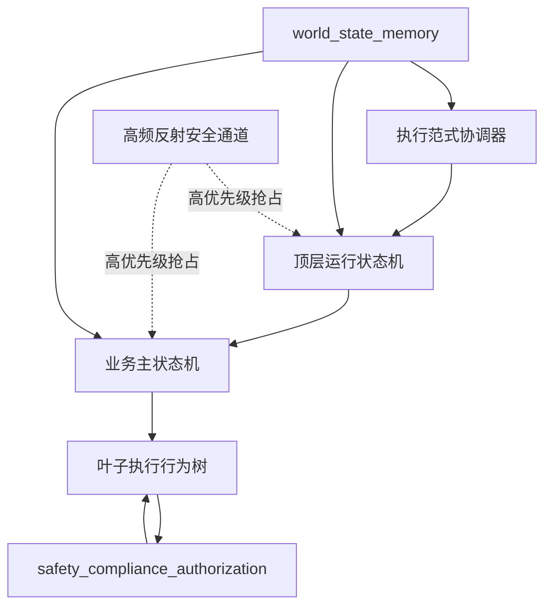
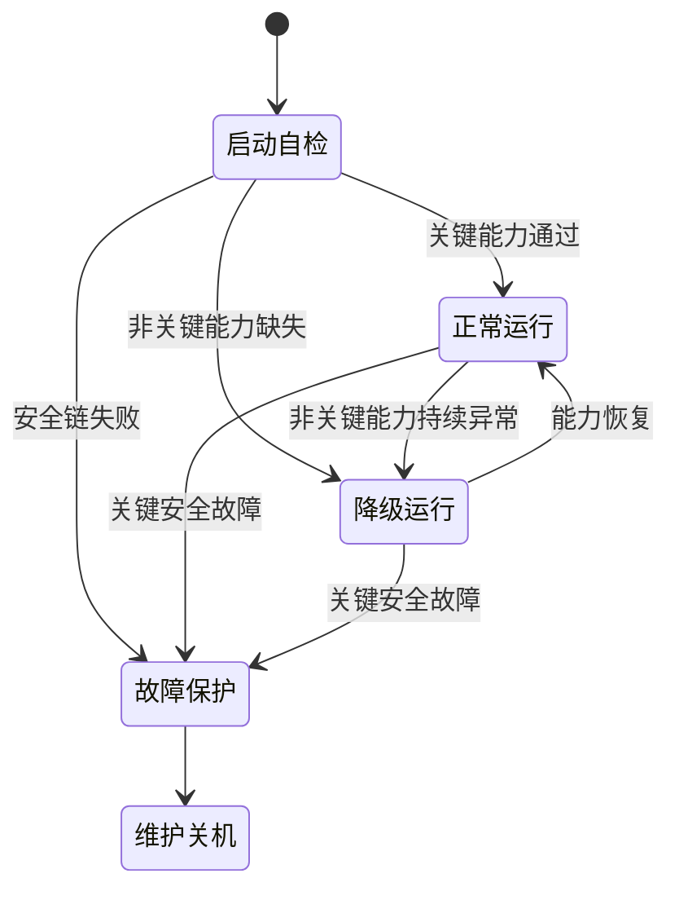
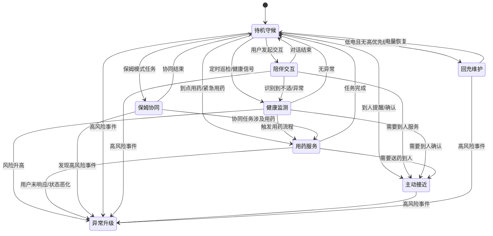

# 决策状态机

---

文档版本：v1.3
创建日期：2026-03-08
作者：Codex-架构师

文档变更记录：
- v1.3 | 2026-04-06 | Codex-架构师 | 按 `Phase 4` 口径补入 `CareEvent -> Task` 的输入边界，明确状态机消费照护事件而不是继续围绕旧 `RiskEvent` 组织语义。
- v1.2 | 2026-04-06 | Codex-架构师 | 继续清理正文中的旧 `OODA` 术语残留，统一改写为离散决策范式内部机制的表达。
- v1.1 | 2026-04-06 | Codex-架构师 | 按家庭共居智能体革新路线对齐本文，明确状态机只描述多执行范式中的离散决策业务面，不再隐含承担总运行时角色。
- v1.0 | 2026-03-08 | Codex-架构师 | 文档创建。

---

## 1. 文档目的

本文档定义一代机器人的顶层运行状态、业务主状态、约束子状态，以及它们之间的关键跳转规则。

目标不是把所有实现细节写死，而是先固定三件事：

1. 机器人在运行时到底处于哪些“可管理、可审计”的状态
2. 什么事件会触发状态切换
3. 哪些动作可以自动执行，哪些动作必须经过确认或人工介入

## 2. 当前设计前提

本版本基于以下已确认条件：

- 首发场景是中国大陆居家养老
- 首版主价值排序为“健康管理 > 陪伴交互 > 老人看护 > 家庭安全巡护”
- 项目主节点是 2026 年 12 月 31 日达到量产预备状态，2027 年 1 月为 MVP 验证窗口
- 已授权行为需要做到完全自主
- 夜间默认静默，但传感器保持开启
- 一期紧急用药动作边界为提醒取药、送药到人、提醒服药并确认、联系子女
- 高风险异常默认先联动家属，并为 120 路线保留接口
- 一期需要后台人工服务能力，可参考在线问诊模式
- 机器人直接入网打电话只做架构预留，不进入一期预研
- 储物仓按紧凑、通用、灵活空间设计，递送能力依赖机器人运动
- 离散决策范式内部当前继续保留高频反射安全、短周期执行、跨步骤任务推进与长期策略回写这 `4` 类执行环
- 当前总运行时已进入“多执行范式基线”，状态机只描述其中离散决策业务面的可管理状态
- 当前 `World State` 已升级为七实体目标模型，状态机当前通过 `CareEvent` 消费已发生 / 被判断已发生的事件，再触发相应 `Task`

## 3. 状态机设计原则

1. 采用分层状态机，而不是单层枚举状态。
2. 所有高风险动作都要先经过 `安全 / 合规 / 授权` 门。
3. 任何业务状态都不能绕过实时运动安全链。
4. 健康异常、低电、故障和人工接管都是跨状态中断源。
5. 状态机只描述“机器人当前在做什么”，不替代世界状态和任务数据结构。
6. 网络相关能力可以降级，但运动安全、基础交互和本地健康看护链不能因为断网失效。
7. 状态机主要描述离散决策范式中的业务运行面；高频反射安全通道作为高优先级抢占路径，不等待业务状态机批准。
8. 连续流式、事件驱动和长周期演化不等于状态枚举；它们可以影响状态机，但不应被错误重画为同一张顶层状态表。
9. `CareEvent` 触发 `Task`，但永远不是 `Task`；事件里的 `recommended_action` 只允许保留动作类型枚举，不能膨胀成执行流程。

### 3.1 顶层控制结构选择

当前建议在架构层明确采用“分层状态机为主，行为树为辅”的控制结构：

1. 顶层运行模式与业务主状态继续采用分层状态机表达。
2. 行为树不作为顶层架构替代物，而作为叶子状态内部的任务编排实现选项。
3. 当前离散主线中的执行范式协调器负责离散决策业务面的尺度协调与跨范式接力输入汇总，不再替代总运行时本身。

这样收敛的原因是：

- 顶层 `Decision` 状态需要可枚举、可审计、可验证，适合状态机。
- 高风险异常、关键安全故障、授权冲突、离线约束这些中断源需要稳定地映射到少数明确状态。
- 行为树更适合表达“进入某个状态后如何分步骤执行”，例如到人确认、送药、服药确认、异常处置子流程。
- 连续流式、事件驱动和长周期演化更适合作为状态机之外的执行语法、触发机制或长期参数来源，而不是继续把状态表做得越来越大。
- 因此一代架构基线应是“分层状态机管理模式与责任，行为树管理叶子执行流程”。

### 3.2 顶层控制结构图

说明：

- 这张图表达的是控制责任分层，不是线程级或进程级部署图。
- 它只覆盖离散决策业务面，不覆盖连续流式、事件驱动和长周期演化的全部实现形态。

## 4. 顶层状态

建议顶层先固定为 5 个状态：

1. `启动自检`
2. `正常运行`
3. `降级运行`
4. `故障保护`
5. `维护 / 关机`

说明：

- `正常运行` 内部再展开业务主状态。
- `降级运行` 不是故障停机，而是保留核心能力、关闭部分非核心能力。
- `故障保护` 表示继续运行已经不安全，必须停止运动或进入受控保护。

## 5. 业务主状态

在 `正常运行` 或 `降级运行` 内，建议维护以下业务主状态：

1. `待机守候`
2. `陪伴交互`
3. `主动接近`
4. `健康监测`
5. `用药服务`
6. `保姆协同`
7. `异常升级`
8. `回充维护`

这 8 个状态覆盖了一代产品的主要业务闭环。

补充说明：

- `主动接近`、`陪伴交互` 更常落在短周期执行环。
- `健康监测`、`用药服务`、`异常升级` 更常由跨步骤任务推进环主导。
- 长期提醒优化、习惯学习和服务编排虽然不直接体现在业务主状态枚举里，但会通过长周期演化范式持续影响这些状态的触发条件和策略参数。
- 健康异常、服务接力和高风险外部触发很多时候会以事件驱动形式进入状态机，而不是由状态机主动枚举全部来源。

## 6. 约束子状态

以下子状态会覆盖在业务主状态之上：

1. `夜间静默`
2. `离线约束`
3. `人工服务协同`
4. `权限冲突待确认`

说明：

- `夜间静默` 限制主动播报、主动靠近和非必要打断，但不关闭感知。
- `离线约束` 限制云端问诊、购药、联网知识与外部平台调用。
- `人工服务协同` 表示机器人正在等待或连接后台人工服务。
- `权限冲突待确认` 表示老人本人和子女等高权限角色出现冲突命令。

## 7. 状态说明

### 7.1 `启动自检`

目标：

- 校验运动安全链、关键传感器、存储、网络、音视频、充电与储物仓状态

进入条件：

- 开机、重启、异常恢复

退出条件：

- 关键能力全部通过，进入 `正常运行`
- 非关键能力缺失，进入 `降级运行`
- 关键安全链失败，进入 `故障保护`

### 7.2 `待机守候`

目标：

- 保持低扰动待命，持续感知环境和用户

允许动作：

- 被动响应唤醒
- 低频健康巡检
- 监听日程、用药、异常候选事件
- 在授权条件满足时发起低侵入提醒

禁止动作：

- 未批准的主动上报
- 未批准的外部服务调用

### 7.3 `陪伴交互`

目标：

- 处理日常对话、提醒、陪伴和信息查询

进入条件：

- 用户主动发起语音或屏幕交互
- 低风险提醒任务需要自然语言表达

退出条件：

- 对话结束，回到 `待机守候`
- 需要到人提醒，进入 `主动接近`
- 识别到健康风险，进入 `健康监测` 或 `异常升级`

### 7.4 `主动接近`

目标：

- 在已批准前提下，移动到用户附近完成提醒、观察、确认或递送

进入条件：

- 用药到点
- 健康监测需要到人确认
- 家属 / 保姆 / 老人本人发起到人任务

退出条件：

- 到达目标人附近，回到对应业务状态
- 路径失败，进入恢复分支或 `异常升级`
- 电量不足但不紧急，转 `回充维护`

### 7.5 `健康监测`

目标：

- 汇总穿戴设备、BLE 外设、视觉、语音和历史档案，形成健康风险判断

进入条件：

- 定时巡检
- 穿戴设备异常
- BLE 设备读数异常
- 用户自述不适
- 家属或保姆请求检查

退出条件：

- 无高风险，返回 `待机守候` 或 `陪伴交互`
- 需要到人确认，进入 `主动接近`
- 需要人工服务，叠加 `人工服务协同`
- 风险升级，进入 `异常升级`

补充约束：

- 一期不能把任意品牌手表的持续实时心率当作稳定前提。
- 当穿戴数据新鲜度不足时，应优先触发问诊式补采、BLE 外设补采或人工服务，而不是直接做高风险自动判断。

### 7.6 `用药服务`

目标：

- 完成提醒、找人、递送、服药确认、记录与通知

典型子步骤：

1. 检查药品、对象人、时间窗、禁忌和授权
2. 需要到人时进入 `主动接近`
3. 完成提醒或递送
4. 获取确认结果
5. 写入记录并按需要通知家属

禁止动作：

- 未经批准的更强自主医疗处置
- 未经授权的外部购药或自动下单

### 7.7 `保姆协同`

目标：

- 在保姆模式下配合完成提醒、叫人、拿药、记录、汇报和远程确认

说明：

- 该状态不意味着机器人服从保姆的全部命令。
- 保姆只能在其授权范围内触发任务。
- 涉及老人本人和子女高权限冲突时，必须进入 `权限冲突待确认`。

### 7.8 `异常升级`

目标：

- 处理跌倒、生命体征异常、长时间静止、疑似危险环境等高风险事件

典型动作：

- 本地二次确认
- 主动接近用户
- 语音确认与环境复核
- 通知家属
- 请求后台人工服务
- 预留社区 / 物业 / 120 升级接口

补充说明：

- 后台人工服务的首线角色按客服运营坐席设计，其他外部角色通过其转接进入。

退出条件：

- 误报解除，回到 `待机守候`
- 风险处置完成，回到 `健康监测` 或 `待机守候`
- 需要人工持续介入，保持 `人工服务协同`

### 7.9 `回充维护`

目标：

- 在不影响紧急看护链的前提下自动回充、补能和维护

进入条件：

- 低电量
- 夜间空闲窗口
- 无更高优先级任务

退出条件：

- 电量恢复后回到 `待机守候`
- 中途出现高优先级事件则立即中断

## 8. 顶层跳转图

## 9. 业务主状态跳转图

## 10. 关键中断源

以下事件可从任意业务状态触发中断：

1. `高风险异常`
说明：直接进入 `异常升级`。

2. `关键安全故障`
说明：直接进入 `故障保护`。

3. `低电量`
说明：无高优先级任务时进入 `回充维护`；有高优先级任务时延后。

4. `权限冲突`
说明：叠加 `权限冲突待确认` 子状态，冻结冲突动作。

5. `网络离线`
说明：叠加 `离线约束` 子状态，关闭云端相关动作。

6. `后台人工服务接入`
说明：叠加 `人工服务协同` 子状态。

## 11. 高风险异常枚举

为避免“高风险异常”只停留在抽象表述，当前建议先收敛为 7 类一级异常：

| ID | 一级异常类 | 典型触发示例 | 默认状态动作 |
| --- | --- | --- | --- |
| `A1` | 跌倒 / 久卧不起 / 无响应 | 跌倒疑似、长时间卧地、主动呼叫无应答 | 进入 `异常升级`，并触发本地二次确认 |
| `A2` | 急性生命体征异常 | 心率、血氧、血压、血糖等指标显著异常 | 进入 `健康监测` 或直接升级到 `异常升级` |
| `A3` | 主动求救与明显痛苦表达 | 呼救、胸痛、呼吸困难、强烈不适表达 | 直接进入 `异常升级` |
| `A4` | 高敏空间异常停留 | 夜间离床异常、卫生间超时滞留、床边异常静止 | 进入 `健康监测`，必要时升级到 `异常升级` |
| `A5` | 用药高风险事件 | 漏服、重复服、禁忌冲突、紧急药物需求 | 进入 `用药服务` 或 `异常升级` |
| `A6` | 家庭危险环境事件 | 厨房风险、烟雾、热源、水渍、门窗异常 | 进入 `异常升级` |
| `A7` | 入户与人身安全事件 | 陌生人闯入、可疑逗留、授权外人员高风险靠近 | 进入 `异常升级` |

说明：

- 这 7 类是顶层异常类，不排斥后续在验证和算法层继续细分。
- 量产前必须为每一类补齐风险阈值、默认升级链和验证用例。

## 12. 关键安全故障枚举

当前建议把“关键安全故障”先固定为 7 类一级故障：

| ID | 一级故障类 | 典型触发示例 | 默认顶层动作 |
| --- | --- | --- | --- |
| `F1` | 障碍感知安全链失效 | 前向关键感知丢失、近距障碍无法判定 | 立即进入 `故障保护` |
| `F2` | 定位与位姿安全失效 | 位姿持续漂移、重定位失败且无法安全移动 | 立即进入 `故障保护` |
| `F3` | 底盘执行链故障 | 驱动、制动、转向、轮速反馈异常 | 立即进入 `故障保护` |
| `F4` | 电池 / 供电 / 热失效 | 电池异常升温、供电不稳、热保护触发 | 立即进入 `故障保护` |
| `F5` | 关键计算与运行时故障 | 安全进程崩溃、看门狗触发、核心资源耗尽 | 立即进入 `故障保护` |
| `F6` | 关键总线 / 时钟 / 同步失效 | 关键消息链中断、时间同步异常导致状态不可信 | 立即进入 `故障保护` |
| `F7` | 储物仓与执行机构安全故障 | 防夹手失效、仓门卡滞且存在夹伤风险 | 停止相关执行并进入 `故障保护` |

说明：

- 这里的“关键”指一旦继续运行就可能对人身安全或整机安全造成不可接受风险。
- `F1` 到 `F7` 需要在后续验证矩阵里一一映射到故障注入与恢复策略。

## 13. 自动执行与必须确认的边界

建议先固定以下边界：

### 可自动执行

- 已授权的主动接近
- 已授权的提醒、播报、对话
- 已授权的送药到人
- 已授权的家属提醒
- 本地二次确认和环境复核
- 低电自动回充

### 必须确认

- 老人本人与子女冲突命令
- 新的高风险外部联动
- 未在授权策略中的购药、问诊和社区 / 物业通知
- 任何超出“提醒 / 递送 / 确认 / 告知”边界的医疗处置

### 当前只做架构预留

- 机器人直接入网拨号
- 120 自动联动闭环
- UWB 心率监测进入首版量产 BOM

## 14. 与其他模块的接口要求

状态机继续向下拆时，至少依赖以下接口：

1. `world_state_memory`
需要提供 `DecisionContextSnapshot`、当前任务、授权状态、健康基线和人工服务状态。

2. `safety_compliance_authorization`
需要对“主动接近、递送、上报、购药、问诊转接、人工服务接入”给出批准、拒绝、降级或待确认结果。

3. `mobility_navigation`
需要提供到人导航、回充、路径失败和受阻原因。

4. `companion_service_system`
需要提供家属确认、授权变更、计划任务、问诊转接、第三方服务结果、人工服务接入状态和失败原因。

## 15. 量产预备视角下的要求

由于项目目标不是单纯原型验证，而是 2026-12-31 达到量产预备状态，因此状态机设计还必须满足：

1. 状态枚举稳定，不能每次试验临时加隐式模式。
2. 每次状态切换都有可审计事件和原因码。
3. 每个高风险状态都有可回放的链路记录。
4. 允许不同算法版本替换，但不轻易改动状态和动作契约。
5. 支持后续把后台人工服务、社区服务和第三方平台做成可插拔外部能力。
6. 顶层状态与中断类保持稳定，但叶子行为树、任务编排器和算法实现允许随版本替换。
7. 每一类高风险异常与关键安全故障都必须有统一编号、原因码和测试映射。

## 16. 当前待评审的 3 个点

1. 是否接受“分层状态机管理顶层模式，行为树管理叶子执行”的收敛方式。
2. 是否接受当前 7 类高风险异常枚举。
3. 是否接受当前 7 类关键安全故障枚举。

## 17. 下一步建议

基于本文件，建议下一份文档继续写：

1. 安全 / 合规 / 授权接口
2. 健康事件管线与升级链路
3. 量产预备验证计划
