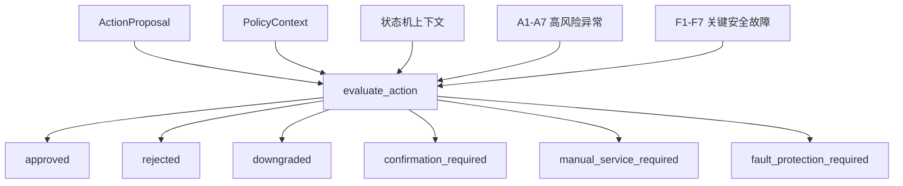

# 安全合规授权接口

---

文档版本：v1.2
创建日期：2026-03-08
作者：Codex-架构师

文档变更记录：
- v1.2 | 2026-04-08 | Codex-架构师 | 同步运行时基线文件重命名，更新与多执行范式基线的引用路径。
- v1.1 | 2026-04-06 | Codex-架构师 | 按家庭共居智能体革新路线对齐本文，明确审批接口是跨执行范式的系统级硬边界；连续流式、事件驱动和人工接力均不得绕过该接口。
- v1.0 | 2026-03-08 | Codex-架构师 | 文档创建。

---

## 1. 文档目的

本文档定义一代机器人在“动作审批”层面的统一逻辑接口。

这份文档关注的不是某个 HTTP 路由或 RPC 协议，而是系统内部必须稳定下来的审批契约：

1. 什么动作需要先过门
2. 门控时要读哪些上下文
3. 门控后会返回哪些标准结果
4. 哪些结果会触发确认、降级、人工转接或审计

在当前 `Phase 2` 口径下，还要再补一条：

5. 不论动作来自离散决策、事件触发、连续策略还是人工接力，都不能绕过这道系统级硬边界

## 2. 当前设计前提

本版本基于以下已确认条件：

- 项目主节点是 2026 年 12 月 31 日达到量产预备状态
- 项目从 2026 年 1 月 1 日起算，前两个月已做需求收集与 Demo 概念验证
- 当前已有真实自研机器人样机，可用于验证部分行为闭环
- 目标系统是机器人本体；穿戴、智能家居、手机 App、后台云服务属于伴生系统
- 已授权行为需要做到完全自主
- 高风险异常默认先联动家属，并保留社区 / 物业 / 120 路线接口
- 一期需要后台人工服务，前线角色为客服运营坐席，其他角色由其转接
- 一期紧急用药仍限定在“提醒 / 递送 / 确认 / 告知”边界
- 机器人直接入网拨号只做架构预留
- 第三方平台必须严格审核；机器人负责准确传递信息和保留审计链，交付由平台负责
- 储物仓必须具备防夹手、电动开关和开关状态记录能力
- `KBT-7` 已正式冻结为“分层状态机管理顶层模式，行为树管理叶子执行”
- `KBT-7` 已显式冻结 7 类高风险异常与 7 类关键安全故障

## 3. 接口目标

接口必须同时解决 4 个问题：

1. `安全`
说明：动作会不会伤人、撞物、引发误药、误报或其他风险。

2. `合规`
说明：动作是否满足隐私、医疗、通信、第三方服务接入和本地策略限制。

3. `授权`
说明：发起者、受影响人和执行主体之间是否满足授权与角色边界。

4. `可审计`
说明：每次批准、拒绝、降级和转接都能回放原因链。

## 4. 设计原则

1. 所有高风险动作统一走一套审批接口，不能各模块自定义旁路。
2. 接口返回的是标准化决策结果，不直接替代执行模块。
3. 接口必须能表达“批准”“拒绝”“降级”“待确认”“转人工”。
4. 接口必须支持多角色冲突仲裁。
5. 接口必须显式表达第三方责任边界。
6. 接口必须在离线时保留本地最小可用能力。
7. 接口是跨执行范式的硬边界，不因 `Orient + Decide` 融合、局部端到端化或事件驱动而失效。

### 4.1 接口与状态机的关系

当前一代架构里，这个审批接口位于 `decision_orchestration` 与执行模块之间，并直接消费 `KBT-7` 已冻结的状态机输出。

约束关系先固定如下：

1. `A1` 到 `A7` 高风险异常是审批上下文的一部分，会影响审批强度、确认对象和是否转人工。
2. `F1` 到 `F7` 关键安全故障不是普通审批条件，而是硬中断条件；一旦命中，接口需要直接返回“进入故障保护”结果。
3. 业务状态机决定“当前准备做什么”，审批接口决定“当前允不允许做、要不要降级、要不要确认、要不要转人工”。

### 4.2 接口与多执行范式的关系

当前 `Phase 2` 下，这个接口的正式定位是：

1. 在离散决策范式中，它是 `decision_orchestration -> 执行模块` 之间的强制前置门。
2. 在事件驱动范式中，它是“事件触发后的动作编排”进入执行前的统一审查门。
3. 在连续流式范式中，局部端到端策略可以缩短认知和决策路径，但不能绕过该接口定义的安全、合规和授权边界。
4. 在长周期演化范式中，它不直接决定长期学习内容，但会决定长期策略是否可转化为即时可执行动作。

### 4.2 审批流图



说明：

- 这张图强调的是审批接口在运行时所处的位置，不是网络接口拓扑图。

## 5. 适用范围

以下动作必须进入该接口：

1. 机器人移动到人
2. 开关储物仓
3. 送药、提醒服药、记录服药确认
4. 家属提醒、社区 / 物业通知、120 路线预留动作
5. 问诊转接、人工服务接入、第三方平台调用
6. 外部下单，如买药、配送、外卖
7. 高风险主动打断与主动靠近
8. 敏感数据外发

补充说明：

- 这些动作无论来自业务状态机、事件引擎、连续策略适配层还是人工坐席，都必须进入同一审批接口。

以下动作通常不需要单独走高风险审批，但仍需受本地策略限制：

1. 低风险对话回复
2. 普通屏幕展示
3. 非敏感本地状态刷新
4. 被动唤醒与基础 ASR / TTS

## 6. 角色与责任边界

### 6.1 角色

接口至少要支持以下主体：

- `elder`：老人本人
- `child`：子女
- `caregiver`：保姆或照护者
- `visitor`：访客
- `robot_system`：机器人自主触发
- `ops_seat`：后台客服运营坐席
- `third_party_platform`：互联网医院、药店、配送、内容平台等

### 6.2 责任边界

建议固定以下边界：

1. 机器人系统负责：
- 感知与判断链的本地安全
- 准确传递用户信息与上下文
- 授权校验
- 审计与记录
- 本地动作执行安全

2. 第三方平台负责：
- 平台侧服务交付
- 平台业务过程中的专业责任
- 药品、外卖、内容等服务的履约

3. 客服运营坐席负责：
- 首线人工接入
- 人工确认和转接
- 必要时把请求转给医生平台或其他外部主体

## 7. 动作分类

建议把待审批动作统一表达为 `ActionProposal`，并至少分成以下类别：

| 动作类型 | 示例 |
| --- | --- |
| `navigate_to_person` | 主动靠近老人、到人提醒 |
| `open_compartment` | 打开储物仓递药 |
| `deliver_medication` | 送药到人 |
| `confirm_medication_taken` | 记录用户已服药 |
| `notify_family` | 通知家属 |
| `connect_manual_service` | 接入客服运营坐席 |
| `transfer_manual_service` | 将人工服务转给第三方 |
| `invoke_third_party_service` | 互联网医院、药店、配送平台 |
| `share_sensitive_data` | 外发健康、身份或病历信息 |
| `interrupt_user` | 主动打断用户 |
| `request_measurement` | 发起问诊式补采或测量请求 |

## 8. 风险等级

建议统一使用 4 级风险：

| 等级 | 含义 | 例子 |
| --- | --- | --- |
| `low` | 低风险，可在授权下自动执行 | 低侵入提醒 |
| `medium` | 中风险，可自动执行但要记录原因 | 到人提醒、普通数据共享 |
| `high` | 高风险，需要更严格审批或确认 | 打开储物仓、送药、家属上报 |
| `critical` | 极高风险，默认走人工确认或升级 | 高风险异常联动、敏感外部服务、越权指令 |

## 9. 核心对象

### 9.1 `ActionProposal`

定义：

- 一次待审批动作的标准化表达

建议字段：

| 字段 | 类型 | 说明 |
| --- | --- | --- |
| `proposal_id` | string | 唯一 ID |
| `action_type` | enum | 动作类型 |
| `origin_paradigm` | enum | `discrete` / `continuous` / `event_driven` / `long_cycle` |
| `initiator_role` | enum | 谁发起 |
| `target_person_id` | string | 作用对象 |
| `executor` | enum | 机器人、App、云服务、第三方平台 |
| `risk_level` | enum | 风险等级 |
| `payload` | object | 动作参数 |
| `context_snapshot_ref` | string | 决策快照引用 |
| `requested_at` | string | 发起时间 |

### 9.2 `PolicyContext`

定义：

- 审批时读取的策略上下文

建议字段：

| 字段 | 类型 | 说明 |
| --- | --- | --- |
| `authorization_state` | object | 当前授权 |
| `role_bindings` | object[] | 当前角色绑定 |
| `risk_events` | object[] | 当前风险事件 |
| `state_machine_context` | object | 当前顶层状态、业务主状态与约束子状态 |
| `active_anomaly_classes` | string[] | 当前命中的 `A1` 到 `A7` 异常类 |
| `active_fault_classes` | string[] | 当前命中的 `F1` 到 `F7` 关键安全故障类 |
| `network_state` | object | 网络状态 |
| `home_mode` | enum | 白天、夜间、异常中等 |
| `medication_context` | object | 药品、仓门、禁忌和时效 |
| `service_link_context` | object[] | 外部服务准入与责任边界 |
| `manual_service_state` | object | 客服运营坐席接入状态 |

### 9.3 `ApprovalDecision`

定义：

- 审批模块返回的标准结果

建议字段：

| 字段 | 类型 | 说明 |
| --- | --- | --- |
| `decision_id` | string | 唯一 ID |
| `proposal_id` | string | 对应动作 |
| `result` | enum | `approved` / `rejected` / `downgraded` / `confirmation_required` / `manual_service_required` / `fault_protection_required` |
| `reason_codes` | string[] | 原因码 |
| `constraints` | object | 限速、限时、可共享字段等约束 |
| `state_transition_hint` | object | 建议进入的顶层或业务状态 |
| `confirmation_targets` | object[] | 需要谁确认 |
| `manual_transfer_target` | string | 需要转给谁 |
| `audit_ref` | string | 审计引用 |

### 9.4 `ConfirmationRequest`

定义：

- 当动作必须额外确认时，下发给 App、用户或人工坐席的确认请求

建议字段：

| 字段 | 类型 | 说明 |
| --- | --- | --- |
| `confirmation_id` | string | 唯一 ID |
| `decision_id` | string | 对应审批结果 |
| `required_roles` | string[] | 必须确认的角色 |
| `timeout_ms` | integer | 超时时间 |
| `fallback_policy` | object | 超时后处理策略 |

## 10. 统一审批接口

建议逻辑接口固定为：

### `evaluate_action(proposal, policy_context) -> approval_decision`

输入：

- `ActionProposal`
- `PolicyContext`

输出：

- `ApprovalDecision`

审批流程建议顺序：

1. 校验动作类型是否合法
2. 校验当前是否存在 `F1` 到 `F7` 关键安全故障
3. 校验角色与授权
4. 校验当前风险状态、`A1` 到 `A7` 异常类以及夜间 / 离线限制
5. 校验第三方平台准入状态
6. 校验是否触发冲突仲裁
7. 生成批准、拒绝、降级、待确认、转人工或进入故障保护结果
8. 写入审计记录

## 11. 决策结果语义

### 11.1 `approved`

含义：

- 动作可以直接执行，但执行模块仍需遵守 `constraints`

### 11.2 `rejected`

含义：

- 动作不能执行，并必须给出可解释原因

典型原因：

- 越权
- 夜间静默限制
- 第三方平台未准入
- 敏感数据共享超范围
- 药物禁忌或对象不匹配

### 11.3 `downgraded`

含义：

- 原动作不能完整执行，但允许改成低风险版本

示例：

- “自动买药”降级成“提醒家属确认下单”
- “主动靠近”降级成“先语音确认”

### 11.4 `confirmation_required`

含义：

- 当前动作需要额外确认后才能继续

典型场景：

- 老人与子女冲突命令
- 新的高风险外部联动
- 未在默认策略中的敏感数据外发

### 11.5 `manual_service_required`

含义：

- 动作应交给后台人工服务或转接链处理

典型场景：

- 高风险异常需要人工复核
- 第三方问诊或平台服务需要人工转接
- 系统无法确认当前责任边界

### 11.6 `fault_protection_required`

含义：

- 当前已命中关键安全故障，机器人不得继续执行当前动作，且应推动顶层状态进入 `故障保护`

典型场景：

- `F1` 到 `F7` 任一关键安全故障处于激活状态
- 当前动作会放大已有安全故障带来的风险

## 12. 特殊策略

### 12.1 穿戴数据策略

基于当前已知限制，一期不能默认依赖“任意品牌手表都能持续实时广播心率”。

因此审批侧必须支持：

1. `broadcast`
说明：设备广播模式可用时，允许使用较新鲜数据。

2. `sdk_bound`
说明：已完成合作和 SDK 接入时，允许按平台能力读取。

3. `questionnaire_driven`
说明：当实时链路不可得时，通过问诊、用户手动测量或 BLE 外设补采数据。

当数据新鲜度不足时：

- 不能把低新鲜度心率当作强自动决策依据
- 应优先触发补采、复核或人工服务

### 12.2 储物仓策略

储物仓相关动作必须额外校验：

- 仓门是否空闲
- 防夹手状态
- 是否允许电动开关
- 当前目标药品或物品是否匹配
- 是否需要交接确认

能力优先级：

1. `必须有`
- 防夹手
- 电动开关
- 开关仓状态记录

2. `应该有`
- 储物记录
- 交接确认

3. `可以有`
- 防误取
- 防错拿

### 12.3 第三方平台策略

第三方服务调用前必须校验：

- 平台是否已审核准入
- 当前动作是否在平台责任范围内
- 当前外发数据是否满足最小必要原则
- 是否存在人工转接要求

机器人侧固定责任：

- 确保传递信息准确
- 保留审计链
- 不把平台责任误记为机器人已完成

## 13. 原因码建议

建议固定一组可审计原因码，并按 5 组管理：

- `AUTH_SCOPE_MISSING`
- `ROLE_CONFLICT_CONFIRMATION_REQUIRED`
- `NIGHT_SILENT_RESTRICTION`
- `OFFLINE_EXTERNAL_CALL_BLOCKED`
- `SENSITIVE_DATA_SCOPE_EXCEEDED`
- `SERVICE_LINK_NOT_QUALIFIED`
- `MEDICATION_CONTRAINDICATION`
- `COMPARTMENT_SAFETY_LOCKED`
- `MANUAL_SERVICE_REQUIRED`
- `THIRD_PARTY_RESPONSIBILITY_ONLY`
- `ANOMALY_A1_ACTIVE` 到 `ANOMALY_A7_ACTIVE`
- `FAULT_F1_ACTIVE` 到 `FAULT_F7_ACTIVE`

说明：

- `ANOMALY_*` 原因码用于表达高风险异常上下文已生效。
- `FAULT_*` 原因码用于表达关键安全故障已生效，并通常伴随 `fault_protection_required` 返回。

## 14. 示例

### 14.1 到人提醒

```json
{
  "proposal_id": "p_001",
  "action_type": "navigate_to_person",
  "initiator_role": "robot_system",
  "target_person_id": "elder_001",
  "executor": "robot",
  "risk_level": "medium",
  "payload": {
    "purpose": "medication_reminder"
  }
}
```

可能返回：

```json
{
  "decision_id": "d_001",
  "proposal_id": "p_001",
  "result": "approved",
  "reason_codes": [],
  "constraints": {
    "speed_limit": "indoor_safe",
    "must_announce_before_approach": true
  },
  "audit_ref": "audit_001"
}
```

### 14.2 打开储物仓递药

```json
{
  "proposal_id": "p_002",
  "action_type": "open_compartment",
  "initiator_role": "robot_system",
  "target_person_id": "elder_001",
  "executor": "robot",
  "risk_level": "high",
  "payload": {
    "compartment_id": "bin_01",
    "medication_id": "med_001"
  }
}
```

可能返回：

```json
{
  "decision_id": "d_002",
  "proposal_id": "p_002",
  "result": "approved",
  "reason_codes": [],
  "constraints": {
    "anti_pinch_required": true,
    "handoff_confirmation_required": true
  },
  "audit_ref": "audit_002"
}
```

### 14.3 自动外部下单

```json
{
  "proposal_id": "p_003",
  "action_type": "invoke_third_party_service",
  "initiator_role": "robot_system",
  "target_person_id": "elder_001",
  "executor": "third_party_platform",
  "risk_level": "high",
  "payload": {
    "service_type": "drug_order"
  }
}
```

可能返回：

```json
{
  "decision_id": "d_003",
  "proposal_id": "p_003",
  "result": "confirmation_required",
  "reason_codes": [
    "THIRD_PARTY_RESPONSIBILITY_ONLY"
  ],
  "confirmation_targets": [
    {
      "role": "child"
    }
  ],
  "audit_ref": "audit_003"
}
```

### 14.4 高风险异常转人工

```json
{
  "decision_id": "d_004",
  "proposal_id": "p_004",
  "result": "manual_service_required",
  "reason_codes": [
    "MANUAL_SERVICE_REQUIRED"
  ],
  "manual_transfer_target": "ops_seat",
  "audit_ref": "audit_004"
}
```

### 14.5 关键安全故障触发故障保护

```json
{
  "decision_id": "d_005",
  "proposal_id": "p_005",
  "result": "fault_protection_required",
  "reason_codes": [
    "FAULT_F1_ACTIVE"
  ],
  "state_transition_hint": {
    "top_state": "故障保护"
  },
  "audit_ref": "audit_005"
}
```

## 15. 与其他文档的关系

该接口文档与以下文档强关联：

1. [世界状态结构](/Users/archimboldi/Documents/myproject/AI%20project/Codex%20Project/Kinbot_OODA/docs/02_p1_architecture/05_world_state_schema.md)
2. [决策状态机](/Users/archimboldi/Documents/myproject/AI%20project/Codex%20Project/Kinbot_OODA/docs/02_p1_architecture/06_decision_state_machine.md)
3. [模块分层与模块边界](/Users/archimboldi/Documents/myproject/AI%20project/Codex%20Project/Kinbot_OODA/docs/02_p1_architecture/04_module_layers_and_boundaries.md)
4. [多尺度执行范式基线](/Users/archimboldi/Documents/myproject/AI%20project/Codex%20Project/Kinbot_OODA/docs/02_p1_architecture/03_execution_paradigms_runtime_baseline.md)

## 16. 下一步建议

基于本文件，下一份文档建议直接写：

1. 健康事件管线与升级链路
2. 量产预备判定标准
3. Demo 到量产架构的能力缺口清单
