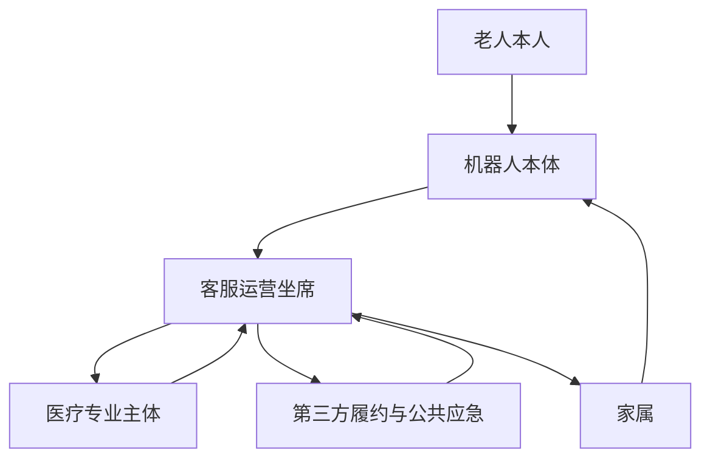
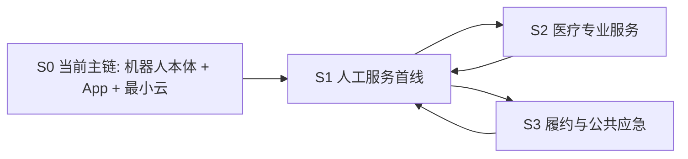

# 后台人工服务、在线问诊与第三方履约后续适配边界

---

文档版本：v1.3
创建日期：2026-03-09
作者：Codex-架构师

文档变更记录：
- v1.3 | 2026-04-09 | Codex-架构师 | 按 `V1` 真实复杂度下降口径，将本文从当前主链文档降为后续适配位边界文档，明确人工服务、在线问诊与第三方履约不进入当前 `V1` 主链验收，只保留受控接口位与责任边界。
- v1.2 | 2026-04-06 | Codex-架构师 | 按 `Phase 2` 口径补入人工服务链与共享状态平面、离散业务状态面及跨范式审批硬边界的对齐关系。
- v1.1 | 2026-03-17 | Codex-架构师 | 吸收 Step36，将人工服务能力收敛为“必须预留但覆盖可收缩”，避免默认高覆盖重运营假设。
- v1.0 | 2026-03-09 | Codex-架构师 | 文档创建。

---

## 1. 文档目的

本文档用于冻结后续适配位中的服务边界。

当前重点不是把完整服务运营体系写成当前 `V1` 的必交付链路，而是先回答 5 个问题：

1. 如果未来重新激活人工服务，首线角色和责任边界如何定义；
2. 在线问诊、药事与第三方履约如何受控接入；
3. 家属、机器人、人工主体和第三方之间分别承担什么责任；
4. 录音、录屏、授权和审计边界如何定义；
5. 这些服务适配位如何与当前 `App + 最小云` 主链、共享状态平面和统一审批接口对齐。

本文不是当前 `V1` 主链交付基线，也不代表当前 `V1` 默认承诺了坐席、在线问诊或第三方履约可用性。

## 2. 当前设计前提

本版本基于以下已确认条件：

- 当前 `V1` 主链按“机器人本体 + 家属 App + 最小云”组织；
- 后台人工服务、在线问诊、第三方履约和公共应急只保留为后续适配位；
- 家属仍是高风险异常的第一优先升级对象；
- 当前开发承接只围绕离散决策与事件驱动两条主链组织；
- 任何人工或第三方接入，一旦触及本体动作执行，仍必须回到统一审批门和本体安全链；
- 原始视觉、语音和生物特征数据默认端侧处理，不默认把原始媒体暴露给外部服务；
- 未来若激活人工服务，必须显式表达 `service_availability`，不能把人工服务当成默认永远在线；
- 用户不会操作、机器人无法理解需求或家属长时间无响应时，才允许进入后续适配位；
- `120` 路线继续优先挂在手机 App / 手机能力侧；
- 当前 `05_world_state_schema.md` 中的 `manual_service_state` 已降为后续适配位，不进入当前 `V1` 最小快照。

## 3. 为什么当前仍要保留这份边界文档

虽然人工服务、在线问诊和第三方履约不进入当前 `V1` 主链验收，但仍需保留边界文档，否则后续扩展会直接留下 4 个问题：

1. 无法明确客服、医生、护士、药事和第三方平台分别拥有哪些决策权；
2. 无法定义从当前主链升级到人工或第三方时需要共享哪些上下文；
3. 无法把录音、录屏、授权和审计规则写进受控接口；
4. 无法保证后续扩展不反向改写机器人本体的第一责任闭环。

因此，本文只冻结“后续适配位如何受控接入”，不把它写成当前 `V1` 成立前提。

## 4. 后续适配位的协作主体

后续适配位建议收敛为 6 个一级协作主体：

说明：

- `机器人本体` 先承担本地理解、确认、补采和风险提议，不直接把问题默认上抛给人工。
- `家属` 仍是第一优先升级对象。
- `客服运营坐席` 只在后续适配位中充当首线人工主体。
- `医疗专业主体` 和 `第三方履约 / 公共应急` 只能通过受控链路接入，不能直接替代机器人本体的本地判断与审批。

## 5. 受控接力分层

后续适配位建议固定为 4 层接力，而不是让所有主体直接并联到机器人：

分层定义：

| 层级 | 主体 | 主要职责 | 不应承担 |
| --- | --- | --- | --- |
| `S0` | 机器人本体 + 家属 App + 最小云 | 本地确认、家属联动、远程确认、结构化同步、审计 | 把医疗结论或履约结果假定为当前主链默认可用 |
| `S1` | 客服运营坐席 | 接入、澄清、分诊、转接、审计补录 | 医疗诊断、处方判断、绕过本体动作审批 |
| `S2` | 医生 / 护士 / 健康管理支持 | 在线问诊、专业建议、补采指导 | 直接远控机器人危险动作 |
| `S3` | 药店 / 配送 / 社区 / 公共应急 | 履约、应急协同 | 替代机器人本地确认与权限判断 |

## 6. 角色边界

### 6.1 机器人本体

机器人本体在后续适配链中允许承担：

1. 生成结构化事件与会话上下文；
2. 发起语音澄清、本地问诊和补采；
3. 发起家属通知或远程确认；
4. 在满足升级条件时请求人工服务接入；
5. 在授权与安全门控通过后执行低风险本体动作；
6. 对所有升级链路写审计记录。

不承担：

1. 医疗专业诊断；
2. 处方与药事专业责任；
3. 第三方履约责任；
4. 未经授权的持续远程监听或视频直播。

### 6.2 家属

家属允许承担：

1. 接收异常事件与服务通知；
2. 发起远程联络或协助确认；
3. 在授权范围内查看用户摘要；
4. 对高风险链路提供远程确认；
5. 决定是否触发后续适配位。

不应承担：

1. 绕过安全门控直接驱动高风险本体动作；
2. 未经授权查看高敏感内容；
3. 直接代替医疗专业主体给出医学结论。

### 6.3 客服运营坐席

客服运营坐席作为后续适配位中的首线人工服务，建议固定 6 类职责：

1. 服务接入；
2. 用户意图澄清；
3. 家属协同；
4. 问诊与履约分诊；
5. 异常升级转接；
6. 审计补录与服务质检。

不应承担：

1. 独立作出医疗专业判断；
2. 修改超出授权范围的高风险策略；
3. 长期替代家庭照护职责。

### 6.4 医疗专业主体

当前建议把医疗专业主体拆成 3 类子角色：

| 子角色 | 允许承担 | 不应承担 |
| --- | --- | --- |
| 医生 | 在线问诊、医学建议、是否需要进一步就医的专业判断 | 直接远控机器人危险动作 |
| 护士 / 健康管理支持 | 补采指导、流程解释、随访支持、测量指导 | 诊断和处方决策 |
| 药事相关主体 | 用药说明、药事履约上下文补充 | 替代医生做诊断 |

说明：

- 这 3 类子角色在一代不一定由我们自建，更多通过平台接入。
- 当前冻结的是角色边界，不是当前 `V1` 默认交付的组织能力。

### 6.5 第三方履约与公共应急

第三方平台与公共应急允许承担：

1. 互联网医院问诊与开方；
2. 药店与配送履约；
3. 已审核内容服务或其他生态服务；
4. 社区、物业、`120` 等升级协同。

不应承担：

1. 替代机器人进行本地确认；
2. 绕过产品授权直接调用高风险动作；
3. 把自身责任回推给机器人本体。

责任切分建议冻结为：

1. 机器人负责结构化信息准确传递、授权校验、动作审计；
2. 平台负责专业判断、履约过程和结果责任；
3. 最小云 / 后续服务网关负责会话编排、白名单准入和审计留痕。

## 7. 激活条件与时效假设

后续适配位建议优先冻结 5 类触发场景：

1. 用户不会操作；
2. 机器人无法理解需求；
3. 本地问诊不足以形成可执行结论；
4. 家属长时间未响应且需要继续升级；
5. 必须调用外部履约或公共应急。

接入前必须同时满足以下门槛：

1. `service_availability = true`；
2. 当前授权允许共享必要上下文；
3. `consent_state`、`risk_level` 和 `audit_session_id` 已生成；
4. 本地安全链与统一审批门已先完成本体动作边界判断。

时效说明：

1. `客服运营坐席 3 分钟响应` 仍保留为后续运营目标，不写入当前 `V1` 主链验收条件。
2. `医疗专业主体 10 分钟内给出接单结果` 仍保留为后续服务假设，不等于当前 `V1` 默认可用能力。

## 8. 媒体、隐私与授权边界

一代建议冻结以下 7 条边界：

1. 默认先共享结构化上下文，不默认上传原始音视频；
2. 人工接入优先采用会话式语音，不默认开启视频；
3. 视频直播不作为一代主线能力，只做后续预留；
4. 任何人工或第三方接入都必须带着 `consent_state`、`risk_level` 和 `audit_session_id`；
5. 高风险异常下允许按事件授权临时开放更高媒体权限，但必须审计；
6. 医疗、履约和应急主体只获取完成当前服务所需的最小上下文；
7. 会话结束后，默认只保留结构化审计结果，不保留不必要原始媒体。

## 9. 会话上下文与审计要求

后续适配位建议把人工服务会话固定为 7 类上下文字段：

1. `session_reason`
2. `risk_level`
3. `current_user_identity`
4. `consent_state`
5. `recent_robot_actions`
6. `health_summary_or_task_summary`
7. `allowed_media_scope`

对应的审计记录至少应覆盖：

1. 谁发起了会话；
2. 谁接入了会话；
3. 共享了哪些上下文；
4. 是否开启录音；
5. 是否发生外部转接；
6. 第三方是否接单；
7. 会话关闭原因。

## 10. 与现有架构文档的接口关系

本文与现有基线的关系建议冻结为：

1. 与 [11_app_cloud_ops_minimal_loop.md](11_app_cloud_ops_minimal_loop.md) 的关系：后者定义当前 `V1` 的 `App + 最小云` 主链，本文定义后续适配位中的人工服务、在线问诊和第三方履约边界。
2. 与 [10_health_event_pipeline_and_escalation.md](10_health_event_pipeline_and_escalation.md) 的关系：后者定义当前健康事件主线，本文只定义升级到后续适配位后的协同链。
3. 与 [07_safety_compliance_authorization_api.md](07_safety_compliance_authorization_api.md) 的关系：人工与第三方接入不能绕过统一审批门。
4. 与 [05_world_state_schema.md](05_world_state_schema.md) 的关系：`manual_service_state`、`service_link` 等字段当前只保留为后续适配位，不进入当前 `V1` 最小快照。
5. 与 [13_medication_storage_and_indoor_delivery_requirements.md](13_medication_storage_and_indoor_delivery_requirements.md) 的关系：当递送链中断、身份不确定或需要外部协同时，才进入本文定义的后续适配位。

## 11. 当前结论与后续问题

当前收口结论如下：

1. 人工服务、在线问诊和第三方履约不进入当前 `V1` 主链验收；
2. 当前只保留受控接口位、角色边界、媒体边界和审计规则；
3. 家属仍是第一优先升级对象，人工与第三方只在后续适配位中承接；
4. 后续扩展不得反向改写机器人本体的第一责任闭环。

本轮保留的后续问题：

1. 客服运营坐席的覆盖方式与投入产出比何时需要从“后续适配位”升级为正式交付能力；
2. 医疗专业主体的“首轮专业回复”时效何时需要正式冻结；
3. 哪些试点信号足以触发第三方履约或公共应急接口从预留升级为正式接入；
4. 若后续服务适配位长期不激活，哪些字段可以继续只留接口位而不进入主状态快照。
