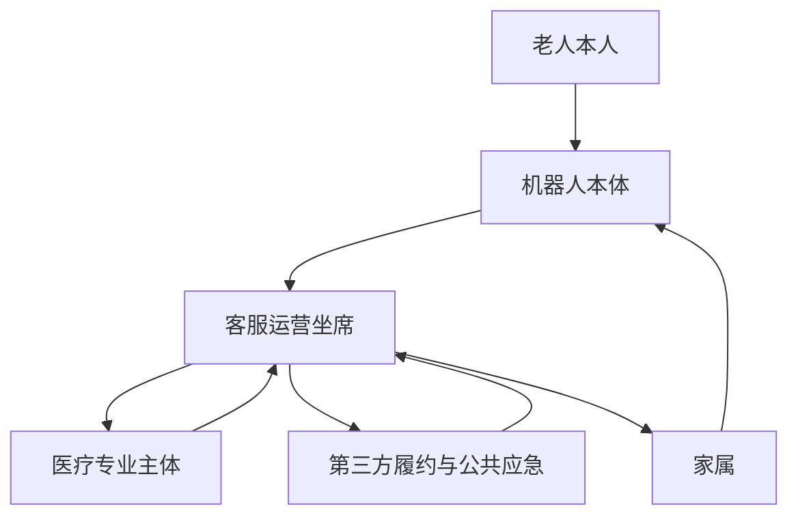
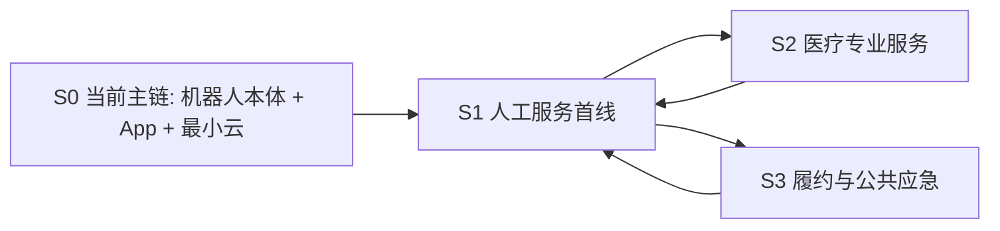

# 后台人工服务、在线问诊与第三方履约边界

---

文档版本：v1.4
创建日期：2026-03-09
作者：Codex-架构师

文档变更记录：
- v1.4 | 2026-04-21 | Codex-架构师 | 吸收董事长汇报反馈：将后台服务 / 人工坐席从纯后续适配位升级为 `KBT-57` 立项联动候选，并补充非隐私结构化数据回流与持续进化边界；当前仍不改写已冻结 `V1` 主闭环。
- v1.3 | 2026-04-09 | Codex-架构师 | 按 `V1` 真实复杂度下降口径，将本文从当前主链文档降为后续适配位边界文档，明确人工服务、在线问诊与第三方履约不进入当前 `V1` 主链验收，只保留受控接口位与责任边界。
- v1.2 | 2026-04-06 | Codex-架构师 | 按 `Phase 2` 口径补入人工服务链与共享状态平面、离散业务状态面及跨范式审批硬边界的对齐关系。
- v1.1 | 2026-03-17 | Codex-架构师 | 吸收 Step36，将人工服务能力收敛为“必须预留但覆盖可收缩”，避免默认高覆盖重运营假设。
- v1.0 | 2026-03-09 | Codex-架构师 | 文档创建。

---

## 1. 文档目的

本文档用于冻结后台服务、人工坐席、在线问诊和第三方履约的受控边界，并承接 `KBT-57` 中“后台服务 / 人工坐席是否需要与机器人本体产品联动立项”的战略假设。

当前重点不是把完整服务运营体系直接写成已冻结 `V1` 必交付链路，而是先回答 6 个问题：

1. 如果后台服务 / 人工坐席与机器人本体联动立项，首线角色和责任边界如何定义；
2. 在线问诊、药事与第三方履约如何受控接入；
3. 家属、机器人、人工主体和第三方之间分别承担什么责任；
4. 录音、录屏、授权和审计边界如何定义；
5. 非隐私结构化数据如何在授权、脱敏、用途受限和留存受限前提下回流，用于持续进化；
6. 这些服务能力如何与当前 `App + 最小云` 主链、共享状态平面和统一审批接口对齐。

本文当前承接一个活跃 `provisional`：董事长反馈已显著提高后台服务 / 人工坐席优先级，但在 `KBT-57` 完成组织形态、`OPEX`、服务可用性、数据治理和商业口径拆解前，本文不代表当前 `V1` 已经默认承诺坐席、在线问诊或第三方履约可用性。

## 2. 当前设计前提

本版本基于以下已确认条件：

- 当前 `V1` 主链按“机器人本体 + 家属 App + 最小云”组织；
- 后台服务 / 人工坐席从纯后续适配位升级为 `KBT-57` 立项联动候选，但尚未进入当前 `V1` 主链验收；
- 在线问诊、第三方履约和公共应急仍按受控接入或外部可选接入处理；
- 家属仍是高风险异常的第一优先升级对象；
- 当前开发承接只围绕离散决策与事件驱动两条主链组织；
- 任何人工或第三方接入，一旦触及本体动作执行，仍必须回到统一审批门和本体安全链；
- 原始视觉、语音和生物特征数据默认端侧处理，不默认把原始媒体暴露给外部服务；
- 若激活人工服务，必须显式表达 `service_availability`、服务时段、响应 `SLA`、坐席责任与升级责任，不能把人工服务当成默认永远在线；
- 用户不会操作、机器人无法理解需求或家属长时间无响应时，才允许进入后续适配位；
- `120` 路线继续优先挂在手机 App / 手机能力侧；
- 当前 `05_world_state_schema.md` 中的 `manual_service_state` 是否进入 `V1` 最小快照，由 `KBT-57` 决定；未冻结前仍按适配位 / 候选位处理。

## 2.1 `KBT-57` 的处理规则

`KBT-57` 当前只把董事长反馈登记为战略假设，不直接改写本文中的责任边界。

必须遵守 5 条规则：

1. 区分“战略输入已确认”和“交付基线已确认”：前者已经成立，后者尚未成立。
2. 不把后台服务 / 坐席简单堆成新主链；必须说明哪些场景必须由本体解决，哪些场景才允许人工接力。
3. 不把非隐私数据回流写成无边界回流；必须明确数据分级、授权、脱敏、用途限制、留存周期和审计。
4. 不把坐席高频介入当作产品价值成立的证据；若远程在场感和健康闭环长期依赖人工兜底，应在 `Phase 5` 中标记为战略风险。
5. 不把 `10000` 元 BOM、`29999` 元定价、首批 `10000` 台或租售并行写入本文作为服务架构事实；这些内容只作为成本与商业方案的上游约束，在 `KBT-57` 中拆解后再回写。

## 3. 为什么当前仍要保留这份边界文档

虽然人工服务、在线问诊和第三方履约尚未进入当前已确认 `V1` 主链验收，但仍需保留边界文档，否则后续扩展会直接留下 4 个问题：

1. 无法明确客服、医生、护士、药事和第三方平台分别拥有哪些决策权；
2. 无法定义从当前主链升级到人工或第三方时需要共享哪些上下文；
3. 无法把录音、录屏、授权和审计规则写进受控接口；
4. 无法保证后续扩展不反向改写机器人本体的第一责任闭环。

因此，本文只冻结“服务能力如何受控接入、如何在 `KBT-57` 中评估联动立项”，不把它写成当前 `V1` 成立前提。

## 4. 后续适配位的协作主体

后续适配位建议收敛为 6 个一级协作主体：

```mermaid
graph TD
    U[老人本人]
    F[家属]
    R[机器人本体]
    O[客服运营坐席]
    M[医疗专业主体]
    T[第三方履约与公共应急]

    U --> R
    F --> R
    R --> O
    O --> M
    O --> T
    O --> F
    M --> O
    T --> O
```

说明：

- `机器人本体` 先承担本地理解、确认、补采和风险提议，不直接把问题默认上抛给人工。
- `家属` 仍是第一优先升级对象。
- `客服运营坐席` 是 `KBT-57` 中优先评估的首线人工主体；未完成商业和组织拆解前，仍不得绕过当前本体第一责任闭环。
- `医疗专业主体` 和 `第三方履约 / 公共应急` 只能通过受控链路接入，不能直接替代机器人本体的本地判断与审批。

## 5. 受控接力分层

后续适配位建议固定为 4 层接力，而不是让所有主体直接并联到机器人：

```mermaid
flowchart LR
    S0[S0 当前主链: 机器人本体 + App + 最小云]
    S1[S1 人工服务首线]
    S2[S2 医疗专业服务]
    S3[S3 履约与公共应急]

    S0 --> S1
    S1 --> S2
    S1 --> S3
    S2 --> S1
    S3 --> S1
```

分层定义：

| 层级 | 主体 | 主要职责 | 不应承担 |
| --- | --- | --- | --- |
| `S0` | 机器人本体 + 家属 App + 最小云 | 本地确认、家属联动、远程确认、结构化同步、审计 | 把医疗结论或履约结果假定为当前主链默认可用 |
| `S1` | 客服运营坐席 | 接入、澄清、分诊、转接、审计补录 | 医疗诊断、处方判断、绕过本体动作审批 |
| `S2` | 医生 / 护士 / 健康管理支持 | 在线问诊、专业建议、补采指导 | 直接远控机器人危险动作 |
| `S3` | 药店 / 配送 / 社区 / 公共应急 | 履约、应急协同 | 替代机器人本地确认与权限判断 |

## 6. 角色边界

### 6.1 机器人本体

机器人本体在后续适配链中允许承担：

1. 生成结构化事件与会话上下文；
2. 发起语音澄清、本地问诊和补采；
3. 发起家属通知或远程确认；
4. 在满足升级条件时请求人工服务接入；
5. 在授权与安全门控通过后执行低风险本体动作；
6. 对所有升级链路写审计记录。

不承担：

1. 医疗专业诊断；
2. 处方与药事专业责任；
3. 第三方履约责任；
4. 未经授权的持续远程监听或视频直播。

### 6.2 家属

家属允许承担：

1. 接收异常事件与服务通知；
2. 发起远程联络或协助确认；
3. 在授权范围内查看用户摘要；
4. 对高风险链路提供远程确认；
5. 决定是否触发后续适配位。

不应承担：

1. 绕过安全门控直接驱动高风险本体动作；
2. 未经授权查看高敏感内容；
3. 直接代替医疗专业主体给出医学结论。

### 6.3 客服运营坐席

客服运营坐席作为后续适配位中的首线人工服务，建议固定 6 类职责：

1. 服务接入；
2. 用户意图澄清；
3. 家属协同；
4. 问诊与履约分诊；
5. 异常升级转接；
6. 审计补录与服务质检。

不应承担：

1. 独立作出医疗专业判断；
2. 修改超出授权范围的高风险策略；
3. 长期替代家庭照护职责。

### 6.4 医疗专业主体

当前建议把医疗专业主体拆成 3 类子角色：

| 子角色 | 允许承担 | 不应承担 |
| --- | --- | --- |
| 医生 | 在线问诊、医学建议、是否需要进一步就医的专业判断 | 直接远控机器人危险动作 |
| 护士 / 健康管理支持 | 补采指导、流程解释、随访支持、测量指导 | 诊断和处方决策 |
| 药事相关主体 | 用药说明、药事履约上下文补充 | 替代医生做诊断 |

说明：

- 这 3 类子角色在一代不一定由我们自建，更多通过平台接入。
- 当前冻结的是角色边界，不是当前 `V1` 默认交付的组织能力。

### 6.5 第三方履约与公共应急

第三方平台与公共应急允许承担：

1. 互联网医院问诊与开方；
2. 药店与配送履约；
3. 已审核内容服务或其他生态服务；
4. 社区、物业、`120` 等升级协同。

不应承担：

1. 替代机器人进行本地确认；
2. 绕过产品授权直接调用高风险动作；
3. 把自身责任回推给机器人本体。

责任切分建议冻结为：

1. 机器人负责结构化信息准确传递、授权校验、动作审计；
2. 平台负责专业判断、履约过程和结果责任；
3. 最小云 / 后续服务网关负责会话编排、白名单准入和审计留痕。

## 7. 激活条件与时效假设

后续适配位建议优先冻结 5 类触发场景：

1. 用户不会操作；
2. 机器人无法理解需求；
3. 本地问诊不足以形成可执行结论；
4. 家属长时间未响应且需要继续升级；
5. 必须调用外部履约或公共应急。

接入前必须同时满足以下门槛：

1. `service_availability = true`；
2. 当前授权允许共享必要上下文；
3. `consent_state`、`risk_level` 和 `audit_session_id` 已生成；
4. 本地安全链与统一审批门已先完成本体动作边界判断。

时效说明：

1. `客服运营坐席 3 分钟响应` 升级为 `KBT-57` 中必须拆解的候选 `SLA`，但未完成服务覆盖模式、排班和成本测算前，不写入当前 `V1` 主链验收条件。
2. `医疗专业主体 10 分钟内给出接单结果` 仍保留为后续服务假设，不等于当前 `V1` 默认可用能力。

## 8. 媒体、隐私与授权边界

一代建议冻结以下 7 条边界：

1. 默认先共享结构化上下文，不默认上传原始音视频；
2. 人工接入优先采用会话式语音，不默认开启视频；
3. 视频直播不作为一代主线能力，只做后续预留；
4. 任何人工或第三方接入都必须带着 `consent_state`、`risk_level` 和 `audit_session_id`；
5. 高风险异常下允许按事件授权临时开放更高媒体权限，但必须审计；
6. 医疗、履约和应急主体只获取完成当前服务所需的最小上下文；
7. 会话结束后，默认只保留结构化审计结果，不保留不必要原始媒体。

非隐私结构化数据回流当前按 5 类候选数据处理：

1. 服务可用性与响应状态；
2. 用户明确授权后的问题分类、处理结果和满意度；
3. 设备健康、故障码、版本、网络状态和升级结果；
4. 去标识化后的任务成功 / 失败原因、交互轮次和降级路径；
5. 人工坐席质检后的结构化标签。

这些数据只能用于产品质量、模型改进、服务流程优化和阶段门证据，不得反向扩大为原始音视频、原始对话或生物识别数据的默认回流。

## 9. 会话上下文与审计要求

后续适配位建议把人工服务会话固定为 7 类上下文字段：

1. `session_reason`
2. `risk_level`
3. `current_user_identity`
4. `consent_state`
5. `recent_robot_actions`
6. `health_summary_or_task_summary`
7. `allowed_media_scope`

对应的审计记录至少应覆盖：

1. 谁发起了会话；
2. 谁接入了会话；
3. 共享了哪些上下文；
4. 是否开启录音；
5. 是否发生外部转接；
6. 第三方是否接单；
7. 会话关闭原因。

## 10. 与现有架构文档的接口关系

本文与现有基线的关系建议冻结为：

1. 与 [11_app_cloud_ops_minimal_loop.md](11_app_cloud_ops_minimal_loop.md) 的关系：后者定义当前 `V1` 的 `App + 最小云` 主链，本文定义人工服务、在线问诊和第三方履约的受控边界，并通过 `KBT-57` 承接后台服务 / 坐席是否联动立项。
2. 与 [10_health_event_pipeline_and_escalation.md](10_health_event_pipeline_and_escalation.md) 的关系：后者定义当前健康事件主线，本文只定义升级到后续适配位后的协同链。
3. 与 [07_safety_compliance_authorization_api.md](07_safety_compliance_authorization_api.md) 的关系：人工与第三方接入不能绕过统一审批门。
4. 与 [05_world_state_schema.md](05_world_state_schema.md) 的关系：`manual_service_state`、`service_link` 等字段在 `KBT-57` 未冻结前仍只保留为适配位 / 候选位；若坐席联动立项成立，再决定是否进入 `V1` 最小快照。
5. 与 [13_medication_storage_and_indoor_delivery_requirements.md](13_medication_storage_and_indoor_delivery_requirements.md) 的关系：当递送链中断、身份不确定或需要外部协同时，才进入本文定义的后续适配位。

## 11. 当前结论与后续问题

当前收口结论如下：

1. 后台服务 / 人工坐席已从纯后续适配位升级为 `KBT-57` 立项联动候选；
2. 在 `KBT-57` 未完成前，人工服务、在线问诊和第三方履约仍不进入当前已确认 `V1` 主链验收；
3. 当前先冻结受控接口位、角色边界、媒体边界、非隐私结构化数据回流边界和审计规则；
4. 家属仍是第一优先升级对象，人工与第三方不得反向改写机器人本体的第一责任闭环；
5. 若后台服务 / 坐席最终与本体联动立项，必须同步回写 `S6` 工作包、`World State` 最小快照、Phase 5 验证计划和 `G5` 门控证据包。

本轮保留的后续问题：

1. 客服运营坐席的覆盖方式、投入产出比、服务时段和 `SLA` 能否支撑其从候选位升级为正式交付能力；
2. 医疗专业主体的“首轮专业回复”时效何时需要正式冻结；
3. 哪些试点信号足以触发第三方履约或公共应急接口从预留升级为正式接入；
4. 若后续服务适配位长期不激活，哪些字段可以继续只留接口位而不进入主状态快照。
