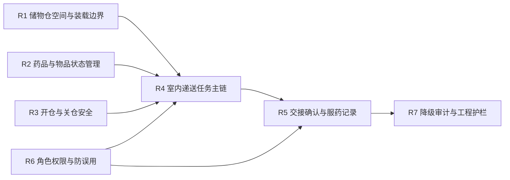
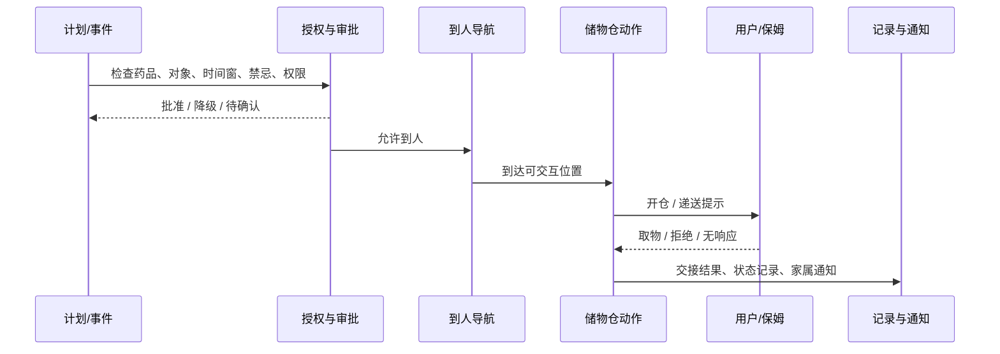

# 储药与室内递送要求

## 1. 文档目的

本文档用于冻结一代机器人在“储药 / 储物仓 / 室内递送”上的产品与系统要求。

这里关注的不是机构图纸或量产零件清单，而是首版必须先固定的 5 件事：

1. 储物仓能力在一代到底承担什么角色
2. 哪些能力是必须有、应该有、可以有
3. 机器人如何完成“提醒 -> 到人 -> 开仓 -> 交接 -> 确认 -> 记录 -> 通知”
4. 哪些角色允许发起、确认或协助递送
5. 哪些安全、授权、空间和降级边界会直接限制递送动作

## 2. 当前设计前提

本版本基于以下已确认条件：

- 一代健康能力已包含用药管理、买药和紧急用药管理
- 一期紧急用药动作边界冻结为“提醒 / 递送 / 确认 / 告知”，不扩展更强自主医疗处置
- 机器人本体必须具备储物仓与室内递送能力
- 储物仓应跟随机器人整体外形，按紧凑、通用、灵活空间设计，不为单一药品做大体积专用仓
- 递送主要依靠机器人自主运动完成，不引入复杂机械臂操作
- 储物仓能力优先级已冻结为：
  - 必须有：防夹手、电动开关、开关仓状态记录
  - 应该有：储物记录、交接确认
  - 可以有：防误取、防错拿
- 卫生间默认保守处理，第一代机器人不越出入户门
- 低电量、定位异常、关键传感器失效时允许积极恢复；当机器人无法识别任何障碍物时必须停止运动
- `KBT-13` 已冻结人工服务、在线问诊与第三方履约的角色边界，递送链不能绕过该边界

## 3. 为什么 `KBT-10` 需要在当前里程碑冻结

如果只把储物仓当作一个硬件附件，而不把储药与室内递送主链冻结下来，会直接留下 6 个缺口：

1. 结构设计无法判断仓体尺寸、开合方向和可达性要求
2. 授权系统无法区分“普通储物”和“敏感药品递送”
3. 导航、状态机和审批接口无法稳定定义“到人后如何交接”
4. 家属、保姆、坐席与机器人之间的责任边界会漂移
5. 故障保护无法判断仓门卡滞、误取、错拿时该如何降级
6. 高端产品感会被现有样机那种“大而重的抽屉机构”继续拖累

因此，`KBT-10` 是“核心状态与接口冻结”里的正式项，而不是留到纯硬件阶段再说。

## 4. 一级需求结构

一代建议把储药与室内递送要求收敛为 7 个一级能力包：

说明：

- `R1` 到 `R3` 更偏本体与机构边界。
- `R4` 到 `R6` 更偏任务闭环与权限边界。
- `R7` 用来把安全、审计、降级和整机工程约束收回到同一条主链。

## 5. 端到端主链

一代建议把递送主链冻结为 7 步：

主链说明：

1. 计划与事件可以来自用药计划、异常事件、家属请求或保姆协同任务。
2. 开仓与递送必须在 `safety_compliance_authorization` 批准后才能进入执行。
3. 一代“递送”不是机械臂送到手，而是机器人移动到可交互位置后，通过开仓、提示和确认完成交付。
4. 交付后必须形成结构化记录，并按需要通知家属或转人工服务。

## 6. 七个能力包的冻结要求

### 6.1 `R1` 储物仓空间与装载边界

建议冻结为：

1. 储物仓是整机一体化空间，不做“大药箱外挂件”。
2. 空间应兼容药品、血压计等小型健康物品及日常小件，不只面向药物。
3. 结构目标是紧凑、轻量、优雅，不允许为了单一递送链牺牲整机外观比例和家庭存在感。
4. 储物仓机构必须纳入整机减重和外观重构主线。

### 6.2 `R2` 药品与物品状态管理

建议冻结为：

1. 递送链必须能识别“放了什么、给谁、何时放入、何时取出、当前是否仍在仓内”。
2. 药品与普通物件都要有基础条目化记录。
3. 一代优先支持“单次任务级状态正确”，不强求复杂仓内自动盘点。
4. 药品相关条目应与 `MedicationAsset`、用药计划和处方引用打通。

### 6.3 `R3` 开仓与关仓安全

建议冻结为：

1. 防夹手是硬要求，仓门动作失败要优先保人手安全。
2. 必须具备电动开关能力与开关状态记录。
3. 开仓前必须知道当前是否允许电动开关、目标物是否匹配、是否需要交接确认。
4. 仓门卡滞时要立即停止相关动作，并禁止继续运动递送。

### 6.4 `R4` 室内递送任务主链

建议冻结为：

1. 一代递送范围仅限家庭室内，不越出入户门。
2. 卫生间默认不进入；如用户在卫生间出现明确高风险异常，优先走门外确认和升级链。
3. 递送流程默认由“提醒 -> 到人 -> 开仓 -> 取物 / 服药确认 -> 记录”组成。
4. 一代不要求机器人完成复杂抓取、开盖、喂药等物理操作。

### 6.5 `R5` 交接确认与服药记录

建议冻结为：

1. 应优先具备交接确认能力。
2. 一代确认方式可由语音、视觉和交互状态联合完成，不要求百分百自动闭环。
3. 当用户无响应、拒绝或身份不确定时，递送链应转入通知 / 人工 / 家属确认，而不是假定已交付成功。
4. 服药记录应支持“已取出 / 已服用 / 拒绝 / 未确认 / 中断”这类结构化状态。

### 6.6 `R6` 角色权限与防误用

建议冻结为：

1. 老人本人和子女可以配置与确认关键用药任务。
2. 保姆模式下允许在授权范围内协助拿药、叫人、记录、汇报和远程确认。
3. 访客默认不允许触发敏感递送动作。
4. 客服运营坐席和第三方平台不能绕过机器人本地审批直接开仓。
5. `防误取 / 防错拿` 当前仍是可选能力，但递送链必须至少能识别“当前对象不匹配”并禁止继续推进。

### 6.7 `R7` 降级审计与工程护栏

建议冻结为：

1. 低电量下优先完成当前高风险确认；非紧急递送允许挂起并回充。
2. 定位异常时优先静默自恢复，必要时中止递送并转为通知 / 人工接力。
3. 关键传感器失效或无法识别障碍物时，递送链必须停止运动。
4. 任何一次开仓、取物确认、失败中断和人工转接都必须有审计记录。
5. 结构、重量、功耗和外观必须同步接受“高端产品感检查”，避免递送能力把整机做成笨重药箱。

说明：

- 这里的“记录与回溯”指的是：当仓门卡滞、开仓失败或中途异常停止时，系统至少要知道“何时发生、在执行什么动作、是否有人在取物、后来如何恢复或终止”，方便售后、质量和后续安全复盘。
- 它不是行业约定俗成的专有名词，因此后文不再使用“仓门卡滞审计”这种生硬表述。

## 7. 必须有 / 应该有 / 可以有

当前建议把能力优先级收敛为下表：

| 层级    | 能力                                         |
| ----- | ------------------------------------------ |
| `必须有` | 防夹手、电动开关、开关仓状态记录、室内到人递送主链、角色授权校验、失败时停止相关动作 |
| `应该有` | 储物记录、交接确认、服药结果记录、家属通知、保姆模式协同、仓门异常事件记录与回溯          |
| `可以有` | 防误取、防错拿、仓内更细颗粒度识别、更复杂的多物品管理                |

## 8. 角色与权限边界

建议把递送链涉及的 6 类主体固定如下：

| 主体       | 允许做什么                  | 不允许做什么                     |
| -------- | ---------------------- | -------------------------- |
| 老人本人     | 接受递送、确认服药、授权特定动作       | 绕过安全链要求危险动作                |
| 子女       | 配置计划、远程确认、查看结果摘要       | 未授权时查看高敏感内容                |
| 保姆       | 在授权范围内协助提醒、拿药、叫人、记录、汇报 | 擅自修改关键策略或越权开仓              |
| 访客       | 低风险交互                  | 触发敏感递送动作                   |
| 机器人系统    | 在授权和审批通过后执行主链          | 超出“提醒 / 递送 / 确认 / 告知”的医疗处置 |
| 人工 / 第三方 | 参与转接、履约、补充服务           | 绕过本地审批直接驱动仓门和高风险动作         |

## 9. 与现有架构文档的接口关系

`KBT-10` 与现有基线的关系建议冻结为：

1. 与 [docs/02_p1_architecture/10_health_event_pipeline_and_escalation.md](10_health_event_pipeline_and_escalation.md) 的关系：本文把其中“计划检查 / 递送执行 / 服药确认 / 结果归档”展开成独立产品链。
2. 与 [docs/02_p1_architecture/07_safety_compliance_authorization_api.md](07_safety_compliance_authorization_api.md) 的关系：开仓、递送、共享结果和通知都必须过统一审批门。
3. 与 [docs/02_p1_architecture/06_decision_state_machine.md](06_decision_state_machine.md) 的关系：本文主要冻结 `主动接近`、`用药服务` 和 `保姆协同` 里的执行边界。
4. 与 [docs/02_p1_architecture/05_world_state_schema.md](05_world_state_schema.md) 的关系：`MedicationAsset`、`Task`、`compartment_policy` 等状态字段要承接本文的装载、交接与审计边界。
5. 与 [docs/02_p1_architecture/12_human_service_and_telemedicine_boundaries.md](12_human_service_and_telemedicine_boundaries.md) 的关系：当递送链中断、身份不确定或需要外部协同时，必须按既定人工服务与第三方责任边界转接。

## 10. 本轮收口结论与后续问题

`Step27` 已对 `KBT-10` 形成当前轮次收口，结论如下：

1. 接受把储药与室内递送要求收敛为 `R1` 到 `R7` 七个能力包。
2. 接受“递送 = 到达可交互位置 + 开仓提示 + 用户自取 / 确认”的一代边界，不引入复杂机械臂交付。
3. 接受当前的 `必须有 / 应该有 / 可以有` 分层，但把“仓门卡滞审计”改写为更直观的“仓门异常事件记录与回溯”。
4. 接受“结构、重量、功耗、外观”与递送能力进入同一条工程护栏。

这里的“仓门异常事件记录与回溯”具体是指：

- 当仓门无法正常开启、关闭、到位或发生阻塞时，系统要留下结构化事件记录。
- 记录至少包括：时间、动作阶段、失败类型、当时是否有人在近场、系统采取了什么恢复动作、是否最终恢复成功。
- 这一能力被放在 `应该有`，是因为它不是开仓动作的最小安全前提，但它会显著影响售后定位、问题复现、质量闭环和后续量产改进。

当前仍保留的后续问题：

1. “可以有”层中的防误取、防错拿，是否在后续结构方案冻结时上调优先级。
2. 开仓与取物识别在量产版本中采用何种最小传感组合，避免对本体 `BOM` 和 `C5` 产生隐性上行压力。
