# 家庭共居智能体架构范式

---

文档版本：v1.0
创建日期：2026-04-06
作者：Codex-架构师

文档变更记录：
- v1.0 | 2026-04-06 | Codex-架构师 | 新增文档，作为 `Phase 2` 的顶层锚点文档，定义 Kinbot 从“多尺度动态 OODA 总中心”向“家庭共居智能体 + 多执行范式”重组时的总图、边界与当前未冻结事项。

---

## 1. 文档定位

本文档是 Kinbot 当前分支在 `Phase 2` 的顶层锚点文档。

它的职责是：

1. 把已经在原则层确认的“家庭共居智能体”母命题翻译成可落到主线架构文档的总图；
2. 说明总架构为什么不再以 `OODA` 作为唯一中心；
3. 给 `01_overall_architecture.md` 和 `03_multi_scale_dynamic_ooda_architecture_baseline.md` 提供上游框架；
4. 明确哪些内容已经进入当前分支重组，哪些仍保持 `provisional`。

本文档当前不直接冻结数据模型主表，也不直接完成 `V1` 收缩版裁剪。

## 2. 当前问题重写

Kinbot 当前要回答的问题，已经不再是：

**“如何继续补强旧的多尺度动态 `OODA` 主线？”**

而是：

**“在具身智能浪潮下，Kinbot 是否应从任务型家庭服务机器人，上抬为面向中国分布式家庭的家庭共居智能体？”**

这会带来两个直接后果：

1. 总架构中心必须从“单次任务闭环”上抬到“家庭生活连续性”；
2. `OODA` 仍然保留，但退到运行时层，成为多执行范式中的离散决策范式。

## 3. 架构母命题

> Kinbot 不是以单次任务成功率为中心的家庭服务机器人，而是面向中国分布式家庭，通过具身在场维持家庭生活连续性、承接照护责任、保护成员主体性，并在长期共居中形成可信关系的家庭共居智能体。

这个母命题要求总架构同时回答 `3` 个问题：

1. 为什么做：为了让家庭生活持续处于可居、可亲、可安、可恢复的状态；
2. 怎么做：不是只靠单一 `OODA` 主环，而是靠多执行范式协同；
3. 做什么：仍然要落回 Kinbot 当前已冻结的 `9` 个一级能力域与双视角架构。

## 4. 三轴总图

当前推荐用“三轴框架”来表达新总图：

1. **照护关系轴（WHY）**：系统为什么采取某个动作，判断标准不只是任务完成率，而是生活连续性、主体性保护、责任关系与低打扰共居。
2. **执行范式轴（HOW）**：系统如何运行，包括离散决策、连续流式、事件驱动和长周期演化。
3. **能力域轴（WHAT）**：系统由哪些稳定能力域承接，当前继续保留 `9` 个一级模块。

```mermaid
flowchart LR
    subgraph WHY["照护关系轴（WHY）"]
        W1["生活连续性"]
        W2["主体性与尊严"]
        W3["多角色责任网络"]
        W4["低打扰共居"]
    end

    subgraph HOW["执行范式轴（HOW）"]
        H1["离散决策范式
        OODA / R1-R4"]
        H2["连续流式范式
        VLA / 局部端到端"]
        H3["事件驱动范式
        跨尺度照护事件"]
        H4["长周期演化范式
        关系与习惯形成"]
    end

    subgraph WHAT["能力域轴（WHAT）"]
        M1["platform_runtime"]
        M2["mobility_navigation"]
        M3["human_health_sensing"]
        M4["multimodal_interaction"]
        M5["world_state_memory"]
        M6["decision_orchestration"]
        M7["safety_compliance_authorization"]
        M8["companion_service_system"]
        M9["observability_data_governance"]
    end

    WHY --> HOW --> WHAT
```

当前收敛点是：

1. `WHY` 轴已经由原则层明确；
2. `WHAT` 轴暂不改顶层模块数量；
3. `HOW` 轴是当前 `Phase 2` 最主要的重组对象。

## 5. 多执行范式

### 5.1 离散决策范式

这是旧 `OODA` 主线在新架构中的保留位置。

它当前继续保留：

1. `R1` 反射环
2. `R2` 执行环
3. `R3` 任务环
4. `R4` 关系与服务环
5. 调度输入与切换规则
6. `Orient` 升级后的认知评价、尺度选择与时域压缩职责

但它已经不再是总架构本身。

### 5.2 连续流式范式

连续流式范式用于承接更前瞻的具身智能路线，包括：

1. 局部感知到动作的端到端链路；
2. `Orient + Decide` 的融合表达；
3. 在局部高频执行场景下，用连续策略替代显式阶段切换。

当前原则约束是：

1. 允许局部端到端化；
2. 不允许绕开安全、授权、恢复与审计边界。

### 5.3 事件驱动范式

事件驱动范式用于承接跨尺度照护事件，包括：

1. 风险事件
2. 健康事件
3. 关系影响事件
4. 长期里程碑事件

它强调的不是“持续主环”，而是“事件触发 -> 状态更新 -> 响应编排 -> 回写长期状态”。

### 5.4 长周期演化范式

长周期演化范式用于承接：

1. 关系阶段迁移
2. 习惯学习
3. 提醒策略优化
4. 家庭节奏适应
5. 长期记忆治理

它不追求短时响应最优，而追求长期可信、克制、可解释和可恢复。

## 6. `OODA` 在新总图中的位置

当前分支对 `OODA` 的正式定位是：

1. `OODA` 不再是总架构名称；
2. `OODA` 保留为运行时层的重要分析框架；
3. `OODA` 当前主要对应离散决策范式；
4. `Observe / Orient / Decide / Act` 不再要求固定映射为稳定模块边界；
5. `Orient + Decide` 融合与局部端到端化是被允许的前瞻方向。

因此，Kinbot 的表达应从：

**“家庭机器人 = OODA 机器人”**

改为：

**“家庭机器人 = 家庭共居智能体；`OODA` 是其运行时中的重要离散决策范式。”**

## 7. 与现有主线的关系

当前重组并不推翻现有主线，而是做 `4` 件事：

1. 保留 `PDCP` 双视角基线；
2. 保留当前 `9` 个一级模块；
3. 保留旧 `OODA` 文档中的 `R1-R4`、调度输入与切换规则；
4. 把这些内容重新组织到新的上位总图中。

这意味着当前的重组方式不是“另起炉灶”，而是：

**原则层上抬，总图重写，运行时降阶，数据模型延后决策。**

## 8. 当前未冻结事项

以下内容当前仍保持 `provisional`：

1. `World State 9 -> 7` 是否进入主线；
2. `CareRelationship / CareEvent` 是否替代现有实体；
3. `Home / Relation / Self` 三类长期模型的最终主次；
4. 新总框架的最终命名是否长期固定；
5. `V1` 收缩版的具体模块裁剪与验证指标。

这些事项将在后续阶段门中单独审查。

## 9. 对下游文档的要求

从本文件开始，后续所有系统级文档至少要回答：

1. 它在三轴总图中的位置是什么；
2. 它主要服务哪类执行范式；
3. 它是否仍与 `PDCP` 双视角基线一致；
4. 它是否错误地把 `provisional` 内容写成已冻结事实；
5. 它是否仍符合“聪明、温暖、精致”的高端产品感约束。
