# 家庭共居智能体架构范式

---

文档版本：v1.4
创建日期：2026-04-06
作者：Codex-架构师

文档变更记录：
- v1.4 | 2026-04-09 | Codex-架构师 | 继续压实本文的背景 / 决策来路角色，吸收从单一 `OODA` 走向多执行范式的精简解释，并避免与 `03_execution_paradigms_runtime_baseline.md` 重复展开运行时细节。
- v1.3 | 2026-04-08 | Codex-架构师 | 收紧本文角色为背景/决策来路锚点，移除详细 `provisional` 展开，只保留指向活跃载体和研究文档的短指针。
- v1.2 | 2026-04-07 | Claude-架构师 | 按 `Phase 4.5` 增量补强为 §10.1 `FleetView` 占位补入候选字段示意子表（`fleet_state / shared_memory / cross_household_pattern`），仅作占位，不引入字段冻结。
- v1.1 | 2026-04-07 | Codex-架构师 | 按 `Phase 4.5` 补入附录 A，给机群、伴生协同与生成范式留占位，不改动已冻结主结构。
- v1.0 | 2026-04-06 | Codex-架构师 | 新增文档，作为 `Phase 2` 的顶层锚点文档，定义 Kinbot 从“多尺度动态 OODA 总中心”向“家庭共居智能体 + 多执行范式”重组时的总图、边界与当前未冻结事项。

---

## 1. 文档定位

本文档是 Kinbot 当前分支在 `Phase 2` 的背景 / 决策来路锚点文档。

它的职责是：

1. 记录家庭共居智能体母命题的来路和 Phase 2 历史决策背景；
2. 保留 `01_overall_architecture.md` 与 `03_execution_paradigms_runtime_baseline.md` 的上游语义来源；
3. 只用短指针标记仍在活跃载体或研究文档中的未决项。

本文档不再承担并列主入口职责，也不再展开新的候选池。

## 2. 当前问题重写

Kinbot 当前要回答的问题，已经不再是：

**“如何继续补强旧的多尺度动态 `OODA` 主线？”**

而是：

**“在具身智能浪潮下，Kinbot 是否应从任务型家庭服务机器人，上抬为面向中国分布式家庭的家庭共居智能体？”**

这会带来两个直接后果：

1. 总架构中心必须从“单次任务闭环”上抬到“家庭生活连续性”；
2. `OODA` 仍然保留，但退到运行时层，成为多执行范式中的离散决策范式。

## 3. 架构母命题

> Kinbot 不是以单次任务成功率为中心的家庭服务机器人，而是面向中国分布式家庭，通过具身在场维持家庭生活连续性、承接照护责任、保护成员主体性，并在长期共居中形成可信关系的家庭共居智能体。

这个母命题要求总架构同时回答 `3` 个问题：

1. 为什么做：为了让家庭生活持续处于可居、可亲、可安、可恢复的状态；
2. 怎么做：不是只靠单一 `OODA` 主环，而是靠多执行范式协同；
3. 做什么：仍然要落回 Kinbot 当前已冻结的 `9` 个一级能力域与双视角架构。

## 4. 三轴总图

当前推荐用“三轴框架”来表达新总图：

1. **照护关系轴（WHY）**：系统为什么采取某个动作，判断标准不只是任务完成率，而是生活连续性、主体性保护、责任关系与低打扰共居。
2. **执行范式轴（HOW）**：系统如何运行，包括离散决策、连续流式、事件驱动和长周期演化。
3. **能力域轴（WHAT）**：系统由哪些稳定能力域承接，当前继续保留 `9` 个一级模块。

```mermaid
flowchart LR
    subgraph WHY["照护关系轴（WHY）"]
        W1["生活连续性"]
        W2["主体性与尊严"]
        W3["多角色责任网络"]
        W4["低打扰共居"]
    end

    subgraph HOW["执行范式轴（HOW）"]
        H1["离散决策范式
        OODA / R1-R4"]
        H2["连续流式范式
        VLA / 局部端到端"]
        H3["事件驱动范式
        跨尺度照护事件"]
        H4["长周期演化范式
        关系与习惯形成"]
    end

    subgraph WHAT["能力域轴（WHAT）"]
        M1["platform_runtime"]
        M2["mobility_navigation"]
        M3["human_health_sensing"]
        M4["multimodal_interaction"]
        M5["world_state_memory"]
        M6["decision_orchestration"]
        M7["safety_compliance_authorization"]
        M8["companion_service_system"]
        M9["observability_data_governance"]
    end

    WHY --> HOW --> WHAT
```

当前收敛点是：

1. `WHY` 轴已经由原则层明确；
2. `WHAT` 轴暂不改顶层模块数量；
3. `HOW` 轴是当前 `Phase 2` 最主要的重组对象。

## 5. 从单一 `OODA` 走向多执行范式的原因

当前这轮重组，核心不是否定 `OODA`，而是承认单一、串行、统一节拍的表达已经不足以覆盖 Kinbot 的目标场景。主要原因有 `4` 点：

1. 时间尺度不再单一，避障、到人确认、服务升级和长期关系形成处在不同时间尺度上；
2. 空间尺度不再单一，机体周边、房间内、全屋和长期家庭空间记忆不是同一种问题；
3. 真实运行不是严格串行，感知、认知、执行监督和异常回退会长期并发；
4. 具身智能趋势要求运行时容纳局部端到端、事件唤起和长期策略修正，而不是只围绕单回合反应来组织。

因此，当前主线把 `OODA` 从总架构中心下调到运行时层，并把运行时改写为多执行范式表达。

## 6. `OODA` 在新总图中的位置

当前分支对 `OODA` 的正式定位是：

1. `OODA` 不再是总架构名称；
2. `OODA` 保留为运行时层的重要语法来源；
3. `OODA` 当前主要对应离散决策范式；
4. `Observe / Orient / Decide / Act` 不再要求固定映射为稳定模块边界；
5. `Orient + Decide` 融合与局部端到端化是被允许的前瞻方向。

因此，Kinbot 的表达应从：

**“家庭机器人 = OODA 机器人”**

改为：

**“家庭机器人 = 家庭共居智能体；`OODA` 是其运行时中的重要离散决策范式。”**

## 7. 与现有主线文档的分工

当前重组并不推翻现有主线，而是做 `4` 件事：

1. 保留 `PDCP` 双视角基线；
2. 保留当前 `9` 个一级模块；
3. 把旧 `OODA` 文档中的 `R1-R4`、调度输入与切换规则改写到运行时层；
4. 把这些内容重新组织到新的上位总图中。

这意味着当前的重组方式不是“另起炉灶”，而是：

**原则层上抬，总图重写，运行时降阶，数据模型延后决策。**

当前文档分工如下：

1. `01_overall_architecture.md`：负责系统总图、双视角基线与系统边界；
2. `03_execution_paradigms_runtime_baseline.md`：负责运行时的 `4` 类执行范式、`R1-R4`、协调输入与切换规则；
3. 本文：负责背景、决策来路和上位语义解释，不再重复展开运行时细节。

## 8. 当前未决项短指针

以下内容不在本文继续展开，统一转由活跃评审包与研究文档承接：

1. `World State 9 -> 7` 与 `CareRelationship / CareEvent` 相关判断，见 `docs/08_reviews/25_phase3_to_phase45_closure_and_strategic_input_package.md`
2. `Home / Relation / Self` 与 `FleetView`、`shared_memory`、`cross_household_pattern` 相关占位，见同一活跃评审总包与 `docs/09_research/`
3. `V1` 收缩版的具体模块裁剪与验证指标，见 `docs/03_p2_feasibility/01_overall_solution_and_module_design_baseline.md`

## 9. 对下游文档的要求

从本文件开始，后续所有系统级文档至少要回答：

1. 它在三轴总图中的位置是什么；
2. 它主要服务哪类执行范式；
3. 它是否仍与 `PDCP` 双视角基线一致；
4. 它是否错误地把 `provisional` 内容写成已冻结事实；
5. 它是否仍符合“聪明、温暖、精致”的高端产品感约束。

## 10. 附录 A：历史战略接口短指针

本附录不再展开候选子表，仅保留短指针：`FleetView / shared_memory / cross_household_pattern / 生成范式候选` 统一转由 `docs/08_reviews/25_phase3_to_phase45_closure_and_strategic_input_package.md` 与 `docs/09_research/` 承接；本文只保留历史来路，不再继续膨胀为候选池。
