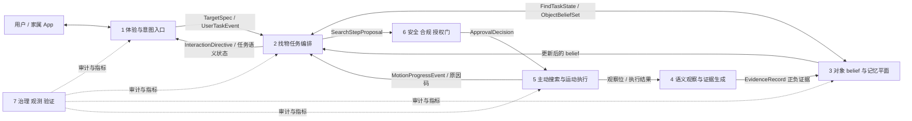
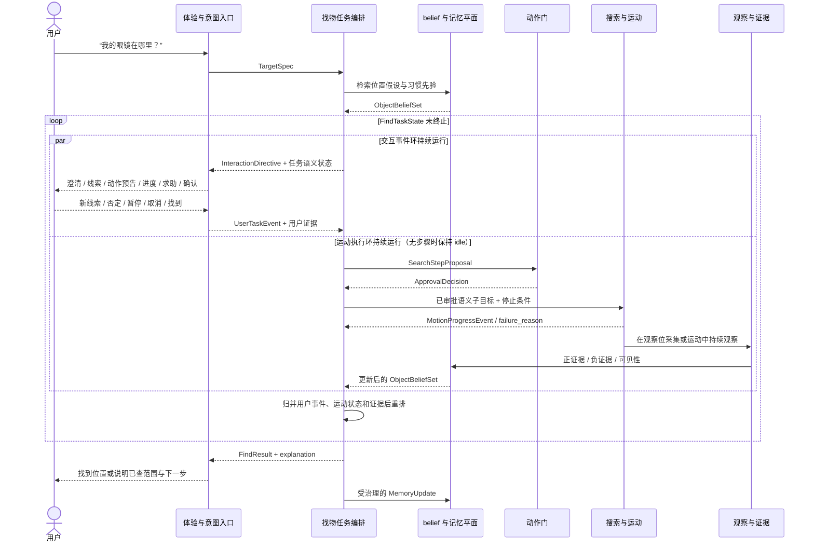
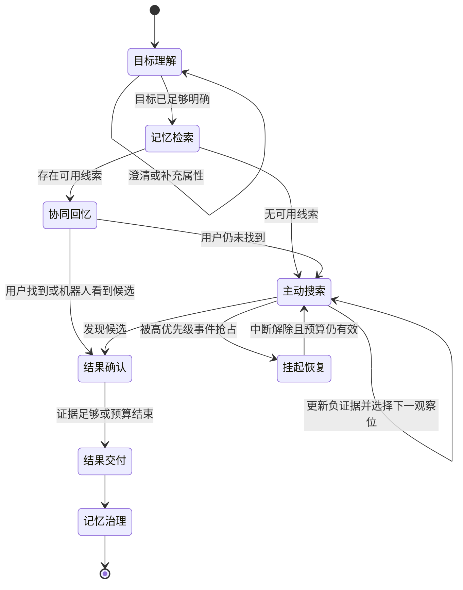

# 找物 Agentic System Architecture

---

文档版本：v0.6
创建日期：2026-07-13
作者：Codex-架构师

文档变更记录：
- v0.6 | 2026-07-25 | Codex-架构师 | 对齐已经选定的当前 L1 架构名称，将找物映射从“方案三”改为当前责任实体；设计语义不变。
- v0.5 | 2026-07-25 | Codex-架构师 | 对齐方案三的实际操作反馈：Find TaskWorker 的 SkillRequest 给出允许修正范围，G3 返回许可后的实际操作；TaskWorker 只根据 SkillOutcome、ExecutionDeviation、SharedState 和 Evidence 更新搜索位置与进度。
- v0.4 | 2026-07-25 | Codex-架构师 | 修正信息空间旁路：Find TaskWorker 的内部结果只提交 O3 或父 Agent；面向用户、App 或外部服务的消息、查询和责任交接必须由 RobotSkill 形成 ActionProposal，经 G3 许可后执行。
- v0.3 | 2026-07-25 | Codex-架构师 | 按 16 号文档新版方案三回写：由“环境与物品”基础业务 Agent 创建找物 TaskWorker，统一调用交互、记忆访问、识别和导航 RobotSkill；TaskWorker 是临时 AgentCell，不新增常驻 L1 实体。
- v0.2 | 2026-07-13 | Codex-架构师 | 按用户评审意见，将找物明确为交互与运动持续耦合的复杂任务，补充双环运行不变量、交互 / 编排 / 运动团队责任边界、跨团队事件契约、并行核心流程与中途改向示例。
- v0.1 | 2026-07-13 | Codex-架构师 | 基于用户给出的四段找物流程、当前 P1/PDCP 主线、现有 VLN 原型差距和长期对象记忆研究输入，形成方案无关的 Agentic 找物功能架构评审稿。

---

## 1. 文档定位与结论

本文是 `KBT-58` 的功能级架构评审稿，承接“用户提出找物请求 -> 记忆帮助回忆 -> 共同寻找 -> 即时搜索 -> 结果反馈”的完整闭环。

本文不新增固定 L1 实体，不改变 `7` 实体 `World State`、`S1-S7` 工作包和纯视觉主线，也不冻结模型、数据库、检索引擎或导航算法选型。原 `9` 个一级模块只作为实现迁移参考，正式责任边界以 16 号文档的 L1 候选为准。

推荐架构可以用一句话概括为：

> “环境与物品”基础业务 Agent 为一次找物请求创建有界的 Find TaskWorker。该 TaskWorker 以带来源、置信度和新鲜度的对象位置 belief 为核心，调用交互、记忆访问、识别和导航 RobotSkill，按“记忆线索 -> 协同回忆 -> 主动重观察 -> 全屋搜索”逐级增加自主性；从触发到结束，“交互事件环 + 运动执行环”始终围绕同一 `FindTaskState` 并行推进。每一步都执行 `Plan -> Approve -> Execute -> Observe -> Verify -> Commit`：SkillRequest 给出允许修正范围，G3 返回许可后的实际操作，内部结果进入 O3 或父 Agent，对外信息操作经过 G3，物理动作继续经过 G3 与 F1；TaskWorker 只依据实际结果和证据更新搜索状态。

当前建议冻结的架构判断有 `8` 项：

1. 找物首先是“恢复物品与用户之间的可用联系”，不等于一上来启动全屋导航。
2. 找物是边交互、边运动、边观察、边修正目标与计划的耦合任务；任何一次用户新线索、否定、暂停或确认，都可能改变正在执行的运动步骤。
3. 记忆返回必须是带强度等级的证据，不得把“上次看见”表达为“现在一定在那里”。
4. 找物目标使用多假设位置 belief，而不是单一 `current_place_id` 真值。
5. 用户既是任务发起者，也是可被询问、可提供线索、可确认结果的协同感知者。
6. Find TaskWorker 是具有有界任务契约的临时 AgentCell，不是新的常驻 L1 Agent；任务结束后向 O3 提交已验证状态并由 AP3 回收。
7. 高层只输出“去哪里看、看什么、为什么”，底盘动作继续由局部规划与安全执行链承接。
8. `V1` 只承诺已知家庭空间、常见目标物、无机械臂的“发现与引导”闭环，不承诺翻找、抓取、开柜门或移动遮挡物。

## 2. 已知输入与约束

### 2.1 功能输入

用户给出的目标流程包含：

1. 语音触发，支持“我的眼镜在哪里”这类模糊、带指代和归属关系的表达。
2. 优先检索日常巡逻生成的场景记忆与习惯记忆，先帮助用户回忆。
3. 用户仍找不到或没有有效缓存时，机器人进入即时搜索；搜索期间持续接收用户线索、播报运动与观察进展，并允许随时改向、暂停、取消或确认找到。
4. 无论找到与否，都应反馈结果。

### 2.2 当前主线约束

| 约束 | 对找物架构的含义 |
| --- | --- |
| 家庭室内、轮式无臂 | 能观察、移动、表达、引导；不能翻找、抓取或递交目标物 |
| 纯视觉产品主线 | 找物识别、主动观察与导航不得依赖产品级深度相机或激光雷达 fallback |
| 原始敏感数据端侧处理 | 巡逻缓存、目标证据和对象位置记忆默认留在端侧 |
| 断网不影响运动安全 | 找物核心闭环必须端侧可运行；云只可增强表达，不可成为安全依赖 |
| `12GB RAM + 32GB Flash` | 不允许默认常驻超大模型、无限视频缓存或全量历史上下文 |
| 安全 > 合规 > 用户指令 > 完成率 > 效率 > 能耗 | 搜索范围、速度、观察点和继续/停止条件必须受统一动作门约束 |
| MVP“应该有” | 首版限定已知家庭空间与常见目标物，不把开放世界全品类写成承诺 |

### 2.3 现有能力与已知缺口

现有原型已经有找物会话和底盘执行基础，但当前差距包括：

1. 缺少“我的眼镜”中的指代、身份与归属消解。
2. 目标类型、约束、成功条件仍是隐式的。
3. 缺少房间 / 家具语义、候选区域排序、对象位置先验和不确定性。
4. 高层模型仍偏向直接输出底盘动作，没有稳定的语义子目标契约。
5. 缺少主动观察、搜索失败恢复、目标 belief 和负证据管理。
6. 长期对象记忆尚未把 freshness、位置持久性和过期重观察纳入正式链路。

## 3. 从需求到架构的设计过程

本轮按 `Need -> Goal -> Scenario -> Concept -> Logical Architecture -> Contract -> Verification` 推导，不从某个模型或框架反推系统。

### 3.1 第一步：重写真实需要

用户真正需要的不是“机器人执行一次 ObjectNav”，而是：

> 在不制造安全风险、不泄露家庭隐私、不让用户等待过久的前提下，尽快给出可信线索；必要时把线索升级成可执行搜索，并把最终事实沉淀成可纠正、会过期的家庭记忆。

因此要同时优化两个时间目标：

1. `Time to First Useful Hint`：多久给用户第一条真正有用的线索。
2. `Time to Verified Find`：多久形成“已找到且证据足够”的结果。

只优化第二项，会让机器人在长时间搜索中沉默；只优化第一项，又容易把旧记忆说成当前事实。

### 3.2 第二步：把需要转换成目标

| ID | 系统目标 | 可观察结果 |
| --- | --- | --- |
| `G1` | 正确理解目标 | 能解析类别、实例、归属、属性、时间语境和歧义 |
| `G2` | 先产生低成本价值 | 有可信记忆时先给线索，不必等待机器人走完整屋 |
| `G3` | 用证据管理不确定性 | 每个位置假设都有来源、时间、置信度和过期条件 |
| `G4` | 有界自主搜索 | 搜索有范围、时间、能耗、风险和隐私预算 |
| `G5` | 交互—运动共同闭环 | 机器人运动期间仍能澄清、播报、接收新线索、切换跟随 / 引导、暂停和确认 |
| `G6` | 可恢复、可中断 | 遇到高优先级照护事件、低电、定位失败时能挂起或降级 |
| `G7` | 形成可信记忆 | 正结果和负结果都可写回，但必须经过验证与治理 |

### 3.3 第三步：识别关键质量属性

| 质量属性 | 架构响应 |
| --- | --- |
| 可信 | 区分 `memory_hint / probable_location / confirmed_found / not_found_after_search` |
| 安全 | 高层不控制电机；每个移动 / 主动观察动作都经过动作门与 `R1` 抢占链 |
| 低时延 | 先回忆、后搜索；交互快路径与搜索慢路径并行接力 |
| 跨团队一致性 | 交互状态与运动状态共同投影到一个 `FindTaskState`，通过事件契约协同，不靠口头约定或直接互调 |
| 鲁棒 | 多位置假设、负证据、重观察、失败恢复和任务恢复点 |
| 隐私 | 原始帧短期、本地、加密；长期默认只保留结构化对象记忆 |
| 资源可控 | 搜索预算、上下文预算、缓存 TTL 和后台低频记忆整理 |
| 可解释 | 每次排序、继续、停止和结论都有证据摘要与原因码 |
| 可演进 | 先冻结契约和指标，再替换感知、检索、搜索或导航实现 |

### 3.4 第四步：生成并比较概念

| 概念 | 优点 | 主要问题 | 结论 |
| --- | --- | --- | --- |
| A. 缓存命中 + 固定脚本搜索 | 简单、可快速实现 | 无法管理模糊目标、记忆过期和长尾恢复 | 仅可作最小基线 |
| B. 单体端到端 VLN / VLA | 表面链路短 | 责任、审批、记忆、恢复和安全不可独立验证 | 不作为产品系统主架构 |
| C. 多 Agent 自由协商 | 角色灵活 | 状态一致性、时延、资源与故障面显著扩大 | V1 不采用 |
| D. 有界单任务 Agent + 交互 / 运动双环契约 | 可规划、可验证、可恢复，运动中可持续吸收用户事件 | 需要补齐 belief、共同任务状态与跨团队事件契约 | 推荐 |

推荐概念 D 的关键不是使用某种 Agent 框架，而是让任务具备：显式目标、可调用能力、共享状态、验证节点、停止条件和审计链。

### 3.5 第五步：形成五个创新概念

1. `交互—运动双环耦合`：交互环和运动环并行运行，由同一任务编排状态协调；任何一方的新事件都可触发重排或反馈。
2. `渐进自治`：先说线索，再共同回忆，再局部重观察，最后才全屋搜索。
3. `对象位置 belief ledger`：位置不是单点真值，而是一组会衰减、可被证伪的候选假设。
4. `用户即协同传感器`：用户的“我刚才在书房用过”“不是这副眼镜”“我找到了”都是正式证据。
5. `负证据一等化`：某处已搜索但未发现目标同样写入任务状态，防止机器人反复回到同一处。

## 4. 推荐的概念运行模型

### 4.1 渐进自治阶梯

| 级别 | 机器人行为 | 升级条件 |
| --- | --- | --- |
| `L0 目标澄清` | 解析“谁的、哪一个、什么特征、最后何时使用” | 目标仍不唯一或权限不足 |
| `L1 记忆线索` | 给出一到三个带时间与置信度的可能位置 | 用户表示没找到，或记忆过期 |
| `L2 协同回忆` | 询问最后使用场景，选择引导、跟随或语音并行协作 | 新线索仍不能闭环 |
| `L3 主动重观察` | 先检查最高价值且低成本的候选位置 | 候选均未命中 |
| `L4 有界全屋搜索` | 按搜索 frontier 逐步观察已知家庭空间 | 找到、预算耗尽、风险上升或用户取消 |

系统不允许从 `L0` 无条件跳到无限制 `L4`。升级必须说明“新增搜索价值为何大于运动、时间、能耗和隐私成本”。

### 4.2 证据强度阶梯

| 等级 | 证据 | 允许的用户表达 |
| --- | --- | --- |
| `E0` | 通用语义先验，如“眼镜常在桌面” | “通常可以先看看……” |
| `E1` | 家庭习惯先验 | “你平时更常放在……” |
| `E2` | 带时间的 last-seen 观测 | “我上次在今天 9:20 看到它在……” |
| `E3` | 本轮新鲜观测 | “我现在看到一件很像的物品在……” |
| `E4` | 新鲜观测 + 用户或多证据确认 | “找到了，在……” |

`E0-E2` 不能返回 `confirmed_found`；`E3` 在实例歧义高时只能返回 `probable_location`。

### 4.3 搜索 frontier

搜索 frontier 的基本单位不是“房间”，而是：

`候选 Place / 家具承载面 + 可达观察位 + 预期可见范围 + 当前证据强度`

每轮从 frontier 选择下一步时，至少综合：

1. 目标存在概率与位置持久性。
2. 到达后真正可观察到目标的概率。
3. 路径成本、观察成本与重复搜索成本。
4. 近人、夜间、卫生间等风险与打扰成本。
5. 当前电量、算力、光照和定位可信度。
6. 向用户提问是否比移动更有信息价值。

本文不冻结排序公式，只冻结这些输入和输出语义。

### 4.4 交互—运动双环运行不变量

找物不是“对话阶段结束 -> 导航阶段开始”的串行工作流。系统对外同时保持两个事件环：

1. `交互事件环`：持续监听目标修正、新位置线索、否定、协作方式、暂停、取消和结果确认，并生成澄清、动作预告、进度、求助和结果表达。
2. `运动执行环`：持续执行已批准的语义运动子目标，上报启程、在途、到达、观察、受阻、安全停止和完成状态，并产生新的可见性证据。

两个环由 `找物任务编排` 通过同一个 `FindTaskState` 汇合。它们的时间尺度不同：运动安全闭环最快且不等待语言模型；任务编排按语义步骤决策；交互环按用户事件随时插入。架构必须满足：

1. 机器人开始运动后，交互通道不得“交权后失联”；用户仍可说“等等”“不是这副”“去卧室看看”或“我找到了”。
2. 用户事件不得直接变成速度或轨迹命令；必须先更新目标、belief 或任务控制状态，再由编排层形成新的语义子目标。
3. 运动团队处理局部避障、制动和可达性，不等待交互确认；只有影响语义步骤时才向编排层上报 `blocked / unsafe / preempted`。
4. 交互团队不消费底盘内部状态机，而消费稳定的任务语义状态；运动团队不生成用户话术，而提供可解释的进度和原因码。
5. “找到”必须同时满足证据条件与用户体验闭环；运动到达某处不等于任务完成，用户说“找到了”也必须被记录为正式结果证据。

## 5. 方案无关的逻辑架构

### 5.1 七个稳定能力角色

每层控制在 `5-9` 个实体。找物功能内部采用 `7` 个稳定能力角色：

1. `体验与意图入口`
2. `找物任务编排`
3. `对象 belief 与记忆平面`
4. `语义观察与证据生成`
5. `主动搜索与运动执行`
6. `安全、合规与授权门`
7. `治理、观测与验证`

### 5.2 各角色责任与禁止边界

| 角色 | 负责 | 不负责 |
| --- | --- | --- |
| 体验与意图入口 | 指代消解、目标澄清、自然反馈、共同寻找协商 | 不直接决定搜索路线或控制底盘 |
| 找物任务编排 | 目标、计划、预算、步骤、恢复、停止和结果汇总 | 不绕过动作门，不直接写长期真值 |
| belief 与记忆平面 | 多假设位置、来源、新鲜度、负证据、任务恢复点 | 不主动执行搜索，不把旧观测升级为当前事实 |
| 语义观察与证据 | 生成候选目标、实例匹配、遮挡和可见性证据 | 不单独宣布任务完成 |
| 主动搜索与运动 | 生成可执行观察位、局部导航、主动转向和安全停止 | 不接受自由文本电机命令，不解释用户意图或宣布任务完成 |
| 安全合规授权门 | 权限、区域、速度、夜间、故障和中断审批 | 不规划业务目标 |
| 治理观测验证 | 指标、trace、缓存 TTL、隐私、版本和回放证据 | 不替代在线任务判断 |

### 5.3 面向交互团队与运动团队的开发边界

业务阶段不能作为团队切割线。交互团队不能在机器人启程后退出，运动团队也不能等交互“全部结束”才开始工作。稳定分工如下：

| 团队 / 角色 | 拥有的决策 | 对外契约 | 明确不拥有 |
| --- | --- | --- | --- |
| 交互团队 | 何时听、问什么、如何预告动作、如何播报进度、如何请求协助和确认结果 | 上行 `TargetSpec / UserTaskEvent / 用户证据`；下行消费 `InteractionDirective / FindTaskState` 语义投影 | 搜索位置排序、路线、速度、避障、到达判定 |
| 找物任务编排 | 下一步为什么做、交互和运动事件如何归并、何时重排 / 挂起 / 恢复 / 终止 | 向交互发 `InteractionDirective`；向运动发已审批的 `SearchStepProposal`；维护单一 `FindTaskState` | 具体话术、界面样式、局部轨迹和电机控制 |
| 运动团队 | 是否可达、如何安全到达 / 跟随 / 引导 / 转向观察、局部失败如何恢复 | 消费 `SearchStepProposal + ApprovalDecision`；上报 `MotionProgressEvent / failure_reason / observation_pose` | 解释用户意图、选择业务目标、宣布找到、写长期记忆 |
| 安全与授权 | 是否允许进入、接近、跟随、继续运动或扩大搜索范围 | 可批准、降级、拒绝或抢占任何语义运动步骤 | 不替代交互策略和搜索策略 |

交互团队应只依赖这些稳定任务语义：`awaiting_clarification / hint_delivered / preparing_motion / moving / observing / candidate_found / blocked / paused / finished`。运动团队应只接收这些语义动作类型：`go_to_vantage / lead_user_to_place / follow_user_for_search / orient_for_observation / hold_position / stop`。两组词汇均不暴露彼此内部实现。

典型中途改向的责任链为：用户在去书房途中说“等等，可能在卧室” -> 交互团队上报 `new_hint + pause_request` -> 编排层更新 belief 并撤销或替换当前步骤 -> 安全 / 运动链减速停止并返回 `canceled_at_safe_point` -> 编排层下发新步骤 -> 交互团队确认“好，我们改去卧室”。交互团队不直接发“左转”，运动团队也不自行判断用户的新线索是否可信。

## 6. 映射到当前 Kinbot 主线

### 6.1 映射到当前 L1 架构

| 找物能力角色 | 当前责任实体 | 说明 |
| --- | --- | --- |
| 体验与意图入口 | `multimodal_interaction` | 语音、指代、澄清、进度与结果表达 |
| 找物业务责任 | 环境与物品 Agent | 持有长期业务责任，决定是否创建、复用或终止 Find TaskWorker |
| 找物任务编排 | Find TaskWorker | 作为临时 AgentCell 持有一次找物契约，不新增固定 L1 实体 |
| belief、状态与记忆 | O3 共享上下文 | 承接 `Object / Place / Task` 的 SharedState、SharedMemory 和 Evidence |
| 交互、记忆访问与识别 | RobotSkillSystem | 提供 InteractionSkill、MemoryAccessSkill 和 RecognitionSkill |
| 主动搜索与运动 | NavigationSkill + F1 | Skill 内部完成局部闭环，F1 独立承担实时控制和硬安全 |
| 运行与资源 | AP3 | 创建、租约、检查点、超时、并发、回收和故障隔离 |
| 语义授权与风险 | G3 | 运动、隐私、角色和空间策略统一门控 |
| 高优先级抢占输入 | 健康与照护 Agent／家庭安全 Agent | 只提供经过契约化的中断，不进入普通找物主链 |

结论：找物由长期基础业务 Agent、临时 TaskWorker 和可复用 RobotSkill 共同实现，不形成新的固定 L1 实体，也不形成独立“总记忆库”。

### 6.2 映射到 `7` 实体 `World State`

| 实体 | 找物中的作用 |
| --- | --- |
| `Person` | 请求者、物品所有者、协同寻找者与确认者 |
| `CareRelationship` | 是否允许检索或透露他人物品位置 |
| `Household` | 搜索空间、隐私策略和家庭共享规则 |
| `Place` | 候选区域、家具承载面、观察位和可达性 |
| `Object` | 目标描述、实例身份、位置 belief、状态与归属 |
| `Task` | 找物目标、步骤、预算、进度、恢复点和结果 |
| `CareEvent` | 普通找物不强制生成；仅在找药、高风险危险物或健康中断时关联 |

对现有 schema 的最小演进建议：

1. `Task.task_type` 增加 `find_object`。
2. `Object.current_place_id` 保留为兼容投影，真实写入改由 `location_belief_set` 承接。
3. `Task` 增加任务内 `current_stage / search_budget / resume_point / result_state`。
4. 不新增顶层实体；详细字段由 `KBT-58` 评审后进入 `KBT-33` 接口治理。

### 6.3 映射到多执行范式与 `R1-R4`

| 执行环 | 找物职责 |
| --- | --- |
| `R1` | 急停、碰撞规避、近人限速，随时抢占搜索 |
| `R2` | 执行单个观察位、局部转向、扫描、跟随 / 引导和动作监督 |
| `R3` | 维护完整找物任务、候选排序、跨房间搜索、恢复与停止 |
| `R4` | 任务结束后的记忆晋升、衰减、纠错与隐私治理 |

当前 V1 主链仍是离散决策 + 事件驱动。连续流式只允许在 `R2` 内部受控实现，长周期演化只承接低频记忆治理，不把在线找物改成黑箱长链。

### 6.4 双视角一致性

| 运行时需要 | 本体实体域 / 空间承载 | 约束 |
| --- | --- | --- |
| 指令与反馈 | 交互表达组件、头部 / 躯干屏 | 搜索中持续给出低打扰进度 |
| 主动观察 | 头部视觉、主计算单元、头颈执行 | 视角不足时先调整观察位，不新增产品传感 fallback |
| 跨房间搜索 | 移动底盘、实时控制单元 | 高层只给语义子目标，底盘保持独立安全闭环 |
| 对象记忆 | 计算与控制核心、本地安全存储 | 结构化长期记忆优先，原始帧受 TTL 和加密约束 |
| 结果交付 | 语音、屏幕、灯光、App 可选摘要 | 不要求机械臂和物理取物 |

## 7. 运行时流程与任务状态

### 7.1 主流程

下图中的 `par` 是核心架构语义：只要找物任务还在运行，交互事件环和运动执行环就同时保持活动；任务编排在每轮汇合两侧新事件后决定继续、改向、提问、挂起或结束。

### 7.2 业务核心五阶段的团队分工

| 业务阶段 | 交互团队持续负责 | 运动团队持续负责 | 找物任务编排的汇合判断 |
| --- | --- | --- | --- |
| `1 触发与目标理解` | 建立共同注意，解析归属 / 指代，询问最少澄清问题，接受取消 | 保持安全待机；必要时仅做面向用户等社交姿态，不开始自主搜索 | 目标是否足够明确、权限是否允许、是否需要先问而不是移动 |
| `2 记忆线索与协同回忆` | 用证据等级表达 last-seen，询问最后使用场景，协商 `lead / follow / parallel_voice` | 评估候选位置可达性，可准备但未经选择与审批不启程 | 用户回答带来的信息价值是否足以改写 belief；是否升级到运动 |
| `3 边交互边运动到候选区域` | 预告启程，接收途中新线索 / 改向 / 暂停，按任务语义播报进度 | 执行引导、跟随或到观察位；持续上报在途、受阻、安全停止与到达 | 每个用户事件和运动事件是否要求取消、替换或保持当前步骤 |
| `4 边观察边搜索` | 管理等待预期，请用户配合改变遮挡或确认相似物，避免长时间沉默 | 调整观察位 / 朝向，采集可见区域，处理局部不可达和安全降级 | 正负证据是否改变 frontier；继续移动、换点、提问还是停止 |
| `5 结果确认与交付` | 让用户确认目标实例，解释已搜索范围、限制和下一步 | 保持安全停驻；必要时调整到可指示位置，但不把“到达”当成“找到” | 证据与用户确认是否满足结果门；写回什么、以何种强度写回 |

阶段 `3` 和 `4` 是找物体验的主体，不是纯运动后台。交互团队对“正在做什么、为什么等待、用户能否改变计划”负责；运动团队对“是否能安全执行、当前执行到哪里、为何失败”负责；编排层对两侧状态一致和下一步选择负责。

### 7.3 找物任务子状态机

该状态机只是 `Task.current_stage`，运行在现有业务主状态 `陪伴交互 / 执行服务` 内，不新增顶层业务状态。

业务状态不等于团队所有权。除终态外，交互事件都可进入当前状态；只要存在已批准运动步骤，运动执行子状态就可并行处于 `accepted / en_route / observing / blocked / safe_stop`。两者通过 `coordination_epoch` 绑定，旧步骤的迟到事件不得覆盖新计划。

### 7.4 共同寻找模式

`co_search_mode` 至少支持：

1. `lead`：机器人带用户去候选位置。
2. `follow`：机器人在安全距离内跟随用户，并持续观察用户经过的区域。
3. `parallel_voice`：机器人因路径、夜间或能力限制不适合跟随时，通过语音并行给线索、接收结果。

共同寻找是一种任务协作状态，不等于绕过社交移动和近人安全约束。`follow` 不可用时必须降级到 `lead` 或 `parallel_voice`，不能伪装为仍在跟随。

## 8. 核心契约

### 8.1 七个能力契约

| 契约 | 输入 | 输出 |
| --- | --- | --- |
| `ground_or_update_find_intent` | 初始 / 途中用户表达、身份、会话与任务上下文 | `TargetSpec` 或增量、`UserTaskEvent`、歧义和澄清问题 |
| `retrieve_object_beliefs` | `TargetSpec`、家庭范围、当前时间 | `ObjectBeliefSet` |
| `propose_search_step` | belief、frontier、任务预算、用户上下文 | `SearchStepProposal` |
| `evaluate_action` | 搜索步骤、风险、权限、机器人状态 | `ApprovalDecision` |
| `execute_semantic_subgoal` | 已审批语义子目标、行为提示、停止条件、`coordination_epoch` | `MotionProgressEvent` 流、观察位结果、失败原因 |
| `verify_candidate` | 目标规格、观察证据、历史证据 | 证据等级、结果状态、是否需用户确认 |
| `commit_memory_update` | 正 / 负证据、任务结果、治理上下文 | 新 belief 版本或拒绝写入原因 |

### 8.2 跨团队事件契约

| 契约面 | 方向 | 最小稳定语义 | 禁止做法 |
| --- | --- | --- | --- |
| `UserTaskEvent` | 交互 -> 编排 | `new_hint / target_correction / not_found_here / candidate_confirmed / mode_preference / pause / resume / cancel / privacy_refusal` | 把自然语言直接透传成运动命令 |
| `InteractionDirective` | 编排 -> 交互 | `clarify / memory_hint / motion_preview / progress / assistance_request / candidate_confirmation / limitation / result` + 可解释原因 | 让编排层固定具体话术、音色或 UI |
| `ApprovedSemanticSubgoal` | 编排 / 动作门 -> 运动 | 动作类型、目标 `Place / vantage`、协作模式、行为提示、预算增量、停止条件、`coordination_epoch` | 下发轮速、关节量或自由文本“自己想办法” |
| `MotionProgressEvent` | 运动 -> 编排 | `accepted / started / en_route / arrived / observing / blocked / unsafe / preempted / completed / canceled_at_safe_point` + 原因码 | 让交互团队订阅导航栈内部状态或话题 |
| `TaskSemanticProjection` | 编排 -> 交互 / 运动 | 当前任务阶段、有效步骤、暂停 / 取消状态、候选结果和一致性版本 | 两团队各自维护一份互不校验的任务真值 |

这些事件是现有 `7` 个核心数据对象的传输投影，不新增 `World State` 实体。所有可改变计划的事件都必须携带 `task_id + coordination_epoch + occurred_at + source`；消费者只接受当前 epoch，保证中途改向后旧的“已到达”或旧话术不会污染新计划。

### 8.3 七个核心数据对象

| 对象 | 最小字段 |
| --- | --- |
| `TargetSpec` | `target_type / instance_hint / attributes / owner_person_id / referents / ambiguity / success_condition / privacy_scope` |
| `ObjectBeliefSet` | `hypotheses[] / confidence / provenance / observed_at / freshness / persistence_probability / expiry / contradiction_state` |
| `SearchStepProposal` | `semantic_subgoal / observation_vantage / rationale / expected_information_gain / behavior_hints / interaction_checkpoint / budget_delta / stop_conditions / coordination_epoch` |
| `EvidenceRecord` | `evidence_type / target_match / place_id / viewpoint / timestamp / confidence / occlusion / model_version / local_artifact_ref` |
| `FindTaskState` | `task_id / stage / interaction_state / motion_execution_state / frontier / visited_vantages / negative_evidence / budget / co_search_mode / coordination_epoch / resume_point / interrupt_reason` |
| `FindResult` | `result_state / place / evidence_level / confidence / searched_scope / explanation / next_best_action` |
| `MemoryUpdate` | `candidate_belief / source / confirmation / retention / privacy_level / previous_version / update_reason` |

`ObjectBeliefSet.hypotheses[]` 的单项至少包含：

`place_id + support_surface + last_seen_pose + confidence + observed_at + persistence_probability + expiry + provenance`

### 8.4 结果语义

| 结果 | 允许条件 |
| --- | --- |
| `memory_hint` | 只有先验或旧观测，尚未在本轮验证 |
| `probable_location` | 本轮有候选证据，但实例或可见性仍不充分 |
| `confirmed_found` | 达到成功条件，通常需要 `E4` 或已定义的等价多证据组合 |
| `not_found_after_search` | 预算内候选区域已检查，并保留已搜索范围与负证据 |
| `suspended` | 被更高优先级事件、低电、定位或安全故障抢占 |
| `canceled` | 用户取消或权限撤销 |

## 9. 安全、隐私与失败治理

### 9.1 搜索预算包络

每个找物任务必须同时声明：

1. `time_budget`
2. `coverage_budget`
3. `energy_budget`
4. `risk_budget`
5. `privacy_budget`
6. `compute_context_budget`

任一硬预算耗尽，不得由任务智能体自行放宽；只能停止、降级或请求用户授权新的范围。

### 9.2 缓存与长期记忆边界

1. 巡逻原始帧进入本地加密观察缓存，必须有 TTL、用途和访问审计。
2. 长期默认保存结构化对象、位置、时间、置信度和来源，不保存无限期原始视频。
3. 为解释结果保留的缩略证据仍属于敏感数据，只能本地、受控、可删除。
4. 用户可在 App 查看、纠正和删除对象记忆；删除必须同步使相关 belief 失效。
5. 云侧只能接收经授权的结构化摘要，不能成为找物执行与安全的必要依赖。

### 9.3 典型失败与降级

| 失败 | 系统响应 |
| --- | --- |
| 目标歧义 | 先问最少量澄清问题，不盲搜 |
| last-seen 过期 | 作为 `memory_hint`，优先重观察，不宣称找到 |
| 用户线索与机器人记忆冲突 | 两者并列成假设，按新鲜度与来源排序 |
| 低照 / 遮挡 / 反光 | 改变观察位或请用户协助；不能穿透式猜测 |
| 目标在柜内、抽屉内或物体下 | 说明可见性边界，给出最后可信线索，不承诺翻找 |
| 定位或地图不可信 | 重定位、缩小到局部搜索或暂停运动 |
| 跟随能力不可用 | 降级为引导或语音协同 |
| 低电 | 缩小搜索范围、询问是否继续或挂起回充 |
| 高风险健康 / 安全事件 | 挂起找物任务，由高优先级业务抢占 |
| 目标未找到 | 反馈已搜索范围、最后可信线索、失败原因和下一步建议 |

## 10. 部署与技术选型边界

### 10.1 端侧必须承接

1. 语音后的最小目标结构化与权限上下文。
2. 对象位置 belief 检索与任务状态。
3. 原始视觉处理、候选证据和本地记忆。
4. 搜索步骤编排的核心降级版本。
5. 导航、避障、动作审批、故障保护与审计。

### 10.2 云侧只可增强

1. 更自然的澄清与结果表达。
2. 在授权后的结构化记忆管理与 App 同步。
3. 离线模型、策略和评测改进所需的受控非敏感统计。

### 10.3 选型前必须保持开放的实现位

| 抽象能力 | 可替换实现族 | 选择前必须证明 |
| --- | --- | --- |
| 目标 grounding | 规则、语言模型、混合方法 | 指代、归属、歧义与离线可用性 |
| 对象记忆索引 | 关系、图、向量、混合索引 | freshness、可删、可审计和资源上限 |
| 对象识别 | 封闭集、开放词汇、多模态方法 | 常见小物体、误认率、低照与目标 SoC 性能 |
| 搜索策略 | 规则、概率规划、学习策略 | 负证据、预算、恢复和可解释性 |
| 语义导航 | 传统分层、VLN、NFM 或混合 | 只输出语义子目标，不直接拥有底盘控制权 |
| 记忆衰减 | 时间规则、对象持久性估计、混合 | 不把研究候选直接写成在线重模型服务 |

## 11. 验证设计

### 11.1 Phase 5 候选指标

本轮只定义指标族，不冻结阈值：

| 目标 | 指标候选 |
| --- | --- |
| 目标理解 | `target_grounding_accuracy / clarification_success / ownership_resolution_error` |
| 快速价值 | `time_to_first_useful_hint / memory_retrieval_hit_rate / memory_hint_precision` |
| 记忆可信 | `object_persistence_probability / last_seen_pose_expiry / stale_memory_false_claim_rate` |
| 搜索效果 | `search_success_rate / time_to_verified_find / searched_region_coverage / repeated_search_ratio` |
| 结果可信 | `false_found_rate / probable_to_confirmed_conversion / user_confirmation_disagreement` |
| 协同体验 | `co_search_completion_rate / clarification_turns / silent_interval_duration / user_cancel_rate` |
| 交互—运动耦合 | `user_event_ack_latency / mid_motion_replan_success / motion_status_staleness / cross_team_state_inconsistency / stale_epoch_event_rejection` |
| 安全与资源 | `unsafe_motion_count / safety_preemption_success / peak_memory / energy_per_task / context_budget_exceeded` |
| 治理 | `raw_cache_ttl_violation / memory_delete_effectiveness / evidence_lineage_complete` |

### 11.2 场景矩阵

首轮至少覆盖：

1. 常见物品位置稳定 / 不稳定。
2. 有 last-seen / 只有习惯先验 / 完全无记忆。
3. 单实例 / 多个相似实例 / 归属不明确。
4. 桌面可见 / 部分遮挡 / 柜内不可见。
5. 白天 / 夜间 / 低照 / 强反光。
6. 用户共同寻找 / 用户离开 / 用户提供错误线索。
7. 家具移动 / 地图变化 / 定位不可信。
8. 网络离线 / 低电 / 高优先级健康事件抢占。
9. 机器人在途时用户提供新位置线索、纠正目标实例、要求暂停 / 取消或宣布找到。
10. 运动受阻但交互仍可继续、交互短暂不可用但运动必须安全停止的单侧故障。

### 11.3 阶段门建议

| 阶段 | 通过重点 |
| --- | --- |
| `P1` | 契约、边界、状态与结果语义通过评审 |
| `P2` | 在目标 SoC、纯视觉配置和已知家庭空间上完成选型比较 |
| `P3` | 打通记忆命中与无记忆两条 E2E 链，并验证中断恢复 |
| `P4` | 在真实家庭验证常见目标物、低照、多人共居和记忆过期 |
| `P5` | 用可追溯证据证明成功率、错误宣称、安全、隐私和资源均达标 |

## 12. 复杂度与产品感自检

现在的架构是不是太复杂了？

结论：如果把目标理解、记忆、搜索、验证都做成独立 Agent 或在线大模型服务，会过度复杂；本文的推荐结构没有新增一级模块，只增加 `1` 个任务内编排角色、`7` 个能力契约、`5` 个跨团队事件投影和 `7` 个核心数据对象，复杂度可控。事件投影只解决交互—运动边界，不形成新的持久化实体或常驻服务。

本文因补齐业务核心流程和团队交接边界而超过常规活跃文档长度；`P1` 评审后应把运动执行细节下沉 `S1`、交互策略下沉 `S3`，本文件只保留稳定边界、事件语义和总流程，避免继续膨胀。

刻意不进入 V1 的内容：

1. 多 Agent 自由协商网络。
2. 在线 world model 作为搜索裁决器。
3. 常驻超大对象持久性模型。
4. 无限家庭原始视频记忆。
5. 自动创造新搜索技能。
6. 机械臂翻找、抓取和递交。
7. 开放世界任意物品成功承诺。

对“聪明、温暖、精致”的影响：

1. `聪明`：先给线索、知道自己不确定、会改变观察位，也知道何时停止。
2. `温暖`：搜索中持续回应，与老人共同找，而不是突然离开或长时间沉默。
3. `精致`：不把旧记忆说成事实，不反复走同一路，不在夜间大范围扰动。

## 13. 本轮评审项与后续承接

本轮请围绕 `KBT-58` 审阅 `5` 个架构取舍：

1. 是否接受找物从触发到结束始终采用交互事件环与运动执行环耦合、由单一 `FindTaskState` 协调，而不是按业务阶段在两个团队之间串行交接。
2. 是否接受“记忆先行、协同回忆、即时搜索”的渐进自治主链。
3. 是否接受 `Object` 位置从单点真值升级为带 freshness / provenance 的多假设 belief。
4. 是否接受 Find TaskWorker 作为“环境与物品”Agent 创建的临时 AgentCell，并由 AP3 管理其运行生命周期。
5. 是否接受 `V1` 边界为“常见目标物 + 已知家庭空间 + 发现与引导”，不包含物理翻找。

接受后建议按以下顺序下推：

1. `KBT-33`：冻结 `TargetSpec / ObjectBeliefSet / FindTaskState / FindResult` 的版本与迁移规则。
2. `S4`：补齐 `Object / Place / Task` 的找物字段和任务状态。
3. `S1`：冻结语义子目标、`MotionProgressEvent`、主动观察、局部规划、取消安全点与失败原因契约。
4. `S3`：冻结 `UserTaskEvent / InteractionDirective`、中途改向、澄清、共同寻找、进度播报和结果表达策略。
5. `S5`：冻结他人物品、敏感空间、夜间和搜索预算门控。
6. `S7 / KBT-55`：将本文件指标族转成 Phase 5 场景、阈值与证据模板。

## 14. 关联文档

1. [01_overall_architecture.md](01_overall_architecture.md)
2. [03_execution_paradigms_runtime_baseline.md](03_execution_paradigms_runtime_baseline.md)
3. [04_module_layers_and_boundaries.md](04_module_layers_and_boundaries.md)
4. [05_world_state_schema.md](05_world_state_schema.md)
5. [06_decision_state_machine.md](06_decision_state_machine.md)
6. [07_safety_compliance_authorization_api.md](07_safety_compliance_authorization_api.md)
7. [../03_p2_feasibility/01_overall_solution_and_module_design_baseline.md](../03_p2_feasibility/01_overall_solution_and_module_design_baseline.md)
8. [../05_p4_beta_dvt/01_mvp_validation_plan.md](../05_p4_beta_dvt/01_mvp_validation_plan.md)
9. [../09_research/07_vln_model_design/03_vln_implementation_gap_analysis.md](../09_research/07_vln_model_design/03_vln_implementation_gap_analysis.md)
10. [../09_research/07_vln_model_design/05_kinbot_long_term_memory_design.md](../09_research/07_vln_model_design/05_kinbot_long_term_memory_design.md)
11. [../09_research/07_vln_model_design/07_kinbot_navigation_fundamental_problems_and_data_design.md](../09_research/07_vln_model_design/07_kinbot_navigation_fundamental_problems_and_data_design.md)
12. [../09_research/00_papers/2026-07-05_kinbot_arxiv_daily.md](../09_research/00_papers/2026-07-05_kinbot_arxiv_daily.md)
13. [../09_research/00_papers/2026-07-12_kinbot_arxiv_daily.md](../09_research/00_papers/2026-07-12_kinbot_arxiv_daily.md)
