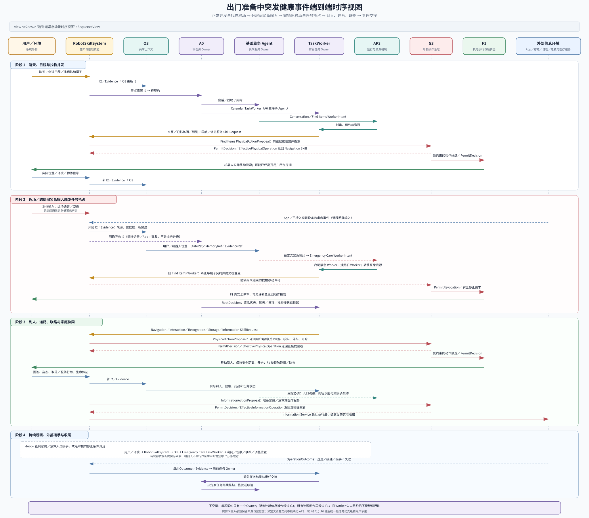

# 附录 A：端到端压力场景——出门准备中的突发健康事件

> 本附录用于检验 16 号文档的 L1 架构能否在并发任务、紧急抢占、跨业务协作和多时间尺度闭环同时存在时保持责任清楚。它不是医学处置方案，也不把尚未交付的外部服务写成当前能力。

## 1. 场景与检验结论

场景如下：

> 用户一边打扫卫生，一边和机器人聊天；随后要求机器人创建日程，再寻找钥匙和帽子。找物过程中，用户搬动重物后出现胸部绞痛、发出痛苦声音并呼救。机器人需要中止或挂起非紧急任务，第一时间返回用户身边，进行本地确认，递送急救药品，联系家属和可用的急救／医疗服务，持续观察，直至用户状态趋于稳定或由家属、急救人员接手。

该场景没有要求增加新的 L1 实体或旁路关系。现有七类 L1 实体可以完成任务分解、并发运行、紧急抢占、物理到人、信息联络、持续观察和责任交接。真正需要验证的是：

1. A0 能否在多个活动任务之间维持一个根任务和一致的用户承诺。
2. 健康与照护 Agent 能否在紧急事件下接管业务优先级，而不成为第二个根任务 Owner。
3. AP3 能否让低优先级 TaskWorker 在安全点挂起，回收移动和交互资源，避免旧实例继续行动。
4. RobotSkill、G3 和 F1 能否让导航、递药和对外联络各自形成完整闭环。
5. O3 能否让所有参与者引用同一份当前状态、记忆和证据，而不把局部推断当成共享事实。
6. 机器人已经离开用户所在房间时，系统能否区分近场观察、低置信远场声音和 App／穿戴设备的明确求救输入。

当前产品边界仍有三项必须明示：

- V1 无机械臂。只有正确药品已经由人放入机载储物仓，且用户能够自行取出和服用时，机器人才能完成“到人—开仓—提示—确认”。机器人不能从家具中取药、把药送入口中或替代医疗人员给药。
- 家属 App 与最小云属于当前 V1 主链；公共急救、医院、在线问诊和人工坐席仍是受控接入或立项候选。架构能够发起、管控和核实这类信息操作，但在相应连接器、服务合同和可用性目标冻结前，不能承诺一定联系成功。
- 机器人可以识别高风险候选事件、执行经过审核的询问和应急流程，但不承担医疗诊断、处方或专业救治责任。

因此，本场景用于证明“架构能够正确组织和降级”，而不是证明 V1 已经具备完整医疗救援能力。

## 2. 任务、契约与唯一 Owner

同一时刻可以存在多个 Agent Cell，但每项契约只能有一个 Owner：

| 活动 | 契约 Owner | 动态执行实体 | 主要 Skill | 完成或退出条件 |
| --- | --- | --- | --- | --- |
| 当前用户会话与总体承诺 | A0 | 不另设根 TaskWorker | 根任务分解、跨业务协调 | 会话结束，或根任务完成、取消、转移 |
| 边打扫边聊天 | 陪伴与关系 Agent | Conversation TaskWorker | 交互、记忆访问 | 会话结束、被更高优先级任务挂起或转为紧急交互 |
| 创建日程 | A0 | Calendar TaskWorker | 交互、信息服务 | 日程服务确认创建，或用户取消、任务失败 |
| 寻找钥匙和帽子 | 环境与物品 Agent | Find Items TaskWorker | 交互、记忆访问、识别、导航 | 两件物品均定位并向用户交付结果，或任务挂起、失败、取消 |
| 突发健康处置 | 健康与照护 Agent | Emergency Care TaskWorker | 交互、导航、识别、信息服务、储物仓 | 家属／急救人员明确接手，或按经审核规则结束本地响应 |
| 家庭通道与人员到场协同 | 家庭安全 Agent | 按需创建有界 TaskWorker | 观察、交互、信息服务 | 到场人员身份和交接状态得到确认 |

Calendar TaskWorker 直接作为 A0 的子 Agent，是因为一次日程创建是有界的信息任务，尚不满足新增基础业务 Agent 的七项判据。若日后“日程与事务管理”形成跨会话的独立状态、规则、指标和组织责任，再重新判断其是否应归入既有业务或升级为新的基础业务。

RobotSkill 只拥有执行子契约。例如 Navigation Skill 可以在内部使用 VLN／NFM Agent Cell 持续避障和重规划，但找物任务或紧急照护任务的最终责任仍分别属于对应 TaskWorker。

## 3. O3 中共享什么

该场景必须严格区分四类信息：

| 类型 | 本场景中的内容 | 规则 |
| --- | --- | --- |
| SharedState | 用户和机器人当前位置、当前活动、健康风险候选、活动任务及其状态、药品是否在仓、联系进度、人员是否到场 | 当前有效，可过期；高风险动作前必须检查新鲜度和证据 |
| SharedMemory | 用户的紧急联系人、已确认的用药计划、长期健康背景、常放钥匙和帽子的位置、交互偏好 | 跨任务保留；不能未经重新观察直接触发即时高风险动作 |
| Evidence | 痛苦声音、明确呼救、姿态变化、现场图像、穿戴或外设读数、日程服务回执、通话和消息结果 | 支持 State 和任务验证；按权限引用，不向所有 Agent 广播原始敏感数据 |
| 局部工作状态 | 找物搜索顺序、健康风险假设、某次对话草稿、导航局部轨迹 | 由当前 Agent 维护；经过验证后才能提交为 SharedState |

O3 不运行语音、姿态或物体识别模型。RobotSkillSystem 持续或按需执行 `P-P1/I-P1`，把声音、图像、手势、姿态和数字输入形成 `I2/Evidence`；O3 从这些结果开始执行 `I-P2`，维护新的 `I3`。

## 4. 端到端运行过程

### 4.1 用户打扫并与机器人聊天

RobotSkillSystem 的低成本在场、变化和唤醒检测持续运行；需要时激活 ASR、说话人、姿态和场景识别。聊天内容经 `I-P1` 形成 `I2/Evidence`，O3 更新用户活动、会话和环境状态。

陪伴与关系 Agent 让 Conversation TaskWorker 持有当前会话契约。它调用 Interaction Skill 产生面向用户的信息操作候选，经 G3 检查身份、隐私、打扰程度和内容用途后再发声。用户的回答和环境变化重新进入感知链，关闭一次交互闭环。

“用户正在打扫”只是 SharedState，不自动变成机器人任务；除非出现明确请求、预定义风险事件或满足主动任务授权条件。

### 4.2 创建日程

用户的语言请求经过：

```text
用户语音
→ P1／P-P1／I1
→ RobotSkillSystem 执行 I-P1
→ 显式意图 I2 + Evidence
→ O3 更新 I3，同时把显式意图 I2 交给 A0
```

A0 把“创建日程”纳入当前根契约，并创建 Calendar TaskWorker。该 Worker：

1. 通过 Interaction Skill 澄清时间、事项和必要参与者。
2. 形成日程创建的 `InformationActionProposal`。
3. 由 G3 检查账户、授权、数据范围和外部影响。
4. 由 Information Service Skill 调用日程服务。
5. 只依据服务回执和再次查询结果判断“已创建”，再向用户确认。

如果日程已经创建，后续紧急事件不会撤销既成结果；如果仍在澄清或等待回执，Worker 在紧急抢占时保存检查点并挂起。恢复时必须先查询实际状态，不能直接重发并造成重复日程。

### 4.3 寻找钥匙和帽子

用户的新请求进入 A0 后，由 A0 把有界子契约交给环境与物品 Agent。后者创建一个 Find Items TaskWorker，在同一任务内管理钥匙和帽子两个目标，避免为了两个物品制造两个无必要的 L1 责任中心。

该 Worker 组合：

- Memory Access Skill：读取常见位置和最近证据。
- Interaction Skill：询问用户最后使用时间、候选位置和是否允许进入相关空间。
- Recognition Skill：识别钥匙、帽子和候选容器。
- Navigation Skill：在已知家庭空间中搜索，并在内部处理实时避障与局部重规划。

调用 Navigation Skill 后，找物任务已经进入物理执行链，而不是停留在 SkillRequest：

```text
Find Items TaskWorker
→ Navigation Skill
→ PhysicalActionProposal
→ G3
→ F1
→ 机器人在家庭空间中移动搜索
→ 实际位置与观察结果返回 RobotSkillSystem、O3 和 Find Items TaskWorker
```

因此，阶段结束时机器人可能正在移动，也可能已经进入另一个房间。Conversation TaskWorker 可以保持逻辑上的会话状态，但交互通道可能因距离、墙体和噪声而退化；不能把“会话仍在运行”写成“机器人仍能清楚听见和看见用户”。AP3 仍须保证只有当前持有交互资源的 Worker 发声，避免闲聊和找物询问互相打断。找物结果是位置、证据和引导信息；V1 无机械臂，不承诺把钥匙或帽子拿给用户。

### 4.4 发现痛苦声音与明确呼救

触发路径取决于机器人与用户的相对位置：

- **同房间或仍有视线：**机器人可以组合近场语音、痛苦声音、姿态和图像形成高风险候选。
- **不同房间：**机器人本体通常只能得到衰减、混响或方向不清的声音，不能继续假定能看见姿态，也不能把模糊声音直接当成明确呼救。
- **远程明确输入：**App 操作或已接入的穿戴设备求救按钮可以经连接器 RobotSkill 形成明确的数字输入。它们只有在设备、连接和授权可用时才成立，不能作为始终在线的无条件前提。

三类输入在进入 `I1` 以后共用同一条解释与状态更新链，但进入 `I1` 的方式不同。近场和远场声音、姿态等物理信号先经过 `P-P1`；App 或穿戴设备发送的受控数字消息直接作为系统边界输入进入 `I1`。两类路径都必须在 `I2/Evidence` 中保留来源、置信度、新鲜度和可用位置：

```text
物理信号：P1 → P-P1 → I1
数字消息：App／穿戴设备 → 受控连接器 → I1
                              ↓
                  RobotSkillSystem 执行 I-P1
→ 近场观察、低置信远场声音或 App／穿戴求救事件 I2／Evidence
→ O3 执行 I-P2
→ 用户与机器人位置、健康风险候选、信号来源和证据新鲜度进入 I3
```

清晰语音呼救、App 求救和穿戴按钮事件属于用户直接表达的意图，同一份 `I2` 可以进入 A0 建立或修改根契约；这不是 RobotSkillSystem 绕过 TaskWorker 发起业务升级。只有模糊声音时，系统只能形成带不确定性的风险候选，并按预定义紧急契约执行限权的停止、重新监听、呼叫确认或前往最后已知位置进行核实，不能把模型猜测升级成无限权的救援行动。

健康与照护 Agent 把“胸部绞痛”当作高风险候选事件，不把它写成已经确诊的疾病。它引用 O3 中的紧急联系人、已确认药物、健康背景和现场证据，决定是否激活 Emergency Care TaskWorker。

### 4.5 紧急任务抢占

预定义紧急契约允许健康与照护 Agent 不等待 A0 即时批准，向 AP3 请求启动 Emergency Care TaskWorker；但创建、运行、许可和物理执行仍不能绕过 AP3、G3 和 F1。

紧急契约已经声明高于普通聊天、日程和找物任务的调度等级。AP3 依据既有规则完成三件事：

1. 让旧 TaskWorker 到达安全让出点，保存检查点并停止产生新的外部影响。
2. 撤销或转移移动、交互、储物仓和外部联络等互斥资源的旧租约。
3. 使用新的 Owner 租约和隔离令牌，阻止迟到的找物导航或聊天输出继续生效。

由于 Find Items TaskWorker 可能正在驱动导航，挂起不能只发生在任务表中。旧 Worker 停止产生新候选，RobotSkillSystem 终止找物导航子契约，G3 撤销尚未结束的移动许可，F1 先安全停车，再接受紧急返回用户的下一项动作候选。

A0 随后作出根任务决定并按范围返回：

- 紧急照护成为当前最高优先级任务。
- Conversation TaskWorker 挂起，紧急交互接管说话权。
- Calendar TaskWorker 已完成则保留结果，未完成则挂起。
- Find Items TaskWorker 已完成则保存结果，未完成则保存搜索进度并释放移动资源。
- 与紧急照护无关的 Agent 不接收完整健康信息。

健康与照护 Agent 是紧急业务契约 Owner；A0 只决定根任务优先级和用户承诺，不重做健康处置步骤。

### 4.6 返回用户身边并进行本地确认

Emergency Care TaskWorker 调用 Navigation Skill 和 Interaction Skill：

1. Navigation Skill 依据用户最新位置规划返回路径。
2. 物理动作候选经 G3 许可后进入 F1。
3. Navigation 内部闭环处理动态障碍和局部改道，不等待 A0。
4. F1 持续读取实时 `I1`，执行限速、制动、防碰撞和安全停止。
5. 实际位置、到达结果和偏差经 SkillOutcome／Evidence 返回 TaskWorker 和 O3。

到人后，Interaction Skill 按经过医疗和合规审核的脚本进行简短询问、安抚和确认；Recognition／Perception Skill 持续观察意识、呼吸、姿态和可用生命体征。TaskWorker 根据实际回答和证据决定下一步，不把“机器人已发出问题”当成“用户已经确认”。

若路径被家具阻挡，Navigation Skill 优先绕行、等待或请求人协助。V1 无机械臂，不能正常搬开重物；只有预先验证并已授权的 `P-P7` 紧急例外模式才允许强制改变外部物体状态，且必须由 F1 执行固定动作、限制能量并满足停止条件，不能由大模型临时发明“撞开障碍”的动作。

### 4.7 递药、外部联系和环境协同并行进行

Emergency Care TaskWorker 在同一紧急契约内协调三条并行子链。

#### A. 急救药品递送

健康与照护 Agent 先确认用户身份、药品与当前用户的绑定关系、药品在仓状态、有效性和经审核的使用前提。满足条件时：

```text
Emergency Care TaskWorker
→ 储物仓／导航 SkillRequest
→ G3 许可
→ F1 移动、停车、防夹和开仓
→ 用户自行取出
→ 视觉／语音确认
→ “已取出／已服用／拒绝／未确认／中断”之一
```

“已取出”和“已服用”必须分开记录。若药品不在仓、身份不确定、仓门异常或用户无法自行取用，系统不得伪造成功，也不得尝试超出 V1 边界的物理给药；它转入外部联系、持续观察和现场引导。

#### B. 联系家属和急救／医疗服务

TaskWorker 通过 Information Service Skill 分别形成家属联络和外部急救／医疗联络候选。每一项都经过 G3，按最小披露原则发送身份、位置、风险摘要、已采取措施、可用证据和联系请求。

执行结果必须区分“已发起”“已送达”“已接通”“对方确认接手”和“失败／超时”。家属 App 与最小云是当前主链；120、医院、在线问诊或人工坐席只有在相应连接器和服务可用时才能进入实际闭环。外部主体只能返回建议、确认或接手结果，不能绕过 G3 和 F1 直接控制机器人。

#### C. 到场和家庭环境协同

健康与照护 Agent 可以通过受控 CoordinationPort 向家庭安全 Agent 交接有界子契约，例如：

- 持续观察入口和用户周边是否安全。
- 在授权且已有设备能力时准备门禁或照明。
- 识别到场家属／急救人员并协助交接。
- 让机器人停在既能观察用户、又不阻挡救援的位置。

家庭安全 Agent 只拥有这项有界子契约，不取得紧急照护契约的所有权；无法解决的门禁、身份或安全冲突再返回 A0。

### 4.8 持续观察、交接与任务恢复

在家属或急救人员到达前，系统重复运行：

```text
用户和环境变化
→ RobotSkillSystem 形成新的 I2／Evidence
→ O3 更新 I3
→ Emergency Care TaskWorker 读取最新状态
→ 继续询问、观察、联络、调整位置或请求外部接力
```

机器人不自行宣布医学意义上的“已经稳定”。它只能依据经审核规则描述可观察趋势，并在出现新的高风险信号时继续升级。紧急任务在以下条件之一成立后结束或转交：

1. 家属或急救人员明确确认接手。
2. 外部专业主体给出新的责任归属和后续安排。
3. 经审核的本地停止条件满足，且没有未完成的高风险动作。

交接时，机器人按授权提供结构化摘要和 EvidenceRef，不默认共享原始音视频。完成交接后，A0 再决定原任务：

- 已创建的日程保持不变。
- 未完成的日程和找物任务默认继续挂起，不因紧急任务结束而自动恢复外部影响。
- 只有用户或已获授权的责任主体确认仍有必要时，才恢复找物或会话。
- 已获得的钥匙、帽子位置和搜索证据可以保留，但恢复前必须检查是否仍然新鲜。

## 5. SysML v2 端到端时序视图

下图是 `SequenceView`。它突出找物任务已经通过 G3 和 F1 进入实际移动、机器人可能与用户分处不同房间、近场／远场／数字求救输入的差异，以及紧急任务如何撤销旧移动、抢占资源并进入新的物理与信息闭环。



图中的“明确呼救 I2 → A0”只适用于清晰语音、App 或穿戴按钮等明确输入；低置信远场声音只形成风险候选，不直接建立根契约。执行与治理层产生的重大变化仍必须先返回 Emergency Care TaskWorker，由其按第 7.6 节规则判断是否形成 `RootImpactEvent`。

## 6. L0 过程与操作数在场景中的落点

| L0 过程 | 本场景中的具体活动 | L1 主要责任 |
| --- | --- | --- |
| `P-P1 采集物理信号` | 采集声音、图像、姿态、本体、储物仓和安全信号，形成 `I1` | RobotSkillSystem 的感知运行时；硬安全与本体信号由 F1 |
| `I-P1 形成事件与语义观察` | 形成聊天内容、日程意图、找物意图、近场或远场声音、呼救、姿态、App／穿戴求救事件和物体观察 `I2` | RobotSkillSystem |
| `I-P2 维护当前状态` | 把活动、位置、风险、任务、药品和联系进度更新为 `I3` | O3 |
| `I-P3 建立目标与契约` | A0 建立根任务；基础业务 Agent 建立找物、会话和紧急照护子契约 | A0、基础业务 Agent |
| `I-P4 规划与选择下一步` | 澄清日程、安排搜索顺序、决定紧急抢占、选择照护步骤和 Skill | 当前契约 Owner |
| `I-P5 验证结果` | 核实日程回执、物品位置、到人、取药、服药确认、联络和交接结果 | 对应 TaskWorker |
| `I-P6 执行信息操作` | 说话、创建日程、通知家属、联系急救／医疗服务、交接信息 | RobotSkillSystem／受控连接器，经 G3 |
| `I-P7 处理反馈与恢复` | 根据用户回答、服务回执、导航偏差、拒绝和超时调整任务 | TaskWorker、基础业务 Agent、A0 |
| `I-P8 管理运行与资源` | 创建／挂起／恢复 Worker，管理移动、交互、模型和连接器资源 | AP3；业务优先级仍由契约和 Agent 决定 |
| `P-P2 维持本体资源` | 电量、热、通信和执行器能力不足时降级 | F1、AP3 |
| `P-P3 改变机器人位置与姿态` | 找物导航、紧急返回、靠近用户、避让救援人员 | Navigation Skill、G3、F1 |
| `P-P4 运送用户放入的物品` | 携带机载急救药到用户身边，停车并开仓 | 健康与照护任务、储物仓／导航 Skill、G3、F1 |
| `P-P5 执行硬安全处置` | 限速、制动、防碰撞、防夹、故障停机 | F1 |
| `P-P6 安全操控外部物体` | 当前场景不启用；V1 无机械臂 | 未来 Manipulation Skill 预留 |
| `P-P7 紧急强制改变外部状态` | 仅在预先验证的紧急例外模式中处理阻挡物 | 预定义紧急契约、G3、F1；默认不启用 |

该映射表说明，第 5 章以后的实体与关系没有替换第 4 章的过程和操作数；它们是在 L1 对同一条跨空间、多时间尺度 OODA 主链进行责任分配。

## 7. 七类闭环如何同时成立

| 闭环 | 本场景中的实例 |
| --- | --- |
| `CL-1 Agent Cell 局部闭环` | Conversation、Calendar、Find Items 和 Emergency Care TaskWorker 分别依据实际结果更新自身状态 |
| `CL-2 任务与契约履约闭环` | A0 维护根任务；四个基础业务 Agent 协调子契约；紧急任务抢占后，完成、挂起、取消和交接结果返回上级 |
| `CL-3 信息操作闭环` | 日程创建、家属消息、急救／医疗联络均经过 G3，并以外部回执关闭 |
| `CL-4 物理任务闭环` | 找物导航、紧急返回、到人和递药均以实际位置、储物仓和用户交互结果关闭 |
| `CL-5 F1 硬安全闭环` | 移动、防碰撞、防夹和故障停机不依赖 A0 或大模型 |
| `CL-6 运行与治理闭环` | AP3 处理 Worker 和资源租约；G3 管许可、撤销和最小披露；旧找物实例不能继续控制底盘 |
| `CL-7 持续感知与共享状态更新闭环` | 聊天、打扫、痛苦声音、呼救、姿态、药品和到场人员持续形成 I2／Evidence，由 O3 维护 I3 |

## 8. 多时间尺度

| 时间尺度 | 本场景中的责任 |
| --- | --- |
| 微秒到数十毫秒 | F1 执行碰撞、防夹、急停和执行器限制 |
| 数十到数百毫秒 | Navigation Skill 局部避障、重规划和安全停止 |
| 百毫秒到数秒 | 语音／姿态／物体感知、O3 状态更新、TaskWorker 任务内判断 |
| 数秒到数分钟 | A0 根任务调整、基础业务协调、紧急确认、递药和外部联系 |
| 分钟到小时 | 持续观察、重复联络、等待家属／急救人员和责任交接 |
| 跨会话 | O3 保留经治理的联系人、用药计划、偏好和事件摘要；A0 与 TaskWorker 实例不需要为此永久运行 |

## 9. 必须验证的失败分支

| 失败分支 | 不允许的错误表现 | 当前架构要求的处理 |
| --- | --- | --- |
| 找物导航在紧急抢占后仍继续 | 两个 Worker 同时控制底盘 | AP3 撤销旧租约并更新隔离令牌；F1 拒绝旧控制来源 |
| 闲聊与紧急询问同时发声 | 用户无法判断该听谁 | 紧急 TaskWorker 取得交互资源；普通会话挂起 |
| 日程创建回执迟到 | 恢复后重复创建日程 | 先查询实际结果，再决定完成、重试或取消 |
| 药品不在仓或用户无法自取 | 机器人声称已经递药／服药 | 明确记录失败或未确认，继续联络和观察，不越过无臂边界 |
| 无网络、家属未响应或外部急救服务不可用 | 把“已发起”写成“已接手” | 分开记录各阶段，按预定次序重试或降级；本地交互、观察和硬安全继续运行 |
| 用户失去回应 | 继续长时间闲聊式询问 | 进入经审核的无响应分支，持续联系外部责任主体并保持本地观察 |
| O3 的身份或位置状态过期 | 向错误的人递药或到错误位置 | 高风险动作前重新观察并核对 Evidence；无法确认则停止动作 |
| 机器人已进入其他房间，只听到模糊声音 | 把噪声当成明确呼救，或因听不清而完全忽略 | 保留信号来源和置信度；先安全收紧当前移动并执行限权核实；App／穿戴事件只有在连接可用时作为明确输入 |
| 导航关键传感器失效 | 为赶时间继续盲目移动 | F1 停止运动；系统改用语音、屏幕和外部联系，不虚构到人 |

## 10. 对 L1 最终评审的结论

该场景没有发现新的 L1 实体、决定权或正常旁路。它验证了：

1. 基础业务 Agent 按长期责任划分，TaskWorker 按一次任务划分，RobotSkill 按能力复用，三种分解维度可以同时成立。
2. 显式呼救、预定义紧急契约、A0 根任务调整和 TaskWorker 重大事件升级是不同因果关系，没有合并成一条万能上报通道。
3. O3、AP3、G3 和 F1 分别承担共享语义、运行机制、外部操作治理和硬安全，没有在紧急场景中变成业务规划器。
4. 一个紧急任务可以同时调用交互、导航、识别、信息服务和储物仓能力，并通过受控协调使用其他基础业务，而不创建自由连接的 Agent Team。

场景同时把后续工作清楚地分成两层：

- L2 设计：紧急事件判定与状态机、TaskWorker 抢占和恢复、移动／交互／储物仓租约、旧导航许可撤销、近场与跨房间声音置信度、App／穿戴求救事件接入、联络重试、到场交接、观察频率、证据新鲜度和 `P-P7` 例外模式。
- 产品与外部系统决策：机载急救药品配置和补充责任、用户无法自取时的服务边界、120／医院／坐席连接器是否进入 V1、外部服务可用性和责任合同。

只有当上述失败分支能够在仿真、故障注入和真实家庭场景中得到验证时，才能把“架构可表达”升级为“系统可兑现”。
