# TODO（L2 启动前）

- [x] 确认重大事件只按 `执行与治理实体 → TaskWorker → A0 → 受影响实体` 逐级处理，正常情况下不存在 `RobotSkillSystem → A0` 的直接业务升级关系。
- [x] 确认 AP3 使用异步、确定且不解释业务语义的冷启动调度原则，并允许依据后续业务场景和案例回收持续校正。
- [x] 确认四个基础业务 Agent 的受控直接协调关系、唯一契约 Owner 和冲突升级边界。
- [x] 确认四个反例的 L1 收口结论，冻结 L1 基线并转入 L2 设计。
- [x] 评审端到端压力场景，确认并发任务、紧急抢占、到人递药、外部联系和责任交接没有产生新的 L1 实体或旁路，并接受无机械臂与外部急救服务可用性的产品边界。
- [ ] 以冻结后的 L1 实体、责任、关系和不变量为输入，确定 L2 的分解顺序与首个评审对象。

---

# Kinbot 递归式 Agentic 机器人系统架构

> 状态：第 3、4 章 L0 已确认；L1 的实体、责任、关系和不变量已于 2026-07-26 通过评审并冻结，后续进入 L2 设计。责任角色：Codex-架构师。版本记录及历史候选见[独立历史文件](16_recursive_agentic_robot_system_architecture_history.md)。

## 1. 当前结论

Kinbot 是连接信息空间与物理空间的 Physical Agent。系统内部任何形成感知—行动闭环的实体都可以视为广义 Agent；只有对一项持续任务承担目标、完成、验证和恢复责任的领域，才在 L1/L2 单列为 Agent Cell。模型、技能、服务、驱动和控制器是实现形式，不因“带智能”就自动成为 L1 实体。

L1 已冻结“基础业务 Agent + TaskWorker + RobotSkill”的架构：按稳定用户价值划分四个基础业务 Agent，具体任务由 TaskWorker 履约，交互、导航、识别、记忆访问、信息服务和未来操作作为 RobotSkill 复用；所有 Agent 使用同一七元组。G3 可以批准、在候选允许范围内收紧、从预先列出的等价操作中选择替代、拒绝或撤销，但不能创造新的业务行动；F1 只在执行容差和硬安全规则内修正或中止物理动作。模型不能直接控制执行器，外部系统不能绕过 G3 和 F1。

重大变化先返回当前 TaskWorker。只有 TaskWorker 判断当前任务已无法在原契约内履行，并且影响根任务、跨业务优先级或用户承诺时，才挂起新的外部影响并向 A0 升级；A0 的决定再按受影响范围返回相关实体。AP3 只执行已经声明的运行和资源规则，不同步等待 A0 判断业务优先级。

## 2. 当前架构层级

本文定义 `L0 系统环境与使命`、`L1 系统级概念架构`、`L2 子系统架构`、`L3 模块与组件架构`、`L4 实现与部署架构` 五级。当前第 3、4 章已经形成 L0 基线，L1 已冻结；L2 承接状态机、协议、阈值、调度细节和实现验证，L3/L4 尚未按当前架构冻结。

## 3. 第一步：确定系统及其形式与功能（L0 已确认）

本章已经用户评审确认，作为当前 L0 系统、边界、形式与功能基线。

### 3.1 目标系统

目标系统是：

> **Kinbot V1 Agentic Robot System**，即机器人整机及其端侧智能运行系统。

边界分为三层，避免把机器人目标系统、完整产品系统和运行环境混为一体：

| 边界层     | 包含内容                                                                                              | 与机器人目标系统的关系                |
| ------- | ------------------------------------------------------------------------------------------------- | -------------------------- |
| 机器人目标系统 | A0、基础业务 Agent、临时 TaskWorker、共享上下文、RobotSkill、Agent 运行平台、语义治理、机器人机电与硬安全平台及受控连接器 | 本文系统边界内                    |
| 完整产品系统  | 机器人目标系统、移动端 App、云服务；后台与人工坐席仍按战略假设评估                                                               | 机器人之外的应用和服务属于产品边界内、目标系统边界外 |
| 运行环境    | 人、家庭空间、物体、穿戴、智能家居、充电设施、家庭网络和第三方平台                                                                 | 系统外环境对象，只能通过受控接口形成输入与反馈    |

外部系统只能交换目标、上下文、服务结果、确认和经过授权的信息，不能绕过 G3 和 F1 直接控制机器人。机器人提供某个外部能力的接入接口，并不意味着把整个外部系统纳入机器人边界。

### 3.2 系统形式

Kinbot V1同时具有物理形式和信息形式。

物理形式：

1. 家庭室内轮式移动、无机械臂的机器人。在后续代际可能扩展双臂甚至演变为全人形。
2. 通过相机、麦克风、轮速、IMU、触觉和受控外设感知物理世界。
3. 通过移动、头部与机身姿态、语音、屏幕、灯光和储物舱作用于物理世界。
4. 当前量产主线仅采用纯视觉环境感知，深度相机和激光雷达只作为研发对比和测试参照；编码器、IMU、电流、温度、触觉、防夹和急停等运动与安全传感器仍可使用。
5. L0 保留未来机械臂安全操控外部物体的接口，但不把机械臂及其技能写成 V1 已实现能力。

信息形式：

1. 运行在端侧的递归式 Agent 运行系统。
2. 通过自身状态、共享世界状态、长期记忆、模型和技能形成认知与行动闭环。
3. 通过 App、云服务、穿戴、家庭设备和服务连接器与信息空间交换受控信息。
4. 原始视觉、语音和生物特征默认在端侧处理，外部只获得经过授权且满足最小披露原则的结构化结果；端侧处理不等于允许任意 Agent 读取或长期保存。

### 3.3 Physical Agent 定义

> Physical Agent 是持续处于物理环境中、围绕目标运行的闭环行动系统。它通过 Observe 获取环境与自身的观测，通过 Orient（理解、融合、推断和判断当前情况）形成并维护世界、自身和任务状态；在规则、安全和资源限制下协调目标并作出决定，输出信息结果或调用机器人动作技能改变物理环境，再根据反馈持续修正状态、目标和行为。

本章把物理智能体形式化为七元组：

\[
\mathfrak A=(\mathcal S,\mathcal X,\mathcal Y,\mathcal A,\phi,M,\Psi)
\]

| 记号                                                                   | 含义                                                                               |
| -------------------------------------------------------------------- | -------------------------------------------------------------------------------- |
| \(\mathcal S\)                                                       | 物理信号空间，通常是多类传感器读数空间的乘积 \(\mathcal S=\mathcal S_1\times\cdots\times\mathcal S_n\) |
| \(\mathcal X\)                                                       | 信息空间中的状态空间；状态可写成 \(x=(\hat x,\Sigma)\)，包含估计值、不确定性和任务所需上下文                        |
| \(\mathcal Y\)                                                       | 信息空间中的结果空间，例如置信度、诊断量、决策依据和对外信息结果                                                 |
| \(\mathcal A\)                                                       | 物理行动空间，即执行器能够执行的指令集合                                                             |
| \(\phi:\mathcal S\rightarrow\mathcal X\)                             | 状态估计与融合算子，把多路异质信号转化为带不确定性的统一状态                                                   |
| \(M:\mathcal X\rightarrow\mathcal Y\times\mathcal A\)                | 决策模型；经典控制律、学习策略、规划器和大模型都可以构成其实现                                                  |
| \(\Psi:\mathcal S\times\mathcal A\rightarrow\mathcal P(\mathcal S)\) | 环境转移核，描述行动与环境变化如何共同产生下一时刻信号                                                      |

离散时间下，最小闭环为：

\[
x_t=\phi(s_t),\qquad (y_t,a_t)=M(x_t),\qquad
s_{t+1}\sim\Psi(\cdot\mid s_t,a_t)
\]

其中，\(x_t\) 是智能体对当前状态的估计，不是物理世界本身。整个闭环的表现由 \(\phi\) 对不确定性的保真度、\(M\) 的决策质量，以及 \((\phi,M,\Psi)\) 组合后的稳定性共同决定。

与第 4 章的 L0 操作数对应时，\(P1\) 是传感器可检测的物理信号，`P-P1` 将其转换为 `I1` 中的传感数据；因此，七元组中的 \(\mathcal S\) 对应进入智能体边界的实时传感数据空间，而不是未经传感器转换的物理现象。系统级 \(\phi\) 抽象了 `I1 → I2 → I3` 的观察形成和 Orient 过程；硬安全裁决则可以在形成 \(I2\) 之前直接读取所需的实时 `I1`。

\[
\text{State}_t=\operatorname{Orient}
(\text{Observation}_{0:t},\text{Memory},\text{Prior},\text{Context})
\]

本文把大模型应用中常称的“理解”视为 Orient 的子过程，不再设置与 Orient 并列的 Understanding 阶段。

### 3.4 系统顶层功能

Kinbot 的顶层功能不是“执行若干功能列表”，而是：

> 在安全、合规、授权、资源和低打扰的前提下，把可能断联、失序或中断的居家生活与照护过程，转变并维持为可感知、可理解、可响应、可恢复、可交接的连续过程。

从 SysML v2 `GeneralView` 特化而来的需求与功能视图：

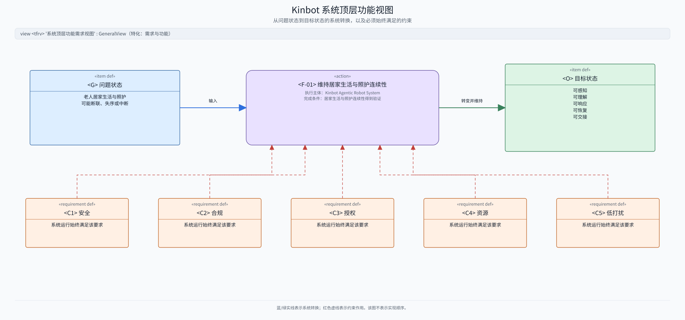

该顶层功能体现在四类用户价值中：

1. 健康与用药管理。
2. 陪伴交互。
3. 家庭安全保障。
4. 环境与物品管家。

`Agentic` 是所有功能共同采用的设计方式。

## 4. L0：两个空间中的过程与操作数（已确认）

用户将 `I1～I8`、`I-P1～I-P8`、`P1～P6`、`P-P1～P-P7` 全部写在纸上，逐一连接输入输出并按实际工作领域聚类，结果回归到 `OODA + Feedback + Management`。这项独立重构验证说明：当前操作数集合能够支撑顶层过程，过程划分能够重新组合成稳定的闭环职责，因此本章作为当前 L0 基线。表中的 L1 候选责任仍属于下一层分配问题，不随 L0 一并冻结。

### 4.1 信息空间操作数

信息操作数按“输入—观察—状态—方案—许可—执行—结果—运行支撑”的处理阶段分层，不再把信息来源、业务含义和处理阶段混在同一级。

| 编号   | 操作数族      | 典型内容                                 |
| ---- | --------- | ------------------------------------ |
| `I1` | 输入数据与消息   | 实时传感数据、用户或外部系统消息、配置与规则更新、外部服务返回数据    |
| `I2` | 观察与事件     | 结构化观察、对话事件、身份声明、关系变化、规则或资源变化、外部结果到达  |
| `I3` | 状态与上下文    | 世界、自身、任务、身份、关系、规则和资源状态，记忆、知识、不确定性与证据 |
| `I4` | 目标与行动方案   | 意图、目标、任务要求、计划、行动申请、完成和取消条件           |
| `I5` | 安全与授权决定   | 禁止、正常许可、紧急例外许可、限制、降级、撤销、有效期与风险限制     |
| `I6` | 技能与工具调用状态 | 调用参数、权限、资源预算、进度、超时、取消和失败状态           |
| `I7` | 结果与证据     | 执行结果、失败证据、状态变化、消息、确认与责任交接            |
| `I8` | 运行资源与版本状态 | 限时资源配额、进程健康、模型 / 技能版本、运行记录、更新与回退状态   |

`I1` 和 `I2` 是持续产生的信息流，`I3` 是持续更新的状态：

1. `I1` 表示系统刚收到、尚未解释的数据和消息。只有 `I-P1` 可以把 `I1` 解释为 `I2`，其他认知与业务过程不得直接把 `I1` 当成事实或状态。
2. `P-P2～P-P7` 可以直接读取经过登记的实时传感数据，例如编码器、IMU、电流、温度、碰撞开关、防夹、接触和力信号。该快速路径只能用于控制、限制、中止和保护，不能生成 `I3/I4/I5`、扩大目标或放宽授权。
3. 快速过程产生的物理变化和执行证据仍需异步进入语义链：物理反馈经 `P1 → P-P1 → I1 → I-P1` 形成 `I2`，执行结果经 `I-P6/I-P7` 形成或更新 `I7`，用于状态理解、任务调整、结果验证和追溯；快速路径不代替 Orient。
4. `I-P1` 持续处理 `I1`。它可以解码、对时、融合、降采样或检测变化，不要求每条原始输入都一一生成 `I2`。
5. `I2` 是按时间顺序产生的观察与事件记录。新记录不能覆盖旧记录；每条记录都应带时间、来源、序号或版本、置信度和有效期。
6. 新产生的 `I2` 按事件类型、对象、任务、权限和时效，分发给所有声明消费该类 `I2` 的过程；不是不加区分地广播给所有 Agent。
7. `I-P2 Orient` 根据新 `I2`、结果证据和当前 `I3` 产生新版本的 `I3`。需要长期使用的是 `I3`，不是对旧 `I2` 的原地修改。

身份、关系、规则或服务结果进入系统时，必须先由 `I-P1` 形成 `I2`，需要保留的内容再由 Orient 写入 `I3`。实时 `I1` 快速路径是为确定性控制和硬安全设置的窄接口，不允许普通 Agent 或业务过程借此绕过 `I2/I3`。

### 4.2 信息空间过程与操作数匹配

下表的 L0 过程、操作数及其转换关系已经确认；“责任”列已经随 L1 冻结，后续 L2 只能展开内部实现，不能改变责任边界。

| 过程                       | 操作数转换                      | 完成判据                                             | 候选责任                                                                     |
| ------------------------ | -------------------------- | ------------------------------------------------ | ------------------------------------------------------------------------ |
| `I-P1 处理输入并形成观察与事件`      | `持续 I1 → 持续产生 I2`          | 按所需时效持续生成带时间、来源、序号或版本、置信度和有效期的观察与事件，不把输入数据直接当成事实 | 感知与交互 RobotSkill 解释输入；F1 提供机电与安全传感数据；AP3 保障持续感知运行，O3 接收形成后的 `I2/Evidence` |
| `I-P2 Orient：理解、融合并维护状态` | `新 I2 + I7 + 当前 I3 → 新 I3` | 世界、自身、任务、身份和关系状态可追溯、可修正，并保留不确定性和版本               | O3 维护 SharedState、SharedMemory 与 Evidence；Agent Cell 维护局部工作状态；AP3 只做检查点  |
| `I-P3 形成目标与行动方案`         | `I2 + I3 → I4`             | 明确责任、限制、资源预算及完成 / 取消条件                           | A0 负责根目标和跨业务计划；基础业务 Agent 负责域内策略；TaskWorker 负责有界任务方案                     |
| `I-P4 评估风险并授权行动`         | `I3 + I4 → I5`             | 给出禁止、正常许可、紧急例外许可、降级或确认要求，并可撤销                    | G3 按许可事件裁决；各 Owner 先做本地检查；F1 保持硬限制                                       |
| `I-P5 分派任务并调用技能或工具`      | `I4 + I5 + I8 → I6`        | 调用不扩大权限、资源和期限，可监督和取消                             | 上级 Agent 提交 WorkerIntent；AP3 管 TaskWorker 机制；TaskWorker 调用 RobotSkill    |
| `I-P6 执行信息操作`            | `I3 + I5 + I6 → I7`        | 每次查询、消息发送、服务调用或责任交接都有结果或失败证据                     | A0、基础业务 Agent 或 TaskWorker 形成候选；G3 检查授权、隐私与最小披露；RobotSkill 执行；AP3 提供受控连接 |
| `I-P7 验证结果并决定后续处理`       | `I2 + I4 + I6 + I7 → 新 I7` | 对照目标和完成判据；未完成时，明确进入恢复、请求上级处理、取消或失败状态             | TaskWorker 验证任务结果；基础业务 Agent 收口业务责任；A0 结束根任务；AP3 保存证据                    |
| `I-P8 管理运行资源与更新`         | `I2 + I6 + 当前 I8 → 新 I8`   | 最低资源保障、故障隔离、版本管理、更新和回退均可执行，且不降低硬安全               | AP3 负责运行管理；OS、cgroup、watchdog 和 F1 确定性执行                                 |

`I-P2/I-P3/I-P7/I-P8` 分别消费与状态更新、目标或中断、结果验证、资源或版本相关的 `I2`。`I3 State` 是 `I-P2 Orient` 持续维护的带版本状态，不是处理节点，也不是事件流。

### 4.3 物理空间操作数

物理操作数按机器人对其控制程度划分，避免把机器人自身状态、携带物品的状态和整个外部世界混为一种“结果”。

| 编号   | 操作数族              | 典型内容                                  |
| ---- | ----------------- | ------------------------------------- |
| `P1` | 传感器可检测的物理信号    | 持续变化的光、声、接触、振动、运动变化和安全传感信号          |
| `P2` | 能量与热状态            | 电能、机械能、声能、光能、温度和散热状态                  |
| `P3` | 机器人自身物理状态与输出     | 位置、速度、姿态、轮端力、语音、显示、灯光和舱门状态          |
| `P4` | 机器人携带物品的状态      | 由人放入储物空间、随机器人运输、等待人取出的药品或其他物品的位置和状态 |
| `P5` | 外部世界物理状态          | 人、宠物、家具、其他物体、家庭空间和未连接设备的位置、姿态和接触状态    |
| `P6` | 可安全操控的外部物体状态（预留） | 未来机械臂可直接接触并在经过验证的安全条件下改变的物体状态；SysML 模型中用 `specialization` 表示 `P6` 是 `P5` 的一种 |

人不是操作数；这里的操作数是系统过程读取或改变的状态。无臂 V1 不能把 `P5` 中环境物体的状态作为可直接控制的输出，只能直接改变 `P3`，或在人放入物品后通过 `P4` 运输这些物品。无线电的物理信号归入 `P1/P2`，信号中的信息归入 `I1/I7`。

### 4.4 物理空间过程与操作数匹配

`P-P1` 持续把 `P1` 转换为 `I1`。`P-P2～P-P7` 直接读取其中与自身有关的实时传感数据，才能在执行期间根据位置、速度、姿态、电流、温度、碰撞、接触和力调整动作。需要 Agent 理解的反馈仍必须经过 `I1 → I-P1 → I2 → I-P2 → I3`。因此，快速路径绕过的是事件形成和语义理解的延迟，不是目标、许可和责任边界；`I5` 只表示许可及其有效范围，`I6` 只表示技能或工具的调用与执行状态。

| 过程 | 操作数转换 | 完成判据 | 候选责任 |
| --- | --- | --- | --- |
| `P-P1 采集物理信号并生成传感数据` | `持续 P1 → 持续产生 I1` | 按相应采样频率完成采样、时间同步和标定，并记录设备健康状态 | F1 采集机电与安全信号；RobotSkillSystem 的感知运行时采集视觉、声音等语义感知信号；AP3 保障运行，不解释信号 |
| `P-P2 管理能量与热状态` | `实时 I1 + P2 + I8 → 新 P2` | 直接读取电压、电流和温度数据，保证安全关键设备供电，且功耗和温度不超过限制 | AP3 管理资源策略，F1 确定性执行 |
| `P-P3 改变机器人自身状态与输出` | `实时 I1 + I5 + I6 + P2 + 当前 P3 → 新 P3 + 新 P1` | 持续读取编码器、IMU、电流和碰撞数据，在许可和机电安全限制内完成移动、姿态或声光表达；外部世界变化只能作为结果观察 | TaskWorker 调用 Navigation／Interaction RobotSkill；Skill 内部可含局部 Agent；F1 确定性执行 |
| `P-P4 运送用户放入的物品` | `实时 I1 + I5 + I6 + P2 + P3 + 当前 P4 → 新 P3 + 新 P4 + 新 P1` | 持续读取舱门、防夹、载荷和物品在位数据；放入和取出仍由人完成 | 健康与照护或环境与物品 Agent 创建 TaskWorker，调用导航与储物技能；F1 执行与防夹 |
| `P-P5 限制或停止机器人的危险动作` | `实时 I1 + P2 + P3 → 受限 P2 + 受限 P3 + 新 P1` | 持续读取碰撞、防夹、倾倒、过流、过热和急停数据，且不依赖 Agent、模型、总线和网络就能限制或停止机器人 | F1 独立硬安全；O3、G3 和任何 Agent Cell 只能请求进一步收紧 |
| `P-P6 安全操控外部物体（机械臂预留）` | `实时 I1 + I5 + I6 + P2 + P3 + 当前 P6 → 新 P3 + 新 P6 + 新 P1` | 持续读取关节编码器、力、力矩、触觉和滑移数据；仅在正常许可有效且满足已验证安全条件时改变物体状态 | TaskWorker 调用未来 ManipulationSkill；Skill 内部 Agent 负责局部闭环；G3 许可，F1 确定性控制；V1 不激活 |
| `P-P7 紧急情况下强制改变外部状态` | `实时 I1 + I5 + I6 + P2 + P3 + 当前 P5 → 新 P3 + 新 P5 + 新 P1` | 持续读取接触、碰撞、速度、电流、姿态和稳定性数据；仅在紧急例外许可有效且无更安全的及时方案时执行，并重新观察和验证结果 | 预定义紧急契约创建限权 TaskWorker，调用已验证 RobotSkill；G3 签发紧急例外许可，F1 只执行预先验证动作模式 |

这些过程同时处于三种不同时间尺度的闭环中：

| 闭环 | 主要路径 | 作用 |
| --- | --- | --- |
| 实时控制与硬安全 | `P1 → P-P1 → 实时 I1 ↔ P-P2～P-P7` | 在 F1 和技能执行层完成快速调整、限流、限速、制动、防夹和力控，不等待 `I2/I3` |
| 技能执行调整 | `I1 → I-P1 → I2 → I3/I7 → I6` | 根据新观察修正技能参数、取消、恢复或重新执行 |
| 目标与许可调整 | `I2/I3 → I4/I5 → I6` | 重新规划、改变任务或重新申请许可 |

`I5/I6` 在执行期间可以异步撤销、取消或更新，但不要求按电机控制周期重复生成。低层控制直接使用实时 `I1`；只有需要解释事件、改变任务、许可或技能策略时，才进入较慢的 `I2/I3` 闭环。急停等独立硬件联锁可以在 F1 内直接响应物理电气信号，这是低于本信息接口的保护路径，不产生新的 L0 过程。

`P-P6` 是未来的常规能力，`P-P7` 是紧急例外，两者不得合并。`P-P7` 可以放宽“不要移动家具、避免轻微财产损伤”等普通限制，但不能关闭急停、防夹、稳定性、执行器极限和人员 / 宠物保护等 F1 硬安全机制。“紧急动作模式”必须事先明确可作用的物体、速度、力和停止条件并通过验证；否则该过程不可用。

具体动作可以由系统根据现场情况产生，例如在用户心绞痛、椅子阻断唯一及时通路时选择推开或撞开椅子；但“是否允许进入紧急例外”必须由预先定义的规则和许可决定。意外撞倒物品不属于 `P-P7`，而是 `P-P3/P-P4` 的异常影响：它改变 `P5` 后，通过 `P1 → P-P1 → I1 → I-P1 → I2 → I7` 进入故障与结果验证闭环。

从机器人可能产生的行为效果看，L0 已覆盖当前能力和预留能力：

| 行为类型              | 顶层过程               | 当前边界                    |
| ----------------- | ------------------ | ----------------------- |
| 感知环境、自身和携带物品      | `P-P1 / I-P1`      | V1 当前能力                 |
| 理解状态、形成目标、决策和验证   | `I-P2～I-P5 / I-P7` | V1 当前能力                 |
| 查询、消息、服务调用与责任交接   | `I-P6`             | V1 当前能力，受网络和授权限制        |
| 移动、姿态、语音、显示和灯光    | `P-P3`             | 读取实时 `I1`，直接改变 `P3` 并产生新的 `P1` |
| 运送人放入的物品          | `P-P4`             | 只改变机器人携带的 `P4`          |
| 能量、热与硬安全处置        | `P-P2 / P-P5`      | V1 当前能力                 |
| 主动、安全地改变环境中的物体    | `P-P6`             | 机械臂能力预留，V1 不实现          |
| 紧急情况下主动承担风险改变外部状态 | `P-P7`             | 候选例外能力，必须单独验证后才能启用      |
| 通过人或外部系统改变世界      | `P-P4 / I-P6`      | 改变由人或外部系统完成，不能算作机器人直接执行 |
| 意外改变外部世界          | 非功能过程              | 作为异常影响和失败证据处理，不写成期望能力   |

### 4.5 SysML v2 过程—操作数关系视图

这是一张从 `GeneralView` 特化而来的关系视图，不是 `ActionFlowView`：过程显示为 `action def`，操作数显示为 `item def`；连线由过程参数的方向和类型派生。每个过程和操作数只出现一次，蓝色实线表示 `in` 参数（操作数指向过程），橙色虚线表示 `out` 参数（过程指向操作数），有圆点才表示实际连接。该图只回答“谁读取或产生什么”，不表达时间顺序；它同时显示 `I1 → I-P1` 的认知路径和 `I1 → P-P2～P-P7` 的实时控制路径，具体时序见下一张 `ActionFlowView`。

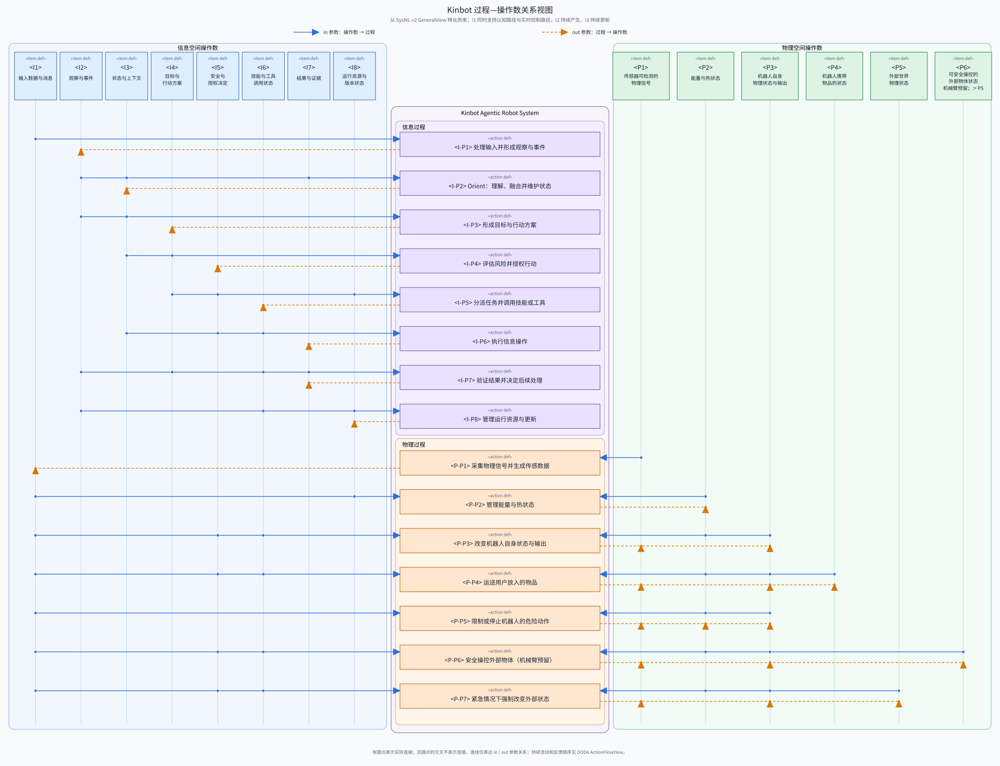

模型源文件为 [`16_process_operand_mapping.sysml`](16_process_operand_mapping.sysml)，其中已定义 `view def <porv> 过程—操作数关系视图 specializes GeneralView`，并通过 SysML v2 Pilot Implementation `2026-05 / 0.60.1` 解析校验。连线不表示过程顺序或 `flow connection`；过程间关系由下一张 `ActionFlowView` 表达。

### 4.6 OODA 与跨空间主链

SysML v2 `ActionFlowView` 配图：

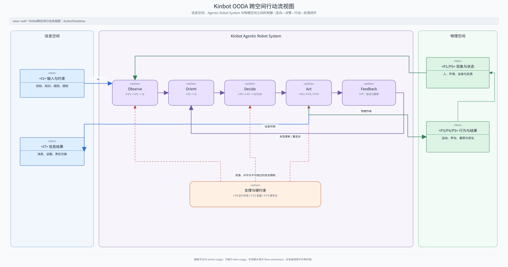

主链区分四种作用：`I-P6` 产生信息结果，`P-P3/P-P4` 改变机器人自身和携带物品的状态，`P-P6` 预留机械臂安全操控，`P-P7` 处理紧急情况下强制改变外部状态的例外。`P-P1` 将 `P1` 持续转换为 `I1`：一条快速路径把所需的实时传感数据直接送给 `P-P2～P-P7`，另一条认知路径由 `I-P1` 形成 `I2`，再分发给 Orient、决策、结果验证和运行管理过程。Orient 据此更新 `I3`。`I-P8/P-P2/P-P5` 提供资源支撑和不可绕过的硬限制。

## 5. L1：基础业务 Agent、TaskWorker 与 RobotSkill

本章是 Kinbot 当前采用的 L1 架构。此前并列评审的“常驻专业 Agent”和“集中式主业务 Agent”两套备选架构、公式、图示与否决依据已经迁入[历史记录](16_recursive_agentic_robot_system_architecture_history.md)，不再作为主文档中的并列候选。

当前架构的核心理念是：

> Kinbot 由形式相同、可以递归组合的 Agent Cell 构成；稳定的基础业务对应长期 Agent Cell，具体任务由临时 TaskWorker 承担，基础能力通过 RobotSkill 复用；O3、AP3、G3 和 F1 分别提供共享上下文、运行机制、语义治理和物理硬安全，使同型 Agent Cell 组合成具有 Kinbot 特性的完整系统。

这里的“基础业务”对应此前讨论的 MetaOperation，“基础技能”对应此前讨论的 MetaSkill。后文不再使用这两个容易产生歧义的英文组合词。

当前架构把两个边界分开处理：

1. **业务责任边界**：按稳定用户价值和长期履约责任划分 A0、四个基础业务 Agent 与 TaskWorker。
2. **能力复用边界**：交互、导航、识别、记忆访问、信息服务和未来操作统一作为 RobotSkill；Skill 内部可以包含 Agent Cell，但不因此升级为 L1 业务 Agent。

### 5.1 L1 七类实体

SysML v2 `InterconnectionView`：

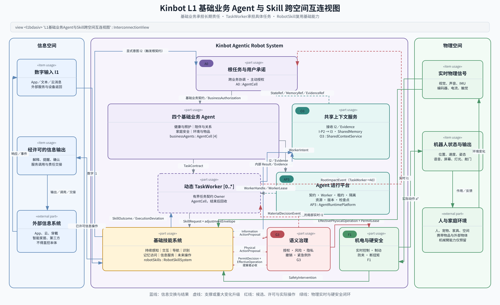

L1 主图保持七类实体：

| L1 实体                            | 形式与责任                                         | 明确边界                                            |
| -------------------------------- | --------------------------------------------- | ----------------------------------------------- |
| `A0 : AgentCell`                 | 根任务、跨业务协调、用户承诺、全域优先级和主动任务授权                   | 不重做 TaskWorker 或 Skill 的局部实时决策；不能越过 G3 和 F1     |
| `businessAgents : AgentCell [4]` | 四个稳定基础业务的长期责任者，维护业务状态、记忆、规则、指标和 TaskWorker 策略 | 不直接拥有底盘、机械臂或外部服务能力；通过 RobotSkill 产生影响           |
| `O3 : SharedContextService`      | 接收 `I2/Evidence`，通过 `I-P2` 持续维护 SharedState、SharedMemory 与 Evidence 的统一服务面 | 不运行 ASR、手势、姿态或物体识别模型，不创造目标，不决定业务优先级，不把共享等同于广播 |
| `robotSkills : RobotSkillSystem` | 提供持续感知以及交互、导航、识别、记忆访问、信息服务和未来操作等基础技能；通过 `I-P1` 形成 `I2/Evidence` | Skill 继承调用目标；内部 Agent 只拥有执行子契约，不能扩大业务契约；不能把 `I1` 直接写成共享事实 |
| `AP3 : AgentRuntimePlatform`     | 管理契约、TaskWorker、持续感知运行时、租约、隔离令牌、资源、版本、检查点和运行机制 | 不决定观察的业务含义，不判断业务优先级，不解释事实，不产生目标 |
| `G3 : GovernanceSystem`          | 管理身份、授权、风险、隐私、撤销和预定义紧急例外                      | 可以批准、约束、选择预先允许的等价操作、拒绝或撤销；不能创造新的业务行动或放松 F1      |
| `F1 : MechatronicSafetyPlatform` | 负责机电执行、实时控制、能量管理和独立硬安全                        | 只在执行容差和硬安全规则内修正或中止；不理解业务目标，不接受模型直控，始终读取所需实时物理信号 |

`TaskWorker [0..*]` 是 AP3 动态管理的 Agent Cell，不增加固定 L1 实体。RobotSkill 内部的 Agent Cell 在 L2 展开，在 L1 仍通过 Skill 接口出现。

四个基础业务 Agent 是：

| 中文名称 | 自然英文 | SysML 枚举 | 可选特化类型 |
| --- | --- | --- | --- |
| 健康与照护 | Health and Care | `HealthAndCare` | `HealthAndCareAgent` |
| 陪伴与关系 | Companionship and Relationship | `CompanionshipAndRelationship` | `CompanionshipAndRelationshipAgent` |
| 家庭安全 | Home Safety | `HomeSafety` | `HomeSafetyAgent` |
| 环境与物品 | Environment and Objects | `EnvironmentAndObjects` | `EnvironmentAndObjectsAgent` |

SysML v2 `GridView`：

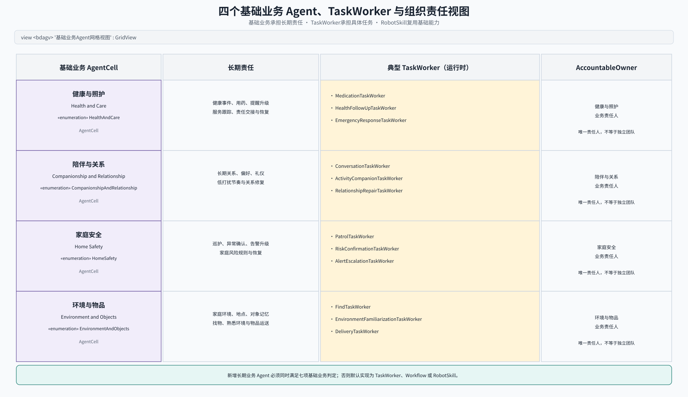

### 5.2 基础业务判定

新增基础业务必须同时满足：

1. 对应独立、稳定的用户价值。
2. 责任跨任务和跨会话持续存在。
3. 维护独立的长期业务状态、记忆或规则。
4. 能产生并协调多种 TaskWorker。
5. 能独立判断域内优先级、完成、失败和恢复。
6. 有独立指标、风险和组织责任人。
7. 并入已有基础业务会产生可验证的责任冲突或状态耦合。

缺少任一项，默认实现为 TaskWorker、Workflow 或 RobotSkill。基础业务必须保持以下一一对应：

\[
\mathrm{BusinessDomain}
\longleftrightarrow
\text{长期 AgentCell}
\longleftrightarrow
\mathrm{AccountableOwner}
\]

这条规则防止当前架构退回到按技术能力堆叠常驻 Agent 的旧结构：不能因为某项能力重要、模型复杂或内部存在闭环，就把它提升为长期业务 Agent。

### 5.3 闭环模型

所有 Agent 均使用第 3.3 节的七元组。当前架构不是扩充 Agent 的基本形式，而是组合多个同型 Agent Cell 与四个系统约束面：

\[
\mathfrak A_i=
(\mathcal S_i,\mathcal X_i,\mathcal Y_i,\mathcal A_i,
\phi_i,M_i,\Psi_i)
\]

\[
\mathfrak A_{\mathrm{Kinbot}}
=
\operatorname{compose}
\left(
\{\mathfrak A_i\},
O3,
AP3,
\Gamma_{G3},
\Pi_{F1}
\right)
\]

Agent Cell 只产生内部信息结果和候选操作。候选操作不是一条裸指令，而是带着状态不确定性、允许修正范围和完成条件的 `ActionProposal`：

\[
(\widetilde y_i,p_i^{q})=M_i(x_i),
\qquad q\in\{I,P\}
\]

\[
p_i^{q}=
\left(
\bar a_i^{\,q},
\Sigma_i^{q},
\mathcal E_i^{q},
\mathcal Q_i^{q},
C_i,
V_i,
H_i
\right)
\]

其中，\(\widetilde y_i\) 是可提交给 O3 或上级 Agent 的内部结果；\(p_i^{I}\) 是查询、消息、服务调用和责任交接等信息操作候选，\(p_i^{P}\) 是物理动作候选。二者都先经过 G3；只有物理动作继续进入 F1。候选中的各项分别表示：

- \(\bar a_i^{\,q}\)：期望执行的操作。
- \(\Sigma_i^{q}\)：状态估计误差与不确定性。
- \(\mathcal E_i^{q}\)：G3、Skill 和 F1 可以进行小幅修正的范围。
- \(\mathcal Q_i^{q}\)：TaskWorker 预先允许的等价操作集合。
- \(C_i\)：当前任务的完成判据。
- \(V_i\)：下一步成立所需的前提。
- \(H_i\)：不得被下层改变的目标、对象、权限、数据用途和其他硬约束。

\(\Sigma_i^{q}\) 回答“系统对现实有多确定”，\(\mathcal E_i^{q}\) 回答“下层可以改多少”，两者不能混用。TaskWorker 在 `SkillRequest` 中给出任务级范围，Skill 在形成执行级候选时只能继续收窄：

\[
\mathcal E_{F1}\subseteq
\mathcal E_{\mathrm{Skill}}\subseteq
\mathcal E_{\mathrm{Task}}
\]

任务级范围是当前任务允许的上界，每次候选中的 `adjustmentEnvelope` 是本次操作允许的范围。任务运行中可以依据新状态和证据重新协商，但已经提交的候选及其修正范围不可原地改变；重新协商必须形成新的候选，旧许可不能自动沿用。扩大后的范围若越过当前任务契约或授权，TaskWorker 必须停止产生新的外部影响并按重大事件链升级。具体版本、状态机和表达方式在 L2 设计。

契约与租约先收窄候选行动空间：

\[
\widetilde{\mathcal A}_i(\kappa_i,\lambda_i)
\subseteq\mathcal A_i
\]

G3 分别为信息操作和物理动作给出语义许可、实际操作和理由：

\[
d_i^{q}[m]=
\Gamma_{G3}
\left(
x^{S}[e(m)],\kappa_i[k(m)],
\mathsf{Auth}_b[k(m)],p_i^{q}[n_i(m)]
\right)
,\qquad q\in\{I,P\}
\]

\[
a_{G,i}^{q}[m]
=
d_i^{q}[m].\operatorname{effectiveOperation}
\]

`PermitDecision` 的结果是 `approved／constrained／substituted／rejected`，已经生效的许可还可以收到独立的 `revoked` 事件。`constrained` 只能在 \(\mathcal E_i^{q}\) 内改变参数；`substituted` 只能从 \(\mathcal Q_i^{q}\) 中选择等价操作。若没有预先允许的等价操作，G3 只能拒绝并给出建议，不能临时创造另一个业务方案。

获准的信息操作由相应 RobotSkill 或受控连接器执行：

\[
\left(o_i^{I}[r],\delta_i^{I}[r]\right)=
K_i^{I}
\left(
a_{G,i}^{I}[m(r)];
d_i^{I}[m(r)]
\right)
\]

物理动作则继续由 F1 使用实时物理信号生成最终动作：

\[
\left(a^*[h],\epsilon_F[h],\delta_i^{P}[h]\right)=
\Pi_{F1}
\left(
s^{\mathrm{rt}}[h],a_{G,i}^{P}[m(h)];
d_i^{P}[m(h)]
\right)
\]

\[
s[h+1]\sim
\Psi\left(\cdot\mid s[h],a^*[h]\right)
\]

\[
x_i^{+}=
U_i
\left(
x_i,
d_i^{q},
o_i^{q},
\delta_i^{q},
\mathrm{SharedState},
\mathrm{Evidence}
\right)
\]

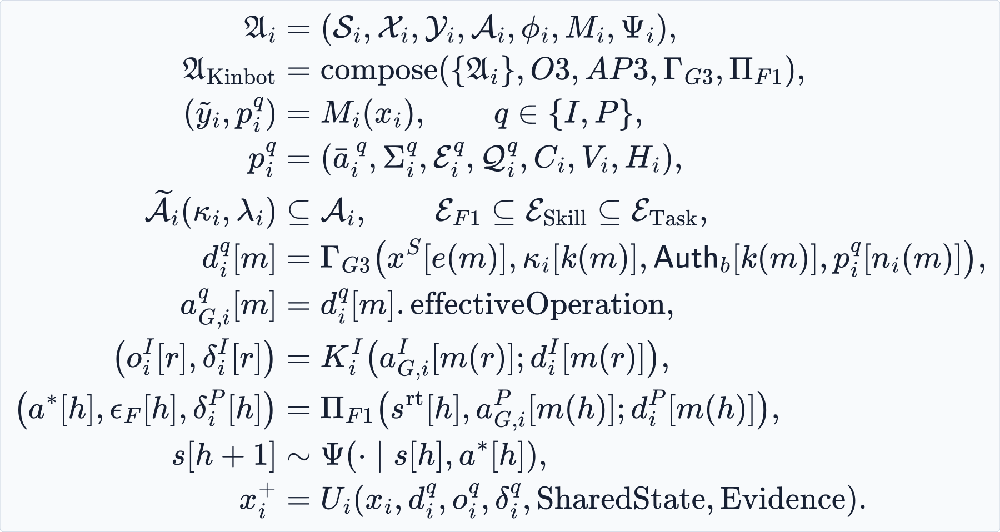

其中，\(e\)、\(k\)、\(n_i\)、\(m\)、\(r\) 和 \(h\) 分别表示 O3、契约与授权、Agent Cell、G3、信息操作执行和 F1 的独立周期或事件序列；\(o_i^{q}\) 是实际结果，\(\delta_i^{q}\) 是候选与实际操作之间的偏差。读取跨时钟输入时必须使用不晚于当前时刻的最近有效值，并检查版本、新鲜度、租约期限和撤销版本。不同实体不共享同一个离散 \(t\)。

TaskWorker 不能因为候选已经发出就假定动作发生。它只依据许可后的实际操作、实际执行结果、执行偏差、SharedState 和 Evidence 更新内部状态。候选、许可、执行和结果必须保持可追溯关系；具体标识与记录结构由 L2 设计。

\(\mathsf{Auth}_b\) 是 `BusinessAuthorization`，只用于机器人主动发起且可能产生外部影响的任务。用户明确请求已由根任务契约授权，不重复申请。Agent 内部可以执行本地风险检查，但只能进一步收紧，不能放松 \(\Gamma_{G3}\) 或 \(\Pi_{F1}\)。

公式中的 \(\mathsf{Auth}_b\) 是条件输入：用户明确请求时，由根任务契约中的用户授权范围替代；没有任何有效授权范围时，G3 必须拒绝候选动作。

系统保留两个不变量：

\[
|\operatorname{Owner}(\kappa,\tau)|=1
\]

\[
\operatorname{scope}(\kappa_{d\rightarrow d'})
\subseteq
\operatorname{scope}(\kappa_0)
\cap
\operatorname{scope}(\mathsf{Auth}_b)
\]

在用户明确请求的场景中，第二个不变量的 \(\operatorname{scope}(\mathsf{Auth}_b)\) 替换为根任务契约内的用户授权范围。

### 5.4 L0 过程与操作数到 L1 的对应

L0 回答“系统必须完成什么转换”，L1 回答“哪些实体共同承担这些转换”。一个 L0 过程可以跨越多个 L1 实体，但必须有一个主要责任者；L1 实体之间交换的内容继续使用 `I1～I8`、`P1～P6`，不能在第 5 章以后另起一套含义相近的名词。

其中，持续感知链必须保持：

```text
物理模态：P1 → P-P1 → I1 → RobotSkillSystem 执行 I-P1 → I2／Evidence → O3 执行 I-P2 → I3
数字模态：App／文本／外部消息形成 I1 → RobotSkillSystem 执行 I-P1 → I2／Evidence → O3 执行 I-P2 → I3
```

语音、手势、姿态、物体和 App 操作虽然模态不同，但都先形成 `I1`，再由感知、交互或连接器类 RobotSkill 解释为 `I2`。O3 管理所有需要共享的观察、证据、状态和记忆，但不因此成为感知模型集合。显式用户意图形成 `I2` 后同时进入 O3 和 A0：O3 保存其证据并更新上下文，A0 据此建立或调整目标与根契约；其他 `I2` 按消费声明进入 O3、TaskWorker 或基础业务 Agent，只有影响根任务时才进入 A0。

| L0 过程 | L1 主要责任与协作关系 | 所属闭环与主要时间尺度 |
| --- | --- | --- |
| `P-P1：P1 → I1` | F1 采集机电与硬安全信号；RobotSkillSystem 的感知运行时采集视觉、声音等语义感知信号；AP3 保持所需运行实例和资源 | `CL-5/CL-7`；微秒至秒 |
| `I-P1：I1 → I2` | 感知、交互或连接器 RobotSkill 完成识别、解释和事件形成；O3 接收 `I2/Evidence`，不执行该过程 | `CL-7`；毫秒至秒 |
| `I-P2：I2 + I7 + I3 → 新 I3` | O3 维护共享状态、记忆和证据；Agent Cell 只维护自己的局部工作状态 | `CL-1/CL-7`；毫秒至长期演化 |
| `I-P3：I2 + I3 → I4` | A0 形成根目标，基础业务 Agent 形成域内策略，TaskWorker 形成有界任务方案 | `CL-1/CL-2`；事件驱动至分钟 |
| `I-P4：I3 + I4 → I5` | G3 产生语义许可；Owner 可先收紧候选，F1 保持独立硬限制 | `CL-3/CL-4/CL-6`；毫秒至秒 |
| `I-P5：I4 + I5 + I8 → I6` | A0 或基础业务 Agent 创建任务意图，AP3 管运行机制，TaskWorker 调用 RobotSkill | `CL-2/CL-6`；毫秒至秒 |
| `I-P6：I3 + I5 + I6 → I7` | RobotSkill 或受控连接器执行已许可的信息操作，结果返回 TaskWorker 并进入 O3 | `CL-3`；毫秒至分钟 |
| `I-P7：I2 + I4 + I6 + I7 → 新 I7` | TaskWorker 验证具体任务，基础业务 Agent 收口业务责任，A0 收口根契约 | `CL-1/CL-2/CL-3/CL-4`；事件驱动 |
| `I-P8：I2 + I6 + I8 → 新 I8` | AP3 管理资源、版本、隔离、检查点和恢复；F1 保持最低安全保障 | `CL-6`；毫秒至版本周期 |
| `P-P2` | AP3 决定资源策略，F1 依据实时 `I1` 管理能量与热状态 | `CL-5/CL-6`；微秒至秒 |
| `P-P3` | TaskWorker 调用 Navigation／Interaction Skill，G3 许可，F1 依据实时 `I1` 执行 | `CL-4/CL-5`；微秒至任务周期 |
| `P-P4` | 健康与照护或环境与物品 Agent 创建 TaskWorker，调用导航与储物 Skill；G3／F1 约束执行 | `CL-2/CL-4/CL-5`；毫秒至分钟 |
| `P-P5` | F1 独立依据实时 `I1` 限制或停止危险动作，并异步返回干预证据 | `CL-5`；微秒至毫秒 |
| `P-P6` | 未来 TaskWorker 调用 Manipulation Skill，G3 正常许可，F1 执行；V1 不激活 | `CL-4/CL-5`；预留 |
| `P-P7` | 预定义紧急契约创建限权 TaskWorker，调用经验证的 Skill；G3 紧急例外许可，F1 保持硬安全 | `CL-2/CL-4/CL-5`；紧急事件 |

操作数在 L1 的产生、管理和消费关系如下。这里的“管理”表示维护其权威版本或运行状态，不表示拥有其中描述的物理对象。

| L0 操作数 | L1 产生、管理与消费 |
| --- | --- |
| `I1 输入数据与消息` | 由 `P-P1`、App 或外部连接器产生；F1 只读取硬安全所需实时子集，RobotSkillSystem 读取并执行 `I-P1`；O3 和普通 Agent 不把它直接当成事实 |
| `I2 观察与事件` | 由 RobotSkillSystem 的 `I-P1` 产生；O3 按来源、证据、时效和权限登记、分发；显式意图同时供 A0 建立根契约 |
| `I3 状态与上下文` | O3 通过 `I-P2` 维护权威版本；Agent、G3 和 RobotSkill 通过受控引用消费 |
| `I4 目标与行动方案` | A0、基础业务 Agent 和 TaskWorker 按契约层级产生并各自负责 |
| `I5 安全与授权决定` | G3 产生并维护语义许可；F1 只在其范围内执行或进一步收紧 |
| `I6 技能与工具调用状态` | TaskWorker 与 RobotSkill 产生任务执行状态，AP3 管租约、资源和生命周期 |
| `I7 结果与证据` | RobotSkill、外部连接器和 F1 产生；TaskWorker 验证，O3 登记，业务 Agent 或 A0 收口契约 |
| `I8 运行资源与版本状态` | AP3 维护；Agent、RobotSkill、G3 和 F1 按需消费 |
| `P1 传感器可检测的物理信号` | 物理环境产生；F1 与 RobotSkillSystem 分别承担安全／机电采集和语义感知采集 |
| `P2 能量与热状态` | F1 维护实际物理状态，AP3 提供资源策略和运行要求 |
| `P3 机器人自身物理状态与输出` | RobotSkill 提出候选，G3 许可，F1 实际改变；结果经 `P1 → I1 → I2` 重新观察 |
| `P4 携带物品状态` | TaskWorker 通过储物与导航 Skill 间接改变，O3 只维护其信息表征 |
| `P5 外部世界物理状态` | 机器人只能观察；V1 的正常行动不能把它作为直接可控输出 |
| `P6 可安全操控的外部物体状态` | 未来 Manipulation Skill、G3 与 F1 共同作用的预留物理操作数 |

这组对应关系是 L0 与 L1 的语义接口：以后新增 L2 子系统、模型或 Skill，必须说明它实现或参与哪个过程、读取和产生哪些操作数，以及所在闭环和时间尺度。

### 5.5 具体任务如何运行

以找物为例，环境与物品 Agent 持有长期的对象与环境业务责任；一次“找眼镜”由它创建 `FindTaskWorker`。该 TaskWorker 持有本次找物子契约，维护目标、搜索进度、证据、预算、完成条件和恢复策略，并调用：

- `InteractionSkill`：澄清目标、预告行动、接受新线索和反馈结果。
- `MemoryAccessSkill`：读取和更新对象位置记忆。
- `RecognitionSkill`：形成候选对象与证据。
- `NavigationSkill`：到达观察位并处理局部避障、重规划和安全停止。
- `ManipulationSkill`：未来机械臂激活后使用；V1 不启用。

找物过程中“边交互边运动”由同一个 `FindTaskWorker` 协调多个 Skill，而不是在交互 Agent 与导航 Agent 之间转移业务责任。若 `NavigationSkill` 内部采用 VLN／NFM 持续闭环，它可以在 L2 由 Agent Cell 实现，并持有“到达某观察位”的执行子契约；它不拥有“找到眼镜”的业务契约。

### 5.6 组织映射

当前架构使用逆康威定律，让长期责任与组织责任对齐，但不强迫每个 Agent、TaskWorker 或 Skill 对应一个独立团队：

| 组织责任 | 主要架构对象 |
| --- | --- |
| 产品与全局业务编排 | A0 与根任务契约 |
| 健康与照护、陪伴与关系、家庭安全、环境与物品 | 四个基础业务 Agent 及各自 `AccountableOwner` |
| 基础能力研发 | RobotSkillSystem；交互、导航、识别、记忆、信息服务和未来操作能力 |
| Agent 平台与共享上下文 | O3 与 AP3 |
| 安全、隐私与授权治理 | G3；与 F1 责任人独立评审 |
| 本体、控制与硬安全 | F1 |

早期同一团队可以负责相邻实体，但契约、接口、指标和验证证据必须有唯一责任人。TaskWorker 是运行时实例，不建立固定组织。

当前 L1 拓扑已经冻结。后续若在 L2 设计或验证中发现尚未阻断的设计诱发型全局单点，必须重新打开相应 L1 边界，而不能用实现细节掩盖；历史候选及选择依据见[历史记录](16_recursive_agentic_robot_system_architecture_history.md)。

## 6. 递归 Agent Cell

### 6.1 统一定义与递归接口

所有被称为 Agent 的实体严格复用 Physical Agent 七元组：

\[
\mathfrak A_i=
(\mathcal S_i,\mathcal X_i,\mathcal Y_i,\mathcal A_i,
\phi_i,M_i,\Psi_i)
\]

| 要素 | 在 Agent Cell 中的含义 |
| --- | --- |
| \(\mathcal S_i\) | Agent 可以感知的信息或物理环境信号 |
| \(\mathcal X_i\) | Agent 维护的状态空间 |
| \(\mathcal Y_i\) | 信息结果、进度、证据和判断结果 |
| \(\mathcal A_i\) | 信息操作、Skill 调用、子契约申请或物理动作候选 |
| \(\phi_i\) | 由观察形成状态的过程 |
| \(M_i\) | 理解、规划、决策、验证和恢复策略 |
| \(\Psi_i\) | 行动后 Agent 所处环境的状态转移 |

契约、租约、Skill 集合、下级 Agent、角色和生命周期是属性、端口和运行约束，不加入七元组。

每个 Agent Cell 具有相同的递归接口：

- Observation／Signal 输入。
- `StateRef`、`MemoryRef` 和 `EvidenceRef`。
- 当前契约和授权引用。
- 局部工作状态。
- Result／Evidence 输出。
- `ActionProposal`／`SkillRequest` 输出。
- Feedback／Intervention 输入。
- `subAgents : AgentCell [0..*]`。
- `skills : RobotSkill [0..*]`。

通过 `roleKind` 区分责任，不改变形式：

- `root`：A0。
- `businessDomain`：四个基础业务 Agent。
- `task`：TaskWorker。
- `skill`：RobotSkill 内部 Agent 实现。
- `control`：控制或硬安全内部 Agent 实现。

`roleKind` 是 AgentCell 的责任分类属性，不是五个子类型组成的继承体系。A0、四个基础业务 Agent、Skill 内部 Agent 和 Control 内部 Agent 都是带不同 `roleKind` 的 AgentCell 用法；只有 TaskWorker 因为增加了一次有界任务、终止和回收约束，显式特化自 AgentCell。RobotSkill 和控制／安全子系统可以包含相应角色的 AgentCell，但外层接口或子系统不因此自动成为 Agent。

SysML v2 `GeneralView`：

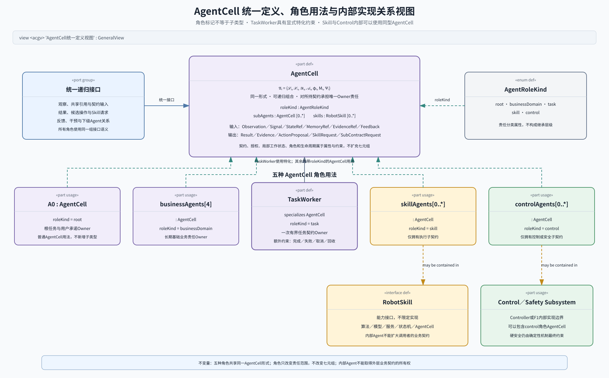

### 6.2 TaskWorker 判定与生命周期

`TaskWorker` 明确特化自 `AgentCell`：

\[
\mathrm{TaskWorker}\subseteq\mathrm{AgentCell}
\]

TaskWorker 同样具有完整七元组，但只持有一次有界任务契约。它必须具有：

1. 明确目标、完成、失败、取消和超时条件。
2. 持续任务状态。
3. 自主 Skill 选择和局部规划。
4. 执行反馈、验证和恢复。
5. 唯一父 Agent 与唯一任务契约 Owner。
6. 任务结束后的状态提交和实例释放。

仅执行一次输入—输出转换、没有持续状态和恢复责任的运行单元，不称为 TaskWorker，而是普通 Job、Workflow Step 或 Skill 调用。

L1 只确认 TaskWorker 必须经历“申请与接纳、执行或挂起、完成或失败、释放”这些生命周期阶段。Agent 决定创建、复用、合并、重试、恢复和终止策略；AP3 负责相应的运行机制、租约、超时、健康检查、检查点、回收和旧实例隔离。具体状态名称、转换条件和事件结构由 L2 设计。

任务生命周期内，每一次外部操作都必须形成“提出候选—获得许可—实际执行—验证结果”的小闭环。提出候选不能更新现实状态；被拒绝或撤销后也不能继续等待成功结果。具体协议和记录结构由 L2 设计。

### 6.3 RobotSkill 与内部 Agent

RobotSkill 是能力接口，不限定内部实现：

```text
RobotSkill
├─ 确定性算法
├─ 模型或服务
├─ 状态机
└─ AgentCell [0..*]
```

Skill 内部 Agent 持有执行子契约，不拥有调用者的业务契约，也不能主动扩大目标、权限、预算、数据用途和外部影响。Navigation 在 L1 是 RobotSkill；其内部 VLN／NFM 闭环可以在 L2 建模为 Agent Cell，并直接读取经过登记的局部实时 `I1`，无需返回 A0 才能完成避障、重规划和安全停止。F1 仍独立执行硬安全。

RobotSkillSystem 同时承载按需调用的技能和持续运行的感知能力。持续感知不等于所有模型永久满负荷运行，而是分为三层：F1 的安全与本体感知始终运行；低成本唤醒、在场和变化检测按设定占空比运行；ASR、手势、姿态、身份和物体识别等高成本模型由唤醒事件、任务或观察请求触发。AP3 负责实例、资源、健康和恢复机制，G3 约束采集范围、数据用途和隐私，RobotSkillSystem 执行 `P-P1/I-P1`，O3 从 `I2/Evidence` 开始维护共享上下文。具体感知策略、模型流水线和占空比在 L2 展开。

### 6.4 Agent Cell 单列判据

广义 Agent 只要求形成感知—行动闭环；在 L1/L2 单列的 Agent Cell 必须是某项持续契约的唯一 Owner，并完整回答：

| 必须具备 | 必须回答的问题 |
| --- | --- |
| 持续目标与终止条件 | 要达成什么，何时完成、失败、取消或到期 |
| 独立状态 | 持续维护什么局部状态，如何引用共享状态、记忆和证据 |
| 策略选择与行动 | 在授权范围内可以选择哪些计划、Skill 和动作 |
| 验证与恢复 | 如何确认结果，哪些失败自行恢复，何时向上处理 |
| 生命周期与唯一 Owner | 谁接受、执行和结束契约，责任转移后如何使旧 Owner 失效 |
| 权限、预算与证据 | 能观察和改变什么，受哪些许可、资源、安全和审计限制 |

PID、SLAM、ASR、TTS、普通工具和一次性模型调用即使内部存在反馈，也不自动成为 L1/L2 Agent Cell。

### 6.5 递归执行规则

上级 Agent 提出带目标、边界、预算和完成条件的子契约；下级接受后成为该子契约的唯一 Owner。下级在范围内选择 Skill、创建 TaskWorker 或继续递归；无法恢复时向上返回结构化失败。下级可以收紧策略，不能扩大目标、权限或资源；上级对自己的上层契约负责，不重新裁决下级每一步局部动作。

TaskWorker 的父 Agent 通常是相应基础业务 Agent。若一次用户明确请求是有界任务、没有稳定的长期业务归属，又不满足新增基础业务判据，A0 可以直接创建 TaskWorker；A0 仍只负责根任务和父契约，不执行该 Worker 的局部规划。此类任务一旦出现跨会话状态、独立规则或稳定组织责任，必须重新归入基础业务评审，不能长期堆积在 A0。

## 7. 第三步：实体之间的关系

### 7.1 三个关系平面

| 关系平面 | 核心关系 | 唯一责任 | 禁止事项 |
| --- | --- | --- | --- |
| 业务与契约 | 根契约、基础业务契约、TaskWorker 子契约、进度、结果和责任转移 | A0、基础业务 Agent 和 TaskWorker 分别只拥有自己的契约 | 一个契约多个 Owner；TaskWorker 改变上层目标 |
| 共享上下文 | SharedState、SharedMemory、Evidence、局部工作状态和引用 | O3 管共享语义；Agent 管局部工作状态；AP3 只做检查点 | 用文字摘要替代高维证据；AP3 判断事实 |
| 运行与安全 | WorkerIntent、SkillRequest、信息／物理候选、许可、租约、撤销和硬安全干预 | Agent 管策略，AP3 管机制，G3 管所有外部操作的语义许可，F1 管实时物理硬安全 | TaskWorker 直接向外发送信息；A0 审批电机周期；模型直达执行器 |

### 7.2 O3 共享上下文

O3 是统一服务面，内部逻辑分为：

- `SharedState`：当前有效的世界、自身、业务和任务状态。
- `SharedMemory`：跨任务保留的历史、偏好、知识和经验。
- `Evidence`：支持 State 和 Memory 的来源及高维证据。
- Agent 局部工作状态 \(z_i\)：不是共享事实，只允许按 TTL 保留或由 AP3 临时检查点。

转换规则是：

\[
z_i\xrightarrow{\operatorname{Validate}}\mathrm{SharedState}
\]

\[
(\mathrm{SharedState},\mathrm{Evidence})
\xrightarrow{\operatorname{Retain}}
\mathrm{SharedMemory}
\]

\[
(\mathrm{SharedMemory},\mathrm{Evidence})
\xrightarrow{\operatorname{Orient}}
\mathrm{SharedState}
\]

共享表示统一事实源、引用、版本和访问控制，不表示向所有 Agent 广播敏感数据。高风险行动必须检查状态新鲜度并沿 `EvidenceRef` 复核；陈旧状态不能启动新的高风险动作。

O3 的输入边界从 `I2/Evidence` 开始。视觉、语音、手势、姿态、身份、物体和数字消息的识别或解释由 RobotSkillSystem 执行 `I-P1`；O3 执行 `I-P2`，把经过登记的观察、结果和既有状态更新为新的 `I3`。因此，`RobotSkillSystem → O3` 是持续存在的状态更新关系，而 `P1/I1 → O3` 不是合法的共享事实捷径。

### 7.3 主动任务授权

机器人主动发起且可能产生外部影响的任务遵循：

SysML v2 `SequenceView`：

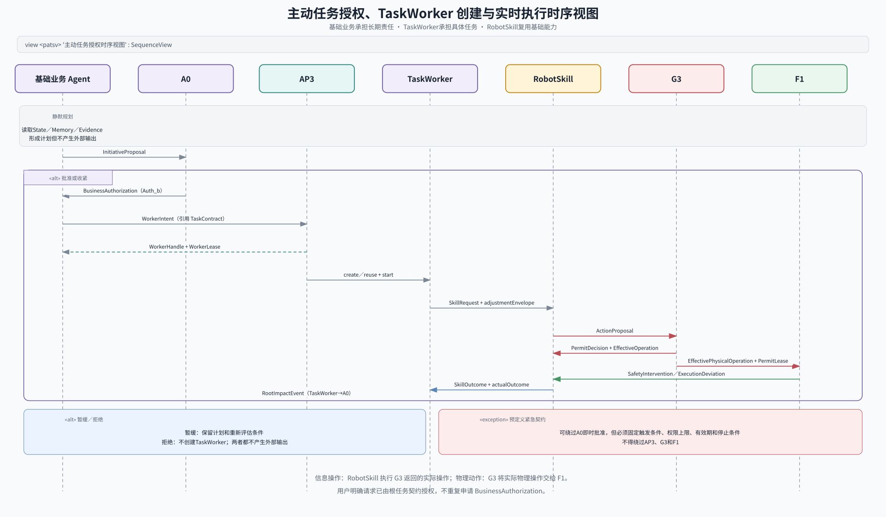

```text
基础业务 Agent 静默规划，不产生外部输出
→ InitiativeProposal
→ A0 依据全域 State／Memory／活动契约裁定
├─ 批准或收紧：BusinessAuthorization
│  → 基础业务 Agent 形成任务契约
│  → WorkerIntent
│  → AP3 创建或复用 TaskWorker
│  → RobotSkill
│  → G3
│  → F1
├─ 暂缓：保留计划与重新评估条件，不产生外部输出
└─ 拒绝：不创建 TaskWorker，不产生外部输出
```

用户明确请求由根任务契约授权，不重复申请 `BusinessAuthorization`。预定义紧急契约可以绕过 A0 即时批准，但必须有固定触发条件、权限上限、有效期和停止条件，且仍不得绕过 AP3、G3 和 F1。

### 7.4 基础业务 Agent 的受控直接协调

健康与照护、陪伴与关系、家庭安全、环境与物品四个基础业务 Agent 均具有 `CoordinationPort`，可以在不返回 A0 重做域内判断的情况下直接协调。这里的“直接”是业务语义直接到达对方，不表示绕过 AP3 建立无约束的点对点网络：AP3 负责通道、登记、投递、审计和取消传播，`CoordinationGraph` 记录当前根契约下允许存在的协调关系，但二者都不重新解释业务语义。

SysML v2 `InterconnectionView`：

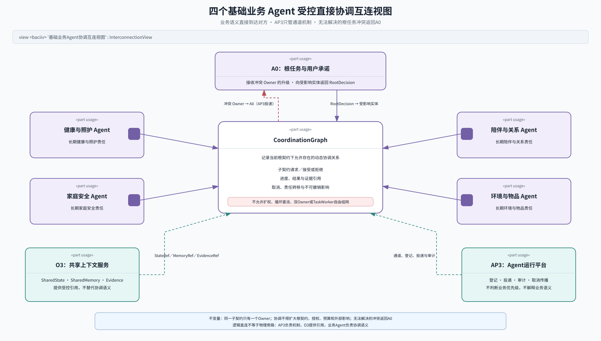

协调关系只表达四类稳定语义：

- 请求对方承担一个有界子契约，并由接收方明确接受或拒绝。
- 返回子契约进度、结果和证据引用。
- 传播取消、责任转移和已经产生的不可撤销影响。
- 将无法在当前根契约内解决的目标、优先级或用户承诺冲突升级到 A0。

协调发起方或当前子契约 Owner 负责判断冲突是否已经超出本次协调边界，并向 A0 升级；`CoordinationGraph` 只记录允许关系，AP3 只负责投递，二者都不能自行发起业务升级。A0 的决定只返回受影响的基础业务 Agent 和相关 TaskWorker。

直接协调只在以下条件下启用：

1. 存在同一个有效根契约。
2. 已有用户授权或 \(\mathsf{Auth}_b\)。
3. 子契约没有扩大目标、权限、预算和外部影响。
4. 每个子契约仍只有一个 Owner。
5. 无法解决的跨业务优先级冲突返回 A0。

TaskWorker 不得直接形成跨业务自由网络；跨业务协调由其父基础业务 Agent 负责。CoordinationGraph 必须限制深度、跳数、并发、预算，使用幂等键、循环检测和取消传播。

### 7.5 TaskWorker 生命周期分工

TaskWorker 的父 Agent 负责业务策略；通常是基础业务 Agent，只有第 6.5 节所述无稳定业务归属的根级有界任务由 A0 直接承担父 Agent 责任：

- 是否创建、复用或合并 TaskWorker。
- 域内任务优先级。
- 任务分解、重试、恢复和终止策略。
- 是否请求 A0 处理跨业务冲突。

AP3 负责运行机制：

- 创建、启动、暂停、恢复、终止和回收。
- 并发上限、超时、心跳和孤儿实例清理。
- 检查点、资源配额和版本固定。
- `WorkerLease`、Owner 租约和隔离令牌。
- 迟到、重复和旧实例拒绝。

Agent 提交 `WorkerIntent`，AP3 返回 `WorkerHandle` 和 `WorkerLease`。AP3 不得自行改变业务优先级。

当两个此前未共同运行的任务第一次争用资源时，AP3 不同步等待 A0，也不能按消息到达先后临时决定。它只执行一套对所有任务都适用的确定性冷启动原则：

1. 硬安全、预定义紧急任务和安全收尾优先。
2. 已持有有效租约的任务运行到安全让出点，避免中途形成新的危险状态。
3. 其余任务按契约已经声明的调度等级、时限和可抢占性排序。
4. 仍不能区分时，按根契约被系统接受的顺序和稳定标识确定结果，而不是按网络到达顺序。
5. 无法映射到通用规则的任务不争用资源，进入安全等待，并异步通知 A0。

A0 对此类冲突形成的新判断，默认更新后续契约使用的调度原则，不在 AP3 内部悄悄改写已经生效的业务优先级或租约。确需改变当前任务时，仍通过取消、改约或根任务决策完成。上述顺序是 L1 的保守基线；随着找物、照护、回充、家庭安全等业务场景和冲突案例持续回收，应在不改变 AP3 责任边界的前提下更新完善。

### 7.6 重大事件、G3、F1 与禁止旁路

G3 的许可决定必须表达裁定结果、许可后的实际操作、候选与实际操作的差异、原因、证据依据、许可边界、影响程度和下一步要求。G3 不是第二个业务规划器：它只能批准原候选、在允许修正范围内收紧参数，或从 TaskWorker 预先允许的等价操作中选择一个。

TaskWorker 产生的 Result／Evidence 只能提交 O3 或上级 Agent，不等于已经对外输出。任何面向用户、App、云、第三方或其他责任主体的查询、消息、服务调用和责任交接，都必须转化为 `ActionProposal`，由 G3 检查身份、授权、隐私、用途和最小披露范围。G3 许可后，信息服务或交互 RobotSkill 才能执行；信息操作不进入 F1。

许可结果与反馈规则如下：

| 结果 | `effectiveOperation` | 主动反馈要求 |
| --- | --- | --- |
| `approved` | 与原候选相同 | 必须返回直接提案者；Owner 可合并接收 |
| `constrained` | 目标和操作类型不变，参数在允许修正范围内收紧 | 影响完成判据或下一步前提时主动推送 Owner，否则可随 `SkillOutcome` 合并 |
| `substituted` | 只能是候选预先列出的等价操作 | 必须主动推送 Owner，并带实际操作、差异和原因 |
| `rejected` | 本次候选标为 `NotExecuted` | 必须主动推送 Owner；若还要停止先前已获许可的操作，另发 `PermitRevocation` |
| `revoked` | 使已经签发的许可失效，并给出停止、取消或安全保持要求 | 必须立即推送直接执行者和 Owner |

每个 `PermitDecision` 都先返回直接提出 `ActionProposal` 的 Skill 或内部 Agent，使执行状态与许可一致。若实际操作改变了完成判据、下一步前提、外部影响、权限、预算、时限或任务终态，则同时生成 `MaterialDecisionEvent` 主动推送当前 TaskWorker；是否属于重大变化无法判断时按重大变化处理。G3 负责判断许可变化是否足以影响当前任务，AP3 只负责可靠投递、记录与重试，不解释业务影响。

F1 可以在执行容差内作连续微调；超出容差或因硬安全规则采取限速、制动、保持、释放、停机等动作时，必须产生 `SafetyIntervention` 和 `ExecutionDeviation`。小幅修正可与下一次 `SkillOutcome` 合并，影响完成判据或下一步前提的修正必须主动推送当前 TaskWorker。TaskWorker 只根据实际操作、实际结果和新观察更新状态，不能从候选动作推断现实。

正常业务升级只有一条因果链：

```text
G3／F1／RobotSkill
→ PermitDecision／MaterialDecisionEvent／SafetyIntervention／SkillOutcome
→ TaskWorker 判断当前任务是否仍可在原契约内履行
├─ 可以：局部恢复、重新规划或继续执行
└─ 不可以或在任务允许的判断窗口内仍无法确认：
   TaskWorker 挂起新的外部影响
   → RootImpactEvent
   → A0
   → RootDecision
   → 受影响的基础业务 Agent、TaskWorker、AP3、G3 和 RobotSkill
```

正常情况下不存在 `RobotSkillSystem → A0` 的直接业务升级关系。L1 的业务因果关系是 `TaskWorker → A0 → 受影响实体`：RootImpactEvent 的来源是 TaskWorker、业务接收者是 A0，RootDecision 的来源是 A0、业务接收者是受影响实体。AP3 只为这些直接关系提供投递、重试、审计和运行保障，不接收、解释、改写或重新生成业务事件；只有 L2 运行视图才展开具体投递机制。TaskWorker 等待根任务决策期间，只允许安全停止、保持稳定、重新观察、报告和释放非必要资源，不得继续扩大外部影响。A0 的决定按受影响范围返回，不向无关 Agent 广播；O3 记录已经生效的根任务状态。

SysML v2 `SequenceView`：

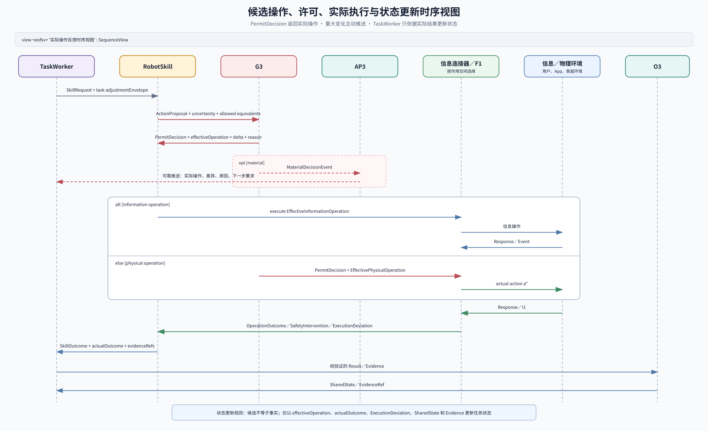

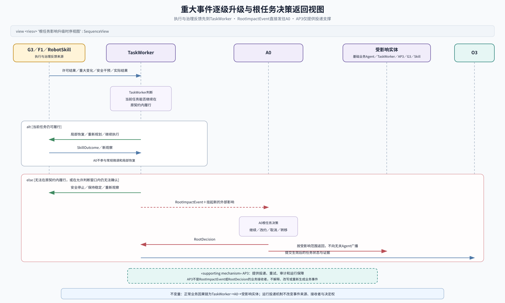

F1 必须存在不依赖 A0、基础业务 Agent、TaskWorker、RobotSkill、AP3、G3、共享模型、消息总线或网络的硬安全通路。外部系统、业务 Agent、TaskWorker、Skill 内部 Agent 和模型都不能直接控制执行器；TaskWorker 也不能绕过 G3 直接产生外部信息影响。

### 7.7 七类闭环

当前架构有七类稳定的闭环关系。它们可以嵌套、并行，不代表系统只有七个运行实例：

| 编号 | 闭环 | 经过的实体与关系 | 关闭条件 |
| --- | --- | --- | --- |
| `CL-1` | Agent Cell 局部闭环 | Observation／StateRef／MemoryRef／EvidenceRef → Agent Cell → Result／SkillRequest／ActionProposal → Feedback／Intervention → 局部状态 | Agent 依据实际反馈更新状态并决定继续、完成、恢复或退出 |
| `CL-2` | 任务与契约履约闭环 | 根契约由 A0 分解到基础业务 Agent 或根级有界 TaskWorker；基础业务 Agent 可直接协调子契约并创建 TaskWorker；TaskWorker 经 RobotSkill 履约，无法维持原契约时向 A0 升级，A0 返回根任务决策 | 每个契约始终只有一个 Owner；完成、失败、取消、转移或改约结果返回上级契约 |
| `CL-3` | 信息操作闭环 | TaskWorker → RobotSkill → InformationActionProposal → G3 → EffectiveInformationOperation → 外部信息环境 → OperationOutcome → RobotSkill／O3 → TaskWorker | 实际信息操作及外部响应被任务 Owner 确认 |
| `CL-4` | 物理任务闭环 | TaskWorker → RobotSkill → PhysicalActionProposal → G3 → EffectivePhysicalOperation → F1 → 物理环境 → 实时 I1 → RobotSkill → TaskWorker | 实际物理结果经 SkillOutcome 和观察验证 |
| `CL-5` | F1 硬安全闭环 | 实时 I1 → F1 → 执行器 → 物理环境 → 实时 I1 | 硬安全约束持续成立，或系统进入确定性安全状态 |
| `CL-6` | 运行与治理闭环 | G3 的许可／撤销事件形成许可子环；AP3 的 WorkerIntent／Lease／心跳／检查点／回收和异步资源调度形成运行子环 | 许可、Owner、租约、调度结果和运行实例保持一致，旧实例与旧许可不能继续生效 |
| `CL-7` | 持续感知与共享状态更新闭环 | 观察策略／ObservationRequest → RobotSkillSystem；`P1 → P-P1 → I1` → RobotSkillSystem 执行 `I-P1` → `I2/Evidence` → O3 执行 `I-P2` → `I3` → Agent／RobotSkill 消费并提出新的观察请求；AP3 在主因果链外保障运行和资源 | 所需观察的覆盖范围、新鲜度和证据链持续满足；状态变化能够调整后续观察，而原始 `I1` 不被直接提升为共享事实 |

SysML v2 `ActionFlowView`：

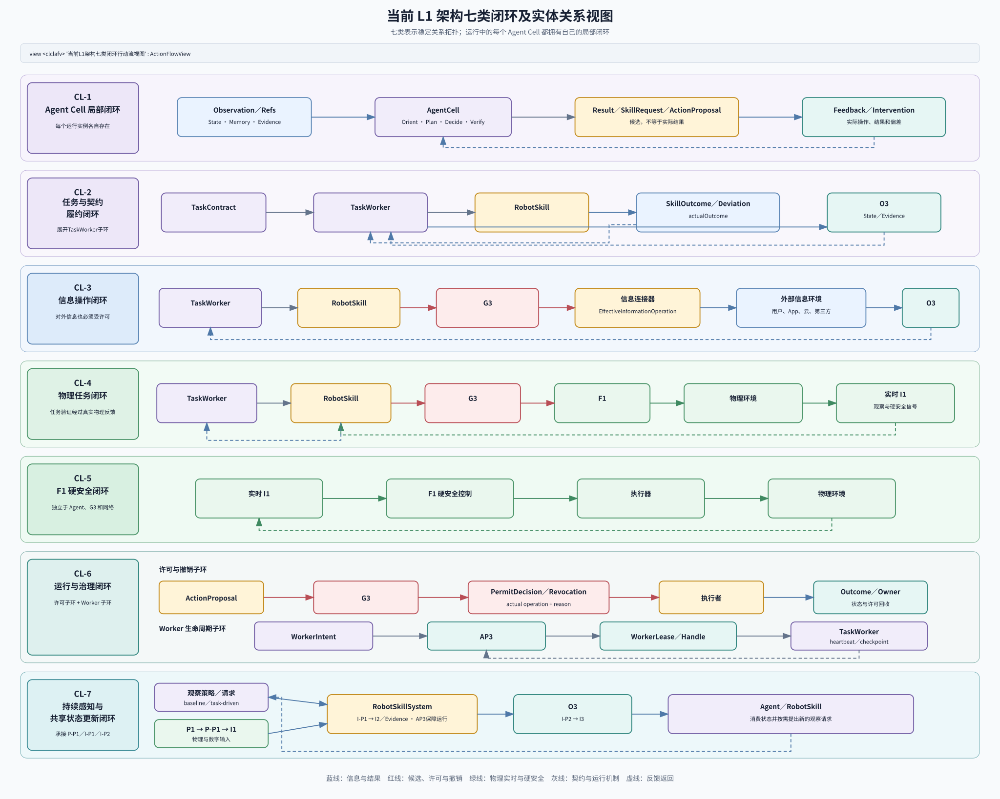

每个运行中的 Agent Cell 都有自己的 `CL-1`。因此局部闭环实例数随运行时变化：

\[
N_{\mathrm{AgentCellLoop}}
=
1+4+N_{\mathrm{TaskWorker}}
+N_{\mathrm{SkillAgent}}
+N_{\mathrm{ControlAgent}}
\]

七类闭环描述的是稳定的关系拓扑，不是固定线程数或固定调用次数。导航 Skill 可以同时处于 `CL-1`、`CL-2`、`CL-4` 和 `CL-7` 中；F1 的 `CL-5` 始终独立运行。

`CL-2` 在 L1 包含 TaskWorker 履约、基础业务 Agent 直接协调、根任务影响升级三个子环；`CL-6` 包含许可与撤销、Worker 生命周期与资源调度两个子环；`CL-7` 同时承接第 4 章的持续 `P-P1/I-P1/I-P2` 过程。子环用于展开责任和因果关系，不新增 L1 实体，也不改变七类顶层闭环。

### 7.8 并发、取消与一致性

1. 跨 Agent 使用带版本的 `StateRef`、`MemoryRef`、`EvidenceRef`、限时许可和资源配额，不复制高维证据。
2. 同一活动契约与同一执行器同时只能有一个有效 Owner 或租约持有者；责任转移必须更新 `fencingToken`。
3. 撤销即时生效；取消向下传播，Owner 返回未开始、已停止或已产生不可撤销影响。
4. 外部操作使用 `idempotencyKey` 与 `fencingToken`；迟到、重复、旧版本、旧 Owner 和旧许可必须拒绝或去重。
5. 安全中止必须经过等待、冷却和复位才能重试；资源降级优先保留硬安全、基础感知、基础交互、运动和证据。

## 8. 多时间尺度运行

| 时间尺度 | 主要承载 | 主要工作 | 不变量 |
| --- | --- | --- | --- |
| 微秒到数十毫秒 | F1 | 急停、伺服、碰撞／失稳、防夹、看门狗和故障保护 | 完全独立于 Agent、模型、总线和网络 |
| 数十到数百毫秒 | Navigation／Manipulation RobotSkill 内部 Agent、F1 | 读取登记的实时 `I1`，执行局部运动、力修正、避障、重规划和安全停止 | 不等待 A0 或基础业务 Agent；F1 持续限制实际动作 |
| 百毫秒到数秒 | TaskWorker、RobotSkill、O3、AP3 | 意图澄清、状态更新、任务内规划、Skill 选择、验证和恢复 | 读取最近有效版本；模型超时有明确降级 |
| 数秒到数分钟 | A0、基础业务 Agent、G3 | 根任务、主动授权、跨业务协调、服务交接和中断恢复 | 外部影响有契约、许可、预算和完成判据 |
| 分钟到天 | 基础业务 Agent、O3、AP3 | 长期状态、记忆、关系、照护连续性、策略和版本更新 | 长期推断不能未经重新观察与授权触发即时高风险动作 |

各 Agent Cell 可以运行局部 OODA，不要求固定为串行流水线。A0 维护根任务，基础业务 Agent 维护长期业务责任，TaskWorker 维护有界任务，Skill 内部 Agent 维护执行子契约。跨时钟只能读取当前时刻之前最近且仍有效的版本。

## 9. 第四步：涌现

涌现不是新的顶层实体，而是七类 L1 实体形成闭环后，系统整体表现出的能力和性质。

### 9.1 七个期望涌现

`E` 表示 Emergence。原 `M1～M7` 没有定义，并与历史文档中的 Module 编号冲突，因此不再使用。

| 编号 | 期望涌现 | 形成机制                                     | 可观察结果 | 主要风险 |
| --- | --- | --- | --- | --- |
| `E1` | 物理对象与数字状态一致 | O3 共享上下文、证据与再次观察                         | 数字记录可追溯到具体人、地点或物体 | 身份混淆、状态过期、把推断当事实 |
| `E2` | 连续情境理解 | SharedState、SharedMemory、Evidence 与业务上下文 | 知道谁、在哪里、发生了什么及其不确定性 | 上下文丢失、时间混乱、虚假确定性 |
| `E3` | 单一而受约束的主业务流 | A0 根契约、基础业务契约和唯一 Owner                   | 用户面对一个行为连贯的 Kinbot | 多个 Owner、目标漂移和越权 |
| `E4` | 可组合、可恢复的能力 | TaskWorker、RobotSkill、失败证据和递归恢复          | 能组合能力完成新任务并从局部失败恢复 | 委派循环、连锁失败和重试风暴 |
| `E5` | 温暖、低打扰的陪伴感 | 陪伴与关系业务、交互 Skill、空间行动和共享上下文              | 在合适时间、地点和距离交流 | 打扰、监视感、冒犯和诡异感 |
| `E6` | 人—机—服务照护协同 | 健康与照护业务、TaskWorker、到人和服务交接               | 家庭、App、坐席和服务方完成有确认的交接 | 责任悬空、重复通知和无人跟进 |
| `E7` | 家庭生活与照护连续性 | E1～E6 共同运行                                | 事件可被发现、响应、恢复和交接 | 静默失败以及对用户主体性和尊严的伤害 |

紧急情况下选择推开或撞开椅子的具体办法可以是 E3／E4 组合后的正向涌现；进入条件、`BusinessAuthorization` 或预定义紧急契约、G3 许可、F1 动作模式和停止条件必须预先定义，不能随着涌现改变。

### 9.2 产品感与负向涌现

产品感体现为：任务连贯、状态可信且能恢复的“聪明”，表达、距离、时机和照护责任一致的“温暖”，内部协作不暴露给用户的“精致”，以及不伪造现实、不越权、能说明结果和责任的“可信”。

必须防止：

1. 多个 Agent 同时扩大目标，或旧状态继续驱动新行动。
2. 许可撤销后，旧 TaskWorker、旧 Skill 实例或旧版本继续操作。
3. TaskWorker 恢复与安全中止互相触发，形成停止—重试循环。
4. CoordinationGraph 循环委派并耗尽资源。
5. 长期记忆、主动行为或端云不同步造成隐私侵犯、状态污染和监视感。

## 10. 硬规则与单点失效

### 10.1 系统硬规则

| 约束面 | 硬规则 |
| --- | --- |
| 安全与授权 | 主动外部影响先经 A0 的 `BusinessAuthorization`；动作候选经 G3；F1 独立输出实际安全动作；任何 Agent 不能覆盖拒绝 |
| 状态与记忆 | O3 区分 SharedState、SharedMemory、Evidence 和局部工作状态；共享是受控引用，不是广播 |
| 运行 | Agent 管业务策略，AP3 管运行机制；逻辑 Agent 不独占模型、进程或算力 |
| 资源 | 断网不损伤端侧运动与硬安全；资源不足优先保留硬安全、基础感知、基础交互、运动和证据；量产基线仍为 `12GB RAM + 32GB Flash` |
| 数据与供应链 | 原始音视频和生物特征默认不进入长期记忆或普通日志；凭据最小授权，模型与 Skill 更新必须签名并可回退 |
| 端云边界 | 安全关键闭环在端侧成立；App、云、坐席和第三方平台是边界外实体，不能直控本体 |

`Person／CareRelationship／Household／Place／Object／Task／CareEvent` 是业务对象，不是七个 Agent。

### 10.2 单点失效定义

一个实体的崩溃、错误、延迟、过载或分裂运行若造成以下任一结果，即视为单点失效：

- 产生未授权或无法停止的物理动作。
- 所有主要业务同时不可用。
- 同一契约或执行器出现两个有效 Owner。
- State、Memory、契约或授权出现不可恢复且无法发现的不一致。
- 一个业务域故障扩散到无关业务域。

SysML v2 `GridView`：

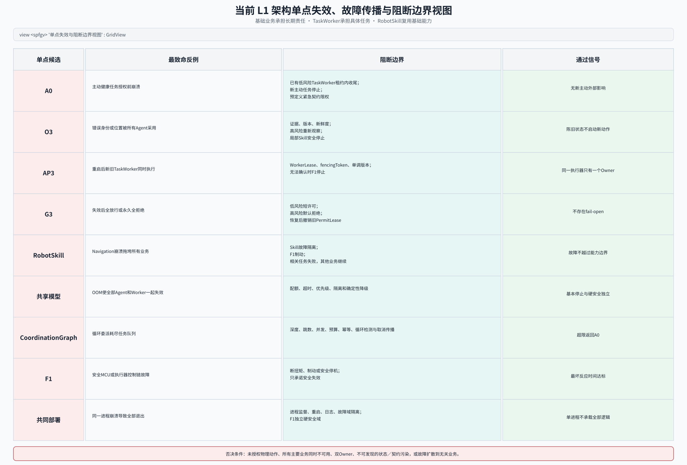

### 10.3 必须验证的失效场景

| 单点候选              | 最致命反例                                       | 当前架构必须证明                                        |
| ----------------- | ------------------------------------------- | ----------------------------------------------- |
| A0                | A0 在主动健康任务授权前崩溃                             | 已有低风险 TaskWorker 可在租约内收尾；不创建新主动任务；只有预定义紧急契约限权运行 |
| O3                | O3 向所有 Agent 发布错误身份或位置                      | 高风险任务要求证据与重新观察；陈旧状态不能启动新动作；局部 Skill 可以安全停止      |
| AP3               | 重启后新旧 TaskWorker 同时持有执行权                    | WorkerLease、隔离令牌和单调版本使旧实例失效；无法确认时 F1 安全停止       |
| G3                | G3 失效后系统全放行或永久全拒绝                           | 低风险许可只在短有效期内继续；高风险默认拒绝；恢复后撤销旧 PermitLease       |
| RobotSkill 运行时    | Navigation 崩溃拖垮全部 Skill 和 Agent             | Skill 故障隔离；F1 独立制动；相关任务失败或降级，其他业务继续             |
| 共享模型服务            | 模型 OOM 导致 A0、所有基础业务 Agent 和 TaskWorker 一起失效 | 配额、超时、优先级和隔离；基本停止、基础交互和硬安全不依赖共享大模型              |
| CoordinationGraph | Agent 循环创建子契约，耗尽任务队列                        | 深度、跳数、并发、预算和幂等限制；循环检测；取消传播；超限返回 A0              |
| F1                | 安全 MCU 或执行器控制链故障                            | 确定性断扭矩、制动或安全停机；F1 只按安全失效验收，不虚构连续服务              |
| 共同部署故障            | 所有逻辑实体运行在同一进程，一次崩溃全部退出                      | L4 映射进程监督、重启、日志和故障隔离；F1 保持独立硬安全域                |

任何未被阻断的设计诱发型全局单点，都足以否决当前实现。F1 的硬件故障无法保证服务继续时，只承诺进入确定性安全状态。

## 11. L1 最终评审

### 11.1 四个反例收口检查

以下检查验证责任、因果关系和失效边界是否闭合，不把尚未实施的 L2 测试写成已验证事实。

| 反例                | 若边界错误会怎样                                    | 当前 L1 的阻断关系                                                                                   | 收口判断                                      |
| ----------------- | ------------------------------------------- | --------------------------------------------------------------------------------------------- | ----------------------------------------- |
| 导航因安全边距提前少量停车     | 每次微调都升级 A0，根任务推理被高频安全事件淹没                   | F1 在硬安全闭环中修正，RobotSkill 返回实际结果，TaskWorker 根据新位置继续履约；不影响任务前提时不升级 A0                            | L1 责任闭合，具体微调阈值下沉 L2                       |
| 安全干预后当前任务无法继续     | RobotSkill 直接找 A0，TaskWorker仍以为任务在运行，出现双重状态 | F1／RobotSkill 先反馈 TaskWorker；TaskWorker停止新的外部影响并发出 `RootImpactEvent`；A0 返回有范围的 `RootDecision` | L1 因果链闭合，正常情况下不存在 RobotSkill 到 A0 的直接业务升级 |
| 两类任务第一次争用同一资源     | AP3 同步等待 A0 或按消息到达顺序随机放行                     | AP3 按通用冷启动原则异步、确定地调度；无法分类时安全等待并通知 A0，A0 只通过后续契约原则或明确根任务决策改变业务次序                              | L1 有保守兜底；排序细节依据后续业务案例持续更新                 |
| 两个基础业务 Agent 首次协作 | 所有协作都返回 A0，或形成自由网络、循环委派和双 Owner            | 双方经受控 `CoordinationPort` 直接交接有界子契约；AP3 只管通道，O3 提供引用；无法在根契约内解决的冲突才升级 A0                         | L1 关系闭合，具体协调状态机下沉 L2                      |

这四个反例没有发现新的 L1 实体，也没有留下未归属的最终决定权。它们与端到端压力场景共同支持本轮 L1 冻结；冻结不等于已经完成业务数据回收、软件实现或实机验证。

### 11.2 端到端压力场景

[附录 A：出门准备中的突发健康事件](16_end_to_end_emergency_scenario_appendix.md)把聊天、创建日程、寻找钥匙和帽子、突发胸部绞痛与呼救、紧急返回、到人确认、递药、联系家属／急救服务、持续观察和责任交接放入同一条运行时序。

该场景没有发现新的 L1 实体、决定权或正常旁路。A0 维护根任务；陪伴与关系、环境与物品、健康与照护及家庭安全 Agent 分别承担长期业务责任；Conversation、Calendar、Find Items 和 Emergency Care TaskWorker 承担有界任务；RobotSkillSystem、O3、AP3、G3 和 F1 分别完成能力复用、共享上下文、运行机制、外部操作治理和硬安全。

修正后的时序进一步明确：Find Items TaskWorker 调用 Navigation Skill 后已经通过 G3 和 F1 进入实际移动，机器人可能与用户分处不同房间；紧急输入必须区分近场观察、低置信远场声音和 App／穿戴设备的明确求救事件。抢占正在运行的找物任务时，系统必须撤销旧移动许可并由 F1 安全停车，不能只在任务表中把 Worker 标为挂起。

压力场景同时暴露出两个不能被架构图掩盖的产品边界：V1 无机械臂，只有正确药品已在机载储物仓且用户能自行取用时才能完成递药；家属 App 与最小云属于当前主链，120、医院、在线问诊和人工坐席仍需外部接入与服务可用性承诺。当前架构可以表达成功、失败、挂起和责任交接，但不能替代这些能力前提。

### 11.3 L1 冻结结果

| 评审面   | 已确认的 L1 基线                                                                           |
| ----- | --------------------------------------------------------------------------------- |
| 系统分解  | A0、四个基础业务 Agent、O3、RobotSkillSystem、AP3、G3 和 F1 的责任互不重叠，TaskWorker 是动态 Agent Cell |
| 递归与责任 | 所有 Agent 复用同一七元组；每个活动契约始终只有一个 Owner                                               |
| 主业务流  | 只有 A0 对根任务和用户承诺负责；基础业务 Agent、TaskWorker 和 Skill 内部 Agent 只负责各自有界契约                |
| 直接协调  | 四个基础业务 Agent 可以受控直连，但不能扩大根契约、授权、预算或外部影响                                           |
| 重大事件  | 正常业务升级只经过 TaskWorker；TaskWorker 停止产生新的外部影响后向 A0 升级，A0 的决定只返回受影响实体                   |
| 运行分工  | Agent 管业务策略；AP3 管运行机制并执行异步、确定的资源规则，不解释业务优先级                                       |
| 安全分工  | RobotSkill 的局部实时闭环不等待 A0；G3 不成为第二个规划器；F1 的硬安全闭环始终独立                                 |
| 闭环完整  | `CL-1～CL-7` 均有实际反馈返回，基础业务协调和根任务升级在 `CL-2` 中闭合，许可与资源调度在 `CL-6` 中闭合，持续感知在 `CL-7` 中闭合 |
| 失效边界  | 任一逻辑单点失效不会产生未授权动作、双 Owner、不可发现的契约污染或无关业务同时失效                                    |
| 复杂场景  | 聊天、日程、找物和紧急照护并发时，任务能安全抢占、保存、转移与交接；未交付的物理或外部服务能力不会被写成成功结果                         |
| 层级边界  | L1 只固定实体、责任、关系、不变量和失效原则；内部状态机、协议、字段、阈值与算法由 L2 回答                                  |

### 11.4 L2 设计输入

L1 冻结后，L2 继续展开但不得反向改变上述责任边界：

- TaskWorker 挂起、恢复、改约、取消和责任转移状态机。
- `adjustmentEnvelope` 重新协商及许可切换方式。
- 重大事件、根任务影响与安全干预的判定数据和阈值。
- AP3 调度类别、资源模型、抢占规则和基于业务案例的持续校正。
- `CoordinationGraph` 的协调状态机、循环控制和取消传播。
- O3、G3、F1、RobotSkill 与 TaskWorker 的接口、部署和验证方案。

L1 已于 2026-07-26 通过用户评审并冻结。历史候选只作为反例基线；状态机、协议、字段、阈值、算法、业务案例校正和外部服务能力继续由 L2 或相应产品／服务方案承接。`KBT-59` 随本次评审完成，`KBT-58` 与 `KBT-60` 分别继续承接找物功能映射和 P2 `S1-S7` 重映射。

## 12. 关联文档

1. [01_overall_architecture.md](01_overall_architecture.md)：上一轮双视角总体架构与硬件边界参考。
2. [03_execution_paradigms_runtime_baseline.md](03_execution_paradigms_runtime_baseline.md)：多时间尺度执行方式参考。
3. [04_module_layers_and_boundaries.md](04_module_layers_and_boundaries.md)：旧九模块责任与迁移映射来源。
4. [05_world_state_schema.md](05_world_state_schema.md)：七类业务对象及 SharedState、SharedMemory、Evidence 与工作状态边界。
5. [07_safety_compliance_authorization_api.md](07_safety_compliance_authorization_api.md)：`BusinessAuthorization`、`PermitDecision`、`PermitLease` 和 `SafetyIntervention`。
6. [15_agentic_object_finding_system_architecture.md](15_agentic_object_finding_system_architecture.md)：环境与物品 Agent 创建 Find TaskWorker 并组合 RobotSkill 的功能级验证。
7. [16_end_to_end_emergency_scenario_appendix.md](16_end_to_end_emergency_scenario_appendix.md)：聊天、日程、找物与紧急照护并发时的端到端压力场景。
8. [../03_p2_feasibility/01_overall_solution_and_module_design_baseline.md](../03_p2_feasibility/01_overall_solution_and_module_design_baseline.md)：当前总体方案与模块工作包下发入口，待按本文迁移。
9. [../05_p4_beta_dvt/01_mvp_validation_plan.md](../05_p4_beta_dvt/01_mvp_validation_plan.md)：Phase 5 场景与证据验证入口。
