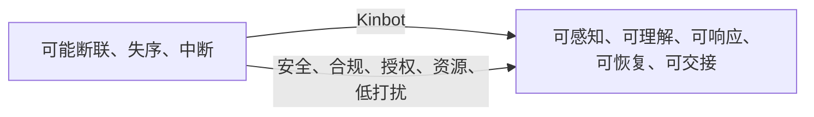
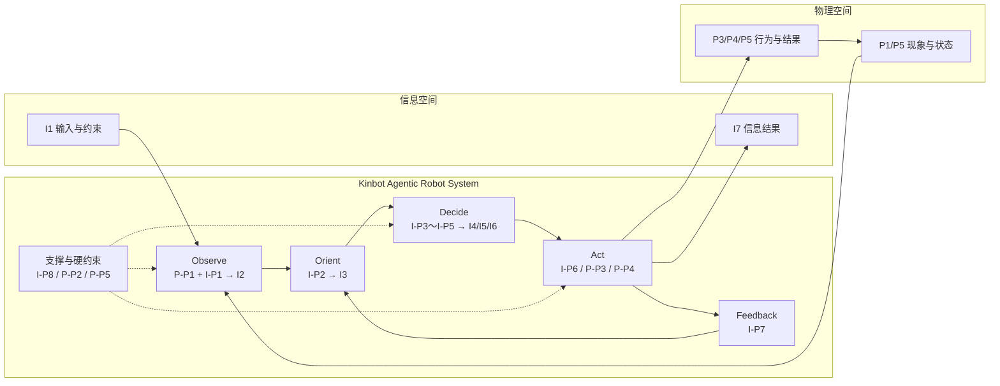
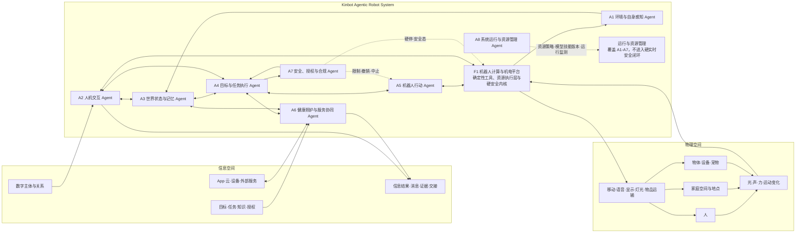
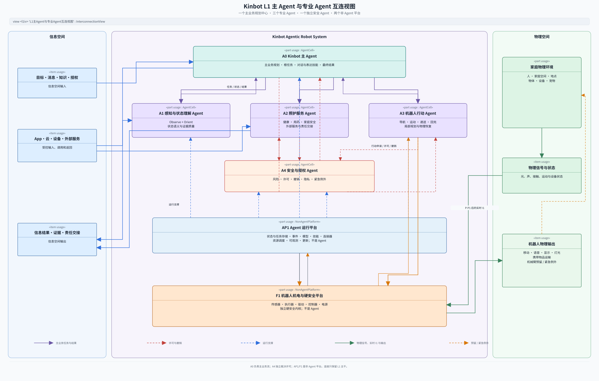
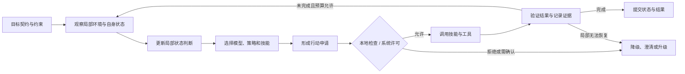
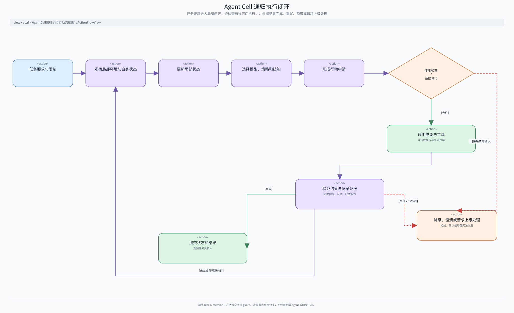
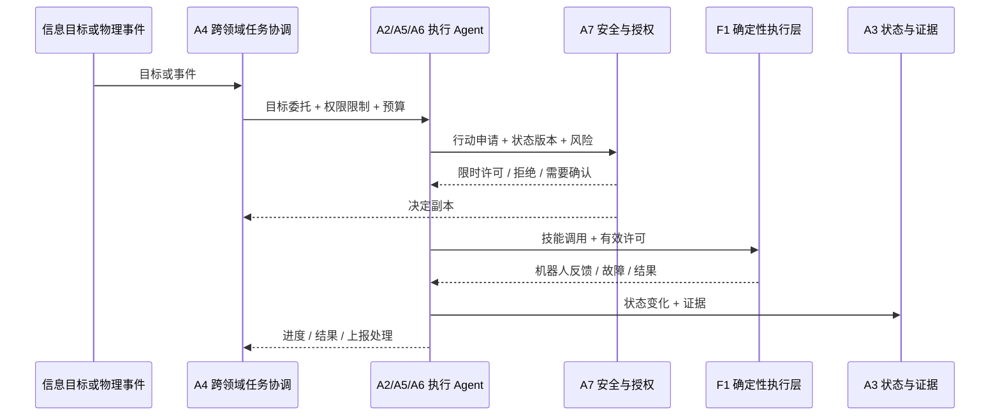
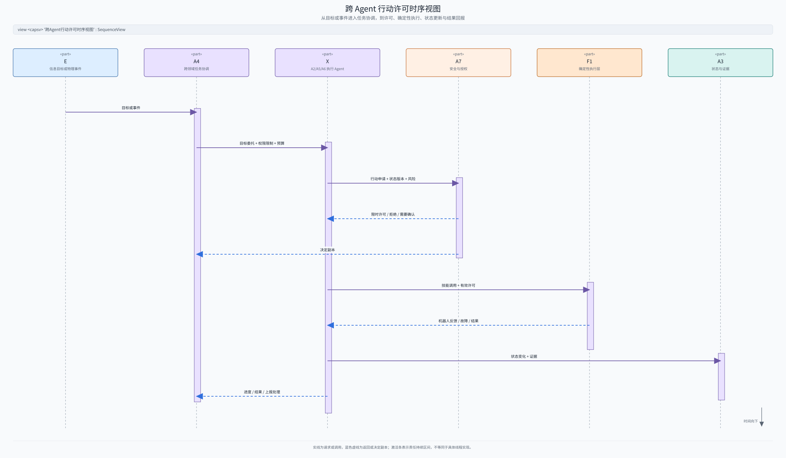

# Kinbot 递归式 Agentic 机器人系统架构

---

文档版本：v1.10
创建日期：2026-07-17
作者：Codex-架构师

文档变更记录：
- v1.10 | 2026-07-20 | Codex-架构师 | 为文档内 5 张 Mermaid 图逐一增加语义对应的 SysML v2 评审配图：顶层功能采用 `GeneralView` 需求与定义专题化，OODA 与 Agent Cell 闭环采用 `ActionFlowView`，L1 总图采用 `InterconnectionView`，行动许可采用 `SequenceView`；新增统一视图定义源和 SVG/PNG 图包。
- v1.9 | 2026-07-19 | Codex-架构师 | 将过程—操作数图改为带颜色的 SysML v2 `GeneralView` 专题化关系视图：每个操作数和过程只出现一次，以蓝色实线和橙色虚线分别表示 `in` 与 `out` 参数方向；模型源文件增加对应 `view def`。
- v1.8 | 2026-07-19 | Codex-架构师 | 将自定义“过程 / 操作数”图改为 SysML v2 `item def`、`action def` 与 `in / out` 参数图；增加可解析的 `.sysml` 模型源文件，删除重复且不规范的 Mermaid 图。
- v1.7 | 2026-07-19 | Codex-架构师 | 新增并嵌入一张可放大的 SysML v2 风格过程—操作数总图，同时提供 `3200×1800` PNG 版本用于评审和汇报。
- v1.6 | 2026-07-19 | Codex-架构师 | 增加两张 SysML 风格活动—对象流图，分别表示 8 个信息过程和 5 个物理过程与操作数的输入输出匹配；保留表格中的完成判据和候选责任。
- v1.5 | 2026-07-18 | Codex-架构师 | 全篇改用直接、可理解的架构用语；删除“视觉扎根、语义真值、能力包络、具身在场、Agent 社会”等生硬表述，统一实体名称，并为必须保留的接口标识补充中文含义。
- v1.4 | 2026-07-18 | Codex-架构师 | 明确 `Observation → Orient → State` 边界，将“理解”收进 Orient；删除与系统边界重复的对象清单，合并过程、操作数、完成判据与候选责任映射，并精简过程主链。
- v1.3 | 2026-07-18 | Codex-架构师 | 增加过程视角，将信息与物理操作数归为顶层操作数族；定义 8 个信息过程、5 个物理过程及其输入输出匹配，并以待评审方式映射到 `F1 + A1-A8` 候选责任范围。
- v1.2 | 2026-07-18 | 用户 | 修改
- v1.1 | 2026-07-17 | Codex-架构师 | 根据首次读者测试与架构审查，拆分已确认原则与待评审结构；补充系统边界、Agent 判定、标准接口、高层行动许可、独立硬安全通路、关键节点失效处理、能力责任矩阵、递归关系类型与资源隐私门槛。
- v1.0 | 2026-07-17 | Codex-架构师 | 基于《系统架构：复杂系统的产品设计与开发》的“系统形式与功能—实体—关系—涌现”方法，提出 Kinbot L1 递归式 Agentic 系统级概念架构候选。

---

## 1. 文档定位与迁移结论

> Kinbot 本身是一个连接信息空间与物理空间的超级 Agent；其中每个具有独立责任的软件子系统，也都是拥有局部目标、状态、模型、技能、安全约束和反馈闭环的 Agent。模型、技能、服务、驱动和控制器是 Agent 使用的构件，不是 Agent 本身。

本设计文档以概念的迅速推进为主，可以不必进行过多的仓库合规/收口等检查。

图示约定：Mermaid 用作便于快速修改的简图；每张 Mermaid 后紧跟一张语义对应的 SysML v2 评审配图，图头明确视图类型。5 张配图的视图定义集中在 [`16_mermaid_companion_view_definitions.sysml`](16_mermaid_companion_view_definitions.sysml)，并通过 SysML v2 Pilot Implementation `2026-05 / 0.60.1` 解析校验；SVG 用于文档阅读，PNG 用于汇报。颜色只帮助区分类别，语义由视图类型、模型元素、关系和方向决定。配图与 Mermaid 不一致时，应先修正模型语义，再同步两种表示。

## 2. 当前架构层级

本文定义五级架构层级，当前实质完成到 `L0-L1`：

| 层级           | 内容                                   | 当前状态                          |
| ------------ | ------------------------------------ | ----------------------------- |
| `L0 系统环境与使命` | 信息空间、物理空间、系统边界、利益相关者、顶层价值、过程与操作数     | 已建立；过程到 L1 的精确分配待 `KBT-59` 评审 |
| `L1 系统级概念架构` | 系统形式与功能、顶层实体、实体关系、递归 Agent 通用结构、期望涌现 | 第一轮候选基线，评审中                   |
| `L2 子系统架构`   | 对每个 L1 Agent 递归执行形式与功能、实体、关系、涌现      | 仅给出候选分解方向，尚未逐一完成              |
| `L3 模块与组件架构` | 模型、技能、进程、服务、状态机、硬件部件和接口字段            | 尚未按新架构重构                      |
| `L4 实现与部署架构` | 芯片映射、进程部署、通信技术、模型选型、资源预算和 BOM        | 尚未由本文冻结                       |


## 3. 第一步：确定系统及其形式与功能

### 3.1 目标系统

目标系统是：

> **Kinbot V1 Agentic Robot System**，即机器人整机及其端侧智能运行系统。

边界分为三层，避免把机器人目标系统、完整产品系统和运行环境混为一体：

| 边界层     | 包含内容                                                              | 与机器人目标系统的关系             |
| ------- | ----------------------------------------------------------------- | ----------------------- |
| 机器人目标系统 | 机器人计算与机电平台、端侧递归 Agent 运行系统、机器人侧受控连接器；`F1 + A1-A8` 是 `KBT-59` 候选分解 | 本文系统边界内                 |
| 完整产品系统  | 机器人目标系统、移动端App、云服务；后台与人工坐席仍按战略假设评估                                | 机器人之外的端点属于产品边界内、目标系统边界外 |
| 运行环境    | 人、家庭空间、物体、穿戴、智能家居、充电设施、家庭网络和第三方平台                                 | 系统外环境对象，只能通过受控接口形成输入与反馈 |

外部端点只能交换目标、上下文、服务结果、确认和经过授权的信息，不能绕过 A7 与 F1 直接控制机器人。机器人侧代理封装某个外部能力，不等于把该外部系统整体纳入机器人边界。

### 3.2 系统形式

Kinbot 同时具有物理形式和信息形式。

物理形式：

1. 家庭室内轮式移动、无机械臂的机器人。
2. 通过相机、麦克风、轮速、IMU、触觉和受控外设感知物理世界。
3. 通过移动、头部与机身姿态、语音、屏幕、灯光和储物舱作用于物理世界。
4. 当前有限采用纯视觉环境感知量产主线，深度相机和激光雷达只作为研发对比和测试参照；编码器、IMU、电流、温度、触觉、防夹和急停等确定性运动与安全传感可使用。

信息形式：

1. 运行在端侧的递归式 Agent 运行系统。
2. 通过自体状态、共享世界状态、长期记忆、模型和技能形成认知与行动闭环。
3. 通过 App、云服务、穿戴、家庭设备和服务连接器与信息空间交换受控信息。
4. 原始视觉、语音和生物特征默认在端侧处理，外部只获得经过授权且满足最小披露原则的结构化结果；端侧处理不等于允许任意 Agent 读取或长期保存。

### 3.3 Physical Agent 定义

> Physical Agent 是持续处于物理环境中、围绕目标运行的闭环行动系统。它通过 Observe 获取环境与自身的观测，通过 Orient（理解、融合、推断和判断当前情况）形成并维护世界、自身和任务状态；在规则、安全和资源限制下协调目标并作出决定，输出信息结果或调用机器人动作技能改变物理环境，再根据反馈持续修正状态、目标和行为。

\(\text{State}_t = \operatorname{Orient} (\text{Observation}_{0:t},\text{Memory},\text{Prior},\text{Context})\)

本文把大模型应用中常称的“理解”视为 Orient 的子过程，不再设置与 Orient 并列的 Understanding 阶段。

### 3.4 系统顶层功能

Kinbot 的顶层功能不是“执行若干功能列表”，而是：

> 在安全、合规、授权、资源和低打扰约束下，把老人家庭生活和家庭照护从可能断联、失序或中断的状态，持续转化并维持为可感知、可理解、可响应、可恢复、可交接的生活连续性。



对应 SysML v2 `GeneralView` 的需求与定义专题化配图：


该顶层功能通过四条价值闭环体现：

1. 健康与用药管理。
2. 陪伴交互。
3. 家庭安全保障。
4. 环境与物品管家。

`Agentic` 是所有功能的共同实现范式。

## 4. L0：两个空间中的过程与操作数

### 4.1 聚焦规则

1. **过程**用“动词 + 操作数”表达，必须有输入、输出和完成判据。
2. **操作数**是过程读取、转换或产生的内容；技能是过程的可调用封装，模型是实现手段。
3. 只有承担系统级转换或不可缺失支撑闭环的活动保留为顶层过程，其余下沉为子过程、技能或工具。
4. 对象已在系统边界和实体视图中表达，本节不重复列举。物理对象与其数字表征不是同一对象，只通过 `represents / refers_to` 关联。

### 4.2 信息空间操作数

| 编号   | 操作数族      | 典型内容                               |
| ---- | --------- | ---------------------------------- |
| `I1` | 输入与约束     | 数字化传感器输入、身份、关系、请求、配置、政策、外部数据与服务结果  |
| `I2` | 观察与事件     | 结构化观察、候选事件、时间、来源、置信度与是否过期          |
| `I3` | 状态与上下文    | 世界、自身、任务和关系状态，以及当前判断、记忆、知识、不确定性与证据 |
| `I4` | 目标与行动方案   | 意图、目标约定、任务、计划、行动申请、完成和取消条件         |
| `I5` | 安全与授权决定   | 许可、拒绝、限制、降级、撤销、有效期与风险限制            |
| `I6` | 能力调用与执行状态 | 技能 / 工具调用约定、参数、预算、进度、超时、取消和失败状态    |
| `I7` | 结果与信息输出   | 能力结果、失败证据、状态增量、消息、确认与责任交接          |
| `I8` | 运行资源与版本状态 | 限时资源配额、进程健康、模型 / 技能版本、运行记录、更新与回退状态 |

### 4.3 信息空间过程与操作数匹配

以下责任分配均为 `KBT-59` 的待评审（`provisional`）候选。

| 过程 | 操作数转换 | 完成判据 | 候选责任 |
| --- | --- | --- | --- |
| `I-P1 形成并校验观察` | `I1（传感 / 消息 / 事件输入） → I2` | 观察带时间、来源、置信度和是否过期信息，不冒充事实 | A1；交互观察由 A2；F1 提供物理来源 |
| `I-P2 Orient：理解、融合并维护状态` | `I1 + I2 + I7 + 先前 I3 → 新 I3` | 世界、自身、任务和关系状态可追溯、可修正，并保留不确定性 | A3；A1/A2/A5/A6 提交证据 |
| `I-P3 形成目标与行动方案` | `I1 + I3 → I4` | 明确责任、约束、预算及完成 / 取消条件 | A4 管跨领域根目标；A2/A5/A6 管领域内方案 |
| `I-P4 评估风险并授权行动` | `I1 + I3 + I4 → I5` | 对外部影响给出许可、拒绝、降级或确认要求，并可撤销 | A7；各 Agent 先做本地检查；F1 保持硬限制 |
| `I-P5 分派目标并组织能力调用` | `I4 + I5 + I8 → I6` | 能力调用不扩大权限、资源和期限，可监督和取消 | A4 管跨领域分派；执行 Agent 管领域内调用；A8 给出资源限制 |
| `I-P6 执行信息能力` | `I3 + I5 + I6 → I7` | 查询、消息、服务或交接返回结果或失败证据 | A2 管交互；A6 管领域与外部服务；A8 提供受控连接 |
| `I-P7 验证结果并维持连续性` | `I2 + I6 + I7 → I7（含状态变化 StateDelta）` | 对照完成判据，未完成项进入恢复、升级、取消或明确失败 | 执行 Agent 验证；A4 汇总并结束根任务；A3 接收证据增量 |
| `I-P8 管理运行资源与更新` | `资源政策 I1 + 资源需求 I6 + 当前 I8 → 新 I8` | 保底资源、隔离、版本、更新和回退可执行，不降低硬安全 | A8；OS/cgroup/watchdog/F1 确定性执行 |

`I3 State` 是 `I-P2 Orient` 的持续产物，不是处理节点。

### 4.4 物理空间操作数

| 编号   | 操作数族      | 典型内容                         |
| ---- | --------- | ---------------------------- |
| `P1` | 可感知物理现象   | 光、声、接触、振动、运动变化与安全传感信号        |
| `P2` | 能量与热状态    | 电能、机械能、声能、光能、温度和散热状态         |
| `P3` | 机器人行为与作用 | 移动、姿态、轮端力、语音、显示、灯光和舱门动作      |
| `P4` | 物质与载荷     | 由人装入、机器人运输、再由人取出的药品或物品       |
| `P5` | 物理状态变化与反馈 | 位置、姿态、接触、通路、载荷位置、环境变化和人的物理响应 |

人不是操作数；无臂 V1 不主动抓取物品。无线电信号本身归入 `P1/P2`，其中承载的信息归入 `I1/I7`。

### 4.5 物理空间过程与操作数匹配

| 过程 | 操作数转换 | 完成判据 | 候选责任 |
| --- | --- | --- | --- |
| `P-P1 感受并转换物理现象` | `P1 + P5 → 传感数据包（PhysicalSensorEnvelope，属于 I1）` | 完成采样、时间同步、标定和设备健康绑定 | F1 执行转换；A1 管主动感知目标 |
| `P-P2 接收、转换并分配能量` | `P2 + I8 → 受控 P2 + 电源 / 热状态` | 安全关键负载有确定性保底，功耗和热不越界 | F1 执行；A8 给资源策略 |
| `P-P3 执行机器人行为` | `I5 + I6 + P2 → P3 → P5` | 在许可和机电安全限制内产生移动或声光表达 | A5 管运动，A2 管表达，F1 确定性执行 |
| `P-P4 容纳、运输并交接载荷` | `I5 + I6 + P3 + P4 → P4 + P5` | 载荷位置可验证，装入和取出仍由人完成 | A5 管运输，A6 管交接规则与责任，F1 执行与防夹 |
| `P-P5 限制、中止并锁定危险行为` | `P1 + P2 + P3 + P5 → 受限 P3 + 安全态 P5 + 证据` | 不依赖 Agent、模型、总线和网络进入并保持安全状态，直到满足复位条件 | F1 独立硬安全；A1/A7 只能请求进一步收紧 |

### 4.6 SysML v2 过程—操作数关系视图

这是一张 `GeneralView` 专题化关系视图，不是 `ActionFlowView`：过程显示为 `action def`，操作数显示为 `item def`；连线由过程参数的方向和类型派生。每个过程和操作数只出现一次，蓝色实线表示 `in` 参数（操作数指向过程），橙色虚线表示 `out` 参数（过程指向操作数），有圆点才表示实际连接。


模型源文件为 [`16_process_operand_mapping.sysml`](16_process_operand_mapping.sysml)，其中已定义 `view def <porv> 过程—操作数关系视图 specializes GeneralView`，并通过 SysML v2 Pilot Implementation `2026-05 / 0.60.1` 解析校验；同目录提供 `16_sysmlv2_process_operand_relationship_view_v3.png` 用于汇报。连线不表示过程顺序或 `flow connection`；过程间关系应在下一步确认后另建 `ActionFlowView`。

### 4.7 OODA 与跨空间主链



对应 SysML v2 `ActionFlowView` 配图：


主链只有两种外部作用：`I-P6` 产生信息结果，`P-P3/P-P4` 产生物理结果；`I-P7` 负责验证，`I-P8/P-P2/P-P5` 提供资源和不可绕过的安全约束。

## 5. L1：递归式 Agentic Robot System 总图

### 5.1 左—中—右总图



对应 SysML v2 `InterconnectionView` 配图：



这张图表达三个判断：

1. Kinbot 是两个空间之间的认知与行动桥梁，不是数据搬运通道。
2. 模型分布在各 Agent 内部，技能也由各 Agent 按责任范围持有；不存在一个包办全部智能的中央大模型。
3. F1 机器人计算与机电平台不是 Agent。它承载机器人硬件、确定性资源执行、底层工具和最终硬安全保护。

总图只表达主干关系。A8 对 A1-A7 的资源作用、各执行 Agent 到 A7 的许可关系和 F1 内部硬安全通路分别在后文展开，避免一张图形成不可读的全连接线团。

### 5.2 九个顶层实体

本文提出以下九实体作为本轮 L1 评审基线；递归原则已经由用户确认，九实体的精确命名、边界和在线层级仍需通过本轮架构评审收口。

| 实体 | 形式 | 系统功能 | 职责边界 | 状态 |
| --- | --- | --- | --- | --- |
| `F1 机器人计算与机电平台` | SoC、RAM、Flash、统一时钟与网络接口；传感器、执行器、底盘、头身、音视频设备、储物舱、电源、确定性控制器与 MCU 安全内核 | 完成物理信号转换、物理动作、确定性资源隔离、能量供给和硬安全保护 | 不是 Agent；不理解业务目标，不自行扩大动作范围 | 待评审（`provisional`） |
| `A1 环境与自身感知 Agent` | 主动感知策略、感知模型、局部融合状态、补充采集与验证技能 | 降低当前目标相关的不确定性，生成可追溯的观察和事件 | 只决定需要什么证据并形成观察；头部或底盘运动交给 A5，不把局部观察直接当成系统事实 | 待评审（`provisional`） |
| `A2 人机交互 Agent` | 对话状态、会话和关系上下文、语言与多模态表达模型、交互技能 | 确认用户和机器人正在关注同一对象，澄清意图，并在合适时机以低打扰方式交流 | 负责交互过程和语音 / 屏幕表达，不负责长期关系事实、高风险动作和外部服务授权 | 待评审（`provisional`） |
| `A3 世界状态与记忆 Agent` | 七类业务对象、状态融合、判断维护、短期与长期记忆 | 维护可修正、版本化、带来源和置信度的系统共享状态 | 负责解决共享状态冲突，但不要求所有读写都同步经过一个进程，也不执行动作 | 待评审（`provisional`） |
| `A4 目标与任务执行 Agent` | 目标栈、任务图、计划、路由、监督、恢复和完成判据 | 管理跨领域根任务的完整生命周期，分派受约束目标并明确最终责任 | 是跨领域任务协调者，不是其他 L1 Agent 的结构父节点；领域内任务可在限时许可和预算内自主执行 | 待评审（`provisional`） |
| `A5 机器人行动 Agent` | 定位、导航、运动、主动观察、回充、储物递送等模型与技能 | 把已批准的高层目标转换成安全、可验证的物理行动 | 负责头部、底盘和舱门等运动申请与组织执行，不拥有业务目标，也不能扩大授权 | 待评审（`provisional`） |
| `A6 健康照护与服务协同 Agent` | 健康、用药、陪伴规则、安全巡护、家庭协同和外部连接器 | 把信息目标和外部服务转化为可闭环的照护结果 | 负责领域规则、领域目标和责任交接；不负责交互表达、物理执行和系统安全政策 | 待评审（`provisional`） |
| `A7 安全、授权与合规 Agent` | 身份、权限、政策、风险模型、许可、隐私、责任审计和事件响应 | 对会影响现实或外部系统的行动进行预授权、许可、拒绝、降级、撤销和责任归档 | 可以收紧但不能放松 F1 硬安全；不逐周期判断电机控制，也不替代任务和领域判断 | 待评审（`provisional`） |
| `A8 系统运行与资源管理 Agent` | 计算资源策略、进程、通信、模型与技能生命周期、脱敏运行监测和更新机制 | 保持系统可用，分配资源，管理模型和技能版本 | 不拥有业务目标和用户授权；固定配额与隔离由 OS、cgroup、watchdog 等执行层保持 | 待评审（`provisional`） |

候选九实体满足每层 `5～9` 个实体的约束；若 `KBT-59` 通过，其中只有 F1 是非 Agent 的机器人平台，八个软件责任范围采用 Agent 设计。实体数量限制本身不能证明这一划分正确。

## 6. 递归 Agent 单元

### 6.1 Agent 单元（Agent Cell）的七个必要构件

每个 L1/L2 软件责任范围若被定义为 Agent 子系统，就必须实现同一种最小递归结构：

```text
AgentCell =
    使命与目标约定
  + 边界与权限
  + 局部状态与记忆
  + 模型与策略
  + 技能与确定性工具
  + 执行、验证与恢复闭环
  + 安全、证据与升级接口
```

| 构件 | 必须回答的问题 |
| --- | --- |
| 使命与目标约定 | 为什么存在，当前追求什么结果，完成条件是什么 |
| 边界与权限 | 能观察什么、能改变什么、不能做什么、谁可撤销 |
| 局部状态与记忆 | 当前知道什么，哪些是事实、判断和未决假设 |
| 模型与策略 | 用什么方法理解、预测、规划或控制；不限定必须使用大模型 |
| 技能与确定性工具 | 能调用哪些有明确输入、前后条件和外部影响说明的能力 |
| 执行、验证与恢复闭环 | 如何行动、验证结果、处理失败、重试或回退 |
| 安全、证据与升级接口 | 如何继承规则、记录证据、说明原因并向父 Agent 升级 |

任何缺少目标、局部状态、替代技能选择、反馈验证或失败恢复的单元，都不是 Agent，只能称为模型、技能、服务、适配器、驱动、控制器或工具。

本节七个构件是 **任一 Agent 单元的必要条件**；第 7 节的五个条件回答“是否值得继续独立拆成子 Agent”。一个候选单元必须先满足五个独立性条件，再按七个构件完整实现；否则递归停止，它只能成为上级 Agent 的模型、技能、服务或确定性工具。

### 6.2 父子 Agent 的标准接口

父 Agent 向子 Agent 分派的是受约束目标，而不是遥控内部步骤：

```text
目标委托（GoalContract）
+ 上下文快照（ContextSnapshot）
+ 权限与限制（PolicyEnvelope）
+ 资源预算（ResourceBudget）
+ 完成条件（CompletionCriteria）
```

子 Agent 向父 Agent 返回：

```text
接受 / 拒绝 / 需要澄清
+ 状态变化（StateDelta）
+ 行动申请（ActionProposal）
+ 进度（Progress）
+ 执行结果 / 失败证据（CapabilityResult / FailureEvidence）
+ 上报处理（Escalation）
```

接口字段名保留英文，便于直接映射实现。所有跨 Agent 信息至少携带：

`agent_id + task_id + trace_id + schema_version + occurred_at + source + risk_level + authorization_scope`

根据契约类型还必须携带：

`parent_task_id + causation_id + idempotency_key + sequence + state_version + confidence + freshness + deadline + ttl + permit_expiry + revocation_epoch + lease_id + fencing_token + cancel_token + data_classification + purpose + retention_policy`

缺少版本、防重复、期限、撤销版本或数据用途限制的消息，不得触发不可逆的外部影响。

### 6.3 递归执行规则

每个 Agent 都运行自己的闭环，但不要求固定为串行 OODA 流水线：



对应 SysML v2 `ActionFlowView` 配图：



递归规则：

1. 结构父 Agent 分派目标、约束、预算和完成条件，不遥控子 Agent 的内部步骤。
2. 子 Agent 在允许范围内自主选择模型、技能、顺序和恢复方式。
3. 子 Agent 可以收紧继承的安全与隐私策略，不能自行放宽。
4. 涉及物理动作、外部服务、隐私或责任转移时，必须提交行动申请（`ActionProposal`）并取得有效许可。
5. 子 Agent 局部恢复失败或预算耗尽时必须升级，不能无限重试。
6. 父 Agent 保留任务责任，子 Agent 返回结果不等于父 Agent 自动完成目标。
7. 任务实例可动态创建，但不能动态创造新的权限范围、安全规则或未注册工具。

“父子递归”只描述结构上的包含关系，不等同于 L1 协作关系。Kinbot 超级 Agent 是系统边界和最终责任的概念容器，不是第十个运行进程；A1-A8 在结构上是同级 Agent。A4 负责跨领域目标分派，A7 负责安全与授权裁决，A8 负责资源分配；它们都不是其他 L1 Agent 的结构父节点。

### 6.4 Agent、模型、技能和工具的关系

| 概念 | 回答的问题 | 是否拥有目标 | 是否拥有状态和生命周期 | 是否会影响物理环境或外部系统 |
| --- | --- | --- | --- | --- |
| Agent | 为什么做、做什么、何时停止、失败后怎么办 | 是 | 是 | 会，但只能通过获得许可的技能产生影响 |
| 模型 | 如何理解、预测、生成或控制 | 否 | 只有模型版本和推理上下文 | 不能直接影响外部系统或物理环境 |
| 技能 | 能完成哪种定义清楚的动作 | 继承调用目标 | 有执行实例状态 | 可以，但必须说明影响并受许可约束 |
| 工具 / 驱动 / 控制器 | 如何确定性执行具体操作 | 否 | 通常只有运行状态 | 只能在技能许可和硬安全限制内产生影响 |

同一个底层模型服务可以被多个 Agent 复用；逻辑 Agent 数量不等于模型副本数、进程数或芯片数量。

## 7. L2 递归分解方向

下表给出每个 L1 Agent 可继续拆出的候选子 Agent。它们是下一轮设计的起点，不等于已经冻结的实现模块。

| L1 Agent | 5～9 个候选子 Agent |
| --- | --- |
| `A1 环境与自身感知` | 视觉感知与识别、声音与语言感知、人员与身份感知、空间与物体感知、人体与设备信号感知、机器人自身状态感知、主动补充采集与证据融合 |
| `A2 人机交互` | 共同关注对象、对话、澄清与修复、交流时机、关系上下文、多模态表达、低打扰交互策略 |
| `A3 世界状态与记忆` | 状态融合与事实维护、人员与关系状态、地点与物体状态、任务与事件状态、情景记忆、知识记忆、状态管理与遗忘 |
| `A4 目标与任务执行` | 目标接入、任务规划、Agent 路由、审批协调、执行监督、中断与恢复、完成判定与结果提交 |
| `A5 机器人行动` | 定位与重定位、场景导航、局部运动、在人群中的安全移动、主动观察、回充与能源行动、储物递送与物理验证 |
| `A6 健康照护与服务协同` | 健康管理、用药管理、陪伴服务、家庭安全、家庭责任协调、App / 云 / 人工 / 第三方服务连接 |
| `A7 安全、授权与合规` | 身份与访问、规则与风险、行动审批、运行安全监督、隐私与数据管理、审计与责任、事件响应与恢复 |
| `A8 系统运行与资源管理` | 计算资源、进程与可用性、通信与连接、模型生命周期、技能注册与版本、运行监测、更新与受控升级 |

下一层只有在满足以下条件时才继续定义为 Agent：

1. 有独立且可度量的局部目标。
2. 有持续状态或任务生命周期。
3. 有至少两种可选择的技能、策略或恢复路径。
4. 需要根据环境反馈自主调整行为。
5. 需要独立权限、预算、安全约束或责任边界。

不满足这些条件时，递归在该处停止，继续向下只分解为技能、模型、组件和工具。

## 8. 第三步：实体之间的关系

### 8.1 三个关系平面

顶层关系按三个平面组织，禁止形成自由的 Agent 全连接网络。

在三个平面中必须区分四种关系，不能都写成模糊的“父子”：

| 关系 | 含义 | L1 中的承担者 |
| --- | --- | --- |
| 结构包含（`containment_parent`） | 架构上的包含与递归归属 | Kinbot 超级 Agent 概念边界包含 A1-A8；各 L1 Agent 再包含自己的 L2 Agent 单元 |
| 目标分派（`goal_delegator`） | 针对一个目标分派任务，不代表结构隶属 | A4 负责跨领域根任务；任一 L1 Agent 可向其内部 L2 Agent 分派局部目标 |
| 安全与授权裁决（`policy_authority`） | 决定风险、权限、隐私和外部影响是否允许 | A7；F1 继续拥有不可放宽的硬安全边界 |
| 资源分配（`resource_authority`） | 分配资源预算并管理版本策略 | A8；固定配额、隔离和看门狗由 F1/OS 执行层保持 |

#### 共享状态平面

```text
A1 / A2 / A5 / A6
→ 观察 / 事件 / 结果
→ A3 世界状态与记忆
→ 世界状态快照 / 当前判断
→ A4 / A2 / A5 / A6 / A7
```

规则：

1. A3 负责维护系统共享状态和解决状态冲突，不是通用消息总线。
2. 各 Agent 保留局部工作状态，但不得另建一套不与 A3 校验的系统共享状态。
3. 观察（Observation）只是输入，当前判断（Belief）可以修正；两者都必须带来源、时间、有效性和置信度。

#### 目标与行动平面

```text
信息目标 / 物理事件
→ A4 形成目标委托（GoalContract）
→ 获得目标的 A2 / A5 / A6 或其子 Agent 提交行动申请（ActionProposal）
→ A7 按风险等级签发限时行动许可（PermitLease）、拒绝、降级或要求确认
→ A2 / A5 / A6 执行技能
→ 结果、失败与证据回到 A3 / A4
```

规则：

1. A4 是系统任务生命周期的总负责人，但不直接控制 F1。
2. A2、A5、A6 在自己的领域内具有局部 Agentic 自主性。
3. 外部 App、云、人工或第三方输入只能形成目标、上下文、服务结果或确认，不能形成底盘和执行器直控命令。
4. 实际要产生外部影响的 Agent 负责提交行动申请（`ActionProposal`）。A4 不代理所有动作；许可结果同时返回申请者并抄送根任务负责人。
5. A7 审批的是允许的高层行动范围，不审批每个电机、音频或像素周期。低风险、可逆动作可使用限时预授权；高风险、产生新外部影响或超出原许可范围的动作必须重新申请。

#### 安全与资源平面

```text
A7：身份、权限、风险、许可、撤销、审计和任务中止
A8：算力、内存、功耗、进程、通信、模型、技能、版本和运行监测
F1：电气、机械和 MCU 硬安全限制
```

规则：

1. A7 可中止任何 Agent 的高层动作，但不能关闭 F1 的硬安全保护。
2. A8 可降级模型、限制资源或重启进程，但不能通过资源调度降低安全优先级。
3. 高层运行时整体失效时，F1 仍必须进入可预测的安全态。
4. A7 的许可决定必须由确定性的规则执行组件校验签名、范围、到期时间和撤销版本（`revocation_epoch`）；A7 Agent 本身不是硬实时安全链的必要依赖。

### 8.2 关键关系、过程与操作数

| 关系 | 所属过程 | 主要操作数 | 关系功能 |
| --- | --- | --- | --- |
| `F1 → A1` | `P-P1 / I-P1` | 传感数据包（`PhysicalSensorEnvelope`）：帧、时间、标定、设备健康和自身状态，属于 `I1` | 把物理现象转换为带物理来源、可解释的输入 |
| `A1 → A3` | `I-P1 / I-P2` | 观察记录 / 候选事件（`ObservationEnvelope / EventCandidate`），属于 `I2` | 建立物理对象的数字记录和候选事件，保留证据与不确定性 |
| `A2 ↔ A3` | `I-P1 / I-P2 / I-P7` | 对话事件、关系上下文、确认、拒绝和修正，属于 `I2/I3/I7` | 保持人机共识与关系连续性 |
| `A3 ↔ A4` | `I-P2 / I-P3 / I-P7` | 世界状态快照 / 任务变化 / 当前判断（`WorldStateSnapshot / TaskDelta / Belief`），属于 `I3/I7` | 为目标判断、计划、任务推进和结果确认提供可信上下文 |
| `A4 ↔ A7` | `I-P3 / I-P4` | 任务风险信息 / 规则决定 / 任务许可（`TaskRiskContext / PolicyDecision / TaskPermit`），属于 `I4/I5` | 为跨领域根任务确定风险和允许范围 |
| `A2/A5/A6 ↔ A7` | `I-P4` | 行动申请 / 审批决定 / 限时行动许可（`ActionProposal / ApprovalDecision / PermitLease`），属于 `I4/I5` | 对实际外部影响进行风险分级、预授权、审批和撤销 |
| `A4 ↔ A2/A5/A6` | `I-P5 / I-P7` | 目标委托 / 进度 / 结果 / 上报处理（`GoalContract / Progress / Result / Escalation`），属于 `I4/I6/I7` | 分派受约束目标并汇总任务责任 |
| `A5 ↔ F1` | `P-P3 / P-P4 / I-P7` | 机器人行动指令 / 机器人反馈（`EmbodiedActionContract / BodyFeedback`），属于 `I6/P3/P5/I7` | 把已批准的高层动作和轨迹限制交给确定性执行层，并验证机器人响应 |
| `A2 ↔ F1` | `P-P3 / I-P7` | 交互表达指令 / 机器人反馈（`HMIExpressionContract / BodyFeedback`），属于 `I6/P3/P5/I7` | 执行已批准的语音、显示、灯光和非运动表达并反馈状态 |
| `A6 ↔ 信息空间` | `I-P6 / I-P7` | 查询、服务请求、消息、确认、结果和责任交接，属于 `I1/I7` | 完成信息服务与照护网络闭环 |
| `A7 → A5/F1` | `I-P4 / P-P5` | 限制、撤销、硬停和安全状态，属于 `I5/P5/I7` | 中止危险的高层行动或要求进一步限速、停机；F1 不依赖该关系维持硬安全 |
| `A8 ↔ A1-A7` | `I-P8 / P-P2` | 资源预算、运行状态、模型与技能版本、运行记录，属于 `I8` | 维持端侧 Agent 运行体系，固定规则由 OS/F1 执行 |

每条跨实体关系必须同时回答四个问题：承载哪个过程、传递哪个操作数、谁负责解释输入、谁对输出完成判据负责。只有连接而没有操作数转换的边，不得进入顶层功能关系图。

限时行动许可（`PermitLease`）至少包含：动作类型、作用对象、空间或数据范围、有效时段、风险等级、资源上限、停止条件、到期时间、撤销版本和签发证据。低风险表达、局部可逆调整可在有效许可内重复执行；靠近人体、舱门动作、隐私数据出端、联系外部服务和责任交接等动作，必须按风险策略取得新许可或明确确认。

标准许可过程如下：



对应 SysML v2 `SequenceView` 配图：



A4 自己若要取消外部操作、转移责任或产生其他外部影响，也必须作为申请者向 A7 申请许可；它不是许可链的例外。

### 8.3 物理通道责任矩阵

| 能力通道 | 目标 / 证据请求者 | 状态负责人 | 行动申请负责人 | 许可 / 规则 | 确定性执行 | 资源策略 |
| --- | --- | --- | --- | --- | --- | --- |
| 底盘移动与靠近 | A4/A5/A6；A1 只提出补充采集需要 | A3 + A5 局部状态 | A5 | A7 行动许可 + F1 硬安全限制 | F1 底盘控制器 | A8，固定限额由 OS/F1 保持 |
| 头部注视与主动观察 | A1/A2 提出证据或共同关注目标 | A3 + A5 局部状态 | A5 | A7 行动许可 + F1 机械限位 | F1 头部控制器 | A8 |
| 语音、屏幕与灯光 | A2；A4/A6 提供内容目标 | A3 + A2 会话状态 | A2 | A7 负责内容、隐私和打扰策略 | F1 HMI 驱动 | A8 |
| 储物舱与物品运输 | A6/A4 提供照护目标 | A3 + A5 任务状态 | A5 | A7 + F1 防夹 | F1 舱门/底盘控制器 | A8 |
| 外部网络与服务调用 | A6；A2/A4 提供受约束目标 | A3 + A6 服务状态 | A6 | A7 负责用途、身份和数据许可 | A8 管理的确定性连接器与凭据服务 | A8 |
| 急停、限速与故障保护 | F1 安全传感；A1/A7 可额外请求收紧 | F1 安全状态，摘要回写 A3 | 不需要 Agent 申请 | F1 不可放宽；A7 只能进一步收紧 | F1 安全 MCU/控制器 | 固定保留，不受 A8 优化降级 |

该矩阵解决重叠边界：A1 决定“需要什么证据”，A5 负责物理运动申请；A2 负责交互表达，A6 负责领域目标与责任交接；A7 管规则、许可和责任审计，A8 只保留脱敏运行记录、资源策略和软硬件版本生命周期。

### 8.4 独立硬安全通路、实时旁路与禁止旁路

F1 内部必须存在一条不依赖任何 Agent 进程、模型、消息总线或网络的确定性硬安全通路：

```text
安全传感 / 看门狗
→ 安全 MCU 或确定性控制器
→ 执行器限速、限力、断扭矩、制动、反向释放或安全停机
→ 保持安全状态，直到满足复位条件
→ 异步向 A3/A7/A8 报告证据
```

| 安全事件族 | F1 直接输入 | F1 确定性动作 | 失联默认态 | 复位原则 |
| --- | --- | --- | --- | --- |
| 碰撞、悬崖与失稳 | 触边/触觉、编码器、IMU、专用安全检测 | 限速、制动、断扭矩或安全停机 | 停止运动 | 危险解除、状态稳定并满足本地复位条件 |
| 电机过流、过温与失控 | 电流、温度、驱动器故障、速度偏差 | 限功率、禁用故障执行器或整机安全停机 | 禁止继续驱动 | 故障消除并完成自检；必要时人工复位 |
| 舱门夹手 | 防夹触觉、电流和位置状态 | 立即停止并按安全策略反向释放 | 禁止闭合 | 障碍解除且舱门状态重新确认 |
| 急停与高层心跳丢失 | 急停输入、安全看门狗、控制心跳 | 保持急停或进入确定性安全态 | 保持安全态 | 禁止普通任务自动解除；按风险要求本地或人工复位 |

最坏反应时间、故障独立性、检测覆盖率和具体复位条件属于 P2/FMEA/Phase 5 必须量化的硬门槛，目前尚未验证（`Unknown / not verified`），不能因本文声明而视为已满足。

允许的实时旁路：

1. A1 或 A7 可额外向 F1 提出“进一步收紧、限速或停止”的请求，但它们不是维持硬安全的必要依赖。
2. A1 可把低时延局部观察直接送入 A5，用于局部行动修正；A5 仍只能在 F1 硬安全限制内执行。
3. 实时旁路不能另建一套长期共享状态；结果和证据仍必须异步回写 A3。

禁止的旁路：

1. A4 不能直接控制 F1。
2. A6 和任何外部系统不能直接控制 A5 或 F1。
3. 模型输出不能直接成为执行器命令。
4. A3 不能自行发起行动或做最终审批。
5. 子 Agent 不能扩大父 Agent 下发的权限、风险限制或资源范围。
6. A8 不能因资源紧张关闭硬安全和必要审计。
7. A7 可中止高层任务，F1 可独立中止物理执行；两者职责不可互相替代。

### 8.5 并发、取消与外部影响一致性

1. 跨 Agent 不持有分布式锁等待许可或资源；默认顺序为 `带版本的状态快照 → 目标和计划 → 限时行动许可（PermitLease） → 限时资源配额（ResourceLease） → 实际执行`。
2. A7 不同步等待 A4 重新确认才完成撤销；状态不够新时按风险选择拒绝、降级或要求确认，不能形成 A4—A7—A3 环形等待。
3. 取消通过 `cancel_token` 从根任务向下传播；子 Agent 必须返回“未开始 / 已停止 / 不可撤销的外部影响已经发生”之一，A4 再汇总并结束根任务。
4. 外部影响通过防重复键（`idempotency_key`）和旧执行者隔离标记（`fencing_token`）保证业务效果只发生一次；迟到、重复、旧版本和旧许可消息必须被拒绝或去重。
5. 安全中止后默认锁定任务，设置等待、冷却和复位条件；A4 不得无条件自动重试同一动作。
6. A8 降级资源时必须限制新的主动补充采集，避免 A1 置信度下降—采集增加—资源进一步紧张的恶性循环。
7. A1 的补充采集目标与 A5 的主动观察共用一个 `observation_goal_id` 和限时行动许可，避免头部与底盘互相触发形成振荡。

### 8.6 端到端实例：来我身边提醒喝水

```text
老人说“十分钟后来客厅提醒我喝水”
→ F1 通过 P-P1 把声音转换为带时间戳的 I1 音频输入
→ A1/A2 通过 I-P1 形成 I2 语音、主体和意图事件；不确定时由 A2 澄清
→ A3 通过 I-P2 形成带来源、有效期和置信度的 I3 提醒状态
→ A4 通过 I-P3 在到期时形成 I4“到人并提醒”跨领域目标，通过 I-P5 下发受约束的目标委托（GoalContract）
→ A5 提交 I4 靠近与停靠行动申请（ActionProposal），A7 通过 I-P4 签发 I5 限时、限速、限距的行动许可（PermitLease）
→ A5/F1 通过 P-P3 在 P-P5 独立碰撞与失稳保护下执行移动，形成 P3/P5
→ A2 通过 P-P3 执行语音/屏幕提醒；A6 只在需要家庭照护交接时通过 I-P6 介入
→ F1/A2/A5 返回 I2/I7，实际执行 Agent 通过 I-P7 验证结果，A3 通过 I-P2 更新状态，A4 判断完成、失败或升级
```

这个实例说明：物理信号、观察、状态、目标、许可、技能、执行和结果各有清楚的含义边界；A7 不审批每个轮速周期，F1 也不理解“提醒喝水”的业务目标。

## 9. 多时间尺度运行

递归 Agentic 不等于所有闭环都由大模型慢速推理。运行时按风险和时标选择不同实现：

| 时间尺度 | 主要承载 | Agentic 方式 | 确定性边界 |
| --- | --- | --- | --- |
| 微秒到数十毫秒 | F1 | 不使用 Agent 推理 | 急停、碰撞/失稳保护、防夹、底层伺服、看门狗和故障保护独立确定性成立 |
| 数十到数百毫秒 | F1、A1、A5 | 快速局部策略和动作修正，但不构成硬安全前提 | F1 持续校验轨迹、速度、力和安全状态，Agent 超时即收紧或停机 |
| 百毫秒到数秒 | A1、A2、A5、A8 | 主动补充采集、交互修复、局部导航、资源策略和执行恢复 | 模型超时、置信度不足或传感失效时有明确降级 |
| 数秒到数分钟 | A2、A4、A5、A6、A7 | 目标分解、任务协作、审批、服务协调和中断恢复 | 每个会影响现实或外部系统的行动都有许可、预算和完成判据 |
| 分钟到天 | A3、A6、A7、A8 | 长期记忆、关系策略、提醒优化、模型与技能更新 | 长期推断不能未经重新验证直接触发即时高风险动作 |

每个 Agent 可以组合离散决策、连续策略、事件驱动和长周期调整，但必须遵守自身权限和系统规则。OODA 可以作为每个 Agent 的局部认知方法，不再固定对应某几个模块。

## 10. 第四步：涌现

涌现不是第十个顶层实体，而是实体和关系闭环运行后，在系统边界出现的整体能力和性质。

### 10.1 七个期望涌现

| 编号 | 期望涌现 | 形成机制 | 边界可观察结果 | 负向涌现 |
| --- | --- | --- | --- | --- |
| `M1` | 物理对象与数字状态一致 | 物理对象、观察、数字记录和再次验证闭环 | 知道数字记录对应哪个人、地点或物体 | 身份混淆、状态过期、把推断当事实 |
| `M2` | 连续情境理解 | 多模态观察、世界状态、时间和长期记忆 | 知道谁、在哪里、发生了什么、发生了什么变化以及自己有多确定 | 上下文丢失、时间混乱和虚假确定性 |
| `M3` | 受约束自主闭环 | 目标、计划、Agent 分派、许可、技能和反馈 | 能围绕目标连续行动，并在必要时询问、停止、降级或恢复 | 目标漂移、循环、越权和不可解释行动 |
| `M4` | 可组合、可恢复的能力 | 标准 Agent 接口、技能接口、失败证据和重新规划 | 能组合既有能力完成新任务，并从局部失败恢复 | Agent 互相等待、连锁失败和重试风暴 |
| `M5` | 温暖、低打扰的陪伴感 | 人体感知、关系记忆、时机判断、移动和多模态表达 | 在合适时间、地点和距离，以合适方式接近和交流 | 打扰、监视感、冒犯和诡异感 |
| `M6` | 人—机—服务照护协同 | 物理事件、数字信息、任务责任、确认和交接 | 机器人、家庭、App、坐席和服务方完成有确认的责任转移 | 责任悬空、重复通知、错误升级和无人闭环 |
| `M7` | 家庭生活与照护连续性 | M1～M6 共同运行 | 健康、陪伴、安全和照护事件可被发现、响应、恢复和交接 | 事件碎片化、静默失败、关系与尊严损伤 |

### 10.2 产品感涌现

1. **聪明**：来自 M1～M4，不来自单一大模型。
2. **温暖**：来自 M5，不等于情感化 TTS。
3. **精致**：来自 M4 与 M5，表现为连贯、克制、及时和可恢复。
4. **可信**：来自 M1、M3 与 M6，表现为不伪造现实、不越权、责任有证据。

### 10.3 必须专门防止负向涌现

每个场景除验证正常成功外，还必须验证：

1. 物理状态过期叠加模型自信，是否产生“确信但错误”的行动。
2. 多 Agent 局部目标冲突时，是否产生振荡、循环或互相等待。
3. 任务恢复叠加安全中止时，是否产生停止—重试风暴。
4. 长期记忆叠加主动行为时，是否产生监视感和隐私侵犯。
5. 多角色授权冲突时，是否产生责任混乱或家庭关系伤害。
6. 端云状态不一致时，是否出现旧配置、旧许可和迟到结果污染当前任务。
7. 资源降级时，是否保住安全、基本交互和可解释失败。

## 11. 安全、状态、资源与部署的硬规则

### 11.1 三层安全与授权

1. **Agent 本地检查**：每个 Agent 对输入、模型置信度、技能前后条件和局部风险做第一层检查。
2. **A7 系统安全与授权**：对跨领域外部影响、高风险行动、隐私、远程控制和责任转移统一许可、拒绝、降级或撤销。
3. **F1 硬安全内核**：在高层 Agent 失效、延迟或冲突时保持急停、限速、碰撞和夹手等确定性保护。

任何 Agentic 设计都不能把第 3 层改成概率性承诺。

### 11.2 两级状态

1. 每个 Agent 拥有局部工作状态和局部记忆，用于自己的闭环。
2. A3 维护跨 Agent 共享、带版本的系统状态。
3. 局部状态写入共享状态必须提交状态变化和证据（`StateDelta + Evidence`），不能直接覆盖。
4. 实时安全状态可以旁路 A3，但必须异步留下证据。
5. 七类 `Person / CareRelationship / Household / Place / Object / Task / CareEvent` 继续是业务状态对象，不等于七个 Agent。

### 11.3 四个最终负责人不是四个同步单点

A3/A4/A7/A8 分别对一类关键问题负最终责任，但不代表每次读写、任务推进、许可检查和资源执行都同步经过一个 Agent 进程。

| 最终负责人 | 分布式执行方式 | 不可用时最小模式 | 恢复规则 |
| --- | --- | --- | --- |
| A3 系统共享状态 | 每个实体或字段只有一个写入负责人；使用带版本快照、本地只读缓存和异步状态变化（`StateDelta`） | 只使用未过期缓存；禁止基于陈旧状态启动新的高风险任务；变化进入本地有界队列 | 按 `state_version + causation_id` 对账，冲突不静默覆盖 |
| A4 跨领域根任务 | 只汇总根任务和跨领域责任；领域内任务在限时许可和预算内自主执行 | 不接收新跨领域目标；已有低风险领域内任务安全完成或按截止时间停止 | 从任务事件日志恢复，使用旧执行者隔离标记（`fencing_token`）排除旧负责人 |
| A7 安全与授权 | 按风险分级、提供限时预授权，并由本地确定性规则组件执行 | 有效的低风险许可可继续；新高风险、数据出端和责任转移默认拒绝 | 更新撤销版本（`revocation_epoch`），旧限时行动许可（`PermitLease`）自动失效 |
| A8 资源策略 | A8 做预测、优化和版本策略；OS/cgroup/watchdog 执行固定隔离与保底配额 | 保留安全、基础运动、感知、交互和审计；停止新模型/技能切换 | 依据签名清单恢复，不自动回放过期资源决策 |

### 11.4 资源硬规则

1. 逻辑 Agent 不要求独占模型、进程或算力。
2. A8 统一制定共享模型服务、上下文预算、推理队列、内存、存储、功耗和热策略；固定保底配额与故障隔离不能只存在于 A8 的 Agent 决策中。
3. 资源不足时优先保安全、运动、基础感知、基础交互和状态证据，再降级高成本推理与云增强。
4. 断网不能损伤运动安全和端侧基本闭环。
5. 当前默认量产资源线继续是 `12GB RAM + 32GB Flash`，递归架构必须在该约束下证明成立。

当前“兼容 `12GB + 32GB`”的状态为尚未验证（`Unknown / not verified`）。进入冻结前必须给出最坏并发场景下的常驻 RAM、NPU/GPU、Flash 分区与寿命、模型共享池、上下文上限、日志和记忆配额、带宽、启动时间、功耗、热、压缩/淘汰及双分区回滚预算；“逻辑 Agent 可共享进程和模型”只是控制复杂度的方法，不是资源证明。

### 11.5 数据与隐私硬规则

1. 数据契约必须携带分类、用途、最小披露范围、持久化许可、保留期限、删除要求和审计脱敏策略。
2. 原始音视频和生物特征默认不得写入 A3 长期记忆，不得进入 A8 普通运行记录；确有场景需要时必须有单独用途、短期保留和可撤销许可。
3. 静态数据必须加密，密钥由独立可信凭据层持有；各 Agent 只获得任务所需的最小读取能力，不能因同处端侧而默认互相可见。
4. 外部结果必须携带来源、信任等级、时效和防重放信息，未经隔离与验证不能直接改变高风险状态或许可。
5. 模型和技能更新必须签名、版本固定、反回滚并具备已验证回退；A8 不能凭远端指令直接切换未受信任能力。

上述隐私、加密和删除机制同样尚未验证（`Unknown / not verified`），必须在 P2 和 Phase 5 形成证据。

### 11.6 端云与外部系统

1. A1、A3、A5、A7 的安全关键能力必须端侧成立。
2. A2、A4、A6 需要具备端侧最小闭环，云端只能增强语言、知识和服务能力。
3. 外部系统通过 A6 的领域连接器进入，底层网络、会话和凭据由 A8 提供，业务许可由 A7 决定。
4. App、云、坐席和第三方平台都是外部信息对象，不自动成为机器人内部 Agent。
5. 只有当外部能力被机器人侧代理封装为具备目标、状态、权限、恢复和证据的 Agent 单元时，才进入递归 Agent 关系。

## 12. 从旧架构到递归 Agent 架构的迁移

### 12.1 旧九模块映射

| 旧一级模块 | 新架构承接 | 迁移变化 |
| --- | --- | --- |
| `platform_runtime` | A8 + F1 确定性运行底座 | 从被动平台模块升级为资源与运行目标驱动的 Agent；驱动和 OS 仍是工具 |
| `mobility_navigation` | A5 | 从“接受导航目标的模块”升级为具有局部目标、主动观察、恢复和验证能力的机器人行动 Agent |
| `human_health_sensing` | A1 + A6 | 观察与信号解释归 A1；健康意义、任务和照护责任归 A6 |
| `multimodal_interaction` | A2 | 从表现层升级为能确认共同关注对象、澄清意图、维护关系并减少打扰的人机交互 Agent |
| `world_state_memory` | A3 | 从统一存储模块升级为主动维护状态一致性、冲突和遗忘的世界状态与记忆 Agent |
| `decision_orchestration` | A4 | 从中央编排模块升级为超级 Agent 的目标与任务总负责人，但不垄断所有局部决策 |
| `safety_compliance_authorization` | A7 + F1 硬安全 | 高层安全与授权 Agent 和确定性硬安全内核分离，形成可解释许可和不可绕过保护 |
| `companion_service_system` | A2 + A6 | 陪伴与关系归 A2，App / 云 / 人工 / 服务协同归 A6 |
| `observability_data_governance` | A7 + A8 | 隐私、审计和责任归 A7；运行记录、模型与技能版本归 A8 |

### 12.2 旧 Agent 增强平面的变化

旧架构把长期记忆、技能、连接器和受控任务协调视为跨模块增强能力。新架构中：

1. 长期记忆是 A3 的自身能力，也是各 Agent 的局部构件。
2. 技能是每个 Agent 的必要组成，统一注册和版本由 A8 管理。
3. 连接器是 A6 的领域能力，底层通信与凭据由 A8 承载，授权由 A7 决定。
4. 任务组织与协调是 A4 的系统责任，同时每个子 Agent 都有自己的局部计划和恢复闭环。
5. Agentic 不再是外挂能力，而是软件运行系统的默认结构。

### 12.3 迁移顺序

1. 以本文作为顶层概念架构的首要评审入口，旧文档停止新增与递归 Agentic 原则冲突的模块级结论。
2. 在 `KBT-59` 中先评审 `F1 + A1-A8`、Agent 单元接口、状态责任、许可继承和接口版本规则；通过后再升级为冻结基线，并由 `KBT-33` 承接接口稳定性管理。
3. `KBT-60` 在 `KBT-59` 通过后，将总体方案与现有 `S1-S7` 工作包映射为获批 L1 责任范围及其交付物，而不是立刻重写所有实现。
4. 优先递归展开 A4、A5、A7、A3 四个高风险子系统，再展开 A1、A2、A6、A8。
5. 将找物、用药、到人交互、健康异常和回充作为跨 Agent 场景验证，不为单一场景新增顶层 Agent。
6. 在 Phase 5 用功能、负向涌现、资源、安全和授权证据，决定哪些 Agent 子层进入 V1 常驻运行系统。

## 13. 验证与阶段门

### 13.1 是否应当定义为 Agent

每个拟定义为 Agent 的软件运行子系统进入架构评审时，必须回答：

1. 使命、局部目标和完成条件是什么？
2. 它拥有哪些状态和记忆，哪些状态必须提交 A3？
3. 它使用哪些模型和策略，何时拒绝模型输出？
4. 它拥有哪些技能和确定性工具，会对物理环境或外部系统产生什么影响？
5. 它如何验证结果、处理失败和恢复？
6. 它继承哪些权限、风险限制和资源范围，谁能撤销？
7. 它向父 Agent 和审计链返回什么证据？

无法完整回答时，该单元不得定义为 Agent 子系统。

### 13.2 系统级验证

| 验证面 | 必须证明 |
| --- | --- |
| 过程—操作数一致性 | 每个顶层过程都有明确输入、输出和完成判据；每个关键操作数都有生产者、消费者和含义负责人，且信息 / 物理转换不重复维护系统事实 |
| 物理对象与数字状态对应 | 数字对象与物理对象的关联可追溯、可修正，不把过期记录当成当前事实 |
| 目标闭环 | 从目标分派到结果提交有单一责任链和明确完成判据 |
| 局部自主 | 子 Agent 能在允许范围内自主选择技能并从局部失败恢复 |
| 安全与授权 | 每个会影响现实或外部系统的行动都有许可，撤销、超时和中止能生效 |
| 独立硬安全 | A1/A5/A7/消息总线/网络全部失效时，F1 仍在最坏反应时间内进入安全态 |
| 关键负责人失效处理 | A3/A4/A7/A8 分别崩溃、重启、分区和回放时，系统按定义降级且不会误执行 |
| 多 Agent 一致性 | 迟到事件、旧版本和局部状态不会覆盖当前任务的有效状态 |
| 负向涌现 | 冲突、断网、模型失败、传感退化和资源压力不会形成失控整体行为 |
| 产品感 | 用户感受到聪明、温暖、精致和可信，而不是内部 Agent 数量 |
| 资源 | 在 `12GB RAM + 32GB Flash` 及目标 SoC、功耗、热约束下完成最坏并发与 24 小时持续运行 |
| 隐私与供应链 | 原始敏感数据不进入长期记忆或普通运行记录，删除、加密、最小权限、签名更新和回退可验证 |

### 13.3 当前评审边界

用户已经明确确认：

1. 系统采用递归式 Agentic 设计。
2. 每个具有独立使命和责任边界的 L1/L2 软件运行子系统必须采用 Agent 设计；普通技术组件不为命名而 Agent 化。

本文提出并进入本轮评审：

1. 顶层采用 `I1`～`I8`、`P1`～`P5` 操作数族，以及 `I-P1`～`I-P8`、`P-P1`～`P-P5` 过程及其输入输出匹配。
2. 顶层采用 `F1 + A1-A8` 九实体结构，并按第 4 章把过程候选分配到这些责任范围。
3. Agent 单元采用七个必要构件，并以五项独立性条件决定是否继续拆成子 Agent。
4. 驱动、协议栈、数据库、模型服务、策略执行器、控制器和硬安全内核作为 Agent 的确定性构件，不强行 Agent 化。
5. 在线 Agent 调用链默认不超过三层。
6. A3、A4、A7、A8 分别负责系统共享状态、跨领域根任务、高层行动许可和资源策略，并通过缓存、限时许可、确定性执行组件和明确的失效模式避免成为同步单点。

当前架构审查结论为 `B / 修改后再审`：递归方向可继续，具体结构尚未冻结。本文截至 v1.7 已补齐概念级修订，但以下证据完成前不能把候选基线升级为“已确认”：

1. F1 安全状态、触发源、最坏反应时间、故障独立性和复位条件。
2. A3/A4/A7/A8 崩溃、重启、分区与状态恢复测试。
3. 找物、到人、用药和回充场景中的竞争、取消、撤销、重复消息和迟到结果时序。
4. `12GB + 32GB` 最坏并发资源剖面与 24 小时持续运行。
5. 敏感数据最小披露、加密、删除、日志脱敏、签名更新和反回滚证据。

本轮待评审内容由 `KBT-59` 承接，当前状态为评审中（`In Review`）；`KBT-58` 的顶层映射和 `KBT-60` 的 P2 重映射均被它阻塞，不再用旧模块或新候选映射反向冻结顶层架构。

后续仍需通过架构评审和实际测试确定：

1. A1-A8 的精确接口字段、版本和团队负责人。
2. 哪些 L2 候选真正独立成常驻 Agent，哪些应降为技能或工具。
3. 在线 Agent 调用层级、上下文和资源预算的量化上限。
4. 第 8.5 节并行、安全中止、防重复和任务恢复规则的字段级协议与故障注入证据。
5. 找物 `KBT-58` 在新主线下的角色、契约和验证映射。

## 14. 候选架构复杂度自检与待评审 V1 限制

现在的架构是不是太复杂了？

结论：递归式 Agent 架构比旧中央编排链复杂，但这是为了让每个软件责任范围拥有真实闭环，而不是增加更多模型和进程。以下是 `KBT-59` 候选限制，不是已冻结实现；只有评审接受并持续执行，复杂度才可接受：

1. 每个层级保持 `5～9` 个 Agent 或实体。
2. 在线 Agent 调用链默认不超过“系统超级 Agent → L1 子系统 Agent → L2 任务 / 能力 Agent”三层；更深设计优先改成技能和工具。
3. 不允许自由的多 Agent 全连接协商，默认采用父子目标分派、共享状态和明确的事件接口。
4. Agent 是逻辑责任单元，不默认对应独立进程、模型副本、数据库或团队。
5. 动态创建的是受控任务实例，不是新的权限域和自治组织。
6. A3、A4、A7、A8 分别负责解决共享状态冲突、跨领域根任务、高层行动许可和资源策略冲突；通过缓存、限时许可、分区和确定性执行层避免变成四个同步单点。
7. 确定性叶子工具和 F1 硬安全内核必须保留，不能为追求“全部 Agentic”而概率化。
8. 每增加一个 Agent，都必须证明其独立目标、状态、策略选择、恢复和责任边界带来的价值，高于通信、延迟、测试和资源成本。
9. 每增加一个顶层过程或操作数族，都必须证明它承担新的系统级转换或不可缺失的支撑闭环；否则下沉为子过程、契约字段、技能或工具。

这套架构的成功标准不是“系统里有多少 Agent”，而是用户只看到一个行为连贯、长期可信的 Kinbot。

## 15. 关联文档

1. [01_overall_architecture.md](01_overall_architecture.md)：上一轮双视角总体架构与硬件边界参考。
2. [03_execution_paradigms_runtime_baseline.md](03_execution_paradigms_runtime_baseline.md)：多时间尺度执行范式参考。
3. [04_module_layers_and_boundaries.md](04_module_layers_and_boundaries.md)：旧九模块责任与迁移映射来源。
4. [05_world_state_schema.md](05_world_state_schema.md)：七类业务状态对象与事实 / 判断分层。
5. [07_safety_compliance_authorization_api.md](07_safety_compliance_authorization_api.md)：动作审批和授权接口定义。
6. [15_agentic_object_finding_system_architecture.md](15_agentic_object_finding_system_architecture.md)：找物功能级 Agentic 验证输入，当前由 `KBT-58` 评审。
7. [../03_p2_feasibility/01_overall_solution_and_module_design_baseline.md](../03_p2_feasibility/01_overall_solution_and_module_design_baseline.md)：当前总体方案与模块工作包下发入口，待按本文迁移。
8. [../05_p4_beta_dvt/01_mvp_validation_plan.md](../05_p4_beta_dvt/01_mvp_validation_plan.md)：Phase 5 场景与证据验证入口。
