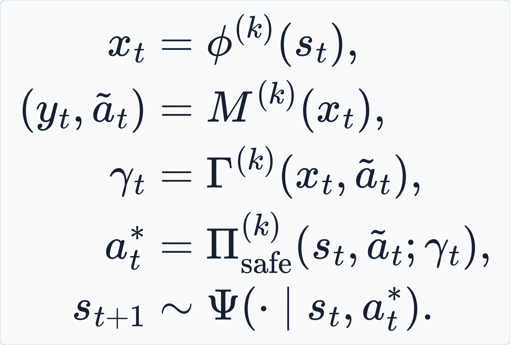
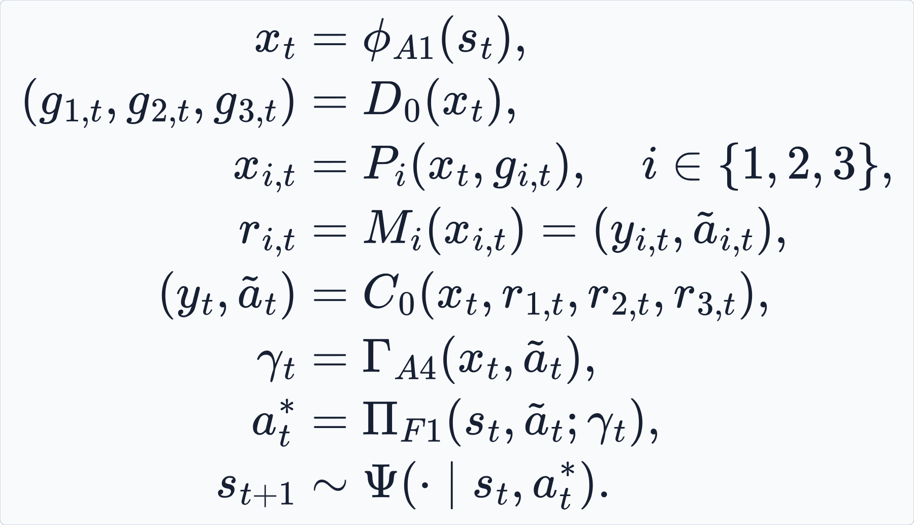
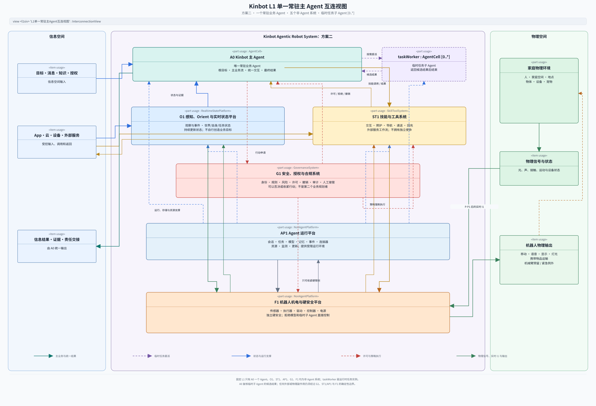
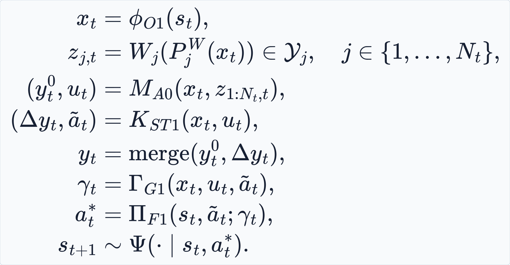

# 《Kinbot 递归式 Agentic 机器人系统架构》版本记录

---

对应正文：[16_recursive_agentic_robot_system_architecture.md](16_recursive_agentic_robot_system_architecture.md)

创建日期：2026-07-17
责任角色：Codex-架构师

- v1.35 | 2026-07-26 | Codex-架构师 | 用户通过 L1 最终评审并冻结当前基线；将 9.1 节未定义且与历史 Module 编号冲突的 `M1～M7` 改为 Emergence 对应的 `E1～E7`。端到端紧急场景补齐找物任务经 G3、F1 进入实际移动的物理闭环，明确机器人可能离开用户所在房间；阶段 2 区分近场观察、低置信远场声音和 App／穿戴求救输入，并补入旧找物导航许可撤销与 F1 安全停车。
- v1.34 | 2026-07-26 | Codex-架构师 | 增加 L1 最终评审的端到端压力场景：将聊天、日程、找物、突发健康事件、紧急抢占、到人递药、家属／急救联络、持续观察和责任交接放入同一运行时序；新增独立附录、SysML v2 SequenceView 与 Draw.io 源，逐项映射 L0 过程／操作数和七类闭环。场景未发现新的 L1 实体或旁路，但明确 V1 无机械臂、机载药品前提和外部急救／医疗服务可用性边界；补充 A0 直接创建无稳定业务归属的根级有界 TaskWorker 规则。
- v1.33 | 2026-07-26 | Codex-架构师 | 补齐持续感知责任与 L0—L1 接口：F1 负责安全／机电信号，RobotSkillSystem 执行语义感知的 `P-P1/I-P1`，O3 从 `I2/Evidence` 开始执行 `I-P2`；主图删除 `P1/I1 → O3` 捷径并增加 `RobotSkillSystem → O3`，正文逐项映射全部 L0 过程／操作数到 L1 实体、闭环和时间尺度，闭环关系由六类扩展为七类。
- v1.32 | 2026-07-26 | Codex-架构师 | 修正两处 L1 表达：AgentCell GeneralView 补齐 A0、四个基础业务 Agent、TaskWorker、Skill 内部 Agent 和 Control 内部 Agent 五种角色用法，明确 AgentRoleKind 是责任分类而非继承体系，并补齐 RobotSkill 与控制／安全子系统的内部实现关系；RootImpact SequenceView 改为 TaskWorker 直接向 A0 发出 RootImpactEvent、A0 直接向受影响实体返回 RootDecision，AP3 降为投递与审计支撑。第 8 章多时间尺度暂不调整。
- v1.31 | 2026-07-25 | Codex-架构师 | 推进 L1 最终评审：确认现有主图本来就是 TaskWorker 向 A0 升级，不存在 RobotSkillSystem 直达 A0 的正常业务路径；补齐 TaskWorker 挂起、RootImpactEvent、A0 RootDecision 有范围返回的因果链；增加 AP3 异步确定冷启动原则及案例回收要求，展开四个基础业务 Agent 的受控直接协调，并以四个反例完成 L1 文档级收口。具体状态机、协议、字段、阈值与算法转入 L2。
- v1.30 | 2026-07-25 | Codex-架构师 | 用户确认基于原“方案三”继续推进；正文改为直接描述当前 L1 架构，不再使用方案编号。原方案一、方案二及其共同建模约定、公式、图示和否决依据迁入本历史文件；架构路线已经选定，精确拓扑仍待验证后冻结。
- v1.29 | 2026-07-25 | Codex-架构师 | 补齐方案三候选到实际结果的闭环：ActionProposal 区分状态不确定性与允许修正范围，G3 只能在范围内约束或选择预先允许的等价操作，并返回实际操作、差异与理由；重大变化主动推送 Owner，TaskWorker 只依据实际结果更新状态。新增实际操作反馈 SequenceView 和六类闭环 ActionFlowView，同步公式、授权接口、视图定义与治理记录。
- v1.28 | 2026-07-25 | Codex-架构师 | 完整替换原 C3／N3／OP3 方案三：所有 Agent 统一复用 Physical Agent 七元组；四个基础业务对应长期 AgentCell，具体任务由临时 TaskWorker 承担，基础能力通过 RobotSkill 复用；补齐 O3 共享上下文、主动授权、受控直接协调、AP3 生命周期分工、G3／F1 双层安全、多时间尺度和九类单点失效验证，并同步公式、SysML v2、Draw.io、找物架构与治理接口。
- v1.27 | 2026-07-23 | Codex-架构师 | 落实方案三六项补强：明确 A0 合同、N3/OP3 局部候选、AP3 租约选择、G3 许可事件与 F1 实时安全的因果链；改用独立多速率时钟，定义许可否决后的明确安全动作和面向领域 Owner/A0 的理由反馈；将 OP3 改为同一 PhysicalAgentCell 的可选未激活状态，并同步 L0 候选责任映射、公式与 SysML v2 视图。
- v1.26 | 2026-07-23 | Codex-架构师 | 将方案三收敛为“契约式混合自治”L1 优先候选：以任务契约唯一 Owner 作为 Agent Cell 决定性门槛，明确 A0/C3/N3/OP3 分层最终决定权、O3/AP3 的 StateRef/EvidenceRef、N3/OP3 局部实时 I1、Owner 租约与隔离令牌、关键故障续行及组织映射；方案一、方案二转为对照，并同步公式和 SysML v2 正式视图。
- v1.25 | 2026-07-23 | Codex-架构师 | 使用与方案一、方案二相同的 MathJax/TeX 路径排版重新生成方案三闭环公式 SVG，统一下角标、上角标、希腊字母、对齐方式、背景和边框；仅对过长的跨领域汇总公式作等价换行。
- v1.24 | 2026-07-23 | Codex-架构师 | 将方案三正文配图改为与方案一、方案二一致的“信息空间—Kinbot—物理空间”三栏跨空间互连视图；保留原纵向分层 SVG 作为未嵌入正文的补充视图，并在 SysML v2 模型源中为两种视图分别保留定义。
- v1.23 | 2026-07-23 | Codex-架构师 | 将方案三 SysML v2 互连视图中的 A0、O3、C3、N3、OP3、ST3、AP3、G3、F1 从名称前缀改为独立高对比度编号标识，确保缩放查看时仍能辨认架构实体编号。
- v1.22 | 2026-07-23 | Codex-架构师 | 提炼三案核心立场，并按“响应时间与硬约束、跨领域上下文、状态持续时间与恢复责任”三个轴补齐方案三；新增 A0、O3、C3、N3、OP3、ST3、G3、AP3、F1 完整责任边界、领域映射、失效阻断、紧急降级和组织目标函数，同步闭环公式与 SysML v2 互连视图。
- v1.21 | 2026-07-22 | Codex-架构师 | 精简主文档：新增用户 TODO，迁出版本流水和维护规则，删除已有 SVG 对应的 Mermaid，合并重复的方案说明、Agent 单列判据、评审状态和复杂度约束。
- v1.20 | 2026-07-22 | Codex-架构师 | 修正 `I1` 只能由 `I-P1` 读取的过度限制：为 `P-P2～P-P7` 增加经过登记的实时传感数据快速路径，明确实时控制与硬安全可以直接读取特定 `I1`，而状态理解仍经过 `I1 → I2 → I3`；同步过程表、SysML 模型、过程关系图、OODA 图、三案安全裁决公式及公式 SVG。
- v1.19 | 2026-07-22 | Codex-架构师 | 为第 5 章四组多行闭环公式生成确定性排版的 SVG 图片，并紧跟在可编辑 TeX 源码下方；同时保留原公式，不依赖 Markdown 对复杂公式的渲染能力。
- v1.18 | 2026-07-22 | Codex-架构师 | 采用物理智能体七元组统一三套 L1 方案的数学记号；区分状态估计、候选动作、语义授权、硬安全裁决和实际动作，为方案一、方案二建立同型闭环模型，校正方案三中整体映射与决策模型的类型边界，并统一其语音动作与安全裁决的图文关系。
- v1.17 | 2026-07-22 | Codex-架构师 | 吸收用户新增的“混合分层架构”方案三，为其增加语义对应的 SysML v2 `InterconnectionView` SVG；按 Agent 广义定义重新说明 Agent、L1 子 Agent 与技能的关系，补充三案优劣、适用证据和待补边界，并统一第 5 章中文标点。
- v1.16 | 2026-07-21 | Codex-架构师 | 将现有 `A0-A4 + AP1 + F1` 明确为 L1 方案一；依据 OpenClaw 与 Hermes 的单主 Agent、技能 / 工具和任务型子 Agent 思路，新增“单一常驻主 Agent + 非 Agent 能力系统”的方案二及其对比。两案继续由 `KBT-59` 评审。
- v1.15 | 2026-07-20 | Codex-架构师 | 将八个平级 Agent 收敛为 `A0` 主 Agent、三个专业 Agent、一个独立安全与授权 Agent、`AP1` Agent 运行平台和 `F1` 机电与硬安全平台。
- v1.14 | 2026-07-20 | Codex-架构师 | 用户通过纸面枚举全部 L0 过程与操作数、连接关系并按领域聚类，独立回归到 `OODA + Feedback + Management`；据此确认第 3、4 章为 L0 基线。
- v1.13 | 2026-07-20 | Codex-架构师 | 明确 `I1/I2` 是持续产生和按需分发的信息流，`I3` 是由 Orient 持续更新的状态；补入当前物理反馈输入并同步模型和 SVG。
- v1.12 | 2026-07-20 | Codex-架构师 | 全文清理直译腔、自造词和含义不清的抽象说法；将 `I1` 统一改为“输入数据与消息”。
- v1.11 | 2026-07-20 | Codex-架构师 | 统一信息操作数成熟度分层；新增 `P6/P-P6` 机械臂安全操控预留和 `P-P7` 紧急例外外部干预过程。
- v1.10 | 2026-07-20 | Codex-架构师 | 为文档内 Mermaid 图增加语义对应的 SysML v2 评审配图及统一视图定义源。
- v1.9 | 2026-07-19 | Codex-架构师 | 将过程—操作数图改为从 SysML v2 `GeneralView` 特化而来的关系视图。
- v1.8 | 2026-07-19 | Codex-架构师 | 将自定义过程—操作数图改为 SysML v2 `item def`、`action def` 与 `in / out` 参数图，并增加可解析模型源。
- v1.7 | 2026-07-19 | Codex-架构师 | 新增 SysML v2 风格过程—操作数总图。
- v1.6 | 2026-07-19 | Codex-架构师 | 增加信息过程和物理过程与操作数的输入输出匹配图。
- v1.5 | 2026-07-18 | Codex-架构师 | 全篇改用直接、可理解的架构用语，清理生硬表述。
- v1.4 | 2026-07-18 | Codex-架构师 | 明确 `Observation → Orient → State` 边界，将“理解”收进 Orient，并合并过程、操作数、完成判据与候选责任映射。
- v1.3 | 2026-07-18 | Codex-架构师 | 增加过程视角，定义信息与物理操作数族及其顶层过程。
- v1.2 | 2026-07-18 | 用户 | 修改。
- v1.1 | 2026-07-17 | Codex-架构师 | 拆分已确认原则与待评审结构，补充系统边界、Agent 判定、标准接口、许可、硬安全、失效和资源隐私门槛。
- v1.0 | 2026-07-17 | Codex-架构师 | 基于《系统架构：复杂系统的产品设计与开发》的“系统形式与功能—实体—关系—涌现”方法，提出 Kinbot L1 递归式 Agentic 系统级概念架构候选。

## 历史 L1 候选方案与选择依据

本节归档 2026-07-21 至 2026-07-25 并列评审过的两套 L1 架构。它们均已被后续决策替代，不得再作为当前拓扑下发；保留它们是为了追溯架构分解逻辑、公式和否决性反例。

### 共同建模约定

三套候选当时采用相同的 Physical Agent 七元组，只比较 \(\phi\) 和 \(M\) 在系统内部如何拆分：

\[
F^{(k)}:=M^{(k)}\circ\phi^{(k)}:
\mathcal S\rightarrow\mathcal Y\times\mathcal A,
\qquad k\in\{1,2,3\}
\]

\[
\begin{aligned}
x_t&=\phi^{(k)}(s_t),\\
(y_t,\tilde a_t)&=M^{(k)}(x_t),\\
\gamma_t&=\Gamma^{(k)}(x_t,\tilde a_t),\\
a_t^*&=\Pi_{\mathrm{safe}}^{(k)}(s_t,\tilde a_t;\gamma_t),\\
s_{t+1}&\sim\Psi(\cdot\mid s_t,a_t^*) .
\end{aligned}
\]

\(\Gamma\) 给出语义许可，\(\Pi_{\mathrm{safe}}\) 同时读取实时物理信号并实施执行容差与硬安全限制；环境只接收实际动作 \(a_t^*\)，不接收模型直接产生的候选动作。

### 历史方案一：常驻专业 Agent

该方案把状态形成、领域决策、跨领域汇总和语义授权分别交给 A1～A4，再由 A0 承担根任务与最终结果。

\[
\begin{aligned}
x_t&=\phi_{A1}(s_t),\\
(g_{1,t},g_{2,t},g_{3,t})&=D_0(x_t),\\
x_{i,t}&=P_i(x_t,g_{i,t}),\quad i\in\{1,2,3\},\\
r_{i,t}&=M_i(x_{i,t})=(y_{i,t},\tilde a_{i,t}),\\
(y_t,\tilde a_t)&=C_0(x_t,r_{1,t},r_{2,t},r_{3,t}),\\
\gamma_t&=\Gamma_{A4}(x_t,\tilde a_t),\\
a_t^*&=\Pi_{F1}(s_t,\tilde a_t;\gamma_t),\\
s_{t+1}&\sim\Psi(\cdot\mid s_t,a_t^*).
\end{aligned}
\]

| 实体 | 历史责任 |
| --- | --- |
| `A0` | 根目标、总计划、中断恢复、统一交互和最终结果 |
| `A1` | 感知、状态估计、证据质量和主动补证 |
| `A2` | 健康、用药、家庭安全、服务协同和责任交接 |
| `A3` | 导航、运动、回充、递送和物理失败恢复 |
| `A4` | 身份、风险、许可、撤销、隐私和紧急例外 |
| `AP1` | 状态、任务、模型、技能、连接器、资源和可观测 |
| `F1` | 机电执行、控制、能量和独立硬安全 |

**否决依据：** A1～A3 已经基于各自状态形成领域解释和行动判断，A0 又必须根据它们提交的摘要重新裁决。高维视觉、语音、空间关系和不确定性在跨 Agent 摘要中可能失真；若领域判断可以直接生效，A0 又不再是最终责任者。加入共享证据、唯一契约 Owner 和能力下沉后，该结构会演变为当前架构。

### 历史方案二：集中式主业务 Agent

该方案受 OpenClaw／Hermes 的“一个常驻主 Agent + 技能／工具 + 按需临时子 Agent”启发，只保留 A0 作为常驻 L1 业务 Agent，并设置 O1、ST1、AP1、G1 和 F1。

\[
\begin{aligned}
x_t&=\phi_{O1}(s_t),\\
z_{j,t}&=W_j(P_j^W(x_t))\in\mathcal Y_j,\\
(y_t^0,u_t)&=M_{A0}(x_t,z_{1:N_t,t}),\\
(\Delta y_t,\tilde a_t)&=K_{ST1}(x_t,u_t),\\
y_t&=\operatorname{merge}(y_t^0,\Delta y_t),\\
\gamma_t&=\Gamma_{G1}(x_t,u_t,\tilde a_t),\\
a_t^*&=\Pi_{F1}(s_t,\tilde a_t;\gamma_t),\\
s_{t+1}&\sim\Psi(\cdot\mid s_t,a_t^*).
\end{aligned}
\]

| 实体 | 历史责任 |
| --- | --- |
| `A0` | 唯一常驻业务 Agent，维护根目标、主任务、优先级和最终结果 |
| `O1` | 感知、Orient 与实时状态 |
| `ST1` | 交互、照护、导航、递送、回充及外部服务能力 |
| `AP1` | 会话、任务、模型、记忆、事件、连接器和资源运行环境 |
| `G1` | 身份、许可、撤销、风险、审计和人工接管 |
| `F1` | 机电执行与独立硬安全 |

**否决依据：** 若 ST1 严格只是技能系统，A0 失效后，已经接受的任务没有可继续履约和安全收尾的局部 Owner；若让临时子 Agent 持有持续状态、验证和恢复责任，并把导航或操作闭环形式化展开，就会形成当前架构中的 TaskWorker 与 RobotSkill 内部 Agent。继续保留过宽的 ST1 只会隐藏真实责任和故障边界。

### 最终选择依据

| 历史候选 | 最致命反例 | 处理结果 |
| --- | --- | --- |
| 常驻专业 Agent | 高维状态在跨 Agent 摘要中失真，并出现领域决策与 A0 最终决策重叠 | 归档 |
| 集中式主业务 Agent | A0 失效后局部任务无 Owner；展开真实闭环后仍需 TaskWorker 与 Skill 内部 Agent | 归档 |
| 当时称为“方案三”的架构 | O3、AP3、G3、共享模型或 Skill 运行时可能形成同步全局关口 | 选定为当前架构路线；继续通过故障隔离、租约、局部闭环和验证门槛约束具体实现 |

当前主文档不再使用“方案三”作为架构名称。路线选择已经确认，但精确拓扑仍须完成场景、故障、时延、资源和组织验证后冻结。
