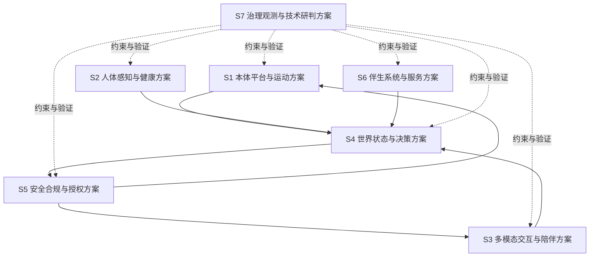

# 总体方案与模块方案下发基线

---

文档版本：v1.7
创建日期：2026-03-10
作者：Codex-架构师

文档变更记录：
- v1.7 | 2026-04-06 | Codex-架构师 | 按 `Phase 2` 口径重写 `PDCP -> P2` 下发输入：总架构上抬为家庭共居智能体，运行时改为多执行范式，并将 `S4/S5/S6` 任务改写为共享状态平面、离散业务状态面和跨范式审批硬边界口径。
- v1.6 | 2026-03-23 | Codex-架构师 | 吸收 Step41，将“一代 Agent 增强平面”作为不新增一级模块的正式下发输入，要求 `S3/S4/S5/S6/S7` 回答长期记忆、技能化、连接器与受控任务编排的落地边界。
- v1.5 | 2026-03-23 | Codex-架构师 | 吸收最新架构收敛决策，将“两芯片硬件基线、1 双目 + 2 单目视觉组合、头部多自由度、单麦阵和底盘稳健基线”下发到 `S1-S7`。
- v1.4 | 2026-03-22 | Codex-架构师 | 吸收 Step38，将验证 Demo 的三芯片职责分层、高位主观测经验、头部声学反向约束与验证平台器件淘汰边界下发到 S1-S7。
- v1.3 | 2026-03-20 | Codex-架构师 | 吸收硬件专家线程的最新内存价格反馈，将一代默认量产内存线与前瞻验证线正式下发到 `S1-S7`。
- v1.2 | 2026-03-17 | Codex-架构师 | 吸收 Step36，将三级能力模式、纯视觉对比基线、服务轻量化和新成本目标下发到 S1-S7。
- v1.1 | 2026-03-17 | Codex-架构师 | 将需求侧硬约束、纯视觉主线、关系质量评价和分层免疫式安全下发到 S1-S7。
- v1.0 | 2026-03-10 | Codex-架构师 | 文档创建。

---

## 1. 文档目的

本文档承接 [docs/02_p1_architecture/02_pdcp_system_architecture_review_package.md](../02_p1_architecture/02_pdcp_system_architecture_review_package.md)。

其作用不是重复系统架构，而是把系统架构进一步转成“各模块可以开工设计”的总体方案下发基线。

## 2. 当前阶段定位

当前阶段定位为：

1. 产品需求已基本冻结
2. 系统架构已形成完整 `PDCP` 评审包
3. 当前要做的是总体方案下发，而不是进入量产发布准备

因此，本文件的核心任务是：

1. 明确模块设计的输入边界
2. 明确模块设计必须提交的产物
3. 明确模块间接口冻结顺序
4. 明确技术研判与模块方案的关系

## 3. 当前已冻结的系统架构输入

`KBT-32` 不是重新发明系统架构，而是承接已经通过 `PDCP` 评审的系统输入。当前必须显式继承以下约束：

1. 双视角总体架构基线已经成立：本体 `6` 个实体域 + 头部 / 躯干 / 底盘空间子视图 + 运行时 `9` 个一级模块；总架构已上抬为家庭共居智能体，运行时采用多执行范式
2. 双视角一致性检查机制已进入系统架构基线
3. `Body Capability Contract + 接口稳定性策略` 已进入一级接口与治理基线
4. `D1 / D6 / D7` 是后续总体方案与模块设计必须显式应对的三项一级阻断输入
5. 需求侧硬约束总表已经进入主线，不允许总体方案绕开产品边界、端云部署、隐私合规、工程与商业约束另起炉灶
6. 一代纯视觉传感器主线已经进入系统架构基线：量产主线当前采用“`1` 组双目 + `2` 个单目 + 自研深度估计 + 多目几何融合”，深度相机 / 激光雷达仅允许作为研发对比基线与真值参考链路
7. “执行范式协调一级化 + `World State` 作为共享状态平面 + 分层免疫式安全 + 关系质量评价框架”已作为后续总体方案必须吸收的增强方向
8. `KBT-33` 将承接双视角一致性与接口稳定性策略的治理细化，但不回退重定义系统边界
9. 当前一代整体收敛策略是“核心闭环强、服务闭环轻、技术突破集中”，且整机 `BOM` 目标已下修为 `5000 到 6000 元`
10. 基于当前内存与存储价格口径，一代量产默认线当前按 `8GB RAM + 64GB Flash` 组织，`12GB + 64GB` 只作边界验证线，`16GB + 64GB` 及以上只作前瞻验证线或未来 `Pro SKU` 候选
11. 验证 Demo 已确认“交互主控 / 感知算力主控 / 实时控制 MCU”的三层职责分离，以及“高位主观测视觉优先”的空间经验，应继续进入一代总体方案
12. 验证 Demo 同时证明低位 `4` 超广角、长焦和双麦阵修补式叠加不应被直接继承为产品主线，后续总体方案必须显式回答如何以更少器件保住关键闭环
13. 当前硬件架构基线已进一步收敛为“主控 `SoC` + 实时控制 `MCU`”两芯片架构；验证平台中的 `RK3576 / S100Pro / MCU` 三层职责分工继续保留为功能分层思想，而不再保留为一代硬件表象
14. 当前纯视觉组合已进一步具体化为 `1` 组双目 + `2` 个单目；`4` 固态激光雷达、`4` 超广角、底部超声波和药箱 `ToF` 不进入一代默认主线
15. 当前本体空间架构进一步收敛为“头部多自由度主动观察 + 单麦阵头部优先 + 躯干自由度克制 + 两轮差速稳健底盘基线”
16. 一代正式吸收“Agent 增强平面”作为跨模块增强能力，不新增一级模块；正式范围为结构化长期记忆、技能化能力组织、连接器抽象与受控任务编排，自主创造新技能仍停留在研究线
17. `Step 47` 已进一步确认：主计算单元优先放头部，实时控制单元优先放底盘；决策状态机只继续描述离散决策业务面

### 3.1 必须继续下发到 `S1-S7` 的新增吸收项

本轮在系统架构与 `PDCP` 主文档中新增的内容，不能只停留在架构层，必须进一步转译为各工作包的显式输入：

1. 需求侧硬约束总表：产品边界、部署边界、隐私约束、成本区间、产品感知约束、项目节奏
2. 一代纯视觉传感器主线：`1` 组双目 + `2` 个单目、低光增强、自动标定、在线校正、夜间闭环验证
3. 执行范式协调一级化：`TTFT / TPS / 热稳态持续 TPS`、多任务抢占以及离散 / 连续 / 事件 / 长周期之间的调度边界
4. 世界状态后续分层：作为多执行范式共享状态平面，继续向执行 / 安全态、任务上下文态、长期关系与服务态演进
5. 分层免疫式安全：本体防护、运动与环境安全、业务授权与合规安全、服务协同与审计安全
6. 关系质量评价框架：信任、舒适、克制、连续性、可解释、可恢复
7. 端侧默认资源线约束：`8GB / 12GB / 16GB+` 三档路线必须分开管理，不能把前瞻验证线默认写成量产线
8. 验证 Demo 的反向约束：高位主观测有效、低位 `4` 超广角与长焦未有效用上、双麦阵暴露头部视觉 / 屏幕 / 声学 / 结构未协同收敛
9. 一代 Agent 增强平面：长期记忆、技能化、连接器与受控任务编排要进入正式主线，但必须压缩在现有模块边界内，不得新长出一级模块或把自主创造新技能写成一代正式承诺

## 4. 总体方案结构

建议把当前总体方案收敛为 `7` 个工作包：

### 4.1 一代三级能力模式

后续 `S1-S7` 方案不再默认所有能力同等重做，而应按 3 级模式组织：

1. `L1 核心闭环能力`：端侧闭环、断网可用、量产必须稳定。
2. `L2 增强认知能力`：作为技术突破重点，但按条件触发和算力调度使用。
3. `L3 服务扩展能力`：必须预留，但按“最小可交付 + 可收缩覆盖”设计。

这意味着：

1. `S1 / S4 / S5` 首先服务于 `L1`。
2. `S3 / S4 / S7` 共同服务于 `L2`。
3. `S6` 主要承接 `L3`，但其设计不得反向拖重 `L1 / L2`。

## 5. 七个工作包定义

### 5.1 `S1` 本体平台与运动方案

覆盖模块：

- `platform_runtime`
- `mobility_navigation`

当前任务：

1. 端侧计算平台总体布局与板级资源划分
2. 端侧多模态模型 `TTFT / TPS / 热稳态持续 TPS` 验收口径
3. 量产默认线 `8GB RAM + 64GB Flash` 与 `12GB / 16GB+` 验证线的板级资源、带宽、热与供电差异
4. 底盘、执行器、定位与运动安全总体方案
5. 传感器布局与本体资源预算
6. 纯视觉主线下的双目 + 单目相机落位、同步、线束、供电与热预算
7. 深度相机 / 激光雷达作为研发对比基线与真值参考链路时的接口与验证方案
8. 若纯视觉不过线，如何触发“调整产品节奏”而不是回退主动传感主线
9. `D1 / D6` 在本体平台层的收敛路径、主备线和冻结门
10. 如何把 `RK3576 / S100Pro / MCU` 的验证平台职责分离，转译成一代产品可落地的板级与控制域分层
11. 如何把 `RK3576 / S100Pro` 的职责合并进一颗主控 `SoC`，同时保留 `MCU` 承担低时延执行与硬保护
12. 如何从验证平台的 `50kg`、多执行器和高冗余传感，收敛到一代可量产的重量、自由度与器件数量
13. 如何以 `1` 双目 + `2` 单目、无底部超声波、无药箱 `ToF` 的组合重新闭合近场避障、补盲和仓门安全
14. 如何评估全向底盘候选，同时不破坏“两轮差速 + 全向轮”基线的节奏和风险控制

### 5.2 `S2` 人体感知与健康方案

覆盖模块：

- `human_health_sensing`

当前任务：

1. 身份、姿态、生命体征、异常候选事件总体方案
2. 穿戴与蓝牙外设接入总体方案
3. 睡眠监测与健康事件补采总体方案
4. 纯视觉主线下的人体识别、姿态、跌倒、离床和睡眠节律感知边界
5. 低照图像质量下降时，如何与穿戴 / 外设 / 问询补采协同闭环
6. 数据新鲜度、来源可信度和视觉质量状态如何进入健康事件判断
7. 在 `8GB` 默认量产线下健康事件链可接受的本地模型与缓存预算
8. 在严格 `BOM` 约束下，一代健康感知的“必须有 / 应该有 / 可以有”再次切分
9. 如何复用验证平台中的高位双目主观测经验，同时在 `1` 双目 + `2` 单目约束下重新论证低位地面视觉与长焦是否仍需要进入一代健康与安全闭环

### 5.3 `S3` 多模态交互与陪伴方案

覆盖模块：

- `multimodal_interaction`

当前任务：

1. 语音、屏幕、灯光与远程交互协同方案
2. 人设、主动交互、长期记忆治理总体方案
3. 找人、找物、到人等交互触发场景方案
4. 头部优先相机布局下的视线、表情、拾音、显示和交互遮挡约束
5. 夜间不开灯场景中的非侵扰式交互、提示与陪伴策略
6. 关系质量评价如何落到交互体验检查项与验收门
7. 在默认 `8GB` 量产线下，多模态陪伴体验如何通过调度、缓存与条件触发保持“聪明、温暖、精致”
8. 如何在更低 `BOM` 下保住“聪明、温暖、精致”的陪伴体验
9. 如何从验证平台“双麦阵修补遮挡与反射问题”的反例出发，在单麦阵前提下完成头部视觉 / 屏幕 / 声学 / 结构一体化收敛
10. 如何把头部多自由度转译成主动观察、拟人表达与非语言交互优势，而不是把自由度重新堆到躯干
11. 如何把长期记忆、技能发现、技能确认、技能解释和技能结果反馈变成交互体验的一部分，而不是藏在后端逻辑中

### 5.4 `S4` 世界状态与决策方案

覆盖模块：

- `world_state_memory`
- `decision_orchestration`

当前任务：

1. 世界状态统一模型与状态同步方案
2. 离散业务状态机、行为树、事件触发与任务编排的组合方案
3. 多执行范式落地方案，其中 `OODA / R1-R4` 作为离散决策主线保留
4. `VLN` 高层动作输出格式、任务模板以及与连续 / 事件 / 长周期执行面的协同落地方案
5. 纯视觉主线下的空间状态、图像质量状态、标定状态和夜间能力状态建模
6. `World State` 向执行 / 安全态、任务上下文态、长期关系与服务态演进的方案
7. 纯视觉、低照降级、断网和家属联动条件下的任务切换与编排边界
8. 当纯视觉不过线时，哪些任务链允许延后，哪些 `L1` 能力不能退
9. 在 `8GB` 默认量产线与 `12GB+` 验证线之间，哪些状态建模和调度能力必须严格分层，避免默认线被前瞻能力拖重
10. 如何把验证平台中真正有效进入主链的观测视角沉淀为一代任务模板，而把未有效用上的低位 / 长焦观测留在验证线
11. 如何把“头部主动观察”纳入离散决策业务面与连续调节面之间的任务模板与策略输出，而不是继续依赖多固定视角堆叠
12. 如何把长期记忆、技能化能力组织、连接器调用和受控任务编排压缩进既有 `world_state_memory / decision_orchestration` 边界，并明确固定技能、组合技能和候选新技能三层结构

### 5.5 `S5` 安全合规与授权方案

覆盖模块：

- `safety_compliance_authorization`

当前任务：

1. 高风险动作审批与仲裁方案
2. 安全事件、降级与故障保护方案
3. 权限、隐私、审计和合规约束方案
4. 分层免疫式安全如何映射到本体防护、运动与环境安全、业务授权和服务审计
5. 夜间低照、图像退化、标定异常和纯视觉失配时的门控、降级和硬停策略
6. 关系质量与高端产品感约束如何进入动作门和安全解释链路
7. 受控回流预留如何进入授权链、审计链和隐私边界
8. 在 `8GB` 默认量产线约束下，哪些安全门控必须保持常驻、哪些可按条件触发
9. 如何把验证平台的主动传感安全冗余，转译成一代纯视觉主线下的安全门、降级门和研发真值参考链，而不是产品 fallback
10. 在删除底部超声波和药箱 `ToF` 后，如何用近场视觉、接触式保护、仓门状态与电流 / 位置反馈补足最低安全闭环
11. 如何为长期记忆写入、技能激活、连接器调用和受控任务编排建立统一的授权、审计和回滚边界

### 5.6 `S6` 伴生系统与服务方案

覆盖模块：

- `companion_service_system`

当前任务：

1. 家属 App、云服务、后台人工服务的最小闭环总体方案
2. 第三方平台、互联网医院、配送与外部生态接入方案
3. 远程确认、事件升级与服务结果回写方案
4. 纯视觉路线在夜间或低照异常时的远程协助、人工服务和结果回写策略
5. 需求侧硬约束中“机器人 + 伴生系统 + 服务”为完整交付对象的最小落地面
6. `D7` 在一期最小可交付面中的冻结范围与运营假设
7. `service_availability`、覆盖时段、场景范围和坐席经济性如何进入最小闭环设计
8. 在默认量产线算力有限时，哪些服务能力应外置到 App / 云侧，避免挤压本体默认配置
9. 如何建立统一连接器模型，把手机、App、云服务、智能家居和第三方平台接入收敛到稳定边界，而不是继续堆点对点接口

### 5.7 `S7` 治理观测与技术研判方案

覆盖模块：

- `observability_data_governance`
- 技术研判输入包

当前任务：

1. 日志、指标、审计和问题归因总体方案
2. 数据治理、隐私治理和高端产品感检查机制
3. `TTFT / TPS` 驱动的端侧算力需求模型与验证口径
4. 技术路线评估如何作为模块方案的约束输入，而不是反向改写系统边界
5. 纯视觉路线下的图像质量、标定状态、夜间闭环和低照鲁棒性观测指标体系
6. 需求侧硬约束、纯视觉主线和关系质量评价框架的追踪矩阵
7. `S1-S6` 的关键验证事实如何沉淀为阶段门、评审门和问题归因资产
8. `BOM 5000 到 6000 元` 下各工作包的成本压力、删减边界和节奏风险看板
9. `8GB / 12GB / 16GB+` 三档内存路线对 `C1 / C5 / 整机 BOM / 任务体验` 的统一追踪矩阵
10. 验证平台与一代产品之间的“器件保留 / 能力保留 / 设计抛弃”转译矩阵
11. 这一轮“删传感器、并算力、加头部自由度、收单麦阵、稳底盘”决策对风险、成本、产品感和验证门的追踪矩阵
12. 长期记忆、技能化、连接器与受控任务编排的运行指标、失败恢复和审计矩阵，避免 Agent 增强平面在运行时变成不可观测黑盒

## 6. 模块必须提交的 `7` 类产物

各模块后续进入自己的架构与总体方案设计时，至少提交以下 `7` 类产物：

1. 模块职责与边界说明
2. 模块架构图与内部二级分层
3. 对外接口清单与接口草案
4. 关键状态模型 / 数据模型
5. 关键技术路线与备选方案
6. 风险清单、约束和依赖项
7. 验证方案与阶段门检查项

## 7. 模块方案评审顺序

为避免接口漂移，建议模块方案按以下顺序评审：

1. `S4 世界状态与决策方案`
2. `S5 安全合规与授权方案`
3. `S1 本体平台与运动方案`
4. `S2 人体感知与健康方案`
5. `S3 多模态交互与陪伴方案`
6. `S6 伴生系统与服务方案`
7. `S7 治理观测与技术研判方案`

说明：

- `S4` 与 `S5` 优先，是因为它们定义状态面和动作门。
- `S7` 虽然最后评审，但它贯穿全过程，持续作为约束输入。

## 8. 技术研判与模块方案的关系

当前技术研判不应越位替代模块方案，但应作为输入约束存在：

1. `VLN`、多相机纯视觉、端侧算力路线等，作为 `S1 / S2 / S3 / S4` 的输入
2. `TTFT / TPS / 热稳态持续 TPS`、`P1 / P2 / P3` 任务模板和结构化动作输出，作为 `S1 / S4 / S7` 的共同输入
3. 穿戴兼容、`UWB` 观察线、成本与功耗约束，作为 `S2 / S6 / S7` 的输入
4. `D1 / D6 / D7` 三项一级阻断输入，作为 `S1 / S2 / S4 / S6 / S7` 的共同输入
5. `KBT-33` 中的接口治理要求，作为 `S4 / S5 / S7` 的治理输入
6. 需求侧硬约束总表、纯视觉主线和夜间低照闭环专项，作为 `S1 / S4 / S5 / S6 / S7` 的共同输入
7. 关系质量评价框架和高端产品感约束，作为 `S3 / S5 / S6 / S7` 的共同输入
8. 受控回流预留，作为 `S5 / S6 / S7` 的共同输入，但不改写默认端侧主基线
9. 量产预备、`MVP`、发布与交付等后置文档，只作为远期约束，不反向抢占当前主线

## 9. 模块设计启动条件

模块可以正式启动内部架构与总体方案设计的条件建议收敛为：

1. `PDCP` 系统架构评审通过
2. 当前一级模块边界不再漂移
3. 世界状态共享平面、离散业务状态面和安全审批硬边界已形成稳定基线
4. 模块上游 / 下游接口面有明确责任人
5. 模块已拿到对应的技术研判输入包

## 10. 当前下发建议

当前建议立即启动以下动作：

1. 用本文件把模块工作包和评审顺序同步到 Linear
2. 由各模块 owner 认领 `S1-S7` 工作包
3. 先启动 `S4 / S5`，再并行推进 `S1 / S2 / S3 / S6 / S7`
4. 各模块第一轮先交“模块架构 + 接口草案”，不要一开始就陷入实现细节
5. `S1 / S4 / S6 / S7` 第一轮必须显式回答 `D1 / D6 / D7` 三项阻断输入如何落到本工作包
6. `S1 / S4 / S5 / S7` 第一轮必须显式回答纯视觉主线、低照验证、自动标定和图像质量监测如何落到本工作包
7. `S3 / S5 / S6 / S7` 第一轮必须显式回答关系质量评价和高端产品感检查如何落到本工作包
8. `S1 / S4 / S5` 第一轮必须显式回答“纯视觉不过线时如何调整节奏，而不是回退主动传感主线”
9. 由 `VLN` 专家线程承接 `P1 / P2 / P3` 任务模板、结构化动作输出和 `TTFT / TPS` 目标表，并把结果回写到 `S1 / S4 / S7`
10. `S1 / S2 / S3 / S4` 第一轮必须显式回答：如何吸收验证 Demo 中“高位主观测有用、低位与长焦未有效用上、双麦阵暴露头部结构冲突”的经验，而不把验证平台器件直接带入产品主线
11. `S3 / S4 / S5 / S6 / S7` 第一轮必须显式回答：如何在不新增一级模块的前提下，落地长期记忆、技能化、连接器与受控任务编排，并证明“自主创造新技能”没有被偷渡成一代正式承诺

## 11. 本轮评审结论入口

本文件建议重点评审以下 `7` 点：

1. 是否接受 `S1-S7` 这 `7` 个总体方案工作包。
2. 是否接受“每个模块必须提交 `7` 类产物”的下发要求。
3. 是否接受当前模块方案评审顺序，尤其是 `S4 / S5` 优先。
4. 是否接受“技术研判是输入约束，不反向重写系统边界”这一原则。
5. 是否接受 `PDCP` 通过后，模块先交“模块架构 + 接口草案”，再进入更细总体方案。
6. 是否接受把需求侧硬约束总表、纯视觉主线、关系质量评价框架、三级能力模式和 `TTFT / TPS` 口径，一并作为 `S1-S7` 的正式下发输入。
7. 是否接受把“一代 Agent 增强平面”压缩为现有模块内的正式下发输入，而不新增一级模块。
