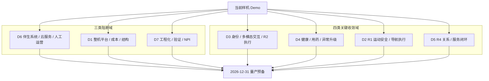

# 样机到量产预备能力缺口

---

文档版本：v1.0
创建日期：2026-03-08
作者：Codex-架构师

---

## 1. 文档目的

本文档用于回答 `KBT-18` 的核心问题：

当前真实样机 Demo 已经证明了哪些能力“可以做”，而要在 `2026-12-31` 达到量产预备状态，还缺哪些能力“必须能交付、能稳定、能验证、能运营”。

本文档的角色不是复述需求，而是作为：

1. `P2 关键技术收敛与工程化方案` 的输入
2. `KBT-24 工程化与 NPI 准备基线` 的前置
3. 后续软硬件选型、试点和验证优先级的排序依据

## 2. 当前评估输入

本轮评估基于以下已确认事实：

1. 当前已有真实自研机器人样机，已完成粗放 Demo 验证。
2. 当前样机已具备本体集成、自然语音交互、导航闭环，以及“心率广播外设触发 + VLN 寻人 + 储物仓推出”的紧急给药 Demo。
3. 当前样机的身份识别效果不够好，家属 App 和云服务仍为空白。
4. 当前样机更接近“重传感器概念验证平台”，而目标产品需要收敛到可量产、可试点、可运营的整机与服务系统。
5. 当前架构已正式采用 `R1` 到 `R4` 四类 OODA 子环，并将 `OODA Scale Scheduler` 作为一级架构能力。

## 3. 总体判断

当前样机与量产预备之间，最大的差距不是“有没有单点能力”，而是以下 3 个跃迁：

1. 从 `能力演示` 跃迁到 `产品闭环`

说明：样机已经证明若干链路可做，但整机、伴生系统、人工服务和权限治理还没有形成产品级闭环。

1. 从 `局部可跑` 跃迁到 `全链可交付`

说明：导航、交互、健康、用药、异常升级、家属联动、人工服务、审计和试点运营必须连成一条可稳定交付的链。

1. 从 `验证平台` 跃迁到 `量产平台`

说明：重量、成本、传感器组合、工程约束、验证体系和 NPI 输入目前仍未收敛到量产导向状态。

## 4. OODA 视角下的当前状态

| OODA 子环     | 当前判断                   | 主要问题                         |
| ----------- | ---------------------- | ---------------------------- |
| `R1 反射环`    | 已有基础，但未证明量产级稳健性        | 需要进一步收敛运动安全、局部避障、传感器冗余和硬停底线  |
| `R2 执行环`    | 已有局部能力，但执行稳定性不够        | 导航反应慢、行走犹豫、身份效果弱、执行监督不足      |
| `R3 任务环`    | 已有健康 / 用药 Demo，但仍偏链路演示 | 风险分级、人工服务、家属联动、审计和远控边界尚未产品化  |
| `R4 关系与服务环` | 基本空白或仅有零散能力            | 长期记忆、习惯学习、提醒优化、服务编排尚未形成正式产品层 |

结论：

- 当前样机不是完全缺 OODA，而是 `R1` 到 `R3` 有粗放基础，`R4` 明显偏弱。
- `OODA Scale Scheduler` 已被架构冻结，但尚未看到与当前样机能力显式对齐的产品化落点。

## 5. 七个能力缺口域

为避免缺口清单碎片化，当前建议按 7 个能力域收敛。

| 域                    | 当前样机基线               | 量产预备目标                       | 当前缺口判断    | 优先级  |
| -------------------- | -------------------- | ---------------------------- | --------- | ---- |
| `D1 整机平台与成本`         | 本体可跑，约 50 kg，传感器配置偏重 | 收敛到可量产的重量、BOM、结构和传感器组合       | `结构性重构`   | `阻断` |
| `D2 R1 运动安全与导航执行`    | 已有导航闭环，但反应慢、行走犹豫     | 稳定、可预测、可验证的运动安全与局部执行         | `关键收敛`    | `关键` |
| `D3 身份、多模态交互与 R2 执行` | 麦阵和自然语音较成熟，身份效果弱     | 稳定的身份识别、多角色绑定、执行监督和低扰动交互     | `关键收敛`    | `关键` |
| `D4 健康、用药与异常升级`      | 已有紧急给药 Demo 和问诊能力    | 形成完整的健康事件、用药、升级和审计闭环         | `产品化重构`   | `关键` |
| `D5 R4 关系与服务闭环`      | 长期服务能力弱              | 形成记忆、习惯、提醒优化和服务编排闭环          | `从 0 到 1` | `关键` |
| `D6 伴生系统、云服务与人工运营`   | App 和云服务基本空白         | 家属 App、云服务、人工坐席和第三方平台形成可运营闭环 | `从 0 到 1` | `阻断` |
| `D7 工程化、验证与 NPI`     | Demo 可用，但缺少工程化门和试点体系 | 具备试点、质量、OTA、量产切换和发布准备能力      | `从 0 到 1` | `阻断` |

### 5.1 七个能力缺口域图

说明：

- 这张图表达的是从样机到量产预备必须跨越的 7 个能力域，不代表详细依赖顺序。

## 6. 各能力域详细判断

### 6.1 `D1 整机平台与成本`

当前样机基线：

- 本体已具备移动、屏幕和电动储物仓能力。
- 当前样机尺寸和重量更接近验证平台。
- 传感器配置更偏“先验证全向观测”，而不是“先收敛量产 BOM”。

量产预备要求：

- 重量、尺寸、传感器数量、热设计和供电方案收敛到量产平台。
- 整机物料成本落入 `6000 到 8000 元` 区间。
- 保留必须能力，去掉为了 Demo 堆叠的重配置。

主要缺口：

1. 重量与结构仍偏重。
2. 传感器组合未完成量产收敛。
3. 整机平台还没有形成成本、可靠性和装配导向的约束面。

建议动作：

- 优先冻结“必须保留、应该保留、可以去掉”的硬件能力清单。
- 把“全向观测、电动储物仓、屏幕交互”作为保留优先级高的资产评估。
- 尽快把结构、EE、底盘和传感器布局拉入同一张降重降本表。

### 6.2 `D2 R1 运动安全与导航执行`

当前样机基线：

- 已有 `VLN + 激光 SLAM + 导航算法` 闭环。
- 当前已知问题是反应慢、行走犹豫。

量产预备要求：

- `R1` 硬停、限速、避障和局部执行必须足够稳定，能作为量产底线。
- `R2` 到人确认、局部导航和仓门执行要可预测、可复现、可验证。
- `R3` 不得把高层语义能力误当成底盘级安全兜底。

主要缺口：

1. 当前导航链更像“能跑通”，还不是“可交付”。
2. 反射环、执行环、任务环的分层虽然在架构上冻结了，但尚未映射为可验证的运行栈能力。
3. `OODA Scale Scheduler` 还没有体现到导航执行策略的产品化行为上。

建议动作：

- 把 `R1 / R2 / R3` 对导航的职责拆成正式验证项。
- 先解决“反应慢、犹豫”这类直接破坏体验和安全信心的问题。
- 把 VLN 继续限制在语义策略层，不让其挤压本地执行稳定性。

### 6.3 `D3 身份、多模态交互与 R2 执行`

当前样机基线：

- 麦克风阵列和自然语音交互已有较好基础。
- 身份识别效果不够好。
- 当前还缺稳定的多角色权限绑定与执行监督。

量产预备要求：

- 老人本人、子女、保姆、访客的角色绑定要能稳定工作。
- 主动靠近、提醒、打断、到人确认等 `R2` 场景要低扰动、可解释、可回退。
- 交互执行需要和授权、记忆治理、审计链联动。

主要缺口：

1. 身份与权限是产品化短板，不只是算法短板。
2. 当前多模态交互已有基础，但还缺“谁能看、谁能改、谁能触发”的治理层。
3. `R2` 的执行监督能力还未显式产品化。

建议动作：

- 把身份、角色、授权、记忆可见性合并成同一个产品化闭环设计。
- 用高频场景先验证 `R2`，例如到人提醒、服药确认、家属远程确认。
- 不追求先做复杂人格，先做稳定、可信、低打扰的执行体验。

### 6.4 `D4 健康、用药与异常升级`

当前样机基线：

- 已有问诊能力。
- 已有“心率广播外设触发 + 寻人 + 储物仓推出”的紧急给药 Demo。

量产预备要求：

- 健康事件管线、用药提醒、递送、确认、家属联动、人工服务和第三方平台调用要形成一条可追溯的主链。
- 风险等级、补采逻辑、外部升级和责任边界要可审计。

主要缺口：

1. 目前偏“链路演示”，还不是“产品闭环”。
2. 穿戴、BLE 外设、问诊补采、人工服务和家属联动还没有真正收束到同一个产品状态机。
3. 缺少量化阈值、默认升级策略和远控边界。

建议动作：

- 把健康与用药闭环视为 `R3` 的主战场，不再按零散功能拆开推进。
- 先补齐 `L1` 到 `L4` 风险阈值与默认升级链。
- 把紧急给药 Demo 升级为“风险识别 -> 到人确认 -> 递送 -> 记录 -> 通知”的产品流程。

### 6.5 `D5 R4 关系与服务闭环`

当前样机基线：

- 目前缺少正式的长期记忆、习惯学习和提醒优化产品层。
- `R4` 虽已进入正式架构，但尚无对应的样机级产品闭环证据。

量产预备要求：

- 机器人不仅能“这一次做对”，还要能“越用越懂家庭，越用越顺手”。
- 纪念日、提醒策略、长期健康档案、陪伴偏好和服务编排要具备可治理的长期资产形态。

主要缺口：

1. `R4` 当前几乎是空白域。
2. 长期记忆、习惯学习和服务编排未形成面向用户的可见能力。
3. `R4` 若不尽快落地，产品会停留在“聪明样机”，而不是“长期服务产品”。

建议动作：

- 把 `R4` 最小版本定义为一代必做项，而不是留到二代。
- 先收敛 3 类能力：长期记忆、提醒优化、服务编排。
- 所有 `R4` 数据都必须进入用户可治理视图。

### 6.6 `D6 伴生系统、云服务与人工运营`

当前样机基线：

- 家属 App 和云服务当前仍为空白。
- 后台人工服务还在架构预留阶段。

量产预备要求：

- 家属 App、云服务、后台运营坐席、第三方平台接入形成最小运营闭环。
- 用户授权、记忆治理、异常升级、人工接管和远程确认都必须有产品承载面。

主要缺口：

1. 这是当前最大的“从 0 到 1”缺口。
2. 没有伴生系统，就没有真正的产品闭环和服务闭环。
3. 这条线会直接阻断试点、售后、家属联动和人工服务。

为什么 `D6` 应视为阻断项：

1. 一代大量高风险链路天然依赖伴生系统承接，包括异常上报、家属确认、人工接力、第三方服务调用和审计留痕。
2. 没有家属 App，就没有稳定的绑定、授权、记忆治理和远程确认入口，很多“机器人本体已能做”的能力无法交付成产品能力。
3. 没有云服务，就无法承载账号、配置同步、事件留痕、第三方服务网关、OTA 和坐席上下文编排，试点和售后无法闭环。
4. 没有后台运营坐席，高风险异常、用户不会操作、机器人无法理解需求、第三方平台转接等场景都缺少人工兜底，真实家庭试点很难放开。
5. 因此 `D6` 不是“锦上添花”的互联网配套，而是把机器人从“会动的样机”变成“可交付产品系统”的必要条件。

建议动作：

- 以 `家属 App + 云服务 + 人工坐席` 为一个整体系统推进。
- 先冻结最小闭环，而不是一开始做大而全平台。
- 所有高风险场景都要问一句：没有 App / 云 / 坐席时，这条链是否能成立。

### 6.7 `D7 工程化、验证与 NPI`

当前样机基线：

- 当前有 Demo，但尚未形成量产导向的工程门。
- 试点、质量、OTA、制造、售后和发布准备还未形成体系。

量产预备要求：

- 具备 `产品定型 + 小批量试点 + 随时可以开发布会` 的综合状态。
- 有验证项、有质量门、有问题闭环、有发布准备。

主要缺口：

1. 当前最缺的不是“再加一个功能”，而是“把已有能力收敛成可验证、可试点、可交付的系统”。
2. 缺少 NPI 入口、质量门、试点计划、发布准备和量产切换方案。
3. 如果这一域不尽快启动，前面的功能闭环会在下半年集中撞墙。

建议动作：

- 立即把 `KBT-24` 作为接续重点。
- 把验证、试点、质量、交付、售后、OTA 统一纳入工程化基线。
- 所有核心功能文档后续都要补“如何验证进入量产预备”。

## 7. 当前默认的优先级分组

在用户尚未单独重排优先级前，当前建议按以下顺序推进：

### 7.1 三类阻断项

1. `D6 伴生系统、云服务与人工运营`
2. `D1 整机平台与成本`
3. `D7 工程化、验证与 NPI`

说明：

- 这三项不解决，功能再多也很难进入“量产预备”。

### 7.2 四类关键收敛项

1. `D3 身份、多模态交互与 R2 执行`
2. `D4 健康、用药与异常升级`
3. `D2 R1 运动安全与导航执行`
4. `D5 R4 关系与服务闭环`

说明：

- 这四项决定一代产品是否既能跑通核心价值，又能体现长期生命力。

## 8. 当前建议保留与重构

### 8.1 建议优先保留的资产

1. 本体集成能力
2. 麦克风阵列与自然语音交互基础
3. 储物仓能力与室内递送主链路经验
4. 屏幕交互能力
5. 紧急给药 Demo 的主链路经验

### 8.2 建议优先重构的资产

1. 整机重量、成本和传感器配置
2. 身份识别与多角色权限
3. 导航反应慢、行走犹豫的问题
4. 储物仓传动机构与结构实现
5. 整机外观形态
6. App、云服务和人工运营闭环
7. `R4` 长期服务层

## 9. 对下一阶段的直接输入

这份文档当前直接给后续 3 个工作项提供输入：

1. `KBT-24 工程化与 NPI 准备基线`
2. `KBT-11 软硬件选型矩阵`
3. `KBT-12 量产预备与 MVP 验证计划`

## 10. 已收到的审阅结论

针对 `KBT-18`，当前已收到以下审阅意见：

1. 接受按 7 个能力域组织缺口，而不是按零散功能清单组织。
2. 接受 `D1`、`D7` 为阻断项；`D6` 基本接受，但需要在文档中写清其阻断理由。
3. 接受当前默认优先级排序，但将“电动储物仓”调整为“能力保留、机构重构”，并补入“整机外观形态重构”为既定方向。
