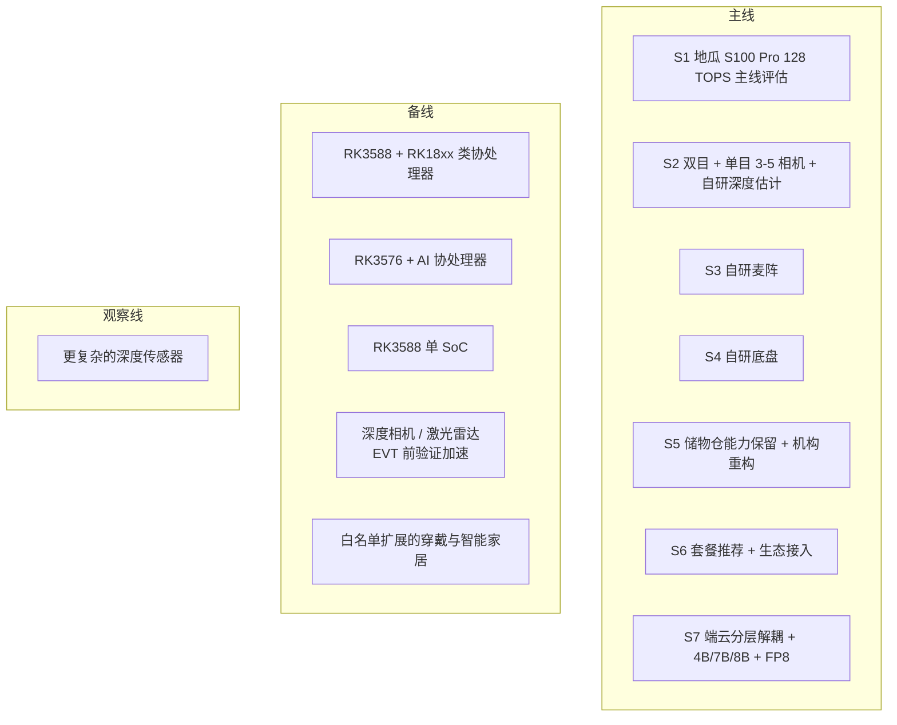

# 软硬件选型矩阵

---

文档版本：v1.0
创建日期：2026-03-08
作者：Codex-架构师

---

## 1. 文档目的

本文档用于回答 `KBT-11` 的核心问题：

在既定产品目标、成本约束和架构基线下，Kinbot 一代的软硬件路线应该如何收敛，哪些路线适合作为量产主线，哪些路线更适合作为 Alpha / EVT 验证加速路线，哪些路线只保留为前瞻观察。

## 2. 当前选型约束

本轮选型基于以下已确认约束：

1. 项目目标是在 `2026-12-31` 达到量产预备状态。
2. 整机物料成本目标为 `6000 到 8000 元人民币`。
3. 目标系统是机器人整机，穿戴、智能家居、App、云服务和后台运营属于伴生系统。
4. 原始视觉、语音和生物特征数据必须以端侧本地处理为原则。
5. 端侧算力必须采用中国芯片生产商的产品，可采用通用 SoC 主控加 AI 协处理器的组合路线。
6. 底盘倾向自研，麦克风阵列自研，穿戴外设不自研，相机优先供应商方案。
7. 量产主线视觉路线已收敛为双目 + 单目组合，数量 `3 到 5` 个，并采用自研深度估计模型。
8. 深度相机和激光雷达可用于早期验证加速，但在 `EVT` 之后应退出一代量产主线。
9. 当前样机已有粗放 Demo，但需要从验证平台收敛为量产平台。
10. `KBT-24` 已确认 `E4 伴生系统与服务运营基线` 优先，但伴生系统不能反向锁死本体硬件。
11. 更重的端侧多模态模型需要进入主线评估，当前参数量按 `4B / 7B / 8B` 三档考虑，并评估 `FP8` 量化与内存带宽约束。
12. 当前不能过早把端侧算力主线收敛到 `RK3588 + RK18xx 类协处理器` 或 `RK3576 + AI 协处理器` 双路线，必须优先寻找中国大算力端侧芯片方案。
13. 一代端侧算力需求必须用真实板级多模态大模型推理速度定义，核心指标是 `TTFT`、稳态 `TPS`、热稳态衰减后的持续 `TPS`，而不是只看纸面 `TOPS`。

## 3. 当前选型原则

当前建议按 7 条原则收敛一代选型：

1. 优先服务量产，不为单次 Demo 继续堆配置。
2. 伴生系统优先冻结接口，不反向决定本体器件。
3. 对高风险器件保留 `A/B` 路线，避免被单点供应卡死。
4. 优先保留团队已有强项：底盘、麦阵、多模态交互、端侧算法。
5. 相机路线优先选择双目 + 单目这类简单、可量产、可校准的组合方案。
6. 量产主线与验证加速路线可以并存，但必须在 `G2` 前收敛。
7. 对会显著影响 `VLN / VLM` 端侧落地的大算力芯片路线，现阶段不能因为工程保守而过早排除出主线。

## 3.1 成本分配硬约束

整机物料成本上限已经明确为 `6000 到 8000 元人民币`，因此一代硬件选型不能只讨论算力上限，还必须同时讨论成本分配。

当前建议先按 7 个成本桶约束路线讨论：

| 成本桶 | 建议区间 | 说明 |
| --- | --- | --- |
| `C1 端侧算力与存储` | `1100 到 1700` | 主控、AI 芯片、内存、存储、基础连接器件 |
| `C2 相机与基础传感` | `500 到 800` | 双目、单目、IMU、轮速等基础感知 |
| `C3 音频与交互器件` | `350 到 650` | 麦阵、扬声器、屏幕、灯光与交互外围 |
| `C4 底盘与运动系统` | `1200 到 1700` | 电机、驱动、轮组、充电对接与核心运动部件 |
| `C5 电池、电源与热设计` | `800 到 1100` | 电池包、电源板、散热与供电保护 |
| `C6 储物仓、结构与外观件` | `900 到 1400` | 储物仓机构、结构件、外观件与装配空间成本 |
| `C7 制造、测试与校准余量` | `600 到 900` | 产测、校准、治具摊销与装配余量 |

说明：

- 上表是当前架构师成本分配提案，不是已经冻结的采购报价。
- 任何大算力主线如果持续挤压 `C1` 到超出当前区间，都必须同时说明从哪几个成本桶回收预算，而不是只强调芯片能力。
- 结合 `Step21` 与 `Step22` 的审阅意见，当前滚动修正已转入 [docs/03_p2_feasibility/05_cost_structure_and_technology_downpath.md](05_cost_structure_and_technology_downpath.md) 继续细化。

### 3.2 `Step22` 后的滚动修正

基于你在 `Step21` 与 `Step22` 中给出的方向性判断，当前先做 4 条滚动修正：

1. `C1 端侧算力与存储` 当前按“较上一轮提案上修约 `300` 元”继续监测。
2. `C3 音频与交互器件` 当前按“音频较便宜、显示屏更贵且与外观耦合”继续下修评估。
3. `C5 电池、电源与热设计` 当前按“续航与热设计压力上升，且原建议区间偏低”继续上修评估。
4. `C4 底盘与运动系统` 当前按“简单传感器路线会把能力压力转移到 `C1 / C2 / C5`”继续监测，不允许只看本桶数字。

当前原则：

- `KBT-11` 先冻结分类和方向，不在这一轮假装把所有金额精确到最终采购价。
- 最终成本分布将由单独的 BOM 成本 issue 持续跟踪，过程中允许按评审和实测结果发起变更。
- `C5` 当前只形成工作区间，尚未形成完全冻结的成本基线。

## 4. 七个选型域与当前判断

| 选型域 | 当前候选路线 | 当前判断 | 主要理由 | 当前风险 |
| --- | --- | --- | --- | --- |
| `S1 端侧算力平台` | `地瓜 S100 Pro（128 TOPS 版本）`、`RK3588 + RK18xx 类协处理器`、`RK3576 + AI 协处理器`、`RK3588` 单 SoC；明确排除 `Atlas 200I A2`，并排除 `BM1688 / MLU220-M.2` 这类小算力路线 | 当前正式主线已从“泛中国大算力专项”收敛为“`地瓜 S100 Pro（128 TOPS）` 主线评估 + `RK` 工程/成本备线”；并明确以板级 `TTFT / TPS` 达标作为是否继续投入的首要门槛 | 既响应 `VLN / VLM` 对端侧算力、内存带宽与实时性的压力，也避免继续把评估资源分散到已明确不进入一期的路线 | 若主线平台在 `TTFT / TPS`、`C1` 成本桶、功耗和热设计上无法同时收敛，就会拖慢一代定型 |
| `S2 相机与深度路线` | 双目 + 单目 `RGB` 组合、自研深度估计；深度相机；激光雷达 | 量产主线优先双目 + 单目组合 `3 到 5` 个相机，自研深度估计；深度相机和激光雷达仅作为 EVT 前验证加速路线 | 符合你对简单相机配置、成本和体积的要求，也避免深度相机 / 雷达长期占据量产 BOM | 纯 `RGB` 路线对算法、标定和低光场景鲁棒性要求更高 |
| `S3 音频交互路线` | 自研麦克风阵列 + 端侧语音栈 | 维持自研主线，不做外采主路线 | 团队有明显既有能力，且这是产品体验核心资产 | 需要尽早冻结阵列结构、回声路径和整机声学布局 |
| `S4 底盘与运动执行路线` | 自研轮式底盘，传感器精简，自主运动控制 | 维持自研主线，但要把“低传感路线的成本转移”显式记账 | 机器人是目标系统，底盘体验直接决定一代可信度；当前成本量级下更可能保留轮速计、`IMU`、超声波等简单传感器组合 | 若底盘接口与 `R1/R2` 运行栈不稳定，或因低传感路线把成本与复杂度无计划转移到 `C1 / C2 / C5`，后续所有体验都受损 |
| `S5 储物仓、屏幕与整机结构路线` | 保留储物仓能力、重构传动机构；保留屏幕；整机外观形态重构 | 作为一代既定工程动作推进 | 这条链直接影响紧急给药、日常递送和整机感知价值 | 机构、重量、外观与装配空间容易互相牵制 |
| `S6 穿戴与家庭设备生态路线` | 手表 / 手环、蓝牙血压计、蓝牙血糖仪、智能家居设备 | 继续按“套餐推荐 + 生态接入”推进 | 这是首发健康场景的必要输入，不适合自研硬件扩张 | 协议碎片化、数据质量和接入一致性风险高 |
| `S7 软件栈与部署路线` | 端云协同、关键原始数据端侧处理、云侧承接知识与服务编排、端侧 `4B / 7B / 8B` 多模态模型、`FP8` 量化 | 继续按分层解耦路线推进，但重模型不再只放观察线，而是进入主线评估 | 一代是否具备更强端侧认知能力，会反向影响 `R3 / R4`、`VLN` 和多模态交互体验上限 | 若只强调模型能力而不同时管控带宽、热和 `BOM`，会直接破坏量产目标 |

### 4.1 当前路线分层图

说明：

- 这张图表达的是一代选型的路线分层，不代表最终器件清单已经冻结。
- 只要某条算力路线无法在 `C1` 成本桶内收敛，或无法说明如何从其他成本桶回收预算，就不能直接进入一代量产定型。

## 5. 端侧算力平台矩阵

### 5.1 算力需求定义与计算方式

当前必须先把“一代到底需要多大端侧算力”说清楚。

当前判断：端侧算力需求的核心，不是芯片宣传页上的 `TOPS`，而是端侧多模态大模型在真实板级、真实输入、真实热稳态下的推理速度是否足够支撑产品体验。对 Kinbot 来说，最关键的 2 个指标是：

1. `TTFT`（`Time To First Token`）：从任务输入完成到输出首个有效 token / 首个有效动作的时间。
2. `TPS`（`Tokens Per Second`）：进入解码阶段后，模型持续输出 token 的速度；评估时必须区分实验室峰值 `TPS` 与热稳态持续 `TPS`。

因此本轮统一采用以下计算口径：

- 任务总时延：`T_total = T_fixed + T_model`
- 其中：`T_model = TTFT + N_out / TPS`
- 固定开销：`T_fixed = T_sensor_sync + T_visual_encode + T_world_state_update + T_safety_gate + T_local_plan`
- 因此模型可用预算：`T_model_budget = T_total_budget - T_fixed`
- 一个平台只有在 `TTFT + N_out / TPS <= T_model_budget` 时，才算满足该任务

对一代评估，当前建议至少冻结 3 个任务模板，并据此反推算力需求：

| 任务模板 | 典型输入 | 典型输出 | 当前评估重点 |
| --- | --- | --- | --- |
| `P1 VLN 高层动作决策` | `3 到 5` 路相机观测、位姿、局部语义地图、目标描述 | `8 到 16` 个结构化动作 token 或紧凑动作字段 | 优先压低 `TTFT`，禁止用长自然语言输出拖垮导航时延 |
| `P2 搜索 / 重定位 / 寻人` | 多帧视觉上下文、历史轨迹、房间语义、人物/目标线索 | `12 到 24` 个决策 token | 同时看 `TTFT` 与持续 `TPS`，关注上下文拉长后的稳定性 |
| `P3 多模态陪伴问答首响应` | 视觉 + 语音 + 对话上下文 | `20 到 40` 个首轮响应 token | 重点看首响应等待感、热稳态和多轮连续交互体验 |

进一步约束：

1. 导航和安全相关实时环节，不能把长链式自然语言推理直接塞进实时路径，必须尽量把输出压成结构化动作或有限字段。
2. `VLN / VLM` 的平台评估必须记录 `TTFT`、实验室峰值 `TPS`、热稳态持续 `TPS`、并发视觉输入下的 `TPS` 降幅，以及 `KV cache` 占用。
3. 若一个平台只能在“单相机、短上下文、冷机”条件下达标，而在真实 `3 到 5` 相机与热稳态场景下明显掉速，则视为不满足一代要求。

### 5.2 候选路线

| 路线 | 当前定位 | 优势 | 风险 | 当前建议 |
| --- | --- | --- | --- | --- |
| `地瓜 S100 Pro（128 TOPS 版本）` | 一代大算力主线候选 | 当前候选里最符合“一期先把端侧多模态大模型真正跑顺”的主线诉求，便于集中资源做 `TTFT / TPS`、热设计与板级工程验证 | 仍需继续核实真实板卡可得性、内存带宽、整机功耗、`BOM` 与工具链成熟度 | 作为一代大算力主线优先评估 |
| `Atlas 200I A2` | 明确排除 | 继续缩小候选池，有利于把评估资源集中到更明确的一期主线与备线上 | 若继续纳入，会扩大板卡获取、工具链适配和量产验证面 | 本轮不进入一代主线，也不进入对比池 |
| `BM1688 / MLU220-M.2 / 同等级小算力芯片` | 明确排除 | 成本和板级启动门槛可能更低 | 对 `4B / 7B / 8B` 端侧多模态模型的 `TTFT / TPS` 目标明显偏紧，难以支撑 `VLN / VLM` 的一代主线诉求 | 作为“算力不足”的反例结论保留，不再进入一期候选池 |
| `RK3588 + RK18xx 类协处理器` | 工程备线 | 工程资料和集成路径相对更容易起步，适合作为高算力专项不收敛时的工程兜底 | 端侧更重模型的余量、带宽和调度复杂度仍可能成为瓶颈 | 作为工程备线保留，不再默认视为一代主线 |
| `RK3576 + AI 协处理器` | 成本备线 | 更容易压低成本和功耗，适合作为 `6000 到 8000` 元量产压力下的备选路径 | 复杂场景下的算力与余量更紧，对 `VLN / VLM` 不够从容 | 作为成本备线保留 |
| `RK3588` 单 SoC | 简化备线 | 板级复杂度较低，便于对比“单板简化”与“主控 + 协处理器”的真实收益 | 面对更重模型和多相机吞吐时，空间可能偏紧 | 作为简化备线保留 |

### 5.3 当前推荐口径

当前建议：

1. 一代端侧算力当前先冻结为“`地瓜 S100 Pro（128 TOPS 版本）` 主线评估 + `RK` 工程/成本备线”的路线结构，而不是继续维持过宽候选池。
2. `Atlas 200I A2` 当前明确排除，不进入一期主线，也不进入一期对比池。
3. `BM1688 / MLU220-M.2 / 同等级小算力芯片` 当前明确排除；原因不是“不能跑任何模型”，而是对一代 `4B / 7B / 8B` 多模态模型的 `TTFT / TPS` 目标明显不从容。
4. `RK3588 + RK18xx 类协处理器`、`RK3576 + AI 协处理器` 和 `RK3588` 单 SoC 不再被写成默认主线，而是分别承担工程备线、成本备线和简化备线。
5. 一代端侧算力需求的首要定义方式，改为“是否满足典型 `VLN / VLM` 任务模板下的 `TTFT / TPS`”，`TOPS` 仅保留为候选筛选指标。
6. 端侧更重模型不再只停留在观察线，而要以 `4B / 7B / 8B + FP8` 的方式进入真实板级评估。
7. 只要高算力主线持续把 `C1 端侧算力与存储` 压到 `1700 元` 以上，就必须同步给出其他成本桶的回收方案；若无法回收，则该路线不得直接成为一代量产定型。
8. 任何试图压低 `C4` 的方案，都必须同步展示其对 `C1 / C2 / C5` 的新增成本与新增风险。

当前推断：

- 一代当前最合理的推进方式，不是继续维持“大而散”的候选池，而是先用 `TTFT / TPS` 和成本桶把主线收窄，防止“只看模型上限，不看整机 `BOM` 与真实响应”。
- 如果 `地瓜 S100 Pro（128 TOPS）` 能在 `C1` 成本桶、整机功耗和热设计内跑通，并在真实 `VLN / VLM` 任务上满足 `TTFT / TPS` 目标，它更有机会支撑多尺度 `OODA` 的长期生命力。
- 如果主线高算力路线在 `G2` 前仍不能收敛，则应按工程与成本备线回落，而不是把整机目标继续拖在半空。

### 5.4 分发给 `VLN` 专家线程的专项任务

当前需要把以下 6 项任务明确分发给 `VLN` 专家线程，通过独立 issue 形成可回写的结论：

1. 冻结 `P1 / P2 / P3` 三类任务模板的真实输入定义，包括相机路数、图像分辨率、语义地图切片、位姿字段和历史上下文长度。
2. 冻结 `VLN` 高层动作输出格式，优先给出结构化动作字段或离散 action schema，避免把长自然语言生成放进实时导航链路。
3. 对 `4B / 7B / 8B + FP8` 三档模型分别给出建议的 `N_out`、目标 `TTFT`、目标稳态 `TPS` 与可接受退化边界。
4. 评估 `KV cache`、视觉 token 压缩、图像采样率、多帧复用和多速率调度对 `TTFT / TPS` 的影响，并给出优先级排序。
5. 判断 `VLN` 是否需要拆成“高层语义决策 + 低层经典规划”双速率结构，以避免端侧大模型直接卡住运动链路。
6. 最终输出一张“模型规模 × 输入规模 × `TTFT / TPS` × 是否可上线”的判定表，作为 `地瓜 S100 Pro（128 TOPS）` 与 `RK` 备线是否继续投入的共同门槛。

## 6. 感知与交互器件路线矩阵

### 6.1 相机与深度

当前建议：

1. 量产主线优先双目 + 单目组合，数量控制在 `3 到 5` 个。
2. 深度能力优先通过自研估计模型和几何融合补齐。
3. `EVT` 前允许引入深度相机和激光雷达缩短验证周期，但 `EVT` 后默认退出一代量产主线。

### 6.2 麦克风阵列

当前建议：

1. 继续保持自研麦阵主线。
2. 尽快把阵列形态、波束策略、AEC 链路和整机声学设计纳入同一张工程表。
3. 不把语音体验问题推给云侧兜底。

### 6.3 穿戴与家庭设备

当前建议：

1. 继续按“推荐套餐 + 标准协议接入”推进。
2. 穿戴与家庭设备只通过稳定接口约束本体，不反向决定机器人主控路线。
3. 先保“高价值、低接入成本”的设备类型，再扩生态。

## 7. 当前推荐的主线 / 备线 / 观察线

### 7.1 主线

1. 端侧算力：`地瓜 S100 Pro（128 TOPS 版本）` 主线评估 + `RK` 工程/成本备线
2. 相机：双目 + 单目组合主线
3. 音频：自研麦阵主线
4. 底盘：自研轮式底盘主线
5. 储物仓：能力保留、机构重构主线
6. 模型：端侧 `4B / 7B / 8B` 多模态模型与 `FP8` 量化进入主线评估

### 7.2 备线

1. `RK3588 + RK18xx 类协处理器` 作为工程备线
2. `RK3576 + AI 协处理器` 作为成本备线
3. `RK3588` 单 SoC 作为简化备线
4. 深度相机与激光雷达作为 EVT 前验证加速备线
5. 智能家居与穿戴按白名单扩展备线

### 7.3 观察线

1. 更复杂的深度传感器路线

### 7.4 明确排除项

1. `Atlas 200I A2`：本轮不进入一期主线，也不进入一期对比池
2. `BM1688 / MLU220-M.2 / 同等级小算力芯片`：因无法从容满足一代 `VLN / VLM` 的 `TTFT / TPS` 需求，不进入一期候选池

## 8. `G2` 前必须完成的验证

为避免选型文档只停留在纸面，当前建议在 `G2` 前至少完成 7 项验证：

1. `地瓜 S100 Pro（128 TOPS 版本）` 与 `RK` 备线的功耗、热设计、内存带宽、模型迁移以及 `TTFT / TPS` 对比
2. 端侧 `4B / 7B / 8B` 模型在真实板级上的 `TTFT`、实验室峰值 `TPS`、热稳态持续 `TPS`、占用和 `FP8` 可行性验证
3. 双目 + 单目 `RGB` 主线在关键家庭场景下的深度与障碍感知验证
4. 自研麦阵在整机结构内的远场识别与回声验证
5. 自研底盘与 `R1 / R2` 执行栈的接口稳定性验证，以及低传感路线对 `C1 / C2 / C5` 的成本转移验证
6. 储物仓机构重构后的重量、可靠性和防夹手验证
7. `BOM`、供应、交期与 7 个成本桶的第一版对比表，并补齐 `C5` 的工作基线

## 9. 本轮联网核实的官方输入

本轮已优先参考官方资料，用于确认路线是否继续具备现实基础：

1. `地瓜 S100 Pro（128 TOPS 版本）` 官方资料页
2. `Rockchip RK3588 / RK3576 / RK1808` 官方产品页
3. `Intel RealSense D455 / D457` 官方产品页，用于确认深度相机路线继续只保留在 EVT 前验证加速位

说明：

- 上述资料只用于判断路线是否继续有效，不等于当前就完成了最终器件定型。
- 最终定型仍需要在 `G2` 前补齐价格、交期、板级获取、热设计、`BOM` 和实测验证。
- 当前主线后续还需要继续联网核实官方资料、板卡可得性和交付成熟度。
- 本轮文档路径与标题口径统一采用 `input/00_requirements/00_user_requirements_input.md`、`docs/09_research/01_vln_role_analysis_and_technical_plan.md`、`docs/09_research/02_uwb_phase1_maturity_and_integration_value.md`。
- 与文档一致性相关的审阅和修复意见，以 `docs/08_reviews/04_second_round_document_consistency_audit.md` 和 `docs/08_reviews/03_fix_completion_report.md` 为准。

## 10. 当前评审结论入口

本轮修订后的评审重点，已经从“成本方向性修正”切换为“端侧算力主线与验收口径收敛”。当前建议重点确认以下 `5` 点：

1. 是否接受一代端侧算力主线从“泛中国大算力专项”进一步收窄为“`地瓜 S100 Pro（128 TOPS 版本）` 主线评估 + `RK` 工程/成本备线”。
2. 是否接受 `Atlas 200I A2` 与 `BM1688 / MLU220-M.2 / 同等级小算力芯片` 明确退出一期候选池。
3. 是否接受一代端侧算力需求的首要定义方式正式升级为“真实板级 `TTFT / TPS / 热稳态持续 TPS`”，并按本文给出的任务模板与计算口径收敛。
4. 是否接受把 `VLN` 专家线程的 `P1 / P2 / P3` 任务模板量化、结构化动作输出、`N_out` 与 `TTFT / TPS` 目标表，作为后续继续投入主线平台的共同门槛。
5. 是否接受本次修订必须同步回写到 `KBT-11`、`KBT-32` 和 `VLN` 协作 issue，而不能只停留在本文件。
