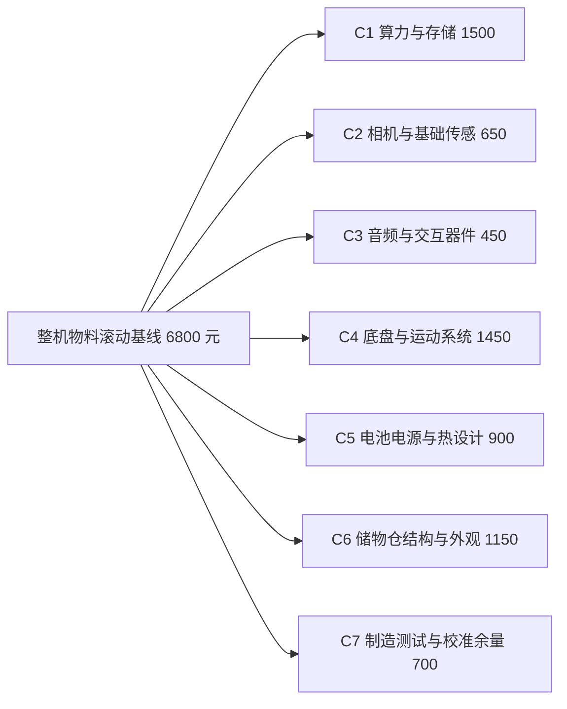
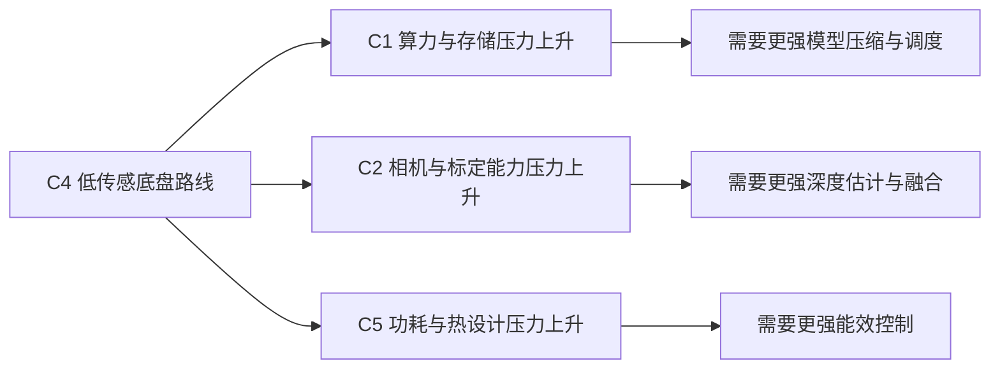
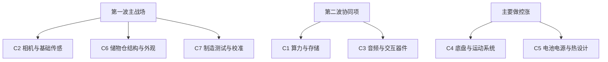
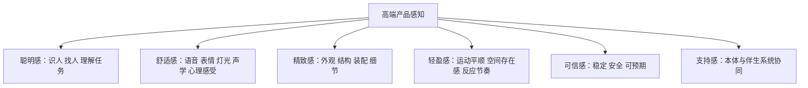

# 成本结构与技术降本路径

## 1. 文档目的

本文档是 `KBT-11` 的补充文档，用于把“整机物料成本 `6000 到 8000 元`”从口号变成可执行的工程约束。

本文档回答 4 个问题：

1. 一代整机当前的滚动成本基线应该怎么看。
2. 哪些成本桶当前压力最大，哪些成本桶更适合承担降本任务。
3. 哪些成本可以依赖技术进步持续下降，分别需要什么样的技术。
4. 哪些成本短期内不适合作为主要降本目标，应该只做“控涨”。

说明：

- 本文档是架构与工程视角下的成本分析，不是采购报价单。
- 下文所有金额均为当前阶段的滚动估计，用于约束路线，不等于最终供应商成交价。
- 除 `BOM` 之外，当前还要同步监控整机与服务组合能否支撑 `20000 到 30000 元` 的售价区间。

## 2. 当前滚动成本基线

结合 `Step21`、`Step22` 与 `Step23` 的审阅意见，当前建议把一代整机的滚动成本基线收敛为 7 个成本桶。

### 2.1 当前基线表

| 成本桶 | 当前滚动基线 | 当前监测区间 | 方向判断 | 说明 |
| --- | --- | --- | --- | --- |
| `C1 端侧算力与存储` | `1500` | `1100 到 1700` | 上行 | 受中国大算力专项、内存带宽和更重端侧模型影响，当前较上一轮提案上修约 `300` 元 |
| `C2 相机与基础传感` | `650` | `500 到 800` | 稳定 | 量产路线已收敛为双目 + 单目 `3 到 5` 个相机，自研深度估计替代昂贵深度感知硬件 |
| `C3 音频与交互器件` | `450` | `350 到 650` | 下行 | 音频器件本身成本较低，真正拉高成本的是屏幕与前脸结构耦合 |
| `C4 底盘与运动系统` | `1450` | `1200 到 1700` | 稳定但强耦合 | 当前成本量级下，底盘更可能只保留轮速计、`IMU`、超声波等简单传感器，因此会把部分能力压力转移到 `C1 / C2 / C5` |
| `C5 电池、电源与热设计` | `900` | `800 到 1100` | 上行且未冻结 | 用户明确指出当前建议区间偏低；续航 `>4h`、重模型和运动/交互功耗耦合，使其仍需单独收敛 |
| `C6 储物仓、结构与外观件` | `1150` | `900 到 1400` | 稳定 | 储物仓能力保留、机构重构和外观形态重构仍是主要影响因素 |
| `C7 制造、测试与校准余量` | `700` | `600 到 900` | 稳中可降 | 可通过自动化产测和校准流程逐步释放空间 |

当前滚动基线合计约为 `6800 元`。

### 2.2 价格带监控基线

除 `BOM` 外，当前同步增加一条产品级监控基线：

| 维度 | 当前监控区间 | 当前作用 |
| --- | --- | --- |
| `整机 BOM` | `6000 到 8000 元` | 约束器件、结构、平台与制造路线 |
| `整机售价` | `20000 到 30000 元` | 约束整机与服务组合是否仍然具备高端产品感 |

说明：

- 当前不是直接冻结售价，而是把它作为阶段门中的持续监控区间。
- 如果某轮降本虽然让 `BOM` 更好看，却明显削弱了机器人支撑 `20000 到 30000 元` 价格带的能力，这个方案也不应通过。

### 2.3 当前结构图

当前判断：

- 这份结构仍在 `6000 到 8000 元` 的目标区间内，但安全余量并不宽。
- `C1 + C5` 是当前最强的上行组合压力，而 `C4` 的低传感路线会进一步把压力传递到 `C1 / C2 / C5`。
- 如果 `C1` 最终继续突破 `1700`，或者 `C5` 接近 `1100` 上沿，则必须由 `C2 / C3 / C6 / C7` 释放成本空间来回收。

### 2.4 成本转移关系图

说明：

- `Step22` 和 `Step23` 的核心提醒是，不能把 `C4` 看成孤立成本桶。
- 如果底盘传感器被压缩到只保留简单组合，算法复杂度、视觉质量要求和整机功耗都会上移。
- 因此任何试图压低 `C4` 的方案，都必须在 `C1 / C2 / C5` 显式记账。

## 3. 成本压力与技术弹性矩阵

| 成本桶 | 当前压力 | 技术降本弹性 | 近期判断 | 中期判断 |
| --- | --- | --- | --- | --- |
| `C1` | 高 | 中 | 短期更可能上涨，而不是直接下降 | 若模型压缩、芯片集成和内存效率改善，可回收一部分成本 |
| `C2` | 中 | 高 | 当前已因去深度相机 / 激光雷达而明显受益 | 仍有继续降本空间 |
| `C3` | 中低 | 中高 | 当前已具备下行条件 | 继续依赖算法和 ID 结合优化 |
| `C4` | 中高 | 低但强耦合 | 不应作为当前主要降本战场 | 只能做温和优化，但必须显式评估对 `C1 / C2 / C5` 的转移影响 |
| `C5` | 高 | 低 | 当前核心目标是控制上涨，且基线尚未冻结 | 中期只能靠整机能效改善释放少量空间 |
| `C6` | 中 | 高 | 尚未完成机构重构，存在明显结构降本空间 | 是一代必须深挖的降本主战场 |
| `C7` | 中 | 高 | 当前仍有大量流程型成本可优化 | 自动化后有持续下降潜力 |

## 4. 哪些成本能靠技术进步降低

### 4.1 `C1 端侧算力与存储`

当前判断：

- `C1` 是当前最重要但也最危险的成本桶。
- 短期内它更像“控涨项”，不是自然降本项。
- 真正的降本，不来自“今天换一颗更便宜的芯片”，而来自“同样体验目标下，需要的算力、内存和带宽被技术压缩了”。

可以依赖的技术：

1. 端侧模型压缩：蒸馏出更适合边端的 `4B / 7B` 模型，而不是把云端模型直接搬到端侧。
2. 混合精度量化：`FP8`、部分 `INT8 / INT4` 混合量化，优先压缩显存与带宽，而不是一刀切降精度。
3. 多尺度调度：让 `R1 / R2 / R3 / R4` 按任务调用不同规模模型，避免重模型常驻全链路。
4. NPU 友好算子与编译：减少无法高效映射到国产 NPU 的算子，降低“理论算力够、实际板级成本却更高”的情况。
5. 更高集成度板级方案：主控、AI、视频编解码、ISP、接口尽量走一体化更高的路线，减少外围器件堆叠。

预计效果：

- 短期目标不是直接把 `C1` 拉低，而是把“继续上涨 `300 到 500 元`”压回到可控区间。
- 中期如果边端模型和板级集成做得足够好，`C1` 才有机会释放 `150 到 350 元`。

### 4.2 `C2 相机与基础传感`

当前判断：

- `C2` 是当前最值得靠算法换硬件的降本项之一。
- 一代已经明确不把深度相机和激光雷达带入量产主线，这本身就是最大的结构性降本动作。

可以依赖的技术：

1. 单目 / 双目深度估计：用自研深度模型替代专用深度器件。
2. 多目几何融合：把双目和单目相机在多视角下联合使用，降低对昂贵主动传感器的依赖。
3. 自动标定与在线校正：减少高精度定制支架和高人工校准成本。
4. 低光 ISP 和图像增强：降低为了夜间鲁棒性而被迫选更贵模组的压力。

预计效果：

- 与“量产继续保留深度相机 / 激光雷达”的路线相比，`C2` 有机会释放 `200 到 500 元` 甚至更多。
- 这条路线的前提是算法和校准能力必须跟上，否则只是把成本从硬件转移到事故风险。

### 4.3 `C3 音频与交互器件`

当前判断：

- `C3` 并不主要受麦克风成本影响，主要受屏幕、前脸结构和交互外观耦合影响。
- 因此它不是纯器件问题，而是算法、交互形态和工业设计的耦合问题。

可以依赖的技术：

1. 更强的波束形成、AEC、降噪和远场识别，允许麦阵不过度堆通道数。
2. 多模态 UI 重分配：把一部分复杂交互迁移到手机 App 或语音完成，减轻对大尺寸高规格显示屏的依赖。
3. 轻量本地唤醒与音频前处理：减少为了语音效果而堆更高规格音频外围的压力。

预计效果：

- `C3` 有现实的 `100 到 250 元` 降本空间。
- 但如果外观坚持大屏、高亮、高品质前脸表达，这部分空间会被重新吃掉。

### 4.4 `C4 底盘与运动系统`

当前判断：

- `C4` 是性能底线项，不适合作为主要降本战场。
- 底盘一旦降错，后面所有体验都要交学费。
- `Step22` 和 `Step23` 进一步确认，当前成本量级下，底盘传感器更可能被压缩到轮速计、`IMU`、超声波等简单组合，因此 `C4` 的压缩并不免费。

可以依赖的技术：

1. 更稳的视觉惯导与轮速融合，让底盘少依赖额外传感器补丁。
2. 更好的运动控制和门槛通过策略，减少为极端场景过度堆叠机械裕量。
3. 电机、驱动和线束的一体化设计，减少零件数和装配复杂度。

预计效果：

- `C4` 只能做温和优化，预计可释放 `100 到 200 元`。
- 这部分收益不应建立在可靠性、静音性和门槛通过能力被削弱的前提上。
- 任何试图继续压低 `C4` 的动作，都必须同步展示其给 `C1 / C2 / C5` 带来的新增成本与新增风险。

### 4.5 `C5 电池、电源与热设计`

当前判断：

- `C5` 是当前第二个明显上行的成本桶。
- 它短期内更像“必须稳住”的成本，而不是“可以主动挖很多”的成本。
- `Step22` 指出当前 `C5` 建议区间偏低，`Step23` 进一步确认当前只给工作区间，不把它当成已冻结成本。

可以依赖的技术：

1. 动态功耗管理：按 `OODA Scale Scheduler` 做功耗域调度，降低重模型常开时间。
2. `DVFS` 与电源域门控：让不同时刻只保留必要器件处于高功耗状态。
3. 热设计协同优化：用更好的导热路径、风道和结构共用，避免为了热失控被迫堆料。
4. 事件触发式感知：不是所有传感器和模型都始终以最高档位运行。

预计效果：

- `C5` 的主要价值是抑制上涨，现实目标更接近“少涨 `100 到 200 元`”，而不是大幅降本。
- 因此 `C5` 不应被当成主要降本责任桶。
- 这里不仅是硬件问题，运动策略、交互策略、模型调度和待机策略都会显著影响 `C5`。

### 4.6 `C6 储物仓、结构与外观件`

当前判断：

- `C6` 是一代最值得深挖的降本主战场之一。
- 原因不是它今天一定最贵，而是它仍在重构中，可通过架构、机构和 DFM 同时释放空间。

可以依赖的技术：

1. 结构功能合并：让一块结构件同时承担外观、声学、安装或散热辅助功能。
2. 零件数压缩：减少支架、连接件、装饰件和非必要开合机构。
3. 储物仓机构简化：避免为“看起来高级”而引入对一代价值不大的复杂机构。
4. DFM / DFMA：从工业设计阶段就按模具、装配、维修和公差做约束。

预计效果：

- `C6` 有机会释放 `150 到 400 元`。
- 但前提是工业设计、结构设计和产品定义同步收敛，而不是各自独立优化。

### 4.7 `C7 制造、测试与校准余量`

当前判断：

- `C7` 是最典型的“靠工程技术和流程自动化持续降本”的成本桶。
- 这部分如果不提早设计，后期只能靠人海战术填坑。

可以依赖的技术：

1. 自动化相机和麦阵校准。
2. 出厂自检与在线自校验能力。
3. 软件定义产测：统一烧录、统一参数下发、统一日志采集。
4. 产线视觉检测与治具复用。

预计效果：

- `C7` 有现实的 `100 到 300 元` 释放空间。
- 且这部分节省通常不会明显伤害用户体验，是优先级很高的降本路径。

## 5. 结论：哪些桶是主战场，哪些桶只做控涨

### 5.1 降本优先级排序

### 5.2 当前建议

1. `C2 / C6 / C7` 作为一代显式降本主战场。
2. `C1` 以“模型压缩 + 板级集成 + 调度优化”做中期降本，但短期目标先定义为控涨。
3. `C3` 用交互形态和算法共同优化，不单独追求器件极限压价。
4. `C4 / C5` 主要负责不失控，不承担主要降本责任。
5. 任何 `C4` 降本方案都必须显式展示其对 `C1 / C2 / C5` 的成本转移。
6. `C5` 需要单独的功耗预算与能效策略议题来完成冻结。

### 5.3 高端产品感知护栏

结合 `对 Codex 的要求` 第 10 条，当前还需要明确一个容易被忽略的约束：

- 一代机器人不是只要把 `BOM` 压进 `6000 到 8000 元` 就算成功。
- 机器人整机与服务组合还必须让用户感受到它是“聪明、温暖、精致”的，并且能够支撑 `20000 到 30000 元` 售价区间中的高端产品认知。

因此当前把 6 条护栏固定下来：

1. 不能为了压 `C3 / C6`，把前脸、屏幕、灯光和交互表达做成廉价 IoT 感。
2. 不能为了压 `C4`，把运动体验做得迟钝、噪声大、过门槛差或明显缺乏轻盈感。
3. 不能为了压 `C1 / C2`，让机器人在找人、识人、导航、理解指令时表现出明显“笨”的感觉。
4. 不能把关键陪伴体验过度外包给手机 App，否则舒适感和被支持感会被削弱。
5. 结构、声学、屏幕、灯光、语音、动作要作为一个整体组合评估，而不是各桶局部最优。
6. 任何显著降本动作，都要同时回答“是否还撑得住高端产品感知和 `20000 到 30000 元` 的售价区间”。

### 5.4 高端产品感知的 6 个主观维度

说明：

- 这 6 个维度不是营销修辞，而是后续每一轮降本和选型都要过的组合检查表。
- 如果某次降本动作明显损伤其中 2 个以上维度，就不应只因 `BOM` 更低而被接受。
- `安静感` 当前作为 `舒适感` 与 `轻盈感` 的交叉观察面。
- `宽敞感` 当前作为 `轻盈感` 与 `精致感` 的交叉观察面，用于判断机器人在家庭空间中的高端存在感。

## 6. 本轮补充的外部技术输入

以下资料主要用于判断“哪些技术路线具备现实基础”，并据此推断哪些成本桶有机会被技术进步压低：

1. 地瓜机器人 `S100 / S100 Pro` 系列的当前路线判断，说明中国端侧大算力平台已经足以进入一代主线评估，这对 `C1` 的长期收敛与 `TTFT / TPS` 验证有意义。
2. [`FP8 Formats for Deep Learning`](https://arxiv.org/abs/2209.05433) 说明 `FP8` 可在多类模型上接近 16 位结果质量，是 `C1` 控涨的重要技术基础。
3. [`Depth Anything V2`](https://arxiv.org/abs/2406.09414) 显示单目深度模型在效率和精度上已经显著进步，是 `C2` 降本的重要技术基础。

## 7. 当前建议的后续动作

1. `KBT-29` 已完成成本结构主线收口，后续继续以本地文档维护滚动变化，并把 `Step22` 与 `Step23` 的修正作为正式基线。
2. 单独拉起“整机功耗预算与能效控制策略”议题，用来冻结 `C5` 的工作基线、目标区间和变更触发条件。
3. 在 `G2` 前形成首版“滚动 BOM 看板”，每月评审一次 `C1 / C5` 上行压力和 `C2 / C6 / C7` 的回收进度。
4. 端侧算力专项评估必须同时带上“模型压缩与量化结果”，不能只比较裸芯片规格。
5. 工业设计、结构、声学、热设计和产测必须一起进入成本收敛讨论，不允许只由采购端单独压价。
6. 自本轮起，每次显著降本方案评审都要附带一页“高端产品感知检查表”，并同步判断是否还能支撑 `20000 到 30000 元` 售价区间。
