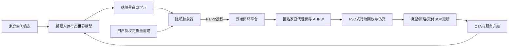
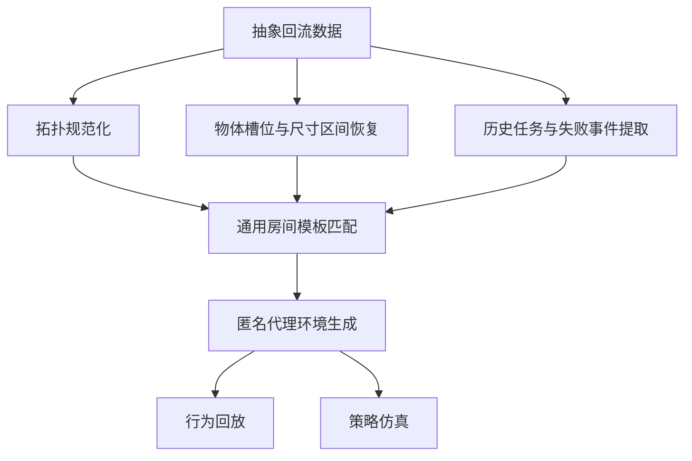

# 家庭机器人夜间稳态定位与任务闭环方案

---

文档版本：v1.0
创建日期：2026-03-09
作者：GPT5.4Pro-工程专家

---

## 1. 执行摘要

家庭机器人在夜间不开灯场景中的核心矛盾，不是“模型还不够大”，而是以下四件事同时成立：

1. **低照度让视觉表观失真**：噪声、模糊、色偏、曝光不稳、重复纹理、玻璃反光，会把原本白天可用的特征体系打碎。
2. **每个家庭都是独立域**：地板材质、墙面纹理、夜灯色温、家具反射、动线结构都不同，靠一个通用模型包打天下，基本是做梦。
3. **原始音视频不能默认上云**：家庭机器人一旦把用户家变成云端视频仓库，隐私上迟早出事，产品上迟早翻车。
4. **机器人本质上是做任务，不是做测绘**：用户要的是“夜里不开灯也能找到水杯/遥控器/药盒”，不是看一张漂亮点云图。

因此，本方案主张建立一套**四段式闭环体系**：

- **端侧昼夜同轨自学习**：在机器人本地完成家庭域内的低光适配，默认不上传原始数据。
- **家庭空间锚点增强**：将 AprilTag 类能力产品化为装饰型锚点，给世界埋少量常量。
- **用户授权高质量重建**：对愿意参与改进计划的用户，进行交付期或售后期的高质量重建与有限上传。
- **匿名家庭代理世界（AHPW）**：云端不还原用户真实家庭视觉信息，而是用抽象结构与通用素材重建“任务因果可复现”的代理世界，用于回放、诊断、仿真和策略迭代。

> **方案立场**：系统记住的不是“这个家长什么样”，而是“这个家如何约束机器行动”。

这不是“纯模型”路线，也不是“纯服务”路线，而是**算法、交付、隐私协议、仿真平台四件事一起成立**的系统工程路线。

---

## 2. 问题定义与目标

### 2.1 问题定义

家庭机器人夜间稳态运行，面对的是一个典型的多约束系统问题：

- **感知约束**：夜间噪声高、细节少、模糊大，RGB 表观与白天严重失配。
- **运动约束**：狭窄通道、反光表面、镜面、地毯/地板切换、杂物遮挡，会让里程计和视觉都不稳定。
- **任务约束**：机器人并不是随机巡航，而是在执行高频、重复、目标明确的任务路径。
- **隐私约束**：家庭场景包含高度敏感的个人生活信息，默认不应上传可逆原始观测。
- **产品约束**：交付、售后、客服、远程诊断必须能用，不能把所有问题都甩给算法团队。
- **经济约束**：不能把每个用户家都当实验室全量扫描一次，更不能靠高成本服务才能让系统可用。

### 2.2 目标

本方案的目标不是追求“全真数字孪生”，而是实现以下四件事：

1. **夜间不开灯条件下的稳态定位与任务执行**  
2. **默认隐私优先、原始数据不上云的产品闭环**  
3. **基于抽象数据的可回放、可诊断、可仿真的代理世界**  
4. **把交付与售后转化为数据与稳定性优势，而不是成本黑洞**

### 2.3 非目标

以下方向明确不是本方案追求的目标：

- 不追求还原用户家庭的真实视觉外观
- 不追求“没有任何世界改造就必须完美运行”的宗教式纯智能
- 不把空间锚点设计成系统不可或缺的前提条件
- 不把家庭机器人做成房屋测绘工具
- 不以“模型优化”为名默认收集原始家庭视频音频

---

## 3. 方案原则

### 3.1 三个基本立场

#### 立场一：**任务优先，不是建图优先**
系统最终要解决的是“在这个家里把任务做成”，而不是“把这个家画得像”。

#### 立场二：**保留结构，不保留生活内容**
可以回流的是任务相关结构、行为与失败条件；不该回流的是可识别的家庭视觉细节与生活隐私。

#### 立场三：**允许世界中存在常量**
给家庭环境植入少量稳定锚点，不是妥协，而是工程成熟。

### 3.2 必须拒绝的三种幻觉

1. **纯模型幻觉**：以为所有夜间问题都能靠一个大模型自己学会。  
2. **数据殖民幻觉**：以为只要多拿用户原始家庭数据，系统就会自然变好。  
3. **测绘审美幻觉**：以为点云、网格、轨迹图就是产品能力本身。  

---

## 4. 总体架构



### 4.1 架构分层

| 层级 | 核心职责 | 默认位置 |
|---|---|---|
| 运行层 | 感知、定位、规划、任务执行 | 端侧 |
| 学习层 | 昼夜配对、自适应、地图质量更新、风险图更新 | 端侧 |
| 增强层 | 锚点标定、家庭域常量、服务校准 | 端侧 + 交付 |
| 闭环层 | 抽象回流、代理世界生成、行为回放、仿真验证 | 云端 |
| 运维层 | 交付、客服、售后、远程诊断、OTA | 服务体系 |

### 4.2 一句话描述

- **端侧**负责学“这个家夜里怎么变坏”。  
- **锚点**负责给系统提供少量稳定常量。  
- **服务**负责在关键用户中采到高价值高质量样本。  
- **云端**负责把抽象数据变成可解释、可仿真的代理世界。  

---

## 5. 第一层闭环：端侧昼夜同轨自学习

这是整个体系的主体。没有这层，其他都只是补丁。

### 5.1 数据来源

端侧自学习的核心数据，不来自“用户主动采集”，而来自机器人自然运行中的**重复任务路径**：

- 白天与夜晚重复经过同一路径
- 同一房间在不同时间段被多次访问
- 同一任务（如找遥控器、找水杯、去厨房、回充）反复出现
- 夜间偶尔抓取的低频高质量重定位帧（如长曝/微补光一帧）

### 5.2 端侧要学什么

端侧不是去“重新训练一个大模型”，而是学习几个高收益、小体量、可控的模块：

1. **家庭域内地点表征适配器**  
   - 学会白天/夜间对同一地点的表观不变性
   - 对每个家庭形成局部 place embedding 校准

2. **特征稳定性评分器**  
   - 哪些区域、材质、视角在低光下仍稳定
   - 哪些区域夜里特征会塌陷、需要避免依赖

3. **夜间模式触发策略**  
   - 何时只靠 IMU/里程计递推
   - 何时抓一帧低频高质量观测做重定位
   - 何时必须减速、保守规划、甚至停止

4. **家庭风险图与任务路径先验**  
   - 哪些地方容易漂移
   - 哪些走法更稳
   - 某类目标通常出现在哪些区域

### 5.3 学习方式

建议采用**冻结大骨干 + 本地小适配器/校准头**的方案，而不是在端上大规模微调：

- 冻结通用 backbone
- 本地更新轻量 adapter / projector / reliability head
- 背景训练只在回充、空闲、温控允许时运行
- 维护回滚机制，避免一次错误学习污染整张家庭地图
- 使用保留集验证，防止灾难性遗忘

### 5.4 端侧输出什么抽象数据

默认不上云的前提下，端侧仍然可以产出对闭环极有价值的摘要信息：

- 位姿图与回环成功/失败统计
- 区域级特征质量分布
- 曝光/噪声/模糊摘要参数
- 任务轨迹与停顿/犹豫点
- 失败事件窗口（前后数秒的摘要，而非原始视频）
- 可通行空间比例与狭窄通道分布
- 家庭内风险区域评分

### 5.5 端侧学习的边界

端侧自学习必须受四个边界约束：

- **只学任务相关的抽象，不学可逆生活内容**
- **只在本家庭域内适配，不污染全局模型**
- **只更新小模块，不动高风险大骨干**
- **必须可回滚、可禁用、可清空**

---

## 6. 第二层闭环：家庭空间锚点增强

### 6.1 为什么必须引入锚点

家庭机器人行业常见的坏毛病，是把“零世界改造”当成某种道德洁癖。现实是：

- 家庭本来就是人设计的环境
- 机器人是要在人的环境中稳定工作
- 给环境植入少量机器可识别常量，完全合理

所以，**锚点不是羞于启齿的妥协，而是稳定性的工程杠杆**。

### 6.2 产品化形态

不要对用户讲 “AprilTag”。对用户讲的是：

- 定位相框
- 房间识别牌
- Home Anchor
- 空间锚点贴
- 门牌/冰箱贴/装饰卡

### 6.3 建议形态

| 形态 | 适用位置 | 特点 |
|---|---|---|
| 装饰相框 | 客厅、走廊 | 远看是装饰，近看可识别 |
| 房门铭牌 | 卧室、书房、储物间 | 与房间语义天然绑定 |
| 冰箱贴/磁吸卡 | 厨房、餐厅 | 成本低、安装简便 |
| 墙贴/挂件 | 玄关、楼梯口 | 易于布置在关键拓扑节点 |

### 6.4 部署原则

不需要全屋贴满。通常 **3–6 个锚点** 已足够形成稳定的世界系常量。

优先部署位置：

- 玄关或客厅主视角
- 走廊/连接区
- 厨房
- 卧室入口
- 楼梯上下口（如有）

部署原则：

- 高可见、低遮挡
- 避开镜面和强反光
- 绑定拓扑关键节点，而不是平均撒点
- 由交付人员协助安装、校准、验收

### 6.5 技术价值

空间锚点的价值不只是“定个位”：

- 地图初始化世界系
- 长期漂移校正
- 重建设备迁移
- 售后远程诊断基准
- 多次重建对齐
- 任务路径快速复位

### 6.6 原则边界

锚点的正确定位是：

> **增强器，不是拐杖。**

系统不应变成“没贴锚点就不能用”。  
但系统也不该假装“贴锚点没有价值”。

---

## 7. 第三层闭环：用户授权高质量重建

默认模式下，原始数据不上云；但对愿意参与改进计划的用户，必须建立高质量数据通道。否则系统永远只有边角料，没有标杆样本。

### 7.1 用户分层计划

| 计划 | 对象 | 默认上传 | 原始数据 | 价值 |
|---|---|---|---|---|
| P0 默认隐私模式 | 所有用户 | 匿名质量统计（可选） | 不上传 | 基础盘，建立信任 |
| P1 增强改进计划 | 愿意帮助优化的用户 | 抽象特征、位姿、失败摘要 | 不上传或极少 | 主力闭环层 |
| P2 深度共创计划 | 少量高价值用户 | 抽象数据 + 受控高质量重建结果 | 仅在明确授权下有限上传 | 标杆数据层 |

### 7.2 适合进入 P2 的用户

- 夜间任务频繁、价值高的家庭
- 楼层多、结构复杂、夜间失败高发的家庭
- 愿意参与产品改进计划的核心用户
- 能代表关键户型/材质/光照类型的样本家庭

### 7.3 上门高质量重建 SOP

#### 第一步：拓扑与功能区域建模
获取房间连通关系、关键门洞、狭窄通道、楼梯、主要家具布局。

#### 第二步：锚点安装与标定
部署装饰型锚点，建立家庭世界系常量。

#### 第三步：多时段采集
至少包含：

- 白天自然光
- 夜间无灯
- 夜灯/微光

#### 第四步：任务路径采集
不是拍“全屋漫游”，而是拍机器人真正要执行的路径：

- 玄关 → 客厅
- 客厅 → 厨房
- 卧室 → 客厅
- 回充路径
- 找物任务常走路径

#### 第五步：端云分层抽象
默认只保留抽象结构与诊断结果；只有在明确授权下，才保留少量受控原始样本。

### 7.4 为什么这层重要

这一层不是补充数据采集，而是建立**高质量冷启动样本库**和**高价值服务壁垒**。  
未来真正有壁垒的家庭机器人，不只是卖硬件，而是在卖：

- 家庭世界初始化能力
- 长期数字记忆维护能力
- 行为系统诊断能力
- 用户家庭域内的稳定性服务能力

---

## 8. 轻量真值体系

### 8.1 目标

在不引入高昂成本和重型设备的前提下，为夜间定位与回放提供足够可用的“真值近似”。

### 8.2 三档方案

| 档位 | 手段 | 成本 | 精度 | 用途 |
|---|---|---:|---|---|
| GT-1 | 昼夜同轨复拍 | 低 | 中 | 建立昼夜配对与路径对齐 |
| GT-2 | 装饰型锚点 + 手机 AR/稀疏位姿 | 中 | 中高 | 稀疏世界系约束、失败点定位 |
| GT-3 | 上门高质量重建（可含深度/LiDAR） | 高 | 高 | 标杆样本、代理世界高保真初始化 |

### 8.3 为什么足够

家庭级闭环不需要每个家都做毫米级测绘。  
**任务因果需要的是“足够解释失败的真值”，不是“漂亮到能做房地产漫游的真值”。**

---

## 9. 数据分层、隐私边界与机器记忆伦理

### 9.1 数据分类

| 数据类型 | 示例 | 默认存储 | P1 | P2 |
|---|---|---|---|---|
| 原始 RGB / 音频 | 视频、照片、语音 | 端侧短期缓冲 | 不上传 | 仅明确授权且有限上传 |
| 几何与拓扑摘要 | 位姿图、房间连通图、占据统计 | 端侧 | 可量化上传 | 可上传 |
| 感知质量摘要 | 特征数量、噪声参数、模糊评分、照度分桶 | 端侧 | 可上传 | 可上传 |
| 行为轨迹摘要 | 任务路径、停顿点、重定位事件、失败点 | 端侧 | 可上传 | 可上传 |
| 语义记忆 | 目标物常出现区域、房间用途 | 端侧 | 默认不上云 | 仅聚合或明确授权 |
| 锚点观测 | 锚点可见性、识别成功率、位置置信度 | 端侧 | 可上传 | 可上传 |

### 9.2 抽象化原则

1. **不可逆**：上传的摘要不能被轻易还原为真实家庭外观  
2. **最小必要**：只保留对定位、任务、诊断有价值的信息  
3. **时间降精度**：避免形成过细粒度生活作息日志  
4. **空间降纹理**：保留结构与尺寸区间，不保留真实纹理  
5. **可删除可审计**：用户可撤回授权、清空地图、删除历史  

### 9.3 建议的隐私机制

- 特征摘要量化/随机投影
- 时间戳桶化（如 15 分钟粒度）
- 房间面积、尺寸分箱而非精确值
- 通用资产替换真实家具外观
- 原始数据默认仅端侧短期缓冲
- P2 原始样本云端最短保留后清除，仅保留衍生匿名结果

### 9.4 机器记忆伦理

> 机器不应记住“用户家里那张桌子长什么样”，  
> 机器应记住“这类桌子在这个拓扑位置如何影响我的任务”。

这是消费级家庭机器人的底线。  
否则所谓“学习”，本质上就会滑向“监控”。

---

## 10. 匿名家庭代理世界（AHPW）

### 10.1 定义

**AHPW（Anonymous Home Proxy World）** 是一种隐私去识别、任务可复现、策略可仿真的代理环境。  
它不是用户家庭的数字孪生，而是一个由抽象结构和通用素材合成的**匿名代理世界**。

### 10.2 AHPW 的目标

AHPW 必须同时满足三点：

1. **任务保真**：能够复现机器人为什么成功/失败  
2. **隐私去识别**：不能还原用户家的真实视觉信息  
3. **策略可验证**：能够注入不同策略做 A/B 仿真  

### 10.3 输入数据

AHPW 的输入来自端侧抽象回流与 P2 高质量样本：

- 房间拓扑与连通关系
- 可通行空间与狭窄通道统计
- 物体类别簇、数量级、尺寸区间
- 动态障碍概率与热点区域
- 锚点位置与可见性统计
- 历史任务轨迹、停顿点、失败点
- 感知质量摘要（噪声、模糊、照度、反光风险）
- 目标物常见区域分布

### 10.4 生成流程



### 10.5 生成原则

- 房间结构可保留，但视觉纹理必须替换
- 家具使用通用资产，不使用用户真实外观
- 物体数量和尺寸保留区间，不保留精确形态
- 任务轨迹保留因果关系，但时间做模糊处理
- 风险区域与失败条件必须尽可能保真

### 10.6 AHPW 的三个层级

| 层级 | 内容 | 用途 |
|---|---|---|
| AHPW-Lite | 2D 拓扑图 + 占据图 + 热区 + 轨迹 | 快速诊断与客服使用 |
| AHPW-Blockout | 3D 体块 + 通用资产 + 锚点 + 任务回放 | 研发分析与售后说明 |
| AHPW-Sim | 加入照明/噪声/动态障碍模型的可仿真环境 | 策略验证与 A/B 测试 |

### 10.7 一个典型例子

夜间找水杯失败，不需要复原用户家真实茶几长什么样；  
但必须复原以下代理事实：

- 客厅到厨房之间存在一段 70cm 左右窄通道
- 通道右侧有高反光柜门
- 该区域夜间照度低于某阈值
- 历史轨迹在这里经常发生重定位失败
- 机器人在此处容易发生 yaw 漂移累积
- 水杯任务在过去多数时候会先去厨房而非先扫客厅

只要这些因果条件复原出来，系统就能真正被改进。

---

## 11. 三态统一世界模型

不要把“地图”“回放”“仿真”拆成三套互不相干的产物。应建立统一世界表达，只是在不同阶段使用不同视角。

| 世界模型 | 位置 | 内容 | 主要使用者 |
|---|---|---|---|
| Runtime World Model | 端侧运行时 | 当前可通行图、拓扑节点、锚点、局部语义、风险图 | 机器人在线系统 |
| Replay World Model | 云端回放时 | 代理空间、历史轨迹、失败点、决策时间轴 | 算法/产品/客服/售后 |
| Simulation World Model | 云端仿真时 | 可注入策略与扰动的代理世界 | 算法/验证/交付策略团队 |

### 11.1 三态统一的价值

- 避免运行逻辑、诊断逻辑、仿真逻辑各说各话
- 让问题复现、策略验证、上线部署使用同一套世界语义
- 降低“研发看得懂、售后看不懂”的沟通成本

---

## 12. 从测绘模型到 FSD 式行为回放界面

### 12.1 目标

界面的目标不是“展示地图”，而是**解释行为**。  
真正需要的是一个**行为解释器**，而不是一个 SLAM 工具窗口。

### 12.2 界面结构建议

#### 左侧：代理世界视图
- 房间轮廓
- 可通行区
- 通用资产占位模型
- 锚点位置
- 轨迹与高风险热区

#### 右侧：行为时间轴
- 任务开始
- 目标解析
- 路径选择
- 减速/犹豫
- 重定位触发
- 锚点确认
- 失败/成功
- 用户介入

#### 底部：诊断条
- 当前照度分桶
- 特征质量评分
- 里程计漂移估计
- IMU 置信度
- 重定位候选数
- 失败原因排序

#### 模式切换
1. **运行回放模式**：机器人当时如何理解世界  
2. **诊断模式**：系统哪里长期不稳  
3. **改进仿真模式**：如果加锚点/换路径/启用夜间策略会怎样  

### 12.3 为什么称为 FSD 式

“FSD 式”不是模仿自动驾驶的皮相，而是学习它的核心价值：  
**把黑盒感知与决策翻译成连续的、可检查的、可追责的行为叙事。**

### 12.4 与传统 SLAM 界面的差异

| 传统测绘/SLAM 界面 | FSD 式行为回放界面 |
|---|---|
| 强调点云/网格精度 | 强调任务因果与行为解释 |
| 研发能看，产品和售后看不懂 | 跨团队可共用 |
| 适合调算法局部模块 | 适合理解整条任务链 |
| 难以表达“为什么失败” | 可表达“看到了什么、怎么决定、为何失败” |

---

## 13. 端到端闭环流水线

### 13.1 运行态

机器人在线执行任务时：

1. 视觉 + IMU + 里程计做常规定位
2. 进入低光不稳区时触发夜间策略
3. 必要时抓取低频高质量重定位帧
4. 在锚点可见区域做快速校正
5. 记录任务轨迹、失败点和感知质量摘要

### 13.2 学习态

机器人在空闲/回充时：

1. 挖掘昼夜同轨样本
2. 更新家庭域适配器与风险图
3. 验证学习结果是否优于旧版本
4. 通过后替换本地小模块；否则回滚

### 13.3 回流态

在 P1/P2 授权下：

1. 抽象器导出结构化摘要包
2. 经过隐私降精度与不可逆处理
3. 上传云端闭环平台

### 13.4 云端闭环态

云端平台完成：

1. 多家庭抽象数据聚合
2. 典型失败模式聚类
3. AHPW 生成
4. 行为回放与人工诊断
5. 策略仿真与 A/B
6. 模型/阈值/路径策略/锚点建议更新
7. OTA 或服务 SOP 回灌端侧

---

## 14. 抽象数据包示意

```json
{
  "home_hash": "b84f9a2e",
  "consent_tier": "P1",
  "room_graph": [
    {
      "id": "living_room",
      "neighbors": ["corridor", "kitchen"],
      "area_bin_m2": "15-25"
    },
    {
      "id": "corridor",
      "neighbors": ["living_room", "bedroom"],
      "narrow_width_cm_bins": ["65-75"]
    }
  ],
  "free_space": {
    "traversable_ratio": 0.64,
    "blocked_zone_count": 3,
    "dynamic_obstacle_hotspots": ["living_room_table_edge"]
  },
  "object_slots": [
    {"class": "table", "count": 1, "size_bin": "120x60x75"},
    {"class": "cabinet", "count": 2, "reflective": true},
    {"class": "small_object_cluster", "count": 4, "region": "living_room"}
  ],
  "anchors": [
    {"id": "A1", "type": "wall_frame", "room": "corridor", "visibility": 0.83}
  ],
  "task_trace": {
    "task_type": "find_water_cup",
    "path_nodes": ["living_room", "corridor", "kitchen"],
    "hesitation_points": 2,
    "relocalization_events": 1
  },
  "failure_events": [
    {
      "type": "night_relocalization_failure",
      "region": "corridor_mid",
      "lux_bin": "<5",
      "feature_quality": 0.31,
      "estimated_yaw_drift_deg": 12,
      "preceding_window_s": 10
    }
  ],
  "sensor_profile": {
    "blur_score": 0.42,
    "noise_profile_cluster": "low_light_cluster_07",
    "exposure_mode": "auto"
  },
  "privacy": {
    "texture_reconstruction": "disabled",
    "timestamp_precision": "15min",
    "embedding_policy": "quantized_random_projection"
  }
}
```

---

## 15. 交付、客服与售后 SOP

### 15.1 交付阶段

交付不应只完成“设备联网和首图建立”，而应完成：

- 用户隐私模式说明（P0/P1/P2）
- 锚点增强包介绍与安装
- 昼间基础路径建立
- 典型任务路径演示
- 端侧自学习说明：机器人会在本地逐步适应这个家

### 15.2 首周适配期

建议将交付后首周定义为**家庭域适配窗口**：

- 自动采集昼/夜重复路径
- 建立初始风险图
- 识别是否需要建议增加锚点
- 初步判断该家庭是否值得进入 P1/P2

### 15.3 客服远程诊断

客服/售后不应面对原始日志堆，而应看到：

- 代理世界简图
- 任务回放
- 失败热区
- 锚点可见性
- 感知质量变化
- 建议动作（加锚点/更新策略/上门复访）

### 15.4 复访与升级

对反复失败的用户：

1. 先远程基于 AHPW 做诊断  
2. 再决定是否：
   - OTA 参数调整
   - 建议补充锚点
   - 安排上门高质量重建
   - 升级至 P2 计划  

---

## 16. 指标体系

### 16.1 定位与感知指标

| 指标 | 说明 |
|---|---|
| 夜间重定位成功率 | 低照度下成功恢复全局位姿的比例 |
| 回环成功率 | 重复路径中正确闭环比例 |
| 局部漂移累计 | 任务路径中的相对漂移量 |
| 特征稳健性评分 | 夜间区域级特征可用性 |
| 锚点可见性与命中率 | 锚点在关键节点的识别效果 |

### 16.2 任务指标

| 指标 | 说明 |
|---|---|
| 夜间任务成功率 | 在不开灯条件下完成目标任务的比例 |
| 平均任务耗时 | 与白天基线比较 |
| 用户介入率 | 需要用户纠正/帮助的频次 |
| 失败热点集中度 | 失败是否集中于少数可治理区域 |
| 重试/回退次数 | 路径或策略保守程度的体现 |

### 16.3 服务与闭环指标

| 指标 | 说明 |
|---|---|
| P1/P2 参与率 | 数据改进计划的用户渗透 |
| 锚点安装率 | 增强包真实落地情况 |
| 诊断到修复时长 | 从问题出现到策略修复的周期 |
| 代理世界复现率 | AHPW 能否重演真实失败因果 |
| OTA 改善兑现率 | 更新是否实际改善目标问题 |

### 16.4 隐私与信任指标

| 指标 | 说明 |
|---|---|
| 原始数据默认不上云覆盖率 | 基础隐私承诺是否被坚守 |
| 可撤回/可清空执行成功率 | 用户删除与撤权是否可信 |
| 抽象重构攻击风险 | 上传摘要被还原为真实家庭的可能性 |
| 授权透明度投诉率 | 用户是否理解数据边界 |

---

## 17. 组织与职责建议

| 团队 | 核心职责 |
|---|---|
| 产品 | 用户计划设计、交付话术、FSD式界面定义、任务优先级 |
| 算法 | 端侧自学习、锚点融合、AHPW 生成、策略仿真 |
| 平台 | 数据抽象管线、权限管理、代理世界服务、实验平台 |
| 交付/售后 | 锚点安装、复访重建、异常复盘、用户教育 |
| 法务/隐私 | 授权条款、数据保留策略、删除与审计机制 |
| 运营 | 试点用户招募、分层计划维护、NPS 与转化跟踪 |

---

## 18. 实施路线图

### Phase 0：最小可行验证（0–6 周）
目标：先证明“端侧抽象回流 + 代理世界回放”这条链是通的。

交付物：

- 端侧摘要包导出能力
- 昼夜同轨样本挖掘
- AHPW-Lite
- 基础回放界面
- 3 款锚点原型
- 交付与授权脚本 v1

### Phase 1：小规模试点（6–12 周）
目标：在有限家庭中验证夜间稳态提升和诊断价值。

交付物：

- P0/P1 计划上线
- 锚点安装 SOP
- 风险图与夜间策略触发器
- 失败聚类与代理世界批量生成
- 客服/售后回放工具 v1

### Phase 2：代理世界与服务闭环成形（3–6 个月）
目标：形成真正可用的闭环系统。

交付物：

- AHPW-Blockout
- FSD 式回放界面
- 上门重建 SOP
- P2 深度共创计划
- A/B 仿真平台 v1
- 锚点推荐策略

### Phase 3：规模化优化（6–12 个月）
目标：把闭环变成规模化稳定性优势。

交付物：

- AHPW-Sim
- 跨家庭失败模式库
- 夜间策略自动推荐
- 交付评分与复访触发系统
- 模型/策略/服务一体化发布机制

---

## 19. 7 天 MVP 试点建议

在正式大规模立项前，可以先做一个极小试点，验证这条路线不是空想。

### 19.1 试点对象

- 10–20 个愿意配合的家庭
- 至少覆盖 2–3 种典型户型
- 至少覆盖 2 种夜间光照风格（无灯/夜灯）

### 19.2 试点动作

1. 端侧记录昼夜重复路径  
2. 部分家庭安装 3 个锚点  
3. 导出抽象摘要包，不上传原始视频  
4. 云端手工/半自动生成 AHPW-Lite  
5. 针对典型失败做 1 轮策略修复  
6. 观察修复后夜间成功率变化  

### 19.3 试点退出条件

- 能否用 AHPW 解释至少 70% 的典型失败
- 能否观察到锚点增强对定位稳定性的可测收益
- 能否在不上传原始视频的前提下完成远程诊断
- 客服/售后是否能看懂回放界面并提出可执行动作

---

## 20. 反模式与红线

### 20.1 反模式一：迷信“纯模型一把梭”
夜间、反光、窄通道、动态障碍、用户家独特材质叠在一起，纯 RGB 端到端神话很容易破功。  
承认工程边界，不丢人。

### 20.2 反模式二：把原始家庭数据当增长资产
这条路最开始看起来效率高，最后一定在隐私、品牌和合规上付出代价。  
别把家庭机器人做成披着智能外衣的监控设备。

### 20.3 反模式三：把锚点当“可有可无的小赠品”
如果只是随手送一个贴纸，用户不会认真装，团队也不会认真验收。  
锚点必须被纳入交付 SOP，而不是营销彩蛋。

### 20.4 反模式四：只采空间，不采任务
机器人不是房产测绘车。  
没有任务路径、失败事件和用户介入信息，再漂亮的地图也只是摆设。

### 20.5 反模式五：把界面停留在点云审美
点云和轨迹图可以服务算法工程师，但不能支撑产品、客服、交付、售后的协同。  
必须升级为行为解释器。

### 20.6 反模式六：授权条款写得含糊
家庭数据最怕模糊地带。  
必须明确三件事：

- 什么绝不上传
- 什么默认上传
- 什么需要额外授权

---

## 21. 结论

这套方案的核心，不是“如何多拿一点数据”，而是：

1. **让机器人先在本地学会这个家**  
2. **让家庭环境中存在少量稳定常量**  
3. **让高质量服务样本反哺全局**  
4. **让云端记住的是结构与行为，而不是生活内容本身**  

说得更直白一点：

- 不要再把夜间定位问题神化为“再训一个更大的模型”；
- 不要再把用户家庭当成默认可采集的数据矿；
- 不要再把测绘图误当成产品界面。

真正能落地的家庭机器人闭环，应该是：

> **端侧自学习 + 家庭锚点 + 用户授权重建 + 匿名代理世界 + FSD式行为回放**

这不是保守路线，恰恰是消费级家庭机器人走向长期可用、可解释、可扩展的唯一靠谱路线。

---

## 附录 A：建议内部命名

| 模块 | 建议名称 |
|---|---|
| 端侧昼夜学习 | Home Night Adaptation |
| 装饰型锚点套件 | Home Anchor Kit |
| 用户计划分层 | P0 / P1 / P2 |
| 匿名代理世界 | AHPW |
| 行为回放平台 | Home Replay Console |
| 仿真平台 | Home Strategy Simulator |

## 附录 B：一句话定位

**把用户家庭变成一个不可逆、可解释、可仿真的匿名代理世界，而不是一个可被回放的私密视频仓库。**
