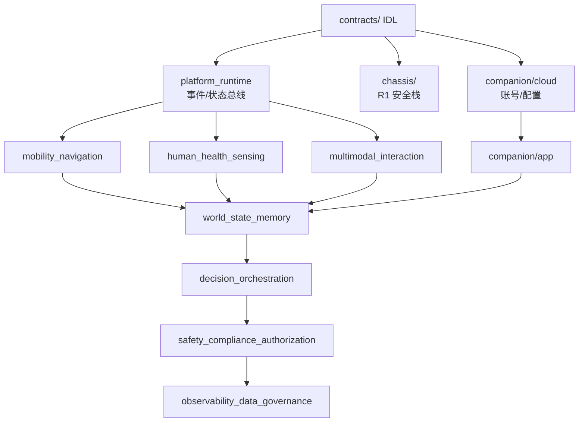

# 架构冻结后编码工作规划

---

文档版本：v1.0
创建日期：2026-03-15
作者：Codex-架构师

---

## 1. 文档目的

本文档回答一个核心问题：**架构设计冻结之后，编码工作如何从零开始展开到量产预备。**

当前项目处于 PDCP 阶段，仓库内为纯架构文档（零代码）。架构基线已冻结：9 个运行时模块、4 级 OODA 子环（R1-R4）、World State 统一状态面、分层状态机 + 行为树、安全/合规/授权前置门控。目标在 `2026-12-31` 达到量产预备状态，`2027-01` 进行 100 台/100 户/1 个月 MVP 试点验证。

本文档承接以下输入：

- [总体架构](../02_p1_architecture/01_overall_architecture.md)
- [模块分层与模块边界](../02_p1_architecture/04_module_layers_and_boundaries.md)
- [多尺度动态OODA架构基线](../02_p1_architecture/03_multi_scale_dynamic_ooda_architecture_baseline.md)
- [世界状态与核心实体结构](../02_p1_architecture/05_world_state_schema.md)
- [系统决策状态机](../02_p1_architecture/06_decision_state_machine.md)
- [安全/合规/授权接口](../02_p1_architecture/07_safety_compliance_authorization_api.md)
- [工程化与NPI准备基线](03_engineering_npi_baseline.md)
- [软硬件选型矩阵](04_hardware_software_selection_matrix.md)
- [开发团队提案](../10_team_planning/01_development_team_proposal.md)

---

## 2. 代码仓库结构

建议采用 **Monorepo + 子包** 结构，与 9 模块 + 伴生系统对齐：

```
kinbot/
├── platform/                        # E3: 端侧运行栈
│   ├── runtime/                     # platform_runtime (事件总线、状态总线、进程管理、资源调度)
│   ├── mobility/                    # mobility_navigation (建图、定位、路径规划、底盘控制)
│   ├── perception/                  # human_health_sensing (人体检测、姿态/跌倒、语音、穿戴接入)
│   ├── interaction/                 # multimodal_interaction (对话、TTS、屏幕、灯光、手势)
│   ├── world_state/                 # world_state_memory (三层状态、长期记忆)
│   ├── decision/                    # decision_orchestration (状态机、行为树、OODA Scale Scheduler)
│   ├── safety/                      # safety_compliance_authorization (审批门控、审计)
│   └── observability/               # observability_data_governance (日志、指标、追踪、数据治理)
├── companion/                       # E4: 伴生系统
│   ├── app/                         # 家属 App (React Native / Flutter)
│   ├── cloud/                       # 云服务 (账号、配置同步、审计、OTA、第三方网关)
│   └── ops/                         # 后台运营坐席 (人工接力、转接、审计)
├── chassis/                         # R1 反射环底层 (底盘安全栈, RTOS/裸机, C/C++)
├── contracts/                       # 跨模块接口定义 (Protobuf/FlatBuffers IDL)
├── tools/                           # 构建、部署、烧录、OTA 工具链
├── tests/                           # E5: 系统级集成测试、场景回放、故障注入
└── docs/                            # 现有架构文档 (保留)
```

### 关键原则

1. `contracts/` 为接口单一真相源，所有模块依赖生成的绑定代码。
2. `chassis/` 独立于 `platform/`，因其运行在 RTOS 上，与 Linux 用户态通过硬件抽象层通信。
3. `companion/` 独立子仓或 Monorepo 子目录，由 S6 团队独立交付。

---

## 3. 技术栈选型

| 层级 | 语言/框架 | 运行环境 | 理由 |
|------|-----------|----------|------|
| **R1 底盘安全栈** | C / C++17 | RTOS (FreeRTOS / Zephyr) 或裸机 MCU | 硬实时 ms 级响应，急停/避障/夹手保护 |
| **R2-R4 端侧应用** | C++17 / Python 3.11+ / Rust (可选) | Linux (Ubuntu/Yocto on Digua S100 Pro / RK3588) | 平衡性能与开发效率；模型推理用 C++ |
| **模型推理** | ONNX Runtime / TensorRT / 厂商 SDK | NPU/GPU on SoC | 4B/7B/8B 多模态模型 FP8 推理 |
| **进程间通信** | 自研事件总线 或 ZeroMQ / gRPC | 端侧 Linux | 模块解耦，支持 R1-R4 并发 |
| **接口定义** | Protobuf v3 / FlatBuffers | 跨端 | 类型安全、版本兼容、代码生成 |
| **家属 App** | Flutter (Dart) 或 React Native (TS) | iOS / Android | 跨平台、单团队维护 |
| **云服务** | Go / Java (Spring Boot) | K8s / 容器 | 账号、配置、审计、网关、OTA |
| **后台坐席** | Web (React / Vue) + WebSocket | 浏览器 | 实时会话、工单、转接 |
| **CI/CD** | GitHub Actions / Jenkins + Bazel/CMake | — | 端侧交叉编译 + 云侧容器构建 |
| **可观测性** | OpenTelemetry + Prometheus + Grafana | 端侧 agent + 云侧收集 | 统一日志、指标、追踪 |

---

## 4. 分阶段编码路线图

### 4.1 Phase 0：基建期（2026-04 ~ 2026-05，8 周）

**目标**：搭建编码基础设施，冻结接口定义，让 7 个域团队可以并行开发。

| 交付物 | 内容 | 负责 |
|--------|------|------|
| 仓库初始化 | Monorepo 骨架、CI/CD 流水线、交叉编译工具链、代码规范 | 系统架构 |
| `contracts/` 接口 IDL v1 | 9 模块间全部 Protobuf 定义：ActionProposal、ApprovalDecision、WorldStateSnapshot、HealthEventCandidate、RobotEventUplink 等 | 系统架构 + 各域 |
| 事件总线 & 状态总线骨架 | `platform_runtime` 核心消息分发与状态读写 | S1 |
| World State 存储引擎 v1 | 9 实体 CRUD + 三层分区（snapshot/session/persistent） | S4 |
| 安全门控框架 v1 | `evaluate_action()` 骨架 + 审批流 + 审计日志 | S5 |
| 统一日志 & 指标框架 | OpenTelemetry agent 端侧适配、日志格式、故障分级枚举 | S7 |
| App/云骨架 | 账号体系、配置同步 API、事件上行 API、远程确认 API 框架 | S6 |
| 集成测试框架 | SIL 仿真环境、场景回放基础设施、Mock 传感器数据源 | 集成测试 |

### 4.2 Phase 1：核心链路打通（2026-06 ~ 2026-07，8 周）

对应 `G2` 技术路线门。

**目标**：端到端跑通 3 条核心业务链路的最小闭环。

#### 链路 A：健康事件最小闭环

```
穿戴数据/视觉姿态 → human_health_sensing 候选事件
→ world_state 风险评估 → decision_orchestration 动作提案
→ safety gate 审批 → multimodal_interaction 语音确认
→ companion_service_system 家属通知 → 归档
```

- 实现健康事件 7 级管线的前 5 级
- 实现 L1-L4 风险分级
- 实现穿戴设备 BLE 接入（小米/华为手环心率、血氧）

#### 链路 B：用药服务最小闭环

```
用药计划触发 → 提醒 → 找人/靠近 → 开仓递送
→ 确认服药 → 记录 → 家属通知
```

- 实现 MedicationAsset 实体管理
- 实现储物仓控制（开门/防夹/状态上报）
- 实现 navigate_to_person + approach 导航技能

#### 链路 C：安全异常最小闭环

```
跌倒检测/夜间离床 → 二次确认 → 风险升级
→ 家属 App 通知 → 人工坐席接力
```

- 实现 A1-A7 异常分类与升级链
- 实现 F1-F7 故障保护硬中断
- 实现 6 段升级链（本地确认→家属→坐席→第三方→社区→120 预留）

#### 同步进行

- R1 底盘安全栈移植到目标 SoC（Digua S100 Pro / RK3588），TTFT/TPS 基准测试
- OODA Scale Scheduler v1：R1 抢占 + R2/R3 基本切换
- 决策状态机 v1：5 顶层状态 + 8 业务状态 + 状态转移

### 4.3 Phase 2：功能补齐与稳定化（2026-08 ~ 2026-09，8 周）

对应 `Alpha/EVT` 进入。

**目标**：从最小闭环扩展到完整功能面，进入真机联调。

| 模块 | 补齐内容 |
|------|----------|
| `mobility_navigation` | 全屋建图、重定位、语义导航策略（7 技能：go_to_room / search_person / approach_person / follow_person 等）、社交移动策略 |
| `human_health_sensing` | 跌倒检测算法优化（误报 <5%/天）、久卧检测、厨房危险、VLM 姿态理解 |
| `multimodal_interaction` | 完整对话管理、TTS 人设、主动交互触发（5 类）、夜间静默规则、中断恢复 |
| `world_state_memory` | 长期记忆治理（5 类记忆提取/存储/可见性）、记忆冲突处理、隐私分层（4 级） |
| `decision_orchestration` | 行为树叶节点实现、4 约束子状态（夜间/离线/人工协同/权限冲突）、完整 OODA Scale Scheduler（6 输入 × 7 切换规则） |
| `safety_compliance_authorization` | 11 类受控动作完整审批逻辑、标准原因码、穿戴数据新鲜度策略、储物仓策略、第三方平台资质校验 |
| `companion_service_system` | App 完整最小交付面（授权配置/记忆治理/远程确认/事件浏览）、坐席会话编排、第三方网关（互联网医院/药店/配送） |
| `observability_data_governance` | 数据分类执行、脱敏、留存/删除策略、模型性能回看、离线评测数据管理 |

### 4.4 Phase 3：端云联调与故障注入（2026-10 ~ 2026-11，8 周）

对应 `Beta/DVT`。

**目标**：在真实家庭场景中运行稳定，通过故障注入验证所有降级路径。

| 工作项 | 详细内容 |
|--------|----------|
| 真机 100 小时长稳测试 | 混合工作负载（W1-W4），验证 >4h 续航，内存泄漏/CPU 饱和/NPU 热饱和 |
| 故障注入验证 | F1-F7 全部故障场景注入 + 恢复验证；网络断开降级；传感器失效降级 |
| 端云联调 | 事件上行延迟 <30s、远程确认往返 <1min、OTA 流程、配置同步 |
| 安全链路端到端 | 跌倒→确认→家属通知→坐席接力→第三方转接，全链 SLA 验证 |
| 性能优化 | VLM 推理 TTFT/TPS 优化（FP8 量化、KV cache、视觉 token 压缩） |
| 功耗优化 | W1 静默 <15W、W4 运动+交互 <90W、混合工作负载 <47W |
| 隐私合规 | 生物特征不出端验证、敏感数据分级执行、审计链完整性 |
| App 体验闭环 | 家属 App UX 打磨、推送、授权配置、记忆浏览/编辑/删除 |

### 4.5 Phase 4：试点预备与量产固化（2026-12）

对应 `G5` 量产预备门。

**目标**：通过 M1-M7 七大判定域，进入 `2027-01` 试点。

| 判定域 | 编码侧交付物 |
|--------|------------|
| M1 产品包冻结 | 功能开关表、版本矩阵、默认策略配置 |
| M2 平台冻结 | BSP 固化、驱动冻结、BOM 对应固件版本 |
| M3 软件稳定 | 缺陷关闭率 >95%、关键故障 MTTR <4h、无 P0 遗留 |
| M4 安全合规 | 安全矩阵全绿、隐私审计通过、高风险链路故障注入全通过 |
| M5 制造测试 | 产线烧录/校准/自检脚本、测试治具软件 |
| M6 试点运营 | OTA 通道就绪、远程诊断、日志回收、告警监控 Dashboard |
| M7 发布准备 | 发布包签名、灰度策略、回滚机制 |

---

## 5. 模块开发优先级与依赖关系

### 5.1 依赖拓扑



### 5.2 关键路径

最长依赖链：

1. `contracts/` → `platform_runtime` → `world_state` → `decision_orchestration` → `safety_gate` → 业务闭环
2. `companion/cloud` → `companion/app` → 远程确认闭环 → 试点可执行（**D6 阻断项**）

### 5.3 并行度

- `chassis/` (R1) 与 `platform/` (R2-R4) 可完全并行
- `companion/` 与 `platform/` 可并行，仅在集成点汇合
- `perception` / `mobility` / `interaction` 三者可并行（共享 `platform_runtime` 接口后）

---

## 6. 集成策略

### 6.1 接口契约

1. 全部模块间接口通过 `contracts/` 中 Protobuf IDL 定义
2. CI 中自动生成 C++ / Python / Go / Dart 绑定
3. 接口变更必须通过版本兼容性检查（向后兼容 或 显式 breaking change 审批）

### 6.2 集成测试分层

| 层级 | 方式 | 频率 |
|------|------|------|
| 单元测试 | 各模块内 pytest / gtest | 每次提交 |
| 模块间集成 | Mock 对端 + 接口契约测试 | 每日 |
| SIL（软件在环） | 全模块仿真 + 虚拟传感器 | 每周 |
| HIL（硬件在环） | 真实 SoC + 仿真外设 | 双周 |
| 端云联调 | 真机 + 真实云/App | 每月→双周→每周 |
| 场景回放 | 录制真实家庭数据回放 | 持续 |

### 6.3 关键集成里程碑

1. **W6**（5 月中）：事件总线 + World State + 安全门控三模块联通
2. **W12**（7 月初）：健康/用药/安全三条链路端到端跑通（SIL）
3. **W16**（8 月初）：真机上链路 A/B/C 跑通（HIL）
4. **W20**（9 月初）：端云联调首次跑通
5. **W28**（11 月初）：100 小时长稳 + 故障注入全量通过
6. **W36**（12 月底）：G5 量产预备判定

---

## 7. CI/CD 与质量基础设施

### 7.1 Day 1 必须就位

- Monorepo 构建系统（Bazel 或 CMake + Conan）
- 交叉编译流水线（x86 开发 → ARM64 目标板）
- 代码格式化 + 静态分析（clang-tidy / pylint / golangci-lint）
- 单元测试覆盖率门槛（新代码 >80%）
- 接口 IDL 变更自动检查

### 7.2 Phase 1 补齐

- SIL 仿真环境自动化
- 场景回放框架
- 性能基准测试（TTFT / TPS / 端到端延迟）
- 安全扫描（SAST + 依赖漏洞）

### 7.3 Phase 2 补齐

- HIL 持续集成
- 长稳自动化测试
- 故障注入自动化
- OTA 灰度发布流水线

---

## 8. 关键技术风险与缓解

| 风险 | 影响 | 缓解策略 |
|------|------|----------|
| **端侧 SoC 选型未收敛**（D1） | 全部端侧开发受阻 | Phase 0 用 RK3588 开发板启动，Digua S100 Pro 到板后迁移验证；接口层抽象 SoC 差异 |
| **VLM 推理性能不达标** | 导航/交互延迟不可接受 | FP8 量化 + KV cache 优化 + 视觉 token 压缩；设"语义策略 + 经典规划"双速率拆分作为降级方案 |
| **伴生系统交付滞后**（D6） | 直接阻断试点执行 | Phase 0 即启动 App/云骨架；将 E4 与本体编码同优先级并行推进 |
| **底盘安全栈 R1 实时性** | 无法保证 ms 级急停 | R1 独立 RTOS 进程，与 Linux 用户态隔离；硬件 watchdog 兜底 |
| **穿戴设备兼容性** | 健康链路数据源缺失 | 优先适配小米/华为 2-3 款高占有率型号；设 questionnaire_driven 降级路径 |
| **100 台试点运维** | OTA/日志/告警/远程诊断规模化 | Phase 3 必须完成运维工具链；云侧 Dashboard + 告警 + 远程 Shell |

---

## 9. 团队与模块映射

基于 [开发团队提案](../10_team_planning/01_development_team_proposal.md) 的 S1-S7 域团队结构：

| 域团队 | 对应代码模块 | 建议人数 | Phase 0-1 最少骨干 |
|--------|------------|----------|-------------------|
| S1 本体平台与运动 | `chassis/` + `platform/runtime/` + `platform/mobility/` | 15-18 | 6 |
| S2 人体感知与健康 | `platform/perception/` | 10-12 | 4 |
| S3 多模态交互与陪伴 | `platform/interaction/` | 10-12 | 4 |
| S4 世界状态与决策 | `platform/world_state/` + `platform/decision/` | 10-12 | 5 |
| S5 安全合规授权 | `platform/safety/` | 6-8 | 3 |
| S6 伴生系统与服务 | `companion/` | 12-15 | 5 |
| S7 治理观测与数据 | `platform/observability/` | 6-8 | 3 |
| 系统集成测试 | `tests/` + SIL/HIL | 12-15 | 4 |
| 系统架构 | `contracts/` + 构建工具链 | 6-8 | 3 |

**Phase 0-1 最少骨干**：约 37 人（当前团队规模可覆盖）。

**Phase 2 起全量**：约 95-115 人。

---

## 10. 验证策略

### 端到端验证场景（MVP 试点核心）

| 场景 | 覆盖模块 | 关键指标 |
|------|----------|----------|
| 老人久卧检测→确认→通知 | perception + world_state + decision + safety + interaction + companion | 误报 <5%/天，漏报 <10%/天 |
| 跌倒→二次确认→升级→家属→坐席 | perception + decision + safety + companion（全 6 段升级链） | 确认到达率 >90%，家属通知延迟 <30s |
| 定时用药→提醒→找人→开仓→确认→记录 | decision + mobility + interaction + safety + world_state | 用药-用户匹配 100%，仓门可靠性 >99.5%，夹手事件 0 |
| 夜间离床→低扰确认→必要时通知 | perception + decision + safety + interaction | 低扰确认准确率 >85% |
| 离线场景→降级运行→恢复 | 全模块 | 核心安全功能 100% 保持 |
| 低电量→优雅降级→回充 | decision + mobility + platform_runtime | 关键安全功能不中断 |

---

## 11. 本文档的定位

本文档是编码工作的**总体路线图**，不替代各域团队的详细设计文档。后续每个域团队应基于此产出：

1. 模块详细设计文档（类图、时序图、API 设计）
2. 接口 IDL 草案（提交到 `contracts/`）
3. 验证方案（单元 + 集成 + 场景覆盖）
4. 阶段交付计划（对齐 Phase 0-4 里程碑）
