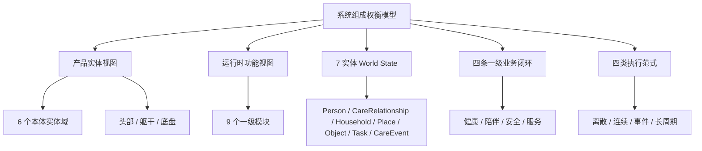

# 系统组成权衡模型与优先级矩阵

---

文档版本：v1.1
创建日期：2026-04-21
作者：Codex-架构师

文档变更记录：
- v1.1 | 2026-04-21 | Codex-架构师 | 补齐评审可执行性口径：新增资源分组权重、风险分级惩罚、`OptionBonus` 证据门槛、`P/W/B` 后续治理动作与评审模板证据字段。
- v1.0 | 2026-04-21 | Codex-架构师 | 创建系统组成权衡模型，统一成本、重量、尺寸、药箱、屏幕、交互、运动性能、服务 / 坐席与数据回流等取舍，并对齐双视角、`9` 模块、`7` 实体与四条一级业务闭环。

---

## 1. 文档目的

本文档用于回答一个具体问题：

> 当成本、重量、尺寸、药箱功能 / 尺寸、屏幕、交互、运动性能、算力、传感器、服务 / 坐席等系统组成互相冲突时，Kinbot `V1` 应如何建模、比较和排序。

本文是 `P2` 技术收敛与工程化阶段的权衡工具，服务于：

1. [01_overall_solution_and_module_design_baseline.md](01_overall_solution_and_module_design_baseline.md) 中的 `S1-S7` 工作包评审。
2. [04_hardware_software_selection_matrix.md](04_hardware_software_selection_matrix.md) 的软硬件路线比较。
3. [05_cost_structure_and_technology_downpath.md](05_cost_structure_and_technology_downpath.md) 的成本桶与降本路径。
4. [06_power_budget_and_efficiency_strategy.md](06_power_budget_and_efficiency_strategy.md) 的功耗与能效预算。
5. `KBT-57` 中 `10000` 元 `BOM`、`29999` 元定价、后台服务 / 坐席与租售并行的战略分支拆解。

本文不直接冻结最终器件清单、结构方案、`BOM`、售价或商业模式。所有评分权重在当前阶段属于工作口径，需在模块方案评审、`G5` 门控和用户确认中继续校准。

## 2. 使用边界

### 2.1 两类概念必须分开

当前讨论中常把“实体”和“约束”混在一起。本文要求先拆开：

| 类型 | 例子 | 用法 |
| --- | --- | --- |
| 系统组成实体 | 端侧算力、相机、头部、屏幕、麦阵、底盘、电池、药箱、App、云、坐席、数据治理 | 作为被评估对象 |
| 权衡维度 / 约束资源 | 成本、重量、尺寸、功耗、热、噪声、可靠性、隐私、`OPEX`、可制造性、产品感 | 作为评价轴 |

因此，“成本、重量、尺寸”不是产品实体，而是所有实体共同消耗的资源。评审时不应问“成本和药箱谁优先”，而应问“某个药箱方案消耗多少成本、重量、空间和复杂度，换来多少健康闭环、递送闭环和产品感收益”。

### 2.2 先过硬门槛，再做评分

任何方案进入评分前，必须先通过硬门槛：

| 硬门槛 | 不通过时的处理 |
| --- | --- |
| 运动与人身安全 | 直接淘汰，不进入价值 / 成本折中 |
| 合规、授权与隐私 | 直接淘汰或回退到受控预留 |
| 断网下本地安全闭环 | 直接淘汰 |
| 可制造、可测试、可维修 | 不能进入量产定型，只能保留为 Demo / 研究线 |
| 高端产品感底线 | 不能因成本更低直接通过，必须重做方案 |

### 2.3 双成本情景并行

当前必须同时保留两种情景：

| 情景 | 状态 | 作用 |
| --- | --- | --- |
| `A: 5000 到 6000 元 BOM 约束线` | 当前冻结基线 | 逼迫真实收敛，防止方案发散 |
| `B: 10000 元 BOM 战略线` | `KBT-57` 战略分支 | 验证更强功能、更好服务和 `29999` 元定价是否成立 |

不允许用 `B` 情景覆盖 `A` 情景。`B` 情景只有在能证明新增成本对应真实用户可感知价值、服务闭环、可靠性或商业模式收益时，才允许继续推进。

## 3. 架构对齐基线

本文必须同时对齐当前四层架构表达：

1. 双视角总体架构：
   - 产品实体视图：本体 `6` 个实体域 + `头部 / 躯干 / 底盘` 空间承载子视图。
   - 运行时功能视图：`9` 个一级模块。
2. `7` 实体 `World State`：
   - `Person / CareRelationship / Household / Place / Object / Task / CareEvent`。
3. 四条一级业务闭环：
   - 健康闭环、陪伴闭环、安全闭环、服务闭环。
4. 四类执行范式：
   - 离散决策、连续流式、事件驱动、长周期演化。



## 4. 推荐纳入权衡的系统组成实体

当前建议把系统组成权衡对象收敛为 `12` 类。少于这些会漏掉关键成本转移，多于这些会让评审表失控。

| 编号 | 系统组成实体 | 对应本体 / 伴生承载 | 主责工作包 | 主要影响 |
| --- | --- | --- | --- | --- |
| `T1` | 端侧算力、内存与存储 | 计算与控制核心，头部 / 躯干 | `S1` | 智能上限、响应速度、功耗、热、`BOM` |
| `T2` | 视觉与基础传感器组合 | 环境与人体感知组件，头部 / 底盘 | `S1/S2` | 找人、识人、导航、低照、安全 |
| `T3` | 头部、头颈机构与高速链路 | 头部模块 | `S1/S2/S3` | 主动观察、拟人感、线束、寿命、重心 |
| `T4` | 屏幕、灯光与视觉表达 | 交互表达组件，头部 / 躯干 | `S3` | 陪伴、确认、远程在场、产品感 |
| `T5` | 麦阵、扬声器与声学结构 | 交互表达组件，头部 / 躯干 | `S3` | 唤醒、通话、问诊、低打扰 |
| `T6` | 底盘、轮组、运动控制与回充 | 移动底盘与运动执行，底盘 | `S1/S5` | 到人、过门槛、稳定性、噪声、安全 |
| `T7` | 电池、电源、热与噪声 | 电池电源、热与本体安全 | `S1/S7` | 续航、发热、充电频率、长期体验 |
| `T8` | 药箱 / 储物仓与交接确认 | 储物仓、结构与外观，躯干 | `S1/S3/S5` | 用药、递送、仓门安全、空间占用 |
| `T9` | 整机结构、外观、重心与可维护性 | 储物仓、结构与外观，躯干 / 底盘 | `S1/S7` | 高端产品感、可靠性、维修、装配 |
| `T10` | App、最小云、后台服务 / 坐席 | 伴生系统与服务 | `S6` | 远程确认、服务接力、`OPEX`、数据闭环 |
| `T11` | 数据治理、回流、审计与观测 | 治理面 | `S7` | 隐私、质量复盘、持续进化、阶段证据 |
| `T12` | 制造、产测、校准、供应与维修 | NPI / 质量体系 | `S1/S7` | 量产导入、良率、售后成本、节奏 |

## 5. 统一评价维度

### 5.1 价值贡献维度

每个组成实体用 `0 到 5` 分评价其对以下价值的贡献，`0` 表示无贡献，`5` 表示决定性贡献。

| 价值维度 | 默认权重 | 对齐关系 |
| --- | ---: | --- |
| `V1 健康闭环贡献` | `24` | 健康闭环，`Person / CareEvent / Task` |
| `V2 具身在场与到人贡献` | `18` | 健康 / 服务 / 安全闭环，`Place / Task / Object` |
| `V3 安全与可靠性贡献` | `16` | 安全闭环，`CareEvent / Task` |
| `V4 陪伴交互与低打扰贡献` | `12` | 陪伴闭环，`Person / CareRelationship / Task` |
| `V5 家属远程信任与服务接力贡献` | `12` | 服务闭环，`Household / CareRelationship / CareEvent` |
| `V6 高端产品感贡献` | `10` | 双视角共同约束 |
| `V7 持续进化与质量闭环贡献` | `8` | `S7`，长周期演化，数据回流与审计 |

合计权重为 `100`。

### 5.2 资源消耗维度

每个组成实体还要用 `0 到 5` 分评价资源消耗，`0` 表示几乎不消耗，`5` 表示高消耗 / 高风险。

| 资源维度 | 说明 |
| --- | --- |
| `R1 BOM` | 对整机物料成本的压力 |
| `R2 重量` | 对整机重量、重心和搬运 / 运输的压力 |
| `R3 尺寸 / 空间` | 对头部、躯干、底盘、仓体和家庭通行的压力 |
| `R4 功耗` | 对续航、电池、充电频率的压力 |
| `R5 热 / 噪声` | 对舒适感、寿命和散热结构的压力 |
| `R6 算力 / 带宽 / 存储` | 对 `C1` 子桶和端侧资源调度的压力 |
| `R7 可靠性 / 寿命` | 对线束、机构、传感器、仓门和底盘的压力 |
| `R8 制造 / 校准 / 维修` | 对产测、校准、装配、返修和备件的压力 |
| `R9 隐私 / 合规 / OPEX` | 对数据治理、坐席运营、服务成本和合规审计的压力 |

为避免“关键风险被低敏感维度稀释”，当前默认采用分组权重：

| 分组 | 资源维度 | 组内权重 |
| --- | --- | ---: |
| `H` 高敏感组 | `R1 / R7 / R9` | `1.3` |
| `M` 中敏感组 | `R4 / R5 / R8` | `1.0` |
| `L` 一般敏感组 | `R2 / R3 / R6` | `0.8` |

说明：

1. `H` 组用于保障量产、可靠性与合规风险不被均值掩盖。
2. 若专项评审需要调整，必须在评审记录中写明“调整原因、影响范围、失效条件”。

### 5.3 推荐计算方式

评审时采用简单公式，不追求假精确：

```text
ValueScore = Σ(价值维度得分 / 5 * 价值权重)
BurdenScore = (Σ(资源维度得分 * 资源维度权重) / Σ资源维度权重) * 20
RiskPenalty = 高风险项数量 * 8 + 中风险项数量 * 3
OptionBonus = 满足回退与验证证据门槛时加 0 到 10

DecisionScore = ValueScore - BurdenScore - RiskPenalty + OptionBonus
```

解释：

1. `ValueScore` 用于回答“它到底帮哪个核心价值变强”。
2. `BurdenScore` 用于回答“它消耗了多少资源”。
3. `RiskPenalty` 用于防止明显高风险方案靠单项价值冲高，且要求区分高 / 中风险。
4. `OptionBonus` 只给可验证、可裁剪、可回退的方案，不给空泛想象。

风险等级建议定义：

| 等级 | 判定口径 | 计分 |
| --- | --- | ---: |
| 高风险 | 涉及人身安全、合规红线、量产不可达或不可恢复路径 | `8` |
| 中风险 | 可通过明确工程措施缓解，但当前证据不足 | `3` |
| 低风险 | 局部体验或效率波动，可在版本内修复 | `0` |

`OptionBonus` 证据门槛（至少满足前 `3` 项）：

1. 有明确降级路径和触发条件；
2. 有回退开关、回退步骤和回退验证；
3. 有阶段性验证计划和负责人；
4. 有成本 / 资源上限保护，不会无限膨胀。

评审结论不直接按分数机械排序，而按 `P / W / B`：

| 判定 | 含义 |
| --- | --- |
| `P` | 进入当前主线或继续工程化 |
| `W` | 保留观察或进入边界验证线 |
| `B` | 阻断当前主线，需重做或降级 |

## 6. 架构对齐矩阵

### 6.1 与双视角、九模块、七实体和四闭环的映射

| 实体 | 产品实体视图 | 运行时模块 | `7` 实体关联 | 主要闭环 |
| --- | --- | --- | --- | --- |
| `T1` 端侧算力、内存与存储 | 计算与控制核心 | `platform_runtime`、`decision_orchestration`、`world_state_memory` | 全部实体 | 四闭环共同支撑 |
| `T2` 视觉与基础传感器 | 环境与人体感知组件 | `mobility_navigation`、`human_health_sensing` | `Person / Place / Object / CareEvent` | 健康、安全、服务 |
| `T3` 头部、头颈机构 | 头部模块 | `mobility_navigation`、`multimodal_interaction`、`platform_runtime` | `Person / Place / Task` | 健康、陪伴、安全 |
| `T4` 屏幕、灯光与视觉表达 | 交互表达组件 | `multimodal_interaction`、`companion_service_system` | `Person / Task / CareRelationship` | 陪伴、服务、健康 |
| `T5` 麦阵、扬声器与声学结构 | 交互表达组件 | `multimodal_interaction`、`human_health_sensing` | `Person / CareEvent / Task` | 健康、陪伴、安全 |
| `T6` 底盘、运动控制与回充 | 移动底盘与运动执行 | `mobility_navigation`、`safety_compliance_authorization` | `Place / Object / Task` | 健康、安全、服务 |
| `T7` 电池、电源、热与噪声 | 电池电源、热与本体安全 | `platform_runtime`、`observability_data_governance` | `Task / CareEvent` | 四闭环共同支撑 |
| `T8` 药箱 / 储物仓 | 储物仓、结构与外观 | `decision_orchestration`、`safety_compliance_authorization` | `Object / Task / CareEvent` | 健康、服务 |
| `T9` 结构、外观、重心与维护 | 储物仓、结构与外观 | `platform_runtime`、`observability_data_governance` | `Place / Object / Task` | 四闭环共同支撑 |
| `T10` App、最小云、坐席 | 伴生系统与服务 | `companion_service_system` | `Household / CareRelationship / Task / CareEvent` | 服务、健康、安全 |
| `T11` 数据治理、回流、审计 | 治理面 | `observability_data_governance` | 全部实体 | 四闭环与长周期演化 |
| `T12` 制造、产测、校准、维修 | NPI / 质量体系 | `platform_runtime`、`observability_data_governance` | 全部实体 | 四闭环共同支撑 |

### 6.2 与 `S1-S7` 工作包的使用方式

| 工作包 | 必须重点使用的权衡对象 |
| --- | --- |
| `S1 本体平台与运动` | `T1 / T2 / T3 / T6 / T7 / T9 / T12` |
| `S2 人体感知与健康` | `T2 / T5 / T10 / T11` |
| `S3 多模态交互与陪伴` | `T3 / T4 / T5 / T9` |
| `S4 世界状态与决策` | `T1 / T8 / T10 / T11` |
| `S5 安全合规与授权` | `T6 / T7 / T8 / T10 / T11` |
| `S6 伴生系统与服务` | `T10 / T11`，并联动 `KBT-57` |
| `S7 治理观测与验证` | `T11 / T12`，并横切全部对象 |

## 7. 当前建议的优先级排序

以下排序用于当前 `V1` 方案取舍。它不是永久产品路线，也不是每个单点方案的机械排序。

### 7.1 `P0` 不参与牺牲的底线

1. 人身安全、运动安全、关键故障保护。
2. 合规、授权、隐私和数据边界。
3. 断网下本地安全闭环。
4. 可制造、可测试、可维修的量产基本面。

这些项不进入“为了成本牺牲多少”的讨论。

### 7.2 `P1` 必须优先保住的组成

| 优先级 | 组成 | 原因 |
| --- | --- | --- |
| `P1-1` | 健康闭环所需的感知、补采、到人、提醒、递送、家属联动 | 直接对应首发核心价值 |
| `P1-2` | 底盘运动、安全执行、回充和近场保护 | 没有可信运动，就没有具身照护 |
| `P1-3` | 端侧算力、内存、视觉与低照能力的最低体验线 | 决定聪明感、找人、导航和安全 |
| `P1-4` | 电池、电源、热、噪声和续航 | 决定能否长期在家庭中共居 |
| `P1-5` | 药箱的安全开关、状态记录和交接确认 | 用药闭环必须成立，但容量不应无限扩张 |

### 7.3 `P2` 决定差异化但需受约束的组成

| 优先级 | 组成 | 当前建议 |
| --- | --- | --- |
| `P2-1` | 头部主动观察、头颈机构和表情表达 | 优先保住轻量、灵动、可靠，不为大屏牺牲头部 |
| `P2-2` | 声学与多模态交互 | 作为高频入口优先保证可用和舒适，不盲目堆器件 |
| `P2-3` | 屏幕尺寸与位置 | 服从头部轻量化与交互确认需求，当前继续支持躯干内容屏主线 |
| `P2-4` | 后台服务 / 坐席与非隐私数据回流 | 进入 `KBT-57` 候选，不得替本体长期兜底失败 |
| `P2-5` | 高端产品感细节 | 必须作为组合结果评估，不能只由外观件承担 |

### 7.4 `P3` 优化项

1. 药箱容量扩大。
2. 更大屏幕或更高规格屏幕。
3. 更复杂灯光和娱乐表达。
4. 更深第三方生态闭环。
5. 超出当前闭环的智能家居高覆盖接入。
6. 前瞻验证线上的 `16GB+` 内存和更大存储。

`P3` 项可以在 `10000` 元 `BOM` 战略分支中重新评估，但不能反向压过 `P0 / P1`。

### 7.5 `P / W / B` 后续治理动作

为保证评审结论可追溯，当前默认动作如下：

| 判定 | 强制后续动作 |
| --- | --- |
| `P` | 纳入当前主线，绑定对应工作包与阶段门证据清单 |
| `W` | 进入观察 / 验证清单，写明补证据项、截止时间和 owner，复审后才可转 `P` |
| `B` | 阻断进入主线，必须形成重构 / 降级方案并重新过硬门槛 |

## 8. 典型取舍规则

### 8.1 药箱

优先级：

1. 防夹手、电动开关、开关状态记录。
2. 储物记录、交接确认。
3. 合理容量与结构空间效率。
4. 防误取、防错拿。
5. 容量扩大和更复杂机构。

判断规则：

- 如果药箱扩大明显损伤电池、重心、结构、外观或通行能力，应优先压缩容量。
- 药箱不是独立卖点，它必须服务健康闭环和递送闭环。

### 8.2 屏幕

优先级：

1. 支撑确认、解释、低打扰提示和远程在场。
2. 不破坏头部轻量化、声学、线束寿命和外观比例。
3. 不让屏幕功耗、亮度、热和成本反向拖垮整机。

判断规则：

- 屏幕尺寸不是越大越好。当前主线仍是“紧凑轻量头部 + 躯干内容屏”。
- 若头部带大屏导致头颈高速链路、`EMI`、寿命或可维护性不过线，应优先保持躯干内容屏。

### 8.3 运动性能

优先级：

1. 安全停机、避障、低速靠近和过门槛。
2. 安静、稳定、可预期。
3. 到人成功率和任务节奏。
4. 更复杂的运动炫技。

判断规则：

- 运动性能不追求炫技，但必须可信。
- 任何压低底盘传感或运动硬件的方案，都必须显式记账它对 `C1 / C2 / C5` 的成本和功耗转移。

### 8.4 端侧算力

优先级：

1. 保障本地安全、视觉、导航和核心交互。
2. 保障多模态首响应体验。
3. 支撑 `NFM / VLM` 前瞻验证。
4. 支撑更大模型常驻。

判断规则：

- 量产默认线继续按 `12GB RAM + 32GB Flash` 管理。
- `16GB+` 默认只作为前瞻验证线或未来 `Pro SKU`，除非 `KBT-57` 的 `10000` 元 `BOM` 分支被明确接受。

### 8.5 后台服务 / 坐席

优先级：

1. 接住用户不会操作、机器人无法识别需求、高风险场景升级。
2. 形成结构化服务记录和质量复盘。
3. 支撑非隐私结构化数据回流和持续进化。
4. 扩展在线问诊、第三方履约和租售运营。

判断规则：

- 坐席应放大产品价值，不应长期替机器人补失败链路。
- 坐席能力如果进入主线，必须同步定义服务时段、响应 `SLA`、质检、`OPEX`、数据边界和审计。

## 9. 评审模板

每个重大组成方案评审时，至少填写以下表格。

| 字段 | 填写要求 |
| --- | --- |
| 方案名称 | 如“药箱扩大到 X L”“头部大屏方案”“更强 SoC 方案” |
| 所属对象 | `T1-T12` |
| 关联工作包 | `S1-S7` |
| 关联本体实体 / 空间模块 | `6` 个本体实体域与头部 / 躯干 / 底盘 |
| 关联 `World State` 实体 | `Person / CareRelationship / Household / Place / Object / Task / CareEvent` |
| 关联闭环 | 健康 / 陪伴 / 安全 / 服务 |
| 硬门槛结果 | 通过 / 不通过 / 需补证据 |
| 价值评分 | `V1-V7` 每项 `0-5` |
| 资源消耗 | `R1-R9` 每项 `0-5` |
| 资源权重口径 | 默认 `H/M/L` 分组；如调整需写明原因与生效范围 |
| 成本情景 | `A: 5000 到 6000` 是否成立；`B: 10000` 是否成立 |
| 风险转移 | 说明是否把压力转移到算力、热、结构、产测、售后或坐席 |
| 风险分级 | 高 / 中 / 低，并给出判定依据 |
| 证据来源 | 仿真、样机、测试报告、历史故障、评审结论等至少一项 |
| 结论 | `P / W / B` |
| 后续动作 | 对应 `P / W / B` 的治理动作、owner、截止时间 |

## 10. 当前结论

当前阶段建议采用以下判断：

1. 系统组成权衡不应只围绕 `BOM` 展开，而应围绕“核心价值贡献 / 资源消耗 / 风险转移 / 情景分支”展开。
2. 当前必须保留 `5000 到 6000` 元 `BOM` 约束线，同时允许 `KBT-57` 拆解 `10000` 元 `BOM` 战略线。
3. 一代真正不能牺牲的是安全、隐私、本地闭环、健康到人闭环、运动可信度、续航热噪声和可量产性。
4. 药箱、屏幕、头部、底盘、算力、服务 / 坐席都必须按同一张权衡表评审，不能各自局部最优。
5. 现在的架构是不是太复杂了？如果只用本文新增 `12` 类对象、`7` 个价值维度、`9` 个资源维度和 `2` 个成本情景，复杂度是可控且必要的；若后续继续新增权衡对象，应优先合并到 `T1-T12`，不要扩张新分类。
