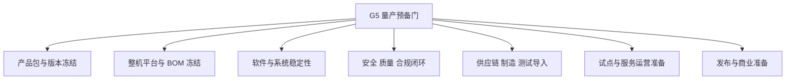

# 量产预备判定标准

---

文档版本：v1.0
创建日期：2026-03-09
作者：Codex-架构师

---

## 1. 文档目的

本文档对应 `KBT-16`，用于把“`2026-12-31` 达到量产预备状态”收敛成可评审、可验证、可执行的判定标准。

本文档回答 4 个问题：

1. Kinbot 当前语境下的“量产预备”到底是什么意思，不是什么意思。
2. 到 `2026-12-31` 时，哪些方面必须已经冻结或达到可执行状态。
3. 量产预备与 `2027-01` 的 `MVP` 验证窗口是什么关系。
4. 后续阶段门应该拿哪些事实来判定“过”或“不过”。

## 2. 量产预备的定义

结合既有决策，当前把“量产预备”定义为：

- 产品定型
- 小批量试点具备执行条件
- 随时可以开发布会

这意味着它不是“所有问题都消失”，也不是“已经大规模正式发售”，而是：

1. 核心产品包、系统边界和关键技术路线已经冻结。
2. 整机、伴生系统、人工服务和交付面已经形成可闭环方案。
3. 小批量试点和发布准备不再受主要结构性问题阻断。

## 3. `G5` 量产预备门的 7 个判定域

当前建议把 `G5` 量产预备门收敛成 7 个判定域。

### 3.1 七域结构图

### 3.2 七域定义

| 判定域 | 当前要求 | 通过信号 |
| --- | --- | --- |
| `M1 产品包与版本冻结` | 功能配置、角色权限、伴生系统交付面和版本矩阵冻结 | 不再有高代价产品边界漂移 |
| `M2 整机平台与 BOM 冻结` | 结构、底盘、传感器、算力、`BOM`、售价监控区间和功耗主线进入受控状态 | 不再有会推倒整机平台的技术漂移 |
| `M3 软件与系统稳定性` | 核心运行栈、状态机、接口契约、故障保护和关键阈值进入受控状态 | 家庭试点版本具备稳定运行能力 |
| `M4 安全 质量 合规闭环` | 安全矩阵、授权治理、审计、隐私、合规边界和高风险链路具备验证闭环 | 关键风险不再停留在口头假设 |
| `M5 供应链 制造 测试导入` | 关键器件、产测、校准、治具、导入节奏和替代路线受控 | 能进入小批量导入，而不是只停留在实验室 |
| `M6 试点与服务运营准备` | `100 台 / 100 户 / 1 个月` 级别试点方案、App、云、坐席、售后和升级链路准备完成 | 小批量试点随时可执行 |
| `M7 发布与商业准备` | 发布准备、交付、售后、物料、口径和质量监控方案完成 | 随时可以开发布会并承接试点与交付 |

### 3.3 为什么 `功耗` 必须与 `BOM / 售价` 同级

这里把 `功耗` 单独提升为量产预备同级约束，不是因为它是财务指标，而是因为它直接决定 5 个用户强感知结果：

1. 续航是否达标
2. 发热是否可接受
3. 风扇、散热和充电策略是否破坏安静感与舒适感
4. 电池寿命、充电频率和售后压力是否可控
5. 结构、热设计和算力路线是否还能维持当前整机形态

对一代 Kinbot 来说，如果只盯 `BOM`，而不把 `功耗` 当成同级门控，就很容易出现一种假收敛：

- 成本看起来进了目标区间
- 但真实产品在家庭里变得更热、更吵、续航更短、充电更频繁
- 最终仍然无法支撑“聪明、温暖、精致”的高端产品感

因此，当前把 `BOM / 售价 / 功耗` 视作量产预备的同级约束，是因为：

- `BOM` 约束可制造性和成本结构
- `售价` 约束商业成立性和高端产品定位
- `功耗` 约束真实用户体验、整机热设计和长期可运营性

## 4. 当前建议的 7 条通过条件

`G5` 当前建议按以下 7 条通过条件判断：

1. `产品定义冻结`
说明：功能配置、角色权限、伴生系统交付面和关键使用边界已冻结。

2. `整机平台冻结`
说明：结构、底盘、相机、算力、功耗和 `BOM` 主线已冻结到可量产收敛状态。

3. `试点版本可运行`
说明：Beta 级试点版本在家庭环境中具备稳定运行能力，关键误报、漏报、降级与恢复进入受控区间。

4. `关键风险已闭环`
说明：高风险异常、关键安全故障、权限治理和关键合规边界都已形成验证与审计闭环。

5. `导入条件已具备`
说明：关键器件、产测、校准、治具、替代路线和导入节奏已具备小批量执行条件。

6. `试点与服务已就绪`
说明：小批量试点、App、云、坐席、售后、升级链路和问题分级机制已经可以协同运行。

7. `发布准备已到位`
说明：对外发布、口径、交付和质量监控方案已经就绪，达到“随时可以开发布会”的状态。

## 5. 与 `2027-01 MVP` 验证窗口的关系

当前建议明确区分：

- `2026-12-31 量产预备`：强调“系统已经收敛到可以导入、试点、发布准备”的状态。
- `2027-01 MVP 验证窗口`：强调“在真实用户与真实运营环境中验证前述收敛是否成立”。

因此：

1. `量产预备` 不是 `MVP` 验证的替代。
2. `MVP` 验证也不应该回头推翻量产主线，只能暴露仍需修正的点。
3. 如果某项能力必须等到 `2027-01` 真实运营后才知道是否成立，那么它在 `2026-12-31` 时至少要有可执行的验证机制和回退方案。

## 6. 当前建议的证据包

要证明 `G5` 通过，当前建议至少形成 7 份证据包：

1. `产品包与版本矩阵`
2. `整机平台与 BOM / 售价 / 功耗三线看板`
3. `试点版本稳定性与缺陷闭环报告`
4. `安全 质量 合规与审计报告`
5. `供应链 制造 测试与导入方案`
6. `试点 服务 售后与升级预案`
7. `发布准备与质量监控方案`

## 7. 当前不应被误判为“量产预备”的情况

以下情况，即使表面进度很好，也不应判定为“量产预备”：

1. 还能跑 Demo，但整机平台、`BOM`、功耗和结构仍大幅漂移。
2. 本体功能很多，但 App、云、坐席、售后和升级链路并未形成闭环。
3. 试点规模写在计划里，但关键器件、产测和导入节奏尚未受控。
4. 发布口径已经准备好，但质量监控、问题升级和回退机制还不存在。
5. 高端产品感知明显受损，已经很难支撑 `20000 到 30000 元` 售价区间。

## 8. 本轮收口结论与后续问题

`Step30` 已对 `KBT-16` 形成当前轮次收口，结论如下：

1. 接受把 `G5` 量产预备门收敛为 `7` 个判定域。
2. 接受当前的 `7` 条通过条件。
3. 接受把 `BOM / 售价 / 功耗` 作为量产预备的同级约束；同时要求说明功耗之所以单列，是因为它直接影响续航、发热等用户强感知属性。
4. 接受把“小批量试点可执行 + 随时可以开发布会”作为量产预备的硬定义，而不是宽泛的项目状态描述。

本轮同步收敛出的额外边界：

- 首代产品可能无法完全收回研发投入，但 `售价` 与 `成本` 仍然必须是量产预备的强约束。
- `功耗` 之所以被提升到同级，是因为它不只是技术参数，还直接牵动续航、热、噪声、充电和长期体验。
- `KBT-16` 当前已足以作为后续 `KBT-12` 验证计划的上层门定义。

当前仍保留的后续问题：

1. `G5` 的 `7` 个判定域是否要继续细化为更接近执行门的量化项。
2. 各判定域的证据包模板和通过阈值，后续如何与试点、产测和质量体系一一对应。

## 9. 下一步建议

基于本文件，后续建议继续推进：

1. 低电量、定位异常、关键传感器失效的量化阈值
2. 智能家居一期优先接入范围
3. 家属 App 的远程控制边界
