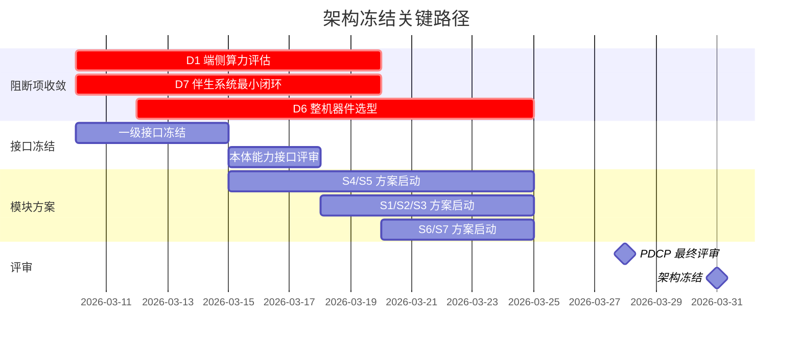

# 架构师综合评审与计划

## 1. 评审目的

作为架构师，基于 `docs/00_governance/00_requirements.md` 和 `docs/00_governance/05_system_architecture_principles.md`，对整个项目进行全面架构审阅，识别关键问题和风险，给出架构设计方案和后续工作计划。

评审时间：2026-03-10
评审范围：产品定义与架构冻结（PDCP）阶段
目标里程碑：2026-03-31 架构冻结，2026-12-31 量产预备

说明：本文是 2026-03-10 的外部架构评审快照，用于保留该轮评审时的判断和建议；如与后续已冻结基线存在差异，以更新后的正式基线文档为准。

## 2. 当前架构状态总结

### 2.1 架构完整性评估

当前架构已形成完整的 PDCP 评审包，主要成果包括：

1. **双视角架构基线**（已冻结）
   - 产品实体架构视图：6 个本体实体域
   - 运行时功能架构视图：9 个一级模块

2. **多尺度 OODA 方法论**（已冻结）
   - R1 反射环：毫秒到百毫秒级
   - R2 执行环：0.5 秒到数秒级
   - R3 任务环：数秒到数分钟级
   - R4 关系与服务环：小时到天级
   - OODA Scale Scheduler：一级架构能力

3. **四条一级业务闭环**（已冻结）
   - 健康闭环
   - 陪伴闭环
   - 安全闭环
   - 服务闭环

4. **工程化基线**（规划中）
   - 7 个工作包（S1-S7）
   - 7 个工程化基线包（E1-E7）

### 2.2 架构符合性检查

对照 `系统架构原则.md` 的 53 条架构原则进行检查：

✓ **涌现原则**：通过 OODA 多尺度架构实现功能涌现
✓ **聚焦原则**：明确三大核心任务（健康管理、陪伴交互、安全保障）
✓ **架构师角色原则**：已解决主要歧义，建立创新的多尺度 OODA
✓ **分解原则**：6 个本体实体域、9 个一级模块，基本符合 5-9 个的约束
⚠ **简化复杂度原则**：9 个一级模块处于上限，需监控协调复杂度
✓ **架构决策原则**：已识别关键架构决策并提前冻结
✓ **平衡原则**：在成本、性能、安全、用户体验间寻求平衡

## 3. 关键发现与风险识别

### 3.1 架构层面的关键发现

**优势：**

1. **创新的多尺度 OODA 架构**：突破传统单轮 OODA 限制，建立 R1-R4 四类子环和动态调度机制，符合 AGI 时代具身智能需求
2. **双视角架构基线**：成功回应 Step 32 的关键问题，将软硬一体的本体实体纳入架构视图
3. **安全优先设计**：建立安全/合规/授权三道门，决策优先级明确（安全 > 合规 > 用户指令）
4. **端云协同边界清晰**：明确端侧自洽能力，断网时运动安全不降级

**待改进：**

1. **模块数量处于上限**：9 个一级模块接近 5-9 个约束的上限，可能增加协调复杂度
2. **本体实体域与运行时模块的映射治理**：映射关系已建立，但缺乏持续治理机制
3. **架构文档的可视化程度**：docs/00_governance/00_requirements.md Step 9 强调"重视架构图，文档中多用直观的图示"，当前部分文档图示不足

### 3.2 三大阻断性风险（D1/D6/D7）

根据 docs/00_governance/00_requirements.md 和 工程化与NPI准备基线.md 的分析：

**D1：端侧算力平台未收敛**
- 状态：Step 20-21 明确要求"中国大算力端侧芯片专项评估"，RK 双路线已下调为备线
- 影响：直接影响 VLN 模型部署（4B/7B/8B + FP8 量化）、功耗预算、成本结构
- 风险等级：**阻断项**
- 建议：立即启动端侧算力专项评估，2026-03-20 前完成主线收敛

**D6：整机平台与关键器件基线未冻结**
- 状态：传感器配置（双目+单目 3-5 个）、储物仓机构重构、外观形态重构已明确方向
- 影响：重量目标（<40kg）、成本目标（6000-8000 元）、续航目标（>4 小时）
- 风险等级：**阻断项**
- 建议：E2 工程化基线包优先推进，2026-03-25 前完成器件选型

**D7：伴生系统最小闭环缺失**
- 状态：E4 已列为第一优先级，但具体交付面尚未冻结
- 影响：试点、售后、人工接力、异常升级无法闭环
- 风险等级：**阻断项**
- 建议：E4 立即启动，2026-03-20 前完成最小闭环定义

### 3.3 成本与技术实现的张力

**成本约束：**
- 整机物料成本：6000-8000 元
- 目标售价：20000-30000 元（监控区间）
- 成本桶分配：C1-C7 七个成本域

**技术实现压力：**
- 端侧算力（C1）：需要支持 4B/7B/8B 多模态模型，成本预计上调 300 元
- 视觉传感器（C2）：纯视觉方案（双目+单目）需要自研深度估计，降本压力大
- 底盘与运动（C4）：简化传感器配置，算法压力增大
- 电池与续航（C5）：>4 小时续航，功耗预算紧张

**风险：**
- 成本与性能的平衡点尚未验证
- 降本路线可能影响"高端产品感知"（聪明感、舒适感、精致感、轻盈感、可信感、支持感）

**建议：**
- 建立"成本-性能-感知"三维监控机制
- 每次显著降本动作附带"高端产品感知检查表"（Step 24 要求）

### 3.4 架构决策的时序风险

**已冻结的关键决策：**
- 多尺度 OODA 方法论
- 双视角架构基线
- 四条一级业务闭环
- 安全/合规/授权三道门

**尚未冻结但影响重大的决策：**
- 端侧算力平台选型（影响所有模块）
- 传感器最终配置（影响 C2/C4 成本分配）
- 伴生系统技术栈（影响开发周期）
- VLN 模型参数量与量化策略（影响 C1/C5）

**时序风险：**
- 2026-03-31 架构冻结目标仅剩 21 天
- 三大阻断项（D1/D6/D7）需要在 10-15 天内收敛
- 模块并行设计需要稳定的接口基线

## 4. 架构优化建议

### 4.1 架构简化建议

**问题：** 9 个一级模块处于 5-9 个约束的上限，可能增加协调复杂度。

**建议：** 考虑合并相关性强的模块，降至 7-8 个：

**方案 A：合并观测与治理**
- 将 `observability_data_governance` 作为横切能力，不单独列为一级模块
- 其职责分散到各模块的内部治理层
- 优势：减少一个顶层模块，简化协调
- 风险：治理能力可能被弱化

**方案 B：合并世界状态与决策**
- 将 `world_state_memory` 和 `decision_orchestration` 合并为 `cognition_and_decision`
- 理由：Orient 和 Decide 在 OODA 中紧密耦合
- 优势：减少状态同步开销
- 风险：单一模块职责过重

**推荐：** 暂不合并，但建立更强的模块协调机制：
- 明确模块间接口的 owner 和评审流程
- 建立跨模块的关键路径监控
- 在 S4/S5 方案中优先定义模块协调规则

### 4.2 本体实体域治理机制

**问题：** 本体实体域与运行时模块的映射关系已建立，但缺乏持续治理机制。

**建议：** 建立"双视角一致性检查"机制：

1. **设计阶段检查**
   - 每个模块方案必须明确声明依赖和约束的本体实体域
   - 本体实体域的变更必须评估对运行时模块的影响

2. **评审阶段检查**
   - 模块方案评审时，同步检查本体实体域的约束是否满足
   - 整机方案评审时，检查本体实体域是否支撑所有运行时模块

3. **变更管理**
   - 本体实体域变更（如传感器配置、算力平台）触发影响分析
   - 运行时模块变更触发本体约束检查

### 4.3 架构可视化增强

**问题：** docs/00_governance/00_requirements.md Step 9 强调"重视架构图，文档中多用直观的图示"，当前部分文档图示不足。

**建议：** 补充以下关键架构视图：

1. **产品系统全景图**：展示机器人本体、伴生系统、外部生态的完整关系
2. **本体实体域分解图**：6 个本体实体域的物理布局和连接关系
3. **OODA 多尺度运行时序图**：展示 R1-R4 如何动态切换和协同
4. **关键业务闭环流程图**：健康/陪伴/安全/服务四条闭环的端到端流程
5. **成本-性能-感知三维监控图**：可视化成本约束与产品感知的平衡

### 4.4 接口稳定性策略

**问题：** 模块并行设计需要稳定的接口基线，但部分关键决策尚未冻结。

**建议：** 采用"接口先行，实现延后"策略：

1. **立即冻结的接口**（2026-03-15 前）
   - Body Capability Contract（6 组本体能力接口）
   - World State Schema（统一状态模型）
   - ActionProposal/ApprovalDecision（动作审批契约）
   - Safety/Compliance/Authorization API（三道门接口）

2. **允许演进的接口**（2026-03-31 前收敛）
   - 具体传感器数据格式（抽象层已冻结）
   - 云服务具体协议（网关接口已冻结）
   - 第三方平台对接细节（适配器模式）

3. **接口版本管理**
   - 所有一级接口必须有版本号
   - 接口变更必须经过架构师评审
   - 向后兼容性要求明确

## 5. 后续架构工作计划

### 5.1 关键路径与里程碑（2026-03-10 至 2026-03-31）

### 5.2 三周行动计划

**第一周（2026-03-10 至 2026-03-16）：阻断项攻坚**

| 日期 | 关键动作 | 责任人 | 交付物 |
|------|---------|--------|--------|
| 03-10 | 启动端侧算力专项评估（D1） | 硬件负责人 | 评估方案 |
| 03-10 | 启动伴生系统最小闭环定义（D7） | 软件负责人 | 闭环草案 |
| 03-12 | 启动整机器件选型（D6） | 整机负责人 | 器件清单 |
| 03-15 | 冻结一级接口基线 | 架构师 | 接口规范 v1.0 |
| 03-15 | 启动 S4/S5 模块方案 | 模块 owner | 方案大纲 |

**第二周（2026-03-17 至 2026-03-23）：模块方案启动**

| 日期 | 关键动作 | 责任人 | 交付物 |
|------|---------|--------|--------|
| 03-18 | 启动 S1/S2/S3 模块方案 | 模块 owner | 方案大纲 |
| 03-20 | D1/D7 阻断项收敛 | 各负责人 | 收敛报告 |
| 03-20 | 启动 S6/S7 模块方案 | 模块 owner | 方案大纲 |
| 03-23 | S4/S5 模块方案初审 | 架构师 | 评审意见 |

**第三周（2026-03-24 至 2026-03-31）：架构冻结冲刺**

| 日期 | 关键动作 | 责任人 | 交付物 |
|------|---------|--------|--------|
| 03-25 | D6 整机器件选型收敛 | 整机负责人 | 器件基线 |
| 03-25 | S1/S2/S3 模块方案初审 | 架构师 | 评审意见 |
| 03-27 | S6/S7 模块方案初审 | 架构师 | 评审意见 |
| 03-28 | PDCP 最终评审 | 经营高管 | 评审结论 |
| 03-31 | 架构正式冻结 | 架构师 | 冻结基线包 |

### 5.3 七个工作包（S1-S7）启动顺序与依赖

**优先级 1：S4 世界状态与决策方案 + S5 安全合规与授权方案**
- 启动时间：2026-03-15
- 理由：定义状态面和动作门，是其他模块的基础
- 关键交付：World State Schema、决策状态机、安全门 API

**优先级 2：S1 本体平台与运动方案 + S2 人体感知与健康方案**
- 启动时间：2026-03-18
- 依赖：S4/S5 的接口基线
- 关键交付：端侧算力方案、传感器布局、健康事件管线

**优先级 3：S3 多模态交互与陪伴方案**
- 启动时间：2026-03-18
- 依赖：S4/S5 的接口基线
- 关键交付：交互协同方案、人设与记忆治理

**优先级 4：S6 伴生系统与服务方案**
- 启动时间：2026-03-20
- 依赖：S4/S5 的接口基线、D7 阻断项收敛
- 关键交付：App/云/人工服务最小闭环

**优先级 5：S7 治理观测与技术研判方案**
- 启动时间：2026-03-20
- 依赖：所有模块的初步方案
- 关键交付：治理机制、技术研判输入包

### 5.4 七个工程化基线包（E1-E7）推进策略

根据 工程化与NPI准备基线.md，建议并行推进，重点监控：

**E4 伴生系统与服务运营基线**（第一优先级）
- 目标：2026-03-20 完成最小闭环定义
- 关键：不让伴生系统过度约束本体硬件

**E2 整机平台与关键器件基线**（阻断项）
- 目标：2026-03-25 完成器件选型
- 关键：储物仓机构重构、外观形态重构

**E1 产品配置与版本基线**
- 目标：2026-03-31 完成版本矩阵
- 关键：必须有/应该有/可以有的边界

**E3/E5/E6/E7**
- 目标：2026-03-31 完成基线草案
- 关键：为 P2 阶段提供硬约束

## 6. 关键架构决策点

### 6.1 立即需要决策的问题（2026-03-15 前）

**决策 1：端侧算力平台主线**
- 问题：RK 双路线已下调为备线，需要确定中国大算力芯片主线
- 影响：所有模块的算力预算、功耗预算、成本结构
- 决策方式：技术评估 + 供应链评估 + 成本评估
- 决策人：硬件负责人 + 架构师

**决策 2：一级接口版本管理策略**
- 问题：接口如何版本化、如何演进、如何保证兼容性
- 影响：模块并行开发的效率
- 决策方式：架构评审
- 决策人：架构师

**决策 3：模块协调机制**
- 问题：9 个一级模块如何协调、谁负责跨模块问题
- 影响：开发效率、集成风险
- 决策方式：组织设计 + 流程设计
- 决策人：项目管理 + 架构师

### 6.2 需要持续监控的架构风险

**风险 1：成本失控**
- 监控指标：C1-C7 七个成本桶的实际成本
- 预警阈值：单个成本桶超出预算 15%
- 应对措施：启动降本专项、调整技术路线

**风险 2：架构漂移**
- 监控指标：一级接口变更次数、模块边界调整次数
- 预警阈值：单个接口变更超过 3 次
- 应对措施：架构评审、冻结决策

**风险 3：高端产品感知下降**
- 监控指标：聪明感、舒适感、精致感、轻盈感、可信感、支持感
- 预警阈值：任一维度评分低于基线
- 应对措施：设计优化、用户测试

**风险 4：时间压力**
- 监控指标：关键里程碑达成率
- 预警阈值：任一里程碑延期超过 3 天
- 应对措施：资源调配、范围调整

## 7. 架构师评审结论

### 7.1 总体评价

当前本项目在该轮评审时的架构设计**基本符合要求**，具备以下优势：

1. **创新性**：多尺度 OODA 架构是对传统方法的重要突破
2. **完整性**：双视角架构基线覆盖软硬一体的产品实体
3. **安全性**：安全优先设计贯穿全链路
4. **可行性**：基于真实样机 Demo，技术路线可验证

但存在**三大阻断性风险**（D1/D6/D7）需要立即解决，否则将影响 2026-03-31 架构冻结目标。

### 7.2 架构冻结的充分必要条件

**必要条件（缺一不可）：**

1. ✓ 双视角架构基线已冻结
2. ✓ 多尺度 OODA 方法论已冻结
3. ✓ 四条一级业务闭环已冻结
4. ✗ 端侧算力平台主线已收敛（D1）
5. ✗ 整机器件选型已完成（D6）
6. ✗ 伴生系统最小闭环已定义（D7）
7. ✗ 一级接口基线已冻结
8. ✗ 七个工作包（S1-S7）已启动

**充分条件（确保质量）：**

1. 所有模块方案通过初审
2. 成本-性能-感知平衡点已验证
3. PDCP 评审通过（含经营高管）
4. 关键技术风险已识别并有应对方案

**当前状态：** 必要条件完成 3/8，充分条件完成 0/4

### 7.3 架构师建议

**立即行动（本周内）：**

1. 启动端侧算力专项评估，2026-03-20 前完成主线收敛
2. 启动伴生系统最小闭环定义，2026-03-20 前完成
3. 冻结一级接口基线，2026-03-15 前发布 v1.0
4. 启动 S4/S5 模块方案设计

**持续监控（三周内）：**

1. 每周架构评审会，检查阻断项进展
2. 每日站会，同步关键决策和风险
3. 建立架构变更管理流程
4. 建立成本-性能-感知监控机制

**PDCP 评审准备（2026-03-28）：**

1. 准备完整的架构评审包
2. 准备风险清单和应对方案
3. 准备成本分析和降本路线
4. 准备高端产品感知验证报告

## 8. 下一步行动

### 8.1 本文档的后续使用

本文档作为架构师的综合评审报告，建议：

1. **提交评审**：提交给项目负责人和经营高管审阅
2. **同步团队**：在架构评审会上宣讲，确保全员理解
3. **跟踪执行**：将关键行动项同步到 Linear，指定责任人
4. **持续更新**：每周更新进展，标记已完成/进行中/阻塞的事项

### 8.2 需要立即创建的子 Issue

基于本评审，建议立即创建以下 Issue：

1. **KBT-XX：端侧算力平台专项评估**
   - 目标：2026-03-20 前完成主线收敛
   - 责任人：硬件负责人
   - 交付：算力平台选型报告、成本分析、供应链评估

2. **KBT-XX：伴生系统最小闭环定义**
   - 目标：2026-03-20 前完成
   - 责任人：软件负责人
   - 交付：App/云/人工服务最小闭环方案

3. **KBT-XX：一级接口基线冻结**
   - 目标：2026-03-15 前发布 v1.0
   - 责任人：架构师
   - 交付：接口规范文档、版本管理策略

4. **KBT-XX：整机器件选型收敛**
   - 目标：2026-03-25 前完成
   - 责任人：整机负责人
   - 交付：器件清单、BOM 基线、供应商风险表

5. **KBT-XX：成本-性能-感知监控机制**
   - 目标：2026-03-31 前建立
   - 责任人：架构师 + 产品负责人
   - 交付：监控指标、检查表、评估流程

### 8.3 架构师的持续职责

在架构冻结前（2026-03-31），架构师需要：

1. **解决歧义**：持续澄清模块边界、接口定义、职责划分
2. **专注创新**：确保多尺度 OODA 等创新点落地
3. **简化复杂度**：监控模块协调复杂度，必要时优化架构
4. **平衡权衡**：在成本、性能、安全、体验间寻求最优平衡
5. **风险管理**：识别和应对架构风险，确保按时冻结

## 9. 附录

### 9.1 关键文档索引

本评审基于以下文档：

- `docs/00_governance/00_requirements.md`：需求基准和 32 个 Step 的审阅历史
- `docs/00_governance/05_system_architecture_principles.md`：53 条系统架构原则
- `docs/02_p1_architecture/02_pdcp_system_architecture_review_package.md`：PDCP 架构评审包
- `docs/02_p1_architecture/01_overall_architecture.md`：总体架构文档
- `docs/03_p2_feasibility/01_overall_solution_and_module_design_baseline.md`：模块方案下发基线
- `docs/03_p2_feasibility/03_engineering_npi_baseline.md`：工程化与 NPI 准备基线

### 9.2 关键术语

- **PDCP**：Product Definition and Concept Phase，产品定义与概念阶段
- **OODA**：Observe-Orient-Decide-Act，观察-判断-决策-行动循环
- **R1-R4**：四类 OODA 子环（反射/执行/任务/关系与服务）
- **D1/D6/D7**：三大阻断性风险（算力/整机/伴生系统）
- **S1-S7**：七个工作包（模块方案）
- **E1-E7**：七个工程化基线包
- **G2**：技术路线门

### 9.3 架构评审签署

**评审人：** 架构师（Codex）
**评审日期：** 2026-03-10
**评审范围：** 产品定义与架构冻结（PDCP）阶段
**评审结论：** 架构基本符合要求，存在三大阻断性风险需立即解决

**下次评审：** 2026-03-28（PDCP 最终评审）
**架构冻结目标：** 2026-03-31

---

**备注：**

本文档是架构师基于当前项目状态的综合评审报告，不替代 PDCP 评审包，而是作为架构工作的指导性文件。所有关键决策需经过正式评审流程确认。
