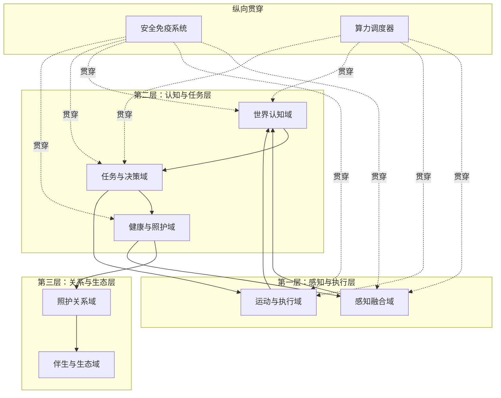
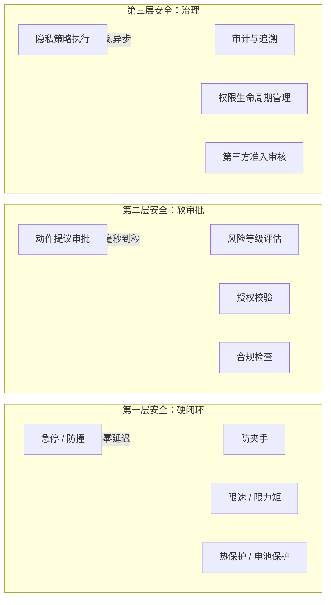
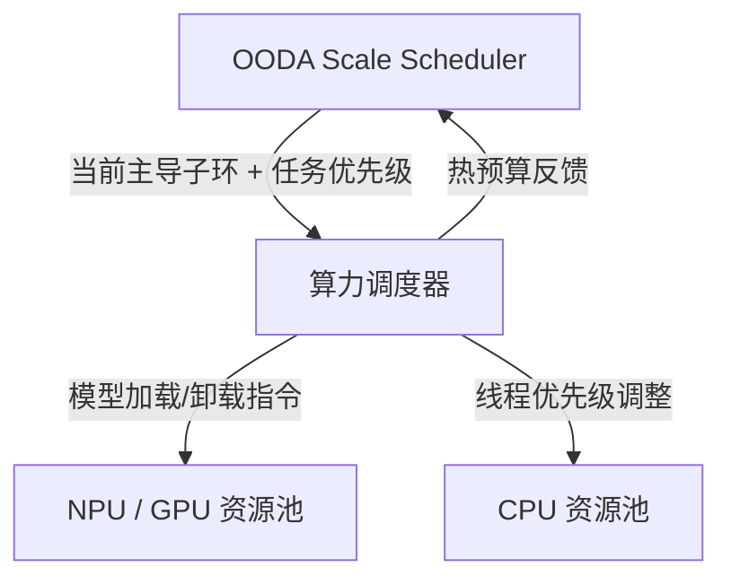

# 架构重审与替代提案

## 1. 文档目的与定位

本文档是一份独立的架构重审报告。作者以资深架构师身份，回到 `REQUIREMENTS.MD` 前 11 个 Step 的原始需求输入，重新审视设计思路，提出一套替代性架构提案。

本文档不修改任何现有文档，不替代已冻结的 PDCP 基线，而是作为一份"如果从头再来，我会怎么做"的架构思考实验，供决策者参考。

评审日期：2026-03-11
评审范围：基于 Step 1-11 原始需求的架构重构思考

## 2. 回到原点：Step 1-11 的需求本质

### 2.1 从 11 个 Step 中提炼的 5 条核心需求

重读 Step 1 到 Step 11，剥离所有实现细节后，需求的本质可以收敛为 5 条：

1. **一个能在家里自由移动的智能体**，它用轮子走，用眼睛看，用耳朵听，用嘴巴说，用屏幕展示，用灯光表达
2. **这个智能体的首要任务是照护独居老人的健康**，包括日常监测、用药管理、异常发现和医疗联动
3. **它必须像一个温暖的家人一样陪伴老人**，而不是一台冰冷的医疗设备
4. **它必须在任何时候都是安全的**，对人安全、对家安全、对隐私安全
5. **它不是孤立的**，它背后有家属 App、云服务、人工坐席和外部医疗生态

### 2.2 被忽视的需求张力

在这 5 条需求之间，存在 3 组关键张力，这些张力决定了架构的核心取舍：

**张力 A：健康优先 vs. 陪伴入口**

Step 3 明确"健康管理 > 陪伴交互"，但 Step 9 又要求"亲切家人型"人设。这意味着：健康管理是目的，陪伴交互是手段。老人不会因为"健康管理功能强"而每天使用机器人，但会因为"这个家伙挺有意思"而愿意和它说话——而说话的过程中，健康管理自然发生。

**架构启示**：陪伴交互不是健康管理的附属模块，而是健康管理的主入口。两者不应该是并列的一级模块，而应该是同一个"照护关系"的两面。

**张力 B：完全自主 vs. 安全约束**

Step 1 要求"已授权行为完全自主"，Step 1 同时要求"安全 > 合规 > 用户指令"。这意味着：自主性不是无条件的，但约束也不应该让机器人变成一个"什么都要请示"的废物。

**架构启示**：安全不应该是一个独立的"门控模块"，而应该是渗透在每一层的"免疫系统"。高频低风险动作应该零摩擦通过，只有真正的高风险动作才需要显式审批。

**张力 C：端侧智能 vs. 成本约束**

Step 1 要求端侧处理视觉和语音，Step 8 揭示样机导航"反应慢、走得犹豫"，Step 11 指出纯视觉 VLN 是关键能力缺口。同时整机 BOM 只有 6000-8000 元。这意味着：端侧算力是最稀缺的资源，架构必须让每一个 TOPS 都花在刀刃上。

**架构启示**：架构的首要任务不是"功能完备"，而是"算力效率"。模块划分必须考虑计算资源的分配和调度，而不仅仅是功能职责的划分。

## 3. 对现有架构的核心反思

### 3.1 现有架构做对了什么

在给出替代提案之前，必须先承认现有架构的优势：

1. **多尺度 OODA 是真正的创新**。R1-R4 四类子环和 OODA Scale Scheduler 的设计，准确地回应了 Step 8 对 OODA 革新的要求。这个设计应该保留。
2. **双视角基线是正确的**。把机器人本体作为产品实体显式纳入架构，回应了 Step 32 的关键问题。
3. **安全优先级排序是清晰的**。"安全 > 合规 > 用户指令"贯穿全链路。
4. **四条业务闭环的识别是准确的**。健康、陪伴、安全、服务四条主线覆盖了核心需求。

### 3.2 现有架构的 6 个结构性问题

**问题 1：9 个一级模块过于均质化**

现有 9 个一级模块是按"功能职责"切分的，每个模块看起来同等重要。但从需求本质看，它们的重要性和复杂度差异巨大：

- `world_state_memory` 和 `decision_orchestration` 是系统的"大脑"，承载了最核心的认知和决策能力
- `platform_runtime` 是"脊髓"，承载基础设施
- `observability_data_governance` 是"审计员"，重要但不在主链路上

把它们放在同一层级，会导致：团队资源平均分配、接口数量爆炸（9 个模块之间理论上有 36 对接口）、架构评审时无法聚焦。

**问题 2：OODA 四层与 9 个模块的映射不够自然**

现有架构中，OODA 四层（Observe/Orient/Decide/Act）和 9 个一级模块是两套独立的组织方式，它们之间的映射关系是后加的。这导致：

- 一个模块可能同时参与多个 OODA 层（如 `mobility_navigation` 既在 Observe 提供位姿，又在 Act 执行运动）
- OODA 的流转逻辑被模块边界打断
- 开发者很难回答"当前这段代码属于 OODA 的哪一层"

**问题 3：安全作为独立门控模块，可能成为性能瓶颈**

`safety_compliance_authorization` 作为所有高风险动作的前置门，意味着每一个需要审批的动作都要经过这个模块。在 R1 反射环（毫秒级）的场景下，这个门控的延迟可能是不可接受的。

实际上，R1 级别的安全（避障、急停、防夹手）应该是硬件级或驱动级的，不应该走软件审批流程。

**问题 4：World State 承担了过多职责**

`world_state_memory` 同时承担了：实时状态快照、会话上下文、长期记忆、用户画像、健康基线。这些数据的访问模式、更新频率、一致性要求完全不同：

- 实时位姿需要毫秒级更新
- 健康基线可能几天才更新一次
- 长期记忆需要持久化和治理

把它们放在一个模块里，会导致实现时要么过度复杂，要么在性能和一致性之间做出糟糕的妥协。

**问题 5：伴生系统被压缩成一个模块**

`companion_service_system` 把家属 App、云服务、后台人工服务、第三方平台全部合并。虽然这满足了"5-9 个模块"的约束，但代价是：这个模块内部的复杂度被隐藏了，而它恰恰是 D7 阻断项（伴生系统最小闭环缺失）的根源。

**问题 6：缺少显式的"算力调度"架构能力**

Step 8 样机的核心问题是"反应慢、走得犹豫"，这本质上是算力分配问题。但现有架构中，算力调度被隐含在 `platform_runtime` 里，没有被提升为一级架构关注点。在 6000-8000 元 BOM 约束下，端侧算力极其有限，VLN 推理、语音识别、视觉感知、健康检测会争抢同一块 NPU——这个争抢的仲裁逻辑，应该是架构级的。

## 4. 替代架构提案：三层七域

### 4.1 核心理念：以 OODA 为骨架，以算力为血液

替代提案的核心思路是：**不再把 OODA 和模块作为两套独立的组织方式，而是让 OODA 本身成为架构的骨架，模块自然地长在 OODA 的骨架上。**

同时，引入"算力调度"作为与"安全门控"同等重要的横切关注点。

### 4.2 三层架构

将系统分为三个层次，每个层次对应不同的时间尺度和关注点：

```
┌─────────────────────────────────────────────────────┐
│                 第三层：关系与生态层                      │
│         （R4 子环主导，小时-天级）                        │
│  长期记忆 · 习惯学习 · 服务编排 · 伴生系统 · 外部生态      │
├─────────────────────────────────────────────────────┤
│                 第二层：认知与任务层                      │
│         （R2/R3 子环主导，秒-分钟级）                     │
│  世界理解 · 任务决策 · 健康研判 · 陪伴交互 · 动作编排      │
├─────────────────────────────────────────────────────┤
│                 第一层：感知与执行层                      │
│         （R1/R2 子环主导，毫秒-秒级）                     │
│  传感融合 · 运动控制 · 语音前端 · 安全硬闭环 · 设备驱动    │
└─────────────────────────────────────────────────────┘
          ║                              ║
    ══════╬══════════════════════════════╬══════
    安全免疫系统（纵向贯穿）      算力调度器（纵向贯穿）
```

**第一层：感知与执行层**——对应 R1 反射环和 R2 执行环的底层部分。这一层的特征是：硬实时、确定性、本地闭环。它不需要"理解"世界，只需要"反应"。

**第二层：认知与任务层**——对应 R2 执行环的上层和 R3 任务环。这一层的特征是：软实时、概率性、需要上下文。它需要"理解"当前发生了什么，并做出合理的决策。

**第三层：关系与生态层**——对应 R4 关系与服务环。这一层的特征是：非实时、长期优化、跨系统协同。它关注的不是"现在做什么"，而是"长期怎么做得更好"。

### 4.3 七个功能域

在三层架构之内，将功能组织为 7 个域（而非 9 个模块），每个域明确归属于某一层：



### 4.4 七个域的职责定义

#### D1 感知融合域（第一层）

归属层：感知与执行层
主导子环：R1 / R2
时间尺度：毫秒到百毫秒

职责：
- 多相机视觉采集、深度估计、障碍物检测
- 麦克风阵列信号处理、唤醒、VAD
- IMU / 轮速计 / 触觉等本体感知
- 穿戴设备和 BLE 外设的原始信号接入
- 智能家居事件接入
- 传感器时间同步与健康监控

不负责：
- 语义理解（交给 D3）
- 身份判定的最终结论（交给 D3）
- 业务决策（交给 D4）

与现有架构的对应：合并了 `platform_runtime` 的设备驱动部分和 `human_health_sensing` 的信号采集部分。

#### D2 运动与执行域（第一层）

归属层：感知与执行层
主导子环：R1 / R2
时间尺度：毫秒到秒

职责：
- 底盘控制、避障、急停、限速
- 局部路径规划与执行
- 储物仓电动开关与防夹手控制
- 屏幕、灯光、扬声器等交互硬件的底层驱动
- 充电对接执行

不负责：
- 全局路径规划（交给 D4）
- "要不要去某处"的决策（交给 D4）
- 对话内容生成（交给 D3/D4）

与现有架构的对应：合并了 `mobility_navigation` 的执行部分和 `multimodal_interaction` 的硬件驱动部分。

#### D3 世界认知域（第二层）

归属层：认知与任务层
主导子环：R2 / R3
时间尺度：百毫秒到秒

职责：
- 身份识别与置信度评估
- 姿态估计、跌倒检测、活动状态判断
- 语音识别（ASR）与说话人识别
- 情绪识别
- 空间语义理解（房间识别、物体识别、场景分类）
- 环境风险评估
- 将感知事实写入运行时状态

不负责：
- 原始信号处理（由 D1 完成）
- 任务级决策（交给 D4）
- 长期记忆管理（交给 D6）

与现有架构的对应：合并了 `human_health_sensing` 的理解部分、`world_state_memory` 的实时状态部分、以及 `mobility_navigation` 的空间理解部分。

这是本提案最关键的设计变化之一：**把"理解世界"从多个模块中抽出来，形成一个统一的认知域**。这样做的好处是：
- 身份识别、姿态估计、场景理解可以共享视觉特征，减少重复计算
- 所有认知结果有统一的置信度和时间戳
- 算力调度器可以在一个域内统一调度 NPU 资源

#### D4 任务与决策域（第二层）

归属层：认知与任务层
主导子环：R2 / R3
时间尺度：秒到分钟

职责：
- OODA Scale Scheduler（决定当前由哪个子环主导）
- 分层状态机（顶层运行状态管理）
- 行为树（叶子任务编排）
- 全局路径规划与语义导航策略
- 对话管理与交互规划
- 动作提议生成
- 多任务仲裁与优先级排序

不负责：
- 感知和理解（由 D1/D3 完成）
- 底层执行（由 D2 完成）
- 长期策略优化（由 D6 完成）
- 安全审批（由安全免疫系统完成）

与现有架构的对应：合并了 `decision_orchestration`、`world_state_memory` 的会话状态部分、`multimodal_interaction` 的对话管理部分。

这是第二个关键变化：**把"决定做什么"和"怎么表达"放在同一个域**。因为对老人来说，"机器人决定提醒吃药"和"机器人用什么语气提醒吃药"是同一个体验的两面，不应该被拆到两个模块里。

#### D5 健康与照护域（第二层）

归属层：认知与任务层
主导子环：R3
时间尺度：秒到分钟

职责：
- 健康事件候选生成与风险分级（L1-L4）
- 七段式健康事件管线的编排
- 用药计划检查、提醒触发、递送编排、服药确认
- 问诊式补采与交互式健康数据收集
- 健康异常升级链路管理
- 睡眠监测与晨间状态确认

不负责：
- 原始生命体征信号处理（由 D1 完成）
- 跌倒检测等感知判断（由 D3 完成）
- 运动执行（由 D2 完成）
- 最终医疗结论（由外部医疗主体负责）
- 长期健康档案治理（由 D6 完成）

与现有架构的对应：从 `human_health_sensing` 中提取健康研判部分，从 `decision_orchestration` 中提取健康任务编排部分。

这是第三个关键变化：**健康照护作为独立域存在于认知层，而不是被拆散到感知模块和决策模块中**。理由是：
- 健康管理是一代产品的首要价值，它值得拥有独立的架构地位
- 健康研判需要同时消费感知结果（D3）和任务上下文（D4），把它放在两者之间是自然的
- 健康域可以拥有自己的状态机（健康事件管线），而不是寄生在通用决策状态机里

#### D6 照护关系域（第三层）

归属层：关系与生态层
主导子环：R4
时间尺度：小时到天

职责：
- 长期记忆管理（纪念日、健康历史、习惯偏好、重要事件）
- 用户画像与个性化策略
- 人设管理与陪伴风格演化
- 提醒策略优化与习惯学习
- 健康基线维护与趋势分析
- 多角色权限与授权管理
- 记忆治理（写入、共享、删除、审计）

不负责：
- 实时交互执行（由 D4 完成）
- 实时健康研判（由 D5 完成）
- 外部系统对接（由 D7 完成）

与现有架构的对应：合并了 `world_state_memory` 的长期状态部分和 `multimodal_interaction` 的人设/记忆部分。

这是第四个关键变化：**把"关系"提升为一个独立的架构域**。在现有架构中，长期记忆、用户画像、人设管理分散在 `world_state_memory` 和 `multimodal_interaction` 中。但从需求本质看，这些能力共同构成了"机器人与老人之间的照护关系"——这正是 R4 关系与服务环的核心。

#### D7 伴生与生态域（第三层）

归属层：关系与生态层
主导子环：R4
时间尺度：分钟到天

职责：
- 家属 App 通信与事件推送
- 云服务网关与配置同步
- 后台人工服务（客服运营坐席）接入与转接
- 第三方平台（互联网医院、药店、配送）接入与审计
- 远程确认与远程控制指令处理
- OTA 更新与版本管理
- 数据治理、隐私合规与审计日志

不负责：
- 端侧实时决策（由 D4 完成）
- 端侧安全闭环（由安全免疫系统完成）
- 本地感知和执行（由 D1/D2 完成）

与现有架构的对应：合并了 `companion_service_system` 和 `observability_data_governance`。

这里的设计考量是：`observability_data_governance` 在现有架构中是一个横切模块，但它的大部分实际工作（日志上传、审计存储、隐私合规报告）都需要云侧能力。把它和伴生系统放在一起，可以共享云侧基础设施，同时减少一个一级模块。

### 4.5 两个纵向贯穿能力

#### S1 安全免疫系统

现有架构把安全作为一个独立的门控模块（`safety_compliance_authorization`），所有高风险动作都要经过它。替代提案将安全重构为一个**分层免疫系统**，在每一层都有不同的安全机制：



关键设计差异：

1. **第一层安全是硬件级的**，由 D2 运动与执行域内置，不经过任何软件审批流程。急停、防撞、防夹手、热保护这些能力必须在驱动层或 FPGA/MCU 层实现，延迟要求是微秒到毫秒级。

2. **第二层安全是软件审批**，对应现有架构的 `evaluate_action` 接口。但它只处理 R2/R3 级别的动作（到人、送药、开仓、上报等），不处理 R1 级别的安全。`ActionProposal / ApprovalDecision` 契约继续有效。

3. **第三层安全是治理级的**，处理隐私、审计、权限生命周期和第三方准入。这些不需要实时响应，可以异步执行。

这样做的好处是：
- R1 反射环的安全不再受软件审批延迟影响
- 软件审批只需要处理真正需要"判断"的动作，吞吐量压力大幅降低
- 安全能力的测试和验证可以按层分别进行

#### S2 算力调度器

这是替代提案新增的一级架构能力。

在 6000-8000 元 BOM 约束下，端侧算力平台（无论最终选择哪个芯片）的 NPU/GPU 资源都是有限的。VLN 推理、ASR、视觉感知、健康检测等任务会争抢同一块计算资源。

算力调度器的职责：

1. **感知算力分配**：根据当前主导子环（R1-R4），动态调整视觉处理的帧率、分辨率和模型复杂度。例如：R1 抢占时，优先保障避障所需的深度估计；R3 任务环主导时，可以分配更多算力给 VLN 推理。

2. **模型加载调度**：端侧不可能同时加载所有模型。调度器决定当前加载哪些模型、卸载哪些模型。例如：夜间待机时卸载 VLN 模型，加载轻量级异常检测模型。

3. **热稳态管理**：持续高负载会导致芯片降频。调度器需要在"性能需求"和"热预算"之间做动态平衡。

4. **与 OODA Scale Scheduler 协同**：算力调度器不替代 OODA Scale Scheduler，而是作为其执行层。OODA Scale Scheduler 决定"当前应该关注什么"，算力调度器决定"当前的算力怎么分配"。



## 5. 与现有架构的映射对照

### 5.1 模块映射表

| 现有一级模块 | 替代提案归属 | 变化说明 |
| --- | --- | --- |
| `platform_runtime` | D1（设备驱动）+ D2（执行基础设施）+ S2（算力调度） | 拆分为三个关注点，算力调度提升为一级能力 |
| `mobility_navigation` | D2（运动执行）+ D3（空间理解）+ D4（全局规划） | 按 OODA 层次拆分，避障在第一层，理解在第二层，规划在第二层 |
| `human_health_sensing` | D1（信号采集）+ D3（感知理解）+ D5（健康研判） | 按"采-认-判"三段拆分，健康研判独立成域 |
| `multimodal_interaction` | D2（硬件驱动）+ D4（对话管理）+ D6（人设记忆） | 按层次拆分，硬件在第一层，对话在第二层，人设在第三层 |
| `world_state_memory` | D3（实时状态）+ D4（会话状态）+ D6（长期状态） | 按数据时间尺度拆分到对应层 |
| `decision_orchestration` | D4（任务与决策域） | 基本对应，但吸收了对话管理和全局规划 |
| `safety_compliance_authorization` | S1（安全免疫系统，分三层） | 从单一门控变为分层免疫 |
| `companion_service_system` | D7（伴生与生态域） | 基本对应，但吸收了治理审计 |
| `observability_data_governance` | D7（审计治理部分）+ S1（第三层安全） | 不再独立存在，按职责分散 |

### 5.2 接口数量对比

现有架构：9 个一级模块，理论上 36 对接口关系，实际已定义约 13 组一级接口。

替代提案：7 个域 + 2 个横切能力，但由于三层架构的约束，**跨层接口被严格限制**：

- 第一层 → 第二层：2 组接口（D1→D3 感知事实流，D2→D4 执行反馈流）
- 第二层 → 第一层：2 组接口（D4→D2 动作指令流，D5→D1 补采请求流）
- 第二层 → 第三层：2 组接口（D4→D6 记忆写入流，D5→D7 升级请求流）
- 第三层 → 第二层：2 组接口（D6→D4 策略更新流，D7→D4 远程指令流）
- 层内接口：D3↔D4↔D5（第二层内部），D6↔D7（第三层内部）
- 横切接口：S1 对 D1/D2/D3/D4/D5，S2 对 D1/D2/D3/D4

总计约 15 组接口，但层间接口只有 8 组，且每组的数据流方向和语义都非常明确。

### 5.3 关键接口契约的继承

替代提案完全继承以下已冻结的接口契约，不做修改：

1. `ActionProposal / ApprovalDecision`——归入 S1 第二层安全
2. `Body Capability Contract`（6 组本体能力接口）——归入 D1/D2
3. `World State Schema`（一级实体定义）——按时间尺度分布到 D3/D4/D6
4. 健康事件七段式管线——归入 D5
5. A1-A7 高风险异常和 F1-F7 关键安全故障——归入 S1

## 6. World State 的重新组织

现有架构把 World State 作为一个统一的状态平面。替代提案保留 World State 的概念，但按三层架构重新组织其内部结构：

### 6.1 三级状态存储


关键设计差异：

1. **实时状态环**是一个固定大小的环形缓冲区，只保留最近 N 秒的感知事实。它的更新频率是毫秒级，由 D3 世界认知域管理。任何域都可以读取，但只有 D3 可以写入。

2. **会话状态池**保存当前活跃的任务、对话和事件。它的生命周期是分钟到小时级，由 D4 任务与决策域管理。D5 健康与照护域可以读写健康事件管线状态。

3. **持久状态库**保存长期数据。它的更新频率是小时到天级，由 D6 照护关系域管理。它需要持久化存储和数据治理。

这样做的好处是：
- 实时状态不需要持久化，可以用共享内存实现，性能最优
- 会话状态可以用进程内数据结构实现，重启后可恢复
- 持久状态用数据库实现，支持查询、备份和治理
- 三级存储的一致性要求不同，可以分别优化

### 6.2 DecisionContextSnapshot 的简化

现有架构的 `DecisionContextSnapshot` 有 14 个字段。替代提案将其简化为一个**按需组装**的视图，而不是一个预先构建的快照：

```
DecisionContext = 实时状态环.latest()
               + 会话状态池.active_tasks()
               + 持久状态库.current_person_profile()
               + S1.current_safety_state()
```

这样做的好处是：每次决策只读取需要的数据，而不是每次都构建一个包含所有字段的完整快照。在算力受限的端侧，这个优化是有意义的。

## 7. OODA 多尺度子环与三层架构的自然映射

替代提案保留 R1-R4 四类子环和 OODA Scale Scheduler，但让它们与三层架构自然对齐：

### 7.1 子环归属

| 子环 | 时间尺度 | 主要归属层 | 主要涉及域 | 典型场景 |
| --- | --- | --- | --- | --- |
| R1 反射环 | 10-100ms | 第一层 | D1 + D2 + S1(硬闭环) | 避障、急停、防夹手 |
| R2 执行环 | 100ms-数秒 | 第一层 + 第二层 | D2 + D3 + D4 | 到人、导航执行、语音交互 |
| R3 任务环 | 秒-分钟 | 第二层 | D3 + D4 + D5 | 健康确认、用药提醒、安全巡查 |
| R4 关系环 | 小时-天 | 第三层 | D6 + D7 | 习惯学习、策略优化、服务编排 |

这个映射的好处是：**子环的时间尺度和层的时间尺度天然一致**。R1 的毫秒级反应对应第一层的硬实时要求；R4 的长期优化对应第三层的非实时特征。开发者不需要记住两套组织方式，只需要知道"我在哪一层工作，就主要关注哪些子环"。

### 7.2 子环切换与跨层通信

OODA Scale Scheduler 位于 D4（任务与决策域），它的核心职责是决定"当前由哪个子环主导"。当子环切换发生时，跨层通信模式如下：

**R1 抢占**（如检测到即将碰撞）：
```
D1(感知) → D2(急停) → S1(硬闭环)
整个过程在第一层内完成，不需要等待第二层的决策
D2 事后通知 D4：发生了 R1 抢占事件
```

**R3 升级到 R1**（如摔倒检测触发到人确认，途中遇到障碍）：
```
D5(健康域) → D4(决策：到人确认) → D2(导航执行)
D2 执行中遇到障碍 → R1 抢占 → D2(避障) → 恢复 R3 任务
```

**R4 触发 R3**（如习惯学习发现老人今天起床异常晚）：
```
D6(照护关系域) → D4(生成健康确认任务) → D5(进入健康事件管线)
```

### 7.3 算力调度与子环的协同

算力调度器（S2）根据当前主导子环动态调整资源分配：

| 主导子环 | NPU 优先分配 | 可降级能力 | 模型加载策略 |
| --- | --- | --- | --- |
| R1 反射 | 深度估计、障碍物检测 | VLN、ASR、情绪识别 | 只保留避障模型 |
| R2 执行 | 导航感知、ASR | 情绪识别、VLN 高精度模式 | 加载导航 + 语音模型 |
| R3 任务 | VLN、ASR、姿态估计 | 高帧率深度估计 | 加载全量感知模型 |
| R4 关系 | 低功耗监测 | 所有高算力模型 | 卸载大模型，保留轻量监测 |

这张表的核心思想是：**不是所有能力在所有时候都需要满算力运行**。R1 抢占时，VLN 推理可以暂停；R4 待机时，深度估计可以降到最低帧率。这种动态调度是在 6000-8000 元 BOM 约束下实现"反应快、不犹豫"的关键。

## 8. 四条业务闭环在替代架构中的走法

### 8.1 健康管理闭环

```
穿戴设备/视觉 → D1(信号采集) → D3(生命体征理解)
→ D5(健康事件管线：候选→分级→补采→研判→处置→通知→归档)
→ D4(生成提醒/到人/送药任务) → D2(执行)
→ D7(上报家属App/云端/医疗平台)
→ D6(更新健康基线与长期档案)
```

关键差异：健康事件管线完整地在 D5 内闭环，不需要跨越多个一级模块。D5 同时消费 D3 的感知结果和 D4 的任务上下文，形成"感知-研判-行动"的紧密循环。

### 8.2 陪伴交互闭环

```
老人说话 → D1(麦克风阵列/VAD) → D3(ASR + 说话人识别 + 情绪识别)
→ D4(对话管理：意图理解 + 回复生成 + 交互规划)
→ D2(语音合成播放 + 屏幕展示 + 灯光表达)
→ D6(记忆写入：重要对话内容归档)
```

关键差异：对话管理在 D4 内完成，不需要和独立的"多模态交互模块"协调。D6 的长期记忆为 D4 提供个性化上下文，形成"越聊越懂你"的体验闭环。

### 8.3 安全保障闭环

```
硬安全：D1(传感器) → D2(急停/避障) [第一层内闭环，S1硬闭环保障]
软安全：D3(环境风险评估) → D4(安全巡查任务) → D2(执行)
         → S1(第二层：动作审批) → D7(异常上报)
治理安全：D7(审计日志) → S1(第三层：合规检查) → D6(权限管理)
```

关键差异：三层安全各自闭环，硬安全不依赖软件审批，软安全不干扰硬安全的实时性。

### 8.4 服务编排闭环

```
D6(习惯学习发现需求) → D4(生成服务任务)
→ D7(调用外部服务：药店/配送/问诊)
→ S1(第三层：第三方准入审核)
→ D7(结果回传) → D4(执行确认) → D6(服务记录归档)
```

关键差异：服务编排由 D6（关系域）发起，而不是由决策域主动发起。这反映了一个设计理念：**服务不是机器人"决定"提供的，而是从长期照护关系中"生长"出来的**。

## 9. 风险分析与诚实评估

### 9.1 替代提案的优势

1. **OODA 与模块的自然对齐**：开发者只需要理解一套组织方式
2. **接口数量可控**：层间接口被严格限制，层内接口语义明确
3. **算力调度成为一级关注点**：直接回应 Step 8 样机"反应慢"的核心问题
4. **安全分层降低延迟**：R1 硬安全不受软件审批影响
5. **健康管理获得独立架构地位**：回应 Step 3 "健康管理 > 陪伴交互"的优先级
6. **World State 按时间尺度分治**：避免单一状态平面的性能和一致性困境

### 9.2 替代提案的风险和代价

**风险 1：三层边界可能过于刚性**

某些功能天然跨层。例如：VLN 导航需要同时消费第一层的实时感知和第二层的语义理解。如果层间接口设计不当，跨层调用的延迟可能成为问题。

缓解措施：允许"快速通道"——对于延迟敏感的跨层数据流（如 VLN 的视觉特征），可以通过共享内存直接传递，绕过正式的层间接口。

**风险 2：D3 世界认知域可能成为瓶颈**

所有感知理解都汇聚到 D3，它可能成为系统的单点瓶颈。

缓解措施：D3 内部按感知模态并行处理（视觉理解、语音理解、空间理解可以并行），只在最终写入实时状态环时做同步。

**风险 3：D4 职责过重**

D4 同时承担了 OODA Scale Scheduler、状态机、行为树、全局规划和对话管理，可能过于复杂。

缓解措施：D4 内部可以进一步分为"决策内核"（Scale Scheduler + 状态机）和"任务执行器"（行为树 + 规划 + 对话），但对外仍然是一个域。

**风险 4：与已冻结基线的兼容性**

现有 PDCP 基线已经冻结，团队可能已经按 9 个模块开始了详细设计。替代提案如果被采纳，需要重新映射已有的工作。

缓解措施：本提案的 7 个域可以视为 9 个模块的"重新分组"，而不是"推倒重来"。第 5 节的映射表提供了明确的对应关系。已有的接口契约、状态定义、安全规则全部继承，只是组织方式变了。

### 9.3 诚实的自我评估

替代提案并不是"更好"的架构，而是"不同视角"的架构。它的核心差异在于：

- 现有架构是**功能导向**的：先识别功能，再组织为模块
- 替代提案是**时间尺度导向**的：先按时间尺度分层，再在层内组织功能

哪种更适合，取决于团队的组织方式和开发节奏。如果团队按功能域分工（健康组、导航组、交互组），现有架构更自然。如果团队按系统层次分工（底层驱动组、认知算法组、应用服务组），替代提案更自然。

## 10. 建议的采纳路径

无论是否采纳替代提案的整体架构，以下 4 个具体建议可以独立地融入现有架构：

### 建议 1：将算力调度提升为一级架构能力

不需要改变模块划分，只需要在 `platform_runtime` 中显式定义一个 `ComputeScheduler` 组件，并让它与 OODA Scale Scheduler 建立协同接口。这是回应 Step 8 样机问题的最直接手段。

具体接口：
```
interface ComputeScheduler {
  // OODA Scale Scheduler 调用：通知当前主导子环变化
  on_scale_switch(new_scale: R1|R2|R3|R4): void

  // 各感知/认知模块调用：申请 NPU 时间片
  request_npu(task_id: string, priority: Priority,
              model_id: string, deadline_ms: u32): NpuGrant

  // 热管理回调：当芯片温度接近阈值时降级
  on_thermal_warning(current_temp: f32, budget_watts: f32): void
}
```

### 建议 2：将安全门控分为硬闭环和软审批两级

不需要取消 `safety_compliance_authorization` 模块，只需要明确：R1 级安全（急停、防撞、防夹手）由 `mobility_navigation` 和硬件驱动层直接处理，不经过 `safety_compliance_authorization` 的 `evaluate_action` 接口。`evaluate_action` 只处理 R2 及以上级别的动作审批。

这可以通过在 `ActionProposal` 中增加一个 `bypass_safety_gate: bool` 字段来实现，当且仅当提议来自 R1 硬闭环时为 `true`。

### 建议 3：将 World State 按时间尺度分区

不需要改变 `world_state_memory` 的模块边界，只需要在其内部实现三级存储：
- 实时环（共享内存，毫秒级更新，固定大小环形缓冲）
- 会话池（进程内存，秒级更新，任务生命周期）
- 持久库（SQLite/RocksDB，小时级更新，需要备份）

这三级存储对外仍然通过统一的 World State 接口暴露，但内部的性能特征完全不同。

### 建议 4：给健康管理一个独立的状态机

不需要把健康管理从现有模块中拆出来，只需要在 `decision_orchestration` 的分层状态机中，为健康事件管线定义一个独立的子状态机，而不是让它寄生在通用任务状态机里。

这个子状态机的状态转移应该与七段式管线（候选→分级→补采→研判→处置→通知→归档）一一对应，每个状态都有明确的超时和降级策略。

## 11. 总结

本文档从 REQUIREMENTS.MD 的 Step 1-11 出发，重新审视了设计思路，提出了一套"三层七域"的替代架构提案。

核心观点：

1. 现有架构的多尺度 OODA、双视角基线、安全优先级排序是正确的，应该保留
2. 现有架构的 9 个一级模块按功能均质切分，忽视了时间尺度差异和算力约束
3. 替代提案按时间尺度分三层，在层内组织 7 个功能域，让 OODA 子环与架构层自然对齐
4. 算力调度和安全分层是两个可以独立采纳的具体改进
5. 替代提案不是"更好"的架构，而是"不同视角"的架构，最终选择取决于团队组织方式

本文档不修改任何现有文档，不替代已冻结的 PDCP 基线。它是一份供决策者参考的架构思考实验。

---

文档版本：v1.0
创建日期：2026-03-11
作者：架构重审（独立视角）
