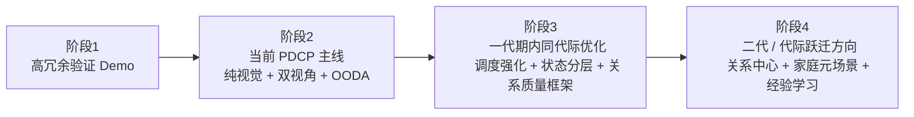
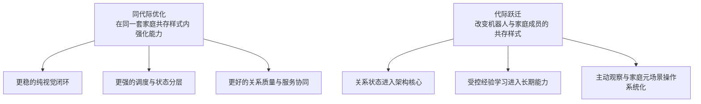

# Kinbot架构演进分析与阶段提案

---

文档版本：v1.2
创建日期：2026-03-22
作者：Codex-架构师

文档变更记录：
- v1.2 | 2026-03-23 | Codex-架构师 | 将“代际”定义抽离为独立的《机器人代际划分框架》，并在本文中改为引用该框架，统一同代际优化、代际跃迁、物理服务跃迁与人机共存样式变革的判断口径。
- v1.1 | 2026-03-22 | Codex-架构师 | 吸收 Step40，对“同代际优化”与“代际跃迁”做显式区分，并引入参考军事作战理念的代际定义，强调下一代机器人对应下一代人机共存家庭生活方式。
- v1.0 | 2026-03-22 | Codex-架构师 | 基于 Step39，按“验证 Demo → 当前主线 → 一代演进 → 二代与终局方向”四阶段分析 Kinbot 架构演进，并结合 2026 年具身智能前沿进展给出阶段提案。

---

## 1. 文档定位

本文档用于回答 `Step39` 提出的 3 个问题：

1. Kinbot 从验证 Demo 到当前主线架构，实际上经历了怎样的架构演进。
2. 在 Kinbot 第一代产品期间，当前 `PDCP` 架构基线应当如何继续演进，而不是停留在静态冻结状态。
3. 在第一代产品之后，Kinbot 应当朝什么方向继续演进，哪些架构设想更适合进入第二代产品与家庭机器人终局架构。

本文是评审输入，不直接改写当前主线冻结文档。它服务于后续：

1. `PDCP` 后的总体方案演进；
2. `S1-S7` 模块方案深化；
3. 一代与二代产品线的边界划分；
4. 对“家庭元场景”下长期架构方向的统一判断。

## 2. 分析方法与边界

### 2.1 四阶段分析对象

本轮分析按 4 个阶段展开：

1. 阶段 1：验证 Demo  
   参考 [docs/01_p0_concept/04_demo_validation_system_architecture_reconstruction_and_product_inheritance_assessment.md](../01_p0_concept/04_demo_validation_system_architecture_reconstruction_and_product_inheritance_assessment.md)
2. 阶段 2：当前主线架构与 `PDCP` 基线  
   参考 [docs/02_p1_architecture/01_overall_architecture.md](../02_p1_architecture/01_overall_architecture.md) 与 [docs/02_p1_architecture/02_pdcp_system_architecture_review_package.md](../02_p1_architecture/02_pdcp_system_architecture_review_package.md)
3. 阶段 3：第一代产品期间的主线演进  
   参考 [docs/08_reviews/06_two_alternative_architecture_proposals_comparison.md](./06_two_alternative_architecture_proposals_comparison.md) 与 [docs/08_reviews/05_two_claude_proposals_review_and_next_steps.md](./05_two_claude_proposals_review_and_next_steps.md)
4. 阶段 4：第一代产品之后的终局方向与二代设想  
   参考 [docs/08_reviews/01_architect_review_and_plan.md](./01_architect_review_and_plan.md) 与 [docs/08_reviews/08_relation_centered_architecture_proposal.md](./08_relation_centered_architecture_proposal.md)
5. 代际划分与跃迁判断  
   统一参考 [docs/08_reviews/11_robot_generation_classification_framework.md](./11_robot_generation_classification_framework.md)

### 2.2 家庭元场景

本文所说的“家庭元场景”不是某一间房间，而是指家庭机器人长期面对的共性问题集合：

1. 家庭空间高度变化、障碍变化、照明变化、家具变化。
2. 家庭成员角色复杂，权限与关系持续变化。
3. 日常任务高度碎片化，交互、照护、安全、服务在同一空间叠加出现。
4. 用户对机器人的期望并不是“完成单个动作”，而是“长期稳定地提供价值”。

因此，适合家庭元场景的架构，不只是某个感知或控制算法更强，而是要同时具备：

1. 对变化环境的长期适应能力；
2. 对多角色关系的持续理解能力；
3. 对低照、断网、低成本条件的稳健闭环能力；
4. 对长期服务和持续学习的演进能力。

### 2.3 代际定义与本文口径

本文对“同代际优化”“代际跃迁”“信息服务到物理服务的跃迁”以及 `Predict / Learn` 跨环能力的判断，统一引用 [机器人代际划分框架](./11_robot_generation_classification_framework.md)。

在本文中：

1. 阶段 2 到阶段 3，属于一代产品期内的同代际优化；
2. 阶段 4，才开始触及真正的代际跃迁；
3. Kinbot 一代已经不再是纯信息服务机器人，而是在向“初级物理服务代”迈进。

## 3. 总结论

### 3.1 一句话结论

Kinbot 的架构演进，正在从：

`高冗余验证平台`

演进为：

`以纯视觉、头部优先、核心闭环优先为特征的一代量产化架构`

并将在一代后进一步演进为：

`以关系质量、家庭元场景理解、受控数据飞轮和更强具身基础模型为核心的家庭机器人架构`

### 3.2 四阶段总判断

1. 阶段 1 的关键价值，是验证“家庭机器人本体能力组合”。
2. 阶段 2 的关键价值，是把验证平台经验翻译成可量产的系统级边界。
3. 阶段 3 的关键任务，不是推翻当前主线，而是在同一代际内把当前主线进一步演化成“更强的运行时架构”。
4. 阶段 4 的关键任务，是让 Kinbot 从“一代产品架构”开始触及“下一代家庭共存样式”，即关系中心、经验学习、家庭元场景泛化与主动观察。

## 4. 阶段 1：验证 Demo 的架构定位

### 4.1 它验证了什么

阶段 1 的验证 Demo，本质上是一套：

`体系理念激进，但技术方案偏重冗余验证` 的平台

它验证的不是“低成本产品系统”，而是以下 5 件事：

1. 家庭机器人是否值得同时具备移动、交互、递送、姿态表达与安全冗余。
2. 高位主观测视觉是否比低位近地全覆盖更有系统价值。
3. 三芯片职责分层是否能把交互、感知和实时控制分开。
4. 多执行器、多传感器的高配平台上，哪些能力真正闭环，哪些只是看起来合理。
5. 主动传感是否更适合作为研发对比真值链，而不是长期产品主线。

### 4.2 阶段 1 的优势

1. 它把“家庭机器人到底要长成什么样”从概念拉成了真实本体。
2. 它帮助团队快速发现了高位主观测、三层算控分离、头部交互价值这些真正有价值的设计。
3. 它让团队在真实整机上提前看到：声学、显示、视觉、结构会互相打架。
4. 它为后续纯视觉路线建立了研发对比真值链。

### 4.3 阶段 1 的问题

1. 体系理念激进，但技术方案并不克制，更多依赖器件堆叠。
2. 它更像“高冗余验证平台”，不是产品架构。
3. 它天然会把团队带向“多器件安全感”，而不是“更强算法和更强架构调度”。
4. 它如果被误当成产品原型，会直接拖垮重量、成本、热、噪声和产品感。

### 4.4 阶段 1 向阶段 2 的关键转译

阶段 1 不是失败，也不是过度设计，而是提供了 4 条必须保留的经验：

1. 保留“高位主观测优先”。
2. 保留“交互主控 / 感知主控 / 实时控制 `MCU`”的三层职责分离思路。
3. 保留“主动传感只做研发对比真值链”的思路。
4. 丢弃“低位多相机 + 多雷达 + 双麦阵修补式堆叠”。

## 5. 阶段 2：当前主线架构的真实意义

### 5.1 当前主线不是 Demo 的简化版

当前 `PDCP` 主线不是把 Demo 降配，而是一次真正的架构跃迁。它完成了 5 个关键动作：

1. 从“验证平台思维”切到“量产目标思维”。
2. 从“器件堆叠”切到“系统边界与能力分层”。
3. 从“单机验证”切到“机器人本体 + 伴生系统 + 外部生态”的完整产品系统。
4. 从“单环 OODA”切到“多尺度、并发、可中断、可动态调度的 OODA”。
5. 从“功能并列”切到“健康管理 > 陪伴交互 > 家庭安全巡护 > 老人看护”的价值排序。

### 5.2 当前主线的正确性

阶段 2 当前主线的核心正确性在于：

1. 它是保守产品理念下的量产化系统架构，而不是炫技架构。
2. 它把纯视觉、头部优先、低照夜间闭环这些真正的技术突破点留在一代。
3. 它把人工服务、互联网医院、配送等重服务能力降成“最小可交付 + 可收缩”。
4. 它通过 `L1 / L2 / L3` 把一代必须强做、可以增强、必须预留的能力分开。
5. 它通过双视角基线避免再次掉回“只画软件架构，不画本体实体”的旧问题。

### 5.3 当前主线的不足

当前主线仍然不是终局，它还有 4 个明显不足：

1. `World State`、调度、安全和关系质量仍然偏“基线化表达”，还不够像真正的运行时核心。
2. 伴生系统和服务闭环虽然收轻了，但与本体之间还更像“协同系统”，不是长期关系系统。
3. 关系质量目前仍是评价框架，不是架构中的一级状态面。
4. 对“家庭元场景”的长期泛化、持续学习和经验沉淀，还更多停留在预留层。

## 6. 阶段 3：一代产品期间应做的架构演进

这一阶段不建议重开 `PDCP` 主线，而应按“三线吸收法”演进。这里要强调：阶段 3 属于一代产品期内的同代际优化，不等于已经进入下一代机器人。

1. 保持当前主线架构作为系统级稳定边界。
2. 吸收《两位 Claude 提案对比审阅与下一步计划》与《两种替代架构提案对比分析》中的强技术结构。
3. 把这些吸收项落成一代期内的运行时强化，而不是重写模块拓扑。

### 6.1 阶段 3 的总原则

一代期内，Kinbot 架构应从“静态冻结基线”演进为“动态强化基线”，重点做 5 类演进。这些演进会明显提高一代产品竞争力，但不改变一代机器人与家庭成员的基本协作样式。

### 6.2 演进一：从 OODA 基线走向真正的调度中枢

当前 OODA 已经冻结，但一代期间应进一步强化：

1. `OODA Scale Scheduler` 从架构概念走向真正的资源调度中枢。
2. 把 `TTFT / TPS / 热稳态持续 TPS / 夜间低照状态 / 网络状态` 真的纳入调度输入。
3. 让 `L1 / L2 / L3` 的能力分层和算力分层严格绑定。

这一步对应《两种替代架构提案对比分析》中“时间尺度分层”的价值，但不重写当前 `9` 个一级模块。

### 6.3 演进二：从单一状态仓走向分层 World State

一代期间，`World State` 不应长期停留在一个统一大仓里，而应继续分层演进为：

1. 执行与安全态；
2. 任务与上下文态；
3. 关系与服务态。

这样做的原因不是概念更好看，而是：

1. 低时延与高可靠状态必须最小化。
2. 任务状态需要支持可中断、可恢复与可解释。
3. 关系与服务状态天然是慢变量，不应污染毫秒级闭环。

### 6.4 演进三：从总门控走向分层免疫式安全

当前安全三道门是对的，但一代期内应继续强化为分层免疫式安全：

1. 本体与运动级安全；
2. 业务与授权级安全；
3. 服务与审计级安全。

原因很简单：

1. 家庭元场景的风险来源不是单一的。
2. 纯视觉主线下，低照、遮挡、标定漂移、数据质量退化都需要被显式建模。
3. 如果安全不分层，它就会变成一个越来越重的总门，最后拖慢所有业务链。

### 6.5 演进四：从陪伴功能走向关系质量框架

一代不建议直接引入“关系引擎中心化”实现，但必须完成一件事：

把“关系质量”从产品口号变成架构评价框架。

一代期间至少要把以下 6 项纳入统一评价：

1. 信任感；
2. 舒适感；
3. 克制感；
4. 连续性；
5. 可解释性；
6. 可恢复性。

这意味着：

1. `S3 / S5 / S6 / S7` 要共同承担关系质量评价。
2. 交互、记忆治理、服务升级、夜间打扰边界都要被关系质量约束。
3. 这一步先做成评价和治理框架，而不急于做成新的超级运行时核心。

### 6.6 演进五：从纯视觉主线走向纯视觉数据飞轮

你已经明确：

1. 纯视觉是一代技术突破点。
2. 深度相机和激光雷达只做研发对比真值链，不做产品 fallback。
3. 纯视觉不过线就延迟节奏，而不是回退传感主线。

这意味着一代期内的真正演进任务，不是继续争论用不用主动传感，而是构建：

`纯视觉 + 真值参考 + 夜间低照专项 + 受控数据闭环`

这一条研发飞轮。

### 6.7 阶段 3 的建议输出

一代期内架构应进一步演进成下表所示：

| 维度 | 当前阶段 2 基线 | 阶段 3 应演进到的状态 |
| --- | --- | --- |
| OODA | 已冻结方法论 | 成为真正的调度中枢 |
| World State | 统一状态平面 | 执行/任务/关系三层状态面 |
| 安全 | 三道门 | 分层免疫式安全 |
| 关系 | 评价框架初步存在 | 关系质量成为跨模块硬约束 |
| 纯视觉 | 正式主线 | 形成数据飞轮与真值链体系 |
| 服务 | 最小可交付 + 可收缩 | 与关系质量、授权和升级链更强耦合 |

## 7. 阶段 4：第一代之后的终局方向与二代设想

这一阶段应更多参考 [架构师综合评审与计划](./01_architect_review_and_plan.md) 和 [关系中心架构提案](./08_relation_centered_architecture_proposal.md)。它不再只是“一代更强版”，而是开始定义下一代人机共存的家庭生活。

### 7.1 第一代之后不应该继续只做“更强一代”

第一代之后，Kinbot 不应只是做：

- 更高算力
- 更多功能
- 更重服务

而应开始向“家庭机器人终局架构”演进。这里的关键不是规格表升级，而是下一代家庭共存模式的改变：

1. 从“机器人被调用时提供价值”走向“机器人长期参与家庭生活节律”。
2. 从“完成任务”走向“持续维护关系、健康、安全与秩序”。
3. 从“单机产品”走向“家庭元场景中的长期协作系统”。

### 7.2 终局方向一：关系中心化开始进入真实架构层

我不建议在一代就把关系引擎做成新超级核心，但在一代之后，确实应该考虑把以下内容提升为更真实的一级状态与能力：

1. 关系状态；
2. 关系关键时刻；
3. 关系修复机制；
4. 长期关系策略。

换句话说：

一代：关系质量是评价框架  
二代：关系质量开始进入真实架构状态层

### 7.3 终局方向二：从“单机器人”走向“家庭元场景操作系统”

家庭机器人终局不会只是一个机器人本体更强，而会逐步变成：

1. 机器人本体；
2. 穿戴与健康外设；
3. 智能家居；
4. 家属 App；
5. 云与服务；
6. 第三方生态。

共同组成的“家庭元场景操作系统”。

二代产品可以开始试探：

1. 更强的家庭长期地图与语义空间建模；
2. 更强的家庭成员长期偏好建模；
3. 更强的服务编排与跨设备协同；
4. 对“单机器人本体故障时服务不完全失效”的系统级恢复设计。

### 7.4 终局方向三：从受控回流预留走向受控经验学习

一代当前正确的边界是：

1. 默认端侧处理；
2. 仅预留受控回流能力；
3. 不把“原始数据可回流”写成主基线。

但在一代之后，如果想真正进入家庭终局架构，就必须解决：

1. 如何在隐私合规边界内做经验学习；
2. 如何让机器人的长期表现不只是依靠规则和手工调参；
3. 如何让“新家庭、新房间、新摆设”的适应越来越快。

因此，二代应开始考虑：

1. 受控回流的数据治理体系；
2. 家庭元场景下的经验学习闭环；
3. 从“只做推理”走向“有限度、可审计地做持续学习”。

### 7.5 终局方向四：从纯视觉主线走向主动观察与更强具身模型

你现在强调“少相机、多自由度观察”的方向是对的。

这意味着二代真正值得尝试的不是重新堆传感器，而是：

1. 更主动的视线控制；
2. 更灵活的头部运动；
3. 更强的具身推理；
4. 更强的观察-决策联动。

也就是说：

一代：纯视觉 + 头部优先 + 固定视角为主  
二代：纯视觉 + 主动观察 + 更强具身基础模型

### 7.6 阶段 4 的二代架构设想

二代更适合引入下面这组架构设想：

1. `关系状态层`：位于任务状态层之上、服务状态层之下。
2. `经验学习层`：在受控回流与合规边界内逐步建立。
3. `家庭元场景记忆层`：比当前 `World State` 更慢、更长期。
4. `主动观察控制层`：把头部、视线与任务协同拉成独立能力。
5. `服务协同编排层`：让机器人、App、穿戴、家居、云服务更像一个系统而不是一组接口。

### 7.7 阶段 3 与阶段 4 的本质区别

| 维度 | 阶段 3：同代际优化 | 阶段 4：代际跃迁 |
| --- | --- | --- |
| 目标 | 把一代做强做稳 | 定义下一代家庭共存方式 |
| 核心问题 | 如何让现有闭环更可靠、更轻、更强 | 如何让机器人从工具升级为长期共存成员 |
| 关系能力 | 评价框架与治理约束 | 关系状态进入架构核心 |
| 数据能力 | 真值链、受控回流预留、研发飞轮 | 受控经验学习、长期适应与泛化 |
| 观察方式 | 纯视觉主线下的固定视角优化 | 主动观察与头部-任务协同成为一级能力 |
| 系统角色 | 机器人本体为主、服务协同为辅 | 家庭元场景操作系统化 |

## 8. 与 2026 前沿进展的关联

截至 `2026-03-22` 的公开前沿信号，至少有 5 条与 Kinbot 架构演进高度相关。

### 8.1 趋势一：VLA / 具身基础模型正在向“本地运行 + 低时延”演进

[Google DeepMind 的 Gemini Robotics On-Device](https://deepmind.google/discover/blog/gemini-robotics-on-device-brings-ai-to-local-robotic-devices/) 明确把“本地运行、低时延、弱网或断网可用”拉成正式方向。

这对 Kinbot 的启示非常直接：

1. 你当前坚持 `L1` 能力端侧闭环是对的。
2. `L2` 增强认知能力也不应被默认理解成“只能依赖云”。
3. 一代的 `8GB / 12GB / 16GB+` 分层，不是保守，而是和行业现实对齐的工程纪律。

### 8.2 趋势二：双系统或双速率结构正在成为具身智能主流组织方式

[NVIDIA GR00T N1](https://investor.nvidia.com/news/press-release-details/2025/NVIDIA-Announces-Isaac-GR00T-N1--the-Worlds-First-Open-Humanoid-Robot-Foundation-Model--and-Simulation-Frameworks-to-Speed-Robot-Development/) 公开强调了类似“快系统 + 慢系统”的双系统结构。

这与 Kinbot 当前多尺度 OODA、`OODA Scale Scheduler` 的方向高度一致。  
更重要的是，这说明：

1. 你当前不是在“发明奇怪方法论”，而是在和前沿架构收敛。
2. 一代期内继续强化调度中枢，是顺着行业主线在走。

### 8.3 趋势三：数据飞轮与合成数据正在成为具身智能的核心竞争点

`GR00T N1` 同时强调了合成数据和物理 AI 数据飞轮；[Figure 的 Project Go-Big](https://www.figure.ai/news/project-go-big) 也把大规模家庭/居住环境数据收集作为关键前提。

这对 Kinbot 的含义是：

1. 纯视觉不过线时延迟节奏而不回退路线，这个决策只有在“真值链 + 数据飞轮”成立时才站得住。
2. 一代必须建立研发级真值参考链，不然后续没有办法把纯视觉真正做深。

### 8.4 趋势四：开放世界泛化开始成为“家庭元场景”核心能力

[Physical Intelligence 的 π0.5](https://www.physicalintelligence.company/blog/pi05) 明确把“在新家庭环境中的开放世界泛化”作为核心进展。  
[OpenVLA](https://openvla.github.io/) 与 [π0 开源](https://www.physicalintelligence.company/blog/openpi) 也说明，具身基础模型正在从封闭验证走向更可迁移、更易适配的路线。

对 Kinbot 的启示是：

1. 家庭机器人真正难的不是“在固定场景内跑通一个 Demo”，而是“在新家里仍然有价值”。
2. 因此，阶段 4 中“家庭元场景操作系统”与“经验学习”不是锦上添花，而是终局必须具备的方向。

### 8.5 趋势五：实时具身推理和长时任务能力正在快速前进，但还不适合一代直接照搬

[Physical Intelligence 的 Real-Time Action Chunking](https://www.physicalintelligence.company/research/real_time_chunking) 直接针对大模型时延问题给出解决方向。  
[Figure Helix 02](https://www.figure.ai/news/helix-02) 和 [Helix 02 Living Room Tidy](https://www.figure.ai/news/helix-02-living-room-tidy) 已经开始展示更长时的整屋任务自治。

但对 Kinbot 的含义不是“立刻照搬端到端统一神经系统”，而是：

1. 一代应继续坚持“架构先稳住，模型作为增强层逐步进入”。
2. 二代才更适合尝试更统一的具身模型组织方式。
3. 家庭机器人终局一定会更靠近“端到端感知-推理-行动连续系统”，但一代不应贸然跳过去。

## 9. 最终建议

### 9.1 对阶段 2 的建议

不重开当前 `PDCP` 主线。它仍然是当前最合适的一代架构基线。

### 9.2 对阶段 3 的建议

一代期间重点做 5 类演进：

1. 强化调度中枢；
2. 分层 `World State`；
3. 分层免疫式安全；
4. 关系质量框架；
5. 纯视觉数据飞轮。

### 9.3 对阶段 4 的建议

二代与终局方向重点看 5 件事：

1. 关系状态正式进入架构层；
2. 家庭元场景操作系统化；
3. 受控经验学习；
4. 主动观察；
5. 更统一的具身基础模型。

### 9.4 最关键的一条建议

Kinbot 的成功路径，不是“一代就做成终局机器人”，而是：

1. 用第一代建立真正可交付的核心闭环；
2. 用第一代周期建立纯视觉、关系质量和数据飞轮三条长期资产；
3. 用第二代开始把这些长期资产提升为新的架构中心。

这比“继续做一个更大更重的一代”，或者“现在就全面转向关系中心终局架构”，都更现实。

## 10. 外部参考

1. [Google DeepMind: Gemini Robotics On-Device brings AI to local robotic devices](https://deepmind.google/discover/blog/gemini-robotics-on-device-brings-ai-to-local-robotic-devices/)
2. [Google DeepMind: Gemini Robotics On-Device](https://deepmind.google/en/models/gemini-robotics/gemini-robotics-on-device/)
3. [NVIDIA: Isaac GR00T N1](https://investor.nvidia.com/news/press-release-details/2025/NVIDIA-Announces-Isaac-GR00T-N1--the-Worlds-First-Open-Humanoid-Robot-Foundation-Model--and-Simulation-Frameworks-to-Speed-Robot-Development/)
4. [OpenVLA 官方页面](https://openvla.github.io/)
5. [Physical Intelligence: Open Sourcing π0](https://www.physicalintelligence.company/blog/openpi)
6. [Physical Intelligence: π0.5, a VLA with Open-World Generalization](https://www.physicalintelligence.company/blog/pi05)
7. [Physical Intelligence: Real-Time Action Chunking with Large Models](https://www.physicalintelligence.company/research/real_time_chunking)
8. [Figure: Project Go-Big](https://www.figure.ai/news/project-go-big)
9. [Figure: Introducing Helix 02](https://www.figure.ai/news/helix-02)
10. [Figure: Helix 02 Living Room Tidy](https://www.figure.ai/news/helix-02-living-room-tidy)
