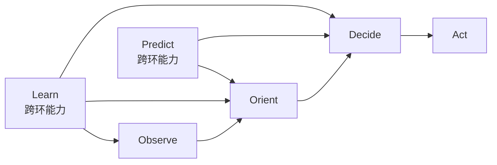
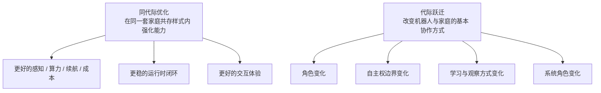

# 机器人代际划分框架

---

文档版本：v1.0
创建日期：2026-03-23
作者：Codex-架构师

文档变更记录：
- v1.0 | 2026-03-23 | Codex-架构师 | 基于最新需求澄清，形成独立的机器人代际划分框架，明确代际驱动因素、同代际优化与代际跃迁边界，并将 `OODA` 主环、`Predict / Learn` 跨环能力以及“信息服务到物理服务”的跃迁纳入统一判断口径。

---

## 1. 文档定位

本文档用于回答两个问题：

1. 在大模型与具身智能时代，是什么在驱动机器人的代际发展。
2. 应该如何区分机器人“同代际优化”与“代际跃迁”。

本文是架构评审输入，不直接替代当前 `PDCP` 主线。它主要服务于：

1. 统一 Kinbot 的代际讨论口径；
2. 为 [Kinbot架构演进分析与阶段提案](./10_kinbot_architecture_evolution_analysis.md) 提供引用基线；
3. 为后续一代、二代和终局路线评审提供统一判断标准。

## 2. 核心判断

### 2.1 代际的本质

在大模型与具身智能时代，驱动机器人代际变化的，不再主要是器件升级，而是：

`机器人与人、家庭空间、服务系统之间的基本协作样式是否发生了变化`

因此：

1. 算力更大、时延更低、续航更长、感知更稳，通常仍属于同代际优化；
2. 角色、自主权边界、物理服务能力、经验学习方式、家庭协作关系发生变化，才更可能构成代际跃迁。

### 2.2 参考军事作战理念的代际定义

本文对“代际”的定义，参考军事作战理念中的“代际变革”：

1. 同代际优化：在同一套作战样式或同一套家庭共存样式下，把能力、效率、可靠性和成本做得更强。
2. 代际跃迁：机器人与人、空间、服务系统之间的基本协作样式发生变化。
3. 所以，定义下一代机器人，不只是定义更强硬件或更强模型，而是在定义“下一代人机共存的家庭生活”。

## 3. 驱动机器人代际发展的六个因素

### 3.1 认知范式变化

1. 从规则和脚本系统，走向感知、语言、行动统一建模。
2. 从“执行命令”，走向“理解上下文、关系、长期任务和风险”。

### 3.2 闭环能力变化

机器人能力的真正跃迁，不在单点精度，而在闭环深度。

本项目建议维持：

`Observe -> Orient -> Decide -> Act`

作为主环。

同时：

1. `Predict` 作为 `Orient / Decide` 的关键跨环能力存在；
2. `Learn` 作为跨周期、跨任务、跨版本的演化能力存在。

也就是说，不建议把它机械改成线性长链，而是：

- `OODA` 自成主环
- `Predict` 和 `Learn` 作为跨环能力贯穿其中

### 3.3 数据与经验飞轮变化

1. 早期机器人主要靠人工编程和规则迭代。
2. 新一代机器人越来越依赖真值参考链、仿真、受控回流和经验学习。
3. 能否形成可审计的经验飞轮，是代际差异的重要驱动。

### 3.4 自主权与责任边界变化

1. 不是“能不能自主移动”这么简单。
2. 真正的变化在于：机器人能否在授权边界内长期自主承担责任。
3. 当机器人从工具变成长期自治体，代际通常已经发生变化。

### 3.5 系统角色变化

1. 从单机设备，走向本体、穿戴、家居、App、云、人工服务、第三方生态组成的产品系统。
2. 当机器人从“设备”变成“系统节点”，其代际属性会显著变化。

### 3.6 人机关系变化

这是最深层的驱动因素。

1. 当机器人只完成一次任务，它还是工具。
2. 当机器人开始参与家庭节律、关系维护、安全秩序和长期照护，它就进入了新的共存模式。

## 4. 代际区分标准

### 4.1 同代际优化

以下变化通常属于同代际优化：

1. 更大算力；
2. 更低时延；
3. 更长续航；
4. 更高识别率；
5. 更稳夜间能力；
6. 更自然交互；
7. 更低 `BOM`。

这些都重要，但如果机器人在家庭中的角色没有改变，本质上仍是同一代。

### 4.2 代际跃迁

以下变化更可能构成代际跃迁：

1. 角色变化：从被调用工具走向长期共存成员；
2. 自主性变化：从执行命令走向在授权边界内持续主动工作；
3. 学习方式变化：从静态出厂能力走向可审计的持续经验学习；
4. 观察方式变化：从被动看见走向主动观察、主动取证、主动理解；
5. 系统形态变化：从单机产品走向家庭元场景操作系统；
6. 关系处理变化：从交互功能走向关系状态进入架构核心。

## 5. 信息服务到物理服务的代际分界

### 5.1 为什么这是关键代际线

从只能提供信息服务，到能够提供物理服务，属于明显的代际跃迁。

原因不是“多了一个执行器”，而是机器人开始：

1. 直接改变物理环境；
2. 改变物体与人的空间关系；
3. 改变安全责任、授权边界和家庭信任结构。

### 5.2 信息服务与物理服务的区别

| 维度 | 信息服务 | 物理服务 |
| --- | --- | --- |
| 主要影响对象 | 信息流、认知流、决策流 | 物理环境、物体位置、空间可达性 |
| 主要风险 | 误导、误判、隐私 | 碰撞、伤害、错递送、错处置 |
| 责任边界 | 认知责任为主 | 认知责任 + 物理责任 |
| 架构重点 | 知识、交互、理解 | 安全、授权、空间理解、执行闭环 |

### 5.3 初级物理服务也构成代际跃迁

这里的“物理服务”不要求一定是复杂机械臂操作。

只要机器人可以稳定地：

1. 改变物体位置；
2. 改变人与物的接近关系；
3. 改变空间中的可达性与服务状态；

它就已经从“信息服务机器人”跨入了“物理服务机器人”的代际。

因此：

1. 移动底盘 + 储物仓改变药品位置，本质上已经是物理服务；
2. 即使它只是递送、靠近、转运和位置改变，而不是复杂抓取，也已经越过了这一条代际分界线。

## 6. 一个可执行的代际划分框架

### 6.1 三层判断法

本文建议用三层判断机器人当前所处的代际：

1. `G1 信息服务代`
   - 主要改变信息流、认知流和决策流
   - 以问答、提醒、监测、建议为主
2. `G2 初级物理服务代`
   - 主要通过移动、递送、位置改变、空间介入提供价值
   - 开始承担物理责任
3. `G3 共存自治代`
   - 机器人成为长期共存成员
   - 主动观察、关系状态、经验学习、系统级协同进入核心

### 6.2 与 OODA 跨环能力的关系

| 层级 | 主环能力 | `Predict` | `Learn` |
| --- | --- | --- | --- |
| `G1` | 基础 `OODA` | 局部预测 | 以离线调参和规则更新为主 |
| `G2` | 稳定 `OODA` 闭环 | 对任务结果、环境和风险做预测 | 形成研发级真值链和受控数据闭环 |
| `G3` | 多尺度 `OODA` | 主动观察、前瞻规划、关系预测 | 受控经验学习进入长期能力 |

## 7. Kinbot 的代际判断

### 7.1 当前一代 Kinbot

Kinbot 当前一代的定位，不再是纯信息服务机器人，而是：

`从信息服务代向初级物理服务代跃迁的家庭机器人`

原因在于它已经明确追求：

1. 自主移动；
2. 自主接近用户；
3. 储物仓递送；
4. 位置改变型物理服务；
5. 健康、陪伴、安全三条主链的长期闭环。

### 7.2 Kinbot 的同代际优化方向

一代期内最应投入的是：

1. 纯视觉夜间闭环；
2. 头部优先与主动观察前置准备；
3. `OODA Scale Scheduler` 强化；
4. `World State` 分层；
5. 关系质量评价与治理；
6. 研发真值链和受控数据闭环。

### 7.3 Kinbot 的代际跃迁方向

Kinbot 的下一代，不应只是“更强一代”，而应开始体现：

1. 关系状态进入架构核心；
2. 主动观察成为一级能力；
3. 家庭元场景长期适应与经验学习；
4. 从单机器人产品走向家庭元场景操作系统。

## 8. 最终建议

1. 在一代期内，坚持把“同代际优化”和“代际跃迁”分开管理。
2. 不要用器件升级冒充代际升级。
3. 把“信息服务到物理服务”的跃迁视为真实代际线。
4. 把 `Predict / Learn` 视为跨环能力，而不是简单追加到 `OODA` 末尾。
5. 在 Kinbot 的后续评审中，凡讨论“下一代”，都必须回答：
   - 它到底改变了哪一类家庭共存样式？

