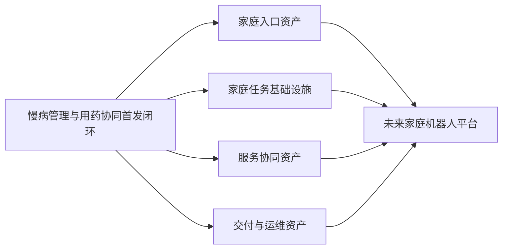

# 未来家庭机器人愿景与宪章（EMT战略承接稿）

---

文档版本：v1.4
创建日期：2026-03-26
作者：Codex-战略承接人

文档变更记录：
- v1.4 | 2026-03-27 | Codex-战略承接人 | 将破冰成交表述统一收敛为“产品线负责人亲自破冰推动部分标杆首单”，使口径更贴近实际组织分工。
- v1.3 | 2026-03-27 | Codex-战略承接人 | 根据最新上会口径，补充“组织型买方为主 + 产品线负责人亲自破冰部分标杆首单”的启动路径，并把阶段 `2/3` 编制上限改成更具弹性的释放机制。
- v1.2 | 2026-03-27 | Codex-战略承接人 | 按 `office-hours` 与最新 CEO 评审意见，继续补强首单成交机制、平台扩张梯子与阶段资源分批释放表，使文档更接近 `EMT` 可审批版本。
- v1.1 | 2026-03-27 | Codex-战略承接人 | 按 CEO 视角评审意见强化文档的审批逻辑，补入“不是养老小项目而是平台第一块基石”的定位、首单路径建议、阶段门 stop/go 机制与更具不可替代性的制胜逻辑。
- v1.0 | 2026-03-26 | Codex-战略承接人 | 基于 `Step 42` 战略输入，将原《Kinbot运行规范》中的“未来愿景”层独立重构为面向集团 `EMT` 的战略承接文档，明确首发切口、制胜逻辑与分阶段投入建议。

---

## 1. 文档定位

本文不是一代运行规范，也不是产品家族规则清单，而是面向集团 `EMT` 的战略承接文档，用于回答 4 个问题：

1. 为什么集团现在必须进入未来家庭机器人方向。
2. 为什么 `Kinbot` 首发应聚焦“独居老人 / 老两口”的慢病管理与用药协同。
3. 为什么这件事应由本集团来做。
4. 本次概念评审希望 `EMT` 具体批准什么。

本文默认承接以下约束：

1. 当前阶段仍处于 `PDCP` 前后的概念评审与战略收口阶段。
2. 一代运行规范不单独成文，后续在 `PRD` 与模块方案中体现。
3. “未来家庭机器人愿景 / 宪章”是本轮优先产出；“产品家族级运行原则”当前不单独展开。

## 2. 执行摘要

### 2.1 一句话判断

未来家庭机器人不应被定义为“会移动的智能硬件”，也不应被定义为“自主医疗终端”，而应被定义为**家庭中的具身照护协调节点**：它长期存在于家庭空间中，统一承接信息世界与物理世界的连续服务，把今天由老人、家属、药盒、手机 `App`、客服和第三方平台分散承担的流程重新组织为可持续、可被信任、可规模化交付的产品闭环。

### 2.2 `Kinbot` 首发判断

如果 `EMT` 只允许集团先打一根钉子，当前最合理的首发切口是：

1. 目标家庭：独居老人或子女不在身边的老两口家庭。
2. 首发主问题：慢病管理与用药协同。
3. 首发产品价值：在家庭中连续完成“提醒 -> 到人 -> 递药引导 -> 确认 -> 问询升级 -> 补药 / 挂号”的具身闭环。

### 2.3 本次建议 `EMT` 批准的事项

必须批准：

1. 首发的核心功能与场景切口。
2. `10` 个月、`9000` 万、`55` 人基准盘子下的阶段门投入机制，并为阶段 `3` 放量时的补充扩编保留审批口子。

最好一并确认：

1. 该方向作为集团战略级投入下首款产品的定位。
2. 首单成交机制、试点路径与产品进入市场的方式、节奏。

### 2.4 本次审批的真实含义

本次概念评审真正需要 `EMT` 批准的，不是一个“养老细分项目”的立项，而是以下 3 件事：

1. **批准一条可止损、可扩展的首发路径**：先从最强痛点家庭场景打透，而不是在终局想象上一次性押注。
2. **批准未来家庭机器人平台的第一块基石**：`Kinbot V1` 首发虽然从慢病管理与用药协同切入，但其任务是为未来家庭机器人沉淀家庭入口、连续服务、交付与扩圈能力。
3. **批准“总盘子 + 阶段门 + stop/go + 补充扩编”机制**：不是一次性 `all-in`，而是上一阶段不成立就不释放下一阶段资源；若阶段 `2` 明显成立且 `EMT` 决定扩大试点规模，再通过补充审批放大阶段 `3` 编制。

## 3. 为什么是现在

### 3.1 集团内部时点

当前集团董事长已明确提出：机器人有机会成为集团在现有收入规模之后继续跃迁的关键方向。因此，本次不是一般的新项目讨论，而是一次关于集团下一条战略级产品主线的概念评审。

### 3.2 外部窗口已经形成

当前窗口并非单点变化，而是 3 个趋势同时叠加：

1. 具身智能技术快速进展，使许多过去无法完成的移动、交互、递送与连续服务任务开始具备现实可行性。
2. 在“去全球化”与制造业重构背景下，中美都在加强机器人与具身智能投入，产业成熟速度被进一步拉快。
3. 中国快速老龄化、人口结构变化与居家服务人力缺口，使家庭场景不再只是“想象空间”，而是正在形成真实需求压力的战略场景。

### 3.3 外部共识校验

从外部公开材料看，当前主流并不支持把居家老龄场景理解为“一个单点设备解决一个单点问题”，而更强调：

1. 居家与社区环境中的连续照护、整合服务与以人为中心的协同路径。[WHO ICOPE 2025 指南](https://www.who.int/publications/i/item/9789240103726)、[WHO 老龄化整合照护页面](https://www.who.int/health-topics/ageing/transforming-health-and-social-services-towards-a-more-person-centred-and-integrated-care)
2. 药物管理机器人有潜力提升依从性、减少错误，但必须处理信任、隐私、训练与技术边界。[Medication management robot systems review, 2025](https://pubmed.ncbi.nlm.nih.gov/40685794/)
3. 老年用户更容易接受机器人承担提醒、陪伴、物流和连续支持，而不希望其越位替代高责任医疗判断。[Older adults' perceptions of medication management robots](https://pubmed.ncbi.nlm.nih.gov/31240280/)

这与 `Kinbot` 当前收敛出的判断一致：首发不应做“自主医疗机器人”，而应做“家庭中的具身照护协调节点”。

## 4. 未来家庭机器人愿景

### 4.1 愿景定义

未来家庭机器人应成为家庭中的长期成员型基础设施，具备以下特征：

1. **长期在场**：长期存在于家庭时间与空间中，而不是按需短时使用的单点设备。
2. **统一服务**：统一承接信息世界与物理世界的服务，而不是让用户在多个设备和服务之间自行拼接。
3. **可信协同**：不替代家属、医生、客服或第三方平台，而是把这些角色连接成一条更稳定的协同链。
4. **渐进增强**：先从高频、高后果、最容易断裂的闭环切入，再向更广家庭服务扩张。
5. **可进家、可被信任、可量产**：既要技术成立，也要在隐私、授权、成本、外观、交互与工程上成立。

### 4.2 宪章条款

未来家庭机器人方向建议遵守以下 `7` 条宪章：

1. **机器人首先是家庭中的连续服务节点，而不是单次任务机器。**
2. **机器人首先解决“流程断裂”问题，而不是只堆叠单项能力。**
3. **机器人必须统一信息服务与物理服务，不能退化为碎片化设备集合。**
4. **机器人不越位替代高责任专业判断，但必须把需要人的节点稳定地接上。**
5. **机器人进入家庭，必须以授权、审计、信任和可解释为前提。**
6. **机器人首发必须从强痛点强闭环切入，而不是从泛家庭大而全切入。**
7. **机器人路线要按阶段门释放投入，而不是在终局想象上一次性押注。**

### 4.3 不是现在要做的事

为了防止方向发散，当前明确不把以下内容当作首发承诺：

1. 泛家庭全能机器人。
2. 自主医疗决策终端。
3. 依赖机械臂才能成立的首发价值闭环。
4. 以大量分立外设与外包人工替代机器人主体价值的“伪机器人方案”。

## 5. 为什么首发切口是慢病管理与用药协同

### 5.1 为什么是这类家庭

独居老人或子女不在身边的老两口家庭，具备 3 个典型特征：

1. 用药需求频繁、持续、后果明确。
2. 家属关心但不在现场，天然存在时空断裂。
3. 用户并不一定缺“信息”，更缺“在场、提醒、确认、兜底”。

### 5.2 现状为什么会断

今天典型流程通常是：

1. 老人自己买药，或由子女协助分装、写说明。
2. 老人自己提醒自己，或老两口互相提醒。
3. 是否按时、按量、按顺序服药，基本只能靠老人自证。
4. 缺药、过期、误服、漏服等问题经常在事后才暴露。
5. 一旦出问题，通常只能直接就医，家庭内缺少持续兜底。

其根本问题不只是“没人提醒时间”，而是以下 4 个动作被拆散了：

1. 到点提醒。
2. 到人确认。
3. 对药物与顺序的正确引导。
4. 出现异常后的连续问询、补药、挂号与家属升级。

### 5.3 为什么不是 `App + 药盒 + 人工服务`

`App + 药盒 + 人工服务` 的极限是提供信息世界中的碎片化辅助，但它存在 3 个结构性问题：

1. **实体过多**：用户需要自行在多个设备、多个入口和多个责任方之间切换。
2. **服务不连续**：时间提醒、空间到人、服药确认和异常升级往往不是同一套系统完成。
3. **责任不闭环**：真正出问题时，系统经常退回“还是人自己处理”。

集中式机器人虽然当前技术仍在成长中，但它具备一个决定性潜力：**用一个长期在场的主体，把信息理解、空间移动、实体递送和流程升级统一成同一条连续服务链。**

## 6. `Kinbot V1` 首发产品定义

### 6.1 产品定位

`Kinbot V1` 不是一个泛化家庭机器人原型，而是集团在“未来家庭机器人”方向下的首款战略级产品验证器：

1. 对上验证集团是否应持续下注该方向。
2. 对下验证“具身照护协调节点”这一产品定义是否成立。
3. 对市场验证老人慢病管理与用药协同是否能形成可被信任的首发闭环。

### 6.2 首发最小闭环

在明确首发不依赖机械臂前提下，最小可交付闭环定义为：

1. 找到人。
2. 到人。
3. 开仓递药。
4. 语音 / 屏幕 / 灯光引导。
5. 确认是否服药。
6. 必要时继续问诊并通知家属。
7. 主动下单即将用完的药品。
8. 按需进行网上预约挂号。

### 6.3 首发产品护栏

`V1` 必须同时守住以下护栏：

1. 不越位作高责任医疗决策。
2. 不把复杂机械臂动作当作首发价值成立前提。
3. 不把用户隐私和高敏感数据处理写成粗暴回流模式。
4. 不为追求大而全而牺牲“聪明、温暖、精致”的产品感与可量产性。

### 6.4 `V1` 必须沉淀的平台资产

`Kinbot V1` 之所以不应被理解为一个孤立的老龄功能产品，是因为它应为未来家庭机器人沉淀至少 `4` 类平台资产：

1. **家庭入口资产**：让机器人在家庭中长期在场、被授权、被信任，而不是一次性完成某个任务后退出。
2. **家庭任务基础设施**：沉淀“找到人、到人、确认、升级、跨端协同”的具身任务基础能力，而不是只完成一次用药提醒。
3. **家属与服务网络协同资产**：沉淀家属通知、问询升级、补药、挂号和第三方履约接力的服务协同能力。
4. **交付与运维资产**：沉淀进家部署、权限配置、持续运营、售后和质量回流能力，为未来扩展到其他家庭服务场景做准备。

因此，`V1` 的问题从来不是“它是不是终局产品”，而是：**它是否足够强，足以成为未来家庭机器人平台的第一块基石。**

### 6.5 从首发切口到平台扩张梯子

`Kinbot V1` 的平台价值，不在于它首发就覆盖了多少家庭任务，而在于它打下的能力是否自然通向后续扩张。更合理的扩张梯子应是：

1. **第一层：健康主线内扩**  
   从慢病管理与用药协同，扩到异常问询、复诊协同、补给协同与更完整的健康遵循服务。
2. **第二层：关系与陪伴扩展**  
   借由已经建立的家庭授权与高频触点，扩到家属沟通、主动问候、情绪陪伴与日常生活提醒。
3. **第三层：安全与看护扩展**  
   借由已经沉淀的“找到人、到人、观察现场、升级服务”能力，扩到夜间异常关注、家庭安全巡护与老人看护协同。

因此，这次首发切口的真正价值，不只是服务了哪类老人，而是它是否能成为未来家庭机器人从健康进入家庭、再向更广场景扩张的第一条正确路径。

## 7. 为什么应该由我们集团来做

### 7.1 一句话制胜理论

因为独居老人慢病管理与用药协同不是单一软件、单一硬件或单一医疗服务问题，而是一场“医疗理解、`AI` 交互、机器人产品化、家庭信任与规模交付”必须同时成立的复合战；而我们真正稀缺的不是四项能力都存在，而是有条件在同一组织、同一项目节奏和同一阶段门下，把四项能力压成首个可进家、可被批准、可被试点、可被量产的闭环。

### 7.2 胜率来源

当前集团的胜率并不来自某一项单点能力，而来自以下组合优势：

1. **正确定义产品边界的能力**：医疗数据、技术与行业理解，使我们更有机会把产品定义在“具身照护协调节点”而不是“越位替代医生的医疗机器人”上。
2. **把概念压成真实机器人的能力**：`AI / 大模型 / 多模态交互` 与智能硬件设计、开发、供应链能力，决定我们是否能把设想压成真实可进家的产品，而不是实验室样机。
3. **把试点做成信任关系的能力**：`C` 端品牌认知、政企协同能力和家庭场景中的服务交付能力，决定我们是否能更快获得首批愿意进家的试点家庭。
4. **把首发闭环做成长期主线的能力**：集团级资源、组织耐心和跨业务协同能力，决定我们是否有条件跑完 `10` 个月验证，而不是在中途退化成单点设备项目。

### 7.3 为什么这会转化为先手机会

真正决定胜率的，并不是“谁能做出一个机器人原型”，而是谁更有机会更早完成以下 `4` 个动作：

1. **拿到第一批可信家庭入口**：首批 `100` 户不是简单卖货，而是要获得真实家庭、家属和合作方共同授权进入。
2. **把试点做成真实闭环**：不仅要演示机器人本体，还要让家属通知、补药、挂号、售后与异常升级真正接上。
3. **把试点做成规模化前哨**：试点的目标不是完成展示，而是验证它是否能通向复购、扩圈和后续标准化交付。
4. **把资源消耗控制在可管理边界内**：只有能在阶段门下持续校正、及时止损的组织，才适合做这条长周期新主线。

### 7.4 为什么别人未必更适合

从当前格局看：

1. 消费电子巨头更擅长设备与生态，但不一定在医疗理解与行业协同上足够深。
2. 医疗服务方更擅长专业判断，但不一定能做出可进家、可量产、可持续交付的机器人载体。
3. 创业公司可能在单点技术上激进，但在供应链、品牌、试点和长期投入上更脆弱。
4. 互联网平台擅长流量与连接，但不天然擅长长期在场的机器人产品交付。

因此，本集团的机会不是“某一项能力最强”，而是**更有机会把首发切口、首批家庭入口、真实服务协同与规模交付这整条链在一个组织里做完整。**

## 8. 进入市场的方式与节奏

### 8.1 建议进入方式

首发不宜按“泛家庭爆款硬件”进入，而应按“战略级首款产品 + 高质量试点验证 + 再扩圈”进入：

1. 先拿到强痛点家庭场景中的可信首单，而不是一开始假设全量 `C` 端自然购买。
2. 先做出能代表集团未来方向、并能真实进家的首款战略产品。
3. 先在强痛点家庭中验证产品与服务协同闭环，再决定大规模扩张节奏。

### 8.2 首单成交机制建议

对 `EMT` 来说，“首单路径”不能只回答谁使用，还必须同时回答谁付款、谁签字、谁负责持续交付。建议把首单成交机制拆成以下 `3` 个角色：

1. **实际使用者**：独居老人或子女不在身边的老两口家庭。
2. **经济买方**：首批试点不宜主要依赖纯零售自然转化，而应优先明确一个真实付款方。
3. **交付运营方**：设备进家、权限配置、售后服务、异常升级与运营协同必须有明确责任主体。

建议优先收敛以下一种首单成交机制，而不是同时铺开：

1. **`B2G2C / 政企试点采购`**：由地方老龄、健康、社区或相关试点项目采购首批设备与服务包，家庭作为实际使用者。
2. **`B2B2C / 机构联合采购`**：由保险、雇主福利、医康养或药事服务合作方采购，家庭按共付费方式接入。
3. **`D2C / 家属自费种子验证`**：仅作为少量补充验证路径，用于验证真实付费意愿、安装流程和售后压力，不宜承担首批 `100` 台的主体任务。

当前建议口径是：**首批 `100` 台 / `100` 户应由一个明确的组织型买方承担主体采购责任，少量家庭自费 / 共付费作为验证补充，而不是把全部试点压力放在纯零售转化上。**

如果组织型买方在首批窗口内还不足以覆盖全部试点量，则建议明确保留一条**产品线负责人亲自破冰推动部分标杆首单**的补充路径，用来拿下关键合作方或关键家庭样板。但这应被写成首批启动动作，而不是长期规模化成交模型。

### 8.3 试点路径建议

当前更合理的首单路径建议是：

1. 首批 `100` 台 / `100` 户应优先依托集团既有的政企、医疗、保险、社区或地方合作关系，形成带签约主体的高质量试点入口。
2. 如果组织型买方暂时无法覆盖全部首批量，可由产品线负责人亲自推动少量标杆客户、标杆家庭或关键合作方完成破冰成交，用来启动第一批高质量验证。
3. 在此基础上，可引入少量家属自费或共付费的种子家庭，用于验证真实意愿、安装流程与持续使用情况。
4. 试点本身必须同步验证“设备进家、授权配置、售后服务、异常升级、家属协同”这一整条服务链，而不是只验证机器人本体。
5. 如果到阶段 `2` 结束时，仍没有明确的经济买方、签约主体和试点家庭来源，则不应自动释放完整阶段 `3` 资源。

### 8.4 建议节奏

建议节奏与现有项目基线保持一致：

1. `2026-03-31` 左右完成产品定义与架构冻结。
2. `2026-12-31` 目标达到量产预备状态。
3. `2027-01` 完成 `100` 台 / `100` 户 / `1` 个月试点验证窗口。

### 8.5 试点必须回答的问题

`100` 台 / `100` 户 / `1` 个月试点的目的，不是“证明机器人能跑”，而是回答以下问题：

1. 家庭是否真正信任机器人承担慢病管理与用药协同中的连续角色。
2. 家属是否愿意把部分照护协调工作稳定地交给机器人和平台。
3. 设备进家、运维、售后与服务接力是否可被组织化交付。
4. 首批组织型买方是否愿意续签、扩单或转为下一阶段规模化合作。
5. 产品线负责人亲自推动的破冰样板，是否能转化为可复制的合作路径，而不是停留在个人推动层。
6. 这条路径是否有明确的复购、扩圈或下一阶段规模化信号。

## 9. 投入规模与阶段门释放

### 9.1 总盘子

当前建议 `EMT` 批准的总盘子为：

1. 周期：`10` 个月
2. 预算：`9000` 万人民币
3. 人员规模：`55` 人为当前基准编制，不作为阶段 `3` 放量时的绝对硬封顶
4. 释放方式：按阶段门分批释放，不做一次性 `all-in`

### 9.2 `EMT` 应批准的是机制，不只是数字

对 `EMT` 来说，本次更应批准的是以下机制：

1. 先确认 `10` 个月、`9000` 万、`55` 人基准盘子。
2. 再明确每个阶段都存在 `go / revise / stop` 三种结果，而不是天然进入下一阶段。
3. 如果阶段 `2` 显著成立且 `EMT` 决定扩大试点规模，允许项目组就阶段 `3` 提交补充扩编申请，而不是把 `55` 人误写成不可突破的绝对封顶。
4. 每次进入下一阶段前，项目组都必须补交该阶段资源申请附件，至少包含：阶段预算、阶段编制、里程碑、通过标准和失败后的收缩动作。

### 9.3 建议上会附件采用的资源释放表

以下口径属于**建议上会版本**，用于把“分阶段投入”从原则表述压成可审批结构，不应被误读为已经冻结的正式资源事实：

| 阶段                 | 建议释放预算                  | 建议阶段编制上限  | 这一阶段的钱主要用来做什么                          |
| ------------------ | ----------------------- | --------- | -------------------------------------- |
| 阶段 `1`：产品定义与架构冻结   | 总盘子的约 `20%`，即约 `1800` 万 | `20-25` 人 | 冻结切口、护栏、系统路径与首单成交机制，不让后续投入建立在模糊前提上     |
| 阶段 `2`：工程样机与核心闭环打通 | 总盘子的约 `40%`，即约 `3600` 万 | `35-50` 人 | 把机器人本体、伴生系统和服务接力真正打通，验证“不是未来能力补洞”      |
| 阶段 `3`：试点与量产预备     | 剩余约 `40%`，即约 `3600` 万   | `50-55` 人为基准；若试点放量经 `EMT` 补充批准，可突破 `55` 人 | 跑完 `100` 台 / `100` 户试点，并完成量产预备、交付与运营收口；若验证强劲则为更大测试规模做准备 |

如果 `EMT` 不希望在第一次会议上一次核准完整放量编制，可改为：**核准总盘子基线 + 分阶段编制上限 + 阶段 `3` 补充扩编口子**，每一阶段通过后再放下一阶段编制。

### 9.4 三阶段释放建议

| 阶段 | 这一阶段要回答的问题 | 进入下一阶段前必须同时满足 | 不满足时的动作 |
| --- | --- | --- | --- |
| 阶段 `1`：产品定义与架构冻结 | 我们是不是选对了切口，机器人是否真的必要，首单成交机制是否开始具体化？ | 首发切口、首发闭环、产品护栏冻结；机器人主体价值不依赖未来机械臂；首单成交机制已从“概念”推进到“明确的目标买方类型与合作入口” | 不释放阶段 `2` 完整资源，回到产品定义或直接停止 |
| 阶段 `2`：工程样机与核心闭环打通 | 机器人能否在代表性家庭环境中稳定完成核心闭环，而不是靠未来能力或大量人工补洞？ | “找到人 -> 到人 -> 开仓递药 -> 引导 -> 确认 -> 升级”链路稳定打通；补药、挂号、家属通知等伴生链路真正接上；隐私、授权、安全与审计边界成立；形成明确的经济买方与试点签约框架，或至少已形成产品线负责人可亲自破冰的标杆成交名单 | 不自动进入阶段 `3`，优先判断是重做关键链路、收缩试点还是停止 |
| 阶段 `3`：试点与量产预备 | 首发闭环是否在真实家庭中成立，并能通向扩圈而不是停留在展示？ | 完成 `100` 台 / `100` 户 / `1` 个月试点；未出现无法接受的安全、隐私与信任事故；组织型买方或合作方对续签、扩单或下一阶段合作拥有明确信号；若申请突破 `55` 人，必须同时证明测试规模放大与后续订单机会匹配 | 不进入更大规模投入，转为复盘、收缩或改写方向 |

### 9.5 上会附件必须补齐的资源包内容

为了让阶段门真正可裁决，而不是仅停留在表述层，建议项目组在上会附件中补齐以下内容：

1. 每一阶段拟释放的预算上限与人员规模。
2. 每一阶段的里程碑、通过标准和明确的失败信号。
3. 每一阶段不通过时的收缩动作、延后条件或停止条件。
4. 首单成交机制对应的经济买方、签约主体、交付责任主体与付款结构。
5. 产品线负责人若需亲自推动破冰首单，其标杆对象名单、成交目标与从“个人推动”过渡到“组织化复制”的判断标准。
6. 阶段 `2` 结束时如果经济买方或签约框架仍不清晰，是否允许只释放局部试点资源而非完整阶段 `3` 资源。
7. 若阶段 `3` 申请突破 `55` 人，新增测试规模、交付压力、预算影响与退出条件分别是什么。

## 10. 本次建议 `EMT` 审批事项

### 10.1 必须批准

1. **首发核心功能与场景切口**  
   即：以“独居老人 / 老两口家庭”的慢病管理与用药协同作为 `Kinbot V1` 首发切口。

2. **总盘子与三阶段 stop/go 释放机制**  
   即：确认 `10` 个月、`9000` 万、`55` 人基准盘子，并接受上一阶段不成立就不自动释放下一阶段资源；若阶段 `3` 需要放大测试规模，再走补充扩编审批。

### 10.2 最好一并确认

1. **战略级首款产品定位**  
   即：确认 `Kinbot` 作为集团在未来家庭机器人方向上的首款战略级产品。

2. **首单成交机制与进入市场的方式、节奏**  
   即：确认优先通过强痛点场景中的组织型买方拿到首批试点订单；必要时由产品线负责人亲自推动少量破冰首单，再逐步扩圈，而不是一开始做泛家庭爆款。

## 11. 结论

集团当前不是在决定“要不要看一看机器人”，而是在决定：是否要用一款真正可进家的战略级产品，去打下未来家庭机器人平台的第一块基石。

如果 `EMT` 认可：

1. 未来家庭机器人应被定义为家庭中的具身照护协调节点；
2. 首发应从独居老人 / 老两口的慢病管理与用药协同切入；
3. `Kinbot V1` 的任务不是做一个养老小项目，而是沉淀未来平台所需的家庭入口、任务基础设施、服务协同与交付能力；
4. 这条主线未来应沿“健康主线内扩 -> 关系与陪伴扩展 -> 安全与看护扩展”的梯子自然扩张，而不是重新寻找下一批不相关场景；
5. 本集团具备把首发切口、首批家庭入口、服务协同与规模交付压成同一条闭环的独特组合能力；
6. 投入应按总盘子确认、按阶段门释放，并绑定首单成交机制、必要时的产品线负责人亲自破冰动作与 stop/go 评审；

那么 `Kinbot` 就不应再被理解为“一个机器人项目”或“一个养老场景小项目”，而应被理解为**集团下一条战略级产品主线的首款验证器与平台起点。**
