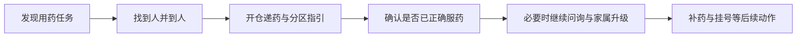
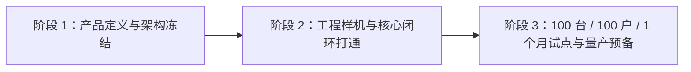

# 未来家庭机器人愿景与宪章（EMT战略承接稿）

---

文档版本：v1.0
创建日期：2026-03-26
作者：Codex-战略承接人

文档变更记录：
- v1.0 | 2026-03-26 | Codex-战略承接人 | 基于 `Step 42` 战略输入，将原《Kinbot运行规范》中的“未来愿景”层独立重构为面向集团 `EMT` 的战略承接文档，明确首发切口、制胜逻辑与分阶段投入建议。

---

## 1. 文档定位

本文不是一代运行规范，也不是产品家族规则清单，而是面向集团 `EMT` 的战略承接文档，用于回答 4 个问题：

1. 为什么集团现在必须进入未来家庭机器人方向。
2. 为什么 `Kinbot` 首发应聚焦“独居老人 / 老两口”的慢病管理与用药协同。
3. 为什么这件事应由本集团来做。
4. 本次概念评审希望 `EMT` 具体批准什么。

本文默认承接以下约束：

1. 当前阶段仍处于 `PDCP` 前后的概念评审与战略收口阶段。
2. 一代运行规范不单独成文，后续在 `PRD` 与模块方案中体现。
3. “未来家庭机器人愿景 / 宪章”是本轮优先产出；“产品家族级运行原则”当前不单独展开。

## 2. 执行摘要

### 2.1 一句话判断

未来家庭机器人不应被定义为“会移动的智能硬件”，也不应被定义为“自主医疗终端”，而应被定义为**家庭中的具身照护协调节点**：它长期存在于家庭空间中，统一承接信息世界与物理世界的连续服务，把今天由老人、家属、药盒、手机 `App`、客服和第三方平台分散承担的流程重新组织为可持续、可被信任、可规模化交付的产品闭环。

### 2.2 `Kinbot` 首发判断

如果 `EMT` 只允许集团先打一根钉子，当前最合理的首发切口是：

1. 目标家庭：独居老人或子女不在身边的老两口家庭。
2. 首发主问题：慢病管理与用药协同。
3. 首发产品价值：在家庭中连续完成“提醒 -> 到人 -> 递药引导 -> 确认 -> 问询升级 -> 补药 / 挂号”的具身闭环。

### 2.3 本次建议 `EMT` 批准的事项

必须批准：

1. 首发的核心功能与场景切口。
2. `10` 个月、`9000` 万、`55` 人总盘子的分阶段投入机制。

最好一并确认：

1. 该方向作为集团战略级投入下首款产品的定位。
2. 产品进入市场的方式与节奏。

## 3. 为什么是现在

### 3.1 集团内部时点

当前集团董事长已明确提出：机器人有机会成为集团在现有收入规模之后继续跃迁的关键方向。因此，本次不是一般的新项目讨论，而是一次关于集团下一条战略级产品主线的概念评审。

### 3.2 外部窗口已经形成

当前窗口并非单点变化，而是 3 个趋势同时叠加：

1. 具身智能技术快速进展，使许多过去无法完成的移动、交互、递送与连续服务任务开始具备现实可行性。
2. 在“去全球化”与制造业重构背景下，中美都在加强机器人与具身智能投入，产业成熟速度被进一步拉快。
3. 中国快速老龄化、人口结构变化与居家服务人力缺口，使家庭场景不再只是“想象空间”，而是正在形成真实需求压力的战略场景。

### 3.3 外部共识校验

从外部公开材料看，当前主流并不支持把居家老龄场景理解为“一个单点设备解决一个单点问题”，而更强调：

1. 居家与社区环境中的连续照护、整合服务与以人为中心的协同路径。[WHO ICOPE 2025 指南](https://www.who.int/publications/i/item/9789240103726)、[WHO 老龄化整合照护页面](https://www.who.int/health-topics/ageing/transforming-health-and-social-services-towards-a-more-person-centred-and-integrated-care)
2. 药物管理机器人有潜力提升依从性、减少错误，但必须处理信任、隐私、训练与技术边界。[Medication management robot systems review, 2025](https://pubmed.ncbi.nlm.nih.gov/40685794/)
3. 老年用户更容易接受机器人承担提醒、陪伴、物流和连续支持，而不希望其越位替代高责任医疗判断。[Older adults' perceptions of medication management robots](https://pubmed.ncbi.nlm.nih.gov/31240280/)

这与 `Kinbot` 当前收敛出的判断一致：首发不应做“自主医疗机器人”，而应做“家庭中的具身照护协调节点”。

## 4. 未来家庭机器人愿景

### 4.1 愿景定义

未来家庭机器人应成为家庭中的长期成员型基础设施，具备以下特征：

1. **长期在场**：长期存在于家庭时间与空间中，而不是按需短时使用的单点设备。
2. **统一服务**：统一承接信息世界与物理世界的服务，而不是让用户在多个设备和服务之间自行拼接。
3. **可信协同**：不替代家属、医生、客服或第三方平台，而是把这些角色连接成一条更稳定的协同链。
4. **渐进增强**：先从高频、高后果、最容易断裂的闭环切入，再向更广家庭服务扩张。
5. **可进家、可被信任、可量产**：既要技术成立，也要在隐私、授权、成本、外观、交互与工程上成立。

### 4.2 宪章条款

未来家庭机器人方向建议遵守以下 `7` 条宪章：

1. **机器人首先是家庭中的连续服务节点，而不是单次任务机器。**
2. **机器人首先解决“流程断裂”问题，而不是只堆叠单项能力。**
3. **机器人必须统一信息服务与物理服务，不能退化为碎片化设备集合。**
4. **机器人不越位替代高责任专业判断，但必须把需要人的节点稳定地接上。**
5. **机器人进入家庭，必须以授权、审计、信任和可解释为前提。**
6. **机器人首发必须从强痛点强闭环切入，而不是从泛家庭大而全切入。**
7. **机器人路线要按阶段门释放投入，而不是在终局想象上一次性押注。**

### 4.3 不是现在要做的事

为了防止方向发散，当前明确不把以下内容当作首发承诺：

1. 泛家庭全能机器人。
2. 自主医疗决策终端。
3. 依赖机械臂才能成立的首发价值闭环。
4. 以大量分立外设与外包人工替代机器人主体价值的“伪机器人方案”。

## 5. 为什么首发切口是慢病管理与用药协同

### 5.1 为什么是这类家庭

独居老人或子女不在身边的老两口家庭，具备 3 个典型特征：

1. 用药需求频繁、持续、后果明确。
2. 家属关心但不在现场，天然存在时空断裂。
3. 用户并不一定缺“信息”，更缺“在场、提醒、确认、兜底”。

### 5.2 现状为什么会断

今天典型流程通常是：

1. 老人自己买药，或由子女协助分装、写说明。
2. 老人自己提醒自己，或老两口互相提醒。
3. 是否按时、按量、按顺序服药，基本只能靠老人自证。
4. 缺药、过期、误服、漏服等问题经常在事后才暴露。
5. 一旦出问题，通常只能直接就医，家庭内缺少持续兜底。

其根本问题不只是“没人提醒时间”，而是以下 4 个动作被拆散了：

1. 到点提醒。
2. 到人确认。
3. 对药物与顺序的正确引导。
4. 出现异常后的连续问询、补药、挂号与家属升级。

### 5.3 为什么不是 `App + 药盒 + 人工服务`

`App + 药盒 + 人工服务` 的极限是提供信息世界中的碎片化辅助，但它存在 3 个结构性问题：

1. **实体过多**：用户需要自行在多个设备、多个入口和多个责任方之间切换。
2. **服务不连续**：时间提醒、空间到人、服药确认和异常升级往往不是同一套系统完成。
3. **责任不闭环**：真正出问题时，系统经常退回“还是人自己处理”。

集中式机器人虽然当前技术仍在成长中，但它具备一个决定性潜力：**用一个长期在场的主体，把信息理解、空间移动、实体递送和流程升级统一成同一条连续服务链。**

## 6. `Kinbot V1` 首发产品定义

### 6.1 产品定位

`Kinbot V1` 不是一个泛化家庭机器人原型，而是集团在“未来家庭机器人”方向下的首款战略级产品验证器：

1. 对上验证集团是否应持续下注该方向。
2. 对下验证“具身照护协调节点”这一产品定义是否成立。
3. 对市场验证老人慢病管理与用药协同是否能形成可被信任的首发闭环。

### 6.2 首发最小闭环

在明确首发不依赖机械臂前提下，最小可交付闭环定义为：

1. 找到人。
2. 到人。
3. 开仓递药。
4. 语音 / 屏幕 / 灯光引导。
5. 确认是否服药。
6. 必要时继续问诊并通知家属。
7. 主动下单即将用完的药品。
8. 按需进行网上预约挂号。

### 6.3 首发产品护栏

`V1` 必须同时守住以下护栏：

1. 不越位作高责任医疗决策。
2. 不把复杂机械臂动作当作首发价值成立前提。
3. 不把用户隐私和高敏感数据处理写成粗暴回流模式。
4. 不为追求大而全而牺牲“聪明、温暖、精致”的产品感与可量产性。

## 7. 为什么应该由我们集团来做

### 7.1 一句话制胜理论

因为独居老人慢病管理与用药协同不是单一软件、单一硬件或单一医疗服务问题，而是医疗理解、`AI` 交互、机器人载体和规模交付的复合问题；而我们是少数同时具备这四种能力、能把它做成可进家、可被信任、可量产产品的集团。

### 7.2 胜率来源

当前集团的胜率并不来自某一项单点能力，而来自组合优势：

1. **`AI / 大模型 / 多模态交互`**：决定产品是否足够聪明、是否能做连续问询与自然交互。
2. **智能硬件设计、开发与供应链**：决定产品是否能做成真实可交付的机器人，而不是实验室样机。
3. **医疗数据、技术与行业关系积累**：决定产品是否能真正理解慢病与用药协同，而不是停留在泛提醒层。
4. **`C` 端品牌认知与政企关系**：决定产品是否更容易建立信任、进入试点并形成规模化放量路径。

### 7.3 为什么别人未必更适合

从当前格局看：

1. 消费电子巨头更擅长设备与生态，但不一定在医疗理解与行业协同上足够深。
2. 医疗服务方更擅长专业判断，但不一定能做出可进家、可量产、可持续交付的机器人载体。
3. 创业公司可能在单点技术上激进，但在供应链、品牌、试点和长期投入上更脆弱。
4. 互联网平台擅长流量与连接，但不天然擅长长期在场的机器人产品交付。

因此，本集团的机会不是“某一项能力最强”，而是**最有机会把整条链做完整。**

## 8. 进入市场的方式与节奏

### 8.1 建议进入方式

首发不宜按“泛家庭爆款硬件”进入，而应按“战略级首款产品 + 高质量试点验证 + 再扩圈”进入：

1. 先做出能代表集团未来方向的首款战略产品。
2. 先在强痛点家庭中验证闭环，而不是一开始面向所有家庭。
3. 先验证产品与服务的真实协同能力，再决定大规模扩张节奏。

### 8.2 建议节奏

建议节奏与现有项目基线保持一致：

1. `2026-03-31` 左右完成产品定义与架构冻结。
2. `2026-12-31` 目标达到量产预备状态。
3. `2027-01` 完成 `100` 台 / `100` 户 / `1` 个月试点验证窗口。

## 9. 投入规模与阶段门释放

### 9.1 总盘子

当前建议 `EMT` 批准的总盘子为：

1. 周期：`10` 个月
2. 预算：`9000` 万人民币
3. 人员规模：`55` 人
4. 释放方式：按阶段门分批释放，不做一次性 `all-in`

### 9.2 三阶段释放建议

#### 阶段 1：产品定义与架构冻结

目标：

1. 冻结首发切口、首发闭环与产品护栏。
2. 冻结系统架构与高风险技术路径。
3. 明确首发不做什么。

放行条件：

1. `Kinbot V1` 的最小闭环被明确。
2. 机器人主体价值不依赖未来机械臂。
3. 首发投入与阶段门被 `EMT` 接受。

#### 阶段 2：工程样机与核心闭环打通

目标：

1. 打通“找到人 -> 到人 -> 开仓递药 -> 引导 -> 确认 -> 升级”的核心链路。
2. 打通补药、挂号、家属通知等伴生系统协同。
3. 验证在居家场景中“可进家、可被信任、可持续运行”的可行性。

放行条件：

1. 核心闭环可稳定演示。
2. 隐私、授权、安全与审计边界成立。
3. 产品感没有退化为笨重、冷硬或强打扰设备。

#### 阶段 3：试点与量产预备

目标：

1. 完成 `100` 台 / `100` 户 / `1` 个月试点。
2. 验证真实使用中的依从性、信任度、服务接力与异常升级质量。
3. 完成量产预备所需的产品、运营与交付收口。

放行条件：

1. 首发闭环在真实家庭中成立。
2. 无法接受的安全、隐私与信任事故未出现。
3. `EMT` 对后续扩圈方向拥有足够证据。

## 10. 本次建议 `EMT` 审批事项

### 10.1 必须批准

1. **首发核心功能与场景切口**  
   即：以“独居老人 / 老两口家庭”的慢病管理与用药协同作为 `Kinbot V1` 首发切口。

2. **总盘子与三阶段释放机制**  
   即：确认 `10` 个月、`9000` 万、`55` 人总盘子，并接受按三阶段门分批释放。

### 10.2 最好一并确认

1. **战略级首款产品定位**  
   即：确认 `Kinbot` 作为集团在未来家庭机器人方向上的首款战略级产品。

2. **进入市场的方式与节奏**  
   即：确认“战略产品 + 强痛点试点 + 阶段扩圈”的进入路径，而不是一开始做泛家庭爆款。

## 11. 结论

集团当前不是在决定“要不要看一看机器人”，而是在决定：是否要用一款真正可进家的战略级产品，去验证未来家庭机器人这条长期主线是否成立。

如果 `EMT` 认可：

1. 未来家庭机器人应被定义为家庭中的具身照护协调节点；
2. 首发应从独居老人 / 老两口的慢病管理与用药协同切入；
3. 本集团具备把这条链闭起来的独特组合能力；
4. 投入应按总盘子确认、按阶段门释放；

那么 `Kinbot` 就不应再被理解为“一个机器人项目”，而应被理解为**集团下一条战略级产品主线的首款验证器。**
