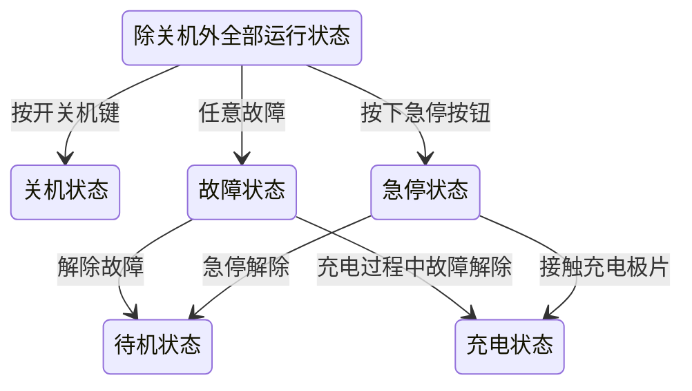
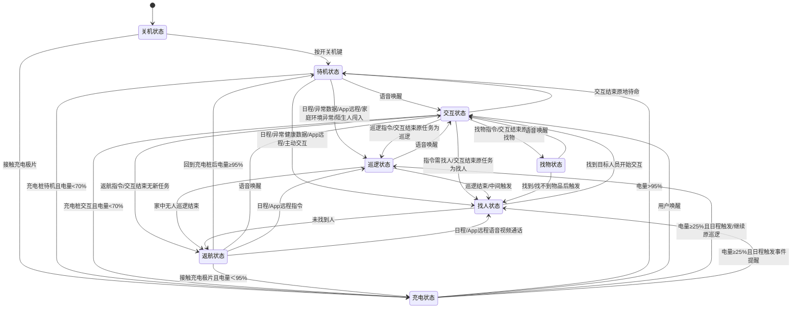
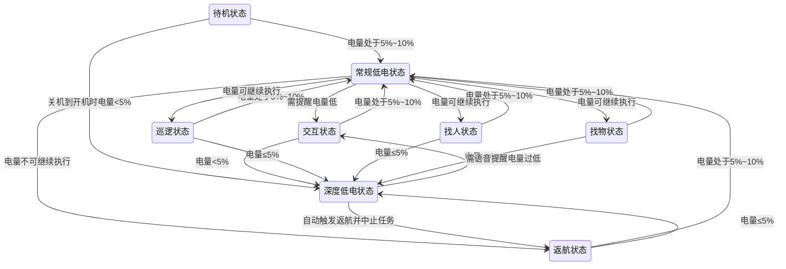
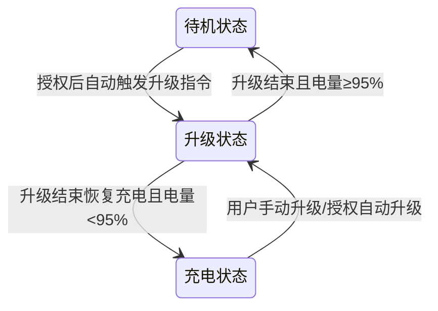
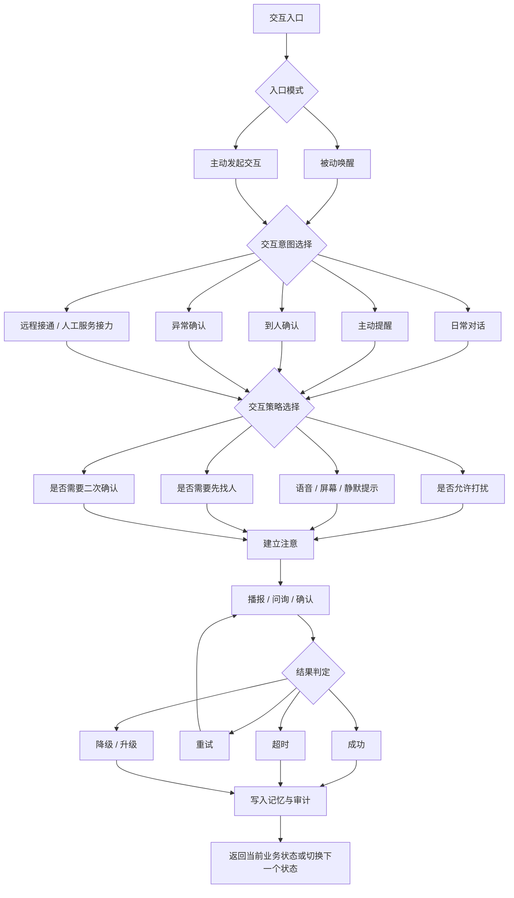
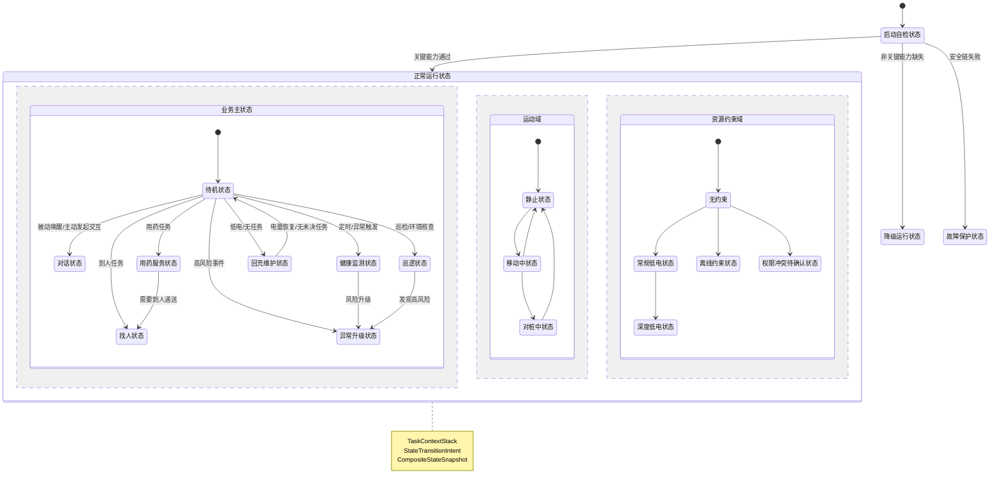

# Kinbot状态切换需求评审与状态机重构建议

---

文档版本：v1.8
创建日期：2026-03-26
作者：Codex-架构师

文档变更记录：
- v1.8 | 2026-03-27 | Codex-架构师 | 将交互从“超级状态”进一步收敛为“待机状态 + 被动唤醒 / 主动发起交互 + 对话状态”的分层表达，并明确任务内交互不脱离原业务态。
- v1.7 | 2026-03-26 | Codex-架构师 | 严格按“状态切换总表”将原始方案归一化为跳转图，并基于“状态描述”识别出 `交互状态` 是把公共交互能力误写成特定状态的“超级状态”。
- v1.6 | 2026-03-26 | Codex-架构师 | 将方案 C 的命名口径统一回原始方案 / 方案 A / B 的状态名体系，修正原始方案图示与输入文档不一致的问题，并新增交互内部行为树设计。
- v1.5 | 2026-03-26 | Codex-架构师 | 重新整理全文结构，压缩冗长论证，补入“原始方案”作为正式候选项进入最终对比，并将推荐方案明确收敛到与主线一致的方案 C。
- v1.4 | 2026-03-26 | 架构评审 | 新增第 10 章方案 C：OODA 环驱动的分层状态机 + 受限正交域 + 任务上下文栈，作为方案 A 与方案 B 之外的第三候选方案，显式对齐已冻结的决策状态机基线。
- v1.3 | 2026-03-26 | Codex-架构师 | 统一候选方案中的状态命名到产品经理当前口径，补全方案 A 的覆盖属性轴图示，并新增方案 B 的同步机制说明。
- v1.2 | 2026-03-26 | Codex-架构师 | 基于新增讨论，补入“待机状态 / 停桩后台处理状态 / 休眠状态”三者关系的两套分层方案，并区分“主状态 + 子状态 / 属性”与“正交并行状态机”两种建模路径供决策。
- v1.1 | 2026-03-26 | Codex-架构师 | 在不修改原始需求语义的前提下，补入按产品经理当前输入直译的状态机图，作为原始状态表的可视化投影。
- v1.0 | 2026-03-26 | Codex-架构师 | 基于 `input/00_requirements/05_kinbot_state_switching_requirement.md`，评审当前状态拆分与跳转设计，并给出分层状态机重构建议与 Mermaid 图示。

---

## 1. 文档目的

本文档用于评审 [input/00_requirements/05_kinbot_state_switching_requirement.md](../../input/00_requirements/05_kinbot_state_switching_requirement.md)，并给出与当前主线架构一致的状态机收敛方案。

本轮只回答 3 个问题：

1. 原始状态切换方案的问题到底在哪里。
2. 当前有哪些可选重构方案。
3. `PDCP` 阶段应冻结哪一版状态机结构。

## 2. 评审基准

本评审以当前主线架构为准，主要参考：

1. [总体架构](../02_p1_architecture/01_overall_architecture.md)
2. [决策状态机](../02_p1_architecture/06_decision_state_machine.md)
3. [安全风险矩阵](../02_p1_architecture/09_safety_risk_matrix.md)
4. [健康事件管线与升级](../02_p1_architecture/10_health_event_pipeline_and_escalation.md)

## 3. 总体结论

当前《状态切换需求》的价值主要在于：

1. 已枚举出 `关机 / 待机 / 交互 / 巡逻 / 找人 / 找物 / 返航 / 充电 / 故障 / 急停 / 升级` 等典型运行场景。
2. 已意识到低电、故障、急停、升级等高优先级情况需要参与状态切换。
3. 已把日程、异常健康数据、App 远程、家庭环境异常等触发源写入状态逻辑。

但当前版本还不能作为正式状态机基线冻结。核心原因不是状态不够多，而是把以下 4 类概念混在了同一层：

1. 业务状态
2. 维护 / 回充状态
3. 资源约束状态
4. 保护状态

本轮正式建议：

1. 原始方案继续保留为需求输入，不直接冻结。
2. `PDCP` 阶段采用方案 C 作为正式收敛方向。
3. 先在本评审文档中收敛状态机方案，再回写主线状态机与需求输入。

## 4. 原始方案的主要问题

### 4.1 分层口径混杂

原始方案把 `待机 / 交互 / 巡逻 / 找人 / 找物` 这类业务态，与 `返航 / 充电 / 升级` 这类维护态、`常规低电 / 深度低电` 这类约束态、`故障 / 急停` 这类保护态并列，导致：

1. 状态数量看起来很多，但信息质量不高。
2. 跳转表会退化成“几乎所有状态都能互跳”的大矩阵。

### 4.2 一代主价值链缺少对应业务态

当前主线已冻结：

- 健康管理是第一主价值链
- 用药服务是一代核心闭环
- 高风险异常需要独立升级链

但原始方案没有显式建模：

1. `健康监测`
2. `用药服务`
3. `异常升级`

结果是健康与异常主链被错误压缩进了 `找人状态` 和 `巡逻状态`。

### 4.3 低电量被错误建模成业务状态

`常规低电` 和 `深度低电` 的本质是资源约束，不是业务任务。继续把它们建成平级状态，会迫使系统再维护一张“低电专属跳转表”。

### 4.4 任务恢复语义缺失

原始方案大量使用“交互结束恢复原任务”“低电恢复后继续任务”这类表达，但没有定义：

1. 原任务如何记录
2. 中断原因如何记录
3. 恢复条件是什么
4. 超时后如何作废

这意味着状态机之外必然还会再长出一套隐式任务恢复逻辑。

## 5. 原始方案还原

为避免后续讨论脱离原始输入，这里先把原始方案作为正式候选项保留。

### 5.1 原始方案的核心结构

原始方案可概括为一个单层平面状态表：

- 业务态：`待机 / 交互 / 巡逻 / 找人 / 找物`
- 回充维护态：`返航 / 充电 / 升级`
- 资源约束态：`常规低电 / 深度低电`
- 保护态：`故障 / 急停`

若严格按“状态切换总表”把它整理成跳转图，需要先做 5 个归一化动作：

1. 删除已废弃的 `休眠状态`，不再参与建图。
2. 将 `按开关机键` 统一视为“除 `关机状态` 外全部运行态”都可进入 `关机状态` 的全局边。
3. 将 `任意故障` 统一视为“除 `关机状态` 外全部运行态”都可进入 `故障状态` 的全局边。
4. 将 `按下急停按钮` 统一视为“除 `关机状态` 外全部运行态”都可进入 `急停状态` 的全局边。
5. 将 `常规低电状态 / 深度低电状态` 视为覆盖主运行态的资源约束边，单独成图，不与主业务链混画。

### 5.2 原始方案图示

以下图示按 [input/00_requirements/05_kinbot_state_switching_requirement.md](../../input/00_requirements/05_kinbot_state_switching_requirement.md) 当前文本拆图表达，只做可视化，不改写原始语义。

#### 5.2.1 原始全局控制与保护边

#### 5.2.2 原始业务、任务与维护主图

#### 5.2.3 原始低电影响图

#### 5.2.4 原始升级链与恢复边

### 5.3 状态描述中的“超级状态”

严格交叉检查“状态描述”和“状态切换总表”后，原始方案里的“超级状态”是 `交互状态`。

判断依据：

1. 在“状态描述”中，`交互状态` 的定义是“正在与用户进行语音、触控和手势交互”，它描述的是一种通用交互模态，而不是一个独立业务闭环目标。
2. 在“状态切换总表”中，`交互状态` 被大量用作通用落点：`待机状态` 唤醒进入交互、`巡逻状态` 被语音打断进入交互、`找人状态` 到人后进入交互、`找物状态` 语音唤醒进入交互、`返航状态` 语音唤醒进入交互、`充电状态` 也可被唤醒进入交互。
3. 在“状态切换条件详细描述”中，`交互状态` 还继续吞并了低电提醒、结果告知、到人确认、远程通话接入等本应属于其他业务态内部公共流程的能力。
4. 这意味着原始文档实际上把“公共交互能力”误写成了“特定业务状态”，从而形成了一个过度膨胀的超级状态。

它带来的直接问题是：

1. 许多真正的业务差异被冲淡了，因为最后都先汇到 `交互状态`。
2. `巡逻状态 / 找人状态 / 找物状态 / 低电提醒` 等状态只剩“把机器人带到交互”的薄壳语义。
3. 状态机层无法区分“日常对话”“到人确认”“异常确认”“远程接通”“结果告知”这些本应不同的业务语义。

因此，在后续重构中更合理的做法不是继续放大 `交互状态`，而是：

1. 保留它作为评审阶段的原始命名。
2. 在架构语义上把它下沉为可复用的公共交互能力或内部行为树。
3. 让真正的业务态重新回答“机器人当前在做什么”。

进一步收敛后，本轮建议把交互拆成 3 层：

1. `待机状态`
   - 作为默认业务状态
   - 表示当前没有明确主任务，系统处于守候与可唤醒状态
2. `被动唤醒 / 主动发起交互`
   - 作为交互入口模式
   - 不单独成为顶层业务状态
3. `对话状态`
   - 只在“无明确任务背景的陪伴交流”场景下作为独立业务状态保留
   - 其余任务内交互继续留在原业务状态内部

这意味着：

1. `待机状态 -> 被动唤醒 -> 对话状态`
2. `待机状态 -> 主动发起交互 -> 对话状态`
3. `找人 / 找物 / 用药服务 / 异常升级` 内部若需要澄清、确认、告知，不再强制切到顶层 `对话状态`，而是调用同一套对话能力子流程。

补充判断：

- `找人状态` 也带有“通用到人访问态”的倾向，但它仍然围绕“移动到目标人附近”这一明确任务组织，因此还不是原始方案里最大的超级状态。

## 6. 候选方案

### 6.1 原始方案：单层平面状态表

特点：

1. 最贴近产品经理当前输入。
2. 容易直接从场景枚举写成表格。
3. 不适合直接冻结为架构基线。

### 6.2 方案 A：主状态 + 子状态 / 覆盖属性

特点：

1. 保留一个当前业务主状态。
2. 用“运动属性 / 交互属性 / 供电属性 / 约束属性”表达混合态。
3. 比原始方案更清楚，但覆盖属性本质上已经是弱形式的正交状态机。

### 6.3 方案 B：正交并行状态机

特点：

1. 将任务、运动、交互、供电拆成并行轴。
2. 混合态表达最自然。
3. 对 `PDCP` 阶段来说过重，组合状态和同步复杂度都偏高。

### 6.4 方案 C：OODA 驱动的分层状态机 + 受限正交域 + 任务上下文栈

特点：

1. 顶层分层直接对齐当前 `OODA R1-R4` 架构。
2. 只保留 2 个正式正交域：运动域、资源约束域。
3. 交互不再独立成轴，而由业务主状态内部行为树承载。
4. 显式引入任务上下文栈，解决任务中断与恢复问题。

## 7. 最终方案对比

| 维度                | 原始方案    | 方案 A       | 方案 B    | 方案 C             |
| ----------------- | ------- | ---------- | ------- | ---------------- |
| 表达方式              | 单层平面状态表 | 主状态 + 覆盖属性 | 多轴正交状态机 | 分层状态机 + 2 个受限正交域 |
| 对原始输入保真度          | 最高      | 中          | 低       | 中高               |
| 对混合态表达            | 差       | 中          | 高       | 高                |
| 对健康 / 用药 / 异常主链支持 | 差       | 中          | 中高      | 高                |
| 任务恢复语义            | 无       | 弱          | 弱       | 强                |
| 与当前主线一致性          | 低       | 中          | 中       | 最高               |
| 团队理解成本            | 低       | 中          | 高       | 中                |
| `PDCP` 阶段冻结适配度    | 低       | 中高         | 低       | 最高               |

## 8. 推荐方案与正式收敛口径

本轮推荐正式采用方案 C，并按以下口径收敛。

### 8.1 顶层控制态保持 5 个

1. `启动自检状态`
2. `正常运行状态`
3. `降级运行状态`
4. `故障保护状态`
5. `维护 / 关机状态`

### 8.2 业务主状态收敛为 8 个

1. `待机状态`
2. `对话状态`
3. `找人状态`
4. `健康监测状态`
5. `用药服务状态`
6. `巡逻状态`
7. `异常升级状态`
8. `回充维护状态`

关键修正：

1. `待机状态` 被明确为默认业务状态，承担“无明确主任务时的守候与可唤醒”语义。
2. `对话状态` 不再等于旧的“大交互状态”，只保留“无特定任务背景的陪伴式交流”语义。
3. `巡逻状态` 在方案 C 中承担一代家庭安全巡护主链，而不是继续停留在泛巡检语义。
4. `保姆协同` 不再作为业务主状态。
5. `找物状态` 不再作为顶层业务主状态，转为 `L2` 叶子服务能力。

#### 8.2.1 与当前主线术语映射

为尽量保持本评审文档与原始方案、方案 A、方案 B 的命名连续性，同时消除 `交互状态` 的超级状态问题，方案 C 仅对这一项做最小必要改名：`交互状态 -> 对话状态`；与当前主线术语的关系如下：

| 方案 C 用词 | 当前主线常用表达 | 说明 |
| --- | --- | --- |
| `对话状态` | `陪伴交互` | 明确只保留无特定任务背景的陪伴式交流语义 |
| `找人状态` | `主动接近` | 在架构语义上本质是到人任务 |
| `巡逻状态` | `家庭安全巡护` | 方案评审阶段保留原始状态名，但语义已收敛到家庭安全巡护 |
| `回充维护状态` | `回充维护` | 仅补全“状态”后缀以统一语法 |

### 8.3 正交域只保留 2 个

1. `运动域`
   - `静止状态`
   - `移动中状态`
   - `对桩中状态`

2. `资源约束域`
   - `无约束`
   - `常规低电状态`
   - `深度低电状态`
   - `离线约束状态`
   - `权限冲突待确认状态`

收敛原因：

1. 交互不是通用正交轴，而是业务态内部行为树能力。
2. 供电状态主要进入 `回充维护状态` 的内部子状态和 `World State` 字段。

### 8.4 `回充维护状态` 内部展开子状态

`回充维护状态` 内部建议至少展开：

1. `返航状态`
2. `对桩状态`
3. `充电状态`
4. `停桩后台处理状态`
5. `休眠待命状态`
6. `升级状态`

### 8.5 `保姆协同` 的新定位

`保姆协同` 继续保留，但其语义调整为：

1. 角色 / 权限 / 任务来源模式
2. 进入 `world_state_memory`
3. 进入授权模型
4. 进入任务上下文
5. 进入 `App / 云 / 运营` 协同链

它不再回答“机器人当前在做什么”，因此不进入业务主状态枚举。

### 8.6 对话与交互内部行为树设计

方案 C 中，交互不再独立成正交域，而是拆成“入口模式 + 对话状态 + 任务内交互子流程”三层：

1. `被动唤醒`
2. `主动发起交互`
3. `对话状态`
4. 可复用的任务内交互行为树

其中，可复用的任务内交互行为树被以下业务主状态按需调用：

1. `对话状态`
2. `找人状态`
3. `用药服务状态`
4. `异常升级状态`
5. `回充维护状态`（仅在必要提醒场景下）

#### 8.6.1 设计目标

1. 把“说什么、什么时候说、说到什么程度”为一套统一可复用的执行树。
2. 避免每个业务状态各自长出一套独立对话流程。
3. 让“边移动边说话”“边返航边播报”“异常时先确认再升级”可以通过业务态 + 行为树组合表达。
4. 明确“谁发起交互”是入口模式问题，不等于要切换到一个新的顶层业务态。

#### 8.6.2 交互行为树结构

#### 8.6.3 不同业务状态如何复用

1. `对话状态`
   - 只承接无明确任务背景的陪伴式交流
   - 典型入口是 `待机状态 -> 被动唤醒 -> 对话状态`
   - 或 `待机状态 -> 主动发起交互 -> 对话状态`

2. `找人状态`
   - 默认入口是 `到人确认` 或 `主动提醒`
   - 交互树负责到人后的播报、确认和结果回写
   - 若找人过程中需要澄清，不切走顶层业务态，仍保持 `找人状态`

3. `用药服务状态`
   - 默认入口是 `主动提醒` 或 `到人确认`
   - 交互树负责提醒服药、确认是否已服、记录结果和必要的异常上卷

4. `异常升级状态`
   - 默认入口是 `异常确认`
   - 交互树负责本地二次确认、问询用户是否需要帮助、决定是否进入远程接通或人工服务接力

5. `回充维护状态`
   - 只在必要时走 `主动提醒`
   - 例如深低电下告知用户电量过低、升级前确认、升级完成后的简短通知

#### 8.6.4 这棵树解决了什么

1. 方案 C 不需要独立“交互轴”，也能表达混合态。
2. “交互”不再脱离业务语义自由漂移。
3. 交互策略可以统一受 `夜间静默`、`离线约束状态`、`权限冲突待确认状态` 等上层约束控制。
4. “被动唤醒 / 主动发起交互”被收敛为入口模式，不再误写成顶层业务态。
5. 任务内交互不再强制切到 `对话状态`，因此不会重新制造一个新的“超级状态”。

### 8.7 显式引入 3 个协同构件

1. `TaskContextStack`
2. `StateTransitionIntent`
3. `CompositeStateSnapshot`

它们分别承接：

1. 任务中断与恢复
2. 原子状态切换
3. 审计、回放与验证快照

## 9. 简化后的推荐结构图

## 10. 下一步建议

建议按这个顺序推进：

1. 先以 [决策状态机](../02_p1_architecture/06_decision_state_machine.md) 作为主线正式收敛状态枚举与结构分层。
2. 再回写 `input/00_requirements/05_kinbot_state_switching_requirement.md`，把原始状态表调整为与主线一致的产品语言版本。
3. 最后补统一的原因码、优先级、中断与恢复规则，不再继续扩写平面大矩阵。
