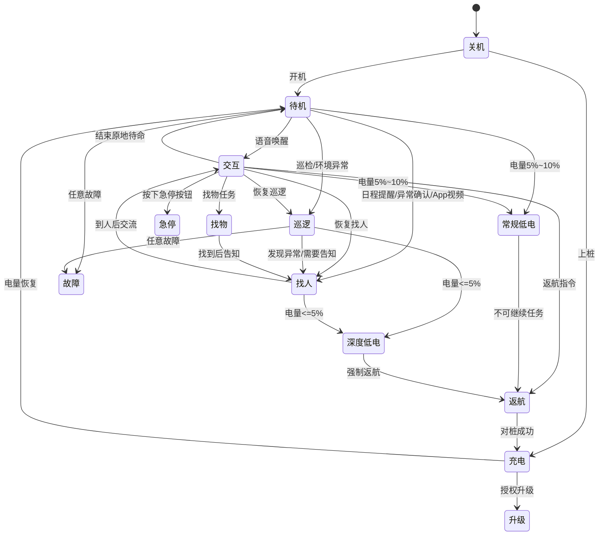
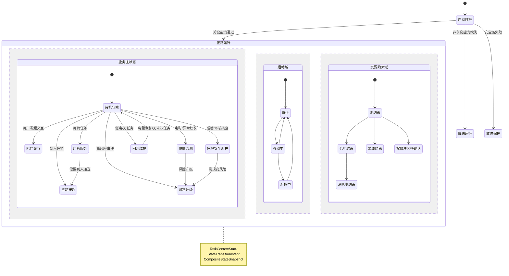

# Kinbot状态切换需求评审与状态机重构建议

---

文档版本：v1.5
创建日期：2026-03-26
作者：Codex-架构师

文档变更记录：
- v1.5 | 2026-03-26 | Codex-架构师 | 重新整理全文结构，压缩冗长论证，补入“原始方案”作为正式候选项进入最终对比，并将推荐方案明确收敛到与主线一致的方案 C。
- v1.4 | 2026-03-26 | 架构评审 | 新增第 10 章方案 C：OODA 环驱动的分层状态机 + 受限正交域 + 任务上下文栈，作为方案 A 与方案 B 之外的第三候选方案，显式对齐已冻结的决策状态机基线。
- v1.3 | 2026-03-26 | Codex-架构师 | 统一候选方案中的状态命名到产品经理当前口径，补全方案 A 的覆盖属性轴图示，并新增方案 B 的同步机制说明。
- v1.2 | 2026-03-26 | Codex-架构师 | 基于新增讨论，补入“待机状态 / 停桩后台处理状态 / 休眠状态”三者关系的两套分层方案，并区分“主状态 + 子状态 / 属性”与“正交并行状态机”两种建模路径供决策。
- v1.1 | 2026-03-26 | Codex-架构师 | 在不修改原始需求语义的前提下，补入按产品经理当前输入直译的状态机图，作为原始状态表的可视化投影。
- v1.0 | 2026-03-26 | Codex-架构师 | 基于 `input/00_requirements/05_kinbot_state_switching_requirement.md`，评审当前状态拆分与跳转设计，并给出分层状态机重构建议与 Mermaid 图示。

---

## 1. 文档目的

本文档用于评审 [input/00_requirements/05_kinbot_state_switching_requirement.md](../../input/00_requirements/05_kinbot_state_switching_requirement.md)，并给出与当前主线架构一致的状态机收敛方案。

本轮只回答 3 个问题：

1. 原始状态切换方案的问题到底在哪里。
2. 当前有哪些可选重构方案。
3. `PDCP` 阶段应冻结哪一版状态机结构。

## 2. 评审基准

本评审以当前主线架构为准，主要参考：

1. [总体架构](../02_p1_architecture/01_overall_architecture.md)
2. [决策状态机](../02_p1_architecture/06_decision_state_machine.md)
3. [安全风险矩阵](../02_p1_architecture/09_safety_risk_matrix.md)
4. [健康事件管线与升级](../02_p1_architecture/10_health_event_pipeline_and_escalation.md)

## 3. 总体结论

当前《状态切换需求》的价值主要在于：

1. 已枚举出 `关机 / 待机 / 交互 / 巡逻 / 找人 / 找物 / 返航 / 充电 / 故障 / 急停 / 升级` 等典型运行场景。
2. 已意识到低电、故障、急停、升级等高优先级情况需要参与状态切换。
3. 已把日程、异常健康数据、App 远程、家庭环境异常等触发源写入状态逻辑。

但当前版本还不能作为正式状态机基线冻结。核心原因不是状态不够多，而是把以下 4 类概念混在了同一层：

1. 业务状态
2. 维护 / 回充状态
3. 资源约束状态
4. 保护状态

本轮正式建议：

1. 原始方案继续保留为需求输入，不直接冻结。
2. `PDCP` 阶段采用方案 C 作为正式收敛方向。
3. 与当前主线不一致的地方先在主线状态机文档中纠偏，再回头修需求输入。

## 4. 原始方案的主要问题

### 4.1 分层口径混杂

原始方案把 `待机 / 交互 / 巡逻 / 找人 / 找物` 这类业务态，与 `返航 / 充电 / 升级` 这类维护态、`常规低电 / 深度低电` 这类约束态、`故障 / 急停` 这类保护态并列，导致：

1. 状态数量看起来很多，但信息质量不高。
2. 跳转表会退化成“几乎所有状态都能互跳”的大矩阵。

### 4.2 一代主价值链缺少对应业务态

当前主线已冻结：

- 健康管理是第一主价值链
- 用药服务是一代核心闭环
- 高风险异常需要独立升级链

但原始方案没有显式建模：

1. `健康监测`
2. `用药服务`
3. `异常升级`

结果是健康与异常主链被错误压缩进了 `找人状态` 和 `巡逻状态`。

### 4.3 低电量被错误建模成业务状态

`常规低电` 和 `深度低电` 的本质是资源约束，不是业务任务。继续把它们建成平级状态，会迫使系统再维护一张“低电专属跳转表”。

### 4.4 任务恢复语义缺失

原始方案大量使用“交互结束恢复原任务”“低电恢复后继续任务”这类表达，但没有定义：

1. 原任务如何记录
2. 中断原因如何记录
3. 恢复条件是什么
4. 超时后如何作废

这意味着状态机之外必然还会再长出一套隐式任务恢复逻辑。

## 5. 原始方案还原

为避免后续讨论脱离原始输入，这里先把原始方案作为正式候选项保留。

### 5.1 原始方案的核心结构

原始方案可概括为一个单层平面状态表：

- 业务态：`待机 / 交互 / 巡逻 / 找人 / 找物`
- 回充维护态：`返航 / 充电 / 升级`
- 资源约束态：`常规低电 / 深度低电`
- 保护态：`故障 / 急停`

### 5.2 原始方案简化图

## 6. 候选方案

### 6.1 原始方案：单层平面状态表

特点：

1. 最贴近产品经理当前输入。
2. 容易直接从场景枚举写成表格。
3. 不适合直接冻结为架构基线。

### 6.2 方案 A：主状态 + 子状态 / 覆盖属性

特点：

1. 保留一个当前业务主状态。
2. 用“运动属性 / 交互属性 / 供电属性 / 约束属性”表达混合态。
3. 比原始方案更清楚，但覆盖属性本质上已经是弱形式的正交状态机。

### 6.3 方案 B：正交并行状态机

特点：

1. 将任务、运动、交互、供电拆成并行轴。
2. 混合态表达最自然。
3. 对 `PDCP` 阶段来说过重，组合状态和同步复杂度都偏高。

### 6.4 方案 C：OODA 驱动的分层状态机 + 受限正交域 + 任务上下文栈

特点：

1. 顶层分层直接对齐当前 `OODA R1-R4` 架构。
2. 只保留 2 个正式正交域：运动域、资源约束域。
3. 交互不再独立成轴，而由业务主状态内部行为树承载。
4. 显式引入任务上下文栈，解决任务中断与恢复问题。

## 7. 最终方案对比

| 维度 | 原始方案 | 方案 A | 方案 B | 方案 C |
| --- | --- | --- | --- | --- |
| 表达方式 | 单层平面状态表 | 主状态 + 覆盖属性 | 多轴正交状态机 | 分层状态机 + 2 个受限正交域 |
| 对原始输入保真度 | 最高 | 中 | 低 | 中高 |
| 对混合态表达 | 差 | 中 | 高 | 高 |
| 对健康 / 用药 / 异常主链支持 | 差 | 中 | 中高 | 高 |
| 任务恢复语义 | 无 | 弱 | 弱 | 强 |
| 与当前主线一致性 | 低 | 中 | 中 | 最高 |
| 团队理解成本 | 低 | 中 | 高 | 中 |
| `PDCP` 阶段冻结适配度 | 低 | 中高 | 低 | 最高 |

## 8. 推荐方案与正式收敛口径

本轮推荐正式采用方案 C，并按以下口径收敛。

### 8.1 顶层控制态保持 5 个

1. `启动自检`
2. `正常运行`
3. `降级运行`
4. `故障保护`
5. `维护 / 关机`

### 8.2 业务主状态收敛为 8 个

1. `待机守候`
2. `陪伴交互`
3. `主动接近`
4. `健康监测`
5. `用药服务`
6. `家庭安全巡护`
7. `异常升级`
8. `回充维护`

关键修正：

1. `家庭安全巡护` 正式进入业务主状态。
2. `保姆协同` 不再作为业务主状态。
3. `找物状态` 不再作为顶层业务主状态，转为 `L2` 叶子服务能力。

### 8.3 正交域只保留 2 个

1. `运动域`
   - `静止`
   - `移动中`
   - `对桩中`

2. `资源约束域`
   - `无约束`
   - `低电约束`
   - `深低电约束`
   - `离线约束`
   - `权限冲突待确认`

收敛原因：

1. 交互不是通用正交轴，而是业务态内部行为树能力。
2. 供电状态主要进入 `回充维护` 的内部子状态和 `World State` 字段。

### 8.4 `回充维护` 内部展开子状态

`回充维护` 内部建议至少展开：

1. `返航中`
2. `对桩中`
3. `充电中`
4. `停桩后台处理`
5. `休眠待命`
6. `升级中`

### 8.5 `保姆协同` 的新定位

`保姆协同` 继续保留，但其语义调整为：

1. 角色 / 权限 / 任务来源模式
2. 进入 `world_state_memory`
3. 进入授权模型
4. 进入任务上下文
5. 进入 `App / 云 / 运营` 协同链

它不再回答“机器人当前在做什么”，因此不进入业务主状态枚举。

### 8.6 显式引入 3 个协同构件

1. `TaskContextStack`
2. `StateTransitionIntent`
3. `CompositeStateSnapshot`

它们分别承接：

1. 任务中断与恢复
2. 原子状态切换
3. 审计、回放与验证快照

## 9. 简化后的推荐结构图

## 10. 下一步建议

建议按这个顺序推进：

1. 先以 [决策状态机](../02_p1_architecture/06_decision_state_machine.md) 作为主线正式收敛状态枚举与结构分层。
2. 再回写 `input/00_requirements/05_kinbot_state_switching_requirement.md`，把原始状态表调整为与主线一致的产品语言版本。
3. 最后补统一的原因码、优先级、中断与恢复规则，不再继续扩写平面大矩阵。
