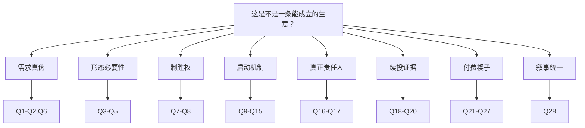

# Step 42 提问树、战略幻觉排除与风险收敛图

---

文档版本：v1.2
创建日期：2026-04-03
作者：Codex-战略承接人

文档变更记录：
- v1.2 | 2026-04-03 | Codex-战略承接人 | 在文档末尾补入 `Q1-Q28` 的原始问题与回答摘录，并追加 `Step 42` 第 `13` 条非问题型前置事实，避免读者只看到结构化提炼而看不到原始上下文。
- v1.1 | 2026-04-03 | Codex-战略承接人 | 修复提问树 Mermaid 图中节点标签使用 `1.` 样式导致的预览兼容性问题，改为非列表写法。
- v1.0 | 2026-04-03 | Codex-战略承接人 | 新增 Step 42 提问树、问题分组、商业逻辑、战略幻觉排除、强弱判断与降风险动作图，用于把 `28` 个追问沉淀为一套可复用的战略评审框架。

---

## 1. 文档定位

本文不是对话归档，而是对 `Step 42` 中 `28` 个连续追问的结构化提炼，用于回答 5 个问题：

1. 这 `28` 个问题实际上在验证什么。
2. 这些问题背后的商业分析逻辑是什么。
3. 这些问题组成了一棵什么样的提问树。
4. 每一组问题在排除哪一种战略幻觉。
5. 当前哪些答案已经足够强，哪些仍处于危险区，以及如何继续降风险。

本文默认服务于以下场景：

1. 对 `Kinbot` 首发路径进行战略复盘。
2. 为后续 `office-hours / plan-ceo-review / EMT` 上会材料提供底层问题框架。
3. 让后续追问不再停留在零散问答，而能围绕同一套经营判断体系推进。

## 2. 一句话结论

这 `28` 个问题本质上只在验证一件事：

**`Kinbot` 是否不是一个“看起来很对的机器人方向”，而是一条能被董事长批准、能被组织型买方启动、能被家庭真实付款、并最终扩成平台主线的生意。**

换句话说，这套提问不是在问“想法好不好”，而是在依次逼问：

1. 这是不是一个真问题。
2. 这是不是机器人独有的解法。
3. 这件事为什么该由你们做。
4. 谁会为第一枪负责。
5. 什么证据证明它不是 Demo，而是生意。

## 3. 提问树总览

## 4. 问题分组总表

| 组别 | 对应问题 | 核心要验证的东西 | 主要排除的战略幻觉 | 当前状态 |
| --- | --- | --- | --- | --- |
| `A` 需求真伪 | `Q1-Q2,Q6` | 场景是否足够尖锐、足够疼、足够值得引入机器人 | 大赛道幻觉 | `中强` |
| `B` 形态必要性 | `Q3-Q5` | 为什么必须是家庭机器人，以及最小可交付闭环是否成立 | 形态幻觉 | `强` |
| `C` 制胜权 | `Q7-Q8` | 为什么应由本集团来做，而不是能力相似的其他玩家 | 能力清单幻觉 | `中弱` |
| `D` 启动机制 | `Q9-Q15` | 首批审批、签约、交付、预算和推进方式是否具体可落地 | 立项即启动幻觉 | `中弱` |
| `E` 真正责任人 | `Q16-Q17` | 失败后谁最疼、成功后谁最想继续推 | 集体热情幻觉 | `强` |
| `F` 续投证据 | `Q18-Q20` | 下一轮资源申请要拿什么硬证据 | 试点热闹幻觉 | `中强` |
| `G` 付费楔子 | `Q21-Q27` | 第一批真实付款家庭是谁、为什么买、怎么成交 | 大市场自增长幻觉 | `中强` |
| `H` 叙事统一 | `Q28` | 上会叙事与真实付费动机是否属于同一条逻辑 | 双叙事幻觉 | `中弱` |

### 4.1 这 `28` 个问题在系统性排除的 `8` 种战略幻觉

| 战略幻觉     | 幻觉的典型说法                           | 这套问题为什么要排除它                |
| -------- | --------------------------------- | -------------------------- |
| 大赛道幻觉    | “老龄化和机器人都够大，所以方向一定成立。”            | 大方向只能解释值得研究，不能解释值得首发投入。    |
| 需求天然成立幻觉 | “用户会抱怨，就等于用户愿意把机器人买回家。”           | 抱怨、痛点、付款意愿之间有很长距离。         |
| 形态幻觉     | “只要是机器人形态，就比 `App + 外设` 更高级。”     | 机器人必须承担替代方案做不成的关键动作。       |
| 能力清单幻觉   | “我们有 `AI + 硬件 + 医疗 + 品牌`，所以一定能赢。” | 能力并列不等于能压成别人难复制的闭环。        |
| 立项即启动幻觉  | “会一批，项目自然就能滚起来。”                  | 没有签约主体、入口和交付责任，项目只会停在纸面。   |
| 集体热情幻觉   | “大家都说重要，所以一定有人会扛到底。”              | 真正的战略项目必须找到失败后最疼的 owner。   |
| 试点热闹幻觉   | “试点顺利、体验不错、老板满意，就说明可以继续投。”        | 继续加码需要经营证据，而不是热闹信号。        |
| 双叙事幻觉    | “对上讲一套、对下卖一套，内部自己知道就行。”           | 上会叙事与真实付款动因一旦撕裂，后续组织会跟着撕裂。 |

## 5. 各组问题背后的意图与商业逻辑

### 5.1 `A` 需求真伪：先证明这是一个真问题

对应问题：

1. `Q1` 首发家庭与首发主问题是什么。
2. `Q2` 最强现实证据是什么。
3. `Q6` 现状流程到底怎么断。

背后意图：

1. 把“机器人是未来”收窄成“哪个家庭、哪个问题、为什么现在就痛”。
2. 从宏大方向切入到真实且高频的问题链，而不是只停留在老龄化、政策支持和行业趋势。
3. 看这个问题是否已经严重到值得家庭接受新形态产品进入日常生活。

商业逻辑：

1. 大方向只能解释“为什么值得研究”，不能解释“为什么值得首发投入”。
2. 真正能支撑首发产品的，不是市场大，而是痛点够窄、够具体、够高后果。
3. 如果现状流程的断裂点不清楚，后续所有产品定义都只是空中楼阁。

要排除的战略幻觉：

1. **大赛道幻觉**：只要老龄化和机器人都是大趋势，产品就天然成立。
2. **需求天然成立幻觉**：只要用户会抱怨，就等于用户会接受机器人。

当前强弱判断：

- `Q1/Q6` 已经较强，因为目标家庭、首发问题和现状流程断裂点都已成型。
- `Q2` 仍偏弱，因为主要证据仍来自访谈、常识和政策，而非已被钱包验证的外部信号。

继续降风险的动作：

1. 补 `10-20` 个代表性家庭的真实访谈摘录，归类到“错药 / 漏药 / 缺药 / 无人兜底”四类。
2. 形成至少 `3` 个真实高后果用药失败案例，证明这不是“轻度不便”，而是高后果断裂。
3. 争取补一个外部数据包：基层慢病、老人误服漏服、居家用药协同压力相关公开数据。

### 5.2 `B` 形态必要性：证明不是更贵的集成方案

对应问题：

1. `Q3` 为什么最佳首发形态是家庭机器人。
2. `Q4` 哪个动作没有机器人就做不成。
3. `Q5` 没有手臂时的最小可交付闭环是什么。

背后意图：

1. 把“做机器人”从形式偏好，逼回到功能必要性。
2. 明确机器人到底解决的是信息与物理服务统一问题，还是只是硬件堆砌。
3. 提前防止产品价值建立在未来能力补洞上。

商业逻辑：

1. 如果 `App + 药盒 + 人工服务` 就能满足核心价值，那么机器人路线会长期陷入成本劣势。
2. 机器人必须承担一个传统组合形态做不成、或者做得明显更差的关键动作。
3. 首发必须在不依赖机械臂的前提下成立，才具备一代工程可交付性。

要排除的战略幻觉：

1. **形态幻觉**：凡是加了移动底盘和屏幕就叫机器人机会。
2. **未来补洞幻觉**：今天先讲价值，明天靠手臂、感知或人工把漏洞补上。

当前强弱判断：

- 这一组整体较强。
- 尤其 `Q4/Q5` 已经把价值链压到了可交付的最小闭环，而不是终局想象。

继续降风险的动作：

1. 把“没有机器人就做不成”的动作进一步压成 `1-2` 个可演示 KPI。
2. 在后续样机评估中增加对照组：`机器人方案` 对比 `App + 智能药盒 + 人工`。
3. 用真实家庭场景验证“找到人 -> 到人 -> 递药引导 -> 确认”是否比替代方案显著更稳。

### 5.3 `C` 制胜权：证明不是谁都可以讲的故事

对应问题：

1. `Q7` 为什么是我们集团来做。
2. `Q8` 如果只能一句话，怎么回答。

背后意图：

1. 不是让团队罗列能力，而是逼出真正的 `right to win`。
2. 看本集团的先手优势究竟体现在技术、品牌、关系、交付还是组合能力。

商业逻辑：

1. 只有当集团能更早把首发切口、家庭入口、服务协同和规模交付压成同一条链，才具备真正制胜权。
2. 单独一项能力强，并不意味着能在这种复合产品里赢。
3. `EMT` 关心的不是“我们也能做”，而是“为什么别人短期追不上”。

要排除的战略幻觉：

1. **能力清单幻觉**：把 `AI / 硬件 / 品牌 / 医疗` 四个词放一起，就以为形成了护城河。
2. **我们很大所以能赢幻觉**：认为集团规模本身就会自动转化为先发胜率。

当前强弱判断：

- 这组仍偏弱。
- 当前答案更像“我们有这些能力”，还不够像“别人为什么短期复制不了这条闭环”。

继续降风险的动作：

1. 把制胜逻辑压成 `先手资产 + 复制难点 + 形成闭环的时间差` 三段式。
2. 明确哪一项先手是竞争对手最难补齐的，例如：医疗理解与家庭交付的同体化，而不是单项模型能力。
3. 补一页竞对对照：小米、华为、平台公司、创业公司各自最强点和最弱缺口。

### 5.4 `D` 启动机制：证明项目不会只停在批准和试点

对应问题：

1. `Q9-Q10` `EMT` 到底批什么、批多少。
2. `Q11-Q15` 谁签字、谁供家庭入口、谁交付、谁承担预算、怎么分批推进。

背后意图：

1. 从“方向正确”推进到“首批资源怎么真正落地”。
2. 把审批、签约、交付、预算和分段试点机制压成一个真实启动包。

商业逻辑：

1. 任何战略项目如果没有明确的签约主体、家庭入口、交付责任和预算兜底，都会停在纸面。
2. 首批 `100` 台不是市场化放量，而是组织型启动工程，必须有可追责结构。
3. 董事长拍板只能解决战略合法性，不能替代首单路径设计。

要排除的战略幻觉：

1. **立项即启动幻觉**：以为会上一过，首批样机和试点会自动滚起来。
2. **试点自然有人接幻觉**：以为组织型买方会在方向一明确后自动跟进。

当前强弱判断：

- `Q9/Q10` 较强，审批对象和资源基线已清楚。
- `Q11-Q15` 仍在危险区，因为目前更像机制设计，而不是已锁定的启动条件。

继续降风险的动作：

1. 锁定首批 `2-3` 类组织型买方模板，并明确谁最可能成为第一签约主体。
2. 明确首批 `100` 台的预算分摊表：组织型买方、自担、共付费三种路径各占多少。
3. 把安装、培训、售后、异常升级责任拆到具体团队，而不是停留在“产品线交付团队”这一层。

### 5.5 `E` 真正责任人：证明不是大家都支持、但没人负责

对应问题：

1. `Q16` 如果把董事长临时拿掉，谁最着急。
2. `Q17` 如果失败，他会失去什么。

背后意图：

1. 找到真正的内部 owner，而不是名义 sponsor。
2. 确认项目失败时是否有人承担真实职业后果。

商业逻辑：

1. 只有当某个核心负责人既有推动权，又有失败成本，项目才会持续推进。
2. 战略项目死得最多的方式，就是“所有人都说重要，但没有一个人真的为结果冒险”。

要排除的战略幻觉：

1. **集体热情幻觉**：大家口头都重视，就等于一定会持续推进。
2. **董事长关注幻觉**：董事长关注很强，但不能替代下面的经营 owner。

当前强弱判断：

- 这一组较强。
- 已明确产品线总经理兼分管领导是失败后真正会疼、成功后真正会继续推的人。

继续降风险的动作：

1. 把该 owner 的职责进一步写成阶段性签字项和经营目标。
2. 让后续资源申请和试点复盘都围绕这位 owner 的经营判断展开。

### 5.6 `F` 续投证据：证明下一轮不是靠感觉继续投

对应问题：

1. `Q18` 首批 `100` 台后哪些结果会让组织继续加码。
2. `Q19` 如果只能摆一条最硬证据，选什么。
3. `Q20` 这条证据的最小通过线是什么。

背后意图：

1. 从“首批试点能不能做”推进到“做完后凭什么继续投”。
2. 逼团队选一个真正能上经营会的硬证据，而不是罗列一堆不错的信号。

商业逻辑：

1. 续投的硬证据不能只是体验满意、老板喜欢或试点顺利。
2. 对家庭机器人来说，最有杀伤力的证据是 `C` 端真实付费，而不是演示能力。
3. `1.5-2万元 / 1000 户真实付款家庭` 已经是经营层可以理解的强门槛。

要排除的战略幻觉：

1. **试点热闹幻觉**：体验好、关注高、媒体愿意写，就等于产品成立。
2. **好几个次强信号相加等于强信号幻觉**：实际上组织在继续大额投入时更信单一硬证据。

当前强弱判断：

- `Q19/Q20` 较强，已经明确了最硬证据和最小通过线。
- `Q18` 仍略弱，因为仍缺一套正式的续投信号组合，而不只是“一条最硬证据”。

继续降风险的动作：

1. 把续投标准明确为“一条主证据 + 两条辅助证据”。
2. 主证据保持 `1000` 户真实付款家庭；辅助证据可选组织型买方续签和 `1` 个月留存等。
3. 预先定义什么叫“真实付款家庭”，防止被试用、补贴或关系单稀释。

### 5.7 `G` 付费楔子：证明市场不是凭空长出来

对应问题：

1. `Q21-Q22` 从 `100` 台到 `1000` 户，中间桥是什么，最窄楔子是谁。
2. `Q23-Q24` 为什么是大学退休教授，通过什么主渠道找到他们。
3. `Q25-Q27` 第一批怎么成交，掏钱瞬间是什么，最底层付款原因是什么。

背后意图：

1. 从“老人市场很大”收窄到“第一批谁最可能先花 `1.5-2万元`”。
2. 从“谁可能买”继续压到“怎么找到、怎么成交、为什么当场掏钱”。
3. 找到最可能跑通的 `C` 端付费样板，而不是做模糊的人群画像。

商业逻辑：

1. 任何高客单价新品类都不是从“大众老人市场”直接起步，而是从最窄、最有认知与支付能力的人群切入。
2. 只有当渠道、决策人、付款人、交付动作都清楚时，楔子才成立。
3. “关键时刻的用药救援与问询升级”被识别为真实付费钩子，说明情绪价值和陪伴不是首购主因。

要排除的战略幻觉：

1. **大市场自增长幻觉**：以为方向大、需求真，`1000` 户就会自然长出来。
2. **喜欢等于付款幻觉**：以为用户觉得机器人好、先进、有希望，就会掏钱。

当前强弱判断：

- `Q22/Q25/Q26/Q27` 较强，最窄楔子、成交链、掏钱瞬间和底层付款动因都已相对清楚。
- `Q21` 仍偏弱，因为“从 `100` 台到 `1000` 户”的复制桥目前还没有被真实跑通。
- `Q23/Q24` 仍偏弱，因为目前主要依赖对高校关系和退休教授画像的推断，还缺真实转化样本。

继续降风险的动作：

1. 先跑 `10-20` 户真实样板，不要急着验证 `1000` 户。
2. 记录每一户的进入路径、谁发起、谁体验、谁决策、谁付款、谁安装。
3. 区分“教授本人付款”和“子女付款”两条链，看哪条更强。

### 5.8 `H` 叙事统一：证明不会对上讲一套、对下卖一套

对应问题：

1. `Q28` 如果真实付款动因是关键时刻的用药救援与问询升级，首发对 `EMT` 的一句话主张还应不应该写成“慢病管理与用药协同”。

背后意图：

1. 检查上会叙事和市场真相是否属于同一条产品逻辑。
2. 防止产品内部对真实价值来源出现分裂。

商业逻辑：

1. 对 `EMT` 的主张必须稳、宽、可审批；对真实用户的购买钩子则往往更尖锐。
2. 最好的做法不是改写成两条产品线，而是把二者收敛为同一条闭环里的“高频入口 + 价值峰值”。
3. 一旦出现双叙事，后续产品、运营、销售和审批口径都会撕裂。

要排除的战略幻觉：

1. **双叙事幻觉**：对上讲慢病管理，对下靠急救价值卖货，但内部假装这两件事天然一致。
2. **临时文案修补幻觉**：以为靠一句漂亮话就能掩盖价值来源的不一致。

当前强弱判断：

- 这组已经从危险边缘被拉回来了，但仍属于敏感区。
- 目前最合理的收敛方式，是把“慢病管理与用药协同”保留为首发主张，把“关键时刻不掉链子的用药救援与问询升级”解释为同一闭环内的价值峰值。

继续降风险的动作：

1. 后续所有 `EMT` 材料、试点定义、销售说法统一采用同一口径。
2. 在样机评估中同时验证“日常高频入口”与“关键时刻价值峰值”两层价值都成立。

## 6. 各问题当前强弱热力图

强弱标记定义：

- `强`：已经回答到“具体人、具体动作、具体阈值、具体责任人”。
- `中`：方向基本正确，但仍缺可复制机制、外部证据或经营级门槛。
- `危险`：当前答案仍偏推理、愿景或关系判断，无法独立支撑关键决策。

| 问题 | 简述 | 当前状态 | 判断依据 | 下一步降风险重点 |
| --- | --- | --- | --- | --- |
| `Q1` | 首发家庭与首发问题 | `强` | 楔子明确 | 继续补真实家庭样本 |
| `Q2` | 最强现实证据 | `危险` | 证据仍偏访谈与政策 | 补外部数据与案例 |
| `Q3` | 为什么必须是机器人 | `中` | 逻辑成立，证据仍需对照 | 做替代方案对比 |
| `Q4` | 没有机器人做不成的动作 | `强` | 已压到具身闭环动作 | 继续转为 KPI |
| `Q5` | 无手臂最小闭环 | `强` | 可交付边界清楚 | 继续样机验证 |
| `Q6` | 现状流程怎么断 | `强` | 断裂环节明确 | 补更多真实案例 |
| `Q7` | 为什么是我们来做 | `危险` | 仍偏能力罗列 | 压出不可复制结构 |
| `Q8` | 一句话制胜理论 | `中` | 已有骨架，不够锋利 | 强化时间差与先手 |
| `Q9` | `EMT` 最终批什么 | `强` | 审批对象明确 | 继续贴近会签语言 |
| `Q10` | 希望批准的投入规模 | `强` | 盘子明确 | 继续细化阶段资源包 |
| `Q11` | 几个城市 | `中` | 有边界，但仍偏建议 | 锁定首批城市原则 |
| `Q12` | 谁提供家庭入口 | `危险` | 仍是类型判断，不是已锁定名单 | 明确第一批合作入口 |
| `Q13` | 谁负责安装与售后 | `中` | 责任主体初步明确 | 拆细服务流程 |
| `Q14` | `100` 台怎么分批上 | `中` | 节奏已形成 | 绑定阶段门与预算 |
| `Q15` | 外部买方没跟上谁兜底 | `中` | 已明确集团自担 | 细化预算责任 |
| `Q16` | 谁会真正着急推进 | `强` | owner 明确 | 固化到经营责任 |
| `Q17` | 他会失去什么 | `强` | 失败代价真实 | 继续绑定阶段目标 |
| `Q18` | 哪些结果会让他继续加码 | `中` | 已有方向，未成正式看板 | 定义主证据与辅证据 |
| `Q19` | 最硬继续加码证据 | `强` | 主证据明确 | 固定到审批口径 |
| `Q20` | 最小通过线是什么 | `强` | 阈值明确 | 定义统计口径 |
| `Q21` | 从 `100` 到 `1000` 的桥是什么 | `危险` | 复制机制未跑通 | 先做 `10-20` 户样板 |
| `Q22` | 最窄主楔子是谁 | `强` | 人群收敛明确 | 验证这个楔子是否真转化 |
| `Q23` | 为什么教授更容易买 | `中` | 逻辑合理，样本不足 | 补访谈与转化记录 |
| `Q24` | 通过什么主渠道找到他们 | `危险` | 渠道强依赖关系推断 | 跑第一批真实触达 |
| `Q25` | 第一批怎么成交 | `强` | 成交链清楚 | 继续验证可复制性 |
| `Q26` | 掏钱瞬间是什么 | `强` | 决策瞬间明确 | 转成样机演示标准 |
| `Q27` | 更底层付款原因是什么 | `强` | 价值峰值已识别 | 保持与主叙事一致 |
| `Q28` | `EMT` 主张是否要改写 | `中` | 已收敛，但仍属敏感区 | 统一所有上下游口径 |

## 7. 当前最危险的 6 个问题

按对成败的影响排序，当前最需要继续降风险的是：

1. `Q21` 从首批 `100` 台到 `1000` 户真实付款家庭的复制机制是什么。  
   当前最大问题：已经有楔子，但还没有可复制的增长桥。

2. `Q12` 第一批真实家庭入口到底由谁提供。  
   当前最大问题：知道类型，不等于握有实际入口。

3. `Q24` 通过高校关系主渠道，第一批 `10-20` 户怎么真实触达和转化。  
   当前最大问题：有关系，不等于有成交链。

4. `Q7` 为什么偏偏应由本集团来做。  
   当前最大问题：还没有形成别人短期追不上的先手资产叙事。

5. `Q2` “痛到值得引入机器人”的最强现实证据。  
   当前最大问题：还缺足够硬的外部证据和高后果案例。

6. `Q28` 上会叙事与真实付费钩子如何持续统一。  
   当前最大问题：虽然已收敛，但仍最容易在销售、试点和审批环节再次裂开。

## 8. 下一轮最值得追问的顺序

如果只允许继续追问 `5` 轮，优先顺序应是：

1. **第一批 `10-20` 户的真实触达名单从哪里来。**
2. **第一签约主体是谁，为什么是它。**
3. **第一批真实付款家庭中，老人本人付款和子女付款的比例与决策链如何区分。**
4. **什么证据能证明大学退休教授不是“看上去合适”，而是真的先付钱。**
5. **为什么其他竞对即便也看到这个机会，短期仍难以复制你们的闭环。**

## 9. 附：`28` 个问题的压缩式问题列表

为方便后续引用，原始 `28` 个问题可进一步压缩为以下 `8` 个母问题：

1. 首发到底打哪一根钉子。
2. 为什么必须是机器人，而不是替代组合方案。
3. 为什么该由你们来做。
4. `EMT` 到底应该批准什么，首批怎么启动。
5. 谁是失败后最疼、成功后最想继续推的人。
6. 下一轮资源申请时，最硬的继续加码证据是什么。
7. 第一批愿意真实付款的人是谁，为什么买，怎么成交。
8. 上会叙事和真实付费动机如何保持同一条产品逻辑。

这 `8` 个母问题，已经足以覆盖原始 `28` 个问题的大部分战略作用。

## 10. 附：原始问题与回答摘录

本节只做摘录，不改写原始意思。为避免与 `Step 42` 原编号混淆，这里统一使用本文件的 `Q1-Q28` 编号，并在标题中标注其对应的 `Step 42` 条目来源。

### 10.1 前置事实 `F1`（对应 `Step 42-13`，非问题）

原始输入：

1. 首批 `100` 台签字放行真正拍板的人应该是董事长，因为他是实际上的战略发起人，又要直接关注该方向进展。
2. 但可能签字的具体结果应该更具体，因为在那之前，概念和立项评审早已完成，关键信息是已知的：
3. 届时的高优先级需求达成率。
4. 人机交互效果的打分（提前约定的打分规则）。
5. 样机在所属阶段的测试问题（风险等级 `medium` 以上）闭环率。
6. 政策上的要求，即董事长在政府角度获取到的新的要求。
7. 其中第 `2` 条的失败会让他当场不放。

### 10.2 `Q1`（对应 `Step 42-3`）

原问题：如果 `EMT` 只允许你们先定义一个“第一落点”，你会选哪一类家庭、哪一个最核心问题？

原回答：

1. 独居老人或子女不在身边的老两口家庭（老人在这里指退休年龄以上的人群）。
2. 最核心问题：老人慢病管理与用药协同。

### 10.3 `Q2`（对应 `Step 42-4`）

原问题：现在最强的现实证据是什么，能证明“独居老人 / 老两口家庭”在“慢病管理与用药协同”上痛到值得引入一个机器人？

原回答：

1. 我们在对自身生活和对一些人群的沟通交流中发现，老人在用药需求相对较大的同时，对于什么症状吃什么药，几种药同时吃是否有禁忌和先后顺序，日常饮食具体受到什么影响等问题，往往是较难解决的，存在较多的“乱用药，用错药，该用药不用药，吃不该吃的饮食导致用药无效”等现象。
2. 国家卫健委在应对老龄化社会的政策中，增强了对于基层健康问诊机器人的需求和规划。

### 10.4 `Q3`（对应 `Step 42-5`）

原问题：为什么这个问题的最佳首发形态是“家庭机器人”，而不是“穿戴设备 + 手机 App + 智能药盒 + 人工服务”的组合？

原回答：

1. 人生活在时间与空间中，人也活在物理世界与信息世界中，要了解一个人，时间上多待在一起，空间上离得更近，总归是更有利的。需要从输入和输出两个方面来分析这个问题。
2. 有两个极致：
3. 一个运行着虚拟人的 `APP`，搭配极多数量的摄像头和外设，主要提供信息世界的服务，依靠分立的各个物理装置（如药盒）提供物理世界的服务。
4. 一个集中式的机器人，搭配少量外设，实现信息世界和物理世界的统一服务。
5. 显然，前者在物理服务上所依赖的实体过多，不具备削减人类自己进行额外的、专业的活动的可能性。后者虽然当前技术状态也不够发达，却具备统一信息与物理服务的能力，具备长期在家庭中服务、承担更重要角色的潜力。

### 10.5 `Q4`（对应 `Step 42-6`）

原问题：在“慢病管理与用药协同”这个第一落点里，哪一个具体闭环动作是你认为“没有机器人就做不成”的？

原回答：

1. 机器人也可以内置药箱，能够在家庭空间中找到需用药的人，主动把药送到人身边，结合本次用药的计划将具体的药品准确有序地提示用户进行用药。
2. 同时判断用户是否准时正确完成用药，结合现场情况提供进一步的问诊，最后将药品重新收纳回自身（需要手臂，可能在未来的产品中实现）。

### 10.6 `Q5`（对应 `Step 42-7`）

原问题：如果明确假设首发没有手臂，那么“慢病管理与用药协同”的最小可交付闭环是什么？

原回答：

1. 找到人 -> 到人 -> 开仓递药 -> 语音 / 屏幕引导 -> 确认是否服药 -> 必要时继续问诊并通知家属 -> 主动下单即将用完的药品 -> 按需进行网上预约挂号。
2. 药盒的设计需要更巧妙，不仅是做成一个抽屉、用户自己放自己翻找，而是做成分区（考虑分区带小盖子）的类型，结合摄像头的识别、屏幕或灯光的指示，引导用户按顺序拿取和放回具体分区内的药品。

### 10.7 `Q6`（对应 `Step 42-8`）

原问题：今天在“独居老人 / 老两口家庭”的慢病管理与用药协同里，最典型的现状流程是什么？

原回答：

1. 大部分是老人自己买药，但可能因为老花眼、记忆力衰退等问题，需要子女帮助他们分好包装，写好说明（也可能是老人自己花更多的时间去做）。
2. 用药提醒一般是老人自己提醒自己或老两口互相提醒，有时子女可能在通话中问到药品有没有按时吃。
3. 确认有没有吃、有没有按时吃、有没有吃准确，基本只能靠老人自己。
4. 出问题时一般无人可兜底，只能就医。
5. 有时候需要吃药的时候发现没有了或过期了，老人有可能需要重新买，而过期药如果过期得不久，很多老人也就当正常药吃下去了。
6. 这套流程在用药提醒处很容易断掉，这里的提醒不只是时间提醒，还有正确用药方法的提醒，以及缺货提醒。这在一个正常进行的完整用药流程中往往是连续发生的。

### 10.8 `Q7`（对应 `Step 42-9`）

原问题：如果 `EMT` 问“这件事为什么应该由我们集团来做，而不是小米、华为、互联网平台、养老服务商或者创业公司来做”，你最强的回答是什么？

原回答：

1. 我们在 `AI`、大模型、多模态交互等技术领域有着深厚的积累和行业垂直应用的优势。
2. 我们在智能硬件领域积累了多年的设计、开发、供应链管理能力，智能硬件出货量与增长势头可观。
3. 我们已经在进入的 `C` 端硬件领域中建立起了良好的品牌印象，与政府、央国企也都保持着良好的合作关系。
4. 我们在医疗领域有十余年的数据、技术、行业关系积累，医疗 `AI` 的专业程度行业领先。

### 10.9 `Q8`（对应 `Step 42-10`）

原问题：如果只能用一句话回答 `EMT`，“为什么这件事该由我们集团来做”，你会怎么说？

原回答：

1. 因为独居老人慢病管理与用药协同不是单一软件、单一硬件或单一医疗服务问题，而是医疗理解、`AI` 交互、机器人载体和规模交付的复合问题；而我们是少数同时具备这四种能力、能把它做成可进家、可被信任、可量产产品的集团。

### 10.10 `Q9`（对应 `Step 42-11`）

原问题：这次正式概念评审，你最希望 `EMT` 最终批准的到底是什么？

原回答：

1. 确认该方向作为战略级投入下的首款产品的定位。【最好拿到】
2. 首发的核心功能与场景切口。【必须拿到】
3. 产品进入市场的方式、节奏。【最好拿到】
4. 项目组评估出来的投入规模。【必须拿到】

### 10.11 `Q10`（对应 `Step 42-12`）

原问题：你们当前评估出来、希望 `EMT` 批准的投入规模到底是什么？

原回答：

1. 周期 `10` 个月，预算 `9000` 万，人员规模 `55` 人（当前 `25` 人），一次性投入。

### 10.12 `Q11`（对应 `Step 42-14.1`）

原问题：几个城市，还是只做 `1` 个城市？

原回答：

1. `GB` 端不超过 `3` 个城市，其他定向客户可能大部分在这 `3` 个城市内，但不排除会有更多城市。

### 10.13 `Q12`（对应 `Step 42-14.2`）

原问题：由谁提供首批真实家庭入口？政府、医院、社区、保险、还是别的？

原回答：

1. 政府提供一批，产品线自己寻找一批。

### 10.14 `Q13`（对应 `Step 42-14.3`）

原问题：谁负责进家安装、培训和售后？

原回答：

1. 产品线的交付团队（可能和集团大区合作）。

### 10.15 `Q14`（对应 `Step 42-14.4`）

原问题：`100` 台是一次性全上，还是先 `20/30` 台再滚到 `100`？

原回答：

1. 可能是分段，`30-30-40` 这样子。

### 10.16 `Q15`（对应 `Step 42-14.5`）

原问题：如果董事长放了，但外部组织型买方没及时跟上，谁来承担这批试点的真实预算和执行责任？

原回答：

1. 集团自担。

### 10.17 `Q16`（对应 `Step 42-15`）

原问题：如果把董事长从这条链路里临时拿掉，首批试点里第一个会因为项目失败而真正着急、并愿意继续推动的人是谁？

原回答：

1. 产品线总经理（我们的分管领导兼任）。

### 10.18 `Q17`（对应 `Step 42-16`）

原问题：如果这批试点在他手里失败了，产品线总经理具体会失去什么？

原回答：

1. 由于产品线总经理是分管领导兼任，他本身是平台部门的总经理，董事长点名让他来负责。
2. 所以一方面是会丢掉董事长的信任分，另一方面失去了一次平台部门做大做强的机会以及他本人在经营管理序列进一步向上走的机会。

### 10.19 `Q18`（对应 `Step 42-17`）

原问题：对产品线总经理来说，哪 `2-3` 个结果会让他愿意在首批 `100` 台之后继续加码推进？

原回答：

1. 某类组织型买方明确续签 / 扩单，或吸引到一批 `C` 端用户购买。
2. 某项用户 / 交付 / 交互指标明显跑通。典型如 `1` 个月持续使用留存 `>= 70%`。

### 10.20 `Q19`（对应 `Step 42-18`）

原问题：如果下一轮资源申请时只能摆一条最硬的继续加码证据，你会选哪一条？

原回答：

1. 一批 `C` 端用户真实购买，因为我们做的是家庭机器人，必须要有 `C` 端用户愿意买进自己的家庭。

### 10.21 `Q20`（对应 `Step 42-19`）

原问题：如果下一轮资源申请要用 `C` 端真实购买做主证据，那么最小通过线是什么？

原回答：

1. 大致价位落在 `1.5-2` 万元，至少有 `1000` 户真实付款家庭。

### 10.22 `Q21`（对应 `Step 42-20`）

原问题：从首批 `100` 台试点，到 `1000` 户真实付款家庭，中间的桥到底是什么？这 `1000` 户最可能是谁？

原回答：

1. 一二线城市，大学退休教授、重点中学退休教师、退休干部，往往子女忙于工作或不在身边发展，孙子孙女已到上学年龄无法长时间陪在自己身边，家里只有自己或老两口，一般没有专门的保姆等保障人员。
2. 付款人中，老人自己和子女均有，比例大致上接近，他们付费是因为愿意为了真正能解决长时间长链条闭环的老人健康问诊和用药问题，同时能够获得陪伴感。

### 10.23 `Q22`（对应 `Step 42-21`）

原问题：如果这 `1000` 户里只能先选一个最窄主楔子，你选谁？

原回答：

1. 大学退休教授。

### 10.24 `Q23`（对应 `Step 42-22`）

原问题：为什么大学退休教授会比重点中学退休教师或退休干部更容易在 `1.5-2` 万元先买？

原回答：

1. 大学教授在工作时，更容易接触到新技术的信息，其决策时会愿意购买采用新技术的产品，有些人也愿意站在先锋科技产品的尝鲜者的角度去购买。
2. 我们访谈过一些大学退休教授，他们对机器人能带来的功能和情绪价值有相对合理的期待。

### 10.25 `Q24`（对应 `Step 42-23`）

原问题：这 `1000` 户大学退休教授，你最可能通过什么单一主渠道找到他们？

原回答：

1. 我们公司与国内各大顶尖高校都有着良好且长时间的合作，很多高管也都来自于顶级名校，还会兼任一些校内职务，或担任博导等，在这方面有充分的信息影响力。

### 10.26 `Q25`（对应 `Step 42-24`）

原问题：通过这条高校关系主渠道，第一批 `10-20` 户大学退休教授家庭最可能是怎么成交的？

原回答：

1. 产品线发起 -> 产品线与科研发展部共同组织体验 -> 退休教授做决策 -> 退休教授自己付款 -> 产品线联合大区交付团队进家安装。

### 10.27 `Q26`（对应 `Step 42-25`）

原问题：在这条链里，退休教授最终决定掏 `1.5-2` 万元付款的那个瞬间最可能是什么？

原回答：

1. 他亲眼看到机器人把一整条用药闭环跑通，包括日常用药场景和紧急情况下的医疗救治（急救药品送达与问诊）。

### 10.28 `Q27`（对应 `Step 42-26`）

原问题：如果必须二选一，大学退休教授真正愿意付款的更底层原因是哪一个？

原回答：

1. 关键时刻的“急救药品送达 + 问诊 / 升级”能力，才是让他真掏钱的决定性原因。

### 10.29 `Q28`（对应 `Step 42-27`）

原问题：如果用户真掏钱的底层原因是“关键时刻的急救药品送达 + 问诊 / 升级”，那你们首发对 `EMT` 的一句话主张，是否还应该继续写成“慢病管理与用药协同”，还是应该改写成更接近“老年家庭关键时刻的具身医疗救治协同”？

原回答：

1. 大老板一直强调把“慢病管理与用药协同”做好做透，就已经构成刚需性的卖点。
2. 但我认为，“老年家庭关键时刻的具身医疗救治协同”才是机器人与人工智能技术给人类带来希望与幸福的突破点。
