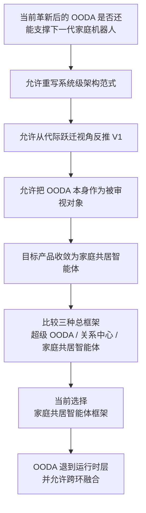

# Kinbot家庭共居智能体架构革新讨论纪要

---

文档版本：v1.0
创建日期：2026-04-06
作者：Codex-架构师

文档变更记录：
- v1.0 | 2026-04-06 | Codex-架构师 | 新增文档，沉淀当前线程接任后的宏观架构革新讨论过程、阶段性决议、哲学映射与后续收敛方向。

---

## 1. 文档定位

本文档用于记录当前线程接任 Kinbot 架构工作后，与用户围绕“当前革新后的 `OODA` 是否还能支撑具身智能浪潮下的新一代家庭机器人产品”所展开的第一轮宏观讨论。

本文档的作用是：

1. 固化到目前为止已经形成的讨论路径与阶段性决议；
2. 为后续总架构重构、运行时重组和 `V1 -> V2` 反推提供上游输入；
3. 明确哪些内容已经形成共识，哪些仍停留在 `provisional` 层。

本文档当前**不直接替换**现有 `PDCP` 主线文档，也**不直接宣布**当前 `KBT-32` 或后续模块方案基线失效。它是当前主线之上的新增评审输入。

## 2. 背景问题

本轮讨论并不是在问“如何继续补强当前 `OODA` 文档”，而是在问一个更高层的问题：

**如果 Kinbot 不只是一代健康管理与陪伴机器人，而要面向具身智能浪潮下的新一代家庭机器人产品，那么当前以 `OODA` 为主方法论的总体架构，是否还足够？**

用户进一步明确：

1. 这轮革新应优先重写系统级架构范式，而不是只修补模块分工；
2. 思考尺度应优先站在代际跃迁视角，再反推 `V1` 如何收缩；
3. `OODA` 本身可以被重新审视，必要时可降级或被更高一层框架替代；
4. 目标产品不再只按“老人健康管理机器人”理解，而要朝“家庭共居智能体”方向思考。

## 3. 讨论推进路径

### 3.1 关键分叉与当前收敛

| 讨论节点 | 当前收敛 | 状态 |
| --- | --- | --- |
| 革新主攻方向 | 重写系统级架构范式，而不是只重排模块边界 | confirmed |
| 时间尺度 | 先定义更大胆的下一代家庭机器人架构，再反推 `V1` | confirmed |
| `OODA` 地位 | 允许把 `OODA` 作为被审视对象，而非不可触动的总框架 | confirmed |
| 产品北极星 | `Kinbot` 应朝“家庭共居智能体”而不是“更强的一代工具型机器人”思考 | confirmed |
| 核心能力主轴 | 长期理解家庭、自然低打扰共处、持续关系形成三者都重要，但应按“最影响产品成立性”来排主次 | confirmed |
| 可视化对比结论 | `超级 OODA` 与 `关系中心` 都不够完整，当前更应走“家庭共居智能体框架” | confirmed |

### 3.2 当前讨论链路图

## 4. 当前阶段性决议

### 4.1 关于 `OODA`

当前讨论并未否定 `OODA` 的价值，但已明确否定把它继续当成新一代家庭机器人的**唯一总架构中心**。

当前收敛为：

1. `OODA` 更适合作为具身运行时的闭环语法与分析框架，而不是顶层产品架构；
2. 在前瞻具身智能趋势下，`O / O / D / A` 不必一一映射到固定模块边界；
3. 尤其 `Orient + Decide` 的融合，应被视为前瞻主线之一；
4. 局部感知到动作的端到端趋势可以进入前瞻模块，但不能绕开系统级安全、授权、恢复与审计边界。

### 4.2 关于候选总框架

本轮可视化对比的三个候选总框架分别是：

1. `超级 OODA 框架`：适合继续优化当前一代主线，但不足以承载“家庭共居智能体”的代际跃迁；
2. `关系中心框架`：对产品本质和长期关系提醒最强，但过于容易演化为新的超级中心，且不足以完整承载具身运行与空间共居；
3. `家庭共居智能体框架`：当前最接近用户所期望的下一代方向，因为它允许把家庭、关系、自我和具身运行放在同一总图中组织。

当前阶段结论是：

**Kinbot 的下一代总框架，应优先沿“家庭共居智能体框架”继续深化。**

### 4.3 关于当前阶段完成度

到本文写入时为止，当前革新工作仍停留在**宏观母命题与顶层原则阶段**。下列工作尚未完成：

1. 新总架构的正式顶层分解图；
2. 旧 `OODA` 主线向新运行时层的重组图；
3. 与现有 `PDCP / KBT-32` 文档的精确映射关系；
4. 从新框架反推 `V1` 可交付收缩版的系统裁剪；
5. 新的验证指标与阶段门口径。

因此，本文档中的多数架构结论当前仍属于 **`provisional` 的上位架构方向**，而不是已冻结主线。

## 5. 现代 / 后现代 / 中国现实语境下的哲学映射

用户明确指出：不能只停留在亚里士多德的第一性原理，而应引入更现代主义、后现代主义、并考虑中国社会现实的家庭机器人形而上学视角。

当前映射如下：

| 哲学线 | 对应的家庭观 | 对家庭机器人架构的直接要求 |
| --- | --- | --- |
| 现象学 / 居住哲学 | 家庭不是几何空间，而是被生活出来的世界 | `Home Model` 不能只是地图，必须建模节奏、敏感区、打扰阈值、靠近方式和在场感 |
| 实用主义 | 家庭是持续被维持、修复、协商出来的生活实践 | 架构中心不能只是静态状态，必须重视恢复、例程学习、异常后的重新接续 |
| 关怀伦理 | 家庭首先是照护关系网络，依赖与回应责任是核心事实 | 必须显式建模照护责任、主动边界、克制边界、升级链和主体性保护 |
| 系统论 / 韧性理论 | 家庭是受扰动但必须维持连续性的生活系统 | 必须把连续性、可恢复性、分层降级、接力与断点续接纳入架构核心 |
| 后现象学 / 行动者网络 | 当代家庭是人、设备、平台、医院、物业、社区共同构成的混合网络 | 机器人不能被设计成孤立本体，连接器、服务平面和责任边界必须是稳定架构层 |
| 后现代多主体视角 | 家庭不是单一中心秩序，而是多角色、多规范、多边界持续协商 | 系统不能假设唯一目标函数，必须支持多角色冲突、边界协商和上下文最合适动作 |
| 中国关系伦理 / 差序格局 | 家庭是角色、责任、亲疏、体面与代际义务构成的秩序网络 | 权限模型必须超越单用户系统，显式支持老人、子女、保姆、访客、社区等责任网络 |
| 人格尊严 / 现代生命伦理 | 照护不能以效率名义吞没人的主体性 | 授权、纠错、删除、解释、拒绝权必须进入底层约束，机器人帮助人生活而不是替人生活 |
| 当代中国社会现实 | 大量家庭已是“老人常住 + 子女远程在场”的分布式家庭 | 架构必须把远程在场、异步参与、家庭状态共识和接力闭环当成基本事实 |

## 6. 当前提出的新架构母命题

结合以上讨论，当前线程提出的**阶段性母命题**为：

`Kinbot` 不是以单次任务成功率为中心的家庭服务机器人，而是面向中国分布式家庭，通过具身在场维持家庭生活连续性、承接照护责任、保护成员主体性，并在长期共居中形成可信关系的家庭共居智能体。

这个母命题当前仍是 `provisional`，原因是：

1. 其总图尚未完全展开；
2. 其与现有 `PDCP` 主线的映射关系尚未写清；
3. 其验证方式和阶段门口径尚未落地。

## 7. 当前提出的顶层架构原则

结合用户对措辞的修正意见，当前母命题之上的阶段性顶层原则收敛为：

1. **生活连续性优先于局部任务最优。** 系统首先保证家庭日常不失控、异常可恢复、照护不断线，而不是把单点任务做到局部最优。
2. **具身在场是核心价值。** 机器人必须作为真实在场主体参与家庭生活，移动、等待、观察、靠近、让行、静默出现都属于顶层能力。
3. **关系是长期结果，不是预设功能。** 信任、亲近、依赖与分寸感来自长期可靠、克制、可解释、可恢复的行为累积。
4. **主体性与尊严不可让渡。** 机器人可以辅助、提醒、协调、接力，但不能以效率之名默默接管人的生活。
5. **家庭必须被建模为多角色责任网络。** 老人本人、子女、保姆、社区与平台服务之间的权限、责任、升级链与冲突确认必须显式存在。
6. **低打扰共居能力必须作为顶层能力建模。** 是否会打扰、是否懂分寸、是否尊重空间礼仪、生活节奏和情绪状态，必须进入状态、调度、策略和验收体系。
7. **系统采用“分层约束 + 局部融合”的运行时原则。** `OODA` 不再是总架构，也不再要求严格按环拆开；允许 `Orient + Decide` 融合，允许局部端到端化，但安全、授权、恢复和审计边界必须保持系统级约束。

## 8. 对现有主线的影响边界

当前讨论对现有仓库主线的影响边界，建议冻结为：

1. 现有 `PDCP` 双视角基线不在本轮被直接废弃；
2. 现有 `OODA` 文档不在本轮被直接删除，而是在后续重组中降到运行时层；
3. 现有 `KBT-32` 总体方案与模块下发基线，需要把本文档作为新增评审输入，而不是立即按本文重写；
4. 现有“关系质量”框架、`Agent` 增强平面、`World State` 长期记忆分层、`NFM` 路线等内容，应被视为通向新总框架的桥接素材。

## 9. 当前未关闭问题

下列问题仍未关闭，是后续必须继续收敛的重点：

1. 新总框架的正式名称是否继续沿用“家庭共居智能体框架”，还是进一步改名；
2. 新总框架的真正中心究竟是“家庭生活连续性核心”，还是更现代、更贴合中国现实的另一种表达；
3. `Home / Relation / Self` 三类长期模型之间的主次与耦合关系；
4. 新总架构的顶层分解数量与稳定边界；
5. 旧 `OODA` 主线如何在运行时层被重组，而不是被粗暴废弃；
6. 新总框架如何反推 `V1` 的可交付收缩版；
7. 新框架对应的验证指标与阶段门如何定义。

## 10. 下一步建议

按当前讨论进度，后续工作建议进入以下顺序：

1. 先画出新总框架的顶层概念图；
2. 再画出旧 `OODA` 向新运行时层的重组图；
3. 再把新框架映射回现有仓库主线，明确哪些文档保留、哪些降级、哪些重写；
4. 最后反推 `V1` 收缩版与新的验证指标。

## 11. 当前审阅重点

若用户继续审阅本文，建议优先看以下 `4` 点：

1. 是否接受“当前革新工作的真正问题不是补强 `OODA`，而是重写下一代家庭机器人总框架”；
2. 是否接受“家庭共居智能体框架”作为当前最优候选方向；
3. 是否接受“`OODA` 降到运行时层，并允许跨环融合”这一阶段性结论；
4. 是否接受“生活连续性、主体性保护、多角色责任网络、低打扰共居”作为新的顶层原则群。
