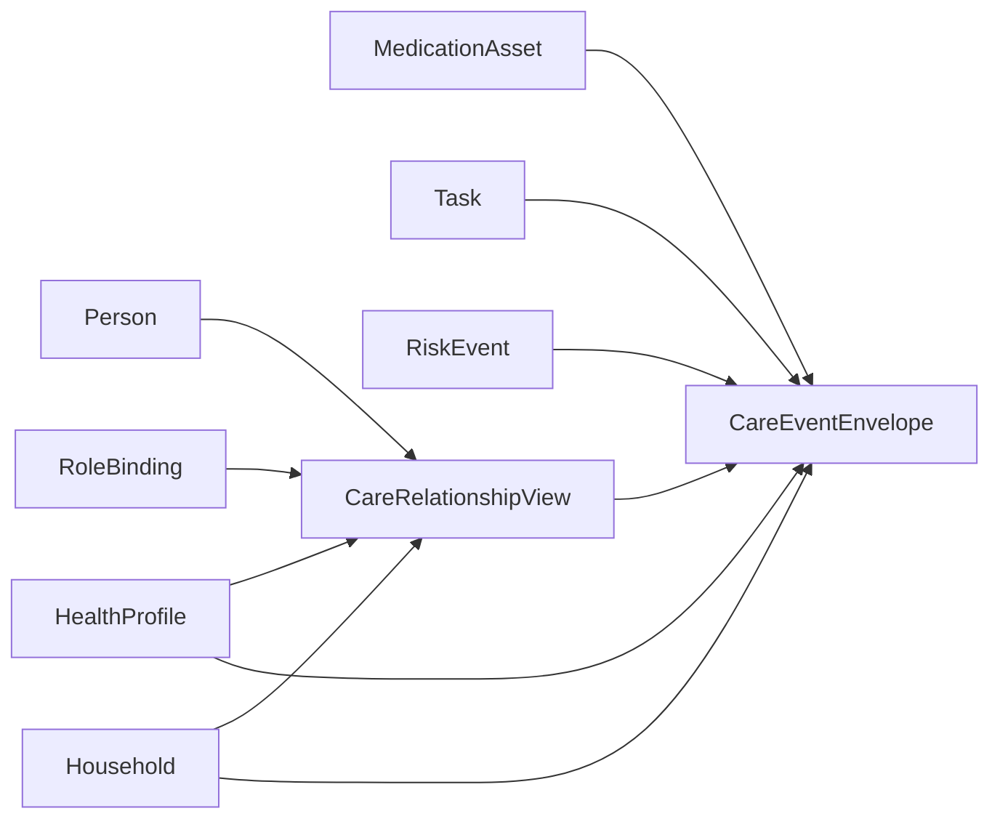

# Kinbot关系与事件扩展层候选方案

---

文档版本：v1.0
创建日期：2026-04-06
作者：Codex-架构师

文档变更记录：
- v1.0 | 2026-04-06 | Codex-架构师 | 新增文档，作为革新路线 `Phase 3` 中路线 A 的首份结构级候选方案，定义“保留 `9` 类骨架 + 关系 / 事件扩展层”的最小实现形态。

---

## 1. 文档定位

本文档承接 `Phase 3` 中当前推荐的路线 A：

**保留 `World State` 现有 `9` 类一级实体骨架，同时新增关系视图与事件视图的扩展层。**

本文档的目标不是直接修改主表，而是回答以下问题：

1. 如果当前不直接执行 `9 -> 7`，那路线 A 到底长什么样；
2. 关系与事件扩展层如何挂接到现有 `9` 类骨架上；
3. 如何避免扩展层变成新的双重事实源；
4. 这条路线为什么比立刻重组主表更适合当前 `V1` 阶段。

## 2. 为什么当前优先走扩展层

到 `Phase 2` 结束时，`World State` 的 `9` 类一级实体已经能承接：

1. 人与角色
2. 家庭与看护网络
3. 空间与物件
4. 健康档案与药物资产
5. 任务与风险事件

当前真正缺的，不是再立刻改一次顶层槽位，而是：

1. 缺一个**关系聚合视图**，把老人、子女、保姆、平台、人工服务之间的照护关系拉平到可评审层；
2. 缺一个**事件聚合视图**，把健康、安全、递送、问诊转接和人工接力这些跨实体链路统一到可追踪层。

如果直接进入 `9 -> 7`，这些问题未必能更快解决，反而会更早触发主表迁移成本。

## 3. 当前必须控制的复杂度

当前再次追问：

**现在的架构是不是太复杂了？**

当前判断是：

- 如果再新增一组一级实体，同时又不清楚其与现有 `Task / RiskEvent / Household.care_network / RoleBinding` 的边界，复杂度会继续上升；
- 如果先把关系与事件收敛为扩展层，就能在不破坏主表稳定性的前提下验证它们是否真的值得上提。

因此，路线 A 的原则是：

1. 不改主表；
2. 不新增一级实体；
3. 只新增视图层与聚合层；
4. 所有扩展对象都必须引用现有主表实体，而不是复制事实。

## 4. 路线 A 的最小结构

当前建议扩展层只引入 `2` 类对象：

1. `CareRelationshipView`
2. `CareEventEnvelope`

本轮先不再新增第三类对象，避免扩展层自己再次膨胀。

### 4.1 `CareRelationshipView`

它不是一级实体，而是从现有 `Person / RoleBinding / Household / HealthProfile / Household.care_network` 聚合出来的关系视图。

推荐字段：

| 字段 | 说明 |
| --- | --- |
| `relationship_view_id` | 视图唯一 ID |
| `subject_person_id` | 被照护主体，一般是老人本人 |
| `counterparty_ref` | 对侧主体，可指向子女、保姆、平台、坐席或第三方服务对象 |
| `relationship_kind` | 家属照护、保姆协作、人工服务接力、平台履约协同等 |
| `care_scope` | 该关系覆盖的照护范围，如提醒、递药、远程确认、异常升级 |
| `authority_snapshot` | 当前授权快照，来源于 `RoleBinding` 与审批配置 |
| `consent_snapshot` | 当前同意 / 拒绝 / 需二次确认状态 |
| `escalation_rank` | 升级链中的优先级位置 |
| `trust_state` | 当前关系稳定度、最近失配或冲突状态 |
| `memory_scope` | 该关系允许访问或回写的长期记忆范围 |

核心原则：

1. 它不取代 `RoleBinding`；
2. 它不重复保存原始权限事实；
3. 它只把跨实体判断聚合到“照护关系”这一评审视角。

### 4.2 `CareEventEnvelope`

它不是一级实体，而是从现有 `RiskEvent / Task / MedicationAsset / HealthProfile / Household.care_network` 聚合出来的事件视图。

推荐字段：

| 字段 | 说明 |
| --- | --- |
| `care_event_id` | 事件包络唯一 ID |
| `event_family` | 健康、安全、陪伴、递送、人工服务、外部履约 |
| `event_type` | 如异常心率、跌倒疑似、到点服药、递送完成、人工接通 |
| `subject_person_id` | 事件关联人 |
| `linked_risk_event_id` | 关联风险事件 |
| `linked_task_id` | 关联任务 |
| `relationship_view_id` | 当前主要照护关系视图引用 |
| `stage` | 候选、确认、处理中、等待确认、已完成、已关闭 |
| `approval_snapshot` | 当轮审批快照 |
| `escalation_targets` | 当前准备联动的对象列表 |
| `evidence_refs` | 证据引用，如生命体征、语音、视觉、人工记录 |
| `handoff_state` | 是否已转人工、已转平台、已完成回写 |

核心原则：

1. 它不取代 `RiskEvent`；
2. 它不取代 `Task`；
3. 它只负责把跨链路事件聚合成一个可审的“照护事件包络”。

## 5. 与现有 `9` 类一级实体的挂接关系

当前边界是：

1. `CareRelationshipView` 只引用主表，不回写主表结构；
2. `CareEventEnvelope` 只聚合任务、风险、药物、审批和联动快照；
3. 任何新的事实仍优先落在原有 `9` 类一级实体或其受治理字段中。

## 6. 这条路线如何降低当前迁移成本

路线 A 的价值，不在于“永远不改主表”，而在于：

1. 先把真正的新语义从旧主表里拉出来观察；
2. 先确认这些新语义是否足够稳定；
3. 等稳定后，再判断是否值得进入 `9 -> 7`。

这能减少当前至少 `3` 类成本：

1. 文档迁移成本：不需要立刻重写所有主线文档；
2. 接口迁移成本：不需要立刻重定义模块输入输出；
3. 认知迁移成本：模块 owner 仍能继续沿现有 `9` 类骨架工作。

## 7. 当前仍不应冻结的内容

即使采用路线 A，以下内容当前仍保持 `provisional`：

1. `CareRelationshipView` 将来是否会上提为一级实体；
2. `CareEventEnvelope` 将来是否会上提为一级实体；
3. `Task` 与 `RiskEvent` 的边界是否最终仍保持现状；
4. `9 -> 7` 是否最终会发生。

## 8. 当前推荐

当前推荐是：

**先按本文定义，把路线 A 收敛为 `Phase 3` 的默认候选路线，并用它去检验是否真的存在必须进入主表重组的结构压力。**

如果后续发现：

1. 扩展层持续稳定；
2. 下游接口已经开始天然依赖这些新结构；
3. 且改主表确实能减少复杂度；

再进入 `9 -> 7` 的正式冻结评审。

## 9. 本轮建议用户重点审阅

1. 这 `2` 类扩展对象是否足够，还是已经太多；
2. `CareRelationshipView` 与 `RoleBinding` 是否分工清楚；
3. `CareEventEnvelope` 与 `RiskEvent / Task` 是否分工清楚；
4. 当前是否接受先按这条路线继续推进 `Phase 3`。
