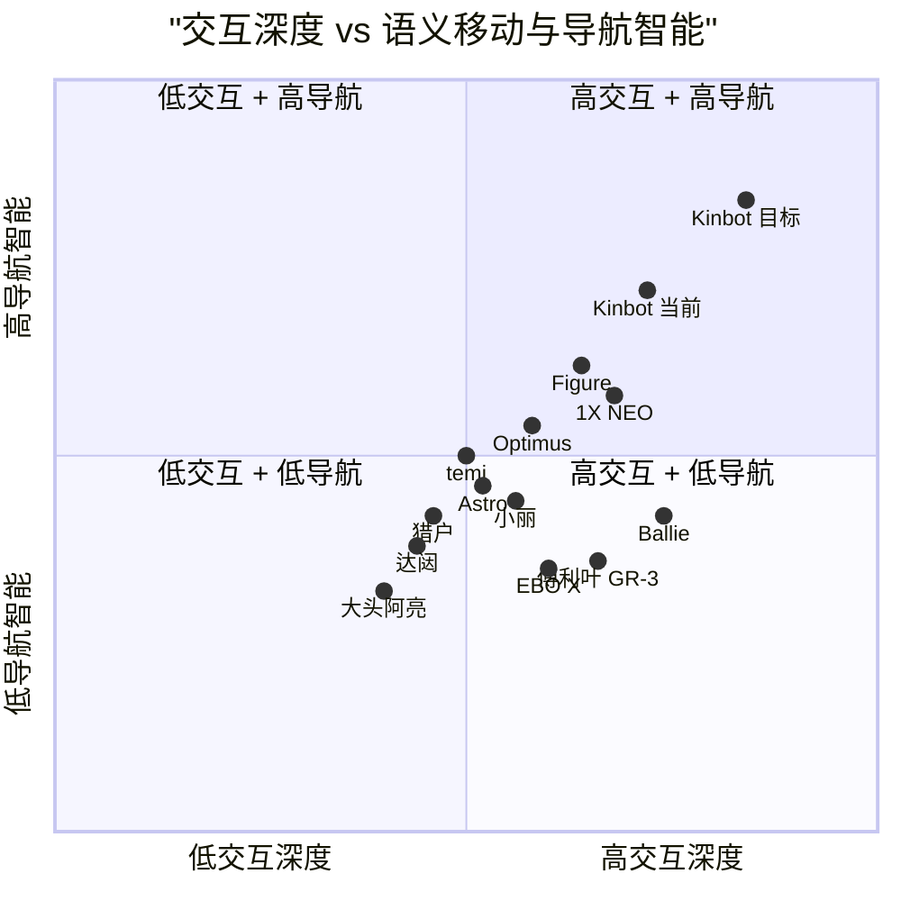
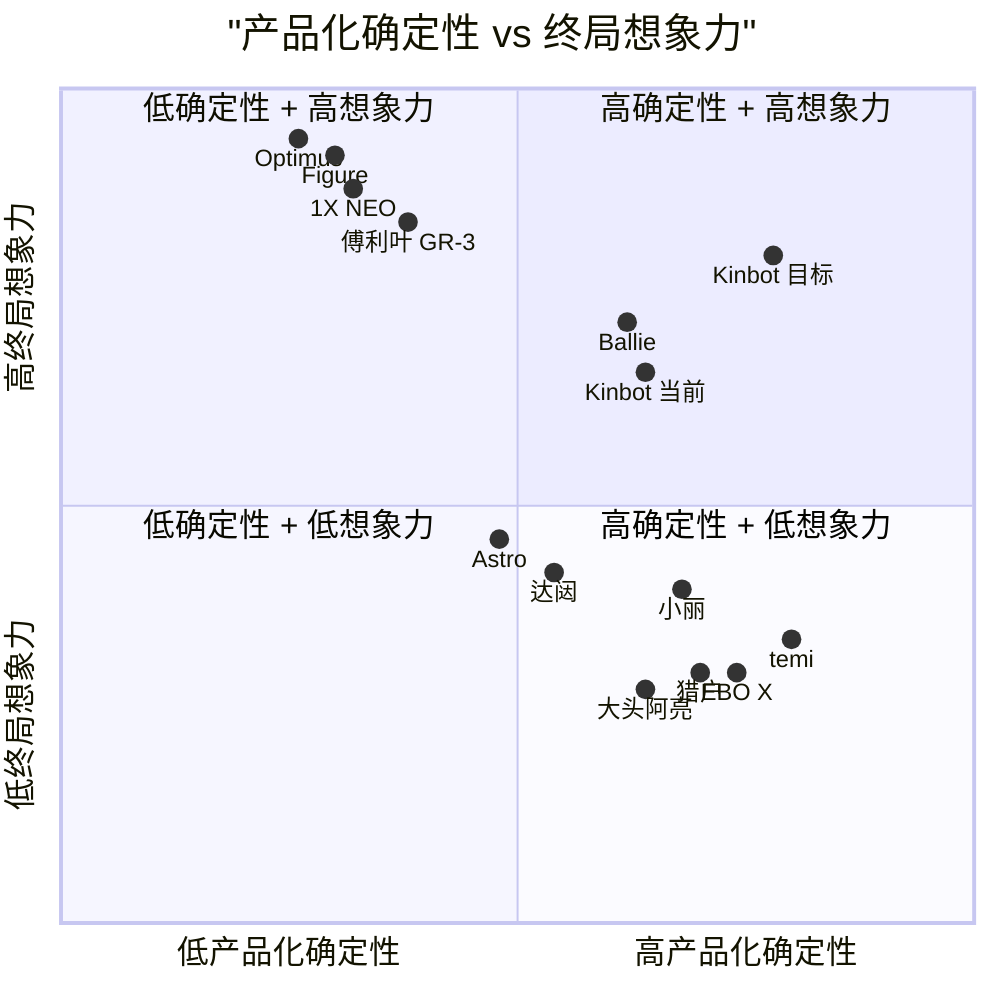
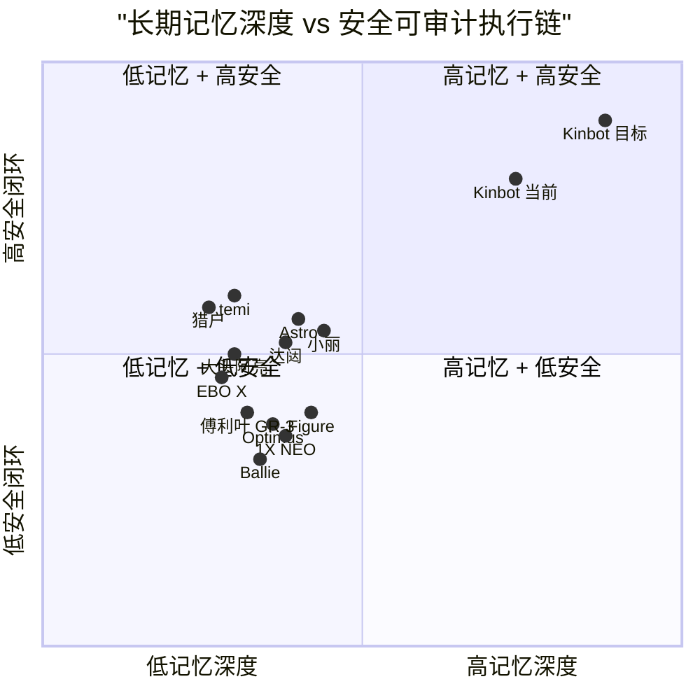

# Kinbot 技术定位、竞品格局与关键抉择修订结论稿（EMT 汇报用）

---

文档版本：v2.1
创建日期：2026-04-12
作者：Claude-架构师

文档变更记录：
- v2.1 | 2026-04-14 | Codex-架构师 | 在附录新增 `3` 张 `quadrantChart` 四象限图，统一使用双引号包裹中文文本，并重新拉开竞品坐标分布，使 Kinbot 当前位、目标位与关键竞品的相对关系更清楚。
- v2.0 | 2026-04-14 | Claude-架构师 | 按 EMT 汇报稿标准全面改写：正文改成老板语言、技术细节整体下沉到附录，新增明确审批 ask，并保留 v1.5 全量信息。
- v1.5 | 2026-04-14 | Codex-架构师 | 在 EMT 技术章节中新增“技术高地的可验证判据”与“替代性竞品 / 替代性解决方案”，使文档从技术路线说明补强为可审批的技术论证。
- v1.4 | 2026-04-12 | Codex-架构师 | 继续收紧 EMT 口径：将“国内直接竞品深度接近”判断改为更稳表述，并把核心一句话补入“可审计、可被信任”的执行链价值。
- v1.3 | 2026-04-12 | Claude-架构师 | 同步第六节对 EMT 直接结论覆盖国内竞品；在“为什么 Kinbot 不是更贵的旧东西”后补入正向品类定义总结。
- v1.2 | 2026-04-12 | Codex-架构师 | 收紧执行摘要与竞品口径：删除证据不足的讯飞家庭机器人表述，拆分国内直接产品竞品与前瞻叙事竞品，弱化 Astro 与人形成本 / 时间窗口绝对判断，并补入“为什么 Kinbot 不是更贵的旧东西”小节。
- v1.1 | 2026-04-12 | Claude-架构师 | 修正本地绝对路径为仓库相对路径；补入中国国内直接竞品、技术量化锚点、高风险抉择说明和与 24 号战略野心评审的交叉引用。
- v1.0 | 2026-04-12 | Codex-架构师 | 基于 codex/kinbot_co_living_agent@498a4d7 的当前主线状态，吸收 Claude 分析并补入家庭类人形竞品，形成可直接用于 EMT 或管理层汇报的修订结论稿。

---

## 1. 文档定位

本文用于面向集团 EMT 汇报时，回答三个问题：
1. Kinbot 预期会达到什么技术状态。
2. 它面对的主要替代方案和竞品是什么。
3. 为什么当前这条技术路线值得继续推进。

本文与 24 号战略野心差距评审互为补充。24 号回答战略野心够不够，这一章回答技术路线值不值得批。

## 2. 核心一句话

趁人形机器人还做不到可靠进家，率先量产高端家庭移动交互机器人。

核心结论再展开一层：Kinbot 抢的不是“终局形态第一”，而是“最先做成高端家庭移动交互产品”的位置。
这条路线成立后，集团拿到的不会只是一台机器人，而是一个可持续迭代的家庭共居技术底座。
它的价值不在单点能力最强，而在系统完整、长期记忆、可审计、可持续进化。
这正是当前价格带里最稀缺、也最值得优先抢占的位置。

## 3. 为什么 Kinbot 不是更贵的旧东西

Kinbot 同时跨过了三条边界：

1. 它不是固定终端，因为它能主动靠近、巡视、确认。
2. 它不是普通移动看护设备，因为它有语义移动、长期记忆和共居能力。
3. 它不是当前阶段的人形展示机，因为它优先追求可交付、可量产、可被信任。

这三条边界的交集，定义了一个当前市场上仍然稀缺的产品品类：
能在家庭中长期共居、能理解空间与关系、并以可交付成本率先落地的移动交互智能体。

## 4. 技术高地怎么验证

对 EMT 而言，技术高地不是抽象概念，而是未来六到十二个月能否被验证。

| 判据 | 看什么 | 为什么重要 |
| --- | --- | --- |
| 语义移动闭环 | 找人找物到达恢复 | 证明它不只是巡逻 |
| 共存移动体验 | 礼让靠边低打扰 | 证明它能长期共居 |
| 断网可用性 | 断网仍能安全工作 | 证明核心能力可信 |
| 长期家庭记忆 | 越用越懂这个家 | 证明它会持续变好 |
| 高端产品感 | 安静自然有质感 | 证明价格带成立 |

## 5. 替代方案与竞品

### 5.1 替代性方案

真正和 Kinbot 抢预算的，未必先是机器人，而往往是更便宜、部署更轻的替代方案。

| 替代方案 | 当前能力 | 关键短板 |
| --- | --- | --- |
| 手机应用加穿戴 | 提醒展示问诊入口 | 没有具身在场 |
| 固定式智慧终端 | 问答咨询导诊 | 不能持续移动服务 |
| 远程视频护士 | 人工咨询质量高 | 人力重且难复制 |
| 现有照护工作流 | 子女保姆社区医院协作 | 碎片化且依赖人 |

这意味着 Kinbot 要证明的，不只是“比别的机器人强”，还要证明“比这些更便宜的替代方案更值得投入”。

### 5.2 机器人竞品分层

直接产品竞品主要包括：

- 海外：Ballie、Astro、EBO X、temi。
- 国内：小丽、大头阿亮、达闼、猎户等。

这些产品已经证明移动陪伴、看护和平台服务是可做的，但普遍缺少三件东西：

1. 强语义移动。
2. 长期家庭记忆。
3. 面向高端家庭场景的完整系统闭环。

前瞻技术与叙事竞品主要包括：

- 1X、Figure、Optimus。
- 优必选 Walker、小米人形相关路线。
- 傅利叶 GR-3。

这些路线强在未来想象力，但当前弱在价格带、交付节奏和家庭产品化现实性。

### 5.3 竞品结论

短期在同价格带、同形态、同系统完整度上，Kinbot 缺少完全同构对手。
中期在技术叙事和用户心智上，它会持续面对家庭类人形路线的压力。
所以 Kinbot 必须同时回答两件事：为什么它比当前移动机器人更强，以及为什么它虽然不是人形却仍然值得先买。
这也是这次概念评审必须回答清楚的核心问题。

## 6. 我们为什么这样选

| 关键抉择 | 一句话理由 | 必要性 | 最大风险 |
| --- | --- | --- | --- |
| 不做人形 | 先把移动交互闭环做稳 | 极高 | 叙事被人形压制 |
| 云侧强交互加端侧强导航 | 同时保住体验与安全 | 极高 | 协同复杂 |
| 导航模型不直接控底盘 | 保住可审计和可降级 | 极高 | 语义与执行桥接难 |
| 把家庭记忆做深 | 壁垒来自越用越懂 | 极高 | 记忆治理复杂 |
| 把共存移动单独做 | 共居体验不是避障 | 高到极高 | 数据和评测难 |
| 坚持纯视觉 | 更符成本与形态 | 高 | 过线压力大 |

### 6.1 为什么不做人形

人形路线今天更像未来叙事，不像当前价格带里的成熟产品路线。
对 Kinbot 来说，先把移动、交互、记忆和看护闭环做稳，比双臂双腿更重要。
轮式底盘在续航、噪声、稳定性和成本上，对养老家庭场景有结构性优势。
这条路线的意义，不在保守，而在更快拿到可交付的产品高地。

### 6.2 为什么要赌纯视觉

纯视觉的价值不只是省一个传感器，它还同时服务于成本、外观和长期数据壁垒。
这条路线风险很高，所以主线才保留了统一状态、经典导航、安全门控和阶段门。
如果不过线，优先调节奏，不回退路线。
这说明团队是在做有纪律的押注，而不是技术浪漫主义。

## 7. 请 EMT 判断什么

这次概念评审，最需要 EMT 判断的是三件事：

1. 是否继续推进“轮式 + 纯视觉 + 端侧导航模型”的主技术路线。
2. 是否接受 2026 年第三季度作为纯视觉路线的关键阶段门时间点。
3. 是否确认阶段门不过线时，优先调节奏，不回退技术路线。

如果这三件事被确认，当前技术路线就具备继续向下推进的清晰边界。

## 8. 外部参考

- Samsung Ballie 与 Gemini
- Amazon Astro
- Enabot EBO X
- temi
- 森丽康小丽
- 大头阿亮
- 1X NEO
- Figure 03 / Helix 02
- Tesla Optimus
- 优必选 Walker
- 傅利叶 GR-3

## 附录 A：技术量化锚点

| 维度 | 量化锚点 | 来源 |
| --- | --- | --- |
| 端侧导航模型 | 4B Student，由 27B Teacher 多轮蒸馏 | 模型设计 |
| 端侧算力 | 地瓜 S100 Pro，12GB RAM + 32GB Flash | 选型矩阵 |
| 导航任务覆盖 | 5 类任务，P0 覆盖 T1/T2/T3/T4A | 导航问题设计 |
| 记忆体系 | 3 层记忆平面，6 类长期记忆，7 实体世界状态 | 长期记忆设计 |
| 空间表达 | semantic_global_frame + local_metric_frame | 角色分析 |
| 夜间闭环 | 4 阶段 | 夜间闭环研究 |
| 视觉传感器 | 1 组双目 + 2 个单目 | 总体架构 |
| 整机 BOM | 5000 到 6000 元，7 个成本桶 | 选型矩阵 |
| 核心评估指标 | TTFT、稳态 TPS、热稳态 TPS | 选型矩阵 |

## 附录 B：导航、交互与工程技术细节

### B.1 导航与空间智能

- 端侧导航模型承担语义导航能力切片。
- 语义导航策略与共存移动策略分层。
- 空间表达采用语义全局帧与局部度量帧双帧体系。
- 经典导航与安全链继续保留。

### B.2 交互与记忆

- 云侧交互大模型负责复杂交互。
- 端侧交互反射层负责低时延响应。
- 统一世界状态负责共享投影。
- 长期对话记忆、长期空间记忆、任务状态记忆协同。

### B.3 工程与成本

- 纯视觉主线。
- 1 组双目 + 2 个单目。
- 12GB RAM + 32GB Flash。
- BOM 5000 到 6000 元。
- 纯视觉不过线时优先调节奏。

## 附录 C：完整竞品对比表

### C.1 替代性方案

| 方案 | 当前能力 | 关键短板 |
| --- | --- | --- |
| App + 穿戴 + 固定屏 / 音箱 | 提醒、展示、问诊入口 | 没有具身在场 |
| 固定式智慧终端 | 问答、咨询、导诊 | 不能持续移动服务 |
| 远程视频护士 | 人工咨询质量高 | 人力重且难复制 |
| 现有照护工作流组合 | 子女、保姆、社区、医院协作 | 碎片化、依赖人 |

### C.2 海外直接产品竞品

| 竞品 | 当前状态 | 与 Kinbot 的差异 |
| --- | --- | --- |
| Ballie | 强交互、强云侧智能 | 缺长期空间记忆与语义移动闭环 |
| Astro | 更偏移动看护与远程在场 | 产品化提醒意义大于能力深度 |
| EBO X | 成熟消费产品 | 更像移动陪伴设备 |
| temi | 成熟平台化产品 | 更偏服务平台而非家庭共居 |

### C.3 国内直接产品竞品

| 竞品 | 当前状态 | 与 Kinbot 的差异 |
| --- | --- | --- |
| 森丽康小丽 | 更贴近家庭养老移动交互 | 系统深度和高端完成度不足 |
| 大头阿亮 | 成熟养老陪护路线 | 更偏看护设备参照 |
| 达闼 | 云脑导向 | 与端侧优先路线相反 |
| 猎户 | 商用导向 | 家庭共居能力不足 |

### C.4 前瞻技术与叙事竞品

| 竞品 | 当前状态 | 与 Kinbot 的关系 |
| --- | --- | --- |
| 1X / Figure / Optimus | 家庭类人形与通用具身路线 | 强在终局想象力 |
| 优必选 Walker / 小米人形 | 国内强叙事型路线 | 强在品牌和媒体心智 |
| 傅利叶 GR-3 | 高势能展示型 Care-bot | 适合做人形参照物 |

## 附录 D：关键抉择详细论证

### D.1 不做人形、不做机械臂

- 固定为轮式移动交互机器人。
- 不纳入机械臂和复杂物理操作。
- 不走双足人形路线。
- 先把移动、交互、记忆、看护闭环做到稳定。
- 在成本、量产、外观、噪声、功耗上更可控。
- 风险是叙事上会被人形路线压制。

### D.2 云侧交互大模型 + 端侧导航模型

- 云侧负责强交互。
- 端侧负责导航和共存移动。
- 端侧反射层负责低时延响应。
- 这是在体验、安全、离线和稳定之间的平衡。

### D.3 导航模型不直接控底盘

- 导航模型输出语义子目标、搜索策略、恢复策略。
- 经典导航负责局部规划、轨迹和控制。
- 这样才能保住可审计、可降级、可恢复。

### D.4 把世界状态和长期家庭记忆做成壁垒

- 核心壁垒不是单次推理，而是对这个家的持续理解。
- 七实体世界状态和双帧空间表达是这层壁垒的结构基础。

### D.5 把共存移动单独拎出来

- 共居体验不只是避障。
- 还包括礼让、靠边、正对、低打扰接近、等待。

### D.6 坚持纯视觉主线

- 更符合成本、外观和长期数据壁垒。
- 是当前路线最大的工程赌注。
- 不过线时优先调节奏。

## 附录 E：竞品技术四象限示意图

以下图示用于帮助 EMT 直观看到 Kinbot 当前位、目标位，以及关键竞品在不同技术维度上的相对位置。
这些坐标是相对示意，不是精确量化评分。

### E.1 交互深度 vs 语义移动与导航智能

### E.2 产品化确定性 vs 终局想象力

### E.3 长期记忆深度 vs 安全可审计执行链

