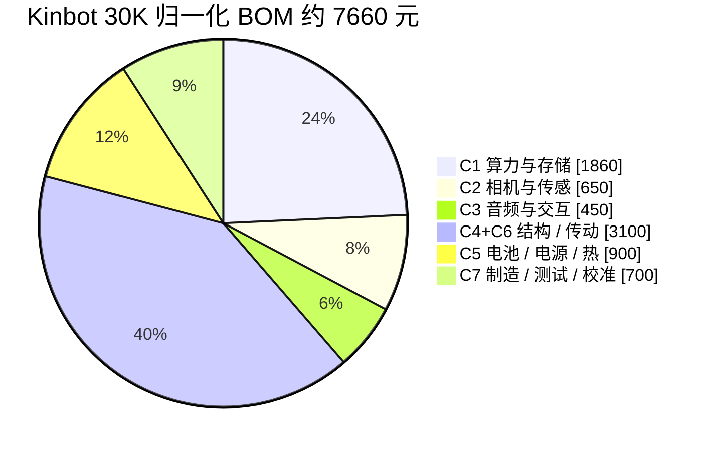
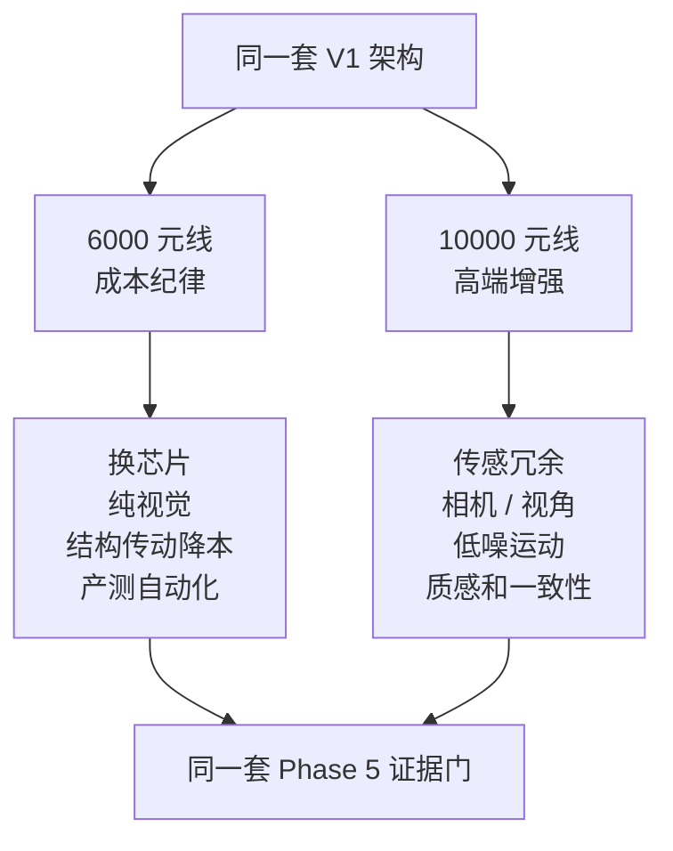
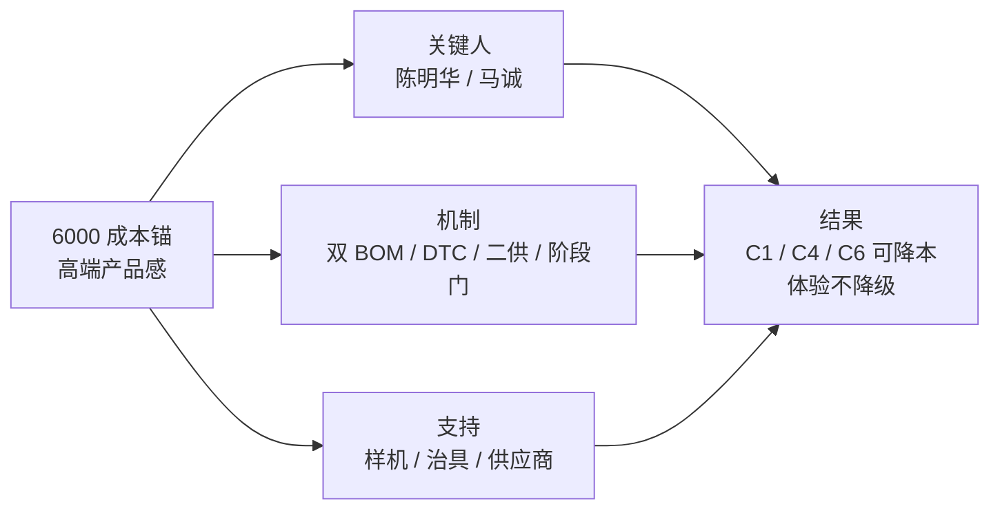

# Kinbot 成本锚定、经营取舍与组织能力建设（EMT 汇报用）

---

文档版本：v1.14
创建日期：2026-05-23
作者：Codex-架构师

文档变更记录：
- v1.14 | 2026-05-24 | Codex-架构师 | 按用户反馈校正 EMT 汇报目的：组织授权不再作为 EMT 申请项，改为 CTO 已有权责下的日常成本治理；本次汇报重点调整为统一成本逻辑、消除反复争议，并转入后续例行审视。
- v1.13 | 2026-05-24 | Codex-架构师 | 按用户反馈精简篇幅、减少机械写作痕迹：重写为 EMT 现场速读稿，压缩重复论证，更多使用表格、符号和图示表达成本锚、经营取舍、上修边界与组织机制。
- v1.12 | 2026-05-24 | Codex-架构师 | 按 `plan-ceo-review` 审阅意见将材料进一步改成 EMT 现场决策稿：新增现场决策页、经营口径、不批准后果和 `30/60/90` 天证据节奏，把工程成本底稿下沉为支撑材料。
- v1.11 | 2026-05-24 | Codex-架构师 | 继续收敛 `10000` 元成本上修口径：将语音声学从上修项调整为 `6000` 元基线必达项；将多模态交互硬件增量限定为相机 / 视角；将避障绕障的上修收益明确为增加相机或必要传感器带来的覆盖与冗余提升。
- v1.10 | 2026-05-24 | Codex-架构师 | 按用户反馈校正成本上修逻辑：语音与声学效果改为 `6000` 元成本基线必须保证达成；多模态交互的成本增量仅保留增加相机 / 视角；绕障避障明确可通过增加传感器提升效果，并同步调整 `10000` 元线投入优先级、审批项和热力表。
- v1.9 | 2026-05-24 | Codex-架构师 | 按用户补充拆解结构 / 传动 `3K` 量级 `4500` 元口径：塑料件约 `1800` 元、五金件约 `700` 元、电机约 `2000` 元，按均开模和 `30K` 量级行业常见降幅估算量产归一化约 `2800-3300` 元、规划值约 `3100` 元，并新增 `30K` 量产归一化压力线约 `7660` 元。
- v1.8 | 2026-05-24 | Codex-架构师 | 按用户补充校正 `C1` 口径：`S100Pro + 12GB + 32GB` 叠加其他芯片器件，在 `30K` 量级下乐观估计约 `270 USD`、折合约 `1860` 元，当前压力线相应调整到约 `9060` 元，并明确 `C1` 降本主要依赖换芯片。
- v1.7 | 2026-05-24 | Codex-架构师 | 吸收用户补充的典型人形机器人 BOM 拆解与未来 `2-3` 年降本趋势，新增 Kinbot 当前成本桶占比计算、当前压力线饼图和与行业趋势的同异判断。
- v1.6 | 2026-05-24 | Codex-架构师 | 按用户反馈将材料视角上提到 `CTO / CEO` 的战略经营层：将团队能力表述改为组织能力建设、关键岗位配置、机制建设和授权支持，避免落入执行层困难说明。
- v1.5 | 2026-05-24 | Codex-架构师 | 吸收用户补充的结构 / 传动成本压力：新增头部四自由度、轮毂电机和结构件 `3000` 台量级成本口径，补充 `6000` 元目标缺口瀑布图，并将组织能力承接及陈明华、马诚等关键岗位配置纳入 EMT 汇报逻辑。
- v1.4 | 2026-05-24 | Codex-架构师 | 按用户反馈强化阅读效率：新增汇报逻辑一屏图、行业成本阶梯图、技术降本资金流向图、双 BOM 情景决策图和成本上修优先级热力表，减少连续文字堆叠。
- v1.3 | 2026-05-24 | Codex-架构师 | 按 CTO 面向总经理与 EMT 的真实汇报压力重排论证逻辑：先说明成本纪律、高端品牌和技术竞争力三方张力，再借成本分析带出 Kinbot 的核心技术方案、低成本竞争力来源与成本上修投入优先级。
- v1.2 | 2026-05-23 | Codex-架构师 | 按用户补充的线下成本口径，新增科沃斯“八界”管家机器人对比，区分公开形态信息与 `3000` 台量级下约 `2` 万元成本、机械臂约 `1-1.15` 万元的非公开估算口径。
- v1.1 | 2026-05-23 | Codex-架构师 | 按用户反馈收敛报告措辞，减少二元对照句式，改为更贴近 EMT 汇报材料的成本策略、投入方向和风险边界表达。
- v1.0 | 2026-05-23 | Codex-架构师 | 基于仓库 `docs/` 现有架构、成本、选型、验证与 EMT 汇报材料，结合公开可比机器人价格和行业 BOM 结构，形成面向集团 EMT 的成本锚定汇报材料。

---

## 0. EMT 现场页

**一句话结论**

> Kinbot 继续以 `5000 到 6000` 元 BOM 作为默认成本锚；保留 `10000` 元 BOM 战略线，但只买用户感知、可靠性余量和量产风险下降，产品架构仍保持一套。

**本次要统一的口径**

| 项 | 口径 | 经营含义 | 后续跟进方式 |
| --- | --- | --- | --- |
| ✓ 成本锚 | `6000` 元线继续作为默认量产约束 | 保留售价、渠道、服务和促销弹性 | 纳入双 BOM 看板，按阶段复盘缺口 |
| ✓ 战略线 | `10000` 元线保留为同架构增强情景 | 支撑首批高端样板、可靠性和品牌声量 | 每一笔增量都要对应用户感知或风险下降 |
| ✓ 治理方式 | CTO 已具备所需组织权责，后续按日常机制推进 | 成本从采购议价前移到设计和验证闭环 | `C1 / C4 / C6` 进入例行审视，不再作为口径争议 |

**四条成本线**

| 成本线 | 状态 | EMT 看什么 |
| --- | --- | --- |
| `6000` | 目标锚 | 售价空间、毛利弹性、家庭可负担性 |
| `7660` | `30K` 归一化压力线 | 还差约 `1660` 元，靠 `C1` 换芯片、结构轻量化、二供和产测自动化消化 |
| `9060` | `3K` 报价压力线 | 短期报价高点，需区分低量溢价、设计缺口和组织能力缺口 |
| `10000` | 战略增强线 | 只投体验、可靠性、传感冗余、结构传动和量产一致性 |

**转入日常跟进后的 `30 / 60 / 90` 天**

| 时间 | 交付 | 判断 |
| --- | --- | --- |
| `30` 天 | `C1` 替代候选、结构 / 传动拆解看板、头部四自由度与轮毂降本路径 | `1660` 元缺口能否拆到 owner、供应商和验证节点 |
| `60` 天 | 语音声学标杆、避障压测、增加相机或必要传感器收益、低噪运动样机 | `6000` 元线底线体验是否成立 |
| `90` 天 | 双 BOM 看板、二供节奏、产测 / 标定治具、样板家庭体验证据 | 是否进入采购、试产和商业拆解 |

## 1. 为什么这事值得 EMT 听

本轮成本讨论超出 BOM 复盘范围。它同时决定四件事：

| 图标 | 命题 | EMT 关心点 |
| --- | --- | --- |
| ¥ | 经营 | 成本纪律能否换来售价空间 |
| ◆ | 品牌 | 降本后产品还能不能显得高端 |
| ▲ | 技术 | 非人形、无机械臂、纯视觉路线是否有竞争力 |
| ● | 组织 | 团队是否有能力把成本目标做成闭环 |

公司当前面对两类压力：

| 压力 | 合理诉求 | 本文给出的处理方式 |
| --- | --- | --- |
| 总经理 | 不把钱花在收益小的位置，减少冗余，保留售价灵活性 | `6000` 元线做强约束 |
| EMT / 品牌 | 高端战略不能做 low，语音声学、多模态、避障绕障和品质感要过线 | `10000` 元线只做高收益增强 |

组织原则沿用总经理对 CTO 的提醒：

> 在适当的核心位置用适当的人，建设适当机制，并给予必要支持。

## 2. 行业信号

| 参照 | 关键数字 | 给 Kinbot 的信号 |
| --- | ---: | --- |
| 科沃斯“八界” | `3K` 量级 BOM 约 `20000`，机械臂约 `10000-11500` | 机械臂会把家庭机器人推到另一条成本曲线 |
| 典型人形 BOM | 用户补充口径：关节相关约 `70%` | Kinbot 已避开最大关节成本块 |
| McKinsey 人形分析 | 执行器约 `40-60%`，感知计算约 `10-20%` | 成本可降，但需要任务化架构和供应链成熟 |
| Unitree G1 | 官方起价 `13.5K USD` | 人形价格下降很快，但家庭可靠性仍未充分证明 |
| 1X NEO | 官方 `20000 USD` 或 `499 USD/月`，复杂任务可远程协助 | 家庭机器人早期会同时竞争硬件、服务和信任 |

**判断**

| ✓ 做 | ▲ 警惕 | ✕ 暂不做 |
| --- | --- | --- |
| 先做高端家庭移动交互产品 | 人形和机械臂会持续制造叙事压力 | 一代不做机械臂、不做人形 |
| 用成本锚倒逼技术路线 | 纯视觉必须过低照、反光、遮挡和动态人压测 | 不把激光雷达 / 深度相机写成产品级 fallback |

## 3. 成本桶

**当前三条口径**

| 口径 | 总额 | 说明 |
| --- | ---: | --- |
| 旧滚动基线 | `6800` | 早期 `C1-C7` 粗估 |
| `3K` 压力线 | `9060` | 结构 / 传动按 `4500`，`C1` 校正到约 `1860` |
| `30K` 归一化 | `7660` | 结构 / 传动按约 `3100`，仍高于 `6000` 目标 |

**最大压力项**

| 桶 | 数字 | 判断 |
| --- | ---: | --- |
| `C1` 算力与存储 | `S100Pro + 12GB + 32GB` 加其他芯片器件，`30K` 乐观约 `270 USD`，折合约 `1860` 元 | 降本主手段是换芯片 |
| `C4 + C6` 结构 / 传动 | `3K` 接近 `4500`，`30K` 规划约 `3100` | 当前第一大成本桶 |
| 执行器小账 | 头部四自由度 `700-800`，双轮毂约 `800`，合计约 `1500-1600` | 远低于人形关节成本结构，但仍压迫整机目标 |

**结构 / 传动 `3K -> 30K` 估算**

| 项 | `3K` | `30K` 估算 | 动作 |
| --- | ---: | ---: | --- |
| 塑料件 | `1800` | `990-1170` | 开模、注塑节拍、良率 |
| 五金件 | `700` | `455-560` | 冲压 / 压铸 / 机加工治具 |
| 电机 | `2000` | `1400-1600` | 定制件、二供、驱动集成 |
| 合计 | `4500` | `2800-3300`，规划 `3100` | `DFMA` + 供应链 + 验证 |

## 4. `6000` 元线怎么成立

| 符号 | 动作 | 底线 |
| --- | --- | --- |
| ✓ | 轮式非人形 | 到人、回充、过门槛、低噪、近场安全 |
| ✓ | 无机械臂，一代用简化储物仓 | 用药提醒、递送、确认和记录必须闭环 |
| ✓ | 纯视觉主线 | 低照、反光、弱纹理、遮挡、动态人群压测过门 |
| ✓ | 语音声学基线保障 | `6000` 元内达成远场唤醒、通话、问诊、降噪和音质领先 |
| ✓ | 多模态节奏靠软件和交互协同 | 加钱能买的硬件增量主要是相机 / 视角 / 成像质量 |
| ▲ | `C1` 换芯片 | `S100Pro` 当前是压力线，默认量产需要替代路线 |
| ▲ | 头颈四自由度降本 | 保留表达、寿命、静音、`EMI` 和线束可靠性 |
| ▲ | 小型轮毂自研 / 二供 | 保低噪、可靠、平顺和回充成功率 |
| ▲ | 结构轻量化 | 机身轻，电机 / 电池 / 散热压力同步下降 |
| ✓ | 自动化产测与标定 | 省下的 BOM 不能变成返工和售后 |

**`6000` 元线可能牺牲的地方**

| 项 | 风险 | 处理 |
| --- | --- | --- |
| 算力余量 | 聪明感上限受约束 | 换芯片 + 模型压缩 + 端云分层 |
| 视觉冗余 | 复杂环境下安全风险上升 | Phase 5 压测；必要时用相机 / 安全传感器补盲 |
| 外观材料 | 高端感受影响 | 用比例、公差、声学、运动节奏和头部灵动补偿 |
| 可靠性余量 | 售后成本上升 | 寿命、热稳态和产测余量不能砍 |

## 5. `10000` 元线怎么花

**先划边界**

| 结论 | 说明 |
| --- | --- |
| 语音声学 | `6000` 元基线必达，`10000` 元线只补一致性、良率、可靠性 |
| 多模态交互 | 硬件增量主要是相机 / 视角 / 成像质量 |
| 避障绕障 | 可以通过增加相机或必要传感器提升覆盖和冗余 |
| 机械臂 | 后置到 `Pro SKU`、专题验证线或下一代 |

**投入优先级**

| 优先级 | 投入 | 买到什么 |
| --- | --- | --- |
| 基线 | 语音与声学绝对领先 | 每天都能感知的入口体验 |
| P0 | 避障绕障与传感器冗余 | 低照、遮挡、动态人、绕障失败场景改善 |
| P0 | 结构 / 传动成本工程与低噪专项 | 拆解 `C4 / C6`，同时提升静音、寿命、精致感 |
| P1 | 多模态相机 / 视角增强 | 人物、空间状态、视觉确认覆盖提升 |
| P1 | 低噪运动与回充 | 共居可信度和售后风险下降 |
| P1 | 头颈表达与可靠性 | 第一眼高端感、寿命和装配一致性 |
| P1 | 电池、电源、热与续航 | 重模型和运动交互并发时更稳 |
| P1 | 材料、公差、轻量化 | 支撑 `23999 到 29999` 价格带 |
| P1 | 产测、校准、可靠性筛选 | 首批一致性、故障追溯和售后诊断 |
| P2 | 端侧算力高配 / 边界验证 | 只在用户收益和成本路线清楚后进入 |
| 后置 | 机械臂 / 复杂取放物 | 独立产品线或下一代讨论 |

## 6. 一套架构，两档 BOM

| 保持不变 | 可增强 |
| --- | --- |
| 轮式移动交互机器人 | 传感冗余、相机 / 视角、成像质量 |
| 一代纯视觉主线 | 低照、动态范围、标定、ISP |
| 紧凑轻量头部 + 躯干内容屏 | 头颈寿命、静音、线束、装配一致性 |
| 本体 + 家属 App + 最小云 | 服务 / 坐席按 `KBT-57` 独立记账 |
| 原始敏感数据端侧处理 | 非隐私结构化数据受控回流 |

## 7. 组织承接

| 抓手 | 当前动作 | 作用 |
| --- | --- | --- |
| 陈明华 | 已接受 offer，按本体 `SE` 承接 | 拉通结构、电子、控制、供应商、验证 |
| 马诚 | 已签约 / 已接受 offer，按齿轮 / 减速箱 / 低噪传动专项承接 | 支持头颈多自由度、轮毂 / 驱动传动、`NVH` 指标化 |
| 双 BOM 看板 | `6000` 约束线 + `10000` 战略线并行 | 每一笔增量都对应用户价值或风险下降 |
| 设计到成本 | `DFM / DFA / DFMA` 前置 | 从设计阶段压零件、工艺、公差和装配成本 |
| 产测闭环 | 双目、麦阵、头颈、轮毂、回充治具化 | 减少返工、售后和首批口碑风险 |

## 8. 口径与跟进

| 事项 | 当前口径 | 后续审视点 |
| --- | --- | --- |
| 成本锚 | `5000 到 6000` 元为默认约束 | 缺口是否按月收敛 |
| 战略线 | `10000` 元为同架构增强情景 | 增量是否买到体验或风险下降 |
| 架构口径 | 一套架构、双 BOM 情景 | 是否出现硬件、供应链或售后分叉 |
| `C1` 专项 | 芯片替代为主线动作 | 算力平台是否继续挤压其他体验预算 |
| 结构 / 传动专项 | 与 `C1` 并列管理 | 头部、轮毂、结构总包是否按看板下降 |
| 组织机制 | CTO 既有权责下例行推进 | 降本是否停留在采购谈判层 |

**Phase 5 证据包**

| 证据 | 必须回答 |
| --- | --- |
| 语音声学 | 唤醒、远场、通话、问诊、降噪、回声消除、音质是否领先 |
| 避障绕障 | 低照、反光、遮挡、动态人、绕障失败场景能否过门 |
| 多模态 | 增加相机 / 视角 / 成像质量是否有明确收益 |
| `C1` | `S100Pro / X7Pro / RK` 等路线谁进量产 |
| 结构 / 传动 | `4500 -> 3100 -> 目标区间` 的动作、owner、供应商和验证 |
| 组织 | 陈明华、马诚到位后，`C4 / C6` 降本节奏是否落地 |

## 9. 复杂度自检

现在的架构是不是太复杂了？

| 方案 | 判断 |
| --- | --- |
| 两套硬件、两套验证、两套供应链、两套售后 | 复杂度超出一代承载能力 |
| 一套架构基线 + 双 BOM 情景 + 可裁剪增强项 | 复杂度可控，适合当前阶段 |

## 10. 参考资料

### 10.1 项目内资料

- [docs/03_p2_feasibility/05_cost_structure_and_technology_downpath.md](../03_p2_feasibility/05_cost_structure_and_technology_downpath.md)
- [docs/03_p2_feasibility/08_system_tradeoff_model_and_priority_matrix.md](../03_p2_feasibility/08_system_tradeoff_model_and_priority_matrix.md)
- [docs/03_p2_feasibility/09_cost_scenario_comparison_report.md](../03_p2_feasibility/09_cost_scenario_comparison_report.md)
- [docs/03_p2_feasibility/04_hardware_software_selection_matrix.md](../03_p2_feasibility/04_hardware_software_selection_matrix.md)
- [docs/02_p1_architecture/01_overall_architecture.md](../02_p1_architecture/01_overall_architecture.md)
- [docs/06_p5_launch_readiness/01_mass_production_readiness_criteria.md](../06_p5_launch_readiness/01_mass_production_readiness_criteria.md)
- [docs/08_reviews/26_kinbot_technical_positioning_competition_and_strategic_choices_for_emt.md](26_kinbot_technical_positioning_competition_and_strategic_choices_for_emt.md)
- [docs/10_team_planning/91_candidate_screening_and_interview_advice.md](../10_team_planning/91_candidate_screening_and_interview_advice.md)

### 10.2 外部公开资料

- Amazon, [Meet Astro, a home robot unlike any other](https://www.aboutamazon.com/news/devices/meet-astro-a-home-robot-unlike-any-other)
- Unitree, [Unitree Go2](https://www.unitree.com/go2/)
- Unitree, [Unitree G1](https://www.unitree.com/g1/)
- 1X Technologies, [Order NEO](https://www.1x.tech/order)
- 太平洋科技, [科沃斯全场景服务机器人亮相 AWE2026，管家机器人“八界”首秀](https://news.pconline.com.cn/2114/21144193.html)
- 搜狐科技, [“养成系”机器人觉醒：拆解科沃斯 OpenClaw 管家机器人八界](https://www.sohu.com/a/1002923408_115300)
- McKinsey, [Turning humanoid supply chain constraints into billion-dollar wins](https://www.mckinsey.com/industries/industrials/our-insights/turning-humanoid-supply-chain-constraints-into-billion-dollar-wins)
- McKinsey, [Humanoid robots: Crossing the chasm from concept to commercial reality](https://www.mckinsey.com/industries/industrials/our-insights/humanoid-robots-crossing-the-chasm-from-concept-to-commercial-reality)
- VentureBeat, [Boston Dynamics starts selling its Spot robot for $74,500](https://venturebeat.com/ai/boston-dynamics-buy-spot-robot-74500/)
