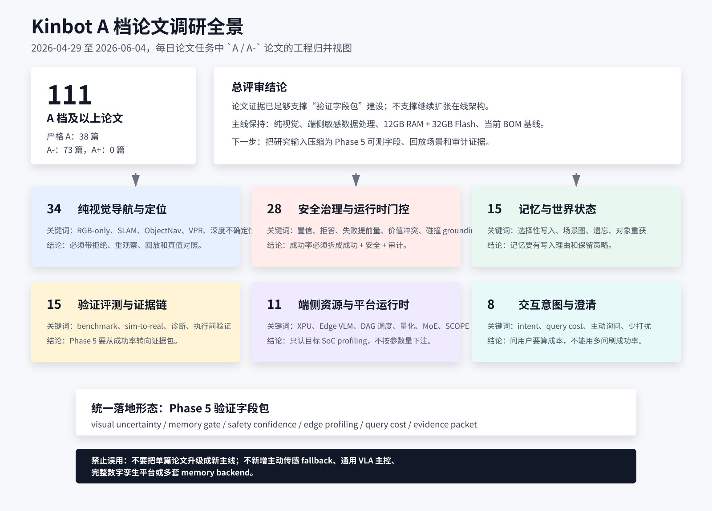

# Kinbot A 档论文整合调研评审

---

文档版本：v1.0
创建日期：2026-06-04
作者：Codex-架构师

文档变更记录：
- v1.0 | 2026-06-04 | Codex-架构师 | 汇总 2026-04-29 至 2026-06-04 每日论文任务中推荐优先级为 `A` / `A-` 的论文，形成跨主题整合评审结论，并配套生成全景信息图。

---

## 1. 调研口径

本轮只使用仓库内已经完成的每日论文纪要，不新增 arXiv 检索。

数据范围：

1. 来源目录：`docs/09_research/00_papers/`
2. 时间范围：2026-04-29 至 2026-06-04
3. 抽取规则：每日纪要中“推荐优先级”表内评级为 `A` 或 `A-` 的论文。
4. 口径说明：本报告将 `A-` 视为“A 档下限”，因为每日纪要中 `A-` 已代表强相关、可转化为 Kinbot 验证字段或专题输入的论文；若按严格 `A` 级统计，则只看 `A`。

抽取结果：

| 口径 | 数量 |
| --- | ---: |
| 严格 `A` | 38 |
| `A-` | 73 |
| `A / A-` 合计 | 111 |
| `A+` | 0 |

## 2. 总体评审结论

### 2.1 最高层判断

过去一个多月的 A 档论文已经足以支撑 Kinbot 从“继续找更多方向”转向“把研究输入收敛成 Phase 5 验证字段包”。

这些论文没有推翻 Kinbot 当前主线：一代仍应坚持纯视觉主线、端侧敏感数据处理、`12GB RAM + 32GB Flash` 默认量产线和 `5000 到 6000 元` 当前冻结 BOM 目标。真正的增量集中在五类问题：

1. 纯视觉导航要以不确定性、拒绝、回放和 RGB-D / LiDAR 真值对照验证，而不是把某篇 SLAM / VLN 论文升级成产品主链路。
2. 长期记忆要选择性写入、可遗忘、可追溯修正，不能保存全量原始历史。
3. 安全治理要从“任务成功”升级为“成功 + 安全 + 置信 + 拒答 / 澄清 + 审计”。
4. 端侧大模型 / VLM / VLA 的价值必须通过真实目标 SoC profiling 证明，不能按参数量或论文 benchmark 推断。
5. 交互和陪伴能力要有“少打扰但必要时主动问”的成本模型，不能把多问用户伪装成高成功率。

### 2.2 推荐工程动作

| 优先级 | 动作 | 说明 |
| --- | --- | --- |
| P0 | 建立 Phase 5 验证字段包 | 将 A 档论文中的字段收敛到导航、记忆、安全、端侧资源、交互澄清和证据链 6 张表。 |
| P0 | 明确“论文不等于主线事实” | A 档论文默认是研究输入；只有经过用户确认和阶段门评审，才回写主线架构或决策日志。 |
| P1 | 形成 6 个专题候选池 | 纯视觉导航、长期记忆、安全治理、端侧资源、交互澄清、验证评测。每个专题只保留字段、实验和门槛，不新增平台概念。 |
| P1 | 做一次去重收敛 | 泛 `VLA`、world model、manipulation、UAV、自动驾驶、重型 3DGS / 数字孪生已接近饱和，应停止按论文逐篇扩结构。 |
| P2 | 为目标 SoC 建 profiling 模板 | 对端侧 LLM / VLM / camera agent / reasoning gate 统一记录 latency、TPS、J/token、memory、thermal、fallback。 |

复杂度自检：现在的架构是不是太复杂了？如果把 111 篇 A 档论文都转成在线模块，答案明确是“是”。正确收敛方式是把它们压缩为验证字段、候选实验和阶段门证据，不新增独立价值推理引擎、多套长期记忆系统、通用 VLA 主控、完整数字孪生平台或 cloud-heavy 感知链路。

## 3. 主题簇评审

本节按“主归属”归并，每篇论文只计入一个主簇，避免重复计数。归并不是论文唯一属性，只服务于工程决策视图。

| 主题簇 | 数量 | 评审结论 | 应落地为 |
| --- | ---: | --- | --- |
| 纯视觉导航与定位 | 34 | 纯视觉路线有足够研究支撑，但必须以不确定性、拒绝、重观察和安全回放兜底；不能把深度相机 / LiDAR 论文作为产品 fallback。 | `visual_depth_uncertainty`、`vpr_accept_reject`、`objectnav_stop_guard`、`occupancy_map_update_fps`、`rgbd_baseline_gap` |
| 安全治理与运行时门控 | 28 | 安全不能只靠底层避障，也不能只靠 VLM 判断；需要从失败提前量、置信校准、拒答、形式化约束和价值冲突多层治理。 | `safety_rate`、`succ_but_unsafe`、`fallback_lead_time`、`abstention_reason`、`value_conflict_scenario_id` |
| 记忆与世界状态 | 15 | 长期记忆方向已成熟到可以写字段包；核心不是“更大 memory”，而是选择性写入、场景图对齐、事件保留理由和追溯修正。 | `memory_write_reason`、`episodic_gate_score`、`object_reacquisition`、`scene_graph_alignment`、`retention_policy` |
| 验证评测与证据链 | 15 | A 档论文反复指向同一件事：Phase 5 不能只看成功率，需要能力诊断、任务阶段、sim-to-real 归因和执行前验证。 | `stage_contract`、`evidence_packet_id`、`skill_precondition_failed`、`sim_real_gap`、`plan_precheck_scene_id` |
| 端侧资源与平台运行时 | 11 | 端侧 Agent 是否成立，必须由目标硬件实测决定；收益来自模型分层、推理复用、量化、MoE、DAG 调度和节流。 | `model_tier`、`edge_latency_ms`、`tps`、`j_per_token`、`thermal_state`、`reasoning_reuse_span` |
| 交互意图与澄清 | 8 | 交互不是“多问就好”，而是用最低打扰成本解决最高风险歧义；家庭照护和找物任务应建立 query cost。 | `query_cost_weight`、`expected_uncertainty_reduction`、`intent_refinement_needed`、`user_interrupt_budget` |

## 4. 全景信息图

## 5. 主线影响判断

### 5.1 不应改变的主线

1. 不改变一代纯视觉主线。A 档论文强化的是纯视觉验证与真值对照，不是主动传感产品 fallback。
2. 不改变端侧敏感数据处理边界。长期记忆和摄像头 Agent 都必须以端侧留痕、脱敏和最小必要保存为前提。
3. 不改变 `12GB RAM + 32GB Flash` 默认量产线。端侧大模型论文只说明 profiling 必要性，不证明更高资源线已经必要。
4. 不改变当前成本基线。论文输入不能替代 BOM、功耗、结构、热设计和量产一致性证据。

### 5.2 应新增到 Phase 5 的验证对象

| 验证对象 | 代表论文方向 | 最小验证问题 |
| --- | --- | --- |
| 纯视觉定位 / 导航可信度 | `VIMD`、`TANGO`、`FreeOcc`、`PRISM-SLAM`、`SAFEVPR`、`ActMVS` | 机器人什么时候应相信视觉定位，什么时候应拒绝、重观察或降级？ |
| 家庭目标导航和澄清 | `ConsistNav`、`IntentionNav`、`PACT`、`Distill`、`Proactive Instance Navigation` | 用户目标含糊时，是继续走、先问人，还是请求家属确认？ |
| 长期记忆与世界状态 | `Learning to Forget`、`MemCompiler`、`RoboMemArena`、`RGB-only Active 3D Scene Graph`、`Worth Remembering` | 什么值得记住，记多久，如何解释为什么记住 / 忘记？ |
| 安全与运行时治理 | `Safety-Constrained RL`、`The Yes-Man Syndrome`、`Anomaly-Informed Confidence Calibration`、`Hide-and-Seek`、`RobotValues` | 成功但不安全、低置信、价值冲突和越权应如何被记录和触发 fallback？ |
| 端侧资源与执行节流 | `Characterizing VLA Models across XPUs`、`EdgeFM`、`RED`、`ElegantVLA`、`SCOPE` | 目标 SoC 上什么模型组合真正能在延迟、热和内存预算内运行？ |
| 执行前验证与证据链 | `Affordance Agent Harness`、`RoboEval`、`NavRL++`、`Pre-VLA`、`PerceptTwin` | 计划执行前能否发现技能前置条件、场景状态或安全约束失败？ |

## 6. 评审结论

综合 111 篇 A 档论文，Kinbot 当前最需要的不是新增架构层，而是把研究输入压缩成可验证、可审计、可执行的 Phase 5 字段体系。

建议将后续论文日更继续保持 `3-5` 篇强相关 + 候选排除表口径，但周度综合判断应更硬：只有能改变上述 6 类字段、补齐目标 SoC profiling、或提供新的家庭验证场景，才进入主卡片。泛 `VLA`、world model、manipulation 和自动驾驶 / UAV 相邻论文，除非给出家庭移动、老人照护、安全治理或端侧资源的直接增量，否则只保留在候选排除表。

最终评审结论：

1. **可确认**：A 档论文已支撑 Kinbot 形成“纯视觉导航 + 选择性记忆 + 安全门控 + 端侧 profiling + 交互澄清 + Phase 5 证据链”的研究基线。
2. **不可确认**：任何单篇论文都不足以证明一代产品应新增主动传感、重型数字孪生、通用 VLA 主控或多套 memory backend。
3. **下一步**：将本文 6 类字段落到 Phase 5 验证模板，而不是继续扩张概念。

## 7. A 档论文主归属索引

### 7.1 纯视觉导航与定位

- `2026-04-29` `A`：LiveVLN
- `2026-04-29` `A`：VIMD
- `2026-04-29` `A-`：HiCo-Nav
- `2026-04-30` `A`：TANGO
- `2026-05-01` `A-`：Three-Step Nav
- `2026-05-01` `A-`：ANCHOR
- `2026-05-02` `A`：FreeOcc
- `2026-05-02` `A-`：SASI
- `2026-05-03` `A-`：From Prompt to Physical Actuation
- `2026-05-04` `A-`：Reconstruction by Generation
- `2026-05-05` `A`：MiniVLA-Nav v1
- `2026-05-05` `A-`：Embodied Interpretability
- `2026-05-06` `A-`：Robust Visual SLAM for UAV Navigation in GPS-Denied and Degraded Environments
- `2026-05-07` `A-`：Feasibility-aware Hybrid Control for Motion Planning under Signal Temporal Logics
- `2026-05-07` `A-`：Steerable Adversarial Scenario Generation
- `2026-05-08` `A-`：Plug-and-Play Label Map Diffusion for Universal Goal-Oriented Navigation
- `2026-05-08` `A-`：Track A*: Fast Visibility-Aware Trajectory Planning for Active Target Tracking
- `2026-05-09` `A`：An Efficient Insect-inspired Approach for Visual Point-goal Navigation
- `2026-05-09` `A-`：Cross-Modal Navigation with Multi-Agent Reinforcement Learning
- `2026-05-09` `A-`：Maximal Controlled Invariant-MPC
- `2026-05-10` `A-`：VLA-GSE
- `2026-05-10` `A-`：AsyncVLA
- `2026-05-11` `A-`：OA-WAM
- `2026-05-12` `A-`：Governed Capability Evolution
- `2026-05-12` `A-`：CSR
- `2026-05-13` `A`：ConsistNav
- `2026-05-16` `A-`：MonoSpheres
- `2026-05-21` `A`：PRISM-SLAM
- `2026-05-24` `A-`：Efficient Agentic Reasoning Through Self-Regulated Simulative Planning
- `2026-05-26` `A-`：UfM*
- `2026-05-28` `A-`：Enabling Extensible Embodied Capabilities with Tools
- `2026-05-29` `A-`：Uni-LaViRA
- `2026-06-02` `A-`：VLM-GLoc
- `2026-06-03` `A-`：ActMVS

### 7.2 安全治理与运行时门控

- `2026-04-30` `A-`：A Hamilton-Jacobi Reachability-Guided Search Framework
- `2026-05-02` `A-`：AsyncShield
- `2026-05-04` `A-`：The Field of Safe Motion
- `2026-05-06` `A`：Jiao
- `2026-05-06` `A-`：Safety in Embodied AI
- `2026-05-07` `A`：Safety-critical Control Under Partial Observability
- `2026-05-07` `A`：Can Explicit Physical Feasibility Benefit VLA Learning?
- `2026-05-08` `A`：Monitoring autonomous persistent surveillance missions using invariance
- `2026-05-09` `A-`：Approximation-Free Control Barrier Functions for Prescribed-Time Reach-Avoid of Unknown Systems
- `2026-05-13` `A-`：NEXUS
- `2026-05-15` `A`：Safety-Constrained Reinforcement Learning with Post-Training Reachability Verification for Robot Navigation
- `2026-05-15` `A-`：Vision-Based Runtime Monitoring under Varying Specifications using Semantic Latent Representations
- `2026-05-16` `A-`：Systematic Discovery of Semantic Attacks in Online Map Construction through Conditional Diffusion
- `2026-05-16` `A-`：Safe Bayesian Optimization for Complex Control Systems via Additive Gaussian Processes
- `2026-05-18` `A-`：Bellman Value Decomposition for Task Logic in Safe Optimal Control
- `2026-05-19` `A-`：Propagating Unsafe Actions in LLM Controlled Multi-Robot Collaboration via Single Robot Compromise
- `2026-05-20` `A`：Confidence-Gated Robot Autonomy
- `2026-05-20` `A-`：Not What You Asked For
- `2026-05-22` `A`：Anomaly-Informed Confidence Calibration for Vision-Based Safety Prediction
- `2026-05-22` `A-`：MC-Risk
- `2026-05-22` `A-`：Conflict-Aware Active Perception and Control in 3D Gaussian Splatting Fields via Control Barrier Functions
- `2026-05-23` `A-`：Harnessing Embodied Agents
- `2026-05-28` `A-`：RCSP
- `2026-05-29` `A-`：SAFEVPR
- `2026-05-30` `A-`：VLAConf
- `2026-06-02` `A-`：Hide-and-Seek in Trajectories
- `2026-06-02` `A-`：Probing Collision Grounding in Vision-Language Models for Safe Human-Robot Collaboration
- `2026-06-04` `A-`：RobotValues

### 7.3 记忆与世界状态

- `2026-04-30` `A-`：ABot-Explorer
- `2026-05-03` `A-`：Learning-Based Hierarchical Scene Graph Matching
- `2026-05-04` `A`：Robot Planning and Situation Handling with Active Perception
- `2026-05-05` `A-`：Predictive Spatio-Temporal Scene Graphs for Semi-Static Scenes
- `2026-05-06` `A`：Learning to Forget
- `2026-05-06` `A-`：FUS3DMaps
- `2026-05-09` `A-`：BOIL
- `2026-05-12` `A`：MemCompiler
- `2026-05-13` `A-`：OpenSGA
- `2026-05-17` `A-`：LEXI-SG
- `2026-05-19` `A-`：Hierarchical and Holistic Open-Vocabulary Functional 3D Scene Graphs for Indoor Spaces
- `2026-05-20` `A`：RGB-only Active 3D Scene Graph Generation for Indoor Mobile Robots
- `2026-05-21` `A-`：MCNav
- `2026-06-03` `A-`：PSG-Nav
- `2026-06-04` `A-`：Worth Remembering

### 7.4 验证评测与证据链

- `2026-05-01` `A`：Benchmarking the Safety of Large Language Models for Robotic Health Attendant Control
- `2026-05-04` `A`：Real-Time GPU-Accelerated Monte Carlo Evaluation of Safety-Critical AEB Systems Under Uncertainty
- `2026-05-05` `A`：Affordance Agent Harness
- `2026-05-06` `A`：Benchmarking Local Language Models for Social Robots using Edge Devices
- `2026-05-07` `A-`：RoboEval
- `2026-05-13` `A`：RoboMemArena
- `2026-05-14` `A`：PRISM
- `2026-05-14` `A`：SafeManip
- `2026-05-19` `A`：NavRL++
- `2026-05-20` `A-`：ESI-Bench
- `2026-05-21` `A-`：RoboJailBench
- `2026-05-22` `A`：The Yes-Man Syndrome
- `2026-05-23` `A`：Pre-VLA
- `2026-05-24` `A`：Dissecting Embodied Abilities in Multimodal Language Models through Skill-level Evaluation and Diagnosis
- `2026-05-26` `A-`：IntentionNav

### 7.5 端侧资源与平台运行时

- `2026-05-03` `A`：Characterizing VLA Models across XPUs
- `2026-05-03` `A`：EdgeFM
- `2026-05-05` `A-`：Tempus
- `2026-05-08` `A`：Resource-Constrained Robotic Planning in the face of Mixed Uncertainty
- `2026-05-10` `A-`：CKT-WAM
- `2026-05-10` `A-`：Continually Evolving Skill Knowledge in Vision Language Action Model
- `2026-05-14` `A-`：Kairos
- `2026-05-17` `A-`：TinySDP
- `2026-05-27` `A-`：RED
- `2026-05-30` `A-`：ElegantVLA
- `2026-06-04` `A-`：SCOPE

### 7.6 交互意图与澄清

- `2026-05-08` `A`：Proactive Instance Navigation with Comparative Judgment for Ambiguous User Queries
- `2026-05-08` `A-`：RobotEQ
- `2026-05-09` `A`：Flexible Agent Alignment with Goal Inference from Open-Ended Dialog
- `2026-05-11` `A-`：TriRelVLA
- `2026-05-15` `A`：Distill
- `2026-05-21` `A`：ContextFlow
- `2026-05-23` `A`：AwareVLN
- `2026-05-27` `A-`：PACT
