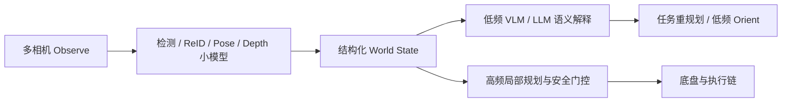

# 进迭时空 K3 芯片信息整合与具身智能适配评估

---

文档版本：v1.0
创建日期：2026-03-21
作者：Codex-架构师

文档变更记录：
- v1.0 | 2026-03-21 | Codex-架构师 | 文档创建。

---

## 1. 文档目的

本文档用于把当前已获取的进迭时空 `K3` 芯片信息收敛成一份可供架构评审直接使用的研究输入，并回答 4 个问题：

1. `K3` 当前已确认的芯片、接口、软件栈和模型支持事实是什么。
2. 它在具身智能机器人主控、端侧多模型并发、端侧大模型推理上的真实优势和短板是什么。
3. 它对 Kinbot 一代的 `Observe -> Orient -> Decide -> Act` 路线分别意味着什么。
4. 它更适合作为一代量产主线、边界验证线，还是前瞻观察线。

说明：

- 本文档优先吸收 [input/00_requirements/00_user_requirements_input.md](../../input/00_requirements/00_user_requirements_input.md) 中 `Step37` 的最新补充，以及用户提供的 `K3_brief_zh.pdf` 与官方页面截图。
- 本文档的结论用于为 [docs/03_p2_feasibility/04_hardware_software_selection_matrix.md](../03_p2_feasibility/04_hardware_software_selection_matrix.md) 和 [docs/03_p2_feasibility/05_cost_structure_and_technology_downpath.md](../03_p2_feasibility/05_cost_structure_and_technology_downpath.md) 提供研究输入，不直接替代主线冻结文档。
- 下文中凡是标注“当前计划”“预计”“后续优化”的内容，都应理解为 `2026-03-21` 时点的阶段性信息，而不是已经量产冻结的承诺。

## 2. 信息来源与可信度分层

当前信息源按可信度和直接性分为 4 层：

1. `原厂直接补充`：见 [input/00_requirements/00_user_requirements_input.md](../../input/00_requirements/00_user_requirements_input.md) 中 `Step37`。
2. `官方 brief`：用户提供的 `K3_brief_zh.pdf`，创建时间 `2026-02-13`。
3. `官方社区 / 开发者文档`：进迭时空论坛、Bianbu 开发者文档、模型示例页。
4. `当前推断层`：基于上面 3 层事实，对 Kinbot 架构与量产约束做的工程推断。

当前使用方式：

- 芯片参数、接口和功耗范围以官方 brief 为主。
- 模型支持、交付时间、功耗口径以 `Step37` 的原厂沟通信息为主。
- 开发文档和示例页用于确认软件栈当前公开状态与公开 benchmark 口径。
- 任何未被原厂和官方资料同时支持的点，都不写成冻结结论。

## 3. 当前已确认的 K3 事实

### 3.1 芯片与接口画像

根据当前官方 brief，`K3` 的核心画像如下：

| 维度 | 当前已确认事实 | 对机器人含义 |
| --- | --- | --- |
| CPU | `8 x X100` 高性能 RISC-V 大核，最大主频 `2.4GHz`，`130 KDMIPS`，完整 `RVA23` | 适合作为整机主控与较重的系统编排计算平台 |
| AI | `8 x A100`，`60 TOPS` 通用 AI 算力，支持 `BF16 / FP16 / FP8 / INT8 / INT4` | 对专用视觉模型、小中型 LLM、轻量 VLM 有现实支撑力 |
| 实时控制 | `2 x RT24` 实时 RISC-V 处理器 | 对底盘控制、传感器桥接、低延迟执行链有明显价值 |
| 内存 | `64-bit LPDDR5-6400`，最大 `32GB`，理论带宽 `51GB/s` | 上限不低，但对 `Dense 4B+ VLM` 和多模型并发仍偏紧 |
| 摄像头接口 | `4 路 MIPI-CSI`，共 `12 lanes`，支持 `12` 路摄像头输入 | 芯片级具备多相机潜力，适合机器人相机接入 |
| 高速接口 | `8 PCIe lanes`、`USB3.0`、`GMAC` | 便于扩展 SSD、协处理器、网口和外设 |
| 低速控制接口 | `10 x CAN-FD`、`30 x PWM`、`9 x I2C`、`17 x UART` | 对底盘、电机、执行器、传感器、调试口很友好 |
| 图形 / 多媒体 | `Vulkan / OpenCL / OpenGLES`，视频编解码、双屏输出 | 对交互屏、视频流处理和图形加速有帮助 |
| 功耗 | 官方 `TDP 15W~25W` | 对机器人主控板来说可接受，但重模型并发仍需单独算 `C5` |

### 3.2 软件栈与模型支持现状

根据 `Step37` 和当前官方公开文档，当前可确认的软件栈状态如下：

| 维度 | 当前状态 | 当前判断 |
| --- | --- | --- |
| LLM 路线 | `llama.cpp` 与 `ollama toolkit` 已有公开文档和社区实践 | 纯文本 LLM 路线当前最成熟 |
| VLM 路线 | 当前计划支持 `FastVLM / Qwen3-VL` | 已进入明确支持列表，但仍处于快速演进阶段 |
| VLM 交付计划 | 原厂口径：`FastVLM-0.5B / 1.5B`、`Qwen3-VL-30B-A3B`、`Qwen3.5` 预计 `2026-04-30` 交付 | 有明确时间点，但需要继续验证是否按期稳定交付 |
| 联合部署 | `onnx` 模式可合并视觉编码器与语言模型；`llama.cpp` 模式需拆分部署 | 这会直接影响工程复杂度、链路时延和资源复用方式 |
| 当前公开 VLM 文档 | 官方文档当前公开示例仍以 `SmolVLM-256M` 为主 | 当前公开生态更偏轻量 VLM，而不是重型多模态主线 |
| 带宽与并发工具 | 原厂明确表示当前带宽统计工具还不完善 | 这是当前最大的验证缺口之一 |

### 3.3 当前已拿到的原厂性能口径

#### 3.3.1 文本大模型性能

用户补充的官方页面截图给出了截至 `2026-03-10` 的 `K3` 文本模型实测表。当前最值得关注的几组数据如下：

| 模型 | 量化 | `TTFT` | `TPS` | `E2E` | 当前解读 |
| --- | --- | --- | --- | --- | --- |
| `Qwen2.5-0.5B-Instruct` | `Q4_0` | `184ms` | `47.8 tok/s` | `2.8s` | 小模型对话能力较从容 |
| `Qwen3-0.6B` | `Q4_K_M` | `250ms` | `36.4 tok/s` | `3.7s` | 轻量模型仍具较好交互余量 |
| `Qwen2.5-3B-Instruct` | `Q4_0` | `806ms` | `11.6 tok/s` | `12.5s` | 已进入明显等待感区间 |
| `Qwen3-4B` | `Q4_K_M` | `1477ms` | `7.4 tok/s` | `18.5s` | `Dense 4B` 纯文本链路已明显偏慢 |
| `Qwen3-30B-A3B` | `Q4_0` | `1495ms` | `10.0 tok/s` | `14.0s` | 稀疏激活模型在 `TPS` 上高于 `Dense 4B`，但 `TTFT` 仍接近 `1.5s` |

补充说明：

- `Step37` 中原厂口头补充的 `Qwen3-4B` 速度约为 `9 tok/s`，与截图中的 `7.4 tok/s` 存在差异。这说明当前数据仍在迭代中，不能把单点值写成冻结结论。
- `Qwen3-4B` 与 `Qwen3-30B-A3B` 的当前原厂功耗口径分别约为 `19.0W` 和 `18.5W`，且“后面 8 核全部跑满”。
- 上述数据均为文本 LLM 口径，不能直接等价为 `VLM` 口径。

#### 3.3.2 视觉与感知模型性能

用户补充的官方页面截图显示，`K3` 上的部分视觉模型当前实测如下：

| 模型 | 输入 | 数据类型 | `4核` 帧率 | 当前解读 |
| --- | --- | --- | --- | --- |
| `resnet50` | `[1,3,224,224]` | `int8` | `108.7 FPS` | 分类类模型较强 |
| `arcface_mobilefacenet` | `[1,3,112,112]` | `int8` | `49 FPS` | 人脸特征抽取可用 |
| `yolov5n-face` | `[1,3,640,640]` | `int8` | `23.0 FPS` | 人脸检测可用但不算宽裕 |
| `yolov8n` | `[1,3,640,640]` | `int8` | `37.9 FPS` | 单路目标检测可用 |
| `yolov8m` | `[1,3,640,640]` | `int8` | `16.8 FPS` | 中模型检测开始偏紧 |
| `yolov8n-pose` | `[1,3,640,640]` | `int8` | `39.8 FPS` | 姿态模型尚可 |
| `yolov8n-seg` | `[1,3,640,640]` | `int8` | `4.7 FPS` | 分割类模型偏慢 |
| `yolo11n` | `[1,3,640,640]` | `int8` | `9.5 FPS` | 当前优化不足较明显 |

`Step37` 对这张表补充了 3 个重要口径：

1. 当前 `YOLO` 等模型的测试结果 `不包含前后处理`。
2. 当前 `8核` 性能大约是 `4核` 的 `1.6` 倍。
3. 当前 `YOLO` 等模型尚未做专门优化，`AI` 计算单元开销 / 利用率大约只有 `resnet50` 的一半左右，后续仍有优化空间。

#### 3.3.3 VLM 编码器口径

当前原厂明确补充了 2 条与 `VLM` 最相关的时间口径：

| 项目 | 当前口径 | 当前含义 |
| --- | --- | --- |
| `qwen3-vl` `768 x 768` 输入的 encoder | 预计优化到 `1.5s` 内 | 对高频 `Orient` 仍偏慢，只更像低频语义解释链 |
| `fastvlm-0.5b` `512 x 512` 输入的 encoder | 预计优化到 `100ms` 内 | 对轻量低频 VLM 路线更有现实价值 |

## 4. K3 在具身智能机器人中的优势

### 4.1 作为机器人主控 SoC 的优势

`K3` 最大的价值，不只是 `60 TOPS`，而是它更像一颗“机器人主控 + AI 加速 + 实时控制”一体化 SoC：

1. `8 x X100 + 2 x RT24` 的组合，使它比纯 AI 盒子芯片更适合承担机器人本体主控职责。
2. `10 x CAN-FD`、`30 x PWM`、多路 `UART / I2C` 对轮式底盘、执行器、麦阵、外设桥接非常友好。
3. 芯片级支持多路摄像头输入，对 `3 到 5` 相机的家庭机器人有现实吸引力。
4. `15W~25W TDP` 与当前 `18W~19W` 的纯文本大模型功耗口径，说明它在“主控板 + 小中模型 + 视觉专用模型”的形态下是有机会收进机器人整机热设计的。
5. 它符合 Kinbot 当前“端侧算力必须采用中国芯片生产商产品”的约束。

### 4.2 对具身智能分层架构的优势

如果具身智能路线采用“共享视觉底座 + 小模型执行 + 经典局部规划 + 稀疏 VLM 解释”的分层结构，`K3` 的契合度是较高的：

在这种架构下，`K3` 的价值主要体现在：

- 高速 IO 和实时核支撑 `Act`
- 小中型专用模型支撑 `Observe`
- 中小型 LLM 或轻量 VLM 支撑低频语义解释
- 通过统一 SoC 降低板级复杂度

## 5. K3 在端侧大模型推理中的主要短板

### 5.1 `Dense 4B+ VLM` 的核心瓶颈是内存带宽与链路时延

`K3` 当前最关键的硬约束不是 `TOPS`，而是：

1. 内存带宽只有 `51GB/s`
2. 最大内存容量为 `32GB`
3. 当前公开的 `Dense 4B` 文本模型已经出现 `TTFT 1.5s`、`TPS` 个位数

这会直接带来两个结果：

- 对 `Dense 4B+ VLM`，视觉编码器、语言解码器、`KV cache`、多图像输入和系统并发会共同争抢带宽。
- 对高频 `Orient` 链路，真正卡住体验的往往不是 `TOPS`，而是 `encoder + TTFT + decode` 的串联时延。

### 5.2 当前公开 VLM 生态仍偏轻量与阶段性

当前公开的官方 `VLM` 页面主要仍以 `SmolVLM-256M` 为例；原厂补充中虽然已经给出 `FastVLM / Qwen3-VL` 计划，但仍有明显阶段性特征：

1. `VLM` 计划支持与正式可交付之间还存在时间差。
2. 当前未拿到完整的 `VLM` 端到端 `TTFT / TPS / E2E` 官方稳定表。
3. 当前带宽统计工具尚不完善，原厂明确表示暂时给不出可持续带宽值。
4. 当前也没有拿到 `ViT / Det / ReID / VLM` 并发时的完整带宽与整板功耗口径。

因此，`K3` 当前并不适合被描述成“重型端侧 VLM 已成熟可量产”的平台。

### 5.3 当前视觉 benchmark 口径不足以直接外推机器人闭环

尽管 `YOLOv8n`、`pose` 等单模型数据看起来不差，但当前口径仍明显不够：

1. 测试结果 `不包含前后处理`。
2. `8核` 数据仍以推算或阶段性实测为主。
3. 当前 `YOLO` 等模型并未专门优化，利用率仍有较大损失。
4. 这些数据没有叠加 `3 到 5` 相机、多模型并发、世界状态更新和局部规划。

因此，这些 benchmark 更适合作为“能力下限”参考，而不能直接替代机器人整机闭环性能。

## 6. 对 Kinbot 一代的直接含义

### 6.1 如果把 K3 用在“机器人主控 + 分层 AI”路线

当前判断：`有现实吸引力，可进入专项验证线`

更具体地说，若 Kinbot 一代采用下面这条路线，`K3` 是有价值的：

- 端侧主控、底盘和实时控制由 `K3` 统一承担
- 视觉主链以检测、姿态、ReID、深度估计等专用模型为主
- `VLM` 只负责低频语义解释、任务重规划、图像问答、陪伴问答
- 高频运动链继续由结构化世界状态和经典 local planner 主导

这时 `K3` 的优势是：

1. 机器人接口和控制能力强
2. 单板集成度高
3. 轻量或中小模型推理具备现实可用性
4. 纯文本 `0.5B ~ 1.5B` 级模型交互性能可接受

### 6.2 如果把 K3 用在“Dense 4B VLM 在线主导 Orient”路线

当前判断：`不适合作为一代默认量产主线`

原因可以直接用 `P1` 模板粗算：

- 若 `Qwen3-4B` 文本口径按截图 `TTFT 1477ms`、`7.4 tok/s`
- 仅生成 `8` 个结构化 token 的模型时延约为 `1.477 + 8 / 7.4 ≈ 2.56s`
- 仅生成 `16` 个结构化 token 的模型时延约为 `1.477 + 16 / 7.4 ≈ 3.64s`

这还没有算：

- 图像 encoder
- 多图像输入
- 世界状态更新
- 安全门控
- 局部规划

如果再把 `qwen3-vl` encoder 当前目标值 `1.5s` 叠加进去，那么总链路已经明显不适合高频 `Orient`。

当前更合理的判断是：

- `FastVLM-0.5B / 1.5B` 这类轻量 VLM 更适合作为 K3 上的现实方向
- `Dense 4B+ VLM` 更适合作为研究验证线，而不是一代量产默认线

### 6.3 对 BOM 与量产的额外影响

即便暂时不把 `K3` 本身判死，若要真正发挥它在重模型上的价值，后续通常会推动更高的 `RAM` 配置。  
这会直接与 [docs/03_p2_feasibility/05_cost_structure_and_technology_downpath.md](../03_p2_feasibility/05_cost_structure_and_technology_downpath.md) 中已经冻结的成本判断相冲突：

1. `16GB+` 内存路线会直接击穿当前 `C1` 成本桶。
2. 更高内存和更重模型也会继续抬升 `C5` 功耗与热设计压力。
3. 因此，`K3` 若用于重本地多模态，不只是“性能够不够”的问题，也是“整机成本线还成不成立”的问题。

## 7. 综合优劣势总结

### 7.1 优势

1. 芯片级接口和实时控制能力明显适合机器人本体主控。
2. 多相机接入能力比纯消费 AI SoC 更适合具身场景。
3. `0.5B ~ 1.5B` 级文本模型和轻量 VLM 有现实落地空间。
4. 单板整合 `CPU + AI + RT`，对机器人整机工程化有吸引力。
5. 国内生态、自主可控与供应链方向符合 Kinbot 当前原则。

### 7.2 短板

1. `51GB/s` 内存带宽对 `Dense 4B+ VLM` 和多模型并发明显偏紧。
2. 当前公开与已确认的 `VLM` 口径仍偏阶段性，尚未证明能支撑高频 `Orient` 主闭环。
3. 当前缺少稳定的并发带宽、整板功耗、热稳态、`3 到 5` 相机场景下的端到端数据。
4. 视觉 benchmark 当前不含前后处理，不能直接外推机器人整机闭环。
5. 若要利用更重模型能力，后续很容易把 `RAM` 和 `C1 / C5` 一起推高。

## 8. 当前结论

把结论压缩成一句话：

`K3 更像一颗适合具身智能机器人主控与轻量多模态分层架构的芯片，而不是一代量产默认配置下适合承载 Dense 4B VLM 在线主导 Orient 的芯片。`

进一步分层：

| 场景 | 当前判断 |
| --- | --- |
| 机器人主控 SoC | `推荐进入专项验证` |
| 小模型 LLM / 轻量 VLM / 低频语义解释 | `有现实价值` |
| 多相机 + 检测 / ReID / Pose / 经典 planner 分层架构 | `较适配` |
| `Dense 4B` VLM 在线高频 `Orient` | `不建议作为一代默认主线` |
| `16GB+` 重本地多模态量产默认配置 | `不建议` |
| 未来 `Pro SKU` 或前瞻验证线 | `可继续跟踪` |

## 9. 后续最值得继续确认的 6 项

1. `FastVLM-0.5B / 1.5B` 与 `Qwen3-VL` 的正式交付版本、稳定性与真实发布时间。
2. `3 / 4 / 5` 图像输入下的 `VLM` 端到端 `TTFT / TPS / E2E`。
3. `Det / ReID / Pose / VLM` 并发时的带宽、整板功耗和热稳态数据。
4. `onnx` 合并部署与 `llama.cpp` 拆分部署在链路时延和工程复杂度上的真实差异。
5. `8GB / 12GB / 16GB+` 内存配置下，K3 平台能支持到什么模型路线。
6. `K3` 在机器人载板、多相机同步、ISP 链路和量产可得性上的正式方案。

## 10. 参考来源

1. [input/00_requirements/00_user_requirements_input.md](../../input/00_requirements/00_user_requirements_input.md) 中 `Step37` 的原厂补充信息。
2. 用户提供的 `K3_brief_zh.pdf`，时间为 `2026-02-13`。
3. [K3 是全球首颗 RVA23 标准的 AI CPU](https://forum.spacemit.com/t/topic/924)
4. [[论文] SpacemiT K3: A RVA23 RISC-V AI CPU with 60 TOPS AI Compute](https://forum.spacemit.com/t/topic/935)
5. [Release Plan for K3 Reference Design and SDK](https://forum.spacemit.com/t/topic/963)
6. [视觉语言模型(VLM) | Bianbu | 进迭时空开发者社区](https://bianbu.spacemit.com/brdk/AI_Feature_Experience/5.1_quickly_start/5.1.7_Vision_Language_Model)
7. [SpacemiT AI Demo 示例库](https://bianbu.spacemit.com/ai/spacemit-demo)
