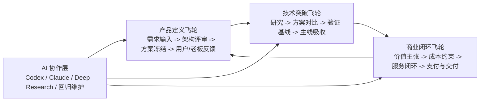
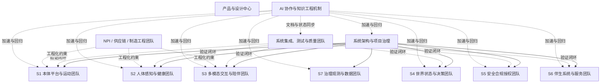

# 开发团队提案

---

文档版本：v1.2
创建日期：2026-03-13
作者：Codex-架构师

文档变更记录：
- v1.2 | 2026-04-01 | Codex-架构师 | 吸收 Step 43 关于团队构建的更新，明确本体 `SE`、具身智能前瞻算法与 `OpenClaw / Agent` 软件三条组织主轴，并重排招聘优先级与到岗节奏原则。
- v1.1 | 2026-03-23 | Codex-架构师 | 基于最新团队与商业判断，将文档从“开发团队提案”升级为“AI-native Team 提案”，明确人机协作操作系统、三条产出飞轮、60-80 人编制目标和新的岗位优先级。

---

## 1. 文档目的

本文档基于当前已冻结的系统架构与总体方案基线，回答一个更关键的问题：

Kinbot 要在 `2026-12-31` 达到量产预备状态，需要一支什么样的 `AI-native Team`。

本文档不讨论单个人员绩效，也不替代招聘 `JD`，而是给出：

1. 推荐的团队总体结构
2. 人与 AI 协作的运行机制
3. 各团队的职责边界
4. 各阶段的人数规模建议
5. 当前最优先需要补齐的关键岗位
6. 当前招聘优先级与到岗节奏原则

## 2. 输入基线

本提案主要承接以下文档：

- [总体架构](../02_p1_architecture/01_overall_architecture.md)
- [PDCP系统架构评审包](../02_p1_architecture/02_pdcp_system_architecture_review_package.md)
- [模块分层与模块边界](../02_p1_architecture/04_module_layers_and_boundaries.md)
- [总体方案与模块方案下发基线](../03_p2_feasibility/01_overall_solution_and_module_design_baseline.md)
- [样机到量产预备能力缺口](../03_p2_feasibility/02_demo_to_mass_production_gaps.md)
- [工程化与NPI准备基线](../03_p2_feasibility/03_engineering_npi_baseline.md)

当前前提：

1. 当前项目处于 `P1 / PDCP` 系统架构评审与总体方案下发阶段
2. 当前团队约 `25 到 30` 人，周期内预计扩展到 `60 到 80` 人
3. 项目不是纯软件产品，而是“机器人本体 + 伴生系统 + 外部生态”的完整产品系统
4. 当前一级运行时模块为 `9` 个，当前总体方案工作包为 `S1-S7`
5. 当前团队判断的生死线，不是某个单点算法领先，而是能否建立一支持续产出产品定义、技术突破和商业闭环的 `AI-native Team`
6. `Step 43` 已进一步明确当前团队构建的三条主轴：本体 `SE`、具身智能原创路线、`OpenClaw / Agent` 软件主链，以及“招聘优先级必须显式拉开”的节奏要求

补充说明：

1. 本文档同时作为 `input/01_candidate_resume/` 下候选人简历评估的组织能力基线。
2. 简历评估应优先判断候选人是否匹配当前最急缺岗位、所在阶段的扩编重点，以及 `S1-S7` 或横向团队的职责边界。
3. 本文档中的“团队规模”默认指人类团队编制，不把 `Codex / Claude` 等 AI 线程视为正式人头，但将其视为必须建设的研发产能层。

## 3. 总体判断

Kinbot 当前真正的生死线，不是“是否再多招几个算法工程师”，而是能否搭出一支持续产出产品定义、技术突破和商业闭环的 `AI-native Team`。

这意味着：

1. Kinbot 需要的不是“一个 AI 团队 + 若干硬件支持”，而是一支矩阵型的软硬一体产品团队。
2. 这支团队不能只靠人的线性产能推进，而必须把 `Codex / Claude / Deep Research / Linear / 决策记录 / 架构评审包` 组织成可复用的研发操作系统。
3. 人的职责要更聚焦在判断、架构、整合、责任承担和商业闭环；AI 的职责要更聚焦在信息压缩、方案发散、文档维护、研究归纳、评审回归和执行加速。
4. 后续项目成败更取决于“人和 AI 是否形成高效协作的产出飞轮”，而不是单一职能团队是否局部强。

推荐组织原则：

1. 主组织按 `S1-S7` 工作包分域，而不是按“算法 / 前端 / 后端 / 硬件”纯职能切分
2. 横向再配置系统架构、项目治理、系统集成测试、质量 / `NPI` 团队
3. `S4` 世界状态与决策、`S5` 安全合规授权、`S6` 伴生系统与服务，这三块必须被视为核心主链，而不是辅助团队
4. `系统集成与测试` 必须前置进入架构和方案阶段，不能只作为后端收尾角色
5. 每个关键团队都应默认采用“人类 owner + AI 协作线程 + 结构化知识库”的工作模式，而不是把 AI 当成末端写作工具

### 3.1 `Step 43` 对团队构建的新增导向

1. 本体团队优先补能对本体成果负责的 `SE`，而不是继续把硬件、结构、电气拆成彼此平行但结果无人兜底的局部岗位。
2. 算法团队要形成“前瞻具身智能路线领跑 + 经典算法路线配合 / 竞争”的双路线格局，但招聘资源与最早到岗窗口优先押在前者。
3. 软件团队不能只按传统 `App / 后台 / 端侧应用` 分工扩编，而要明确建设机器人 `OpenClaw`，用 `AI Agent` 的前沿方法重构系统与应用开发模式。
4. 招聘优先级必须显式拉开，优先级 `1 / 2 / 3 / 4` 不能再挤在一起；对暂未想清楚或偏传统托底的方法型岗位，应按前瞻路线进展滚动复核是否继续招聘。

## 4. AI-native Team 的运行机制

### 4.1 为什么 AI-native Team 是关键

对 Kinbot 这样的产品而言，真正困难的不是单独写出某个模块，而是要持续完成三种高强度产出：

1. 产品定义持续收敛
2. 技术路线持续突破
3. 商业闭环持续验证

如果没有 `AI-native Team`，团队就会在以下三类地方失速：

1. 信息过载：需求、架构、研究、评审、参数、问题单越来越多，团队难以保持同频。
2. 决策漂移：不同线程、不同阶段、不同文档口径失配，导致返工。
3. 产能塌陷：有限的人力被大量非核心劳动吞噬，例如文档维护、版本回归、研究汇总、对比分析、状态同步。

因此，一代真正要建立的，不只是“团队”，而是“团队 + AI 协作层 + 结构化知识库 + 项目管理层”的复合系统。

### 4.2 三条产出飞轮

当前团队真正要做成的，不是某一个飞轮，而是让三条飞轮互相带动：

1. 产品定义不能脱离技术现实和成本现实。
2. 技术突破不能脱离产品价值和商业闭环。
3. 商业判断不能脱离系统架构和交付边界。

### 4.3 人与 AI 的职责分工

| 层次 | 人类团队负责什么 | AI 协作层负责什么 |
| --- | --- | --- |
| 产品与架构判断 | 价值判断、取舍、冻结、承担责任 | 汇总输入、生成提案、对比替代方案、回归检查 |
| 技术路线推进 | 定义实验、裁决主线、承担工程结果 | 研究综述、技术趋势归纳、参数对比、文档回写 |
| 工程实现与集成 | 做系统实现、联调、测试、工程化 | 生成草案、辅助编码、测试脚本、问题归类、版本维护 |
| 商业闭环与交付 | 定义服务模式、交付边界、渠道和运营策略 | 归纳试点反馈、汇总成本/问题、生成管理材料 |

基本原则：

1. AI 不替代 owner。
2. AI 不承担冻结责任。
3. AI 必须进入主流程，而不是只在末端补文档。
4. 每个关键主线都应允许多线程并行研究，但必须通过治理文档和 `Linear` 收口。

## 5. 推荐团队结构

### 5.1 一级团队视图

### 5.2 团队与建议编制

| 团队 | 建议人数 | 核心职责 |
| --- | --- | --- |
| 产品与设计中心 | `5-6` | PRD、场景设计、交互策略、工业设计、UI/UX、服务设计 |
| 系统架构与项目治理 | `5-6` | 系统架构、接口治理、技术路线裁决、TPM、PMO、配置管理 |
| `S1` 本体平台与运动团队 | `10-12` | 端侧平台、BSP、底盘控制、导航运动、本体 `SE` 牵引下的整机电气、热与结构协同 |
| `S2` 人体感知与健康团队 | `5-6` | 人体检测、姿态 / 跌倒、生命体征接入、健康候选事件 |
| `S3` 多模态交互与陪伴团队 | `6-8` | ASR/TTS、对话、主动交互、人设、长期记忆入口、`Agent` 运行时入口 |
| `S4` 世界状态与决策团队 | `6-8` | World State、任务编排、状态机、行为树、OODA 调度、`VLN` 高层接口、具身智能前瞻路线接口 |
| `S5` 安全合规授权团队 | `4-5` | 安全门、权限、隐私、审计、故障保护、审批策略 |
| `S6` 伴生系统与服务团队 | `6-8` | 家属 App、云服务、后台坐席、第三方服务接入 |
| `S7` 治理观测与数据团队 | `3-4` | 日志、指标、追踪、数据治理、评测、MLOps |
| 系统集成、测试与质量团队 | `7-9` | `SIL / HIL`、端云联调、`E2E`、可靠性、试点质量闭环 |
| `NPI / 供应链 / 制造工程团队` | `4-6` | `DFM / DFT`、试产导入、工装、供应链、`SQE`、制造问题闭环 |

总建议规模：`61 到 78` 人。

说明：

1. 这是当前 `2026-12-31` 量产预备目标下，更符合现实约束的人类团队编制。
2. 该规模默认建立在“AI 协作层已进入主流程”的前提下。
3. 如果团队坚持传统研发方式，则同样目标下的人力需求会显著上升。

## 6. 为什么不是按纯职能切分

如果按“算法组 / 后端组 / 前端组 / 硬件组 / 测试组”切，会有三个问题：

1. `S4 / S5 / S6` 这种跨端、跨模块、跨场景的核心责任会被切碎
2. 机器人本体与伴生系统之间的责任链会断，导致“本体能做、服务接不住”
3. 系统集成问题会被不断后移，直到 `Alpha / EVT` 才集中爆发

Kinbot 更适合用“域团队 + 横向治理”的结构：

1. 域团队对用户价值闭环负责
2. 横向团队对架构、接口、验证和量产约束负责
3. 两者共同形成矩阵

## 7. 各团队职责边界

### 7.1 产品与设计中心

负责：

- 目标用户、场景、能力范围、体验目标
- 交互文案、人设、表情与服务流程
- 工业设计和高端产品感校验

不负责：

- 直接定义技术实现方案
- 绕过架构直接冻结系统接口

### 7.2 系统架构与项目治理

负责：

- 系统架构、接口 owner、阻断项管理
- `PDCP` 评审与方案冻结
- 跨团队计划、依赖、风险和配置管理

不负责：

- 替代域团队做全部详细设计

### 7.3 `S1` 到 `S7` 域团队

统一要求：

1. 每个域团队对自己的能力闭环负责
2. 每个域团队必须提交“模块架构 + 接口草案 + 验证方案”
3. 每个域团队都要显式回应本域对应的本体实体域约束

### 7.4 系统集成、测试与质量团队

负责：

- 端侧、本体、云侧、App、服务链路的联调验证
- 关键场景回归、误报 / 漏报统计、稳定性门槛
- 试点期质量闭环和问题归因

不负责：

- 只做末端功能验收

### 7.5 `NPI / 供应链 / 制造工程团队`

负责：

- 工程化方案、试产导入、制造约束
- 供应商协同、工装夹具、测试工位、量产问题闭环

不负责：

- 等到发布前才介入

### 7.6 AI 协作与知识工程机制

这不是一个独立“大 AI 部门”，而是一套横向运行机制。

负责：

- 维护 `需求输入 -> 决策记录 -> 架构文档 -> 方案文档 -> Linear` 的结构化知识链
- 管理 `Codex / Claude / Deep Research` 多线程协作方式
- 做文档一致性回归、索引维护、替代方案比较、评审准备
- 为各团队建立标准化的 AI 协作接口、模板和产出物要求

不负责：

- 替代各域团队做最终技术判断
- 脱离主线治理单独产生“影子架构”

## 8. 分阶段扩编建议

### 8.1 当前 `PDCP` 阶段

建议规模：`28-35` 人

重点补齐：

1. 本体 `SE` / 底盘与整机系统专家
2. 具身智能算法大类骨干（`VLN / 强化学习 / 视觉 / 世界模型`）
3. `OpenClaw / Agent` 软件骨干
4. 系统集成测试负责人
5. 系统软件-传感器方向骨干
6. 运动控制与电机控制骨干

### 8.2 `P2` 技术收敛与工程化阶段

建议规模：`45-55` 人

重点补齐：

1. `SoC` 主板与端侧平台
2. `Linux` 应用与机器人端侧框架
3. 数据治理与观测
4. 测试自动化与端云联调
5. `NPI / 制造工程` 早期骨干
6. 经典算法路线补位岗位

### 8.3 `P3-P5` 到量产预备

建议规模：`60-80` 人

重点补齐：

1. 质量与可靠性
2. 试点运营与服务交付
3. 供应链与制造工程
4. 系统集成与回归团队
5. 各域团队的第二梯队 owner

## 9. 关键岗位优先级与招聘节奏

当前组织建设不应再把所有岗位压成“都重要”。按 `Step 43`，应显式分成四档：

`优先级 1`：

1. 本体 `SE` / 底盘与整机系统专家
2. 具身智能算法大类骨干
3. `OpenClaw / Agent` 开发骨干
4. 系统集成测试负责人
5. 系统软件-传感器方向骨干

`优先级 2`：

1. `SoC` 主板与端侧平台骨干
2. `Linux` 应用与机器人端侧框架骨干
3. 高级嵌入式运动控制骨干
4. 高级电机控制软件骨干

`优先级 3`：

1. `3D` 视觉感知骨干
2. `MCU` 开发骨干
3. 电机控制算法骨干

`优先级 4`：

1. 运动规划岗位
2. 行为规划岗位
3. Android App 岗位
4. 其他暂未想清楚或偏传统托底的方法型岗位

节奏原则：

1. 优先级 `1` 需要最早到岗窗口和最高招聘关注度。
2. 优先级 `2` 是主链支撑位，应紧随其后补齐，但不与优先级 `1` 抢 `HC` 和招聘资源。
3. 优先级 `3 / 4` 以补位、配合和竞争验证为主，应根据具身智能与 `Agent` 新方法进展滚动复核是否继续招聘、是否延后入职。
4. 经典路线不是被取消，而是从“默认主攻”调整为“与前瞻路线并行竞争、以产品技术竞争力为唯一归宿”。

## 10. 单团队最小配置建议

对 `S1-S7` 任一域团队，建议最小配置至少包含：

1. 域负责人
2. 域架构师 / 技术 owner
3. 核心开发工程师
4. 测试 / 验证 owner
5. 项目接口人

说明：

- 小团队阶段允许一人兼任多个角色
- 但责任面必须清楚，不能只有开发没有验证 owner

## 11. 风险与组织陷阱

### 11.1 最危险的三种组织方式

1. 只有“大模型算法团队”强，伴生系统和测试弱
2. 本体硬件和 App/云分属两套割裂组织
3. `S5` 安全合规授权挂靠在其他功能团队里，被当作附属能力

### 11.2 当前最应避免的组织误区

1. 误把 Kinbot 当作单机产品，而不是“机器人本体 + 服务系统”
2. 误把系统测试当作项目后段补位角色
3. 误把 `VLN / VLM` 能力领先等同于整机交付能力领先
4. 误把 AI 当作文档助手，而不是研发操作系统的一部分
5. 误把增加人头等同于增加产能，而不去建设结构化知识链和 AI 协作机制
6. 误把所有岗位都压成同一招聘优先级，导致真正的组织押注顺序被稀释

## 12. 提案结论

如果只用一句话总结：

Kinbot 需要的不是一支传统意义上的“开发团队”，而是一支“按用户闭环和系统责任组织起来、并且能让人与 AI 持续协同产出产品定义、技术突破和商业闭环的 AI-native Team”。

对当前阶段最重要的动作是：

1. 先把本体 `SE`、具身智能前瞻算法、`OpenClaw / Agent` 软件、系统集成测试这四条主轴拉起来
2. 再按 `S1-S7` 补齐传感器链路、运动控制、`SoC / Linux` 平台和数据治理等主链支撑位
3. 对经典算法和伴生端岗位保持竞争位与补位位，不再按同一优先级平铺扩招
4. 用结构化知识库和项目管理，把多线程 `AI` 产能真正接入主流程，而不是停留在外围辅助层
