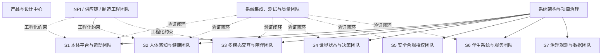

# 开发团队提案

---

文档版本：v1.0
创建日期：2026-03-13
作者：Codex-架构师

---

## 1. 文档目的

本文档基于当前已冻结的系统架构与总体方案基线，回答一个具体问题：

Kinbot 要在 `2026-12-31` 达到量产预备状态，需要一支什么样的开发团队。

本文档不讨论单个人员绩效，也不替代招聘 JD，而是给出：

1. 推荐的团队总体结构
2. 各团队的职责边界
3. 各阶段的人数规模建议
4. 当前最优先需要补齐的关键岗位

## 2. 输入基线

本提案主要承接以下文档：

- [总体架构](../02_p1_architecture/01_overall_architecture.md)
- [PDCP系统架构评审包](../02_p1_architecture/02_pdcp_system_architecture_review_package.md)
- [模块分层与模块边界](../02_p1_architecture/04_module_layers_and_boundaries.md)
- [总体方案与模块方案下发基线](../03_p2_feasibility/01_overall_solution_and_module_design_baseline.md)
- [样机到量产预备能力缺口](../03_p2_feasibility/02_demo_to_mass_production_gaps.md)
- [工程化与NPI准备基线](../03_p2_feasibility/03_engineering_npi_baseline.md)

当前前提：

1. 当前项目处于 `P1 / PDCP` 系统架构评审与总体方案下发阶段
2. 当前团队约 `25 到 30` 人，周期内预计扩展到 `100` 人以上
3. 项目不是纯软件产品，而是“机器人本体 + 伴生系统 + 外部生态”的完整产品系统
4. 当前一级运行时模块为 `9` 个，当前总体方案工作包为 `S1-S7`

## 3. 总体判断

Kinbot 需要的不是“一个 AI 团队 + 若干硬件支持”，而是一支矩阵型的软硬一体产品团队。

推荐组织原则：

1. 主组织按 `S1-S7` 工作包分域，而不是按“算法 / 前端 / 后端 / 硬件”纯职能切分
2. 横向再配置系统架构、项目治理、系统集成测试、质量 / NPI 团队
3. `S4` 世界状态与决策、`S5` 安全合规授权、`S6` 伴生系统与服务，这三块必须被视为核心主链，而不是辅助团队
4. `系统集成与测试` 必须前置进入架构和方案阶段，不能只作为后端收尾角色

## 4. 推荐团队结构

### 4.1 一级团队视图

### 4.2 团队与建议编制

| 团队 | 建议人数 | 核心职责 |
| --- | --- | --- |
| 产品与设计中心 | `8-10` | PRD、场景设计、交互策略、工业设计、UI/UX、服务设计 |
| 系统架构与项目治理 | `6-8` | 系统架构、接口治理、技术路线裁决、TPM、PMO、配置管理 |
| `S1` 本体平台与运动团队 | `15-18` | 端侧平台、BSP、底盘控制、导航运动、整机电气、热与结构协同 |
| `S2` 人体感知与健康团队 | `10-12` | 人体检测、姿态 / 跌倒、生命体征接入、健康候选事件 |
| `S3` 多模态交互与陪伴团队 | `10-12` | ASR/TTS、对话、主动交互、人设、长期记忆入口 |
| `S4` 世界状态与决策团队 | `10-12` | World State、任务编排、状态机、行为树、OODA 调度、VLN 高层接口 |
| `S5` 安全合规授权团队 | `6-8` | 安全门、权限、隐私、审计、故障保护、审批策略 |
| `S6` 伴生系统与服务团队 | `12-15` | 家属 App、云服务、后台坐席、第三方服务接入 |
| `S7` 治理观测与数据团队 | `6-8` | 日志、指标、追踪、数据治理、评测、MLOps |
| 系统集成、测试与质量团队 | `12-15` | SIL/HIL、端云联调、E2E、可靠性、试点质量闭环 |
| `NPI / 供应链 / 制造工程团队` | `8-10` | DFM/DFT、试产导入、工装、供应链、SQE、制造问题闭环 |

总建议规模：`95 到 115` 人。

## 5. 为什么不是按纯职能切分

如果按“算法组 / 后端组 / 前端组 / 硬件组 / 测试组”切，会有三个问题：

1. `S4 / S5 / S6` 这种跨端、跨模块、跨场景的核心责任会被切碎
2. 机器人本体与伴生系统之间的责任链会断，导致“本体能做、服务接不住”
3. 系统集成问题会被不断后移，直到 `Alpha / EVT` 才集中爆发

Kinbot 更适合用“域团队 + 横向治理”的结构：

1. 域团队对用户价值闭环负责
2. 横向团队对架构、接口、验证和量产约束负责
3. 两者共同形成矩阵

## 6. 各团队职责边界

### 6.1 产品与设计中心

负责：

- 目标用户、场景、能力范围、体验目标
- 交互文案、人设、表情与服务流程
- 工业设计和高端产品感校验

不负责：

- 直接定义技术实现方案
- 绕过架构直接冻结系统接口

### 6.2 系统架构与项目治理

负责：

- 系统架构、接口 owner、阻断项管理
- `PDCP` 评审与方案冻结
- 跨团队计划、依赖、风险和配置管理

不负责：

- 替代域团队做全部详细设计

### 6.3 `S1` 到 `S7` 域团队

统一要求：

1. 每个域团队对自己的能力闭环负责
2. 每个域团队必须提交“模块架构 + 接口草案 + 验证方案”
3. 每个域团队都要显式回应本域对应的本体实体域约束

### 6.4 系统集成、测试与质量团队

负责：

- 端侧、本体、云侧、App、服务链路的联调验证
- 关键场景回归、误报 / 漏报统计、稳定性门槛
- 试点期质量闭环和问题归因

不负责：

- 只做末端功能验收

### 6.5 `NPI / 供应链 / 制造工程团队`

负责：

- 工程化方案、试产导入、制造约束
- 供应商协同、工装夹具、测试工位、量产问题闭环

不负责：

- 等到发布前才介入

## 7. 分阶段扩编建议

### 7.1 当前 `PDCP` 阶段

建议规模：`28-35` 人

重点补齐：

1. 系统架构 / TPM
2. `S4` 世界状态与决策负责人
3. `S5` 安全合规负责人
4. `S6` 伴生系统负责人
5. 系统集成测试负责人

### 7.2 `P2` 技术收敛与工程化阶段

建议规模：`55-70` 人

重点补齐：

1. 端侧平台与底盘工程
2. App / 云 / 后台运营链路
3. 数据治理与观测
4. 测试自动化与端云联调
5. `NPI / 制造工程` 早期骨干

### 7.3 `P3-P5` 到量产预备

建议规模：`95-115` 人

重点补齐：

1. 质量与可靠性
2. 试点运营与服务交付
3. 供应链与制造工程
4. 系统集成与回归团队
5. 各域团队的第二梯队 owner

## 8. 关键岗位优先级

当前最急缺的不是更多泛模型算法工程师，而是以下岗位：

1. 系统集成测试负责人
2. `S5` 安全合规授权负责人
3. `S6` 伴生系统与服务负责人
4. `S4` 世界状态与决策负责人
5. `NPI / 制造工程负责人`
6. 整机电气 / 热设计负责人
7. 云服务与运营平台架构负责人

## 9. 单团队最小配置建议

对 `S1-S7` 任一域团队，建议最小配置至少包含：

1. 域负责人
2. 域架构师 / 技术 owner
3. 核心开发工程师
4. 测试 / 验证 owner
5. 项目接口人

说明：

- 小团队阶段允许一人兼任多个角色
- 但责任面必须清楚，不能只有开发没有验证 owner

## 10. 风险与组织陷阱

### 10.1 最危险的三种组织方式

1. 只有“大模型算法团队”强，伴生系统和测试弱
2. 本体硬件和 App/云分属两套割裂组织
3. `S5` 安全合规授权挂靠在其他功能团队里，被当作附属能力

### 10.2 当前最应避免的组织误区

1. 误把 Kinbot 当作单机产品，而不是“机器人本体 + 服务系统”
2. 误把系统测试当作项目后段补位角色
3. 误把 `VLN / VLM` 能力领先等同于整机交付能力领先

## 11. 提案结论

如果只用一句话总结：

Kinbot 需要的是一支“按用户闭环和系统责任组织起来的软硬一体矩阵团队”，而不是一支“以算法为中心、其他角色围着算法打补丁”的团队。

对当前阶段最重要的动作是：

1. 先把 `S4 / S5 / S6 / 集成测试 / NPI` 这五类 owner 补齐
2. 再按 `S1-S7` 组织域团队扩编
3. 让系统架构、总体方案、集成验证和工程化约束同时前置
