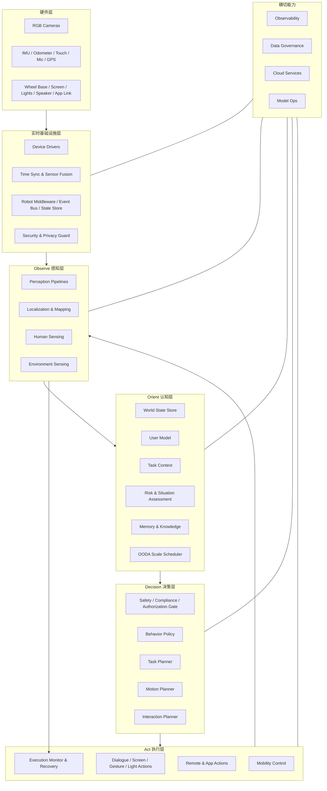

# Kinbot_OODA 总体架构

## 1. 架构目标

本机器人面向家庭室内场景，围绕以下三类核心任务构建：

- 多模态交互陪伴
- 健康管理
- 安全保障

系统边界明确为“移动 + 交互”，不包含机械臂或其他复杂物理操作。整体架构继续以 OODA（Observe, Orient, Decide, Act）为主线，但在 AGI 与具身智能时代，Kinbot 已将 `多尺度、并发、可中断、可动态调度` 的 OODA 冻结为正式方法论基线，而不是继续沿用固定单轮串行 OODA。工程上采用“分层闭环 + 分时决策 + 安全前置 + 动态调度”的方案：

- 反射闭环负责毫秒到百毫秒级的安全和运动，不依赖云端
- 执行闭环负责秒级局部理解、到人确认和动作监督
- 任务闭环负责秒到分钟级的任务推进和异常升级
- 关系与服务闭环作为一代正式架构层，负责小时到天级的长期记忆、习惯学习和服务编排
- `OODA Scale Scheduler` 作为一级架构能力，负责选择当前主导子环并触发切换
- 所有动作在执行前都必须经过安全、合规、授权三道门

详细说明见 [docs/OODA_MULTI_SCALE_ARCHITECTURE.md](docs/OODA_MULTI_SCALE_ARCHITECTURE.md)。

## 2. 总体设计原则

### 2.1 安全优先级固定

决策优先级遵循：

`安全 > 合规 > 用户指令 > 任务完成率 > 效率 > 能耗`

这意味着：

- 运动避障、跌落防护、碰撞预防永远不能被对话任务打断
- 用户命令不能绕过安全规则或伦理约束
- 云端能力失效时，机器人必须退化到安全可用状态

### 2.2 端云协同，但端侧自洽

端侧必须独立完成：

- 传感器接入
- 定位与导航
- 基础环境识别
- 人员识别与授权校验
- 语音识别与基础交互
- 实时避障和运动控制

云端主要负责：

- 联网知识查询
- 通用大模型推理增强
- 非实时任务编排
- 长周期模型更新和运营配置

### 2.3 家庭环境是“稳定但可漂移”的场景

系统必须支持三个阶段：

1. 初次熟悉家庭环境
2. 日常稳定运行
3. 家具大幅变化或装修后的重新熟悉

因此地图、世界状态和用户偏好都不能设计成一次性静态配置，而要支持版本化更新和漂移检测。

## 3. 系统分层



## 4. OODA 四层架构

## 4.1 Observe：感知与事实采集

Observe 的职责不是“把传感器数据都上传”，而是把原始世界输入变成可信、可融合、可审计的事实流。

### 输入源

- 视觉：1~5 路 RGB 相机
- 运动：IMU、轮速计
- 声音：麦克风
- 接触：触觉传感器
- 位置：GPS（家庭室内价值有限，但可用于室外扩展和初始化辅助）

### 核心模块

- 设备驱动与时间同步
- 多传感器融合
- 人体/人脸/身份识别
- 姿态、位置、情绪、意图识别
- 环境语义识别：房间、家具、障碍物、危险区域
- 语音采集、唤醒、ASR
- 本地隐私处理：匿名化、脱敏、加密存储

### Observe 输出

Observe 输出的不是“图像帧”，而是结构化事件和状态，例如：

- `person_detected`
- `authorized_user_nearby`
- `user_emotion_changed`
- `obstacle_in_path`
- `floor_threshold_ahead`
- `voice_command_received`
- `possible_fall_risk`

这些结构化事件会进入世界状态和决策层，而原始视觉/语音默认不出端侧。

## 4.2 Orient：环境理解、情境建模、认知评价与尺度调度

Orient 是整个系统最关键的一层。Observe 只回答“看到了什么”，Orient 要回答“这意味着什么”。

术语说明：

- `World State`：当前用于运行时决策、执行和审计的统一结构化状态
- `World Model`：如后续引入，专指用于预测、模拟或想象未来环境和任务动态的模型

当前文档中的认知中枢统一使用 `World State` 这个术语；`World Model` 不再作为它的同义词使用。

### 核心职责

- 对 `Observe` 输出的事实流进行认知和评价
- 维护家庭地图与定位状态
- 建立世界状态，统一表示“人、物、空间、风险、任务、权限”
- 识别当前上下文：谁在和机器人交互、身处哪个房间、正在执行什么任务
- 维护用户画像与偏好
- 评估场景风险、授权状态和任务可行性
- 运行 `OODA Scale Scheduler`，决定当前主导子环和切换条件
- 结合短期记忆与长期记忆，形成决策所需的状态快照

### 关键能力与数据模型

#### 1. World State

统一表达以下实体及关系：

- 空间：房间、门槛、走廊、充电点、风险区域
- 人：身份、权限、位置、健康状态、情绪、交互历史
- 物：家具、常见障碍物、可通行区域、动态障碍物
- 任务：当前任务、任务阶段、前置条件、失败原因
- 风险：碰撞风险、跌落风险、隐私风险、合规风险

#### 2. User Model

记录与用户相关的长期状态：

- 家庭成员身份与权限
- 对话偏好、作息偏好、提醒偏好
- 健康关注点和异常阈值
- 授权历史与信任边界

#### 3. Context Model

组织当前时刻的环境语义：

- 时间上下文：白天/夜晚、工作日/休息日
- 场景上下文：陪伴、提醒、巡逻、回充、待机
- 社交上下文：单人互动、多用户在场、访客在场
- 网络上下文：在线、弱网、离线

#### 4. OODA Scale Scheduler

作为 `Orient` 层内的一项一级能力，负责根据当前状态选择主导子环。

当前建议的核心输入收敛为：

- 风险等级
- 新颖性
- 置信度
- 任务时限
- 资源状态
- 人类上下文

### 家庭环境生命周期

Orient 层必须支持家庭环境的生命周期管理：

1. 熟悉期：通过探索、建图和标注建立初始地图
2. 稳定期：在既有地图上做增量更新
3. 漂移检测：发现家具大幅移动、空间布局变化
4. 重建期：触发局部重建或全局重建

## 4.3 Decide：分层决策与策略编排

Decision 层不应是单一“大模型做所有决定”，而是一个有边界的分层决策系统。

### 决策流水线

1. 尺度与主导子环判定
2. 安全门控
3. 合规门控
4. 授权门控
5. 任务级策略选择
6. 动作级规划
7. 执行前校验

### 核心模块

#### 1. Safety / Compliance / Authorization Gate

任何动作提议都先过三道门：

- 是否存在人身或财产风险
- 是否违反本地规则、伦理约束或监管要求
- 当前用户是否拥有该动作授权

这是整个系统的最高优先级模块，应独立于大模型推理链运行。

#### 2. Behavior Policy

负责在不同目标之间做仲裁，例如：

- 当前应该继续陪伴、响应指令、执行巡逻还是回充
- 当前是否应该打断陪伴任务去处理安全事件
- 当前是否应该请求用户确认

这一层适合采用“规则 + 学习策略 + 状态机”的混合方案，但必须消费 `OODA Scale Scheduler` 的输出，且不能覆盖 `R1` 的抢占权。

#### 3. Task Planner

把高层目标拆成步骤，例如：

- “去客厅陪伴用户”
- “识别用户状态并开启对话”
- “检测到异常时切换为健康/安全处理流程”

适合结合 LLM 进行语义任务分解，但必须由结构化计划器约束输出。

#### 4. Motion Planner

把导航目标变成局部路径和速度控制约束，必须完全端侧运行。

#### 5. Interaction Planner

决定用什么方式交互：

- 是否用语音回复
- 是否在屏幕显示卡片
- 是否用灯光表达状态
- 是否切到 App 或远程控制链路

### 决策机制建议

按时间与空间尺度，当前默认拆成四层，并允许运行时动态切换主导层：

- `反射层`：毫秒到百毫秒级，机体周边空间，负责避障、急停、触碰保护、低矮门槛通过
- `执行层`：0.5 秒到数秒，房间内局部空间，负责局部导航、会话轮次管理、到人确认和执行监督
- `任务层`：数秒到数分钟，全屋语义空间，负责找人、送药、回充仲裁和异常升级
- `关系与服务层`：小时到天级，家庭长期运行空间，负责习惯学习、长期记忆、提醒优化和服务编排

这样可以避免“等大模型想完再刹车”的错误架构，也避免把所有 OODA 问题都误压成同一尺度。

## 4.4 Act：移动与交互执行

Act 层把已批准的决策变成可观测、可回滚、可恢复的动作。

### 移动执行

- 底盘控制
- 路径跟踪
- 局部避障
- 门槛通过策略
- 自动回充

### 交互执行

- TTS 语音输出
- 屏幕 UI 卡片和状态页
- 灯光与表情反馈
- 手势识别响应
- App 通知、远程控制会话

### 执行监管

Act 必须自带执行监督器：

- 动作是否真正开始
- 动作是否卡住或失败
- 失败后是否降级
- 是否需要重规划或向用户解释

因此 Act 不是简单的驱动层，而是“执行 + 反馈 + 恢复”一体化层。

## 5. 横切架构能力

## 5.1 安全架构

安全能力必须横跨 OODA 全链路：

- 感知层：危险识别、跌落/碰撞/接触风险检测
- 认知层：场景风险评分
- 决策层：安全门控和强制中断
- 执行层：急停、限速、受限区域绕行

建议把安全控制链设计成独立优先级通道，不能和普通任务共用同一推理阻塞点。

## 5.2 隐私与数据治理

依据需求，视觉、语音、生物特征数据必须本地处理。总体原则：

- 原始数据默认不上传
- 只上传必要的匿名化语义结果
- 身份和生物信息加密存储
- 数据访问必须有审计日志
- 用户可以查看、授权、撤回和删除个人数据

## 5.3 端云协同

端云协同建议按以下方式切分：

### 端侧

- 导航
- 实时避障
- 身份识别与授权校验
- 基础对话与离线回复
- 健康和安全事件检测

### 云侧

- 联网问答
- 通用知识调用
- 外部服务接入，例如天气、购物、问诊平台
- 长期偏好分析
- 模型迭代与配置下发

### 降级原则

- 断网时，安全和运动能力不降级
- 断网时，可用端侧能力继续提供有限交互
- 必须联网的请求，应解释原因并给出替代方案

## 5.4 可观测性

为了后续调试和量产，系统需要完整可观测性：

- 传感器健康状态
- 建图和定位质量
- 任务成功率
- 交互响应延迟
- 误触发和漏触发统计
- 安全事件与恢复链路

## 6. 数据流与运行闭环

## 6.1 主数据流

```text
Sensors
  -> Sensor Fusion / Perception
  -> World State Update
  -> Risk + Context Assessment
  -> OODA Scale Scheduler
  -> Policy / Planning
  -> Motion / Interaction Execution
  -> Execution Feedback
  -> World State Update
```

这构成主 OODA 闭环。

补充说明：

- 对 Kinbot 来说，“一轮 OODA”不再是唯一固定节拍，而是与当前风险、空间范围和任务时限绑定。
- 当前运行时应由尺度调度器决定哪个 OODA 子环处于主导地位。

## 6.2 四类 OODA 子环

### 1. `R1` 反射环

`传感器 -> 风险检测 -> 急停/限速/避障 -> 执行反馈`

特点：

- 高频
- 纯端侧
- 不依赖 LLM

### 2. `R2` 执行环

`局部目标 -> 执行监督 -> 局部重规划 / 交互反馈 -> 结果检查`

特点：

- 秒级
- 面向到人确认、局部导航、对话轮次和仓门执行

### 3. `R3` 任务环

`用户目标/系统目标 -> 任务规划 -> 执行 -> 结果检查 -> 重规划 / 升级`

特点：

- 中频
- 面向找人、送药、异常升级和回充仲裁

### 4. `R4` 关系与服务环

`长期观察 -> 习惯建模 / 记忆治理 / 服务编排 -> 策略更新 -> 运行反馈`

特点：

- 低频但长周期
- 直接决定产品长期生命力、依从性和服务复利

## 7. 推荐的软件实现形态

总体上建议采用“实时机器人中间件 + 结构化状态存储 + 模型服务编排”的实现方式。

这里的“机器人中间件”是能力类别，不预先绑定某个具体实现；`ROS 2` 可以是候选方案之一，但不应在这一阶段被视为唯一解。

### 推荐逻辑分区

- `runtime`：设备驱动、消息总线、时间同步
- `observe`：感知算法、传感器融合、ASR、身份识别
- `orient`：地图、世界状态、用户模型、记忆系统、尺度调度器
- `decision`：安全门、合规门、授权系统、任务规划器、策略引擎
- `act`：导航执行器、交互执行器、恢复机制
- `cloud`：外部服务代理、知识增强、配置中心
- `ops`：日志、监控、审计、模型版本管理

### 状态存储建议

至少维护三类状态：

- 实时状态：位置、电量、速度、当前障碍、网络状态
- 会话状态：当前用户、当前意图、当前任务、当前交互轮次
- 长期状态：地图、用户画像、授权、偏好、健康基线

### 稳定接口面建议

为了支持后续进化，应该优先把稳定部分定义为接口，而不是把具体算法实现固化进系统边界。建议优先稳定以下接口：

- `Sensor Adapter Interface`：统一封装相机、麦克风、IMU、轮速计、触觉等输入
- 世界状态结构：统一表达空间、人、物、任务、风险和权限
- `Task / Action Contract`：统一表达目标、约束、前置条件、执行结果和失败原因
- `Safety / Authorization API`：统一表达动作审批、拒绝原因和降级建议
- `Cloud Capability API`：统一表达哪些能力可联网调用，哪些必须端侧执行
- `User Data Governance Contract`：统一表达隐私级别、存储策略、访问审计和删除权限

这些接口应比感知算法、规划算法、模型版本和供应商选择更稳定。

## 8. 架构结论

这套机器人不应被设计为“一个大模型 + 若干硬件接口”的扁平系统，而应被设计为：

- 以 OODA 为主循环
- 以 `R1` 到 `R4` 四类 OODA 子环和 `OODA Scale Scheduler` 组织运行时
- 以世界状态为认知中枢
- 以安全/合规/授权门控为最高优先级
- 以端侧实时闭环保证运动安全
- 以端云协同扩展知识和服务能力

简化表达就是：

`Observe 负责把世界变成事实，Orient 负责对事实做认知评价并选择尺度，Decide 负责把情境变成受约束的策略，Act 负责把策略变成可验证的动作。`

## 9. 下一步建议

在总体架构之后，建议按以下顺序继续细化：

1. 模块分层与模块边界
2. 世界状态与核心数据结构
3. 决策状态机
4. 端云职责拆分
5. MVP 技术选型
