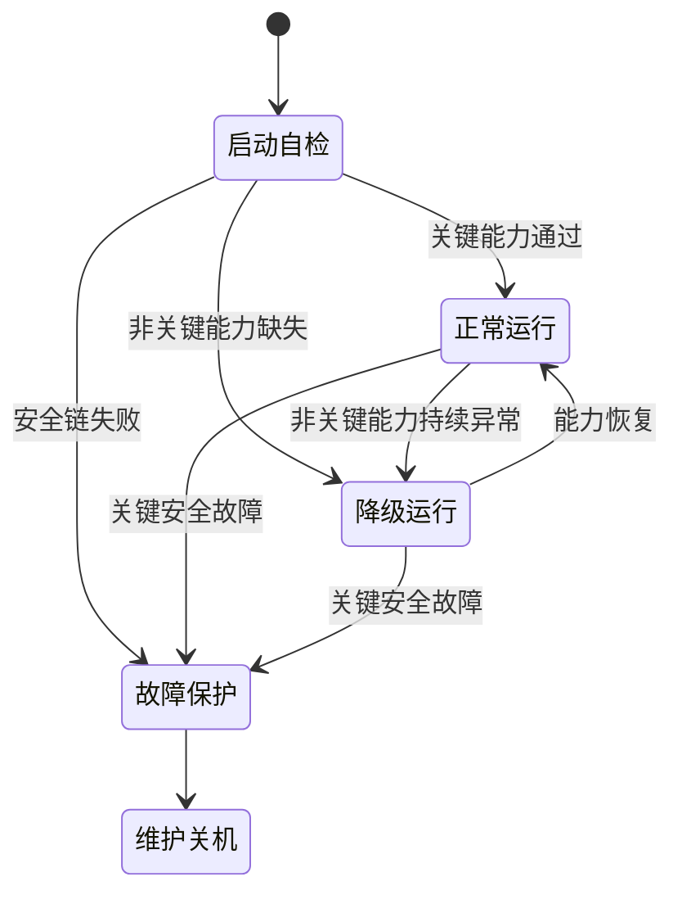
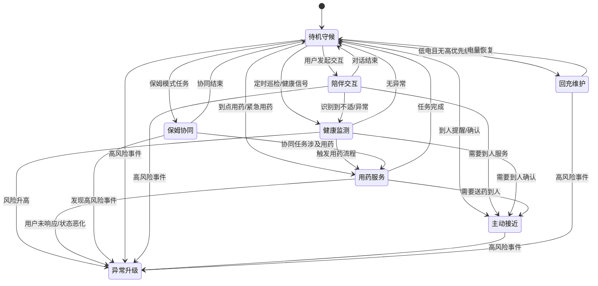

# Kinbot_OODA 决策状态机

## 1. 文档目的

本文档定义一代机器人的顶层运行状态、业务主状态、约束子状态，以及它们之间的关键跳转规则。

目标不是把所有实现细节写死，而是先固定三件事：

1. 机器人在运行时到底处于哪些“可管理、可审计”的状态
2. 什么事件会触发状态切换
3. 哪些动作可以自动执行，哪些动作必须经过确认或人工介入

## 2. 当前设计前提

本版本基于以下已确认条件：

- 首发场景是中国大陆居家养老
- 首版主价值排序为“健康管理 > 陪伴交互 > 老人看护 > 家庭安全巡护”
- 项目主节点是 2026 年 12 月 31 日达到量产预备状态，2027 年 1 月为 MVP 验证窗口
- 已授权行为需要做到完全自主
- 夜间默认静默，但传感器保持开启
- 一期紧急用药动作边界为提醒取药、送药到人、提醒服药并确认、联系子女
- 高风险异常默认先联动家属，并为 120 路线保留接口
- 一期需要后台人工服务能力，可参考在线问诊模式
- 机器人直接入网打电话只做架构预留，不进入一期预研
- 储物仓按紧凑、通用、灵活空间设计，递送能力依赖机器人运动

## 3. 状态机设计原则

1. 采用分层状态机，而不是单层枚举状态。
2. 所有高风险动作都要先经过 `安全 / 合规 / 授权` 门。
3. 任何业务状态都不能绕过实时运动安全链。
4. 健康异常、低电、故障和人工接管都是跨状态中断源。
5. 状态机只描述“机器人当前在做什么”，不替代世界状态和任务数据结构。
6. 网络相关能力可以降级，但运动安全、基础交互和本地健康看护链不能因为断网失效。

## 4. 顶层状态

建议顶层先固定为 5 个状态：

1. `启动自检`
2. `正常运行`
3. `降级运行`
4. `故障保护`
5. `维护 / 关机`

说明：

- `正常运行` 内部再展开业务主状态。
- `降级运行` 不是故障停机，而是保留核心能力、关闭部分非核心能力。
- `故障保护` 表示继续运行已经不安全，必须停止运动或进入受控保护。

## 5. 业务主状态

在 `正常运行` 或 `降级运行` 内，建议维护以下业务主状态：

1. `待机守候`
2. `陪伴交互`
3. `主动接近`
4. `健康监测`
5. `用药服务`
6. `保姆协同`
7. `异常升级`
8. `回充维护`

这 8 个状态覆盖了一代产品的主要业务闭环。

## 6. 约束子状态

以下子状态会覆盖在业务主状态之上：

1. `夜间静默`
2. `离线约束`
3. `人工服务协同`
4. `权限冲突待确认`

说明：

- `夜间静默` 限制主动播报、主动靠近和非必要打断，但不关闭感知。
- `离线约束` 限制云端问诊、购药、联网知识与外部平台调用。
- `人工服务协同` 表示机器人正在等待或连接后台人工服务。
- `权限冲突待确认` 表示老人本人和子女等高权限角色出现冲突命令。

## 7. 状态说明

### 7.1 `启动自检`

目标：

- 校验运动安全链、关键传感器、存储、网络、音视频、充电与储物仓状态

进入条件：

- 开机、重启、异常恢复

退出条件：

- 关键能力全部通过，进入 `正常运行`
- 非关键能力缺失，进入 `降级运行`
- 关键安全链失败，进入 `故障保护`

### 7.2 `待机守候`

目标：

- 保持低扰动待命，持续感知环境和用户

允许动作：

- 被动响应唤醒
- 低频健康巡检
- 监听日程、用药、异常候选事件
- 在授权条件满足时发起低侵入提醒

禁止动作：

- 未批准的主动上报
- 未批准的外部服务调用

### 7.3 `陪伴交互`

目标：

- 处理日常对话、提醒、陪伴和信息查询

进入条件：

- 用户主动发起语音或屏幕交互
- 低风险提醒任务需要自然语言表达

退出条件：

- 对话结束，回到 `待机守候`
- 需要到人提醒，进入 `主动接近`
- 识别到健康风险，进入 `健康监测` 或 `异常升级`

### 7.4 `主动接近`

目标：

- 在已批准前提下，移动到用户附近完成提醒、观察、确认或递送

进入条件：

- 用药到点
- 健康监测需要到人确认
- 家属 / 保姆 / 老人本人发起到人任务

退出条件：

- 到达目标人附近，回到对应业务状态
- 路径失败，进入恢复分支或 `异常升级`
- 电量不足但不紧急，转 `回充维护`

### 7.5 `健康监测`

目标：

- 汇总穿戴设备、BLE 外设、视觉、语音和历史档案，形成健康风险判断

进入条件：

- 定时巡检
- 穿戴设备异常
- BLE 设备读数异常
- 用户自述不适
- 家属或保姆请求检查

退出条件：

- 无高风险，返回 `待机守候` 或 `陪伴交互`
- 需要到人确认，进入 `主动接近`
- 需要人工服务，叠加 `人工服务协同`
- 风险升级，进入 `异常升级`

补充约束：

- 一期不能把任意品牌手表的持续实时心率当作稳定前提。
- 当穿戴数据新鲜度不足时，应优先触发问诊式补采、BLE 外设补采或人工服务，而不是直接做高风险自动判断。

### 7.6 `用药服务`

目标：

- 完成提醒、找人、递送、服药确认、记录与通知

典型子步骤：

1. 检查药品、对象人、时间窗、禁忌和授权
2. 需要到人时进入 `主动接近`
3. 完成提醒或递送
4. 获取确认结果
5. 写入记录并按需要通知家属

禁止动作：

- 未经批准的更强自主医疗处置
- 未经授权的外部购药或自动下单

### 7.7 `保姆协同`

目标：

- 在保姆模式下配合完成提醒、叫人、拿药、记录、汇报和远程确认

说明：

- 该状态不意味着机器人服从保姆的全部命令。
- 保姆只能在其授权范围内触发任务。
- 涉及老人本人和子女高权限冲突时，必须进入 `权限冲突待确认`。

### 7.8 `异常升级`

目标：

- 处理跌倒、生命体征异常、长时间静止、疑似危险环境等高风险事件

典型动作：

- 本地二次确认
- 主动接近用户
- 语音确认与环境复核
- 通知家属
- 请求后台人工服务
- 预留社区 / 物业 / 120 升级接口

补充说明：

- 后台人工服务的首线角色按客服运营坐席设计，其他外部角色通过其转接进入。

退出条件：

- 误报解除，回到 `待机守候`
- 风险处置完成，回到 `健康监测` 或 `待机守候`
- 需要人工持续介入，保持 `人工服务协同`

### 7.9 `回充维护`

目标：

- 在不影响紧急看护链的前提下自动回充、补能和维护

进入条件：

- 低电量
- 夜间空闲窗口
- 无更高优先级任务

退出条件：

- 电量恢复后回到 `待机守候`
- 中途出现高优先级事件则立即中断

## 8. 顶层跳转图

## 9. 业务主状态跳转图

## 10. 关键中断源

以下事件可从任意业务状态触发中断：

1. `高风险异常`
说明：直接进入 `异常升级`。

2. `关键安全故障`
说明：直接进入 `故障保护`。

3. `低电量`
说明：无高优先级任务时进入 `回充维护`；有高优先级任务时延后。

4. `权限冲突`
说明：叠加 `权限冲突待确认` 子状态，冻结冲突动作。

5. `网络离线`
说明：叠加 `离线约束` 子状态，关闭云端相关动作。

6. `后台人工服务接入`
说明：叠加 `人工服务协同` 子状态。

## 11. 自动执行与必须确认的边界

建议先固定以下边界：

### 可自动执行

- 已授权的主动接近
- 已授权的提醒、播报、对话
- 已授权的送药到人
- 已授权的家属提醒
- 本地二次确认和环境复核
- 低电自动回充

### 必须确认

- 老人本人与子女冲突命令
- 新的高风险外部联动
- 未在授权策略中的购药、问诊和社区 / 物业通知
- 任何超出“提醒 / 递送 / 确认 / 告知”边界的医疗处置

### 当前只做架构预留

- 机器人直接入网拨号
- 120 自动联动闭环
- UWB 心率监测进入首版量产 BOM

## 12. 与其他模块的接口要求

状态机继续向下拆时，至少依赖以下接口：

1. `world_state_memory`
需要提供 `DecisionContextSnapshot`、当前任务、授权状态、健康基线和人工服务状态。

2. `safety_compliance_authorization`
需要对“主动接近、递送、上报、购药、问诊转接、人工服务接入”给出批准、拒绝、降级或待确认结果。

3. `mobility_navigation`
需要提供到人导航、回充、路径失败和受阻原因。

4. `cloud_service_gateway`
需要提供问诊转接、第三方服务结果、人工服务接入状态和失败原因。

5. `app_family_care`
需要提供家属确认、授权变更、计划任务和升级反馈。

## 13. 量产预备视角下的要求

由于项目目标不是单纯原型验证，而是 2026-12-31 达到量产预备状态，因此状态机设计还必须满足：

1. 状态枚举稳定，不能每次试验临时加隐式模式。
2. 每次状态切换都有可审计事件和原因码。
3. 每个高风险状态都有可回放的链路记录。
4. 允许不同算法版本替换，但不轻易改动状态和动作契约。
5. 支持后续把后台人工服务、社区服务和第三方平台做成可插拔外部能力。

## 14. 下一步建议

基于本文件，建议下一份文档继续写：

1. 安全 / 合规 / 授权接口
2. 健康事件管线与升级链路
3. 量产预备验证计划
