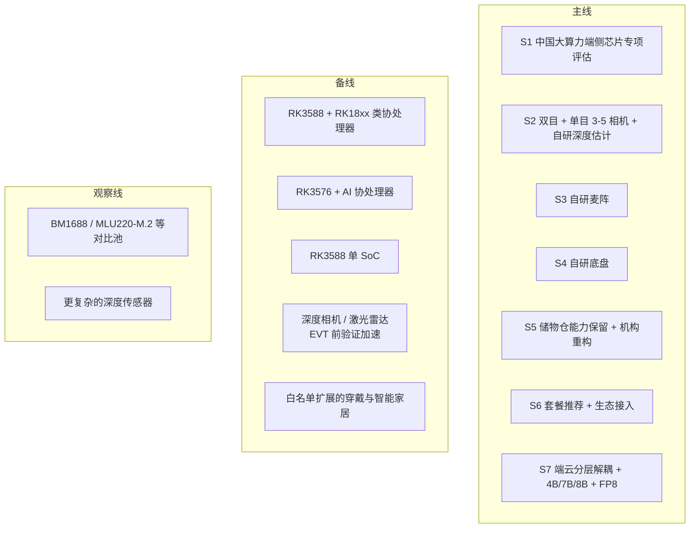

# Kinbot_OODA 软硬件选型矩阵

## 1. 文档目的

本文档用于回答 `KBT-11` 的核心问题：

在既定产品目标、成本约束和架构基线下，Kinbot 一代的软硬件路线应该如何收敛，哪些路线适合作为量产主线，哪些路线更适合作为 Alpha / EVT 验证加速路线，哪些路线只保留为前瞻观察。

## 2. 当前选型约束

本轮选型基于以下已确认约束：

1. 项目目标是在 `2026-12-31` 达到量产预备状态。
2. 整机物料成本目标为 `6000 到 8000 元人民币`。
3. 目标系统是机器人整机，穿戴、智能家居、App、云服务和后台运营属于伴生系统。
4. 原始视觉、语音和生物特征数据必须以端侧本地处理为原则。
5. 端侧算力必须采用中国芯片生产商的产品，可采用通用 SoC 主控加 AI 协处理器的组合路线。
6. 底盘倾向自研，麦克风阵列自研，穿戴外设不自研，相机优先供应商方案。
7. 量产主线视觉路线已收敛为双目 + 单目组合，数量 `3 到 5` 个，并采用自研深度估计模型。
8. 深度相机和激光雷达可用于早期验证加速，但在 `EVT` 之后应退出一代量产主线。
9. 当前样机已有粗放 Demo，但需要从验证平台收敛为量产平台。
10. `KBT-24` 已确认 `E4 伴生系统与服务运营基线` 优先，但伴生系统不能反向锁死本体硬件。
11. 更重的端侧多模态模型需要进入主线评估，当前参数量按 `4B / 7B / 8B` 三档考虑，并评估 `FP8` 量化与内存带宽约束。
12. 当前不能过早把端侧算力主线收敛到 `RK3588 + RK18xx 类协处理器` 或 `RK3576 + AI 协处理器` 双路线，必须优先寻找中国大算力端侧芯片方案。

## 3. 当前选型原则

当前建议按 7 条原则收敛一代选型：

1. 优先服务量产，不为单次 Demo 继续堆配置。
2. 伴生系统优先冻结接口，不反向决定本体器件。
3. 对高风险器件保留 `A/B` 路线，避免被单点供应卡死。
4. 优先保留团队已有强项：底盘、麦阵、多模态交互、端侧算法。
5. 相机路线优先选择双目 + 单目这类简单、可量产、可校准的组合方案。
6. 量产主线与验证加速路线可以并存，但必须在 `G2` 前收敛。
7. 对会显著影响 `VLN / VLM` 端侧落地的大算力芯片路线，现阶段不能因为工程保守而过早排除出主线。

## 3.1 成本分配硬约束

整机物料成本上限已经明确为 `6000 到 8000 元人民币`，因此一代硬件选型不能只讨论算力上限，还必须同时讨论成本分配。

当前建议先按 7 个成本桶约束路线讨论：

| 成本桶 | 建议区间 | 说明 |
| --- | --- | --- |
| `C1 端侧算力与存储` | `800 到 1400` | 主控、AI 芯片、内存、存储、基础连接器件 |
| `C2 相机与基础传感` | `500 到 800` | 双目、单目、IMU、轮速等基础感知 |
| `C3 音频与交互器件` | `500 到 800` | 麦阵、扬声器、屏幕、灯光与交互外围 |
| `C4 底盘与运动系统` | `1200 到 1700` | 电机、驱动、轮组、充电对接与核心运动部件 |
| `C5 电池、电源与热设计` | `500 到 700` | 电池包、电源板、散热与供电保护 |
| `C6 储物仓、结构与外观件` | `900 到 1400` | 储物仓机构、结构件、外观件与装配空间成本 |
| `C7 制造、测试与校准余量` | `600 到 900` | 产测、校准、治具摊销与装配余量 |

说明：

- 上表是当前架构师成本分配提案，不是已经冻结的采购报价。
- 任何大算力主线如果持续挤压 `C1` 到超出区间，都必须同时说明从哪几个成本桶回收预算，而不是只强调芯片能力。

## 4. 七个选型域与当前判断

| 选型域 | 当前候选路线 | 当前判断 | 主要理由 | 当前风险 |
| --- | --- | --- | --- | --- |
| `S1 端侧算力平台` | `征程6` 系列、`Atlas 200I A2`、`BM1688 / MLU220-M.2`、`RK3588 + RK18xx 类协处理器`、`RK3576 + AI 协处理器`、`RK3588` 单 SoC | 当前正式主线不是某一颗具体 SoC，而是“中国大算力端侧芯片专项评估”；`RK` 组合路线与 `RK3588` 单 SoC 作为工程与成本备线并行保留 | 既响应 `VLN / VLM` 对端侧算力和内存带宽的压力，也避免在 `G2` 前过早锁死到工程保守路线 | 若专项主线长期无法满足 `C1` 成本桶、功耗和热设计约束，就会拖慢一代定型 |
| `S2 相机与深度路线` | 双目 + 单目 `RGB` 组合、自研深度估计；深度相机；激光雷达 | 量产主线优先双目 + 单目组合 `3 到 5` 个相机，自研深度估计；深度相机和激光雷达仅作为 EVT 前验证加速路线 | 符合你对简单相机配置、成本和体积的要求，也避免深度相机 / 雷达长期占据量产 BOM | 纯 `RGB` 路线对算法、标定和低光场景鲁棒性要求更高 |
| `S3 音频交互路线` | 自研麦克风阵列 + 端侧语音栈 | 维持自研主线，不做外采主路线 | 团队有明显既有能力，且这是产品体验核心资产 | 需要尽早冻结阵列结构、回声路径和整机声学布局 |
| `S4 底盘与运动执行路线` | 自研轮式底盘，传感器精简，自主运动控制 | 维持自研主线 | 机器人是目标系统，底盘体验直接决定一代可信度 | 若底盘接口与 `R1/R2` 运行栈不稳定，后续所有体验都受损 |
| `S5 储物仓、屏幕与整机结构路线` | 保留储物仓能力、重构传动机构；保留屏幕；整机外观形态重构 | 作为一代既定工程动作推进 | 这条链直接影响紧急给药、日常递送和整机感知价值 | 机构、重量、外观与装配空间容易互相牵制 |
| `S6 穿戴与家庭设备生态路线` | 手表 / 手环、蓝牙血压计、蓝牙血糖仪、智能家居设备 | 继续按“套餐推荐 + 生态接入”推进 | 这是首发健康场景的必要输入，不适合自研硬件扩张 | 协议碎片化、数据质量和接入一致性风险高 |
| `S7 软件栈与部署路线` | 端云协同、关键原始数据端侧处理、云侧承接知识与服务编排、端侧 `4B / 7B / 8B` 多模态模型、`FP8` 量化 | 继续按分层解耦路线推进，但重模型不再只放观察线，而是进入主线评估 | 一代是否具备更强端侧认知能力，会反向影响 `R3 / R4`、`VLN` 和多模态交互体验上限 | 若只强调模型能力而不同时管控带宽、热和 `BOM`，会直接破坏量产目标 |

### 4.1 当前路线分层图

说明：

- 这张图表达的是一代选型的路线分层，不代表最终器件清单已经冻结。
- 只要某条算力路线无法在 `C1` 成本桶内收敛，或无法说明如何从其他成本桶回收预算，就不能直接进入一代量产定型。

## 5. 端侧算力平台矩阵

### 5.1 候选路线

| 路线 | 当前定位 | 优势 | 风险 | 当前建议 |
| --- | --- | --- | --- | --- |
| `征程6` 系列 | 中国大算力专项主线候选 | 官方公开口径覆盖较宽算力区间，便于覆盖从轻量到更重端侧模型的探索空间 | 需要继续核实实际可获得板卡、内存带宽、功耗和一代 `BOM` 匹配度 | 进入一代中国大算力专项主线评估 |
| `Atlas 200I A2` | 中国大算力专项主线候选 | 官方资料显示具备较明确的 AI 推理能力与板卡形态，适合做专项评估对比 | 需要继续核实整机功耗、工具链适配和量产交付节奏 | 进入一代中国大算力专项主线评估 |
| `BM1688 / MLU220-M.2` | 中国芯对比池 | 可补足国产端侧 AI 路线的横向比较，避免只看一两家方案 | 板级落地、工具链、交期和长期供货成熟度仍需专项核实 | 保留在专项对比池，按资料完整度决定是否升入主线 |
| `RK3588 + RK18xx 类协处理器` | 工程备线 | 工程资料和集成路径相对更容易起步，适合作为高算力专项不收敛时的工程兜底 | 端侧更重模型的余量、带宽和调度复杂度仍可能成为瓶颈 | 作为工程备线保留，不再默认视为一代主线 |
| `RK3576 + AI 协处理器` | 成本备线 | 更容易压低成本和功耗，适合作为 `6000 到 8000` 元量产压力下的备选路径 | 复杂场景下的算力与余量更紧，对 `VLN / VLM` 不够从容 | 作为成本备线保留 |
| `RK3588` 单 SoC | 简化备线 | 板级复杂度较低，便于对比“单板简化”与“主控 + 协处理器”的真实收益 | 面对更重模型和多相机吞吐时，空间可能偏紧 | 作为简化备线保留 |

### 5.2 当前推荐口径

当前建议：

1. 一代端侧算力当前不冻结到某一颗具体 SoC，而是先冻结“`中国大算力端侧芯片专项评估 + RK 工程/成本备线`”的路线结构。
2. 中国大算力专项主线至少应覆盖 `征程6` 系列与 `Atlas 200I A2` 这类候选，并保留 `BM1688 / MLU220-M.2` 等对比池。
3. `RK3588 + RK18xx 类协处理器`、`RK3576 + AI 协处理器` 和 `RK3588` 单 SoC 不再被写成默认主线，而是分别承担工程备线、成本备线和简化备线。
4. 只要高算力专项路线持续把 `C1 端侧算力与存储` 压到 `1400 元` 以上，就必须同步给出其他成本桶的回收方案；若无法回收，则该路线不得直接成为一代量产定型。
5. 端侧更重模型不再只停留在观察线，而要以 `4B / 7B / 8B + FP8` 的方式进入真实板级评估。

当前推断：

- 一代当前最合理的推进方式，不是立即选定某颗芯片，而是先用成本桶约束住大算力专项评估，防止“只看模型上限，不看整机 `BOM`”。
- 如果高算力专项路线能在 `C1` 成本桶、整机功耗和热设计内跑通，它更有机会支撑 `VLN / VLM` 与多尺度 `OODA` 的长期生命力。
- 如果高算力专项路线在 `G2` 前仍不能收敛，则应按工程与成本备线回落，而不是把整机目标继续拖在半空。

## 6. 感知与交互器件路线矩阵

### 6.1 相机与深度

当前建议：

1. 量产主线优先双目 + 单目组合，数量控制在 `3 到 5` 个。
2. 深度能力优先通过自研估计模型和几何融合补齐。
3. `EVT` 前允许引入深度相机和激光雷达缩短验证周期，但 `EVT` 后默认退出一代量产主线。

### 6.2 麦克风阵列

当前建议：

1. 继续保持自研麦阵主线。
2. 尽快把阵列形态、波束策略、AEC 链路和整机声学设计纳入同一张工程表。
3. 不把语音体验问题推给云侧兜底。

### 6.3 穿戴与家庭设备

当前建议：

1. 继续按“推荐套餐 + 标准协议接入”推进。
2. 穿戴与家庭设备只通过稳定接口约束本体，不反向决定机器人主控路线。
3. 先保“高价值、低接入成本”的设备类型，再扩生态。

## 7. 当前推荐的主线 / 备线 / 观察线

### 7.1 主线

1. 端侧算力：中国大算力端侧芯片专项评估，优先覆盖 `征程6` 系列与 `Atlas 200I A2`
2. 相机：双目 + 单目组合主线
3. 音频：自研麦阵主线
4. 底盘：自研轮式底盘主线
5. 储物仓：能力保留、机构重构主线
6. 模型：端侧 `4B / 7B / 8B` 多模态模型与 `FP8` 量化进入主线评估

### 7.2 备线

1. `RK3588 + RK18xx 类协处理器` 作为工程备线
2. `RK3576 + AI 协处理器` 作为成本备线
3. `RK3588` 单 SoC 作为简化备线
4. 深度相机与激光雷达作为 EVT 前验证加速备线
5. 智能家居与穿戴按白名单扩展备线

### 7.3 观察线

1. `BM1688 / MLU220-M.2` 等资料仍待补齐的中国芯对比池
2. 更复杂的深度传感器路线

## 8. `G2` 前必须完成的验证

为避免选型文档只停留在纸面，当前建议在 `G2` 前至少完成 7 项验证：

1. 中国大算力专项候选与 `RK` 备线的功耗、热设计、内存带宽和模型迁移对比
2. 端侧 `4B / 7B / 8B` 模型在真实板级上的吞吐、延迟、占用和 `FP8` 可行性验证
3. 双目 + 单目 `RGB` 主线在关键家庭场景下的深度与障碍感知验证
4. 自研麦阵在整机结构内的远场识别与回声验证
5. 自研底盘与 `R1 / R2` 执行栈的接口稳定性验证
6. 储物仓机构重构后的重量、可靠性和防夹手验证
7. `BOM`、供应、交期与 7 个成本桶的第一版对比表

## 9. 本轮联网核实的官方输入

本轮已优先参考官方资料，用于确认路线是否继续具备现实基础：

1. `Horizon Robotics Journey 6` 官方产品页
2. `Huawei Atlas 200I A2` 官方产品页
3. `Sophgo BM1688` 官方资料页
4. `Cambricon MLU220-M.2` 开发者资料页
5. `Rockchip RK3588 / RK3576 / RK1808` 官方产品页
6. `Intel RealSense D455 / D457` 官方产品页，用于确认深度相机路线继续只保留在 EVT 前验证加速位

说明：

- 上述资料只用于判断路线是否继续有效，不等于当前就完成了最终器件定型。
- 最终定型仍需要在 `G2` 前补齐价格、交期、板级获取、热设计、`BOM` 和实测验证。
- 中国大算力专项路线后续还需要继续联网核实官方资料、板卡可得性和交付成熟度。

## 10. 当前待你审核的 5 点

1. 是否接受当前把端侧算力主线改成“中国大算力端侧芯片专项评估”，而不是继续提前收敛到 `RK` 双路线。
2. 是否接受把 `RK3588 + RK18xx 类协处理器`、`RK3576 + AI 协处理器` 和 `RK3588` 单 SoC 下调为工程 / 成本 / 简化备线。
3. 是否接受把端侧 `4B / 7B / 8B` 多模态模型与 `FP8` 量化正式拉入主线评估。
4. 是否接受把双目 + 单目 `3 到 5` 个相机 + 自研深度估计继续作为量产主线，并维持深度相机 / 激光雷达只用于 EVT 前验证加速。
5. 是否接受当前的 7 个成本桶提案，并把 `C1 端侧算力与存储` 控制在 `800 到 1400 元` 作为一代量产定型的硬约束。
