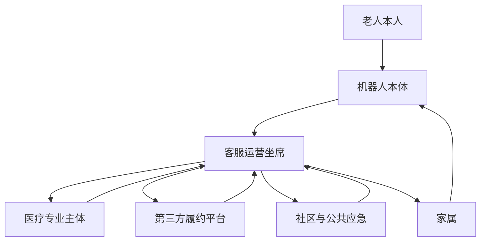
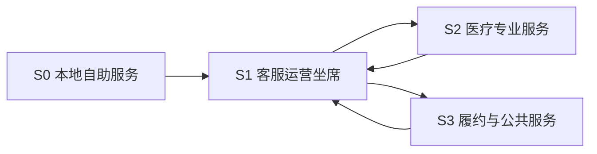

# Kinbot_OODA 后台人工服务与在线问诊协同边界

## 1. 文档目的

本文档用于冻结一代产品中，机器人本体、家属、后台人工服务、在线问诊与第三方履约之间的协同边界。

当前重点不是把完整服务运营体系全部展开，而是先回答 5 件会直接影响架构冻结的问题：

1. 首版人工服务体系由哪些角色构成
2. 哪些场景允许从机器人本地服务升级到人工或在线问诊
3. 家属、机器人、客服运营坐席、医生平台和第三方平台之间分别承担什么责任
4. 接入链路、响应时效、录音录像、隐私和授权边界如何定义
5. 这些服务链如何与 `World State`、状态机、审批接口和健康事件管线对齐

## 2. 当前设计前提

本版本基于以下已确认条件：

- 首发场景为中国大陆居家养老
- 一代主价值排序为“健康管理 > 陪伴交互 > 老人看护 > 家庭安全巡护”
- 一代健康能力已包含问诊与医疗联动、用药管理和买药
- 后台人工服务是首版闭环的一部分，不是可选外挂
- 后台人工服务首线角色为公司客服运营坐席
- 用户不会操作、机器人无法理解需求或用户处于紧急状态时，允许人工服务介入
- 客服运营坐席目标响应时效不超过 `3 分钟`
- 互联网医院、买药和配送以平台接入为主
- 第三方平台由机器人体系引入，因此必须采用白名单审核
- 机器人负责准确传递结构化信息，第三方平台负责其自身专业判断与履约结果
- 原始视觉、语音和生物特征数据以端侧本地处理、匿名化、加密存储为原则

## 3. 为什么 `KBT-13` 需要独立冻结

如果只冻结“App、云和坐席最小闭环”，但不继续把人工服务与在线问诊边界单独冻结，会直接留下 6 个架构空洞：

1. 无法明确客服、医生、护士等主体分别拥有哪一类决策权
2. 无法定义从本地问诊升级到专业服务的触发条件
3. 无法判断哪些上下文可以分享给人工或第三方平台
4. 无法把录音、录屏、授权和审计规则写进统一接口
5. 无法把第三方专业责任与机器人产品责任切开
6. 无法为 `KBT-10` 储药递送、`KBT-15` 穿戴接入和后续量产验证提供稳定前提

因此，`KBT-13` 是“核心状态与接口冻结”里的独立前置项，而不是运营细节。

## 4. 一级协同架构

一代建议把人工服务与在线问诊协同面，收敛为 7 个一级协作主体：

说明：

- `机器人本体` 先承担本地理解、确认、补采和风险提议，不直接把所有问题推给人工。
- `客服运营坐席` 是人工首线，负责接入、澄清、分诊、转接和审计补录。
- `医疗专业主体` 当前作为二线专业能力，包括医生、护士 / 健康管理支持等。
- `第三方履约平台` 主要承接互联网医院、药店、配送等外部服务。
- `社区与公共应急` 作为预留升级目标，承接社区、物业、120 等路线。

## 5. 服务接力分层

一代建议把协同链冻结为 4 层，而不是让所有主体直接并联到机器人：

分层定义：

| 层级   | 主体                         | 主要职责                    | 不应承担             |
| ---- | -------------------------- | ----------------------- | ---------------- |
| `S0` | 机器人本体 + 家属 App             | 本地问答、确认、补采、家属通知、低风险远程确认 | 医疗专业结论、第三方履约承诺   |
| `S1` | 客服运营坐席                     | 接入、分诊、澄清、转接、审计补录、服务协同   | 医疗诊断、处方判断        |
| `S2` | 医生 / 护士 / 健康管理支持           | 专业问诊、指导补采、医学建议、随访支持     | 绕过平台直接控制机器人高风险动作 |
| `S3` | 互联网医院 / 药店 / 配送 / 社区 / 120 | 开方、药事、配送、应急联动           | 替代机器人本地确认与权限判断   |

## 6. 角色边界

### 6.1 机器人本体

机器人本体在人工服务链中允许承担 6 类动作：

1. 生成结构化事件与会话上下文
2. 发起语音澄清、本地问诊和补采
3. 发起家属通知或远程确认
4. 请求人工服务接入
5. 在授权与安全门控通过后执行低风险本体动作
6. 对所有升级链路写审计记录

机器人本体不承担：

1. 医疗专业诊断
2. 处方与药事专业责任
3. 第三方履约责任
4. 未经授权的持续远程监听或远程直播

### 6.2 家属

家属允许承担 5 类动作：

1. 接收异常事件与服务通知
2. 发起远程联络或协助确认
3. 在授权范围内查看用户摘要
4. 对高风险链路提供远程确认
5. 作为第一优先升级对象参与协同

家属不应承担：

1. 绕过安全门控直接驱动高风险本体动作
2. 未经授权查看高敏感内容
3. 直接代替医疗专业主体给出医学结论

### 6.3 客服运营坐席

客服运营坐席作为一线人工服务，建议固定 7 类职责：

1. 服务接入
2. 用户意图澄清
3. 机器人失败兜底
4. 家属协同
5. 问诊与履约分诊
6. 异常升级转接
7. 审计补录与服务质检

客服运营坐席不应承担：

1. 独立作出医疗专业判断
2. 修改超出授权范围的高风险策略
3. 长期替代家庭照护职责

### 6.4 医疗专业主体

当前建议把 `S2` 医疗专业主体拆成 3 类子角色：

| 子角色         | 允许承担                     | 不应承担        |
| ----------- | ------------------------ | ----------- |
| 医生          | 在线问诊、医学建议、是否需要进一步就医的专业判断 | 直接远控机器人危险动作 |
| 护士 / 健康管理支持 | 补采指导、流程解释、随访支持、测量指导      | 诊断和处方决策     |
| 药事相关主体      | 用药说明、药事履约上下文补充           | 替代医生做诊断     |

说明：

- 这 3 类子角色在一代不一定由我们自建，更多通过平台接入。
- 当前架构冻结的是角色边界，不是组织架构和合作模式。

### 6.5 第三方履约平台

第三方平台允许承担：

1. 互联网医院问诊与开方
2. 药店与配送履约
3. 已审核内容服务或其他生态服务

第三方平台不应承担：

1. 替代机器人进行本地确认
2. 绕过产品授权直接调用高风险动作
3. 把自身责任回推给机器人本体

责任切分建议冻结为：

1. 机器人负责结构化信息准确传递、授权校验、动作审计
2. 平台负责专业判断、履约过程和结果责任
3. 云服务负责会话编排、白名单网关和审计留痕

### 6.6 社区与公共应急

社区、物业和 `120` 在一代只做预留接入对象，不作为首线主体。

当前建议：

1. 家属优先级高于社区与公共应急
2. `120` 路线继续预留在手机 App / 手机能力侧
3. 机器人直接入网拨号不进入当前冻结范围

## 7. 触发场景与接入方式

一代建议优先冻结 7 类触发场景：

| 场景             | 首选责任主体 | 是否允许转坐席 | 是否允许转医生 / 护士 | 默认接入方式        |
| -------------- | ------ | ------- | ------------ | ------------- |
| 用户不会操作         | 机器人本体  | 允许      | 默认不需要        | 机器人发起人工接入     |
| 机器人无法理解需求      | 客服运营坐席 | 允许      | 视内容而定        | 机器人或 App 发起   |
| 本地问诊不足以形成结论    | 客服运营坐席 | 必须      | 允许           | 坐席分诊到医疗专业主体   |
| 高风险异常且家属未响应    | 客服运营坐席 | 必须      | 视风险而定        | 机器人先通知家属，再转坐席 |
| 用药 / 买药 / 履约协同 | 客服运营坐席 | 允许      | 允许           | 坐席或云网关转第三方平台  |
| 投诉 / 售后 / 授权争议 | 客服运营坐席 | 必须      | 不需要          | App 或坐席入口     |
| 公共应急升级         | 客服运营坐席 | 必须      | 可并行          | 坐席按规则升级到外部    |

## 8. 响应时效与媒体策略

当前建议把时效和媒体策略冻结成如下表述：

| 链路        | 当前状态          | 建议基线                       |
| --------- | ------------- | -------------------------- |
| 机器人本地首次回应 | 提议            | 事件触发后立即开始本地确认或语音澄清         |
| 家属首轮通知    | 提议            | 高风险事件确认后立即推送               |
| 客服运营坐席接入  | 已确认           | 目标 `3 分钟` 内响应              |
| 医疗专业主体接入  | `provisional` | 由坐席转接，建议目标 `10 分钟` 内给出接单结果 |
| 第三方履约平台接入 | `provisional` | 不定义平台内部时效，但必须回写接单状态        |

一代媒体策略建议冻结为：

1. 默认先共享结构化上下文，不默认上传原始音视频
2. 人工接入优先采用会话式语音，不默认开启视频
3. 视频直播不作为一代主线能力，只做后续预留
4. 任何人工或第三方接入都必须带着 `consent_state`、`risk_level` 和 `audit_session_id`

补充定义：

1. `客服运营坐席 3 分钟响应`
说明：指首线人工主体已经接入或明确接管会话，并开始澄清、分诊或给出结构化受理反馈；不等于问题已经解决。

2. `医疗专业主体 10 分钟内给出接单结果`
说明：指医疗专业主体或其平台已返回“已接收 / 已排队 / 无法接入 / 建议改走其他链路”等结构化受理状态。

3. `接单结果` 不等于首轮专业回复
说明：当前冻结的是“服务是否接住”，不是“医学建议何时给出”。首轮专业回复时效留给后续运营 `SLA` 和合作平台能力评估继续冻结。

### 8.1 服务经济性约束

`KBT-13` 当前冻结的是“一代必须预留首线人工服务能力”，不是冻结其唯一组织实现方式。

当前建议把客服运营坐席的实现方式保留为以下 4 类之一：

1. 自建坐席
2. 外包坐席
3. 平台合作坐席
4. 分时段或分场景覆盖的混合模式

约束：

1. 无论采用哪种实现方式，都必须在系统中显式表达 `service_availability`，不能把人工服务当成默认永远在线。
2. 任何高风险保护都不能只依赖人工服务存在，必须先由机器人本地安全链兜底。
3. 如果后续经营投入产出比不支持高覆盖人工服务，需要回写服务可用时段、场景范围和升级策略，而不是隐式削弱架构假设。

## 9. 会话上下文与审计要求

一代建议把人工服务会话固定为 7 类上下文字段：

1. `session_reason`
2. `risk_level`
3. `current_user_identity`
4. `consent_state`
5. `recent_robot_actions`
6. `health_summary_or_task_summary`
7. `allowed_media_scope`

对应的审计记录至少应覆盖：

1. 谁发起了会话
2. 谁接入了会话
3. 共享了哪些上下文
4. 是否开启录音
5. 是否发生外部转接
6. 第三方是否接单
7. 会话关闭原因

## 10. 录音录像、隐私与授权边界

一代建议采用以下 7 条边界：

1. 默认不做持续录音录像上云
2. 人工接入默认先用结构化摘要，不直接暴露原始数据
3. 语音接入需要用户端或事件授权链支撑
4. 高风险异常下允许按事件授权临时开放更高媒体权限，但必须审计
5. 视频能力不作为一代主线交付能力
6. 医疗、履约和应急主体只获取完成当前服务所需的最小上下文
7. 会话结束后，默认只保留结构化审计结果，不保留不必要原始媒体

## 11. 与现有架构文档的接口关系

`KBT-13` 与现有基线的关系建议冻结为：

1. 与 [docs/APP_CLOUD_OPS_MINIMAL_LOOP.md](docs/APP_CLOUD_OPS_MINIMAL_LOOP.md) 的关系：后者定义伴生系统闭环，本文定义其中“人工服务与在线问诊”的专业边界
2. 与 [docs/HEALTH_EVENT_PIPELINE.md](docs/HEALTH_EVENT_PIPELINE.md) 的关系：后者定义事件主线，本文定义事件升级后的人类与第三方协同链
3. 与 [docs/SAFETY_COMPLIANCE_AUTHORIZATION_API.md](docs/SAFETY_COMPLIANCE_AUTHORIZATION_API.md) 的关系：人工与第三方接入不能绕过统一审批门
4. 与 [docs/WORLD_STATE_SCHEMA.md](docs/WORLD_STATE_SCHEMA.md) 的关系：`manual_service_state`、`care_network`、`service_link` 等状态字段要承接本文的角色和会话边界
5. 与 `KBT-10` 的关系：储药与递送动作只有在本文的权限、责任和转接边界明确后，才可继续冻结

## 12. 本轮收口结论与后续问题

根据 `Step26`，`KBT-13` 当前版本已形成如下收口结论：

1. 接受“机器人本地服务 -> 客服运营坐席 -> 医疗专业主体 / 第三方履约”的 4 层接力结构。
2. 接受“音频优先、默认不启视频”的一代媒体策略。
3. 接受当前的角色责任切分，特别是客服不做诊断、医生平台负责专业结论、平台负责履约结果。
4. 接受当前的时效方向，但需要明确 `接单结果` 是“服务已接住并返回结构化受理状态”，而不是“已经给出首轮专业回复”。

本轮保留的后续问题：

1. 客服运营坐席的覆盖方式与投入产出比仍会影响实际运营形态，但这属于后续运营与服务经济性议题，不影响当前架构层保留该能力。
2. 医疗专业主体的“首轮专业回复”时效仍未冻结，后续应结合合作平台能力与服务成本再继续细化。
